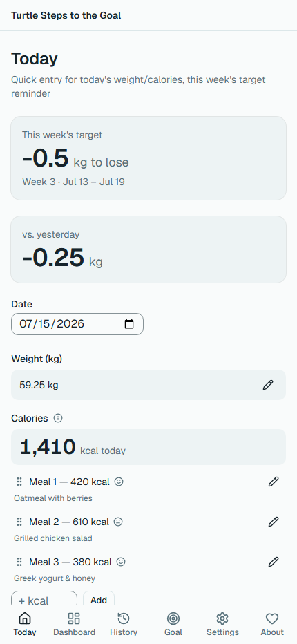
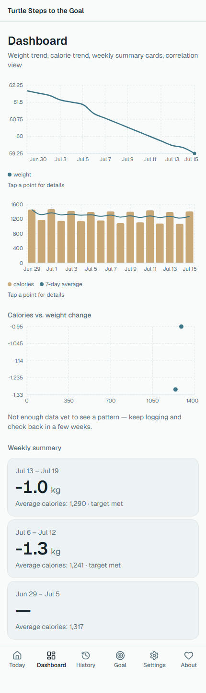

# Turtle Steps to the Goal

A small, personal weight-tracking app built around one idea: change happens through small, steady steps — not big, pressured goals.

There's no long-term target to chase, no streaks to protect, no badges to collect. Just this week's small step, one day at a time: set a weekly pace, log today's weight and calories, watch the trend.

**Live app:** [zhannam85.github.io/turtle-steps-to-the-goal](https://zhannam85.github.io/turtle-steps-to-the-goal/)

Local-first — no backend, no accounts, no telemetry. All your data stays on your own device, in the browser's IndexedDB.

## Screenshots

| Today | Dashboard |
|---|---|
|  |  |

## Tech stack

- React 19 + TypeScript (strict) + Vite
- Tailwind CSS v4
- IndexedDB via [Dexie](https://dexie.org/), behind a repository interface (see `docs/ARCHITECTURE.md`)
- Zustand for UI/session state
- React Hook Form + Zod for forms/validation
- Recharts for the Dashboard charts
- English and Russian localization
- Vitest + React Testing Library

## Development

```bash
npm install
npm run dev      # start the dev server
npm test         # run the test suite
npm run lint      # lint
npm run build     # typecheck + production build
```

Deploys automatically to GitHub Pages on push to `main` (`.github/workflows/deploy-pages.yml`).

## More

- `docs/ARCHITECTURE.md` — how the codebase is structured and why.
- `docs/issues-priority.md` — the work queue, in order.
- `PROJECT_BRIEF.md` — the original product brief.
