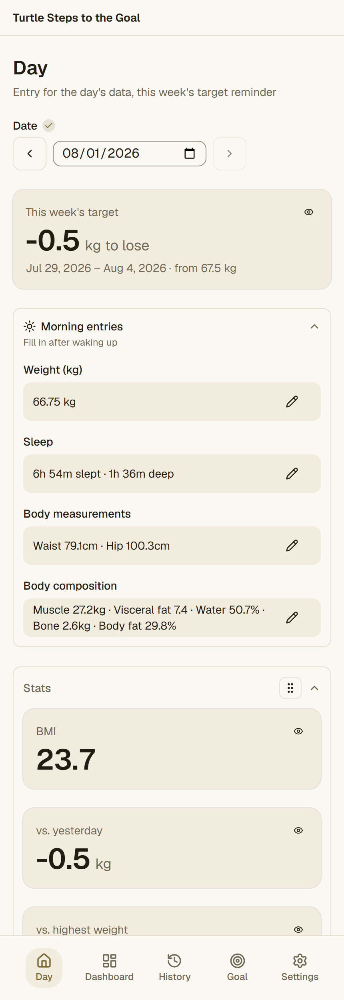
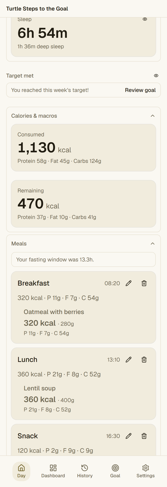
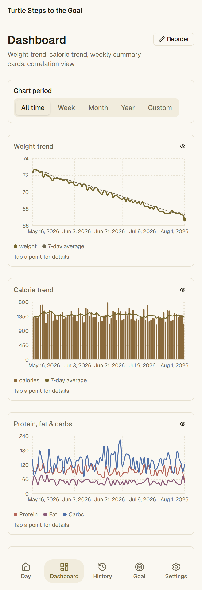
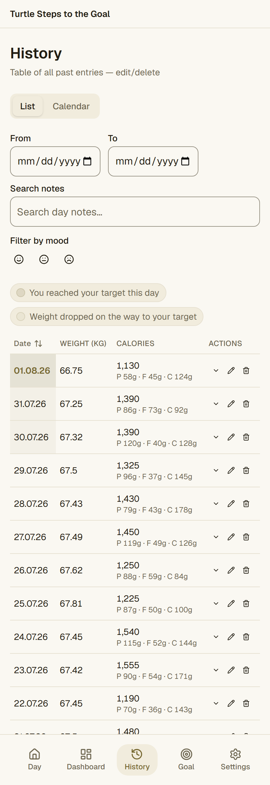

# Turtle Steps to the Goal

A private, local-first companion for understanding weight, nutrition, and the
everyday factors around them. Turtle Steps brings meals, macros, hydration,
sleep, activity, body measurements, and your own custom metrics together
without turning progress into a competition.

There is no distant target to chase, no streak to protect, and no badge to
collect. Set a gentle weekly pace, log what matters to you, and use trends and
correlations to learn what helps over time.

**Live app:** [zhannam85.github.io/turtle-steps-to-the-goal](https://zhannam85.github.io/turtle-steps-to-the-goal/)

Local-first — no backend, no accounts, no telemetry, and no AI. All your data
stays on your own device in the browser's IndexedDB.

## What it can do

- Log weight, meals, calories, macros, fiber, water, sleep, steps, mood, notes,
  cycle and digestion signals, body measurements, and body composition.
- Search the built-in food database, save personal foods, scan barcodes, and
  build reusable multi-ingredient recipes.
- Set weekly weight-change goals and optional daily nutrition and hydration
  targets.
- Explore trends, calendar history, weekly/monthly summaries, and fixed or
  user-defined correlations.
- Create custom metrics for anything else you want to observe.
- Import data from Zepp Life, Apple Health, and MyFitnessPal; export backups,
  Excel, CSV, or Markdown.
- Use the installable PWA in English or Russian, with light/dark mode and
  several color themes.

## Screenshots

| Day | Meals, water & custom metrics |
|---|---|
|  |  |
| **Dashboard** | **History** |
|  |  |

The screenshots use deterministic demo data. Regenerate them with
`node scripts/capture-screenshots.mjs` after installing Playwright's Chromium
once with `npx playwright install chromium`.

## Tech stack

- React 19 + TypeScript (strict) + Vite
- Tailwind CSS v4
- IndexedDB via [Dexie](https://dexie.org/), behind a repository interface (see `docs/ARCHITECTURE.md`)
- Zustand for UI/session state
- React Hook Form + Zod for forms/validation
- Recharts for the Dashboard charts
- English and Russian localization
- Vitest + React Testing Library

## Development

```bash
npm install
npm run dev      # start the dev server
npm test         # run the test suite
npm run lint      # lint
npm run build     # typecheck + production build
```

Deploys automatically to GitHub Pages on push to `main` (`.github/workflows/deploy-pages.yml`).

## More

- [`docs/ARCHITECTURE.md`](docs/ARCHITECTURE.md) — how the codebase is structured and why.
- [`docs/issues-priority.md`](docs/issues-priority.md) — the work queue, in order.
- [`PROJECT_BRIEF.md`](PROJECT_BRIEF.md) — the original product brief.
