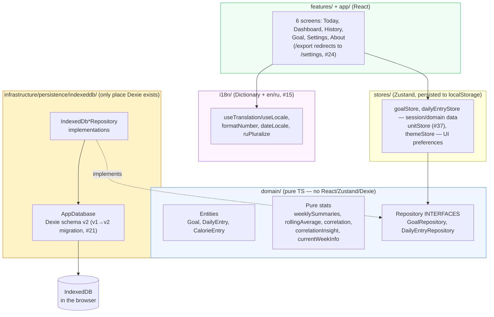
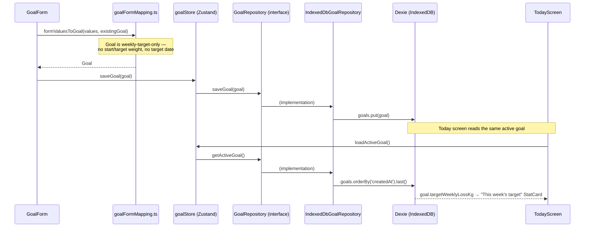

# Turtle Steps to the Goal — Architecture

This document is updated after each issue is completed. It explains what every file does, why it exists, and how the pieces connect.

Product context lives in `PROJECT_BRIEF.md`; the work queue lives in `docs/issues-priority.md`; the public-facing overview (screenshots, live link, dev setup) lives in `README.md` (#58).

---

## System Overview

Turtle Steps to the Goal is a local-first weight-tracking companion built around small, weekly goals rather than one distant number: set a weekly pace, log today's weight and calories, watch the trend. Everything runs in the browser — no backend, no accounts, no telemetry. All data lives in the user's own IndexedDB.

The codebase follows Clean Architecture layering with feature-based folders:

**The one dependency rule that matters:** `domain/` imports nothing from React, Zustand, or Dexie. Features and stores talk to persistence only through the repository interfaces, so a future sync backend would mean writing `Api*Repository` implementations, not a rewrite of stores or components. `i18n/` is a UI-layer concern (it exports React hooks) and sits alongside `stores/`, not inside `domain/`.

**A known simplification vs. sibling projects:** stores and `exportActions.ts` each instantiate `new IndexedDbGoalRepository()` / `new IndexedDbDailyEntryRepository()` directly at module scope, rather than through a swappable factory/DI seam (compare `life-kaleidoscope`'s `getRepositories()`/`setRepositories()`). `Dashboard`'s and `History`'s data hooks (`useDashboardData`, `useHistoryData`) follow the same direct-instantiation pattern rather than routing through `dailyEntryStore`, since neither screen needs single-entry session state — they need "all entries," which the shared stores don't model. Fine while IndexedDB is the only implementation that exists; revisit if a second backend is ever built.

**Three separate preference stores, not one:** display unit (`unitStore`), mood/color-scheme (`themeStore`), and locale (`i18n/localeStore.ts`) are three independent Zustand stores with three independent `localStorage` keys (`turtle-steps-unit`, `turtle-steps-theme`, `turtle-steps-locale`), split across `src/stores/` and `src/i18n/` rather than one unified preferences store. Not a problem in practice, but worth knowing before assuming a single "settings" state object exists anywhere.

---

## Data Flow — setting a goal, then logging today against it

`getActiveGoal()` is "most recently created goal" — there is no explicit active/inactive flag; saving a new goal (or the same goal's id again) always becomes the one Today reads. `DailyEntry` saves follow the identical shape through `dailyEntryStore` → `DailyEntryRepository` → `IndexedDbDailyEntryRepository`, keyed by the entry's `date` (a unique Dexie index — one entry per date, upserted by `put`).

**Display unit is not part of this flow.** `Goal` has no `displayUnit` field (removed in #37) — kg/lb is a UI-only preference read from `unitStore` and applied at render time via a local `toDisplay(kg)` helper in every screen that shows a weight-derived number (`TodayScreen`, `GoalScreen`, `DashboardScreen`'s charts, `HistoryScreen`'s rows/detail). The stored value is always kg, everywhere.

---

## Module Reference

### Domain layer (`src/domain/`)

Pure TypeScript. Unit-testable with no DOM. If a file here ever needs `react`, `zustand`, or `dexie`, the logic belongs in `infrastructure/` or `features/` instead.

#### `src/domain/goal/`

| File | Purpose |
|------|---------|
| `Goal.ts` | The entity: `id`, `targetWeeklyLossKg` (the only target concept — this week's pace, set and renewed week to week), `createdAt`/`updatedAt`. **No `displayUnit`** (moved to `unitStore`, #37) and **no long-term target weight or target date** (removed in #14) — the product's small-steps framing means the app never shows a distant "big goal" number, only the current week's target. |
| `GoalRepository.ts` | Interface: `getActiveGoal()`, `saveGoal(goal)`, `getAll()` (`getAll` added for Epic 8 export). |
| `calorieDeficit.ts` | `estimatedDailyCalorieDeficitKcal(targetWeeklyLossKg)` — the brief's ~7700 kcal-per-kg-of-fat approximation, explicitly labeled non-medical everywhere it's surfaced in the UI. |
| `units.ts` | `lbToKg` / `kgToLb` — pure conversion, `KG_PER_LB = 0.45359237`. Used both by `GoalForm`'s form-mapping and by every screen's `toDisplay()` unit conversion. |
| `index.ts` | Barrel. |

#### `src/domain/dailyEntry/`

| File | Purpose |
|------|---------|
| `DailyEntry.ts` | The entity: one row per `date` (ISO string, unique). `weightKg?`, `note?`, `emotion?: Emotion` (the **day's overall mood**, distinct from any meal's own emotion — #44; `Emotion = 'happy' \| 'unhappy' \| 'neutral'`, unchanged by #54), `calorieEntries?: CalorieEntry[]` — itemized per-meal list (#21), replacing the original single `caloriesConsumed` number. `CalorieEntry` (same file): `id`, `amountKcal`, `note?` (per-meal text, #28), `emotion?: MealEmotion` (per-meal reaction, #28 — since #54 a **separate, smaller set**: `MealEmotion = 'thumbsUp' \| 'thumbsDown' \| 'bellissimo'`, no longer sharing `Emotion` with the day's mood), `proteinG?`/`fatG?`/`carbsG?` (macros, #51 — each independent and optional, same as note/emotion), `createdAt`. |
| `totalCalories.ts` | `totalCalories(entries)` — sums a day's `calorieEntries`; returns `undefined` (not `0`) when there are none, so "no data" and "logged zero" stay distinguishable everywhere this is displayed. |
| `totalMacros.ts` | `totalProtein`/`totalFat`/`totalCarbs` (#51) — same "undefined, not 0" convention as `totalCalories`, but per-macro: a meal that logged kcal but not protein is skipped when summing protein, not treated as 0g. |
| `DailyEntryRepository.ts` | Interface: `getByDate(date)`, `getRange(start, end)`, `upsert(entry)`, `delete(id)`, `getAll()`, `getEarliestDate()` (added for #18 — a cheap indexed lookup, not a full-table scan, used by `useCurrentWeekInfo`). |
| `index.ts` | Barrel. |

#### `src/domain/mealItem/` — new in #50

A reusable meal-name library, deliberately **not** a foreign key from `CalorieEntry.note`.

| File | Purpose |
|------|---------|
| `MealItem.ts` | `{ id, name, createdAt, updatedAt }`. Renaming or deleting one never touches already-logged `CalorieEntry.note` text — those are independent strings, not references. |
| `MealItemRepository.ts` | Interface: `getAll()`, `findByName(name)`, `upsert(item)`, `delete(id)`. |
| `index.ts` | Barrel. |

#### `src/domain/stats/`

Pure functions with unit tests covering edge cases (missing days, single data point, no variance). Now consumed by both `Dashboard` (#6/#7) and `History` (#8) — no longer library-only.

| File | Purpose |
|------|---------|
| `weeklySummaries.ts` | Groups entries into ISO weeks (Monday–Sunday, via `date-fns` `startOfISOWeek`/`endOfISOWeek`). Per week: `averageWeightKg`, `averageCalories` (via `totalCalories`, `null` if no entries have calories that week), `deltaVsPriorWeekKg` (vs. the previous week's average), and `targetMet` (whether the actual loss met `goal.targetWeeklyLossKg` — `null` without a goal or a prior week to compare). Powers `WeeklySummaryCards` and `MetTargetList`. |
| `rollingAverage.ts` | `rollingAverage(entries, field, windowDays)` — trailing-window average per distinct date present in the data. `field` accepts either a literal `DailyEntry` key or an extractor function, which is what lets `CalorieTrendChart` roll-average the *derived* `totalCalories()` value rather than a raw stored field. A day with no qualifying values in its window gets `average: null` rather than being dropped. |
| `correlation.ts` | Plain Pearson correlation coefficient between weekly average calories and that week's weight change. `null` when there are fewer than two comparable weeks or no variance in either axis. Not directly rendered anywhere — `correlationInsight.ts` is what actually backs the UI. |
| `correlationInsight.ts` | The plain-language companion to `correlation.ts` that `CorrelationView` (#7) actually uses: splits comparable weeks into lower-/higher-calorie halves by median (needs `MIN_COMPARABLE_WEEKS = 4`), reports which half averaged more loss and a rounded `thresholdKcal` — arithmetic, not statistics, on purpose. |
| `currentWeekInfo.ts` | `currentWeekInfo(today, earliestEntryDate)` — computes which week "today" is, numbered from the week containing the *earliest logged entry* (Week 1), not from goal-creation date (goals have no start date and can be renewed freely, per #14). Backs `useCurrentWeekInfo` (#18). |
| `index.ts` | Barrel. |

**History:** `projectedTrajectory.ts` was removed in #14 (it depended on `Goal` fields that no longer exist). #6 later added a new pace-based overlay, `projectedPaceTrajectory`, to `WeightTrendChart` — which #46 then removed outright per live feedback (no projection/prognosis line at all today; `WeightTrendChart` no longer takes a `goal` prop).

---

### Persistence layer (`src/infrastructure/persistence/indexeddb/`)

The only folder allowed to import Dexie.

#### `db.ts`
**Why it exists:** Single definition of the IndexedDB schema, now on its second version.

| Version | Change |
|---------|--------|
| 1 | `goals: 'id, createdAt'`, `dailyEntries: 'id, &date'` (`&date` unique — one entry per date at the storage level). |
| 2 (#21) | Same store shape (no index changes) + an `.upgrade()` block: for each `dailyEntries` row, if a legacy `caloriesConsumed` number exists and no `calorieEntries` yet, it's wrapped into a single-item `calorieEntries` array (new `crypto.randomUUID()` id, reuses the row's `createdAt`), then `caloriesConsumed` is deleted. |
| 3 (#50) | Adds `mealItems: 'id, &name'` (`&name` unique). New store only, no `.upgrade()` needed — nothing pre-existing to migrate. |
| 4 (#54) | Same store shape (no index changes) + an `.upgrade()` block: strips `emotion` from every item in each `dailyEntries` row's `calorieEntries[]` (old happy/unhappy/neutral values don't map to the new thumbsUp/thumbsDown/bellissimo set — cleared outright, no auto-mapping). The row's own top-level `emotion` (day mood) is untouched. |

Database name: `turtle-steps-to-the-goal`. `db.migration.test.ts` seeds a raw v1-schema Dexie instance with a legacy `caloriesConsumed` row plus an untouched `weightKg`-only row, then opens the real `db` and asserts the upgrade did exactly the expected transformation and nothing more.

#### `goalRepository.ts` — `IndexedDbGoalRepository`
`getActiveGoal()` = `db.goals.orderBy('createdAt').last()` (most recently created). `saveGoal()` = `put` (insert or overwrite by id). `getAll()` = full table ordered by `createdAt`, added for Epic 8 export.

#### `dailyEntryRepository.ts` — `IndexedDbDailyEntryRepository`
`getByDate` uses the unique `date` index. `getRange` uses `.between(start, end, true, true)` (inclusive both ends) sorted by date. `upsert` is a `put`. `getAll` is ordered by date, added for Epic 8 export. `getEarliestDate()` (added for #18) is a cheap indexed lookup for the single earliest `date`, not a full scan.

#### `mealItemRepository.ts` — `IndexedDbMealItemRepository` (#50)
`getAll()` = `orderBy('name')`. `findByName()` uses the unique `name` index — the basis for upsert-by-name (`touch`) in `mealItemStore`, since `.put()` on a unique index throws if you try to insert a colliding name under a different primary key.

#### `index.ts`
Barrel: `db`, `AppDatabase`, `IndexedDbGoalRepository`, `IndexedDbDailyEntryRepository`.

---

### State layer (`src/stores/`)

Zustand. `goalStore`/`dailyEntryStore` own session/domain data (always flowing through the repository interfaces, never through Dexie directly); `unitStore`/`themeStore` own persisted UI preferences (`localStorage`, via Zustand's `persist` middleware — no IndexedDB involvement).

| File | Purpose |
|------|---------|
| `goalStore.ts` | `useGoalStore`: `goal`, `status` (`idle/loading/ready/error`), `error`, `loadActiveGoal()`, `saveGoal(goal)`. Instantiates `IndexedDbGoalRepository` once at module scope. |
| `dailyEntryStore.ts` | `useDailyEntryStore`: `date`, `entry`, `status`, `error`, `loadEntry(date)`, `saveEntry(entry)`. Same shape as `goalStore`. |
| `unitStore.ts` | `useUnitStore` (#37): `unit: 'kg' \| 'lb'`, `setUnit`. Persisted to `localStorage` (`turtle-steps-unit`). This is the kg/lb toggle that used to live on the Goal page — now global, read by `TodayScreen`, `GoalScreen`, `DashboardScreen`'s charts, and every `History` weight display. |
| `mealItemStore.ts` | `useMealItemStore` (#50): `items`, `status`, `loadItems()`, `touch(name)` (upsert-by-name — creates on first use, else just bumps `updatedAt`; trims and no-ops on empty), `rename(id, name)` (merges into an existing item if the new name collides, rather than throwing on the unique index), `deleteItem(id)`. Not persisted to `localStorage` — this is domain data in IndexedDB, unlike `unitStore`/`themeStore`. |
| `themeStore.ts` | `useThemeStore`: `mood` (`'pond' \| 'dusk' \| 'sage' \| 'tortoise' \| 'lagoon'`, #17), `colorScheme` (`'light' \| 'dark'`), `setMood`, `setColorScheme`. Persisted (`turtle-steps-theme`). Exports `detectDefaultColorScheme()` and `applyTheme()` (sets `data-mood` + toggles `.dark` on `<html>`); `applyTheme()` also runs eagerly at module-import time to stay in sync with an inline pre-paint script in `index.html` that avoids a flash of the wrong theme on load. |
| `index.ts` | Barrel — exports all four stores plus `Mood`/`ColorScheme`/`Unit` types. |

Locale is **not** here — see `src/i18n/localeStore.ts` below.

---

### Internationalization (`src/i18n/`) — Epic/issue #15

New layer since the app's first localization pass. English and Russian, with the locale itself persisted like a UI preference (but structurally separate from `src/stores/` — see the "three preference stores" note above).

| File | Purpose |
|------|---------|
| `Dictionary.ts` | The `Dictionary` interface — one section per feature area (`common`, `nav`, `today`, `dailyEntry`, `goal`, `export`, `dashboard`, `history`, `settings`, `about`). Several entries are functions rather than plain strings, for pluralization/interpolation (e.g. `common.weekLabel(weekNumber, start, end)`, `dailyEntry.mealLabel(n)`, `dailyEntry.emotionLabel(emotion)`, `goal.deficitEstimate(kcal, direction)`, `dashboard.correlationSummary(thresholdKcal, direction)`). |
| `en.ts` / `ru.ts` | Full `Dictionary` implementations for each locale. |
| `localeStore.ts` | `Locale = 'en' \| 'ru'`. `useLocaleStore` (Zustand + `persist`, `localStorage` key `turtle-steps-locale`, default from `detectDefaultLocale()` sniffing `navigator.language`). Free functions `getDictionary(locale)`; hooks `useTranslation()` (full `Dictionary` for the current locale) and `useLocale()` (just the `Locale` string). `SettingsScreen` is the only place that calls `setLocale`. |
| `dateLocale.ts` | `getDateFnsLocale(locale)` — maps to `date-fns/locale`'s `enUS`/`ru`, used everywhere `date-fns format()` needs localized month/weekday names. |
| `formatNumber.ts` | `formatNumber(value, locale, fractionDigits = 1)` and `formatSignedNumber(value, locale)` (always shows an explicit +/−) — both via `Intl.NumberFormat` with `ru-RU`/`en-US`, so Russian gets a decimal comma automatically. `formatExactNumber(value, locale)` (#57, `minimumFractionDigits: 0, maximumFractionDigits: 2`) is for values that were directly entered or are a plain subtraction of two entered values (e.g. weight), where the fixed-1-decimal formatters would round away what the user actually typed — a whole number stays unpadded ("60", not "60.0"), and the max-2 cap both covers typical entered precision and rounds away floating-point subtraction noise. Computed/averaged values (weekly summaries, chart axes) intentionally keep using `formatNumber`'s fixed decimal count. |
| `unitLabel.ts` | `unitLabel(unit, dictionary)` → `t.common.kg` / `t.common.lb`. |
| `ruPluralize.ts` | Standalone Russian plural-form selector (1 / 2–4 / 5+, with the 11–14 exception) for count-based Russian copy. |
| `index.ts` | Barrel. |

---

### Features (`src/features/`)

#### `goal-setup/` — Epic 3, issue #4; reworked to weekly-only in #14

| File | Purpose |
|------|---------|
| `goalFormSchema.ts` | Zod schema: `targetWeeklyLoss` (optional at the type level, required via `superRefine` with a custom message — same pattern as `dailyEntryFormSchema`, so Zod's default NaN/required error text never has to be relied on). No unit field in the schema — see below. |
| `goalFormMapping.ts` | `goalToFormValues` (Goal → form, converts to the *display* unit read from `useUnitStore` — the unit itself is a caller-supplied argument, not read from `Goal`), `formValuesToGoal` (form → Goal, converts back to kg), `effectiveWeeklyPaceKg` (live pace preview from possibly-incomplete form state, used for the on-screen calorie-deficit estimate as the user types). |
| `GoalForm.tsx` | RHF + `zodResolver`. A single "This week's target" `NumberInput` — **no unit toggle** (moved to Settings in #37; the form reads the current unit from `useUnitStore` for display/conversion only). Shows the rough daily-calorie-deficit estimate live, captioned non-medical. |
| `GoalScreen.tsx` | Loads the active goal on mount, shows a `StatCard` summary (the weekly target, week-range description via `useCurrentWeekInfo`) when one exists, renders `GoalForm` underneath either way. |
| `index.ts` | Barrel. |

#### `daily-log/` — Epic 4, issue #5; substantially rebuilt across #21/#28/#31/#36/#42/#44

No longer a simple single-submit form. Current shape:

| File | Purpose |
|------|---------|
| `dailyEntryFormSchema.ts` | Zod schema; `weightSchema` (20–400kg), `noteSchema`, per-meal `calorieEntrySchema` (`amountKcal` 0–10000, optional `note`/`emotion`). No longer requires "at least one of weight or calories" — see #31 below. |
| `dailyEntryFormMapping.ts` | `entryToFormValues`, `formValuesToEntry`. |
| `DailyEntryForm.tsx` | The big one. Weight and Note render **read-only with a pencil-to-edit toggle** once saved (#21), rather than always-editable inputs — except when the `alwaysEditable` prop is set (used by History's inline edit, where "Edit entry" is already the explicit edit gesture). **No single submit button** (#31): Weight, Note, and each meal save independently and immediately via `onSave`, which can fire many times in one session. Calorie entries are itemized (`CalorieEntry[]`, #21) with a "+ kcal" quick-add row (note + `EmotionPicker` inline), per-meal edit/delete, and **drag-and-drop reordering** via `@dnd-kit/core` + `@dnd-kit/sortable` (#36, pointer + keyboard sensors, grip handle per row). `EmotionPicker` is generic over both emotion sets (`<E extends string>`, taking `options`/`labelFor` props) — the day's overall mood (`DailyEntry.emotion`, #44) uses `DAY_EMOTIONS` (`Smile`/`Meh`/`Frown`), a meal's own reaction uses `MEAL_EMOTIONS` (thumbs up/down + "bellissimo" as the 🤌 emoji, #54) — two different sets since #54 split them, disambiguated (when both pickers are visible at once) by an ARIA `contextLabel`. Both the add-meal and edit-meal note inputs share a single `<datalist>` (`#50`, `MEAL_ITEMS_DATALIST_ID`) populated from `useMealItemStore`, offering previously-used meal names as native browser autocomplete; saving a meal with a non-empty note calls `touch(name)` to upsert it into the library. Its `<option>` elements deliberately have **no text children** (`value` only) — an earlier version rendered the name as visible text too, which caused real `getByText` collisions in tests once a saved note became a library entry with matching text elsewhere on the page (found while building #51). A labeled kcal/protein/fat/carbs row (#51) sits above the note/emotion row in both add and edit flows, plus a per-meal and a per-day macro summary line (`macrosSummary`, "Protein Xg · Fat Yg · Carbs Zg", `—` per macro not logged) next to the existing kcal total. |
| `TodayScreen.tsx` | A native `<input type="date">` (capped at today via `max`) drives which date's entry is loaded/edited. Shows "This week's target" `StatCard` (via `useCurrentWeekInfo`) or an `EmptyState` pointing at `/goal` when no goal exists. A second `StatCard` shows the day-over-day weight delta (#42, via `usePreviousDayEntry`) with asymmetric emphasis — bold for a loss, muted for a gain/no-change, matching #29's treatment. A quiet end-of-week banner (#38) nudges toward `/goal` on the last day of the ISO week, no dismiss state. `key={date}` on `DailyEntryForm` forces a clean remount per date. |
| `index.ts` | Barrel. |

#### `dashboard/` — Epic 5/6, issues #6/#7 (done)

Fully built; no longer a placeholder.

| File | Purpose |
|------|---------|
| `DashboardScreen.tsx` | Loads data via `useDashboardData`; renders `WeightTrendChart`, `CalorieTrendChart`, `CorrelationView`, `WeeklySummaryCards` in order, or an `EmptyState` with zero entries. |
| `useDashboardData.ts` | Direct-repository hook (not routed through `dailyEntryStore` — see the "known simplification" note above): fetches all entries via `IndexedDbDailyEntryRepository.getAll()` plus the active goal via `useGoalStore`. |
| `WeightTrendChart.tsx` | Recharts `LineChart` of weight over time, unit-aware via `unitStore`. Tap/click on a point navigates to `/history?date=...` (#41) via `chartNavigation.ts`; no projection line (#46 removed the pace-projection overlay #6 had originally added). |
| `CalorieTrendChart.tsx` | Recharts `ComposedChart`: daily calorie `Bar` + 7-day rolling-average `Line` overlay (via `rollingAverage()` with an extractor for `totalCalories()`). Same deep-link-on-tap pattern as the weight chart. |
| `CorrelationView.tsx` | Recharts `ScatterChart` of weekly avg calories vs. that week's weight delta, plus the plain-language summary from `correlationInsight()` and an explicit day-lag caveat. |
| `WeeklySummaryCards.tsx` | One `StatCard` per ISO week from `weeklySummaries()`, most-recent-first; asymmetric emphasis (bold loss, muted gain/no-change, #29) and no plus sign on gains (#34); a quiet "target met" note, deliberately not a badge. |
| `chartNavigation.ts` | `resolveChartClickDate()` — resolves a Recharts click/hover event into a valid History date or `null` by looking the label up in the chart's own `data` array, rather than trusting Recharts' `activePayload`/`activeDataKey` (documented as unreliable on combo charts). Root-caused and fixed across #41/#45/#49 — tapping now only navigates via an explicit in-tooltip link (`wrapperStyle={{pointerEvents:'auto'}}`), not any tap on the chart area, so the chart stays usable for just viewing. |
| `index.ts` | `DashboardScreen` only. |

#### `history/` — Epic 7, issue #8 (done)

Also fully built.

| File | Purpose |
|------|---------|
| `HistoryScreen.tsx` | Owns filter state (From/To date range, #40; `?date=` deep-link prefill from Dashboard, #41) and a List/Calendar `ToggleGroup` view switcher (#48). Renders `MetTargetList`, then either `CalendarView` or the sortable, filterable table of `EntryRow`s. |
| `useHistoryData.ts` | Same direct-repository pattern as `useDashboardData`; exposes `saveEntry`/`deleteEntry` that call the repository then reload. |
| `CalendarView.tsx` | Month-grid calendar (#48, Monday-start), a marker on days with an entry, tap-a-day opens a read-only `DayDetail` panel; an "Edit this day" action hands off to `HistoryScreen`'s List view pre-filtered/expanded to that date. |
| `DayDetail.tsx` | Shared read-only day-detail renderer — meals, notes, emotions, and the day's overall mood (#39, extended for #44, reused by both `EntryRow`'s expand panel and `CalendarView`'s day panel). A `standalone` prop adds a date/weight/calories header for contexts (calendar) that don't already show that summary elsewhere; that header also gets the day's macro total (#52). Each meal shows its own macro summary line too (below its note), independent of the day total. |
| `EntryRow.tsx` | One table row with `view / edit / confirmDelete` modes. Edit mode swaps in `DailyEntryForm` (`alwaysEditable`); expand/collapse toggles `DayDetail`; supports `defaultExpanded` for the Dashboard deep-link case. The Calories cell also shows the day's macro total as a muted line beneath the kcal number (#52), omitted when nothing was logged. |
| `MetTargetList.tsx` | A plain list of weeks where the target was met — explicitly not gamified, no badges. |
| `index.ts` | `HistoryScreen` only. |

#### `settings/SettingsScreen.tsx` — issues #37/#43 (done)

Fully built, redesigned in #43 around a consistent `Card`-per-section layout with the shared `ToggleGroup` primitive replacing raw radios everywhere:

1. **Units** — `ToggleGroup` bound to `useUnitStore` (kg/lb) — landed here from the Goal page in #37.
2. **Language** — `ToggleGroup` bound to `useLocaleStore` (en/ru).
3. **Appearance** — 5 mood swatches bound to `useThemeStore.mood`, plus a light/dark `ToggleGroup` bound to `colorScheme` (#17).
4. **Meal items** (#50) — `MealItemsSection.tsx`: lists every `MealItem` from `useMealItemStore`, each row an inline-editable name (commits on blur/Enter via `rename()`) + a delete button. Empty state when nothing's been logged yet.
5. **Export** — embeds `<ExportSection />` (from `features/export`) inside a `Card`, folding what used to be a standalone `/export` route into Settings (#24).
6. **Release notes** (#63) — `ReleaseNotesSection.tsx`: collapsed by default (same chevron-toggle pattern as History's row expand, `#39`), reveals brief bilingual entries from `src/data/releaseNotes.ts` (`{ issue, date, en, ru }[]`, most-recent-first) when opened. That data file is a new top-level `src/data/` folder — plain static content, not a domain entity or a repository-backed concern, so it sits outside `domain/`. **Updating it is now a required step whenever a GitHub issue closes** (see `CLAUDE.md`), alongside `docs/issues-priority.md` and this file.

#### `export/` — Epic 8, issue #9; folded into Settings in #24, schema bumped in #21

| File | Purpose |
|------|---------|
| `exportBundleSchema.ts` | Current schema is **`version: 4`** (bumped from 3 for #54's meal-emotion split). Two parallel legacy schemas are kept alongside it so old backup files stay importable: `exportBundleSchemaV3` (meal `emotion` still using the day's happy/unhappy/neutral set) and `exportBundleSchemaV2` (flat `caloriesConsumed: number`, pre-#21). |
| `exportBundle.ts` | `buildExportBundle(goals, dailyEntries)` — stamps `version: 4` + `exportedAt`. |
| `exportActions.ts` | `exportAllData()` (reads both repositories' `getAll()`), `importAllData(bundle)` (upserts every goal/entry — merge, not destructive replace), `parseExportBundle(raw)` — tries the current v4 schema first, falls back to v3 (clears old-format meal emotions, same policy as the IndexedDB v3→v4 migration) then v2 (wraps `caloriesConsumed`), otherwise throws `InvalidBackupFileError` with a user-facing message. |
| `ExportSection.tsx` | The export/import UI as a `Card`-content fragment (no `PageHeader` — it's meant to be dropped inside Settings' own `Card`, not rendered as a standalone screen anymore). Export downloads a JSON file via `Blob` + a synthetic anchor click; import is a hidden file input. Reports counts via a hand-written pluralizer, not a naive `+'s'`. |
| `index.ts` | `ExportSection` only — no `ExportScreen` anymore. |

#### `about/AboutScreen.tsx` — issue #23 (new feature area)

Static page: project intro/philosophy/privacy copy from the dictionary, an author credit linking to `github.com/ZhannaM85` (#35). Reachable via the "Heart" nav item, in the tab-bar slot #24 freed by folding Export into Settings.

---

### App shell & routing (`src/app/`, `src/main.tsx`)

| File | Purpose |
|------|---------|
| `router.tsx` | `createBrowserRouter`, all screens nested under `AppShell`: `/` (Today), `/dashboard`, `/history`, `/goal`, `/settings`, `/about` (#23), and `/export` → `<Navigate to="/settings" replace />` (#24 — kept as an explicit redirect for anyone with the old route bookmarked, rather than a dead link). `basename: import.meta.env.BASE_URL` so routes resolve correctly under the GitHub Pages subpath. |
| `AppShell.tsx` | One shared `useNavItems(t)` array (Today/Dashboard/History/Goal/Settings/About — no Export entry) drives both a header `<nav aria-label="Main">` (hidden below `sm:`, **sticky** — `sticky top-0 z-10 border-b border-border bg-background`, #25) and a fixed bottom `<nav aria-label="Tabs">` tab bar (visible only below `sm:`, `lucide-react` icon + label per route, `env(safe-area-inset-bottom)` padding). `<main>` gets `pb-28 sm:pb-10` so content clears the fixed bar on mobile. |
| `index.ts` | Barrel. |
| `src/main.tsx` | Entry point: `StrictMode` + `RouterProvider`. |

---

### Design system (`src/shared/ui/`) — Epic 2, issue #3; extended by #12/#16/#43

shadcn-style primitives (Nova preset, `radix-ui` primitives, `cva` variants, aliases at `@/shared/ui`).

| File | Exports | Notes |
|------|---------|-------|
| `button.tsx` | `Button`, `buttonVariants` | Variants: `default/outline/secondary/ghost/destructive/link`; sizes incl. icon variants. |
| `card.tsx` | `Card` + `Header/Title/Description/Content/Footer/Action` | Standard shadcn card family, now the standard section wrapper across Settings/Dashboard/History (#43). |
| `input.tsx` | `Input` | Bare styled `<input>`. |
| `label.tsx` | `Label` | Radix `Label.Root` wrapper. |
| `text-field.tsx` | `TextField` | Labeled input with `hint`/`error`, wires `aria-invalid`/`aria-describedby`, id via `useId`. |
| `number-input.tsx` | `NumberInput` | Same labeled-field pattern as `TextField`, plus a unit suffix slot and an optional `InfoTooltip` (#16). Renders `type="text"` `inputMode="decimal"` (issue #12 — was `type="number"`, which silently rejected the comma decimal separator on some mobile keyboards/locales; pairs with `parseNumberInput()` accepting both `.` and `,`). |
| `info-tooltip.tsx` | `InfoTooltip` | Radix `Popover`-based tap-triggered info icon (#16) — e.g. the Calories field's day-lag-with-weight explanation. |
| `toggle-group.tsx` | `ToggleGroup`, `ToggleGroupItem` | Radix `ToggleGroup` wrapper (#43) — replaces raw radio inputs for unit/language/mood/color-scheme (Settings) and List/Calendar (History) toggles. |
| `stat-card.tsx` | `StatCard` | Large numbers-first card: label, big value + unit, optional description — the brief's "numbers should be the largest things" directive as a primitive. |
| `empty-state.tsx` | `EmptyState` | Calm empty screen (icon/title/description/action) — no guilt copy, per brief §2. |
| `page-header.tsx` | `PageHeader` | `h1` + description + right-aligned action slot; every screen opens with one. |

### Shared (`src/shared/`)

| File | Purpose |
|------|---------|
| `lib/utils.ts` | `cn()` — `clsx` + `tailwind-merge`. |
| `lib/emotionIcons.ts` | `DAY_EMOTIONS: { value: Emotion; Icon: LucideIcon }[]` — happy/neutral/unhappy → `Smile`/`Meh`/`Frown`, real lucide icons. `MEAL_EMOTIONS: { value: MealEmotion; Icon?: LucideIcon; emoji?: string }[]` (#54) — **all three are emoji** (👍/👎/🤌), not lucide icons: `ThumbsUp`/`ThumbsDown` were tried first, but two monochrome line icons next to bellissimo's 🤌 (no lucide equivalent exists) looked inconsistent side by side, so all three switched to emoji for visual consistency within this one picker (#64) — at the cost of no longer matching the app's lucide-icon system the way `DAY_EMOTIONS` still does. Both consumed by `DailyEntryForm` and `DayDetail`. |
| `lib/parseNumberInput.ts` | `parseNumberInput(value)` — normalizes both `.` and `,` decimal separators into a number for React Hook Form's `setValueAs`; empty input → `undefined` (not `NaN`), so Zod's `.optional()` behaves correctly. Ties into #12's mobile-decimal fix. |
| `hooks/useCurrentWeekInfo.ts` | Fetches only `getEarliestDate()` (not a full scan) and derives `CurrentWeekInfo` (week number/range) via `domain/stats/currentWeekInfo`. Shared by `TodayScreen` and `GoalScreen` (#18). |
| `hooks/usePreviousDayEntry.ts` | Fetches the `DailyEntry` for `date − 1 day`, backing the day-over-day weight-delta stat on `TodayScreen` (#42) — a distinct, unsmoothed number from the week-over-week delta in `weeklySummaries`. |
| `hooks/index.ts` | Barrel. |
| `lib/macroDisplay.ts` | `formatMacroGrams`/`macrosSummaryText` (#51/#52) — shared macro-formatting, extracted from `DailyEntryForm.tsx` for reuse once `EntryRow`/`DayDetail` also needed to show macro totals. `macrosSummaryText` returns `null` when none of protein/fat/carbs were logged at all, so callers can skip rendering a line entirely rather than showing an all-dashes one. |

---

### Tests

Vitest + jsdom + `fake-indexeddb` + React Testing Library + `@testing-library/user-event`. **340 tests across 53 files**, all passing as of issue #52.

| Area | Covers |
|------|--------|
| `domain/goal/*.test.ts`, `domain/dailyEntry/*.test.ts` | Pure logic: calorie-deficit arithmetic, unit conversion round-trips, `totalCalories`. |
| `domain/stats/*.test.ts` | Edge cases per function: missing days, a single data point, zero variance (correlation), median-split behavior (`correlationInsight`), week-1 anchoring (`currentWeekInfo`). |
| `infrastructure/persistence/indexeddb/index.test.ts` | Both repositories against `fake-indexeddb`: round-trips, unique-date enforcement, ordering, `getAll()`, `getEarliestDate()`. |
| `infrastructure/persistence/indexeddb/db.migration.test.ts` | The v1→v2 schema upgrade specifically — seeds a raw legacy row, opens the real `db`, asserts the migration transformed only what it should. |
| `stores/*.test.ts` | Store actions against `fake-indexeddb` through the real repository implementations (not mocked), plus `unitStore`/`themeStore` persistence behavior. |
| `shared/ui/*.test.tsx` | Primitives via RTL: labels/errors/ARIA wiring, render smoke tests. |
| `src/theme.contrast.test.ts` | Contrast/accessibility check across the 5 moods × 2 color schemes defined in `src/index.css` — sits at `src/` root as its own category, not under a feature folder. |
| `features/goal-setup/*.test.{ts,tsx}` | Schema validation, form↔domain mapping, full form interaction via RTL. |
| `features/daily-log/*.test.{ts,tsx}` | Itemized calorie entries, drag-and-drop reorder, per-field independent save, date backfill via `fireEvent.change` on the native date input (native date-typing simulation is unreliable in jsdom). |
| `features/dashboard/*.test.{ts,tsx}` | Chart data derivation, `chartNavigation.ts`'s click-resolution logic, correlation summary rendering. |
| `features/history/*.test.{ts,tsx}` | Filtering, calendar/list view parity, edit/delete flows, `DayDetail` rendering across meal/day emotion combinations. |
| `features/export/*.test.{ts,tsx}` | Bundle schema rejection cases (both v2 and v3), export/import round-trip + merge-not-replace semantics, v2→v3 in-memory upgrade on import, `ExportSection` with `URL.createObjectURL`/anchor-click stubbed (absent in jsdom). |
| `app/router.test.tsx` | Routing via `createMemoryRouter`; asserts both nav landmarks (`"Main"`, `"Tabs"`) render on every screen, and that `/export` redirects. |

`test/setup.ts` imports `@testing-library/jest-dom/vitest` and manually wires `afterEach(cleanup)` — RTL's automatic cleanup detection needs `test.globals`, which isn't enabled here.

**Browser verification:** ad-hoc Playwright scripts (not a project dependency — written to a scratchpad and run via `node`) drive the dev server for real end-to-end checks per epic, e.g. two isolated `browser.newContext()`s to verify export-from-device-A / import-to-fresh-device-B, or seeding real IndexedDB state to visually check a screen without a full manual data-entry pass.

---

## Tooling

| Piece | Notes |
|-------|-------|
| Vite 8 + React 19 + TS strict | `moduleResolution: bundler`; `baseUrl` removed (deprecated under TS 6.x), `paths` alone is sufficient. |
| Tailwind CSS v4 (`@tailwindcss/vite`) | CSS-first config. |
| Path alias | `@/ → src/` (`vite.config.ts`, `tsconfig`). |
| ESLint + Prettier | Deliberately not oxlint (create-vite's newer default) — the brief calls for ESLint+Prettier specifically. Flat config; `eslint-plugin-react-hooks` via `reactHooks.configs.flat['recommended-latest']`. `react-refresh/only-export-components` is scoped off for `src/shared/ui/**` only, where shadcn's `cva()` variant exports trip a false positive. |
| Scripts | `dev`, `build` (`tsc -b && vite build`), `preview`, `lint`, `format` / `format:check`, `test` / `test:watch`. |
| Deployment | `.github/workflows/deploy-pages.yml` — builds with `npx tsc -b && npx vite build --base=/turtle-steps-to-the-goal/`, copies `dist/index.html` → `dist/404.html` for SPA routing, deploys via `actions/deploy-pages@v4`. |
| Notable feature dependencies | `recharts` (Dashboard charts, #6/#7), `@dnd-kit/core` + `@dnd-kit/sortable` + `@dnd-kit/utilities` (meal reordering, #36), `radix-ui` (`Popover`/`ToggleGroup`/etc. primitives, #16/#43), `date-fns` (ISO week math + locale-aware formatting throughout), `zustand` `persist` middleware (`unitStore`, `themeStore`, `localeStore`). |

---

## Status

All of Tiers 1–8 in `docs/issues-priority.md` (issues #1–#49) are done — every original epic, the UX/product-model rework, and the full run of live-feedback polish issues. Tier 9 (second live-feedback wave, filed 2026-07-15) is in progress:

```mermaid
flowchart LR
    subgraph Done1 ["✅ Tiers 1-7 — architecture through QA pass"]
        D1["#1-#5, #9-#10 Foundation,<br/>design system, first vertical slice,<br/>export/import, deployment"]
        D2["#12-#19 UX & product-model rework —<br/>weekly-only goals, mobile-first shell,<br/>localization, mood theming"]
        D3["#6-#8 Core features —<br/>Dashboard, Correlation, History"]
        D4["#11 Accessibility & responsive QA"]
    end
    subgraph Done2 ["✅ Tier 8 — post-launch polish (#20-#49)"]
        D5["30 issues from live use — itemized calories,<br/>emotions, drag-reorder, calendar view,<br/>day-delta stat, chart tap-navigation fixes,<br/>see issues-priority.md for the full list"]
    end
    subgraph Done3 ["✅ Tier 9 — second live-feedback wave (in progress)"]
        D6["#56 Signed weekly-target display (-0.5 kg)"]
        D7["#57 Weight display: show full entered precision"]
        D8["#58 Add a README with screenshots"]
        D9["#50 Reusable meal items (autocomplete + library)"]
        D10["#54 Meal emotions: thumbs-up/down + bellissimo"]
        D11["#63 Release notes section in Settings"]
        D12["#51 Protein/fat/carbs: capture + Today totals (1/3)"]
        D13["#64 Meal emotions: all-emoji for visual consistency"]
        D14["#52 Protein/fat/carbs: History totals (2/3)"]
    end
    subgraph Next ["📋 Open — not started"]
        N2["#53 Protein/fat/carbs: Dashboard charts (3/3)"]
        N4["#55 Weekly-goal-met celebration modal"]
        N5["#59 Sleep tracking (duration + deep sleep)"]
        N6["#60 Step count tracking"]
        N7["#61 Opt-in menstrual cycle tracker"]
        N9["#62 Local food/nutrient database<br/>(blocked on #51)"]
    end
    Done1 --> Done2 --> Done3 --> Next
```

See `docs/issues-priority.md` for the full ordered queue and the reasoning behind tier order.
