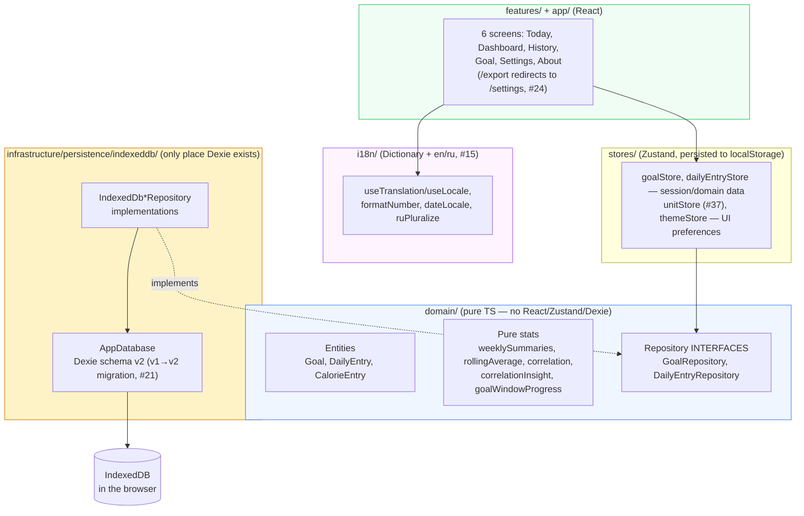
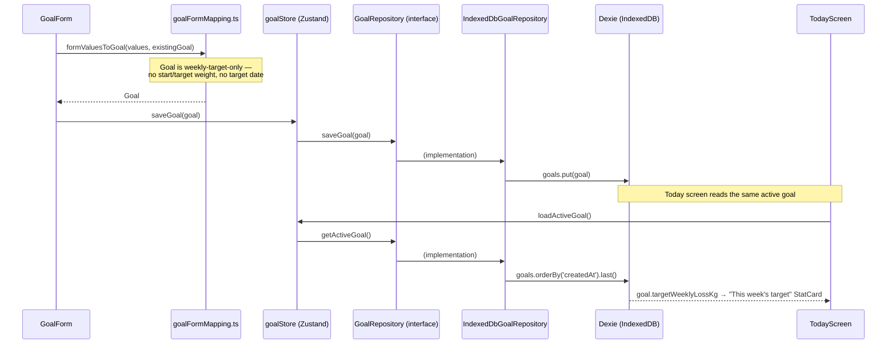

# Turtle Steps to the Goal — Architecture

This document is updated after each issue is completed. It explains what every file does, why it exists, and how the pieces connect.

Product context lives in `PROJECT_BRIEF.md`; the work queue lives in `docs/issues-priority.md`; the public-facing overview (screenshots, live link, dev setup) lives in `README.md` (#58).

---

## System Overview

Turtle Steps to the Goal is a local-first weight-tracking companion built around small, weekly goals rather than one distant number: set a weekly pace, log today's weight and calories, watch the trend. Everything runs in the browser — no backend, no accounts, no telemetry. All data lives in the user's own IndexedDB.

The codebase follows Clean Architecture layering with feature-based folders:

**The one dependency rule that matters:** `domain/` imports nothing from React, Zustand, or Dexie. Features and stores talk to persistence only through the repository interfaces, so a future sync backend would mean writing `Api*Repository` implementations, not a rewrite of stores or components. `i18n/` is a UI-layer concern (it exports React hooks) and sits alongside `stores/`, not inside `domain/`.

**A known simplification vs. sibling projects:** stores and `exportActions.ts` each instantiate `new IndexedDbGoalRepository()` / `new IndexedDbDailyEntryRepository()` directly at module scope, rather than through a swappable factory/DI seam (compare `life-kaleidoscope`'s `getRepositories()`/`setRepositories()`). `Dashboard`'s and `History`'s data hooks (`useDashboardData`, `useHistoryData`) follow the same direct-instantiation pattern rather than routing through `dailyEntryStore`, since neither screen needs single-entry session state — they need "all entries," which the shared stores don't model. Fine while IndexedDB is the only implementation that exists; revisit if a second backend is ever built.

**Three separate preference stores, not one:** display unit (`unitStore`), mood/color-scheme (`themeStore`), and locale (`i18n/localeStore.ts`) are three independent Zustand stores with three independent `localStorage` keys (`turtle-steps-unit`, `turtle-steps-theme`, `turtle-steps-locale`), split across `src/stores/` and `src/i18n/` rather than one unified preferences store. Not a problem in practice, but worth knowing before assuming a single "settings" state object exists anywhere.

---

## Data Flow — setting a goal, then logging today against it

`getActiveGoal()` is "most recently created goal" — there is no explicit active/inactive flag; saving a new goal (or the same goal's id again) always becomes the one Today reads. `DailyEntry` saves follow the identical shape through `dailyEntryStore` → `DailyEntryRepository` → `IndexedDbDailyEntryRepository`, keyed by the entry's `date` (a unique Dexie index — one entry per date, upserted by `put`).

**Display unit is not part of this flow.** `Goal` has no `displayUnit` field (removed in #37) — kg/lb is a UI-only preference read from `unitStore` and applied at render time via a local `toDisplay(kg)` helper in every screen that shows a weight-derived number (`TodayScreen`, `GoalScreen`, `DashboardScreen`'s charts, `HistoryScreen`'s rows/detail). The stored value is always kg, everywhere.

---

## Module Reference

### Domain layer (`src/domain/`)

Pure TypeScript. Unit-testable with no DOM. If a file here ever needs `react`, `zustand`, or `dexie`, the logic belongs in `infrastructure/` or `features/` instead.

#### `src/domain/goal/`

| File | Purpose |
|------|---------|
| `Goal.ts` | The entity: `id`, `targetWeeklyLossKg` (the only *weight* target concept — this week's pace, set and renewed week to week), `createdAt`/`updatedAt`. **No `displayUnit`** (moved to `unitStore`, #37) and **no long-term target weight or target date** (removed in #14) — the product's small-steps framing means the app never shows a distant "big goal" number, only the current week's target. **`weekStart?: string`** (#135) — ISO date the target was last saved, stamped fresh to today by `formValuesToGoal` on every save; anchors a real 7-day window instead of labeling the target against whatever fixed calendar week happened to contain today. Optional so an old goal never re-saved since #135 (or restored from a pre-#135 backup) doesn't crash callers, just reads as "no window info yet." **`dailyCalorieTargetKcal?: number`** (#208) — a second, independent target alongside the weekly weight one, not a long-term one either (doesn't conflict with #14's own reasoning above): a *daily* number re-assessed against each day's own log, same short-horizon spirit as the weekly target. Genuinely optional — no `superRefine` requiring it the way the weekly target has, since not everyone wants to track it. Powers Today's "remaining calories" `StatCard`; nothing else reads it. **`dailyProteinTargetG?: number`** (#220) — same shape/reasoning again, independent of the calories one (someone might want either without the other). Powers Today's "remaining protein" `StatCard`; unlike calories, clamps at 0 rather than reading "over" once met — more protein than planned isn't the same "went over budget" concept a calorie ceiling is. |
| `GoalRepository.ts` | Interface: `getActiveGoal()`, `saveGoal(goal)`, `getAll()` (`getAll` added for Epic 8 export), `deleteGoal(id)` (#174, removes a single past-goal history record; deleting the active goal isn't a supported use case — `PastTargetsList` only ever passes ids from the non-active history list). |
| `calorieDeficit.ts` | `estimatedDailyCalorieDeficitKcal(targetWeeklyLossKg)` — the brief's ~7700 kcal-per-kg-of-fat approximation, explicitly labeled non-medical everywhere it's surfaced in the UI. |
| `units.ts` | `lbToKg` / `kgToLb` — pure conversion, `KG_PER_LB = 0.45359237`. Used both by `GoalForm`'s form-mapping and by every screen's `toDisplay()` unit conversion. |
| `goalWindowProgress.ts` (#135, replaced averaging with #203) | `goalWeekEnd(weekStart)` — `weekStart + 6 days`, the fixed-length window a goal's own `weekStart` anchors. `goalWindowProgress(entries, goal)` — the goal-anchored replacement for reading `weeklySummaries()`'s last calendar-week entry. Returns `null` when `goal.weekStart` is unset; deliberately separate from `weeklySummaries.ts`, which stays calendar-grid-based for Dashboard/History's retrospective week-by-week views — a different concern from "is the currently active target being met." **#203** replaced the original average-vs-prior-week-average model entirely, reported as reading "target met" despite the viewed day's own weight going *up* 350g day over day from the day before — averaging could dip below target from noisy data in a way that didn't match how a user reading their own two numbers thinks about it. New rule: `targetMet`/`metOnDate` compare each day directly against whatever was logged on `weekStart` itself (the day the target was set) — the first day (within `[weekStart, weekEnd]`, `weekStart` included) whose logged weight is at least `targetWeeklyLossKg` below `weekStart`'s own logged weight is `metOnDate`; `targetMet` is `metOnDate !== null`. No averaging on either side, no prior-window baseline. `targetMet`/`metOnDate` are `null` only until `weekStart` itself has a logged weight — there's no substitute baseline the way the old model's prior-week average was. `weekStart` compared against itself is always a 0 delta, so it can never satisfy a positive target on its own — this is what makes #177's old `MIN_WINDOW_DAYS_LOGGED` gate (guarding against "met" firing off a single day's weigh-in) unnecessary; the new math can't produce that result at all, for any positive target, so the gate was removed rather than kept as redundant belt-and-suspenders. `GoalWindowProgress` narrowed to `{ weekStart, weekEnd, targetMet, metOnDate }` — `averageWeightKg`/`priorAverageWeightKg`/`deltaKg` dropped entirely after confirming (full consumer sweep) nothing reads them; `metOnDate` stays set even if a later day's weight rises back above the threshold, matching `useWeeklyGoalCelebration`'s existing "once met, stays met for this window" reasoning. Powers `PastTargetsList`'s "Target met on Mar 12" display. |
| `goalHistory.ts` (#147) | `pastGoals(goals, entries)` — every goal except the most-recently-created one (the active goal, already shown by `GoalScreen`'s main `StatCard`), newest first, each paired with its own `goalWindowProgress()` result against that goal's own window. A plain read over `GoalRepository.getAll()`, not a separate history log — #147 made every goal save create its own historical record (see `goalFormMapping.ts` below), so nothing else needed to change here to make history available. **#181**: also computes `approximateEndDate` for a legacy goal with no `weekStart` (one saved before #135 shipped, so it never had a real window) — the `createdAt` date of whichever goal superseded it (`newestFirst[i]`, one slot newer in the sorted array), a display-only value derived from an objectively knowable fact rather than fabricated data. `undefined` when the goal already has a real `weekStart` (its formal `weekEnd` covers this instead). |
| `reachedGoalWindows.ts` (#155) | `reachedGoalWindows(goals, entries)` — every goal (past or active) whose `goalWindowProgress().metOnDate` is set, as a `{ start: goal.weekStart, metOnDate }` span; a goal that was never reached, or predates #135 (no `weekStart`), contributes nothing. `isDateWithinReachedWindow(date, windows)`/`isGoalMetOnDate(date, windows)` are the two per-day predicates `History` (`EntryRow.tsx`/`CalendarView.tsx`) actually renders against, so neither has to re-derive `goalWindowProgress()` itself per row/cell. Reused by `useHistoryData.ts` (loads *every* goal, not just the active one, specifically to feed this). |
| `index.ts` | Barrel. |

#### `src/domain/dailyEntry/`

| File | Purpose |
|------|---------|
| `DailyEntry.ts` | The entity: one row per `date` (ISO string, unique). `weightKg?`, `note?`, `emotion?: Emotion` (the **day's overall mood**, distinct from any meal's own reaction — #44; `Emotion = 'happy' \| 'unhappy' \| 'neutral'`, unchanged by #54), `calorieEntries?: CalorieEntry[]` — itemized per-meal list (#21), replacing the original single `caloriesConsumed` number. `sleepHours?`/`deepSleepHours?` (#59 — independent optional numbers, no cross-check between them), `steps?` (#60), `onPeriod?: boolean` (#61 — opt-in menstrual cycle tracking, gated by a Settings-only toggle that never travels with backups). `hadConstipation?: boolean` — opt-in digestion tracking, same shape/precedent as `onPeriod` (gated by `useDigestionTrackingStore`, a separate Settings-only toggle, off by default). Reframed around the problem rather than the normal day (previously `hadBowelMovement`) so logging is only ever needed on an exception day — a clean-cut rename, not a migration: the old field meant the opposite thing, so no data carried over. **#81 restructured `CalorieEntry` into a group of items**, so multiple dishes eaten together (soup + bread + cheese) can share one meal instead of always becoming separate ones: `CalorieEntry { id, items: CalorieItem[], label?, note?, timeEaten?, createdAt }` — `note`/`timeEaten` stay **group-level** (unchanged meaning from before #81, just relocated), a group always has at least 1 item (its last item removed = the group removed). `label?` (#110) is a purely cosmetic custom display name (e.g. "Breakfast") overriding the default meal name when set — unrelated to `CalorieItem.name` (a dish within the meal) or `MealItem` (the reusable dish-name library). That default itself is no longer always "Meal N" (#141): see `shared/lib/mealLabel.ts` below. `CalorieItem` (new, same file): `{ id, name?, amountKcal, proteinG?, fatG?, carbsG?, amountG?, emotion?: MealEmotion }` — a dish name + kcal + macros + its own reaction. **#129 moved `emotion` here from `CalorieEntry`**: a meal's reaction used to be one shared value for the whole group (couldn't tell "loved the pizza, disliked the milk" apart within the same meal); now each dish carries its own, independent of its siblings. **#225**: `waistCm?`/`hipCm?`/`bodyFatPercent?` — three more independent optional numbers, same shape/precedent as sleep/steps. Stored in cm/plain percent only, no inches conversion — the app has no established length-unit preference the way `unitStore` gives it one for kg/lb. |
| `calorieEntryTotals.ts` | New in #81: `calorieEntryKcal(entry)` (always a real number — sums `entry.items`), `calorieEntryProtein/Fat/Carbs(entry)` (undefined, not 0, when none of the group's items logged that macro — same convention as the day-level totals below, just one level down). The only place that knows how to sum a single group's items; `DailyEntryForm.tsx`/`DayDetail.tsx` use these for each meal's own heading/summary line. |
| `totalCalories.ts` | `totalCalories(entries)` — sums a day's `calorieEntries` (each summed over its own items via `calorieEntryKcal`, #81); returns `undefined` (not `0`) when there are none, so "no data" and "logged zero" stay distinguishable everywhere this is displayed. |
| `totalMacros.ts` | `totalProtein`/`totalFat`/`totalCarbs` (#51) — same "undefined, not 0" convention as `totalCalories`, but per-macro. **#81**: now flattens every entry's `items[]` first (`entries.flatMap(e => e.items)`) before summing, so the skip-granularity is per-*item*, not per-meal — two dishes in the same meal can independently log/omit a macro. |
| `DailyEntryRepository.ts` | Interface: `getByDate(date)`, `getRange(start, end)`, `upsert(entry)`, `delete(id)`, `getAll()`. (`getEarliestDate()`, added for #18's `useCurrentWeekInfo`, was removed in #135 once that hook's only caller went away.) |
| `index.ts` | Barrel. |

#### `src/domain/mealItem/` — new in #50

A reusable meal-name library, deliberately **not** a foreign key from `CalorieEntry.note`.

| File | Purpose |
|------|---------|
| `MealItem.ts` | `{ id, name, createdAt, updatedAt, lastAmountKcal?, lastProteinG?, lastFatG?, lastCarbsG? }` — the last four added by #86, purely additive/optional, no IndexedDB version bump. Renaming or deleting one never touches already-logged `CalorieEntry.note` text — those are independent strings, not references. The nutrition fields let the food picker offer a saved item as something reusable ("add it again with the same numbers"), not just a bare name; items touched before #86 simply have them undefined until next saved with a note. |
| `MealItemRepository.ts` | Interface: `getAll()`, `findByName(name)`, `upsert(item)`, `delete(id)`. |
| `index.ts` | Barrel. |

#### `src/domain/foodOverride/` — new in #90

Per-device customization of the curated `data/foods.ts` list — hide an item, or correct its per-100g numbers, without touching the shipped source file.

| File | Purpose |
|------|---------|
| `FoodOverride.ts` | `{ foodId, hidden?, kcal100?, protein100?, fat100?, carbs100?, updatedAt }` — keyed by the food's own stable `id` (from `foods.ts`), not a separate uuid, since there's at most one override per food. **#113**: now included in export/import backups (`exportBundleSchema.ts`'s `foodOverrides`), alongside `mealItems` — previously both were local-only, which meant a "backup" silently left out part of the user's personal data. |
| `FoodOverrideRepository.ts` | Interface: `getAll()`, `upsert(override)`, `delete(foodId)`. |
| `index.ts` | Barrel. |

#### `src/domain/stats/`

Pure functions with unit tests covering edge cases (missing days, single data point, no variance). Now consumed by both `Dashboard` (#6/#7) and `History` (#8) — no longer library-only.

| File | Purpose |
|------|---------|
| `weeklySummaries.ts` | Groups entries into weeks via `date-fns` `startOfWeek`/`endOfWeek`, given an explicit `weekStartsOn` day parameter (#85, default `1`/Monday — the original hardcoded `startOfISOWeek`/`endOfISOWeek` behavior). Per week: `averageWeightKg`, `averageCalories` (via `totalCalories`, `null` if no entries have calories that week), `averageProteinG`/`averageFatG`/`averageCarbsG` (#53, same per-macro averaging as `totalMacros.ts` — only over days that logged that specific macro), `deltaVsPriorWeekKg` (vs. the previous week's average), and `targetMet` (whether the actual loss met `goal.targetWeeklyLossKg` — `null` without a goal or a prior week to compare). Powers `WeeklySummaryCards`, `MetTargetList`, and `CorrelationView`'s retrospective calendar-week-by-week views; each resolves its own `weekStartsOn` via `useWeekStartsOn`/`resolveWeekStartsOn` (see `shared/` below) rather than this function knowing anything about the preference itself. **No longer used by `useWeeklyGoalCelebration`** (#135) — "is the currently active target being met" now reads `goalWindowProgress()` instead, anchored to the goal's own `weekStart` rather than a calendar grid. |
| `monthlySummaries.ts` (#226) | Same shape as `weeklySummaries.ts` above, grouped by calendar month (`date-fns` `startOfMonth`/`endOfMonth`) instead of week — no `weekStartsOn`-equivalent parameter, since a month has one unambiguous boundary. Per month: `averageWeightKg`/`averageCalories`/`averageProteinG`/`averageFatG`/`averageCarbsG` (identical per-macro-averaging reasoning as the weekly version), `deltaVsPriorMonthKg`. Deliberately **no** `targetMet` field — a `Goal` here is always a *weekly* target, with no monthly-target concept anywhere else in the app to compare a month's actual change against. A gap month with zero entries contributes no summary row at all (same as a gap week in the weekly version), so a delta is only ever computed between two months that actually both have data, not two calendar-adjacent months. Powers `MonthlySummaryCards`. |
| `rollingAverage.ts` | `rollingAverage(entries, field, windowDays)` — trailing-window average per distinct date present in the data. `field` accepts either a literal `DailyEntry` key or an extractor function, which is what lets `CalorieTrendChart` roll-average the *derived* `totalCalories()` value rather than a raw stored field. A day with no qualifying values in its window gets `average: null` rather than being dropped. **#214**: also now consumed by `WeightTrendChart.tsx` (`field: 'weightKg'`) — the function itself needed no changes, already fully general; this was purely a matter of wiring an existing capability into a second chart, not building a new one. |
| `dateRangeSummary.ts` (#222) | `dateRangeSummary(entries, startDate, endDate)` — same per-field averaging as `weeklySummaries.ts`/`monthlySummaries.ts` (macros only averaged over days that logged that specific one, #53 reasoning), but for an arbitrary inclusive `[startDate, endDate]` ISO-string range instead of a calendar week/month. Also returns `loggedDayCount` (how many distinct dates in the range have an entry at all, regardless of which fields), so a caller can show "3 of 7 days logged" rather than silently averaging a sparse range. Powers `CompareRangesView`'s two independently-picked ranges — distinct from `recentAverages.ts` below, which is a rolling window anchored to *today*, not two arbitrary user-chosen ranges compared against each other. |
| `recentAverages.ts` (#215) | `recentAverages(entries, windowDays, today = new Date())` — average calories/protein over the trailing `windowDays` days counting back from `today` (inclusive), skipping days with no calorie entries at all rather than counting them as 0. Deliberately anchored to the *real current date* (injectable for tests), not the most recent logged entry the way `rollingAverage.ts`'s per-point series is — a "last 7 days" stat should shrink its sample when the user hasn't logged recently, not silently reuse whatever the last logged day happened to be. A single-shot summary (one `{ averageCalories, averageProteinG }` result), not a per-date series like `rollingAverage.ts` — powers `RecentAveragesCards`, called once per window (7 and 30). |
| `correlation.ts` | Plain Pearson correlation coefficient between weekly average calories and that week's weight change. `null` when there are fewer than two comparable weeks or no variance in either axis. Not directly rendered anywhere — `correlationInsight.ts` is what actually backs the UI. |
| `correlationInsight.ts` | The plain-language companion to `correlation.ts` that `CorrelationView` (#7) actually uses: splits comparable weeks into lower-/higher-calorie halves by median (needs `MIN_COMPARABLE_WEEKS = 4`), reports which half averaged more loss and a rounded `thresholdKcal` — arithmetic, not statistics, on purpose. Takes the same `weekStartsOn` param (#85) as `weeklySummaries`, which it calls internally. |
| `lateMealCorrelation.ts` (#116) | Distinct from `correlationInsight.ts` (weekly average calories vs. that week's change) — pairs each day's *latest logged meal time* with the *next calendar day's* day-over-day weight change, e.g. testing "eating late → more weight the next morning" from water retention. `lateMealPoints(entries)` returns the raw day-pairs (a day only contributes one if it has a logged weight, ≥1 meal with a recorded `timeEaten`, and the very next calendar date also has a logged weight); `lateMealCorrelation(entries)` splits them into earlier-/later-eating halves by median time-of-day (needs `MIN_COMPARABLE_DAYS = 8` — day-pairs are noisier than `correlationInsight`'s week-level averages, so more are required before a split means anything), same "which half averaged worse" shape as `correlationInsight`, threshold rounded to the nearest 15 minutes instead of 50 kcal. |
| `loggingConsistency.ts` (#223) | `loggingConsistencyWeeks(entries, weekStartsOn)` — one row per calendar week from the earliest logged entry through today, each with 7 day-cells scored 0-4 by how many of the app's core fields (weight, any meal, sleep, steps — a note or period/constipation flag alone doesn't count) that day logged. Powers `LoggingConsistencyHeatmap.tsx`'s GitHub-contribution-graph-style view. Resolved a genuine scope fork via `AskUserQuestion` before building — the issue itself flagged the visualized metric as undecided ("logging consistency or a chosen metric"); user chose logging consistency, not a numeric-metric heatmap. |
| `customChartSeries.ts` (#132) | `customChartPoints(entries, seriesKeys)` — one point per date (sorted ascending), each carrying both `raw` (the actual logged value, what tooltips/legends should always read) and `normalized` (0-100 within that series' own min/max across the visible range, purely a plotting coordinate for `CustomChartView`'s shared Y-axis). A series with zero variance (one distinct value, or only one data point) normalizes to a flat 50 rather than dividing by zero. `booleanFlagDates(entries, flag)` returns the plain list of dates `onPeriod`/`hadConstipation` was true, for the same view's marker-dot rendering (#137) — kept separate since these aren't plotted as a trend the way the six numeric series are. |
| `foodReactions.ts` (#128) | `foodReactionTallies(entries)` flattens every logged `CalorieItem` across every meal and tallies `bellissimoCount`/`thumbsUpCount`/`thumbsDownCount` per dish *name* (trimmed; unnamed or unreacted-to items skipped) — the same name logged on separate occasions accumulates into one tally, not one per occurrence. `mostLikedFoods(entries)` filters to dishes with any positive reaction, ranked by a bellissimo-weighted score (bellissimo counts double a plain thumbsUp — #54's own framing of it as a stronger "amazing" tier), capped at the top 5; `mostDislikedFoods(entries)` mirrors that for `thumbsDownCount`. A dish with a mixed history (loved once, disliked another time) can appear in both — that's real signal, not deduplicated away. Only possible as a precise per-dish tally since #129 moved `emotion` off the meal group onto each item. |
| `index.ts` | Barrel. |

**History:** `projectedTrajectory.ts` was removed in #14 (it depended on `Goal` fields that no longer exist). #6 later added a new pace-based overlay, `projectedPaceTrajectory`, to `WeightTrendChart` — which #46 then removed outright per live feedback (no projection/prognosis line at all today; `WeightTrendChart` no longer takes a `goal` prop). `currentWeekInfo.ts` (#18's calendar-week-numbered "Week N · range" label) and its `useCurrentWeekInfo` hook were removed in #135 — their only consumers (`TodayScreen`/`GoalScreen`'s target `StatCard`) switched to a goal-anchored range via `goalWindowProgress.ts`, at which point a running calendar-week count no longer corresponded to anything meaningful on that card and nothing else read the hook.

---

### Persistence layer (`src/infrastructure/persistence/indexeddb/`)

The only folder allowed to import Dexie.

#### `db.ts`
**Why it exists:** Single definition of the IndexedDB schema, now on its seventh version.

| Version | Change |
|---------|--------|
| 1 | `goals: 'id, createdAt'`, `dailyEntries: 'id, &date'` (`&date` unique — one entry per date at the storage level). |
| 2 (#21) | Same store shape (no index changes) + an `.upgrade()` block: for each `dailyEntries` row, if a legacy `caloriesConsumed` number exists and no `calorieEntries` yet, it's wrapped into a single-item `calorieEntries` array (new `crypto.randomUUID()` id, reuses the row's `createdAt`), then `caloriesConsumed` is deleted. |
| 3 (#50) | Adds `mealItems: 'id, &name'` (`&name` unique). New store only, no `.upgrade()` needed — nothing pre-existing to migrate. |
| 4 (#54) | Same store shape (no index changes) + an `.upgrade()` block: strips `emotion` from every item in each `dailyEntries` row's `calorieEntries[]` (old happy/unhappy/neutral values don't map to the new thumbsUp/thumbsDown/bellissimo set — cleared outright, no auto-mapping). The row's own top-level `emotion` (day mood) is untouched. |
| 5 (#81) | Same store shape (no index changes) + an `.upgrade()` block: folds each flat `calorieEntries[]` meal into a single-item group — the meal's `id` becomes the group's `id`, its `note` becomes the one item's `name` (a fresh `crypto.randomUUID()` item id), `amountKcal`/`proteinG`/`fatG`/`carbsG` move onto that item, and `emotion`/`timeEaten` stay on the group. Rows with no `calorieEntries` at all are left untouched (not coerced to an empty array). |
| 6 (#90) | Adds `foodOverrides: '&foodId'` (`&foodId` unique — one override per curated food, at most). New store only, no `.upgrade()` needed. |
| 7 (#129) | Same store shape (no index changes) + an `.upgrade()` block: a meal's reaction moves from the group (`calorieEntries[].emotion`, no longer part of the type) onto each item. Only unambiguous for a single-item meal, where the old group reaction clearly belonged to that one dish — for a multi-item meal it's simply dropped (deleted, not guessed at), same reasoning v4's clear used for the older emotion set. |

Database name: `turtle-steps-to-the-goal`. `db.migration.test.ts` seeds a raw v1-schema Dexie instance with a legacy `caloriesConsumed` row, an untouched `weightKg`-only row, a pre-#54 row with an old-format meal emotion, and a pre-#81 flat-meal row, then opens the real `db` (which cascades through every pending `.upgrade()` in one open) and asserts each transformation landed correctly. **v7's own fold has no dedicated test in this file** — every seed here cascades from v1, and v4's unconditional clear wipes any meal-level emotion before it could ever reach v7 (no real pre-v4 data could have had a modern thumbsUp/thumbsDown/bellissimo value in the first place, so this harness has no way to represent "reaches v7 with a legacy value still on it"; real users upgrading from an already-v6 install never run v4's `.upgrade()` at all, since Dexie only runs each version's upgrade once per physical database). The fold logic itself is covered directly in `exportActions.test.ts`'s v5→v6 bundle-upgrade test instead, which seeds already-v5-shaped data with no such contamination.

#### `goalRepository.ts` — `IndexedDbGoalRepository`
`getActiveGoal()` = `db.goals.orderBy('createdAt').last()` (most recently created). `saveGoal()` = `put` (insert or overwrite by id). `getAll()` = full table ordered by `createdAt`, added for Epic 8 export.

#### `dailyEntryRepository.ts` — `IndexedDbDailyEntryRepository`
`getByDate` uses the unique `date` index. `getRange` uses `.between(start, end, true, true)` (inclusive both ends) sorted by date. `upsert` is a `put`. `getAll` is ordered by date, added for Epic 8 export.

#### `mealItemRepository.ts` — `IndexedDbMealItemRepository` (#50)
`getAll()` = `orderBy('name')`. `findByName()` uses the unique `name` index — the basis for upsert-by-name (`touch`) in `mealItemStore`, since `.put()` on a unique index throws if you try to insert a colliding name under a different primary key.

#### `foodOverrideRepository.ts` — `IndexedDbFoodOverrideRepository` (#90)
`getAll()` = full table (no ordering — the UI sorts/filters via `foods.ts`'s own order). `upsert()`/`delete()` are keyed by `foodId` directly.

#### `index.ts`
Barrel: `db`, `AppDatabase`, `IndexedDbGoalRepository`, `IndexedDbDailyEntryRepository`, `IndexedDbMealItemRepository`, `IndexedDbFoodOverrideRepository`.

---

### State layer (`src/stores/`)

Zustand. `goalStore`/`dailyEntryStore` own session/domain data (always flowing through the repository interfaces, never through Dexie directly); `unitStore`/`themeStore` own persisted UI preferences (`localStorage`, via Zustand's `persist` middleware — no IndexedDB involvement).

| File | Purpose |
|------|---------|
| `goalStore.ts` | `useGoalStore`: `goal`, `status` (`idle/loading/ready/error`), `error`, `loadActiveGoal()`, `saveGoal(goal)`. Instantiates `IndexedDbGoalRepository` once at module scope. |
| `dailyEntryStore.ts` | `useDailyEntryStore`: `date`, `entry`, `status`, `error`, `loadEntry(date)`, `saveEntry(entry)`. Same shape as `goalStore`. |
| `unitStore.ts` | `useUnitStore` (#37): `unit: 'kg' \| 'lb'`, `setUnit`. Persisted to `localStorage` (`turtle-steps-unit`). This is the kg/lb toggle that used to live on the Goal page — now global, read by `TodayScreen`, `GoalScreen`, `DashboardScreen`'s charts, and every `History` weight display. |
| `mealItemStore.ts` | `useMealItemStore` (#50): `items`, `status`, `loadItems()`, `touch(name, nutrition?)` (upsert-by-name — creates on first use, else just bumps `updatedAt`; trims and no-ops on empty), `rename(id, name)` (merges into an existing item if the new name collides, rather than throwing on the unique index), `deleteItem(id)`. Not persisted to `localStorage` — this is domain data in IndexedDB, unlike `unitStore`/`themeStore`. `touch`'s optional `nutrition` (#86: `{ amountKcal?, proteinG?, fatG?, carbsG? }`) records the last-used values on the `MealItem`, falling back to whatever was already recorded when omitted (a bare `touch(name)` never clears previously known nutrition). |
| `goalCelebrationStore.ts` | `useGoalCelebrationStore` (#55): `celebratedWeekStart: string \| null`, `markCelebrated(weekStart)`. Persisted to `localStorage` (`turtle-steps-goal-celebration`). Deliberately stores only the *single most recent* celebrated window, not a growing history — a new goal-anchored window (#135) always has a different `weekStart` once renewed, so one value is enough to know "has this window already been celebrated." |
| `cycleTrackingStore.ts` | `useCycleTrackingStore` (#61): `enabled: boolean`, `setEnabled`. Persisted to `localStorage` (`turtle-steps-cycle-tracking`). Settings-only on/off switch — gates whether `DailyEntryForm` renders the `onPeriod` toggle at all; the logged `onPeriod` value itself lives on `DailyEntry`, not in this store. |
| `dailyReminderStore.ts` | `useDailyReminderStore` (#171): `enabled: boolean`, `setEnabled`. Persisted to `localStorage` (`turtle-steps-daily-reminder`), off by default — same shape as `cycleTrackingStore`/`digestionTrackingStore`. Gates `TodayScreen.tsx`'s quiet "No entry yet today" banner; not part of the export bundle (a local UI preference, not logged data). |
| `weekStartStore.ts` | `useWeekStartStore` (#85): `weekStart: 'monday' \| 'firstEntryWeekday'`, `setWeekStart`. Persisted to `localStorage` (`turtle-steps-week-start`), default `'monday'`. Settings-only preference — `'firstEntryWeekday'` anchors every week boundary to whichever weekday the earliest logged entry falls on, for people who started tracking mid-week and found "Week 2" two days after their first entry confusing. Resolved into a concrete `Day` by `shared/lib/resolveWeekStartsOn.ts`, not read directly by `currentWeekInfo`/`weeklySummaries` themselves. |
| `themeStore.ts` | `useThemeStore`: `mood` (`'pond' \| 'dusk' \| 'sage' \| 'tortoise' \| 'lagoon'`, #17), `colorScheme` (`'light' \| 'dark'`), `setMood`, `setColorScheme`. Persisted (`turtle-steps-theme`). Exports `detectDefaultColorScheme()` and `applyTheme()` (sets `data-mood` + toggles `.dark` on `<html>`); `applyTheme()` also runs eagerly at module-import time to stay in sync with an inline pre-paint script in `index.html` that avoids a flash of the wrong theme on load. |
| `foodOverrideStore.ts` | `useFoodOverrideStore` (#90): `overrides`, `status`, `loadOverrides()`, `setHidden(foodId, hidden)`, `setNutrition(foodId, {kcal100, protein100, fat100, carbs100})`, `restoreDefault(foodId)` (deletes the override entirely). Not persisted to `localStorage` — domain data in IndexedDB, same category as `mealItemStore`. `setHidden`/`setNutrition` merge into one existing override per food rather than each creating their own record. |
| `index.ts` | Barrel — exports all stores plus their `Mood`/`ColorScheme`/`Unit`/`WeekStart` types. |

Locale is **not** here — see `src/i18n/localeStore.ts` below.

---

### Internationalization (`src/i18n/`) — Epic/issue #15

New layer since the app's first localization pass. English and Russian, with the locale itself persisted like a UI preference (but structurally separate from `src/stores/` — see the "three preference stores" note above).

| File | Purpose |
|------|---------|
| `Dictionary.ts` | The `Dictionary` interface — one section per feature area (`common`, `nav`, `today`, `dailyEntry`, `goal`, `export`, `dashboard`, `history`, `settings`, `about`). Several entries are functions rather than plain strings, for pluralization/interpolation (e.g. `common.weekRangeLabel(start, end)`, `dailyEntry.mealLabel(n)`, `dailyEntry.emotionLabel(emotion)`, `goal.deficitEstimate(kcal, direction)`, `dashboard.correlationSummary(thresholdKcal, direction)`). |
| `en.ts` / `ru.ts` | Full `Dictionary` implementations for each locale. |
| `localeStore.ts` | `Locale = 'en' \| 'ru'`. `useLocaleStore` (Zustand + `persist`, `localStorage` key `turtle-steps-locale`, default from `detectDefaultLocale()` sniffing `navigator.language`). Free functions `getDictionary(locale)`; hooks `useTranslation()` (full `Dictionary` for the current locale) and `useLocale()` (just the `Locale` string). `SettingsScreen` is the only place that calls `setLocale`. |
| `dateLocale.ts` | `getDateFnsLocale(locale)` — maps to `date-fns/locale`'s `enUS`/`ru`, used everywhere `date-fns format()` needs localized month/weekday names. |
| `formatNumber.ts` | `formatNumber(value, locale, fractionDigits = 1)` and `formatSignedNumber(value, locale)` (always shows an explicit +/−) — both via `Intl.NumberFormat` with `ru-RU`/`en-US`, so Russian gets a decimal comma automatically. `formatExactNumber(value, locale)` (#57, `minimumFractionDigits: 0, maximumFractionDigits: 2`) is for values that were directly entered or are a plain subtraction of two entered values (e.g. weight), where the fixed-1-decimal formatters would round away what the user actually typed — a whole number stays unpadded ("60", not "60.0"), and the max-2 cap both covers typical entered precision and rounds away floating-point subtraction noise. Computed/averaged values (weekly summaries, chart axes) intentionally keep using `formatNumber`'s fixed decimal count. |
| `unitLabel.ts` | `unitLabel(unit, dictionary)` → `t.common.kg` / `t.common.lb`. |
| `ruPluralize.ts` | Standalone Russian plural-form selector (1 / 2–4 / 5+, with the 11–14 exception) for count-based Russian copy. |
| `index.ts` | Barrel. |

---

### Features (`src/features/`)

#### `goal-setup/` — Epic 3, issue #4; reworked to weekly-only in #14

| File | Purpose |
|------|---------|
| `goalFormSchema.ts` | Zod schema: `targetWeeklyLoss` (optional at the type level, required via `superRefine` with a custom message — same pattern as `dailyEntryFormSchema`, so Zod's default NaN/required error text never has to be relied on). No unit field in the schema — see below. **#208**: `dailyCalorieTarget` — `z.number().positive().max(10000).optional()`, genuinely optional (no `superRefine` requirement, unlike `targetWeeklyLoss`) since not everyone wants a daily calories target. **#220**: `dailyProteinTarget` — `z.number().positive().max(1000).optional()`, same reasoning, independent field. |
| `goalFormMapping.ts` | `goalToFormValues` (Goal → form, converts to the *display* unit read from `useUnitStore` — the unit itself is a caller-supplied argument, not read from `Goal`), `formValuesToGoal` (form → Goal, converts back to kg), `effectiveWeeklyPaceKg` (live pace preview from possibly-incomplete form state, used for the on-screen calorie-deficit estimate as the user types). **#147**: `formValuesToGoal` no longer takes an `existingGoal` param — every save now gets a fresh `id`/`createdAt` unconditionally, turning each save into its own historical `Goal` record instead of overwriting the previous one (Dexie `put` upserts by id, so a fresh id is an insert). **#174** added `isDuplicateGoalSave(newGoal, existingGoal)` (no-op'd an exact same-day, same-target re-submission) — **superseded by #181** below, which replaces the whole "always fresh record" model. **#181**: `formValuesToGoal` takes `existingGoal` back as an optional third param. `isEditingLiveWindow(existingGoal)` — true when today is still within `existingGoal`'s own `[weekStart, goalWeekEnd(weekStart)]` window — decides the branch: if live, the same `id`/`createdAt`/`weekStart` are reused (only `targetWeeklyLossKg`/`updatedAt` change; Dexie's `put()` upserts by id, so this overwrites in place rather than inserting), correcting a same-week target no longer spawns a second `Past targets` row. If not live (window ended, or no existing goal, or a legacy goal with no `weekStart`), a fresh `id`/`createdAt`/`weekStart` are generated exactly as #147 did — the goal it replaces is now genuinely finished and stays frozen in history. `GoalRepository.getActiveGoal()`/`getAll()` still needed no changes either way. `isUnchangedGoalEdit(targetWeeklyLossKg, existingGoal)` briefly replaced `isDuplicateGoalSave` here to gate a live-disabled Update button — **removed again by #182** (below) minutes after shipping, since re-saving an unchanged value is completely harmless under this model (an idempotent update to the same record) and disabling the button on ordinary page load — which happens by default, since the form always pre-fills from the live goal's current value — read as broken. There is now no dedicated "is this a duplicate/unchanged" check in this file at all; `formValuesToGoal`'s own live-window branch already handles a same-value resubmit correctly with zero extra logic needed. **#155**: `isEditingLiveWindow`/`formValuesToGoal` take a 4th param, `activeGoalReached` (default `false`) — when `true`, the window is treated as not-live even if today is still within `[weekStart, weekEnd]`, so the save starts a fresh record instead of overwriting the goal that already succeeded. The caller (`GoalScreen`, via `GoalForm`) supplies it from `useActiveGoalProgress().metOnDate !== null`; this file stays entries-agnostic. **#208**: `goalToFormValues`/`formValuesToGoal` also map `dailyCalorieTargetKcal` straight through (no unit conversion needed, calories aren't a weight unit) in both branches — live-edit-in-place and fresh-record. **#220**: `dailyProteinTargetG` mapped the same way, independent of the calories field. |
| `GoalForm.tsx` | RHF + `zodResolver`. A single "This week's target" `NumberInput` — **no unit toggle** (moved to Settings in #37; the form reads the current unit from `useUnitStore` for display/conversion only). Shows the rough daily-calorie-deficit estimate live, captioned non-medical. `onSubmit(formValuesToGoal(formValues, unit, existingGoal, activeGoalReached))` passes `existingGoal` through (#181) so an in-window edit updates in place rather than always forking history. **#174** and **#181** each added, and **#182** then removed, a live-disabled-button/notice for an "unchanged" resubmit — see `goalFormMapping.ts`'s own note above for why. The submit button is unconditionally enabled whenever the form itself is valid; there is no other gating. **#155**: new optional `activeGoalReached` prop (default `false`), passed straight through to `formValuesToGoal`'s 4th param — see that file's note above. **#208**: a second `NumberInput` below the deficit estimate, for the optional daily calories target — `hint` prop (not an error) clarifies it's fine to leave blank, distinguishing it visually from the required weekly-target field above. **#220**: a third `NumberInput`, same shape, for the optional daily protein target — independent of the calories one. **#241**: a successful save gave no visible confirmation — the button click looked like it did nothing. `onSubmit` prop widened to `void | Promise<void>`, `submit()` now `await`s it before setting a `justSaved` boolean (auto-clears via a 2s `setTimeout`, cleaned up on unmount/re-trigger); a `role="status"` checkmark + "Saved" reads next to the button while true. First attempt left the fields showing their entered values (matching how Weight/Sleep on `DailyEntryForm.tsx` behave) — the user explicitly corrected this afterward: the fields must actually clear, not just show a confirmation alongside them. `submit()` now also calls `reset()` after a successful save. Root-caused via an isolated repro (bare native `<input>` + `useForm`, no custom components): react-hook-form's `reset()` treats a field value of `undefined` as "leave this uncontrolled field's DOM value alone," not "clear it" — its own internal state updates to `undefined` correctly, but the visible input never follows. An explicit empty string (`'' as unknown as number | undefined`, since the schema's real type is `number | undefined`) is what actually clears the rendered value. Along the way, also fixed a real but separate latent bug found while debugging: `shared/ui/input.tsx`'s `Input` was a plain (non-`forwardRef`) component, so any `ref` passed to it (e.g. `NumberInput`'s own forwarded ref, ultimately `register()`'s ref) never reached the real DOM node — converted to `React.forwardRef`, fixing ref-dependent behavior (like this reset) for every `NumberInput`/`Input` consumer app-wide, not just this form. **#244**: #241's own field-clearing surfaced a new gap — reported live, no longer any way to see the *current* daily calories/protein targets once the form stopped staying pre-filled. Added `isEditing` state (`useState(existingGoal === null)` — starts editable only for brand-new setup) that switches the whole component between two mutually-exclusive renders: a read-only `<table>` summary (weekly target via `t.goal.targetPerWeek`, same format `PastTargetsList.tsx` uses; daily calories/protein each showing `t.goal.notSetLabel` when unset) with a `variant="ghost" size="icon-xl"` edit pencil (`aria-label={t.goal.editGoalLabel}`, same shape `DailyEntryForm.tsx`'s Weight/Note pencils use), or the existing form. `submit()` now also calls `setIsEditing(false)` after a successful save, collapsing back to the (freshly updated) summary. |
| `GoalScreen.tsx` | Loads the active goal on mount, shows a `StatCard` summary (the weekly target, week-range description via `goal.weekStart`/`goalWeekEnd()`, #135) when one exists, renders `GoalForm` underneath either way. **#147**: also renders `PastTargetsList` below the form, fed by `usePastGoals(goal)` (re-fetches whenever the active goal changes, e.g. right after a save). **#155**: reads `useActiveGoalProgress()` for the active goal's own live progress; when `metOnDate` is set, the StatCard's description appends `t.goal.targetMetOnLabel(date)` (same badge copy `PastTargetsList` uses) after the week range, a quiet nudge banner (`activeGoalReachedNudge`, #38's tone/style) renders below the StatCard, and `GoalForm` gets `activeGoalReached={true}` so the next save starts a fresh record rather than editing the succeeded one in place. |
| `PastTargetsList.tsx` (#147) | A plain history list of every past (non-active) `Goal`, newest first — same "record, not a badge" visual language `history/MetTargetList.tsx` already established (a bordered `<li>` row per entry, no icons/checkmarks). Each row shows the goal's own week range (`weekStart`/`goalWeekEnd()`), its `targetWeeklyLossKg`, and a plain-text status ("Target met"/"Target not met"/"Not enough data to tell") from `domain/goal/goalHistory.ts`'s `pastGoals()`. Renders nothing until a second goal has ever been saved. **#178**: the per-row target number rendered `targetWeeklyLossKg` as-is (positive) — negated it to match `GoalScreen.tsx`'s/`TodayScreen.tsx`'s own StatCards, which already show it as a loss ("-0.6 kg to lose"). **#177**: the "met" status now reads "Target met on Mar 12" (`t.goal.targetMetOnLabel`, formatted from `progress.metOnDate`) instead of a bare "Target met" — falls back to the plain label only in the defensive case where `targetMet` is true without a `metOnDate` (shouldn't happen given `goalWindowProgress`'s own invariant). **#174**: each row is now its own `PastTargetRow` component (previously inlined in the `.map()`) so it can own its own two-step delete-confirm state — same `isConfirming` shape as `history/EntryRow.tsx`'s own per-row delete, own dictionary copy (`deletePastTargetLabel`/`confirmDeletePastTargetLabel`/`Yes`/`No`) rather than cross-feature reuse since the wording differs ("target" vs "entry"). `onDelete` is now a required prop, wired to `usePastGoals`'s `deleteGoal`. **#181**: for a legacy goal with no `weekStart`, the row now reads `goal.createdAt` – `record.approximateEndDate` (e.g. "Jul 11 – Jul 18") instead of a bare single date, when `approximateEndDate` is available (see `goalHistory.ts` above); falls back to the bare date only in the — in practice unreachable, since every row here was by definition superseded by something — case where it isn't. **#244 follow-up**: restyled from the bordered-`<li>` list into a real `<table>` (`Week`/`Target`/`Status` columns + a slim actions column, `overflow-x-auto` wrapper matching `HistoryScreen.tsx`'s own table pattern) to match the new "Current goal" summary table's look — user asked for the two to be visually consistent. `PastTargetRow` now renders a `<tr>` with the delete-confirm UI living in the last `<td>`, same two-step state as before, just re-laid-out into cells instead of a stacked card. |
| `index.ts` | Barrel — now also re-exports `pastGoals`/`PastGoalRecord` from `domain/goal`. |

#### `daily-log/` — Epic 4, issue #5; substantially rebuilt across #21/#28/#31/#36/#42/#44

No longer a simple single-submit form. Current shape:

> **Convention (#131):** `DailyEntryForm.tsx`'s row below used to be one 19.5KB line — every issue's note appended to the same physical line — which broke word-diff rendering in some viewers even though git itself handled it fine. It's now split across multiple consecutive rows (same file, same table) so no single row grows past ~3.5KB. When adding a new note to a component whose row is already near that size, add a **new row** for the same file rather than appending to an existing one.

| File | Purpose |
|------|---------|
| `dailyEntryFormSchema.ts` | Zod schema; `weightSchema` (20–400kg), `noteSchema`, per-meal `calorieEntrySchema` (`amountKcal` 0–10000, optional `note`/`emotion`). No longer requires "at least one of weight or calories" — see #31 below. **#218**: these remain the *hard* bounds (reject outright) — see `unusualEntryThresholds.ts` below for the separate, narrower *soft*-warning bands added inside them. |
| `unusualEntryThresholds.ts` (#218) | `isUnusualWeightKg(kg)` (outside 35–250kg) / `isUnusualDailyCalories(totalKcal)` (over 6000) — pure functions, deliberately static thresholds rather than comparing against the user's own logging history (confirmed via `AskUserQuestion` before building: a genuine scope fork between a static-ceiling-only version and a history-comparison version that could also catch an in-range typo like "95kg" entered for "59kg," at the cost of new data-fetching plumbed into every place the daily-log form renders — the static version was chosen). Distinct from `dailyEntryFormSchema.ts`'s existing hard bounds (which reject a value outright as physically impossible) — these sit entirely inside those hard bounds, catching a value that's *technically valid* but unusual enough to likely be a digit-transposition typo, without blocking the save. |
| `dailyEntryFormMapping.ts` | `entryToFormValues`, `formValuesToEntry`. **#225**: also maps `waistCm`/`hipCm`/`bodyFatPercent`, same pass-through shape as sleep/steps. |
| `dailyEntryFormSchema.ts` (#225) | `waistCmSchema`/`hipCmSchema` (30-300cm), `bodyFatPercentSchema` (0-80%) — generous human-range hard bounds, not medical limits, same style as `weightSchema`'s 20-400kg. |
| `DailyEntryForm.tsx` | The big one. Weight, Sleep, Steps, and Note render **read-only with a pencil-to-edit toggle** once saved (#21, extended to Sleep/Steps by #59/#60), rather than always-editable inputs — except when the `alwaysEditable` prop is set (used by History's inline edit, where "Edit entry" is already the explicit edit gesture). **No single submit button** (#31): Weight, Sleep, Steps, Note, and each meal save independently and immediately via `onSave`, which can fire many times in one session. Sleep (#59, between Weight and Steps) is two independent optional fields — `sleepHours`/`deepSleepHours` — saved together as one unit via a single pencil/Save pair, same UX shape as Weight but for a pair of numbers; the read display renders `t.dailyEntry.sleepSummary()`, `—` per field not logged. Each is **entered as separate hours+minutes integer sub-fields** (#69, 4 inputs total) rather than one decimal field — decimal-hours entry on a mobile numeric keypad read as "hours only" in real use. Storage stays decimal (`sleepHours`/`deepSleepHours` unchanged); `splitHoursMinutes`/`combineHoursMinutes` (module-level helpers in `DailyEntryForm.tsx`) convert only at the UI boundary — the hours/minutes sub-fields are local component state, not react-hook-form fields, combined into the decimal only in `saveSleep()`. Steps is a single optional field, same shape as Weight exactly — a fixed narrow `w-24` input capped at 20,000/day (#68; originally `flex-1`/100,000, both narrowed after real-world feedback that the field was oversized and the ceiling unrealistic). Originally #60 placed it between Sleep and Calories; **#101 moved it down to sit right before the Day note instead** — unlike Weight/Sleep, step count usually isn't known until later in the day, so its old spot among the morning fields was misleading. **No cycle-tracking control here** — #61 originally added an `onPeriod` toggle button between Steps and Calories (back when Steps was still up there), but #71 removed it after live feedback that a control shown every day for something relevant ~5 days/month was unwanted noise; see `history/DayDetail.tsx` below for its new home. `EmotionPicker` is generic over both emotion sets (`<E extends string>`, taking `options`/`labelFor` props) — the day's overall mood (`DailyEntry.emotion`, #44) uses `DAY_EMOTIONS` (`Smile`/`Meh`/`Frown`), a meal's own reaction uses `MEAL_EMOTIONS` (thumbs up/down + "bellissimo" as the 🤌 emoji, #54). Its selected-state style (#84) is `border-2 border-primary bg-primary/15`, not `bg-muted` — `--muted` sits too close to `--background` in dark mode to read as selected, and for the emoji options `text-foreground` has no visual effect at all, so the background/border used to be the *only* indicator; `--primary` is deliberately high-contrast against background in every mood theme. **Meals (#81 — grouped items):** `MealListItem` renders each `CalorieEntry` as a group, not a flat record. **View mode:** heading = `calorieEntryKcal(entry)` + time-eaten + mood icon; below it, the group's own free-text `note` (if any) and its macro summary (`calorieEntryProtein/Fat/Carbs`, via `macrosSummaryText`); below that, an indented item sub-list — each `CalorieItem` as "name — kcal · macros" (`macrosSummaryTextCompact`), name omitted if blank. |
| `DailyEntryForm.tsx` | **Edit mode:** every item gets its own editable row (name via `MealNoteAutocomplete`, kcal/protein/fat/carbs via plain inputs, a per-item delete button) plus a "+ Add item" button that appends a blank `EditItemDraft` row — this is the *only* way to add another item to an *already-existing* group (the flexible-grouping design decided for #81: no fixed Breakfast/Lunch/Dinner slots, just "add this into an existing meal or start a new one"). Below the items, group-level time-eaten and mood, then the group's own note input (plain, no autocomplete — a comment about the meal, not a dish name). Saving with zero items left removes the whole group (`saveEditMeal()`'s `items.length === 0` branch), matching "delete meal" outright. Group-level drag-and-drop reordering is unchanged from #36 (`@dnd-kit/core` + `@dnd-kit/sortable`); reordering items *within* a group is out of scope. **View mode** also carries a Trash2 button next to the Pencil (#97, matching History's `EntryRow.tsx` precedent) — previously delete was only reachable after opening edit mode first. Both buttons call the same `onRequestDelete`/two-step-confirm flow (`isConfirmingDelete`). **#110**: edit mode's heading row replaces the static "Meal N" text with an `Input` bound to `entry.label` (placeholder falls back to `mealLabel(position)`), plus a row of quick-pick chips below it sourced from `useMealLabelPresetStore.presets` (managed in Settings, see below) — clicking one just fills the input, free text still always works. View mode's heading renders `entry.label ?? mealLabel(position)`. Saving with the field cleared stores `label: undefined`, reverting to the default numbering. **Bottom add row:** kcal/protein/fat/carbs + a `MealNoteAutocomplete` for the new item's name, then group-level time/mood/note, then a full-width Add button — always starts a **new** group with one item (appending to an existing group happens only via editing it, not from here). **#93**: `CalorieItem` gains an optional `amountG` (portion weight in grams) and `MealItem` a matching `lastAmountG`, both purely additive/optional (no version bump, same pattern as #86's `lastAmountKcal` etc.) — originally shipped as an inert "Grams" memory-aid field, since superseded by #96 below. |
| `DailyEntryForm.tsx` | **#96**: the kcal/protein/fat/carbs fields on the bottom add row and each item-edit row are **per-100g rates, not the eaten totals** — the same model `FoodPickerDialog` already used for curated foods, now driving manual entry too, replacing "type the total you ate" outright (not a toggle). `scaleFromPer100g(kcal100, protein100, fat100, carbs100, rawQuantity)` (module-level pure helper) computes the stored absolute `amountKcal`/`proteinG`/`fatG`/`carbsG`/`amountG` from the typed rates × the "Grams" quantity field (`quantity/100`, 1-decimal rounding for macros, same as `FoodPickerDialog`); an invalid/blank quantity defaults to 100 rather than blocking Add, so leaving it untouched behaves exactly like the old "type the total directly" flow (typed rate === total at 100g). No domain or export-schema change — `CalorieItem` still stores computed absolute totals, only the *input* changed. The inverse, `ratesFromAbsolute(...)`, back-calculates rates + quantity from stored totals for `itemDraftFrom` (prefilling an item-edit row) and for `selectAddItemMealItem`/`selectEditItemMealItem` (#94, restoring a suggested name's rates instead of its absolute totals). An item with no recorded `amountG` (created before #93/#96) is treated as quantity 100, so its stored totals become the per-100g rate unchanged. `FoodPickerDialog.onAdd` now also passes the `amountG` the totals were scaled from (the picked quantity for a curated food, or the reused item's own `lastAmountG` for a personal one) so a food-picked item can later be edited the same per-100g + quantity way. The kcal field's label (`addCaloriesLabel`, reused verbatim for both the add row and, composed with a `— Meal N` suffix, each item-edit row) reads "kcal/100g" to signal the rate, not the total; Protein/Fat/Carbs/Grams keep their existing bare labels, relying on the kcal field to establish the per-100g context for the row. **#98**: both rows also show a live-updating preview line ("Total: 300 kcal · P 20g · F 5g · C 2g", `formatComputedTotal` + `macrosSummaryTextCompact`) recomputed on every keystroke from the exact same `scaleFromPer100g` result Add/Save will use — makes the multiplication visible before committing, not just after. |
| `DailyEntryForm.tsx` | **#111**: a `ToggleGroup` ("100g" / "Portion") lets someone who knows a meal's actual total (e.g. "this sandwich is 450 kcal") but not its per-100g rate skip the conversion — "Per 100g" stays the default. In "Portion" mode the typed kcal/protein/fat/carbs are the total directly (`totalFromPortion`, new in `macroScaling.ts`, no multiplication; `amountG` reverts to a pure optional memory aid, #93's original behavior). Switching modes mid-entry *converts* the currently-typed numbers (`handleAddMacroModeChange` for the add row) rather than silently reinterpreting them — a per-100g rate of 300 at a 50g quantity becomes a portion total of 150, not a total of 300. Resets to "per 100g" after a successful Add, same as the other add-row fields. Each item-edit row carries its own independent toggle too (`EditItemDraft.macroMode`, `updateEditItemMode` — same conversion-on-switch logic, scoped to that one draft), so different items within the same meal can use different modes; opening an existing item for edit always starts in "per 100g" mode regardless of how it was originally entered (mathematically equivalent when no portion weight was recorded, and the mode itself isn't persisted on `CalorieItem`). Restoring a suggested name via `MealNoteAutocomplete` (#94) always forces the row back to "per 100g" too, since `MealItem.lastAmountKcal` etc. don't carry a mode of their own. **Remaining scope**: `MealItemsSection`'s nutrition editor (Settings) still only supports per-100g entry. **#121**: in "Portion" mode, the Grams field (a pure memory aid there, not a multiplier) is replaced with a static, non-interactive "Portion" badge in the same fields-row slot — an editable-looking "100" next to a portion total read as confusing clutter. The underlying `amountG` value is preserved even while hidden (whatever it was set to last in "per 100g" mode), so switching back still back-calculates correctly; it just isn't user-editable while the badge is showing. Hidden entirely until a valid kcal rate is typed (nothing to preview yet). `parseOptionalMacro` moved to module level (was nested in `DailyEntryForm`) so `MealListItem`'s per-item preview can use it too. **#95**: the bottom add row now carries its own `mealLabel(calorieEntries.length + 1)` heading (plus a `border-t` divider once at least one group already exists) — previously it had no heading at all, so it visually read as a continuation of the last meal group above it rather than the start of a new one; the number previews what the new group's own heading will read once saved. **#107**: that heading row is `flex items-center justify-between`, with the group-level Time input moved up onto it (right-aligned) — Time isn't a macro like kcal/protein/fat/carbs, so keeping it in the fields row diluted the macros' proximity to the item-name input right below them; the fields row is now macros-only (kcal/100g, Protein, Fat, Carbs, Grams). Only the bottom add row changed — each item-edit row's own Time field is already a separate, group-level control paired with the mood picker below the item list, not mixed into any per-item macros row, so it was out of scope. |
| `DailyEntryForm.tsx` | **#114**: that same add-row Time input gained a small `Clock` icon (`lucide-react`) immediately before it — native `<input type="time">` doesn't reliably show a `placeholder` across browsers, and unlike the item-edit row's Time field (which already has a visible "Time"/"Время" text label above it), the heading-row placement had no visible affordance at all, only an `aria-label`. **#117**: both Time fields (add row and item-edit row) also gained an app-level clear (`X`) button, shown only once the field has a value — iOS Safari's native time-picker Reset doesn't reliably clear the underlying value back to empty once tapped (it defaults to "now" on first interaction), so this bypasses the native picker's own reset semantics entirely by setting the React state straight to `''`. Both the bottom row's item-name field and every item-edit row's name field render **`MealNoteAutocomplete.tsx`** (#86, replacing #50's native `<input list>` + `<datalist>`) — iOS Safari has a long-standing WebKit limitation where `<datalist>` popups often don't render for text inputs at all. The replacement is a hand-rolled dropdown: a controlled text input plus an absolutely-positioned suggestion list (filtered client-side, click-outside/Escape to close), populated from `useMealItemStore`. Saving an item with a non-empty name calls `touch(name, { amountKcal, proteinG, fatG, carbsG })` to upsert it into the library (per-*item*, not per-group, since #81 — matches what actually gets reused later via `FoodPickerDialog`). **#184**: the suggestions dropdown used to also open on `onFocus`, which meant it appeared immediately (showing every suggestion, since the query is empty) as soon as the Dish name field autofocused when `MealItemEditorSheet` opened, before the user had typed anything. Removed the `onFocus` handler — only `onChange` (typing) opens the dropdown now, matching normal autocomplete behavior. |
| `DailyEntryForm.tsx` | **#94**: `MealNoteAutocomplete` also takes an optional `onSelectItem?: (item: MealItem) => void`, fired alongside `onChange` when a suggestion is clicked — previously picking a suggestion only filled in the name, even though `MealItem.lastAmountKcal`/macros already had exactly the numbers to restore (the same ones `FoodPickerDialog`'s reuse path already used). Both call sites wire it up: the bottom add row's `selectAddItemMealItem` sets `addAmount`/`addProtein`/`addFat`/`addCarbs`; each item-edit row's `selectEditItemMealItem(id, item)` updates that row's `EditItemDraft` the same way. No-op when the matched item has no recorded nutrition yet (`lastAmountKcal === undefined`) — nothing to restore. A native `<input type="time">` (#65) is group-level — starts **empty** in the add flow, resetting to empty after each add (#82 reversed #65's original "defaults to now" behavior); editing an existing group reflects its actual saved value with no forced default. Copy: the item-name field's placeholder (`itemNamePlaceholder`, split off from the group note in #81) reads "Add a dish?"/"Создать блюдо?" — the wording #80 originally gave the (then item-less) meal note; RU reworded again by #108 since "Добавить своё блюдо?" read as a yes/no question rather than an instruction. The group's own `note` field now carries different copy fitting its new group-level meaning: "Anything else about this meal?"/"Было вкусно?" (RU reworded by #105, was "Что-нибудь ещё об этом приёме пищи?" — too formal/official for a casual daily-use app). The separate day-level Note field (#87) reads "Day's note"/"Заметка дня" with its own `noteFieldPlaceholder` ("Want to share anything for the day?"/"Как прошёл день?"), unrelated to either of the above. Add and "+ Food"/"Find food" (#79/#86) render *after* the note/mood row rather than before it, Add full-width `variant="default"`, disabled until `addKcal100Preview` (#98's already-parsed rate) is a valid positive number (#109) rather than silently no-opping on click. **#106**: "Find food" now renders *above* Add rather than below it, with a small "or"/"или" text divider (`orDivider`) between the note/mood row and it — framing the two as alternatives (fill in macros and Add, or find an existing dish) rather than a primary action with an afterthought below it. "Find food" opens **`FoodPickerDialog.tsx`** (#62) — see below. |
| `DailyEntryForm.tsx` | **#122**: the cramped `flex flex-wrap` row of `h-7 w-16` inputs (both the bottom add row's macros and every item-edit row's) was replaced with **`MealItemEditorSheet.tsx`** — a full-screen `Dialog` (new `size="fullscreen"` variant on `shared/ui/dialog.tsx`'s `DialogContent`, alongside the existing centered-card default) with generously-sized (`h-11`, `text-base`) fields: `Dish name` (still `MealNoteAutocomplete`), the 100g/Portion `ToggleGroup`, a 2-column grid (kcal/100g + Grams, then Protein + Fat), Carbs full-width, the live total preview, and a sticky bottom Save button (mirrors `FoodPickerDialog`'s #91 sticky-footer pattern) — disabled until a valid amount is typed, same guard `addMeal()`/`saveEditMeal()` always had. `MealItemEditorSheet` is purely presentational/controlled (name/amount/protein/fat/carbs/amountG/macroMode props + onChange callbacks, `onSave`) — it doesn't know or care whether it's serving the add flow or an edit-item flow, so **no state-model changes**: the add row's existing `add*` fields and each item's existing `EditItemDraft` still hold the data exactly as before, just now edited through the sheet instead of inline. Three call sites: (1) the bottom add row's fields collapsed into a single "+ Add item" trigger (group-level Time/Note/Emotion stay inline, unchanged — never part of the complaint) that opens the sheet wired to the `add*` state, `onSave` calls `addMeal()` then closes the sheet; (2) each existing item in an editing meal now renders as a **compact one-line summary** ("name — kcal · macros", mirroring the read-only view's own item-sub-list style) with a Pencil (opens the sheet for that draft) and Trash2 (unchanged direct delete, no sheet needed) instead of always-expanded fields; (3) "+ Add item" within an editing meal (`addEditItem()`, now returns the new draft's id) immediately opens that blank draft's sheet rather than leaving an empty expanded row to fill in. The item-edit row's own "+ Add item" button needed a composed `aria-label` (`— Meal N` suffix) to disambiguate from the add row's identically-labeled trigger once both are simultaneously visible (editing a meal while the add row sits below it) — same disambiguation pattern `deleteMealLabel(n)` etc. already use elsewhere in this file. **#124**: `FoodPickerDialog` ("Find food") had only ever been wired to the bottom add row, leaving editing an existing meal with manual entry as the only option — a pre-existing gap, not introduced by #122, but more noticeable once manual entry became a dedicated sheet. Each `MealListItem` now owns its own local `isFoodPickerOpen` state (not lifted to `DailyEntryForm` — independent of every other meal's picker and of the add row's own) and renders an "or"/"Find food" pair right after its "+ Add item" button, same framing as #106's original add-row pattern, with the same composed-`aria-label` disambiguation #122 introduced. The new `addFoodToEditItems()` handler converts a picked food's absolute totals to a per-100g rate + quantity via `ratesFromAbsolute` and pushes it into that meal's shared `editItems` staging array — same "always lands in per-100g mode" convention `selectEditItemMealItem`'s restore-a-suggestion path already uses, not a new pattern. |
| `DailyEntryForm.tsx` | **#127**: several tightly-packed interactive-element clusters — meal-name Save/Delete buttons, item-row Pencil/Delete, the reaction picker's emoji buttons, the time field's clear button, the label-preset chip row, view-mode's Pencil/Delete, the day-mood picker, and `MealItemEditorSheet`'s 100g/Portion `ToggleGroup` — had their horizontal gap bumped from `gap-1`/`gap-1.5`/`gap-2` (4–8px) up to `gap-3` (12px), a general minimum for interactive-element spacing on mobile rather than a fix tied to one specific row. Deliberately left alone: icon-prefix-to-text pairings (drag handle, Clock, InfoTooltip) and value-to-unit-label pairings (sleep hours/minutes sub-fields, the calories total) — those read as one visual unit, not a cluster of separate controls crowding each other. **#126**: Weight/Sleep/Steps/Note's read-only display rows (previously plain padding-sized `
`s) and their edit-mode `Input`s (previously `h-8`) are now all `h-11` (44px) — matching `MealItemEditorSheet`'s already-established field height and the Date input above — and their adjacent pencil/Save buttons use the new `icon-xl` (`size-11`) `Button` size instead of `icon-sm`, so a field and its button line up. Sleep's four hour/minute sub-fields (`w-12`) got the same `h-11` even though they stay narrow. Deliberately unchanged: the dense inline list-row controls inside meal editing (item Pencil/Delete, the reaction picker, etc.) — those are intentionally smaller for density and out of this issue's scope. **#130**: vertical spacing between stacked elements got a similar pass — the meal-groups `<ul>` (separating "Обед"/"Перекус"/etc. blocks) went from `gap-1` to `gap-3` (the biggest jump, since separate meals reading as running into each other was the actual complaint), the item-drafts list in edit mode from `gap-1` to `gap-2`, the view-mode row's own header/note/macros/item-sublist stack from `gap-0.5` to `gap-1.5`, and the item sub-list from `gap-0.5` to `gap-1` — deliberately smaller bumps than the top-level meal separator, since those are more tightly-related nested content within one meal, not independent blocks. |
| `DailyEntryForm.tsx` | **#129**: a meal's reaction (👍/👎/🤌) moved from one shared value per meal group to one per dish — a lunch of pizza + milk can now be "bellissimo" and "thumbs down" independently, where before the whole meal only had a single reaction. `EmotionPicker` (generic over both `Emotion`/day-mood and `MealEmotion`/reaction) moved out of this file into its own `EmotionPicker.tsx` — it's now needed in `MealItemEditorSheet.tsx` too, and that file already gets imported *by* this one, so keeping the component here would have created a circular import. The add row's `add*` state gained `addItemEmotion` (grouped with the other per-item draft fields, not the group-level `add*` fields); `EditItemDraft` gained `emotion`, threaded through `itemDraftFrom`/`blankItemDraft`/`addFoodToEditItems`. `updateEditItemEmotion(id, emotion)` is a separate setter from `updateEditItemField` since emotion isn't a text field like the others. Removed entirely: the group-level `editGroupEmotion`/`onEditEmotionChange` state and the `EmotionPicker` that used to sit in the meal edit row's "Время" line and the add row's note line — both replaced by the picker now living inside `MealItemEditorSheet.tsx` itself (see below). View mode shows each item's own reaction emoji next to its "name — kcal · macros" line (item sub-list) instead of one emoji on the meal heading; the compact item-summary row in edit mode shows it too, so a reaction is visible without opening the item's sheet. `domain/dailyEntry/DailyEntry.ts`'s `CalorieEntry.emotion` is removed from the type entirely — no migration shim kept in the read path (`dailyEntryFormMapping.ts` was considered for a read-time backfill but reverted: it would only have covered the `DailyEntryForm` read path, not `DayDetail.tsx`/Dashboard which read the repository directly, so the *only* migration is the IndexedDB `db.ts` v7 upgrade below, one source of truth for every read path). **#133**: the add row's and existing-meal edit row's Time input, Time-clear button, "+ Add item" trigger, and meal-note input all moved from `h-7`/`icon-sm` to `h-11`/`icon-xl` — the same standalone-field tier #126 established, since these sit at the same "used every day" level as Weight/Sleep/Steps, not the dense per-item list rows #126 left alone. `EmotionPicker` gained an optional `size` prop (defaults to `icon-sm`, unchanged for the day-mood picker) so the per-item reaction picker inside `MealItemEditorSheet.tsx` could pass `icon-xl` too, matching that sheet's own `h-11` fields — the reaction picker used to be circled in this same complaint back when it still lived inline in this row, before #129 moved it into the item sheet; #133 follows it to its new home rather than leaving it behind at the old size. |
| `DailyEntryForm.tsx`, `TodayScreen.tsx`, `MealItemEditorSheet.tsx`, `shared/ui/button.tsx` (#139) | Every standalone-field height established by #126/#133 (`h-11`/`icon-xl`) bumped to `h-12`/`size-12` — user-reported mismatch: mobile Safari doesn't fully respect an explicit `height` on native `<input type="date">`/`<input type="time">` the way it does a text input, so `TodayScreen.tsx`'s Date field (and the meal "time eaten" fields) rendered visibly taller than the `h-11` Weight/Sleep/Steps/note rows next to them despite the same declared class. Rather than fighting the native control's own intrinsic sizing (e.g. `appearance-none`, untried), the decision was to treat the native control's rendered size as the reference and grow every other standalone field to match it instead. |
| `DailyEntryForm.tsx` (digestion tracking reframe, no public issue — privacy) | `DailyEntry.hadBowelMovement` renamed `hadConstipation` and reframed around the problem instead of the normal day, so logging is only ever needed on an exception day — a clean cut, not a migration (old data silently dropped, not converted; there's no correct mapping from "had one" to "had a problem"). Wired into `entryToFormValues`/`formValuesToEntry` (`dailyEntryFormMapping.ts`) and `dailyEntryFormSchema.ts` the same way `onPeriod` already was. Previously only reachable via History's `DayDetail` — users couldn't find it there — so it now also renders directly on this form (gated by `useDigestionTrackingStore.enabled`, same as `DayDetail`'s copy): a `ToggleGroup type="single"` with both "No"/"Yes" options always visible rather than one unlabeled toggle, so the current state reads unambiguously without depending on a highlight color alone. Saves immediately on click (`setHadConstipation`, mirrors `persist()`'s shape) — no separate confirm step. `onPeriod` deliberately stays History-only for now, not part of this change. |
| `DailyEntryForm.tsx`, `SettingsScreen.tsx`, `stores/trackedFieldsStore.ts` (#237) | Sleep/Steps/Body measurements/Note/Mood previously had no opt-out at all — new `useTrackedFieldsStore` (persisted, 5 keys, all default `true`) gates each field's whole ternary block (`{trackedFields.x && (showXAsDisplay ? (...) : (...))}`), same "wrap the existing display/edit ternary" shape used for every field here already. Cycle/Constipation tracking (`useCycleTrackingStore`/`useDigestionTrackingStore`) keep their own separate stores/localStorage keys unchanged — folding real production-persisted opt-in state into a new store would need a migration for no real benefit — but `SettingsScreen.tsx` now renders all 7 as one `ToggleGroup type="multiple"` card ("What to track") instead of Cycle/Constipation each having their own separate card. Confirmed via `AskUserQuestion` before building: turning a field off only hides it on Today going forward; already-logged data is untouched and stays visible in History/Dashboard/Export. **Mood promoted to its own standalone field**: previously a sub-row rendered only inside Note's *edit-mode* block, saved only via Note's Save button (`persist()`) — meaning it couldn't be independently toggleable (no way to see/set it if Note were off, and no save path of its own). Extracted into an always-interactive row (no edit/display toggle needed — `EmotionPicker` is already a single-tap control, same UX as `MealList`'s per-item reaction picker) with its own `saveMood()` calling `persist()` directly on pick. The redundant small mood icon previously shown inline in Note's read-only display box was dropped now that Mood has its own always-visible row. |
| `DailyEntryForm.tsx` (#189) | The day's-note read-only display card was a fixed `h-12` — for a note long enough to wrap to multiple lines, the box didn't grow to fit, so the mood icon/edit button (positioned via `items-center` against that too-short fixed height) visually overlapped the wrapped text. Changed `h-12` → `min-h-12` — a short single-line note still renders at 48px (driven by the `icon-xl` edit button's own 44px height plus centering, same as before), but a long one now grows the card to fit, with the button/icon still centered against the full wrapped height instead of clipped against the old fixed one. |
| `DailyEntryForm.tsx` (#146) | The meal-name edit row's Save button (a barely-visible `variant="ghost"` icon-only `Check`, next to an equally-quiet `Trash2` Delete) read as unclear — users didn't realize a typed name needed a separate confirm step to actually save. Changed to `variant="outline"` so it has a visible border/button shape instead of blending in; Delete deliberately stays `ghost` (secondary/destructive, appropriately quieter). Also added the missing Enter-to-save `onKeyDown` on the name `Input` itself — every other field in this file already had it, this one just didn't. |
| `DailyEntryForm.tsx` (#143) | Every `MealListItem` state (view, editing, confirm-delete) and the bottom add-row's own container now use the same card look as the app's `StatCard` — `rounded-xl bg-card p-3 ring-1 ring-foreground/10` — instead of a plain list row (view mode) or a flat `bg-muted/40` tint (editing mode). The add-row's old `border-t border-border` divider (#95, there to keep it from reading as a continuation of the meal above it) was dropped — the card's own boundary now does that job. Verified visually via a seeded Playwright screenshot, not just the class names. |
| `DailyEntryForm.tsx` (#144) | Reported as "meal edit-name state breaks the layout." Investigated via a seeded Playwright screenshot of the actual `isEditing` state (clicked a real meal's pencil icon, screenshotted the result) rather than just reading the JSX: #143's card treatment already wraps the *entire* edit state — name input, preset chips, item list, "+ Add item"/"Find food", Time, Note — inside one `rounded-xl bg-card p-3 ring-1 ring-foreground/10` `<li>` boundary (lines ~300-581), not just the name row the original report focused on. No code change; closed as already-fixed by #143. |
| `DailyEntryForm.tsx`, `MealList.tsx` (new, #145) | Root cause of "no focused single-meal editor": the entire meal-group list + add row (everything #81/#96/#98/#106/#107/#111/#114/#117/#122/#124/#127/#129/#133/#143/#144 built, above) lived directly inside `DailyEntryForm.tsx`, so the *only* way to reach it was mounting the whole day's form — `EntryRow.tsx`'s "Edit" button (`alwaysEditable`) pulled in Weight/Sleep/Steps/Note too, just to fix one meal. Extracted verbatim (no behavior change — `MealListItem`, `EditItemDraft`, `itemDraftFrom`/`blankItemDraft`, every add/edit/delete/reorder handler, the add-row JSX) into a new standalone `MealList.tsx`: `{ calorieEntries: CalorieEntry[], onChange: (next) => void }`. `DailyEntryForm.tsx` mounts it exactly where the old inline JSX sat, wiring `onChange` to the same `setValue` + `persist()` pair `setCalorieEntries` used to do directly — Today's UX is pixel-identical. Additive part of #145: `DayDetail.tsx` (History's read-only expand-row, shared by `EntryRow.tsx` and `CalendarView.tsx`'s day panel) now *also* mounts `MealList` whenever its `onSaved` prop is present, wiring `onChange` to `onSaved({ ...entry, calorieEntries: next, updatedAt: ... })` — meals become directly editable from History without ever touching `EntryRow`'s full-form edit mode. `DayDetail` without `onSaved` keeps its original plain-text read-only rendering (a purely-additive branch, not a replacement) for any future read-only caller. |
| `shared/lib/macroScaling.ts`, `DailyEntryForm.tsx`, `MealItemEditorSheet.tsx`, `MealItemsSection.tsx` (#140) | The per-100g quantity field is now typed as **a count of 100g portions** ("2" = 200g, "1.5" = 150g), not the raw gram total — matching how nutrition labels are usually printed as "per 100g." `scaleFromPer100g`'s `scale` is now the portions value directly (was `quantity/100`), defaulting an invalid/blank count to `1` (was defaulting raw grams to `100`) — same "untouched input behaves like typing the total" guarantee, just reframed. `amountG` in its return value is still real grams (`portions × 100`); nothing downstream (`CalorieItem.amountG`, export, `MealItem.lastAmountG`) changed meaning. `ratesFromAbsolute`'s return field was renamed `quantity` → `portions` to match (`grams / 100`, defaulting missing/zero grams to 100g/1 portion) — every call site that did `amountG: String(rates.quantity)` to prefill the UI field now reads `rates.portions`. The two mode-switch conversions (`handleAddMacroModeChange`, `updateEditItemMode`) that need to feed the field's *current* value into `ratesFromAbsolute` (which still expects true grams, since it's also fed directly from domain data elsewhere) go through a new `portionsToGrams()` helper (× 100) rather than passing the raw portions count straight through. The field's label (`itemPortionsLabel`, renamed from `itemAmountGLabel`) reads "× 100g"/"× 100 г". All `'100'`-as-grams UI-state defaults (`blankItemDraft`, the add row's `addAmountG`, `MealItemsSection`'s `amountG`) became `'1'`-as-portions. `FoodPickerDialog`'s own separate "Quantity (g)" field (curated-food scaling, real grams already) is unrelated and untouched — the issue was scoped to the per-100g manual-entry model only. |
| `MealList.tsx` (#150) | `saveEditMeal()`'s per-item `touchMealItem()` loop unconditionally wrote every item's name into the personal dictionary on any meal-group save, including items originally picked from the curated `src/data/foods.ts` catalog via `FoodPickerDialog`/`addFoodToEditItems()` — `addFoodEntry()` (the *initial* add-a-new-meal path) already correctly skips touching the dictionary for a catalog pick, but that guard didn't extend to editing/resaving a meal that already contained one. New module-level `curatedFoodNames` (`Set` of every `foods.ts` entry's `en`+`ru` name, computed once) now gates the loop: a name matching a curated food is skipped, only a genuinely user-typed name gets upserted. Food overrides (#90) never rename an item, only its macros/hidden flag, so matching against the raw `foods.ts` names (not the per-device-adjusted list) is sufficient. |
| `DailyEntryForm.tsx` (#152) | The day's total macros (`dayMacrosSummary`, from `macrosSummaryText()`) used to render as a bare `text-xs text-muted-foreground` caption line directly under the Calories card — easy to miss next to the big kcal number. Promoted to its own labeled field with the same `text-sm font-medium` label + `rounded-lg bg-muted` box treatment Calories/Weight/Sleep already use, just without a giant number since it's three values (protein/fat/carbs) rendered as one line, not one. Still renders nothing at all when nothing's been logged (`dayMacrosSummary` stays `null`), same as before. **Follow-up (#156)**: unlike Calories/Weight/Sleep, this box has no reason to span the card's full width (no big number, no right-aligned pencil button) — as a plain flex-col child it stretched full-width by default anyway, leaving a visibly empty stretch of `bg-muted` background past the short text, confirmed live on Safari via the reporter's own screenshot (not reproducible from a desktop-viewport measurement alone). Added `self-start` so the box sizes to its own content instead. |
| `MealList.tsx`, `DayDetail.tsx`, `index.html` (#156, three real root causes) | The "empty space on the right of meal cards" report took five investigation rounds (two premature closes, `docs/issues-priority.md`'s #156 row has the full history) before landing on live-device debug instrumentation (a temporary bright-outline + `getBoundingClientRect()` badge, `TEMP DEBUG` commits, since reverted) to get hard numbers instead of interpreting compressed screenshots. Three distinct, real bugs, all found this way: **(1)** the edit-mode item sub-list's name `` (`MealList.tsx`) had no `min-w-0` — a flex item's default `min-width: auto` refuses to shrink below its content's natural width, so `truncate` silently never engaged for a long dish name, pushing the row wider instead of ellipsizing (reporter's own correlation with name length found this one). **(2)** the reaction-emoji `` in three places (`MealList.tsx`'s edit-mode and view-mode item rows, `DayDetail.tsx`'s read-only fallback) forced `line-height: 1` on a glyph one size class larger than its `text-xs` surroundings — an inconsistent line-box inside wrapping/truncating text that WebKit could render as visible overlap with the line above (reporter's own correlation with the emoji specifically found this one); fixed by dropping `leading-none` so it inherits the paragraph's normal line-height. **(3)** the actual remaining "empty page canvas" symptom, only visible with a focused text input (keyboard open) and only in standalone PWA mode, not a plain Safari tab: `window.innerWidth`/`document.documentElement.scrollWidth` would balloon (e.g. 393 → 483 on a real device) while every actual DOM element (`<main>` down to the card) correctly stayed at the true screen width — a known WebKit quirk where the layout viewport gets misreported once the on-screen keyboard opens in standalone mode. Fixed by adding `interactive-widget=resizes-content` to `index.html`'s viewport meta (iOS 17.4+), which tells the browser to resize the viewport for the keyboard instead of its own default (buggy, in standalone mode) behavior. Verified live on the reporter's device via the debug badge before and after: `vw` matched every element's own width in both the resting and keyboard-open states after this landed. |
| `DailyEntryForm.tsx` (#218) | Two new soft warnings, both reading from `unusualEntryThresholds.ts` (above): **weight** — `saveWeight()` gained a `pendingUnusualWeight: number \| null` state; a value that passes `weightSchema`'s hard bounds but is flagged `isUnusualWeightKg` doesn't save on the first Save tap, instead showing an inline warning with "Save anyway"/"Fix it" (same two-step-confirm shape `EntryRow.tsx`/`MealList.tsx`'s own delete-confirms already use). Storing the specific *value* that was flagged (not just a boolean) means editing the field after seeing the warning re-checks fresh on the next Save tap rather than silently reusing a stale confirmation for a different number. **Daily calories** — a new `dayTotalCalories` (`totalCalories(calorieEntries) ?? 0`) computed alongside the existing `dayMacrosSummary`; when `isUnusualDailyCalories` flags it, a quiet inline note renders under the Calories total, non-blocking (no confirm buttons) since a day's running total isn't a single "save" action the way one weight field is — it just clears on its own once an item's edited or removed and the total drops back under the threshold. |
| `DailyEntryForm.tsx` (#225) | New "Body measurements" section, right after Steps — waist/hip/body fat bundled under **one** edit-toggle (one label, one Save button, three sub-inputs), the same "combine related optional numbers into one section" shape Sleep already uses for hours+deep-hours, rather than three separate top-level fields like Weight/Steps: a user updating one of these is likely updating the others together. Display mode renders `t.dailyEntry.bodyMeasurementsSummary()` ("Waist 80cm · Hip 95cm · Body fat 22%", `—` per field not logged) via `formatExactNumber` (no trailing `.0` the way the default `formatNumber` would show) — same formatter Weight's own display already uses. `saveBodyMeasurements()` validates all three against their own schemas before saving any, mirroring `saveSleep()`'s all-or-nothing shape. |
| `domain/dailyEntry/DailyEntry.ts`, `domain/stats/bodyComposition.ts` (new), `dailyEntryFormSchema.ts`, `dailyEntryFormMapping.ts`, `DailyEntryForm.tsx`, `stores/trackedFieldsStore.ts`, `stores/profileStore.ts` (new), `SettingsScreen.tsx`, `TodayScreen.tsx`, `stores/sectionVisibilityStore.ts` (#233) | User explicitly requested "all the data from Mi Fit," overriding an initial narrower recommendation, plus "make these elements also adjustable on settings page." Four new optional manual-entry `DailyEntry` fields — `muscleMassKg`/`visceralFatRating`/`bodyWaterPercent`/`boneMassKg` (purely additive to `exportBundleSchema.ts`, no version bump) — bundled under a new "Body composition" section on `DailyEntryForm.tsx`, right after Body measurements, **identical shape** to #225's block (one edit-toggle, one Save button, `saveBodyComposition()` all-or-nothing validation, `bodyCompositionSummary()` display text) since these are "the same kind of thing" (an occasional smart-scale reading) just from a different device than a tape measure. Gated by a new `bodyComposition` key in `useTrackedFieldsStore` (toggleable from Settings' "What to track" card, same as every other optional field there). Separately, **computed** (not stored) BMI/BMR: new `domain/stats/bodyComposition.ts` (`calculateBmi` — standard `kg/m²`; `calculateBmr` — Mifflin-St Jeor, `10×kg + 6.25×cm − 5×age + 5` male / `−161` female) driven by a new `Sex` type defined there and a new local-only, persisted `useProfileStore` (height/age/sex — see Settings' new "Profile" card, above) — deliberately **not** part of the export bundle, same "local device preference" category as unit/theme. `TodayScreen.tsx` gained two new `StatCard`s — BMI once `heightCm` + the viewed day's logged weight both exist (age/sex not required); BMR additionally needs age + sex — each individually hideable via #232's `sectionVisibilityStore` (`todayBmi`/`todayBmr` keys). Explicitly **excluded** per the user's own "skip these" answer: Body score/Body type composite indices (Mi Fit's own derived summary metrics) — only the raw inputs and the two standard formulas were built. **Found and filed separately while verifying this live**: #262, a pre-existing `AppShell.tsx` bug (fixed bottom tab bar reappearing on text-input blur can swallow the very next tap near the bottom of the viewport) reproducible on the new Profile card's Age→Sex flow — root-caused via Playwright, not fixed as part of this issue. |
| `DailyEntryForm.tsx`, `DayDetail.tsx` (#210, #243) | The day-mood icon next to the note, three rounds: #210 bumped `size-3.5`→`size-5`; #243 first tried `size-5`→`size-6`, still reported too small live. Reopened and root-caused for real by measuring the live DOM (temporary `getBoundingClientRect` debug readout, see [[feedback_playwright_measure_dont_guess]] in memory): the mood icon and the adjacent Edit pencil were already rendering at the *identical* 16×16px, so raw size was never the actual gap. Two real causes, both fixed on `DailyEntryForm.tsx`'s copy: (1) the icon had an explicit `text-muted-foreground` while the pencil/note text inherit full `text-foreground` — dropped the override; (2) `Smile`/`Meh`/`Frown` are thin-outline glyphs (mostly empty space in their bounding box) next to `Pencil`'s solid angular fill, so equal pixel dimensions still read as very unequal visual weight — needs to render noticeably larger to look equally prominent. Landed on `size-10` (40px, 2.5× the pencil's own 16px) via a live side-by-side `size-4`..`size-10` comparison strip the user picked from directly, not a guessed number. `DayDetail.tsx`'s copy stayed at `size-5`/`text-muted-foreground` (unchanged) — that context has no adjacent pencil to compare against and the whole row there is deliberately muted by design, not just the icon. |
| `DailyEntryForm.tsx` (#168) | The Macros field (#152) briefly had `self-start` (added during #156's investigation, to stop it showing empty `bg-muted` background past short text) — but that made it visibly inconsistent in size with every sibling field, since Calories/Weight/Sleep all use a full-width box regardless of how much of it the text fills. Reverted to full-width, and given the same `h-12 items-center` treatment Weight's box uses, instead of being the one field sized differently from its neighbors. |
| `MealList.tsx` (#169) | Save/Delete were the only ways out of a meal's edit mode — an accidentally-opened edit state, or a changed mind mid-edit, had no way back without committing or destroying something. New `cancelEditMeal()` (just clears `editingMealId`/`openEditItemId`; `editItems`/`editGroup*` are local staging state already overwritten fresh by `startEditMeal` next time, so nothing else needs resetting) wired to a new ghost `X` button in the edit header, next to Delete. |
| `MealList.tsx` (#153) | Both places "Find food" and "+ Add item" sit side by side (the bottom add row, and an existing meal's edit-mode row, #124) had manual entry first and "Find food" as a same-weight afterthought below it (#106). Reversed on both: "Find food" is now a full-width `size="lg"` primary button (`h-12 w-full text-base`, same treatment as #158's Save) rendered first, then the "or" divider, then "+ Add item" shrunk to a plain `ghost`/`sm` link-style trigger (the add row's own was previously `outline`/`h-12 flex-1` — now unstyled down to match the edit-row's own "+ Add item", which didn't change size, just position) — reasoning: search first reduces free-typed names ending up inconsistent with the curated catalog (see #150), and matches which action most users take first. The add row's own group-note input ("Anything else about this meal?") moved to *after* both CTAs — it used to sit between "+ Add item" and "Find food", interrupting the scan path between the two ways to add a dish. The `addAmountPreview` clear button (#151) shrunk from `icon-xl` to `icon-sm` to match the now-smaller trigger it sits next to. |
| `MealList.tsx` (#158, revisits #146) | #146's fix only changed the meal-group edit header's Save button from `variant="ghost"` to `variant="outline"` — still a small `icon-sm` checkmark-only button next to the name input, which the reporter clarified still didn't read as "the button that saves everything in this card." Replaced with a full-width, text-labeled `size="lg"` Save button (`h-12 w-full text-base`, default/filled variant) at the *bottom* of the edit card, after every field — same size/prominence `MealItemEditorSheet` already uses for its own Save. The header row now only has the name input + Delete; the `Check` icon import (now unused) was removed. |
| `MealList.tsx` (#151) | The collapsed "+ Add item" trigger (the compact button that opens `MealItemEditorSheet`, #122) gained a clear (`X`) button next to it, shown only once a staged draft has a valid amount (`addAmountPreview > 0`, the same condition that already made the trigger show a name/macros preview instead of the placeholder). Before this, discarding an in-progress item draft required reopening the full sheet and erasing every field by hand. New `resetItemDraft()` factors out the per-item field reset (name, amount, macros, mode, emotion) that `addMeal()`'s post-save reset already did — the clear button and the post-add reset now share it; `addMeal()` still separately resets the group-level note/time fields, unrelated to this button. |
| `mealDraftStorage.ts` (#221) | `loadMealDraft<T>(date)`/`saveMealDraft<T>(date, draft)`/`clearMealDraft(date)` — thin, best-effort localStorage wrapper (try/catch around every call; quota errors or private-browsing restrictions just mean draft recovery silently doesn't happen, not a thrown error) keyed by `` `turtle-steps-meal-draft:${date}` ``. Generic over the stored shape so it stays decoupled from `MealList.tsx`'s own `AddRowDraft`/`EditItemDraft` types. Resolved a genuine scope fork via `AskUserQuestion` first — the issue itself flagged "which fields, when a draft becomes real" as undecided; user chose recovering the add-row's in-progress dish specifically (the riskiest single spot: most typing, easiest to back out of accidentally), not a wholesale removal of the explicit-Save-button pattern used everywhere else on this form (#31), and not a broader multi-field draft mechanism. |
| `MealList.tsx` (#221) | New `AddRowDraft` interface bundles everything the add-row holds pre-save: `itemName`/`amount`/`protein`/`fat`/`carbs`/`amountG`/`macroMode`/`itemEmotion` (the current in-progress item) plus `stagedItems`/`groupNote`/`time` (the rest of the not-yet-saved meal group). A lazy `useState(() => loadMealDraft<AddRowDraft>(date))` reads once on mount (this component remounts on date change via its parent's `key={date}`, so there's no need to react to `date` changing afterward) and seeds every add-`*` field's own initial value from it instead of a blank default. A single `useEffect` (deps: every add-`*` piece of state) persists the current values on every change, and calls `clearMealDraft` instead once every draftable field is back to blank — `addMeal()`'s own existing post-save reset (`resetItemDraft()`, `setAddStagedItems([])`, etc.) already drives that same effect to the blank branch, so no separate explicit clear call was needed at the save site itself. `addAmountG`/`addMacroMode` are deliberately excluded from the "is this blank" check since they always carry a non-empty default (`'1'`/`'per100g'`) even with nothing actually typed. **Test-suite fallout**: several existing test files (`DailyEntryForm.test.tsx`, `MealEditScreen.test.tsx`, `history/DayDetail.test.tsx`) reuse the same fixture date (`2026-03-01`) across many tests without ever clearing `localStorage` between them — harmless before this, but a persisted-by-default add-row draft meant one test's half-typed, never-saved item could leak into the next test's fresh render for the same date. Fixed by adding `localStorage.clear()` to each file's own `beforeEach`/`afterEach`, same pattern already used there for IndexedDB. |
| `MealList.tsx`, `MealEditScreen.tsx` (new), `router.tsx`, `lazyRoutes.ts` (#157) | Reverses #145's "keep editing inline" decision — a meal's pencil now navigates to a dedicated route (`/entry/:date/meal/:mealId`, `MealEditScreen.tsx`) instead of expanding `MealListItem`'s `isEditing` branch in place. The editing UI/logic itself is **entirely unchanged** — no duplication, no rewrite — `MealList` gained three new props instead: `date` (builds the pencil's navigate-to URL), `focusMealId` (when set, pre-opens that one meal's edit mode and hides the "add a new meal" row entirely — `{!focusMealId && (...)}` around the whole add-row block), and `onFocusedMealDone` (fires once editing the focused meal ends — save, cancel, or delete all funnel through the same `setEditingMealId(null)` call, detected via a `hasOpenedFocusedMeal` ref watching `editingMealId`). `MealEditScreen.tsx` fetches the day's entry directly (`IndexedDbDailyEntryRepository.getByDate`, same no-shared-store pattern as `useHistoryData`/`useDashboardData`), passes just the one target meal as a single-element `calorieEntries` array, and on change merges the result back into the full day's `calorieEntries` (replace-in-place by id, or filter out if the meal was deleted) before `upsert`ing and navigating back (`navigate(-1)`) — so it works identically whether reached from Today or History. **Implementation detail**: the focused meal's edit state (`editingMealId`/`editItems`/`editGroupLabel`/`editGroupTime`/`editGroupNote`) is seeded via **lazy `useState` initializers** reading a `focusedMealForInit` lookup, not a mount `useEffect` calling the old `startEditMeal()` (removed entirely, now unused) — calling multiple `setState`s directly inside an effect body is flagged by the React Compiler's `react-hooks/set-state-in-effect` lint rule (a real CI-blocking error, not a warning, per #159's gate), and lazy initial state is the idiomatic way to seed state from a prop on mount without one. **Test migration**: `useNavigate()` now runs unconditionally wherever `MealList` mounts, which throws outside a Router context — `DailyEntryForm.test.tsx`, `DayDetail.test.tsx` needed a shadowed `render()` wrapping every call in `MemoryRouter` (touching 60+ call sites individually wasn't practical); `EntryRow.test.tsx`/`CalendarView.test.tsx`/`MealList.test.tsx` already funneled through one shared render helper, wrapped directly. The ~1,150-line "itemized meal editing" describe block in `DailyEntryForm.test.tsx` (exclusively about editing an *existing* meal via the pencil) moved wholesale to a new `MealEditScreen.test.tsx`, adapted from prop/callback-mock assertions to real seeded-DB + routed-render + persisted-DB assertions; view-only display tests and the "add a new meal" flow (untouched by #157) stayed in place. **#187**: `MealListItem`'s `position` prop (drives the `defaultMealLabel`/aria-label positional naming — Breakfast/Lunch/Dinner/Snack/"Meal N") was always `index + 1` in `MealList`'s render loop, which is always `1` for `MealEditScreen`'s single-element `[targetMeal]` array regardless of which meal it actually is. Fixed with a new `focusMealPosition` prop — `MealEditScreen` computes and passes the meal's real position (`targetMealIndex + 1`) from the full day's `calorieEntries`, and `MealList` uses it (`focusMealId ? (focusMealPosition ?? 1) : index + 1`) instead of the array index whenever a single meal is focused. |
| `FoodPickerDialog.tsx` | Quantity-based entry against the static food list (#62): a Radix Dialog (`shared/ui/dialog.tsx`, #55) with a search input filtering `src/data/foods.ts` by the current locale's name, a result list, and a grams-quantity field that appears once a food is picked. Each list row shows a muted per-100g kcal/macros subtitle (#75, `macrosSummaryTextCompact`) so the numbers can be sanity-checked before picking, not just after. The list has **no independent scroll region** (#74) — it grows to full content height and lets `DialogContent`'s own scroll handle it; see below. On confirm, scales the food's per-100g kcal/protein/fat/carbs by `quantity / 100` and hands the computed numbers plus the food's localized name back to `DailyEntryForm` via an `onAdd` callback — `addFoodEntry()` there adds it as a new single-item meal group (`CalorieEntry { items: [{ name, amountKcal, ... }] }`, #81), same as the manual add row's default behavior. Does **not** call `touchMealItem` — the food list is a separate, curated reference source, not the user's own meal-name history (`useMealItemStore`), so picking a food doesn't pollute that autocomplete library. **Lazily mounted in `DailyEntryForm`** (`{isFoodPickerOpen && <FoodPickerDialog .../>}`, #78) — with the list at 300+ items, rendering it unconditionally (even closed) was measurably slow under full-test-suite parallel load; only mounting it while open keeps the closed case free. **#86**: search now also merges in `mealItems` (a new required prop, passed down from `DailyEntryForm`) — one place to find anything ever added, not just the curated database. Only `MealItem`s with a recorded `lastAmountKcal` are included (nothing to reuse otherwise); a `PickableItem` discriminated union (`{source: 'food', food}` \| `{source: 'mealItem', mealItem}`) drives both the merged result list and `handleAdd()`'s branching — curated foods still scale by quantity, personal items reuse their last-logged absolute kcal/macros as-is (no quantity field shown for them) and are visually distinguished by a "last logged" subtitle instead of "per 100g". **#90**: before searching, `foods.ts` is passed through `applyFoodOverrides()` (reads `useFoodOverrideStore`, loaded on mount) so a hidden item never appears here and a corrected item shows its overridden numbers — the dialog has no idea overrides exist beyond that one call. **#92**: the selected row's highlight is `border-2 border-primary bg-primary/15` (not `bg-muted`) — same dark-mode contrast fix as #84's `EmotionPicker`. **#91**: the quantity field + Add button sit in a `sticky bottom-0` footer (`bg-card`, `border-t`) rather than flowing after the list — with 300+ results and no independent list scroll (#74), the confirm action used to sit below the entire list, off-screen until scrolled all the way past it. **#96**: `onAdd` now also carries the `amountG` the totals were computed from — the picked quantity for a curated food, or the reused item's own `lastAmountG` for a personal one (may be `undefined`) — so `DailyEntryForm`'s `addFoodEntry()` can store it on the created `CalorieItem`, letting that item later be edited the same per-100g + quantity way a manually-entered one can. |
| `FoodPickerDialog.tsx` | **#134**: `onAdd` also carries an optional `emotion`, settable via an `EmotionPicker` (`icon-xl`, #133) shown in the sticky footer once a food is selected, for either source (`food` or `mealItem`) — before this, only a manually-entered item (via `MealItemEditorSheet.tsx`, #129) could be rated; a food found through this dialog had no way to set a reaction until editing it afterward. Both `DailyEntryForm.tsx` call sites (`addFoodEntry()` for the add row, `addFoodToEditItems()` for an existing meal) set it straight onto the created item/draft. |
| `FoodPickerDialog.tsx`, `MealItemEditorSheet.tsx`, `MealList.tsx` (#183) | Multi-add: checking off several dishes in one Find-food session, or entering several manual dishes in one "+ Add item" session, lands them all in the same meal group instead of requiring the full add-cycle once per dish. `FoodPickerDialog`'s single `selected: PickableItem \| null` became `selectedKeys: Set<string>` — checked state deliberately survives a search-text change (the whole point of checking off several dishes), so `selectedItems`/`canAdd` are derived from an unfiltered `allItems` list, not the search-filtered `matches` list used only for rendering. Quantity/reaction fields only render while exactly one dish is checked (`singleSelected`) — matches the pre-#183 single-pick UX exactly, no regression there; a multi-pick defaults to 100g/no reaction, fine-tunable afterward via that item's own pencil. `onAdd`'s signature changed from a single `PickedFoodValues` object to `PickedFoodValues[]` (new exported type, was inlined before) — called once per confirm with the whole batch, not once per item. `MealItemEditorSheet` gained an optional `onSaveAndAddAnother?: () => void` — when passed, a second outline "Save and add one more" button renders below Save (both `disabled={!hasValidAmount}`). `MealListItem` only passes it while the open draft is genuinely new (`!entry.items.some(i => i.id === openDraft.id)`, i.e. added via "+ Add item" this session) — editing an already-existing dish has no "add one more" to offer, so `onSaveAndAddAnother` stays `undefined` there and the button doesn't render. For an existing meal's own edit mode, wiring the button was simple (`() => onOpenEditItem(onAddEditItem())`, reusing the exact expression the "+ Add item" trigger itself already used) since `editItems` was already a real staging array. The bottom "add a new meal" row had no such concept before #183 — every manual item became its own brand-new meal record the instant Save was tapped, so picking several dishes there previously created several separate meal cards, not one grouped meal. Added `addStagedItems: EditItemDraft[]` (same shape/semantics as `editItems`) plus `currentAddDraft()` (the add row's live fields as one draft) and `stageAddItem()` ("Save and add one more" — stages the current draft, resets item fields, keeps group-level note/time and the sheet itself untouched). A new module-level `draftsToItems(drafts): CalorieItem[]` (factored out of `saveEditMeal`'s inline `flatMap`, which now just calls it) is shared by both `saveEditMeal` and the rewritten `addMeal()` — `addMeal()` now folds `[...addStagedItems, currentAddDraft()]` into one new `CalorieEntry`, dropping invalid/blank rows silently same as `saveEditMeal` always has. `addFoodEntry()` (the add row's own Find-food handler) similarly builds one new meal group with one item per checked dish, as a self-contained action — it still commits immediately with no extra confirm step (unchanged from pre-#183), so it doesn't fold into `addStagedItems`; combining a Find-food pick with a manually-typed dish in one group still works the same way it always has, by editing the meal afterward. Confirmed via `AskUserQuestion` before implementing (checkbox-then-single-confirm vs. add-per-check; what "Save and add one more" resets; whether this applies to `MealEditScreen` too — it does, for free, since that screen reuses `MealList` unchanged). |
| `FoodPickerDialog.tsx` (#209) | A personal item's row (`item.source === 'mealItem'` only — the curated database isn't user-editable) now has its own `Trash2` delete button, wired to `useMealItemStore.deleteItem` — same immediate, no-confirm-step delete `settings/MealItemsSection.tsx` already used, reached from Settings only until now. `handleDeletePersonalItem` also drops the item from `selectedKeys` if it happened to be checked, same as anything else that stops existing mid-session. The dialog's own `mealItems` prop is a plain array passed down from `MealList.tsx`'s own `useMealItemStore` subscription, not read from the store directly inside the dialog — so the row itself only actually disappears once the parent re-renders with a fresh prop (the normal, already-existing flow whenever the store's `items` changes), not synchronously within the dialog. |
| `domain/dailyEntry/DailyEntry.ts`, `MealItemEditorSheet.tsx`, `MealList.tsx`, `exportXlsx.ts` (#248) | New `CalorieItem.brand?: string` — purely cosmetic, independent of the reusable `MealItem` name library (still keyed on `name` alone; picking a suggestion or a food from `FoodPickerDialog` never pre-fills a brand). `MealItemEditorSheet.tsx` gained a plain `Input` field right after Dish name. Threaded through every existing `name`-shaped path in `MealList.tsx` the same way #129's `emotion` field was: `EditItemDraft`/`AddRowDraft`/`blankItemDraft`/`itemDraftFrom`/`draftsToItems`/`currentAddDraft`/`resetItemDraft`/`updateEditItemField`'s field union, plus the #221 add-row draft-recovery persistence. Displayed as `Name (Brand)` everywhere a dish name already renders (the edit-mode compact row, the read-only view-mode item list). Also added as its own column in the Excel export's "Meals" sheet, between Item and Calories — the CSV/Markdown exports don't break individual meal items out at all (day-level totals only), so nothing to change there; the JSON backup carries it automatically as a plain `CalorieItem` field, no schema-version bump needed (same "purely additive/optional" precedent as `amountG`/`emotion`). |
| `data/foods.ts` | `foods: FoodItem[]` (342 items, #62 then expanded #78, #83) — `{ id, en, ru, kcal100, protein100, fat100, carbs100 }`. Combines four public sources: a RIA.ru calorie table (RU-cuisine: meat, fish, dairy, Russian breads/sausages/confectionery, beverages), a FitForFilms macros PDF (UK/international, raw weights — 100g rows only, "average portion" columns dropped), `health-diet.ru`'s prepared-dish tables (#83, RU-cuisine composite dishes: stews, vareniki, cutlets, jams), and USDA FNDDS (#83, "as consumed" prepared/composite dishes: pizza, burgers, pasta, curries, sandwiches). Not a domain entity or repository-backed concern (plain static content, like `releaseNotes.ts`), shipped values not directly user-editable but overridable per-device via `foodOverrides` (#90), not synced with backups. Near-duplicate entries between sources were collapsed to one; dried herbs/spices (2g portions, not meaningfully trackable at 100g) and a niche probiotic-food section were skipped. |
| `TodayScreen.tsx` | A native `<input type="date">` (capped at today via `max`) drives which date's entry is loaded/edited. Shows "This week's target" `StatCard` (via `useCurrentWeekInfo`) or an `EmptyState` pointing at `/goal` when no goal exists. A second `StatCard` shows the day-over-day weight delta (#42, via `usePreviousDayEntry`) with asymmetric emphasis — bold for a loss, muted for a gain/no-change, matching #29's treatment. **#100**: a third `StatCard` shows progress vs. the highest weight ever recorded (`entry.weightKg - maxWeightKg`, via the new `useMaxRecordedWeight(refreshKey)` hook in `shared/hooks/` — scans `IndexedDbDailyEntryRepository.getAll()` for the max `weightKg` on every `refreshKey` change, `entry` is passed as the key so a freshly-saved all-time high is picked up immediately), same asymmetric emphasis (bold below the max, muted when exactly at it — the delta can never be positive since the viewed day's own weight is included in the max scan). A quiet end-of-week banner (#38) nudges toward `/goal` on the last day of the ISO week, no dismiss state. Renders `<GoalCelebrationModal />` (#55) at the top, which fires independently of the #38 banner. **#171**: a second, independent quiet banner — gated by `useDailyReminderStore.enabled` (off by default), shown only while `date === todayIso()` and `entry === null` (loading settled, nothing logged yet) — reads "No entry yet today — whenever you're ready," no action link, no dismiss state, same tone as the #38 banner. Deliberately an in-app-only note, not a real push notification: the app has no backend to schedule a push from, and a notification-style alert would cut against the app's existing no-pressure design ethos (no streaks/badges, #14/#20/#29). `key={date}` on `DailyEntryForm` forces a clean remount per date. **#126**: the Date input is `h-12` (bumped from `h-11` by #139), matching the standalone-field height established below. **#138**: `ChevronLeft`/`ChevronRight` `icon-xl` buttons flank the Date input — `shiftDate(date, ±1)` (`date-fns` `addDays`, negative for "previous") steps `date` state by one day, quicker than opening the native picker to check yesterday/tomorrow. The right arrow is `disabled` once `date >= todayIso()`, mirroring the date input's own `max` — logging a future day isn't supported anywhere in the app today, deliberately out of scope here. No lower bound on the left arrow (same as the date input itself has none) — arrowing back into an empty far-past day just shows an empty form, same as picking one manually already does. **#208**: a fourth `StatCard`, "Remaining calories," only rendered once the active goal has `dailyCalorieTargetKcal` set — `goal.dailyCalorieTargetKcal - (totalCalories(entry?.calorieEntries) ?? 0)`, unlogged calories reading as 0 consumed (not "unknown") so it fills in as the day goes rather than needing a full day's log to show anything. The card's own `value` is always the absolute difference; `unit` supplies "kcal remaining" or "kcal over" depending on sign, deliberately not a signed number (`+`/`-`) the way the weight-delta cards use, since "remaining" reading negative would be confusing on its own. |
| `TodayScreen.tsx` (#220) | A fifth `StatCard`, "Remaining protein," same shape as #208's calories card and only rendered once `dailyProteinTargetG` is set — `totalProtein(entry?.calorieEntries) ?? 0` subtracted from the target. Unlike calories, `Math.max(0, ...)` clamps the value at 0 rather than reading "over" once met — more protein than planned isn't the same "went over budget" concept a calorie ceiling is, so once the target's hit it just reads "0g remaining," no second unit string needed for a surplus state. |
| `TodayScreen.tsx` (#235) | Reported live: "no notification when logging today's weight, only visible on the Goal page." Investigated by writing a real RTL test replicating the exact flow (goal active, baseline day already logged, then a live weight save crossing the target) — `GoalCelebrationModal` (#55) fired correctly, so the reactive chain (`useActiveGoalProgress` re-fetching on every `useDailyEntryStore` save) wasn't actually broken. Root issue instead: the modal is one-time and dismissible (outside-tap, Escape) with no second chance to notice it — exactly the gap a live report like this would produce even with working code. Added a persistent complement: `useActiveGoalProgress()` now also drives a `showTargetMetBanner`, same quiet always-visible shape as the existing #38 renewal-reminder banner just below it, with a "Review goal" link — stays visible for the rest of the goal window regardless of whether the modal moment was seen. |
| `TodayScreen.tsx` (#200) | The viewed `date` moved from local `useState(todayIso)` to a `?date=` URL search param (`useSearchParams`, `setSearchParams(..., { replace: true })` so browsing days via the arrows doesn't spam the history stack with one entry per click). Root cause: a meal's pencil navigates away to `MealEditScreen` (#157), whose `goBack()` calls `navigate(-1)` to return — that lands back on `/` correctly, but fully remounts `TodayScreen` rather than re-rendering the same instance, so local state didn't survive the round trip and a previously-viewed past day always reset back to today. `navigate(-1)` restores the exact prior URL including its query string, so encoding the date there instead fixes it. The param is omitted entirely when the viewed date is today, keeping the common-case URL plain `/`. |
| `TodayScreen.tsx` (#239) | The Date row (arrows + native date input) moved from below all the `StatCard`s to right under `PageHeader`, first thing on the page after the title. Reported as "jumping" — the `PageHeader` title is a fixed "Today" string that never changes, but the actual selected date further down the page did as you paged between days, several stat cards apart from the title. Considered replacing the title itself with the date instead (the issue's own alternate phrasing) but didn't: every other screen's header is a fixed screen name via the same `PageHeader`, and making this one page's title dynamic would be a bigger, more disruptive departure from that pattern than moving an existing block up — fixing the position solves the reported "jumping" either way. |
| `TodayScreen.tsx` (#233) | Two new `StatCard`s, right after "Remaining protein": **BMI** (`calculateBmi`, `domain/stats`) once `useProfileStore`'s `heightCm` and the viewed day's `entry.weightKg` both exist — age/sex not needed for this one. **BMR** (`calculateBmr`) additionally needs `age` and `sex` set too; renders `t.today.bmrUnit` ("kcal/day") next to the number, unlike BMI which is unitless. Neither is stored — both recomputed on every render straight from `profileStore` + the currently-viewed entry, same "derived, not persisted" approach as the day-over-day/vs-highest-weight cards above. Each independently hideable via #232's `sectionVisibilityStore` (`todayBmi`/`todayBmr`, same `action`-slot/`sectionTitle` collapse pattern as every other card here). |
| `MealList.tsx` (#190, previewed #202) | "Repeat yesterday's [meal]" quick action on the add row — a new `Button` (`variant="outline"`, above "Find food") only rendered when `previousMeal` is found: own `IndexedDbDailyEntryRepository` instance (same no-shared-store pattern as `MealEditScreen`/`useHistoryData`) fetches the day before `date` in a `useEffect`, and `previousMeal = previousDayEntry?.calorieEntries?.[calorieEntries.length]` — the meal at the *same 0-indexed position* the about-to-be-added meal will occupy, matching #141's existing positional-identity convention (Breakfast = 1st meal) rather than fuzzy label matching. Confirmed via `AskUserQuestion` before building (a genuine 3-way design fork — this quick action vs. saved meal templates vs. copy-from-History, flagged in #190 itself): the quick action won over the other two as the smallest, lowest-risk option that still solves the reported "eats the same breakfast daily" case directly. Touches `useMealItemStore` for each named item exactly like `addMeal()`/`saveEditMeal()` already do, skipping curated food names (#150). "Yesterday" is relative to `date` (whichever day this `MealList` instance represents), not literally today — so History's past-day editing gets a correctly-relative "day before" too, not today's real yesterday. The new direct-repository fetch needed a `.catch()` (best-effort, same pattern as `usePastGoals`/`useMaxRecordedWeight`) — without it, `EntryRow.test.tsx`/`DayDetail.test.tsx` (no `fake-indexeddb` loaded, since they never needed real IndexedDB before this) threw unhandled promise rejections even though every assertion still passed. **#202**: the button no longer commits immediately (`repeatPreviousMeal()`, the original all-or-nothing clone) — it opens `RepeatMealDialog` (below) instead; the actual clone-with-fresh-ids logic moved to `repeatSelectedItems(selected: CalorieItem[])`, called with only the dialog's checked subset once confirmed. Confirmed via `AskUserQuestion` before building (modal dialog vs. an inline checklist expansion) — the modal won for reusing #183's existing checkbox-then-confirm pattern (`FoodPickerDialog` already established it) rather than introducing a second, inline variant of the same idea. |
| `RepeatMealDialog.tsx` (#202) | Preview + selective picking for "Repeat yesterday's [meal]" — #190 shipped that as the only add-path in the app with no confirmation step. Same checkbox-list-then-confirm shape as `FoodPickerDialog`'s multi-select (#183): every dish in `previousMeal.items` starts checked (`uncheckedIds: Set<string>`, empty by default — matches the old all-or-nothing behavior unless something is deliberately unchecked), each row shows the dish's name + kcal/macros preview (`macrosSummaryTextCompact`), and the confirm button reuses `addSelectedFoodsButton(n)`'s existing copy ("Add selected" / "Add selected (N)"). Deliberately no search or quantity/emotion editing here — those already exist during the actual edit-after-add flow, this dialog's only job is picking *which* of yesterday's already-fixed dishes to bring over. `onConfirm` hands back the checked subset of the *original* `CalorieItem[]`; `MealList.tsx` still owns the fresh-id/drop-emotion cloning (`repeatSelectedItems`), same separation of concerns as `FoodPickerDialog`'s `onAdd`. |
| `MealList.tsx` (#199, redesigned #201) | The trailing "add a new meal" row (already hidden entirely when `focusMealId` is set, #157) can be collapsed behind a small "+ Add another meal" link — a "Collapse" ghost button at the bottom of the add-row card sets `isAddRowCollapsed`. #199 shipped this as plain component state that reset on any remount, not just a new day — live use showed that included ones that aren't a new day at all (a `MealEditScreen` round trip, switching tabs and back), reading as broken rather than intentional. #201 splits the default by whether `date` is in the past (`isPastDay = date < format(new Date(), 'yyyy-MM-dd')`): a past day always starts collapsed (no persistence — a manual expansion there is local to that viewing session, `isPastDayExpanded` plain `useState`, same simplicity #199 originally wanted); *today* starts expanded, but a manual collapse now persists across navigation via a new `useAddMealRowCollapseStore` (`stores/addMealRowCollapseStore.ts`, localStorage, `{ collapsedDate: string \| null }` — a single date rather than a per-date map, since it only ever applies to today; a stale stored date simply reads as "not collapsed," which is exactly the "a new day starts fresh" reset the feature wants, no separate expiry logic needed). `collapseAddMealLabel`'s copy changed from "Done adding for today"/"Готово на сегодня" to the day-agnostic "Collapse"/"Свернуть", since the same button/label now also appears on a manually-expanded past day, where "for today" no longer applies. |
| `GoalCelebrationModal.tsx` | Intentional exception to the app's usual quiet, no-badges treatment of hitting a target (compare #6/#8/#29/#34) — a real `Dialog` (#55), not a StatCard note. Backed entirely by `useWeeklyGoalCelebration`; the CTA links to `/goal` and calls `dismiss()`, same as closing via the `X` button or clicking outside. |
| `index.ts` | Barrel. |

#### `dashboard/` — Epic 5/6, issues #6/#7 (done)

Fully built; no longer a placeholder.

| File | Purpose |
|------|---------|
| `DashboardScreen.tsx` | Loads data via `useDashboardData`; renders `WeightTrendChart`, `CalorieTrendChart`, `MacroTrendChart`, `CustomChartView`, `CorrelationView`, `LateMealCorrelationView`, `SleepCorrelationView`, `StepsCorrelationView`, `ProteinCorrelationView`, `FoodReactionsView`, `LoggingConsistencyHeatmap`, `RecentAveragesCards`, `WeeklySummaryCards`, `MonthlySummaryCards`, `CompareRangesView` in order, or an `EmptyState` with zero entries. |
| `useDashboardData.ts` | Direct-repository hook (not routed through `dailyEntryStore` — see the "known simplification" note above): fetches all entries via `IndexedDbDailyEntryRepository.getAll()` plus the active goal via `useGoalStore`. |
| `WeightTrendChart.tsx` | Recharts `LineChart` of weight over time, unit-aware via `unitStore`. Tap/click on a point navigates to `/history?date=...` (#41) via `chartNavigation.ts`; no projection line (#46 removed the pace-projection overlay #6 had originally added). **#214**: a second `Line` overlays `domain/stats/rollingAverage.ts`'s 7-day rolling average (same fixed window `CalorieTrendChart.tsx` already uses for its own overlay, no window-size picker) — `var(--muted-foreground)`, dashed (`strokeDasharray="4 3"`), deliberately *not* a second solid `--chart-weight` line the way the calorie chart's average overlay is: that chart's average sits over a differently-colored Bar series with no clash, but here both series are literally the same metric, so two same-color solid lines would be hard to tell apart — the dash reads as "smoothed variant of the line next to it" instead. The special "current value" dot on the raw weight line now anchors to the last date that actually has a *logged weight* (`weightPoints`), not just the last row of the merged chart data — `rollingAverage()` returns a point for every entry date regardless of whether that day logged a weight, so the merged array can trail past the last real weight point with average-only rows. **#217**: below a local `MIN_TREND_DATA_POINTS = 3`, returns a plain "not enough data" message (`t.dashboard.notEnoughTrendDataMessage`) instead of the chart — a straight line connecting just 1-2 far-apart points can visually read as a confident trend that isn't real (verified by screenshot: 2 points 19 days apart drew a full-width line before this change). Zero points still renders nothing at all, unchanged. `CalorieTrendChart.tsx`/`MacroTrendChart.tsx` below have the identical constant/gate, same threshold and reasoning. |
| `CalorieTrendChart.tsx` | Recharts `ComposedChart`: daily calorie `Bar` + 7-day rolling-average `Line` overlay (via `rollingAverage()` with an extractor for `totalCalories()`). Same deep-link-on-tap pattern as the weight chart. **#217**: same `MIN_TREND_DATA_POINTS = 3` gate as `WeightTrendChart.tsx` above, checked against `calorieBars.length`. |
| `WeightTrendChart.tsx`, `CalorieTrendChart.tsx`, `stores/trendChartSeriesStore.ts` (#238) | Both charts' legends were purely decorative — no way to hide either series. New `useTrendChartSeriesStore` (persisted, same shape as `useCustomChartSelectionStore` but scoped to just these two fixed built-in charts rather than arbitrary series) tracks `visible.{weight,calories}.{raw,average}`, independent per chart. Each legend `<i>` became a `<button aria-pressed>` toggling its own series (dimmed via `opacity-50` when off); the `Line`/`Bar` elements render conditionally on the same flags. Turning both off on either chart shows `t.dashboard.trendChartEmptyDescription` ("Pick at least one series to show"), same pattern `CustomChartView.tsx` already uses for zero-selected-series. **Regression, caught live minutes after shipping**: the legend (with its toggle buttons) was originally inside the same early-return as the chart itself, so turning both series off made the *only way to turn them back on* disappear along with the chart — a self-locking dead end with no recovery path in the UI at all. Fixed by restructuring both components so the legend always renders regardless of a new local `bothHidden` flag; only the chart-vs-message swap is conditional now. Also added a matching `SettingsScreen.tsx` card ("Dashboard trend charts") duplicating these same four toggles as an always-reachable safety net independent of whatever state either chart's own legend is in — explicitly requested after the lockout. |
| `ChartTitleWithToggle.tsx`, `stores/dashboardChartVisibilityStore.ts` (#245) | Follow-up correction to #238 — that was series-*within*-a-chart visibility; this is hiding the *entire chart*, explicitly requested as its own issue after #238 didn't cover it. New `useDashboardChartVisibilityStore` (persisted, `visible.{weight,calories,macros}`) plus a small shared `ChartTitleWithToggle` component (title + `Eye`/`EyeOff` icon button, `aria-pressed`) used by `WeightTrendChart.tsx`, `CalorieTrendChart.tsx`, and `MacroTrendChart.tsx` — the latter already had its own `<h2>` title, the former two didn't (`t.dashboard.weightTrendTitle`/`calorieTrendTitle` added). Scoped to just these three recharts-based trend charts, not all 15 Dashboard sections — the general "dismiss any section" idea across Today/Dashboard/Goal is #232's separate, broader territory. Applying the #238 lockout lesson directly: the title+toggle always renders regardless of the chart's own visibility state (including the "not enough data" and zero-visible branches), so the control that brings a chart back can never itself be hidden. |
| `ChartTitleWithToggle.tsx`, `CustomChartView.tsx`, `CorrelationView.tsx`, `LateMealCorrelationView.tsx`, `SleepCorrelationView.tsx`, `StepsCorrelationView.tsx`, `ProteinCorrelationView.tsx`, `stores/dashboardChartVisibilityStore.ts` (#247) | Extends #245's per-chart hide/show toggle to the 6 remaining Dashboard sections that didn't have it — the custom-chart series picker and each of the 5 correlation cards. `DashboardChartKey`/`DEFAULT_VISIBLE` grew 6 new keys (`customChart`, `calorieWeightCorrelation`, `lateMealCorrelation`, `sleepCorrelation`, `stepsCorrelation`, `proteinCorrelation`) — one toggle per card, not one for the whole correlation group, confirmed via `AskUserQuestion` (the screenshot that prompted this issue circled all 5 as one block, but that would have been a less granular, harder-to-undo choice than matching #245's existing per-chart precedent). Each correlation card already had its own internal "Show chart"/chevron toggle (#89/#116/#167/#216, gating just the scatter plot until there's a real insight) — a genuinely different concept from this whole-*card* visibility, same distinction #238 (within-chart series) vs. #245 (whole-chart) already established. `ChartTitleWithToggle` gained an optional `extraAction?: ReactNode` slot (rendered next to the eye button) so a correlation card's existing chevron button could sit alongside the new eye toggle in the same header row, without duplicating the eye-button/`aria-pressed` logic six more times. Applies the #238 lockout lesson everywhere: hiding a card collapses it down to just its title + toggle, same as #245. |
| `shared/ui/section-title-with-toggle.tsx`, `shared/ui/visibility-toggle-button.tsx`, `stores/dashboardChartVisibilityStore.ts`, `stores/sectionVisibilityStore.ts`, `FoodReactionsView.tsx`, `LoggingConsistencyHeatmap.tsx`, `RecentAveragesCards.tsx`, `WeeklySummaryCards.tsx`, `MonthlySummaryCards.tsx`, `CompareRangesView.tsx`, `TodayScreen.tsx`, `GoalScreen.tsx`, `PastTargetsList.tsx` (#232) | Extends #245/#247's per-section hide/show toggle to every remaining section across all three pages, resolved via `AskUserQuestion`: reuse the eye-icon pattern (not the issue's originally-described corner ×), applied broadly (not just the 3 examples the reporting screenshot circled). **Dashboard**: `dashboardChartVisibilityStore` grew 6 more keys (`foodReactions`, `loggingConsistency`, `recentAverages`, `weeklySummary`, `monthlySummary`, `compareRanges`) — every Dashboard section now has the toggle, same wrap-the-existing-`<h2>` pattern as #247. **Refactor**: `ChartTitleWithToggle.tsx` is now a thin wrapper around a new store-agnostic `SectionTitleWithToggle` (`shared/ui/`, takes `visible`/`onToggle` as props instead of reading a specific store) — Today/Goal's own `sectionVisibilityStore` (separate store: different pages, different key set, same underlying idea) reuses that same component directly. **Today**: 8 sections (This week's target, vs. yesterday, vs. highest weight, remaining calories/protein, and the target-met/goal-renewal/daily-reminder banners) — deliberately excludes the raw input fields #237 already made toggleable (computed insight vs. raw input is the same line #237 already drew). A `StatCard`-based section (unlike a chart with its own `<h2>`) already shows its own label — wrapping it in a *second* title row would show the label twice, which the first implementation attempt actually did and broke `getByText` uniqueness throughout the existing test suite. Fixed by extracting `VisibilityToggleButton` (just the eye icon, no title) and giving `StatCard` a new optional `action?: ReactNode` slot next to its existing label — a visible section renders `<StatCard action={<VisibilityToggleButton/>}>`, a hidden one renders `SectionTitleWithToggle` alone (no `StatCard` at all) as the label-only placeholder. Three banners (`targetMetBanner`/`goalRenewalReminder`/`dailyReminderText`) are full sentences, not short labels — reusing them as the toggle's title text would duplicate a whole sentence, so each gained a short parallel `*SectionTitle` string instead (`targetMetSectionTitle` etc.) purely for the toggle row. **Goal**: 3 sections — the weekly-target `StatCard` (same `action`-slot pattern as Today's), the #155 target-reached nudge (own short `activeGoalReachedSectionTitle`, same reasoning as Today's banners), and `PastTargetsList.tsx`'s table (wrap pattern, like a Dashboard section). GoalForm.tsx's own #244 read-only summary table is deliberately **not** covered — it's the goal-setting control's own display state, not a supplementary insight, same category as Today's Weight/Sleep/Steps fields that #237 also left alone. |
| `MacroTrendChart.tsx` | Recharts `LineChart` (#53), three lines — protein/fat/carbs — on one combined chart rather than three separate ones (same unit, comparable scale, keeps the Dashboard from growing three more full-width charts). Uses new `--chart-protein`/`--chart-fat`/`--chart-carbs` CSS tokens (`src/index.css`) — unlike `--chart-weight` (mood-tinted), these follow `--chart-calories`'s pattern: one consistent hue family with a light/dark pair, constant across all 5 moods, rather than 5 separate mood-specific variants. Same deep-link-on-tap pattern as the other charts; a day only appears if at least one of the three macros was logged that day. **#217**: same gate as the other two trend charts, checked against the merged `data.length` (a day counts if it logged *any* of the three macros) — unlike the other two, the title (`t.dashboard.macrosTitle`) stays visible above the "not enough data" message rather than the whole section disappearing, matching `CorrelationView`'s existing collapsed-title-stays-visible precedent. |
| `CorrelationView.tsx` | Recharts `ScatterChart` of weekly avg calories vs. that week's weight delta, plus the plain-language summary from `correlationInsight()` and an explicit day-lag caveat. **#89**: the scatter plot itself is collapsed by default (behind a "Show chart" toggle, same chevron pattern as `about/ReleaseNotesSection.tsx`) until `correlationInsight()` returns non-null (needs `MIN_COMPARABLE_WEEKS = 4`) — with fewer weeks it was just a near-empty plot for the first several weeks of use. The caveat/summary text below it is always visible either way; only the chart itself is opt-in before there's a real insight, and renders expanded by default (no toggle) once there is one. |
| `LateMealCorrelationView.tsx` (#116) | Recharts `ScatterChart` of each day's latest meal time (X, minutes-since-midnight formatted as HH:MM) vs. the *next* calendar day's weight delta (Y), plus the plain-language summary from `lateMealCorrelation()`. Same collapsed-until-there's-real-data pattern as `CorrelationView`'s #89 treatment (gated on `MIN_COMPARABLE_DAYS = 8` in `lateMealCorrelation.ts` rather than `MIN_COMPARABLE_WEEKS = 4`), and its own explicit not-a-proven-cause-and-effect caveat, separate copy from `CorrelationView`'s day-lag caveat since these are different metrics. Renders nothing at all when `lateMealPoints()` is empty (no day has ever had both a meal time and a usable next-day weight pair), same as `CorrelationView` returning null with zero comparable weeks. |
| `SleepCorrelationView.tsx`, `StepsCorrelationView.tsx` (#167) | Extends `LateMealCorrelationView`'s exact day-pairing shape to two more daily metrics — each day's logged `sleepHours`/`steps` vs. the *next* calendar day's weight delta — via two new parallel (not shared/genericized, matching this codebase's existing precedent of one file per metric rather than one generic correlation engine) domain modules, `domain/stats/sleepCorrelation.ts` and `stepsCorrelation.ts`: `sleepPoints`/`stepsPoints` (raw pairs) and `sleepCorrelation`/`stepsCorrelation` (median-split summary, `MIN_COMPARABLE_DAYS = 8`, same gate as #116). Same collapsed-until-there's-real-data pattern, same not-a-proven-cause-and-effect caveat wording pattern (metric-specific copy). Sleep's threshold rounds to the nearest half-hour; steps' threshold rounds to the nearest 100. Both mounted on `DashboardScreen.tsx` right after `LateMealCorrelationView`. |
| `ProteinCorrelationView.tsx` (#216) | Third parallel day-pairing view, same shape as Sleep/Steps above: `domain/stats/proteinCorrelation.ts`'s `proteinPoints`/`proteinCorrelation` pair each day's logged protein total (via `totalProtein`, not a raw field the way sleep/steps are) with the *next* calendar day's weight delta, `MIN_COMPARABLE_DAYS = 8`, threshold rounded to the nearest 5g. **Resolved a genuine scope fork via `AskUserQuestion` before building**: the issue's own notes pointed at extending this day-pair family to *both* calories and protein, but the Dashboard already has a calories-vs-weight correlation (`CorrelationView.tsx`, above) via a completely different mechanism — weekly averages, not day-pairs. Building a second, day-pair "calories vs weight" view alongside the existing weekly one would have been redundant/confusing on the same Dashboard. User chose protein-only, leaving `CorrelationView`'s calories mechanism untouched. Mounted on `DashboardScreen.tsx` right after `StepsCorrelationView`. |
| `domain/stats/correlationStrength.ts` (new), `CorrelationStrengthLabel.tsx` (new), `CorrelationView.tsx`, `LateMealCorrelationView.tsx`, `SleepCorrelationView.tsx`, `StepsCorrelationView.tsx`, `ProteinCorrelationView.tsx` (#224, piece 2 of 3) | A small plain-language strength label ("Weak/Moderate/Strong pattern") under every correlation view's existing day/week-count line — deterministic, not a real statistical measure: these views compare two median-split groups' average weight change, not a Pearson `r`, so `classifyCorrelationStrength()` bands the absolute gap between those two group averages against fixed kg thresholds instead (`WEEKLY_STRENGTH_THRESHOLDS_KG` 0.15/0.35kg for `correlationInsight`'s weekly deltas, `DAILY_STRENGTH_THRESHOLDS_KG` 0.05/0.15kg for the four day-pair views — weekly deltas are naturally larger in magnitude, so one threshold set for both would misclassify one or the other). Each of the 5 correlation result types gained a `strength: CorrelationStrength` field; the label itself is one small shared component (`CorrelationStrengthLabel.tsx`) reused identically by all 5 views rather than duplicated. Scope resolved via `AskUserQuestion` — #224's other two pieces (sample size, already shipped as each view's existing day/week count; outlier detection + exclude-from-calculations) are deferred, not part of this change. |
| `LoggingConsistencyHeatmap.tsx` (#223) | GitHub-contribution-graph-style heatmap from `domain/stats/loggingConsistency.ts`'s `loggingConsistencyWeeks()` — one square per day, shaded by how many core fields were logged (0-4), `opacity: intensity / MAX_LOGGING_SIGNALS` against `var(--chart-weight)` (0 renders `var(--muted)` at full opacity instead, the "empty" cell). Rendered as a **vertical** stack of week-rows (most-recent-first, capped at the last 12 weeks), not GitHub's horizontal year-view — 7 columns × N rows fits a narrow phone screen without horizontal scrolling, which a year-wide calendar grid would need. A weekday-initial header row (`date-fns` `'EEEEE'` token, locale-aware) sits above the grid; each cell's native `title` attribute carries the exact date and score for hover/long-press detail rather than a custom tooltip component. A "Less → More" legend below mirrors the same 5-step opacity scale. Renders nothing with zero entries — nothing to anchor a week range to. |
| `RecentAveragesCards.tsx` (#215) | New `domain/stats/recentAverages.ts` powers this — a "Last 7 days" and "Last 30 days" `StatCard`, each average calories (kcal) anchored to the *real current date* (`new Date()`, overridable in tests/domain calls) counting back, not the most recent logged entry — a multi-day logging gap shrinks the sample rather than silently reusing stale data from whenever the user last logged. This is deliberately distinct from `WeeklySummaryCards`/`MonthlySummaryCards` below, which group by calendar week/month rather than a trailing window from today. Average protein appears as the description line (reusing `formatMacroGrams`); a window with zero qualifying days is simply omitted rather than rendered with a dash. Mounted on `DashboardScreen.tsx` right after `FoodReactionsView`, before the weekly/monthly cards. |
| `WeeklySummaryCards.tsx` | One `StatCard` per ISO week from `weeklySummaries()`, most-recent-first; asymmetric emphasis (bold loss, muted gain/no-change, #29) and no plus sign on gains (#34); a quiet "target met" note, deliberately not a badge. Description line also includes the week's average macros (#53, via shared `macrosSummaryText`) alongside average calories, when logged. |
| `MonthlySummaryCards.tsx` (#226) | Same shape/component structure as `WeeklySummaryCards.tsx` above, reading from the new `domain/stats/monthlySummaries.ts` instead — one `StatCard` per calendar month, most-recent-first, same asymmetric bold/muted emphasis and average-macros description line. Deliberately **no** "target met" note, unlike the weekly card: a `Goal` in this app is always a *weekly* target (`targetWeeklyLossKg`), and there's no existing monthly-target concept to compare against — summing several weeks' worth of targets into a rough monthly figure would be inventing a comparison rather than reusing one that already exists elsewhere. No `weekStartsOn`-style preference either, since a calendar month has one unambiguous boundary a week doesn't. Rendered on `DashboardScreen.tsx` directly below `WeeklySummaryCards`. |
| `CompareRangesView.tsx` (#222) | Two independent date-range pickers (native `<input type="date">` start/end pairs, plain `useState`, no persisted selection) plus a side-by-side `StatCard` pair from `domain/stats/dateRangeSummary.ts`'s two summaries — average weight/calories/macros and a "N days logged" count per range, same description-line shape `WeeklySummaryCards`/`MonthlySummaryCards` already use (`macrosSummaryText`). Defaults to this month vs. last month (`isoMonthRange()`, `date-fns` `startOfMonth`/`endOfMonth`/`subMonths`), matching the issue's own "this month vs. last month" example, so the view shows something meaningful before either picker is touched. A signed weight-delta line (`formatSignedNumber`, "Range B averaged +X kg vs. Range A") below the cards — deliberately plain `+`/`-`, not the asymmetric bold-loss/muted-gain treatment `WeeklySummaryCards` uses, since that framing assumes a chronological week-over-week weight-loss goal; two arbitrary user-picked ranges have no inherent "good direction" to color-code. Renders nothing with zero entries. Mounted on `DashboardScreen.tsx` as the last item, after `MonthlySummaryCards`. |
| `CustomChartView.tsx` (#132, #137) | Checkboxes (Radix `ToggleGroup type="multiple"`, `shared/ui/toggle-group.tsx`) toggle which logged series overlay on one chart — weight, calories, protein, fat, carbs, steps, plus "On period"/"Constipation" when those opt-in trackers are enabled (`useCycleTrackingStore`/`useDigestionTrackingStore`). Weight/calories/macros/steps don't share a Y-axis (kg vs. kcal vs. g vs. step count), so each is normalized to 0-100 within its own min/max range via `domain/stats/customChartSeries.ts`'s `customChartPoints()` rather than given a separate axis (unreadable past two or three on mobile) — the tooltip and legend always read the real number from each point's `raw` values, never the normalized one. An explicit caveat sentence below the chart says so too, since a normalized chart can otherwise misread as showing absolute values. The chart is a `ComposedChart` (#137) so each selected numeric series can independently be a `Line`, `Bar`, or "dots" — a small per-series line/bar/dots `ToggleGroup type="single"` (icon buttons, `role="radiogroup"`) sits next to that series' swatch in the legend, defaulting to line. "Dots" isn't a `Scatter` — it's a `Line` with `stroke="transparent"` and a visible `dot`, so it shares the existing category x-axis with zero extra axis wiring. Period/constipation are on/off flags, not trends, so they always render as a dot pinned to the top of the chart (`BOOLEAN_MARKER_Y = 100`, same transparent-line trick) on each flagged day — colors are `var(--destructive)` / the literal `#f59e0b` matching `CalendarView`'s `bg-amber-500` dot (no CSS token exists for that one) — replacing an earlier full-height `ReferenceLine` per flagged day that read as noisier. Steps has no dedicated `--chart-*` token the way weight/calories/protein/fat/carbs do, so it reuses one of the design system's otherwise-unused generic `--chart-1` slots. No deep-link-to-History-on-tap here, unlike the other charts — deliberately kept out of scope for the first pass. Renders nothing with zero entries; with entries but zero series selected, shows a "pick at least one" message instead of an empty chart. **#195**: the toggled series (`selectedNumeric`/`selectedBoolean`) and each series' chart-type mode (`chartTypes`) moved from local `useState` to a new `useCustomChartSelectionStore` (`stores/customChartSelectionStore.ts`, localStorage-persisted via `zustand/persist`, same shape as `weekStartStore`/`useUnitStore`) — previously the whole selection silently reset to weight+calories/all-lines every time Dashboard was left and revisited. `ChartSeriesType` and its `DEFAULT_CHART_TYPES` moved into the store file too, since the store now owns that default state; `CustomChartView.tsx` imports the type from `@/stores` instead of declaring it locally. **#198**: not a data bug — whichever day happens to be the visible range's *lowest* value for a series normalizes to exactly 0 (min-max normalization is per-series, per-window), so its bar rendered at zero height and read as "nothing logged" even with a real, just relatively low, number behind it. `<Bar>` gained `minPointSize={3}` (recharts' own documented fix for this) so every bar stays at least a few px tall; `raw`/the tooltip still always show the real value, unaffected. |
| `CustomChartView.tsx`, `domain/stats/customChartSeries.ts`, `stores/customChartSelectionStore.ts` (#225) | Three new toggleable series — waist, hip, body fat — wired the same way steps was: a new `SERIES_EXTRACTORS` entry each in `customChartSeries.ts` (reading `DailyEntry.waistCm`/`hipCm`/`bodyFatPercent`), a `useNumericSeriesConfig()` entry each in `CustomChartView.tsx`, and a `DEFAULT_CHART_TYPES` entry each (`'line'`) in `customChartSelectionStore.ts` — the `Record<NumericSeriesKey, ChartSeriesType>` type means omitting any of the three there would be a compile error, not a silent gap. Colors reuse the next three otherwise-unused generic `--chart-2`/`--chart-3`/`--chart-4` slots, same reasoning as steps' `--chart-1`. |
| `CustomChartView.tsx` (#236) | The per-series line/bar/dots `ToggleGroupItem`s were `h-auto px-1 py-0.5` around a `size-3` icon (~16px total). A first attempt (`h-7`/`size-3.5`, reasoned from `button.tsx`'s `icon-sm` "dense inline row control" precedent) was reported still too small live. Reopened, then fixed for real by removing the custom size override entirely — the `ToggleGroupItem`s now use the exact same unstyled defaults (`px-3 py-1.5 text-sm`, ~32px) as the "Compare your data" series-picker buttons directly above them, guaranteeing pixel-identical sizing to the control the user pointed at rather than another guessed value. Confirmed by the user directly in the browser before closing. |
| `FoodReactionsView.tsx` (#128) | Two ranked lists side by side (stacked on mobile via `grid-cols-1 sm:grid-cols-2`) — "Most liked" from `mostLikedFoods()`, "Most disliked" from `mostDislikedFoods()` (both `domain/stats/foodReactions.ts`). Each row shows the dish name and its reaction-type counts (emoji + number, `aria-hidden`, with an `sr-only` "Bellissimo × 2" pairing reusing `dailyEntry.mealEmotionLabel` rather than adding new translation surface just for this). Built directly on #129's per-item `emotion` — before that, one shared reaction per meal group couldn't tell a multi-item meal's dishes apart. Renders nothing when no item has ever been logged with a reaction (same empty treatment as `LateMealCorrelationView`); a food with a mixed history can legitimately appear in both lists at once, not deduplicated. |
| `chartNavigation.ts` | `resolveChartClickDate()` — resolves a Recharts click/hover event into a valid History date or `null` by looking the label up in the chart's own `data` array, rather than trusting Recharts' `activePayload`/`activeDataKey` (documented as unreliable on combo charts). Root-caused and fixed across #41/#45/#49 — tapping now only navigates via an explicit in-tooltip link (`wrapperStyle={{pointerEvents:'auto'}}`), not any tap on the chart area, so the chart stays usable for just viewing. **#33**: that same `pointerEvents:'auto'` tooltip is rendered *inside* Recharts' own move-tracking wrapper, so a finger drifting from the point that opened the tooltip toward the in-tooltip link could still bubble a mousemove/touchmove up and silently retarget the "active" point to a neighboring date the tooltip box visually overlapped — the link would then navigate to a different day than the one last shown in the tooltip text. Fixed with `onMouseMove`/`onTouchMove` + `stopPropagation()` on the tooltip's own container div, in all three charts below that have a navigation link (`WeightTrendChart.tsx`, `CalorieTrendChart.tsx`, `MacroTrendChart.tsx`); `CorrelationView.tsx` has no link, unaffected. |
| `index.ts` | `DashboardScreen` only. |

#### `history/` — Epic 7, issue #8 (done)

Also fully built.

| File | Purpose |
|------|---------|
| `HistoryScreen.tsx` | Owns filter state (From/To date range, #40; `?date=` deep-link prefill from Dashboard, #41) and a List/Calendar `ToggleGroup` view switcher (#48). Renders `MetTargetList`, then either `CalendarView` or the sortable, filterable table of `EntryRow`s. **#172**: List view (only — same scope as the existing date filter, not extended to Calendar) also gained a note-text search (`searchText`, case-insensitive substring match against `entry.note`) and a mood filter (`moodFilter: Emotion \| undefined`, reusing `daily-log`'s `EmotionPicker` — now exported from that feature's barrel — for its existing click-again-to-clear toggle semantics rather than building new filter-chip UI). Both combine with the existing date-range filter and are cleared together by the existing "Clear filter" button. **#162**: List view's table also paginates now (`PAGE_SIZE = 20`) — `useHistoryData` still returns every entry (`getAll()`, unchanged), but only the current page's slice of `sorted` renders into the `<table>`. `currentPage` is computed as `Math.min(page, pageCount - 1)` at render time rather than reset via a `useEffect` keyed to the filter fields — self-corrects into range whether the result set shrank because a filter narrowed it or because an entry was deleted, with no dependency list to keep in sync. Previous/Next controls + a "Page X of Y" indicator render only when `pageCount > 1`. **#196**: the From/To date filters and the note-search input all gained `h-12` — `shared/ui/input.tsx`'s base `Input` is `h-8`, and these three never overrode it, unlike every standalone field on Today (`h-12` since #139). |
| `useHistoryData.ts` | Same direct-repository pattern as `useDashboardData`; exposes `saveEntry`/`deleteEntry` that call the repository then reload. **#155**: also loads *every* `Goal` (own `IndexedDbGoalRepository` instance, not just the active goal `useGoalStore` already exposes) and returns `reachedWindows` (`domain/goal/reachedGoalWindows.ts`'s result over all goals + entries) alongside `entries`/`goal` — recomputed on every `reload()` too, so an edit that pushes a window's average past its target updates the highlighting without a page refresh. |
| `CalendarView.tsx` | Month-grid calendar (#48, Monday-start), a marker on days with an entry, tap-a-day opens a `DayDetail` panel; an "Edit this day" action hands off to `HistoryScreen`'s List view pre-filtered/expanded to that date. Takes an `onSaved` prop (#71, threaded from `HistoryScreen`'s `saveEntry`) passed straight through to `DayDetail` for its cycle-tracking toggle. Each day cell can show a **second** marker dot (#72) for `onPeriod` days, styled with `bg-destructive` (the mood-constant "danger" token, reused purely for its color) — that second `` is only rendered at all when cycle tracking is on, so the grid doesn't reserve extra vertical space for a marker most users never see. A **third** dot, same gate/transparent-placeholder pattern, shows `bg-amber-500` for `hadConstipation` days when digestion tracking is on — a distinct color from the period dot so both opt-in trackers stay visually distinguishable when both are enabled for the same day. All dots render inside a `flex flex-row` wrapper `` that's itself a sibling of the day number (#104) — they used to be direct `flex-col` children of the day button and stacked into rows; now they sit side by side under the number instead. **#155**: takes a required `reachedWindows` prop (from `useHistoryData`); a day within `isDateWithinReachedWindow()` gets a `bg-primary/10` tint (unless selected), the exact `isGoalMetOnDate()` reach day a stronger `bg-primary/20` — both no-ops for the selected day, whose existing `bg-primary` treatment already stands out. The day button's `aria-label` gets an appended `reachedGoalDayLabel`/`reachedGoalWindowDayLabel` suffix so the distinction survives for screen readers, since the tint alone doesn't. |
| `DayDetail.tsx` | Shared day-detail renderer — meals, notes, and the day's overall mood (#39, extended for #44, reused by both `EntryRow`'s expand panel and `CalendarView`'s day panel). A `standalone` prop adds a date/weight/calories header for contexts (calendar) that don't already show that summary elsewhere; that header also gets the day's macro total (#52). **#145**: meals are no longer purely read-only here — whenever `onSaved` is provided, the meals section mounts `daily-log/MealList.tsx` directly (full add/edit/delete/reorder, identical to Today's), wired to call `onSaved({ ...entry, calorieEntries: next, updatedAt: ... })` on any change. Both real callers (`EntryRow.tsx`, `CalendarView.tsx`) always pass `onSaved`, so meals are editable from both History's List expand-row and the calendar day panel — reaching a focused meal editor no longer requires `EntryRow`'s full-form "Edit" mode. Without `onSaved`, the original plain-text rendering (group heading via `calorieEntryKcal`/macro summary via `calorieEntryProtein/Fat/Carbs`, an indented item sub-list with each item's own reaction emoji, #129) is kept as a fallback branch for any future purely-read-only caller. Separately, an optional `onSaved` also drives the cycle/digestion toggles (#71): when present alongside `useCycleTrackingStore`'s Settings toggle, an "On period" button calls `onSaved({ ...entry, onPeriod: !entry.onPeriod, ... })`, the same immediate-save-on-click shape #61 originally used directly on Today — its new home after #61's original placement (a button on Today, shown every day) turned out to be unwanted daily noise for something relevant only a few days a month. A second, independent toggle follows the identical pattern for digestion tracking (`useDigestionTrackingStore`, a "Constipation" button); both can show together in a shared `flex flex-wrap` row. Digestion tracking's toggle *also* now renders directly on `DailyEntryForm.tsx`/Today — unlike `onPeriod`, which stays History-only. |
| `EntryRow.tsx` | One table row with `view / edit / confirmDelete` modes. Edit mode swaps in `DailyEntryForm` (`alwaysEditable`) for Weight/Sleep/Steps/Note/meals all at once; expand/collapse toggles `DayDetail`, which since #145 offers its own focused meal editing without needing this full-form mode at all — "Edit" here is now really for the day-level fields, meals can be reached either way. Supports `defaultExpanded` for the Dashboard deep-link case. The Calories cell also shows the day's macro total as a muted line beneath the kcal number (#52), omitted when nothing was logged — uses the **compact** single-initial form (`macrosSummaryTextCompact`, #67) rather than the full-word one, since the full-word line was wide enough on mobile to push the Actions column (expand/edit/delete) off screen. The Date cell uses a fixed **`dd.MM.yy`** numeric format (#73), not the localized `'PP'` format used elsewhere (`DayDetail`'s standalone header, Dashboard chart tooltips) — `'PP'` ("15 июл. 2026 г.") was still wide enough on its own to push the Actions column's 3rd icon off screen even after #67's fix, and being locale-agnostic this format needs no `dateFnsLocale`. **#136**: edit mode's `<td colSpan={5}>` (wrapping the full-width `DailyEntryForm`) gained `block` — a `table-layout: auto` `<td>` sizes to its content's intrinsic width regardless of `max-w-full`/`min-w-0`, so `DailyEntryForm` (built for a normal page section, not a table cell) was forcing the whole table — already `overflow-x-auto` (`HistoryScreen.tsx`) — wider than the viewport on mobile, cutting content off until scrolled. `display: block` escapes the table layout algorithm for just that cell, so it behaves like an ordinary block box instead. **#155**: takes `isPartOfReachedGoalWindow`/`isGoalReachedDay` props (computed by `HistoryScreen` via `isDateWithinReachedWindow`/`isGoalMetOnDate` against `useHistoryData`'s `reachedWindows`) — the Date cell gets a `bg-primary/5` tint for the former, a stronger `bg-primary/15 font-semibold text-primary` for the exact reach day, plus an `sr-only` span naming which state applies (the tint alone isn't accessible). |
| `MetTargetList.tsx` | A plain list of weeks where the target was met — explicitly not gamified, no badges. |
| `index.ts` | `HistoryScreen` only. |

#### `settings/SettingsScreen.tsx` — issues #37/#43 (done)

Fully built, redesigned in #43 around a consistent `Card`-per-section layout with the shared `ToggleGroup` primitive replacing raw radios everywhere. **#194**: every `ToggleGroupItem` on this page (all 8 groups below — units, week start, language, theme, light/dark, cycle/digestion/reminder toggles, 20 items total) gained `h-12` — the shared `toggle-group.tsx` primitive has no explicit height on its own (sizes purely from `py-1.5` + text, ~32-36px), well under the `h-12` standard #126/#133/#139 established for Today's controls, reported as "action items on this page don't match Today." Scoped to just this page's own instances via `className="h-12"` per item, not the shared component globally — bumping `ToggleGroupItem` itself would also affect deliberately-compact controls elsewhere (e.g. the per-100g/portion toggle inside meal editing, out of scope per #126's own density precedent).

1. **Units** — `ToggleGroup` bound to `useUnitStore` (kg/lb) — landed here from the Goal page in #37.
2. **Week start** (#85) — `ToggleGroup` bound to `useWeekStartStore.weekStart` ("Monday" / "Day of my first entry"), default Monday.
3. **Language** — `ToggleGroup` bound to `useLocaleStore` (en/ru).
4. **Appearance** — 5 mood swatches bound to `useThemeStore.mood`, plus a light/dark `ToggleGroup` bound to `colorScheme` (#17). **#193**: the mood-picker's section label reads "Theme"/"Тема" now, not "Mood"/"Настроение" — confused users with the unrelated day/meal emotion pickers. Copy-only (`settings.moodLabel`'s display string); the `Mood` type, `useThemeStore.mood`, and the 5 palette names are unchanged.
5. **Cycle tracking** (#61) — on/off `ToggleGroup` bound to `useCycleTrackingStore.enabled`, off by default. The only effect of turning it on is that `DayDetail` starts rendering the `onPeriod` toggle (moved off Today by #71); no gender field, no phase/prediction logic.
6. **Digestion tracking** — on/off `ToggleGroup` bound to `useDigestionTrackingStore.enabled`, off by default, deliberately identical shape to Cycle tracking above: turning it on makes both `DayDetail` and `DailyEntryForm.tsx`/Today render a "Constipation" toggle (`DailyEntry.hadConstipation`). Filed and built without a public GitHub issue at the user's explicit request (privacy — this repo is public); still documented normally here per the project's usual close-out process. Reframed from an earlier "Bowel movement" field (also built without a public issue, same reason) around the problem instead of the normal day, and surfaced on Today directly — users couldn't find the History-only toggle; see `DailyEntryForm.tsx`'s own row above.
7. **Daily reminder** (#171) — on/off `ToggleGroup` bound to `useDailyReminderStore.enabled`, off by default, same shape as Cycle/Digestion tracking above. Gates `TodayScreen.tsx`'s quiet "No entry yet today" banner — see that file's own entry above for why it's an in-app note rather than a real push notification.
8. **Meal items** (#50) — `MealItemsSection.tsx`: lists every `MealItem` from `useMealItemStore`, each row an inline-editable name (commits on blur/Enter via `rename()`) + a Pencil + a delete button. Empty state when nothing's been logged yet. **#99**: the Pencil toggles a nutrition editor for that item — kcal/protein/fat/carbs/grams inputs using the same per-100g + quantity model as everywhere else (#96), pre-filled by back-calculating a rate + quantity from the item's stored `lastAmountKcal`/macros/`lastAmountG` via `ratesFromAbsolute` (blank if nothing recorded yet), with a live computed-total preview (#98's `formatComputedTotal`) and Save calling `touch(item.name, scaleFromPer100g(...))` directly — no new store action needed, `touch()` already upserts exactly these fields. A non-editing row also shows a "last logged" subtitle (same wording `FoodPickerDialog` uses for these items) when nutrition exists. `scaleFromPer100g`/`ratesFromAbsolute`/`formatComputedTotal`/`parseOptionalMacro` moved from `DailyEntryForm.tsx` to `shared/lib/macroScaling.ts` so both screens can use them. **#149**: a new "Add custom food" button + `AddMealItemForm` (same name + per-100g nutrition fields as `MealItemRow`'s own editor, blank instead of pre-filled) lets a dictionary entry be created directly here — before this, the only way a `MealItem` came into existence was as a side effect of logging a real meal somewhere else. Save calls the same `touch(name, nutrition)` upsert every other write path already uses; no schema or repository change needed since `MealItem` already has no foreign key to any day's log. **#170**: both `MealItemRow`'s editor and `AddMealItemForm` gained the same Per-100g/Per-portion `ToggleGroup` #111 added to manual meal entry — previously this screen was per-100g-only even after #149 extended the same limitation to the new create form. Mode-switch conversion (`handleMacroModeChange` in each component, not shared — mirrors `MealList.tsx`'s own `handleAddMacroModeChange`, same "convert the typed numbers, don't reinterpret them" behavior) and the Portion-mode static "Portion" badge replacing the editable grams field (#121) are duplicated per-component rather than extracted, consistent with this file's existing per-screen duplication of this exact form shape. **#179**: a filter-as-you-type `Input` above the list (same case-insensitive `.filter(name.includes(query))` shape as `FoodListSettingsScreen`'s search, no shared helper — small enough not to be worth extracting) narrows `visibleItems`; a "no matches" message shows when the query yields nothing. The `<ul>` itself gained `max-h-96 overflow-y-auto` — unlike `FoodListSettingsScreen` (its own full page, free to grow), this list lives inside a Settings `Card`, so an uncapped list would keep growing the whole Settings screen instead of scrolling independently. **#192**: also gained `overscroll-y-contain` — a touch-scroll gesture reaching the list's top/bottom edge was inconsistently "chaining" up to scroll the whole Settings page instead of stopping there. Different root cause from #74's nested-scroll fix elsewhere in the app (that one was a `vh`-vs-`dvh` viewport-height issue specific to a fixed-position dialog with the on-screen keyboard open) — this is a plain page section, not a dialog, so the standard `overscroll-behavior: contain` fix applied directly instead.
9. **Meal name presets** (#110) — `MealLabelPresetsSection.tsx`: manages `useMealLabelPresetStore.presets` (a plain `string[]`, persisted like `weekStartStore` — local preference, not IndexedDB, not in the export bundle). Lists current presets each with a delete button, a free-text add row, and one-click "+ Breakfast" etc. buttons for any of `dailyEntry.defaultMealNamePresets` (translated) not yet added — defaults are offered, not auto-seeded into the store, so a later language switch doesn't strand stale-language presets for someone who never touched the list. These presets feed `DailyEntryForm`'s meal-name editor as quick-pick chips; see below. **#142**: "not yet added" is checked against *every* locale's translation of each default, not just the active one — `getDictionary(locale).dailyEntry.defaultMealNamePresets[index]` for each `Locale`, since the four defaults are positionally aligned across `en.ts`/`ru.ts` (same index = same concept). Previously only checked the active locale's array, so someone who'd already added the English defaults still saw all four Russian translations offered as if missing.
10. **Food list** (#90) — description + a "Manage food list" button linking to the new `/settings/foods` route (`FoodListSettingsScreen.tsx`, its own screen rather than an inline card — the curated list has 300+ items, too many to always render inline).
11. **Export** — embeds `<ExportSection />` (from `features/export`) inside a `Card`, folding what used to be a standalone `/export` route into Settings (#24).
12. **Clear all data** (#164) — `ClearAllDataSection.tsx`, deliberately the last card on the page (a destructive, irreversible action shouldn't sit among routine preference toggles). Two-step confirm, same pattern `EntryRow.tsx`/`MealList.tsx` already use for deleting a single entry/meal, wording scaled up since this wipes everything rather than one row. Clears all four IndexedDB tables directly (`db.goals`/`db.dailyEntries`/`db.mealItems`/`db.foodOverrides.clear()`) — the same four `exportActions.ts` reads for a backup — then `window.location.reload()`s rather than resetting every Zustand store individually, since several screens hold their own already-loaded copies of now-wiped data in memory. Deliberately distinct from just uninstalling the app or clearing site data via the browser, which most users don't know how to find and which also wipes localStorage preferences (theme, locale, tracking-toggle state) this leaves untouched.
13. **Profile** (#233) — new `ProfileSection.tsx`, sits right after the "What to track" card (which itself gained a `bodyComposition` toggle key, see `DailyEntryForm.tsx`'s own row below). Height (cm) / Age / Sex, plain local component state (not React Hook Form — a single always-editable card, not a display/edit toggle over saved history) validated on Save via `profileFormSchema.ts`'s `heightCmSchema`/`ageSchema` (generous human ranges, same style as the daily-entry body schemas) and a new persisted `useProfileStore` (`stores/profileStore.ts` — `heightCm`/`age`/`sex`, `Sex` type defined in `domain/stats/bodyComposition.ts` and re-exported from both, keeping the domain→store import direction correct). Local-only preference, same category as unit/theme/week-start — deliberately **not** part of the export bundle (`profileDescription` copy says so directly), since this exists purely to compute BMI/BMR on Today, not to be tracked/backed-up data itself. Powers the two new StatCards on `TodayScreen.tsx` — see that file's own row below.

Release notes (#63) used to be a card here but moved to the About page in #66 — see `about/AboutScreen.tsx` below.

#### `settings/FoodListSettingsScreen.tsx` — new in #90

A dedicated management screen for the curated `data/foods.ts` list (reached from Settings, not a tab-bar item) — search + one row per food, each showing its *effective* values (`effectiveFoodItem`, shipped numbers or the override if one exists). Per row: a pencil opens inline kcal/protein/fat/carbs inputs (same input-row shape as `DailyEntryForm`'s meal editing) with a Save button calling `setNutrition`; a Hide/Show toggle button calls `setHidden`; a "Restore default" button (shown only when an override exists) calls `restoreDefault`, clearing the override entirely. A hidden food still renders here (with a "(Hidden)" label) rather than disappearing — this screen is where you'd go to un-hide it, so it can't itself apply the hiding filter the way `FoodPickerDialog` does.

#### `export/` — Epic 8, issue #9; folded into Settings in #24, schema bumped in #21

| File | Purpose |
|------|---------|
| `exportBundleSchema.ts` | Current schema is **`version: 6`** (bumped from 5 for #129's meal-reaction restructure — `calorieItemSchema` now has its own `emotion`, `calorieEntrySchema` no longer does). Four parallel legacy schemas are kept alongside it so old backup files stay importable: `exportBundleSchemaV5` (`emotion` still group-level, pre-#129), `exportBundleSchemaV4` (flat per-meal kcal/macros, pre-#81), `exportBundleSchemaV3` (meal `emotion` still using the day's happy/unhappy/neutral set), and `exportBundleSchemaV2` (flat `caloriesConsumed: number`, pre-#21). **#113**: `mealItems`/`foodOverrides` (previously local-only, not exported — see `mealItem`/`foodOverride` domain files) added as purely optional top-level fields, no version bump — an older bundle without them still parses fine, `importAllData` just has nothing to import for those. **#135**: `goalSchema.weekStart` added the same way — purely optional, no version bump, older bundle's goal just ends up with `weekStart: undefined` on import (same as a goal never re-saved since #135). **#208**: `goalSchema.dailyCalorieTargetKcal` added the same way again — purely optional, no version bump. **#220**: `goalSchema.dailyProteinTargetG` added the same way once more. **#225**: `dailyEntrySchema.waistCm`/`hipCm`/`bodyFatPercent` added the same purely-additive/optional way — no version bump, only on the current `dailyEntrySchema`, not backported to the frozen V2-V5 legacy schemas. |
| `exportBundle.ts` | `buildExportBundle(goals, dailyEntries, mealItems, foodOverrides)` — stamps `version: 6` + `exportedAt`. The last two params added by #113. |
| `exportActions.ts` | `exportAllData()` (reads all four repositories' `getAll()`), `importAllData(bundle)` (upserts every goal/entry/meal-item/food-override — merge, not destructive replace; `bundle.mealItems`/`bundle.foodOverrides` default to `[]` via `?? []` for older bundles that predate #113), `parseExportBundle(raw)` — tries the current v6 schema first, then **v5** (#129: `upgradeV5ToV6` folds a single-item meal's group reaction onto its item, drops it for a multi-item meal — same "unambiguous only when there's exactly one dish" reasoning as the IndexedDB v6→v7 migration), then v4 (folds flat meals into single-item groups via the shared `foldFlatMealsIntoGroups` helper — same transform as the IndexedDB v4→v5 migration, then also passed through `upgradeV5ToV6`), then v3 (clears old-format meal emotions, then folds into groups, then upgrades to v6), then v2 (wraps `caloriesConsumed`, then folds, then upgrades to v6), otherwise throws `InvalidBackupFileError` with a user-facing message. **#207**: `importAllData` looks up existing entries/meal-items by `date`/`name` first (`dailyEntryRepository.getAll()`/`mealItemRepository.getAll()`, once, before the upsert loop) and carries the existing id over onto the imported record before upserting — `dailyEntries`/`mealItems` each have a *unique* secondary index on `date`/`name` (`db.ts`) that their own `upsert()` deliberately enforces as a hard guarantee (see `index.test.ts`'s "enforces one entry per date"/"enforces unique names"), and a re-imported backup's own ids essentially never match what the importing device generated for the same date/name since the backup was taken — so almost any real re-import onto a device that's kept being used since hit a Dexie `ConstraintError`, surfacing as a generic "Import failed" with nothing logged (the error was genuinely caught, not silently swallowed). Fixed at the import layer, not the repository — every other caller (`mealItemStore.touch()`/`rename()`, Today/History's own save flows) already resolves to the existing id first, so the repository's own enforcement and its tests stay untouched. |
| `ExportSection.tsx` | The export/import UI as a `Card`-content fragment (no `PageHeader` — it's meant to be dropped inside Settings' own `Card`, not rendered as a standalone screen anymore). Export downloads a JSON file via `Blob` + a synthetic anchor click; import is a hidden file input. Reports counts via a hand-written pluralizer, not a naive `+'s'`. **#123**: a second "Export as Excel" button calls `buildExportWorkbook()` (below) and downloads the result the same `Blob` + synthetic-anchor way, distinct filename (`turtle-steps-export-<date>.xlsx` vs. the JSON backup's `turtle-steps-backup-<date>.json`) so it doesn't read as re-importable — the file input's `accept="application/json"` and `parseExportBundle` both still only understand JSON. **#125**: a third "Export as CSV" button calls `buildDailyLogCsv()` (below), with an `InfoTooltip` (same primitive as the Calories field's, #16) noting CSV is the best format to paste into an LLM for analysis. Its own filename (`turtle-steps-daily-log-<date>.csv`) and its own entries-only summary (`exportedCsvSummary`, no goals count — CSV doesn't cover goals) rather than reusing the JSON/Excel exports' `summary()`. **#219**: a fourth "Export as Markdown" button, same `Blob` + synthetic-anchor pattern, calling `buildDailyLogMarkdown()` (below) — `turtle-steps-daily-log-<date>.md`, its own `exportedMarkdownSummary` (entries-only, same reasoning as CSV's). **#176**: below the card description, a small muted line shows `navigator.storage.estimate()`'s `usage`, formatted by a local `formatBytes()` helper (B/KB/MB/GB). Fetched in a `useEffect` on mount; best-effort — `navigator.storage`/`estimate()` can be absent or reject on some browsers, in which case the line simply doesn't render rather than showing an error for a purely informational number. **#191**: also reads `quota` now — originally omitted (reasoning: it's usually a large, semi-arbitrary browser-computed ceiling, not a small meaningful number, so "X of Y" would read as noise) — but real usage showed people specifically wanted to know how much room is left and whether iOS even enforces a limit, better answered by showing the real number than by the app deciding on their behalf it's not worth surfacing. `storageUsedOfQuotaLabel(used, quota)` renders whenever both are known; the original usage-only `storageUsedLabel` stays as a fallback for the rare browser that returns `usage` without `quota`. **#240**: a new "Export period" block (two `type="date"` `Input`s, same pattern `CompareRangesView.tsx` uses) sits between the JSON backup button and the Excel/CSV/Markdown ones — deliberately scoped to *only* those three, not the JSON backup, since a backup should stay complete regardless of whatever range happens to be set. Local `filterByExportPeriod(entries, start, end)` — blank start/end means no bound on that side, blank-blank means unfiltered (matches pre-#240 behavior exactly) — is applied to `bundle.dailyEntries` right before each of those three builders; `bundle.goals` is never filtered (Excel's own goals sheet always stays complete, same "period is about which days of logged data" reasoning). |
| `exportXlsx.ts` | `buildExportWorkbook(goals, dailyEntries, t)` (#123) — a separate, human-readable view of the same data the JSON backup covers, not meant to be re-imported (no schema/versioning concept here). Three sheets via `exceljs`: **Daily Log** (one row/day — weight, day-level calorie/macro totals via the existing `totalCalories`/`totalProtein`/`totalFat`/`totalCarbs` helpers, sleep, steps, mood, note, period/constipation flags), **Meals** (one row per logged `CalorieItem` flattened across every day/meal — date, meal label or positional `mealLabel(n)` fallback, item name, kcal/macros/grams, time eaten, that item's own reaction (#129, moved from the meal group — each row in a multi-item meal can show a different reaction now), meal note), **Goals** (one row per goal — created date, weekly target). Numeric columns hold raw `number`s (not locale-formatted strings) so Excel can sum/chart directly; date columns are real `Date` cells with a fixed `yyyy-mm-dd` format rather than locale-dependent. Column headers/sheet names come from a new dedicated `exportXlsx` Dictionary section — deliberately **not** reusing `dailyEntry.*`'s own field labels, so wording changes to one don't silently affect the other. `exceljs` itself is dynamically `import()`ed inside the function (not a static top-level import), so `ExportSection.tsx` can import this module normally without pulling the ~930KB (256KB gzipped) library into the Settings route chunk — it only loads when "Export as Excel" is actually clicked. Chosen over the more common `xlsx`/SheetJS npm package, which has unpatched high-severity CVEs (prototype pollution, ReDoS) with no fix available on the npm registry (SheetJS only publishes patches via their own CDN now) — `exceljs` has no equivalent open advisories. |
| `exportCsv.ts` | `buildDailyLogCsv(dailyEntries, t)` (#125) — same "Daily Log" shape as `exportXlsx.ts`'s first sheet, as flat CSV text, hand-written (no library — RFC 4180 quoting/escaping is simple enough that a dependency wasn't worth it, unlike the Excel export). Purpose is distinct from both other exports: pasting into an LLM conversation for analysis — CSV is far more token-efficient than JSON (no repeated key names per row) and parses more reliably than a binary `.xlsx`. Exports `CSV_BOM` (`''`, named/exported rather than an inline literal since the byte-order-mark character is otherwise invisible in a diff) — prepended to the downloaded `Blob` so Excel correctly detects UTF-8 if the file is opened there instead of pasted into an LLM, or Cyrillic notes/mood labels would mangle. **#219**: gained `waistCm`/`hipCm`/`bodyFatPercent` columns (between Steps and Mood) — a gap left by #225 minutes earlier in the same session, caught and fixed while building the Markdown export below, which needed the same complete column set from the start. `exportXlsx.ts`'s Daily Log sheet (above) got the identical three columns added the same way. |
| `exportMarkdown.ts` (#219) | `buildDailyLogMarkdown(dailyEntries, t)` — same "Daily Log" table shape and column set as `exportCsv.ts` (including the `waistCm`/`hipCm`/`bodyFatPercent` columns), rendered as a GitHub-flavored Markdown table instead: a header row, a `\| --- \|` separator row, then one row per entry. A literal `\|` in a field is escaped (`\\\|`) and an embedded newline collapsed to a space, rather than RFC 4180's quote-the-whole-field approach — Markdown tables have no quoting mechanism, so a raw pipe/newline would otherwise silently break the table structure. Purpose distinct from the CSV export: reads well pasted into a notes app or a Markdown-rendering chat tool, not meant for a spreadsheet or LLM token-efficiency the way CSV is. `ExportSection.tsx` downloads it as `turtle-steps-daily-log-<date>.md`, its own `exportedMarkdownSummary` (entries-only, no goals — same reasoning as the CSV export's `exportedCsvSummary`). |
| `index.ts` | `ExportSection` only — no `ExportScreen` anymore. |

#### `about/AboutScreen.tsx` — issue #23 (new feature area)

Static page: project intro/philosophy/privacy copy from the dictionary, an author credit linking to `github.com/ZhannaM85` (#35). **#213**: full copy rewrite, user-supplied verbatim (sent twice with two different drafts within minutes — the later one was used). Grew from three paragraphs (`intro`/`philosophy`/`privacy`) to five: `intro` (now opens on "many factors, not just calories" rather than the app's own name), a new `tracking` paragraph (names every field the app logs — calories, protein, carbs, fat, sleep, activity, cycle, meals, notes — and why: seeing patterns, not just recording numbers), `philosophy` (steady weekly progress, not perfect days), a new short `privacyHeading` ("Private by design.", rendered `font-medium text-foreground` as a small heading rather than folded into the `privacy` paragraph's own sentence, matching how it reads standalone in the source copy), then `privacy` itself (unchanged in spirit, reworded to "No accounts. No cloud. No tracking."). Translated to Russian following the same en/ru pattern every other dictionary entry uses — not machine-translated key-for-key, since "Turtle Steps" needed to become the app's own established Russian name «Черепашка идёт к цели» (already used elsewhere, e.g. the original `intro`) for the copy to read naturally rather than as a literal translation. Reachable via the "Heart" nav item, in the tab-bar slot #24 freed by folding Export into Settings. Also hosts **`ReleaseNotesSection.tsx`** (#63, moved here from Settings by #66) — collapsed by default (same chevron-toggle pattern as History's row expand, `#39`), reveals brief bilingual entries from `src/data/releaseNotes.ts` (`{ version, issue, date, en, ru }[]`, most-recent-first) when opened. That data file is a top-level `src/data/` folder — plain static content, not a domain entity or a repository-backed concern, so it sits outside `domain/`. **Updating it is a required step whenever a GitHub issue closes** (see `CLAUDE.md`), alongside `docs/issues-priority.md` and this file. The #66 move was a straight relocation, not a rename pass: its dictionary strings stayed under `settings.releaseNotesLabel`/`showReleaseNotes`/`hideReleaseNotes` rather than being renamed to an `about.*` namespace. **`version`** (added live per direct instruction, 2026-07-19): a simple incrementing counter, oldest entry = 1, backfilled across all 158 then-existing entries via a scripted transform with a round-trip verification (same approach #131 used for `ARCHITECTURE.md`'s own long rows) rather than 158 manual edits. `AboutScreen.tsx` shows the current version (`releaseNotes[0].version`) prominently near the top of the page, not just inside the collapsed list — so a bug report can be pinned to a specific version at a glance, which a date alone can't do once multiple versions ship the same day (routine here).

---

### App shell & routing (`src/app/`, `src/main.tsx`)

| File | Purpose |
|------|---------|
| `router.tsx` | `createBrowserRouter`, all screens nested under `AppShell`: `/` (Today), `/dashboard`, `/history`, `/goal`, `/settings`, `/settings/foods` (`FoodListSettingsScreen`, #90 — the app's first drill-down sub-page, not a tab-bar item; `NavLink`'s default non-`end` matching still highlights the "Settings" tab for it), `/about` (#23), `/entry/:date/meal/:mealId` (#157, `MealEditScreen` — the dedicated single-meal edit route, reached from a meal's pencil on Today/History, not a tab-bar item either), and `/export` → `<Navigate to="/settings" replace />` (#24 — kept as an explicit redirect for anyone with the old route bookmarked, rather than a dead link). `basename: import.meta.env.BASE_URL` so routes resolve correctly under the GitHub Pages subpath. **#102**: the top-level route object also sets `errorElement: <RouteErrorFallback />` — React Router wraps the whole subtree it's attached to in an error boundary, so any uncaught render error anywhere below `AppShell` shows a friendly fallback instead of silently unmounting to a blank screen (there was previously no error boundary anywhere in the app). **#102 (code splitting)**: every route except `/` (`TodayScreen`, imported eagerly since it's the default route) is now `React.lazy()`-loaded from `lazyRoutes.ts` rather than imported directly — the production bundle was previously a single ~1.3MB (380KB gzipped) file blocking first paint on every route; splitting brought the main chunk down to ~480KB (~147KB gzipped), with Dashboard/History/Settings/About/Goal each fetched on first visit instead. |
| `lazyRoutes.ts` | The `React.lazy()` definitions consumed by `router.tsx`, split into their own file because `react-refresh/only-export-components` flags a file that exports both components and non-component values (`router.tsx` also exports `routes`/`router`). Each `lazy()` call unwraps a named export into the default-export shape `lazy()` requires (e.g. `import('@/features/dashboard').then(m => ({ default: m.DashboardScreen }))`). **#157**: `MealEditScreen` is imported straight from `@/features/daily-log/MealEditScreen`, not the `daily-log` barrel (`@/features/daily-log`) — that barrel also re-exports `TodayScreen`, which `router.tsx` already imports eagerly, and importing the lazy chunk through the same barrel would create ambiguity about what ends up in which bundle. |
| `RouteErrorFallback.tsx` | The `errorElement` above — title/description/Reload button (`window.location.reload()`), reads from a new top-level `t.error` Dictionary section. Deliberately generic (doesn't render the actual error/stack to the user) since the audience is a non-technical end user, not a developer. |
| `RouteLoadingFallback.tsx` | The `Suspense` fallback for the lazy routes above (rendered by `AppShell.tsx`, wrapping `<Outlet />`) — a small centered spinner, same visual language as `PullToRefreshIndicator`. Only ever visible for the brief window while a route's own chunk is downloading. |
| `AppShell.tsx` (#234) | `useNavItems(t)` dropped its `/about` entry — 6 tabs read as too crowded on mobile. Still a real route (`router.tsx`), just reached via a new "About" card in `SettingsScreen.tsx` (same "description + link button" shape as that screen's existing Food-list card) instead of a nav slot — the mobile header has no icon row of its own to move it to, unlike the alternative the report floated. |
| `AppShell.tsx` | One shared `useNavItems(t)` array (now Today/Dashboard/History/Goal/Settings — no About, no Export entry) drives both a header `<nav aria-label="Main">` (hidden below `sm:`, **sticky** — `sticky top-0 z-10 border-b border-border bg-background`, #25) and a fixed bottom `<nav aria-label="Tabs">` tab bar (visible only below `sm:`, `lucide-react` icon + label per route). **#112**: tabs grown from `min-h-14`/56px for bigger tap targets, and the nav accounts for all three horizontal/vertical safe-area insets (`env(safe-area-inset-left/right/bottom)`, previously only bottom), plus a `px-2` on the tab `<ul>` so the edge tabs aren't flush against the viewport edge even without a safe-area inset. **#119**: #112's `min-h-[106px]` (+50px) read as an oversized empty gap above the icons once seen live — tuned down to `min-h-20` (80px, +24px), still a meaningfully bigger target than the original 56px without the excess gap; `<main>`'s bottom padding correspondingly reduced from `pb-44` to `pb-32 sm:pb-10`. **#115**: renders `<AppUpdateBanner />` above the header (see below). **#120**: the fixed bottom `<nav aria-label="Tabs">` is hidden entirely (`!isTextInputFocused &&`) while a text-entry control anywhere in the app has focus, via the new `useIsTextInputFocused()` hook (`shared/hooks/`, `focusin`/`focusout` on `document`, checking `document.activeElement` directly). Mitigation, not a root-cause fix: iOS Safari is known to render `position: fixed` elements at an unpredictable spot relative to the shrunk visual viewport once the on-screen keyboard opens, which isn't practically fixable/verifiable without a device — the keyboard already covers most of the screen during typing, so hiding the bar sidesteps the bug rather than fighting WebKit's viewport math directly. **#188**: reproduced again live (two users, in the web app specifically) with the same symptom — didn't reproduce in Chromium, so widened the mitigation by reasoning rather than confirming on-device. `hideTabBar` is now `isTextInputFocused || isViewportShrunk`, the latter from the new `useVisualViewportShrunk()` hook — the keyboard's open/close is an *animated* viewport resize on iOS Safari that can lag a focus/blur event by a couple hundred ms, a gap plain focus-tracking alone can't cover. Same "not verifiable without a device" caveat as before. **#185**: React Router doesn't reset scroll position on a client-side navigation the way a traditional multi-page site does — landing on a new, shorter route (e.g. `MealEditScreen`, #157) while still scrolled down from the previous page left the new content starting mid-page. Fixed with `useEffect(() => window.scrollTo(0, 0), [pathname])`, keyed on `pathname` from `useLocation()` rather than the full `location` object so a search-param-only change (e.g. History's own filters) doesn't also jump the page back to the top. |
| `shared/hooks/useIsTextInputFocused.ts` (#262) | Root-caused via a live Playwright event trace (every `pointerdown`/`mousedown`/`focusout`/`focusin`/`pointerup`/`mouseup`/`click`, with real target), found while verifying #233's new Settings Profile card: tapping the Sex `ToggleGroupItem` right after typing in the Age field above it could silently fail to register on the first tap. Old code updated state **synchronously** on both `focusin` and `focusout` — fine for `focusin` landing on a real text input (hiding the bar can't steal a click), but `focusin` landing on a *non*-text control (e.g. the very button just clicked) also fired synchronously, flipping `isFocused` back to `false` and re-inserting the fixed bottom tab bar into the DOM *before* that same click's `pointerup`/`mouseup` had been dispatched — the reappeared bar then received those events instead of the tapped control (confirmed in the trace: `pointerup`/`mouseup`/`click` all landed on a tab-bar nav link, not the button). Fix: only the transition *into* a keyboard-opening element applies immediately; any transition *out* of one — via `focusout` or via `focusin` on a non-keyboard element — now waits for that same gesture's own `pointerup` (100ms fallback for a focus change with no pointer at all, e.g. Tab key) before applying, so the bar can't reappear mid-gesture regardless of which event reports the change first or how long the gesture actually takes. A fixed delay alone (tried first, 150ms) wasn't sufficient — event dispatch timing isn't a constant, so waiting for the real up-event rather than guessing a duration is what actually closes the race. |
| `AppUpdateBanner.tsx` (#115, Reload fixed #205, still unreliable on-device #211) | Renders nothing until `useAppUpdateAvailable()` (`shared/hooks/`) reports a newer deploy, then a dismissal-free bar with a Reload button, calling the shared `shared/lib/reloadForUpdate.ts` (see below). Split from #102's investigation — the "how do I even refresh this" question doesn't have a good answer without some form of update detection, and this is that mechanism. **#211**: #205's fix still needed up to 6 presses on a real device. User asked whether to remove the button in favor of pull-to-refresh — #118 already added a real pull gesture that also works in the standalone PWA context (this banner's own doc comment claiming pull-to-refresh "does nothing" there was stale, predating #118), so the recommendation was to keep both rather than remove one: the banner is the visible, no-gesture-required affordance, the pull gesture has no discoverable call-to-action of its own. The real remaining gap traced to `registration.update()`'s own fetch of `sw.js` being subject to whatever caching GitHub Pages' CDN applies to that file — outside this app's control from client code, and not reproducible against a local `vite preview` server (no CDN in front of it), so not independently confirmed, only inferred from every other explanation for the reported symptom being ruled out. Mitigated (not fully fixable client-side) two ways: `reloadForUpdate()`'s own click-time check moved to `shared/lib/` so `usePullToRefresh` can share it too, not just this banner; and `useAppUpdateAvailable` now also proactively calls `registration.update()` on its own 5-minute poll once it knows an update exists, rather than only ever checking once at click-time — spreading independent checks out over time gives a much better chance one lands after the CDN cache naturally clears, rather than depending entirely on how many times a button gets pressed. **#242**: `reloadForUpdate()`'s bounded wait (up to `CONTROLLER_CHANGE_TIMEOUT_MS`, 5s) had no visible feedback in between, reported as looking broken and prompting repeated clicks — exactly the symptom #211 already independently traced to real devices sometimes needing several presses. New local `reloading` boolean, set the moment Reload is clicked; while true the button is replaced entirely (not just disabled) by a `RefreshCw`+`animate-spin` indicator (same icon/animation `PullToRefreshIndicator.tsx` already uses) with a "Reloading…" label — nothing resets it back to the button, since every code path through `reloadForUpdate()` ends in a real `window.location.reload()`. |
| `PullToRefreshIndicator.tsx` + `hooks/usePullToRefresh.ts` (#118, reload logic shared #211) | A real drag-down-to-refresh gesture, since dragging down previously did nothing at all in the iOS home-screen standalone context (no Safari chrome to catch the native gesture) — the user explicitly asked for the real gesture over a simpler explicit-button alternative. `usePullToRefresh` attaches raw `touchstart`/`touchmove`/`touchend`/`touchcancel` listeners on `document` (gesture-tracking state lives in refs so the effect only attaches once, not on every pull-distance update) — only activates when the drag starts at `window.scrollY === 0`, so it doesn't interfere with normal scrolling or in-page drag gestures elsewhere on the page (e.g. meal reordering, `@dnd-kit`). Crossing a 70px pull threshold on release calls `reloadForUpdate()` (**#211**, was a plain `window.location.reload()` — the same staleness risk `AppUpdateBanner`'s Reload button had before #205 fixed it there specifically, now shared instead of only living in that one component) so "drag down" gets the same update-aware reload as every other refresh affordance in the app, not just the same underlying action. `PullToRefreshIndicator` renders nothing at rest; while pulling, a small floating badge (`RefreshCw` icon) rotates in proportion to pull progress, then spins continuously (`animate-spin`) once the threshold is crossed and reload is imminent. |
| `index.ts` | Barrel. |
| `src/main.tsx` | Entry point: `StrictMode` + `RouterProvider`. |
| `index.html` (#102) | A CSS-only `#root:empty::before` spinner shows while `#root` is literally empty — i.e. before React has mounted anything into it — and disappears automatically the instant it does, no JS coordination needed. Approximates the pond-mood light/dark colors directly in a plain `<style>` block since `index.css` hasn't loaded yet at that point. Addresses the ~60s-blank-with-nothing-visible symptom from #102's original report; doesn't address *why* that window is so long specifically in the iOS home-screen-shortcut context, which remains open. |

---

### Design system (`src/shared/ui/`) — Epic 2, issue #3; extended by #12/#16/#43

shadcn-style primitives (Nova preset, `radix-ui` primitives, `cva` variants, aliases at `@/shared/ui`).

| File | Exports | Notes |
|------|---------|-------|
| `button.tsx` | `Button`, `buttonVariants` | Variants: `default/outline/secondary/ghost/destructive/link`; sizes incl. icon variants. |
| `card.tsx` | `Card` + `Header/Title/Description/Content/Footer/Action` | Standard shadcn card family, now the standard section wrapper across Settings/Dashboard/History (#43). |
| `input.tsx` | `Input` | Bare styled `<input>`. **#241**: converted to `React.forwardRef` — was a plain function component, so a `ref` passed in from a consumer (`NumberInput`, ultimately react-hook-form's `register()`) never reached the real DOM node, silently breaking any ref-dependent behavior (found via `GoalForm.tsx`'s `reset()` not clearing its fields). |
| `label.tsx` | `Label` | Radix `Label.Root` wrapper. |
| `text-field.tsx` | `TextField` | Labeled input with `hint`/`error`, wires `aria-invalid`/`aria-describedby`, id via `useId`. |
| `number-input.tsx` | `NumberInput` | Same labeled-field pattern as `TextField`, plus a unit suffix slot and an optional `InfoTooltip` (#16). Renders `type="text"` `inputMode="decimal"` (issue #12 — was `type="number"`, which silently rejected the comma decimal separator on some mobile keyboards/locales; pairs with `parseNumberInput()` accepting both `.` and `,`). |
| `info-tooltip.tsx` | `InfoTooltip` | Radix `Popover`-based tap-triggered info icon (#16) — e.g. the Calories field's day-lag-with-weight explanation. |
| `toggle-group.tsx` | `ToggleGroup`, `ToggleGroupItem` | Radix `ToggleGroup` wrapper (#43) — replaces raw radio inputs for unit/language/mood/color-scheme (Settings) and List/Calendar (History) toggles. |
| `dialog.tsx` | `Dialog`, `DialogTrigger`, `DialogContent`, `DialogTitle`, `DialogDescription` | Radix `Dialog` wrapper (#55) — the app's first real modal primitive; every other "detail" surface (History's expand panel, `InfoTooltip`) had used inline/popover patterns instead. `DialogContent` requires a `closeLabel` prop (no visible text on the icon-only close button). Caps at **`max-h-[85dvh] overflow-y-auto`** (#74) so the whole dialog scrolls as one unit on mobile — uses `dvh` (dynamic viewport height) rather than `vh`, since `vh` doesn't shrink when the on-screen keyboard opens, which had let tall content (`FoodPickerDialog`) get pushed partly behind the keyboard with no way to reach the rest. **#122**: `DialogContent` takes an optional `size?: 'default' \| 'fullscreen'` prop (defaults `'default'`, so every existing call site is unaffected) — `'fullscreen'` covers the whole viewport (`inset-0 h-dvh w-full`, safe-area-aware padding) instead of the centered `max-w-sm` card, for content dense enough that even the 85dvh centered treatment feels cramped. First (only, so far) consumer: `daily-log/MealItemEditorSheet.tsx`. **#197**: every modal `Dialog` (any `DialogContent` instance — `FoodPickerDialog`, `MealItemEditorSheet`, `GoalCelebrationModal`) uses Radix's default `modal={true}` behavior, which locks page scroll via `react-remove-scroll`/`react-remove-scroll-bar` while open (`body[data-scroll-locked]`) — that library also computes a scrollbar-width "gap" as `window.innerWidth - document.documentElement.clientWidth` and applies it as `margin-right`/`padding-right` on `<body>`, to keep the page from shifting when the real scrollbar disappears. On iOS Safari, `window.innerWidth` is the exact value #156 already proved misreports under real keyboard-open conditions, so that gap can come out as a large phantom number, rendering as real visible blank space on the right — the "MealEditScreen/meal-edit blank space" bug family (#173/#180/#186/#197). Fixed with a new `html body[data-scroll-locked]` rule in `src/index.css` — higher specificity than the library's own `body[data-scroll-locked]` rule, so it reliably zeroes just the margin/padding compensation regardless of stylesheet injection order, leaving the real scroll lock (`overflow: hidden`) and the dialog's separate focus-trap mechanism untouched. Verified with a controlled Playwright script against the real running app (faked `window.innerWidth` to reproduce #156's own measured +90px delta, confirmed `margin-right` is really `90px` without the override and `0px` with it) — this proves the CSS mechanism is sound under a faithful simulation, not that the real device symptom is gone, since the actual WebKit misreport itself still can't be triggered outside a real device. |
| `stat-card.tsx` | `StatCard` | Large numbers-first card: label, big value + unit, optional description — the brief's "numbers should be the largest things" directive as a primitive. |
| `empty-state.tsx` | `EmptyState` | Calm empty screen (icon/title/description/action) — no guilt copy, per brief §2. |
| `page-header.tsx` | `PageHeader` | `h1` + description + right-aligned action slot; every screen opens with one. |

### Shared (`src/shared/`)

| File | Purpose |
|------|---------|
| `lib/utils.ts` | `cn()` — `clsx` + `tailwind-merge`. |
| `lib/emotionIcons.ts` | `DAY_EMOTIONS: { value: Emotion; Icon: LucideIcon }[]` — happy/neutral/unhappy → `Smile`/`Meh`/`Frown`, real lucide icons. `MEAL_EMOTIONS: { value: MealEmotion; Icon?: LucideIcon; emoji?: string }[]` (#54) — **all three are emoji** (👍/👎/🤌), not lucide icons: `ThumbsUp`/`ThumbsDown` were tried first, but two monochrome line icons next to bellissimo's 🤌 (no lucide equivalent exists) looked inconsistent side by side, so all three switched to emoji for visual consistency within this one picker (#64) — at the cost of no longer matching the app's lucide-icon system the way `DAY_EMOTIONS` still does. Both consumed by `DailyEntryForm` and `DayDetail`. |
| `lib/parseNumberInput.ts` | `parseNumberInput(value)` — normalizes both `.` and `,` decimal separators into a number for React Hook Form's `setValueAs`; empty input → `undefined` (not `NaN`), so Zod's `.optional()` behaves correctly. Ties into #12's mobile-decimal fix. |
| `hooks/usePreviousDayEntry.ts` | Fetches the `DailyEntry` for `date − 1 day`, backing the day-over-day weight-delta stat on `TodayScreen` (#42) — a distinct, unsmoothed number from the week-over-week delta in `weeklySummaries`. |
| `hooks/useMaxRecordedWeight.ts` | Scans `IndexedDbDailyEntryRepository.getAll()` for the highest `weightKg` ever logged, backing `TodayScreen`'s progress-vs-peak-weight stat (#100). Takes a `refreshKey` param (any value) to re-scan when it changes, rather than only on mount. |
| `hooks/usePastGoals.ts` (#147) | Fetches every `Goal` + `DailyEntry` and returns `domain/goal/goalHistory.ts`'s `pastGoals()` result, backing `GoalScreen`'s `PastTargetsList`. Same `refreshKey` re-fetch convention as `useMaxRecordedWeight` — `GoalScreen` passes the active `goal`, so a freshly-saved historical record shows up right after saving. **#174**: now returns `{ records, deleteGoal }` instead of a bare array — `deleteGoal(id)` calls `GoalRepository.deleteGoal()` then re-fetches directly (a delete doesn't change the active `goal`, so `refreshKey` wouldn't otherwise re-trigger the effect), keeping the repository instance owned by the hook rather than `GoalScreen` needing its own. |
| `hooks/useAppUpdateAvailable.ts` (#115, #211) | Polls `${BASE_URL}version.json` every 5 minutes (`cache: 'no-store'`) and compares its `version` field against `__APP_VERSION__` (baked into the bundle at build time via `vite.config.ts`'s `define`, same git SHA `deploy-pages.yml` writes into `public/version.json` before building). Fails silently on any fetch error — no `version.json` exists in local dev, and a failed check just means no prompt shows, not a crash. **#211**: once an update is detected, also calls `registration.update()` on this same 5-minute cadence — see `AppUpdateBanner.tsx`'s doc entry for why (GitHub Pages CDN caching of `sw.js`, outside this app's control, made a single click-time check unreliable on a real device). |
| `hooks/useActiveGoalProgress.ts` (#155) | `goalWindowProgress()` for the currently active goal — fetches all entries (direct repository, same "known simplification" pattern as `useDashboardData`/`useHistoryData`) + the active goal, re-fetching entries whenever `dailyEntryStore.entry` changes so a target crossed by a save made *during the current visit* to Today/History shows up without a reload. Extracted out of `useWeeklyGoalCelebration` (below), which now consumes this instead of loading entries itself, so `GoalScreen`'s own "Target met on [date]" badge/nudge banner can share the exact same live-refreshing progress data rather than duplicating the fetch. Returns `null` while the goal/entries haven't loaded yet, or there's no active goal at all. |
| `hooks/useWeeklyGoalCelebration.ts` | Backs `GoalCelebrationModal` (#55): reads `useActiveGoalProgress()` (#155, above) and returns `shouldCelebrate` (true when the goal-anchored window's `targetMet` just crossed to `true` and that window hasn't been celebrated yet, per `goalCelebrationStore`) + `dismiss()`. No longer resolves a `weekStartsOn` preference — the window it reads is anchored to `goal.weekStart`, not a calendar grid. |
| `hooks/useWeekStartsOn.ts` | `useWeekStartsOn(entries)` (#85) — resolves the week-start preference (`weekStartStore`) against a set of entries already in hand (finds the earliest date itself), for callers that have `entries` as a prop/local state rather than a dedicated repository fetch. Used by `WeeklySummaryCards`, `MetTargetList`, `CorrelationView`. |
| `hooks/usePullToRefresh.ts` (#118, #211) | Raw `touchstart`/`touchmove`/`touchend`/`touchcancel` listeners on `document` (see the app-shell section above for the full behavior); documented here for discoverability alongside the other shared hooks. |
| `hooks/useIsTextInputFocused.ts` (#120) | Returns `true` while `document.activeElement` is a text-entry-capable `<input>` (excludes button/submit/checkbox/radio/range/file/color/reset/image types) or `<textarea>` — i.e. the on-screen keyboard is likely open. Tracks via `focusin`/`focusout` on `document`, re-checking `activeElement` directly rather than trusting the event's own target; the `focusout` check is deferred one tick (`setTimeout(fn, 0)`) since `activeElement` hasn't necessarily settled onto the next element yet at the instant `focusout` fires, which would otherwise flicker "nothing focused" when focus moves directly between two inputs. |
| `hooks/useVisualViewportShrunk.ts` (#188) | Returns `true` while `window.visualViewport.height` reads more than 1px shorter than `window.innerHeight` — a direct, continuously-updating signal (`resize`/`scroll` on `window.visualViewport`) that the on-screen keyboard (or similar interactive widget) is open or still mid-animation, independent of DOM focus state. Pairs with `useIsTextInputFocused` above in `AppShell.tsx` to widen the #120 bottom-tab-bar mitigation. No-ops (`false`) wherever `window.visualViewport` doesn't exist (older browsers, and jsdom in tests unless stubbed). |
| `hooks/index.ts` | Barrel. |
| `lib/reloadForUpdate.ts` (#205, extracted #211) | `reloadForUpdate()` — the update-aware reload both `app/AppUpdateBanner.tsx` and `hooks/usePullToRefresh.ts` call, extracted from the former (#211) so the latter didn't have to duplicate it, or keep its own less-reliable plain `window.location.reload()`. See `app/AppUpdateBanner.tsx`'s doc entry for the full history/reasoning — this file is just where the logic now physically lives. |
| `lib/resolveWeekStartsOn.ts` | `resolveWeekStartsOn(weekStart, earliestEntryDate)` (#85) — turns the stored preference (`'monday' \| 'firstEntryWeekday'`) into a concrete date-fns `Day` number (0-6). `'firstEntryWeekday'` returns the weekday of `earliestEntryDate` via `getDay()`; both `'monday'` and "no entry yet" fall back to `1`. The one place that knows how to translate the preference into something `currentWeekInfo`/`weeklySummaries` (which only accept a plain `Day`, no knowledge of the preference concept) can use. |
| `lib/macroDisplay.ts` | `formatMacroGrams`/`macrosSummaryText` (#51/#52) — shared macro-formatting, extracted from `DailyEntryForm.tsx` for reuse once `EntryRow`/`DayDetail` also needed to show macro totals. `macrosSummaryText` returns `null` when none of protein/fat/carbs were logged at all, so callers can skip rendering a line entirely rather than showing an all-dashes one. `macrosSummaryTextCompact` (#67) is the same idea with single-initial labels ("P 20g · F 10g · C —" / "Б 20г · Ж 10г · У —") — used only by `EntryRow.tsx`, where the full-word form was overflowing the mobile table width. **#206**: `formatMacroGrams` reused a second way — a saved item's own `amountG` (its quantity) was never shown anywhere once logged, only visible transiently in the add/edit form's own quantity input. Both `MealList.tsx`'s view-mode item row and `DayDetail.tsx`'s read-only fallback item row (the two places that duplicate this exact "name — kcal · macros" line) now insert `formatMacroGrams(item.amountG, locale, t)` between the kcal and the macros, omitted entirely (not shown as "—") when `amountG` is unset — deliberately scoped to just these saved-item summaries, not the live add/edit previews (`formatComputedTotal` in `macroScaling.ts`), which already show the quantity via their own visible input field right next to the preview. |
| `lib/applyFoodOverrides.ts` | `applyFoodOverrides(foods, overrides)` (#90) — pure function: drops hidden items, swaps in corrected per-100g numbers where overridden, never mutates `foods.ts`'s own data. Used by `FoodPickerDialog.tsx` (search) and `FoodListSettingsScreen.tsx` (management screen, to compute each row's *effective* displayed values). |
| `lib/macroScaling.ts` | `scaleFromPer100g`/`ratesFromAbsolute`/`formatComputedTotal`/`parseOptionalMacro` (#96/#98, extracted from `DailyEntryForm.tsx` in #99 once `MealItemsSection.tsx` needed the same per-100g + quantity math). `scaleFromPer100g` computes absolute totals from a typed rate × quantity (blank/invalid quantity defaults to 100); `ratesFromAbsolute` is its inverse, back-calculating a rate + quantity from stored absolute totals (missing quantity defaults to 100, same reasoning); `formatComputedTotal` renders a `scaleFromPer100g`/`totalFromPortion` result as a compact preview string. **#111**: `totalFromPortion` — the "per portion" mode's math, a no-op pass-through (the typed numbers already are the total) except for treating `amountG` as an optional memory aid rather than a required multiplier. |
| `lib/searchRank.ts` (#204) | `rankBySearchMatch(items, query, getText)` — reorders an already-substring-filtered result set so exact/whole-word matches surface above ones where the query only occurs mid-word (reported case: "сыр"/cheese substring-matching inside "сырой"/raw, an unrelated word sharing the root, buried genuine "сыр" results below it). Matching itself is unchanged — nothing is excluded, a deliberate partial search still finds results, just ranked lower when a closer match is also present. Word-boundary detection splits on `/[^\p{L}\p{N}]+/u` rather than regex `\b`, which is `\w`-based (`[A-Za-z0-9_]` only) and doesn't recognize Cyrillic letters. Wired into all four search boxes that did a plain `.filter(name.includes(query))`: `FoodPickerDialog.tsx`, `MealNoteAutocomplete.tsx`, `MealItemsSection.tsx`, `FoodListSettingsScreen.tsx` — one shared helper, not a per-screen reimplementation. |
| `lib/mealLabel.ts` (#141) | `defaultMealLabel(t, position)` — the positional default for an unlabeled meal group: `dailyEntry.defaultMealNamePresets[position - 1]` (Breakfast/Lunch/Dinner/Snack for the first 4 meals — the same translated names Settings' `MealLabelPresetsSection.tsx` offers as quick-pick presets), falling back to the original positional `mealLabel(position)` ("Meal N") from the 5th meal on, where a default name stops being a safe assumption. `effectiveMealLabel(t, position, label)` layers a custom label (#110) on top: `label ?? defaultMealLabel(t, position)`. Used by `DailyEntryForm.tsx`'s visible meal heading and add-row preview, `DayDetail.tsx`'s meal heading (previously never read `meal.label` at all — a pre-existing gap fixed as part of this, not just the new default), and `exportXlsx.ts`'s Meals sheet. Aria-label disambiguation suffixes (e.g. "Add item — Meal 1") deliberately still use the plain positional `mealLabel(position)`, not this — they're an internal a11y anchor for telling same-named controls on different meals apart, not user-facing text. |

---

### Tests

Vitest + jsdom + `fake-indexeddb` + React Testing Library + `@testing-library/user-event`. **435 tests across 62 files**, all passing as of issue #90. `FoodPickerDialog.test.tsx` and `FoodListSettingsScreen.test.tsx` both set a 15s file-level `testTimeout` (`vi.setConfig`) — every test in either renders the 300+ item curated list, fast in isolation but flaky under full-suite parallel load at the default 5s.

| Area | Covers |
|------|--------|
| `domain/goal/*.test.ts`, `domain/dailyEntry/*.test.ts` | Pure logic: calorie-deficit arithmetic, unit conversion round-trips, `totalCalories`. |
| `domain/stats/*.test.ts` | Edge cases per function: missing days, a single data point, zero variance (correlation), median-split behavior (`correlationInsight`). |
| `domain/goal/goalWindowProgress.test.ts` (#135, rewritten #203) | `goalWeekEnd`'s date math; `goalWindowProgress`'s day-over-day comparison against `weekStart`'s own logged weight, `null` without a `weekStart`, `targetMet: false` (not `null`) once `weekStart` has a weight but nothing's crossed the target yet, `null` `targetMet`/`metOnDate` before `weekStart` itself has a logged weight, `metOnDate` reports the first day crossed and `targetMet` stays true even after a later day rises back up, entries outside `[weekStart, weekEnd]` excluded, days with no logged weight skipped when scanning. Includes the exact reported #203 regression case as its own test: a day-over-day weight *increase* from `weekStart` never reads as met. |
| `domain/goal/goalHistory.test.ts` (#147) | `pastGoals`: empty with only one goal ever saved, excludes the most-recently-created (active) one, newest-first ordering, per-goal `goalWindowProgress` pairing, `null` progress for a pre-#135 goal with no `weekStart`. |
| `infrastructure/persistence/indexeddb/index.test.ts` | Both repositories against `fake-indexeddb`: round-trips, unique-date enforcement, ordering, `getAll()`. |
| `infrastructure/persistence/indexeddb/db.migration.test.ts` | The v1→v2 schema upgrade specifically — seeds a raw legacy row, opens the real `db`, asserts the migration transformed only what it should. |
| `stores/*.test.ts` | Store actions against `fake-indexeddb` through the real repository implementations (not mocked), plus `unitStore`/`themeStore` persistence behavior. |
| `shared/ui/*.test.tsx` | Primitives via RTL: labels/errors/ARIA wiring, render smoke tests. |
| `src/theme.contrast.test.ts` | Contrast/accessibility check across the 5 moods × 2 color schemes defined in `src/index.css` — sits at `src/` root as its own category, not under a feature folder. Originally hex-token-only (foreground/muted-foreground/card/primary/input); **#165** added a proper OKLCH→linear-sRGB conversion (Björn Ottosson's reference matrices) so `--destructive` and `--chart-1` (both `oklch()`, previously skipped entirely) are checked too, plus new WCAG 1.4.11 non-text (3:1) checks for the 5 named chart series colors against `--background`. `--destructive`/`--chart-1` are intentionally mood-invariant (declared once in the base `:root`/`.dark` blocks, inherited by every `:root[data-mood='X']` block via real CSS cascade) — the test resolves this explicitly (finds the base blocks, checks the inherited constant against each mood's *own* card/background) rather than only checking the 2 base blocks against Pond's own card/background, which is what naively keying off `props.destructive` presence would have silently done. Also fixed a real pre-existing parser bug: the block-matching regex wasn't anchored to line-start, so `index.css`'s own `@custom-variant dark (&:is(.dark *));` line (a `.dark` substring mid-line, unrelated to any real theme block) got greedily matched and swallowed the real bare `:root {}` rule into one garbled block — the original hex-only version never noticed because it iterated every parsed block without caring what its selector string was. **Found and fixed 3 real contrast failures**: `--chart-calories` (~2.1-2.2:1 in every light mood, needed 3.0 — light mode had never been given the same `chart-calories == sand-foreground` treatment every dark-mode block already had), `--chart-1` (Steps' only series, `oklch(0.87 0 0)` tuned for dark backgrounds, ~1.43:1 in light — split into a light-specific override reusing the otherwise-unused `--chart-2` value), and `--destructive` (cleared Pond's own `--card` by only a hair, failed outright against Tortoise's `--card` and Tortoise's/Lagoon's `--background` — darkened L from 0.577 to 0.52, same hue/chroma). |
| `features/goal-setup/*.test.{ts,tsx}` | Schema validation, form↔domain mapping, full form interaction via RTL. |
| `features/daily-log/*.test.{ts,tsx}` | Itemized calorie entries, drag-and-drop reorder, per-field independent save, date backfill via `fireEvent.change` on the native date input (native date-typing simulation is unreliable in jsdom). **#157**: `MealEditScreen.test.tsx` carries the exhaustive existing-meal-editing coverage (seeds `db.dailyEntries` directly, renders at a `MemoryRouter` route matching `/entry/:date/meal/:mealId`, asserts against the persisted DB record) — `DailyEntryForm.test.tsx` keeps only view-display and add-a-new-meal tests, since editing an existing meal is no longer reachable inline there. |
| `features/dashboard/*.test.{ts,tsx}` | Chart data derivation, `chartNavigation.ts`'s click-resolution logic, correlation summary rendering. |
| `features/history/*.test.{ts,tsx}` | Filtering, calendar/list view parity, edit/delete flows, `DayDetail` rendering across meal/day emotion combinations. |
| `features/export/*.test.{ts,tsx}` | Bundle schema rejection cases (both v2 and v3), export/import round-trip + merge-not-replace semantics, v2→v3 in-memory upgrade on import, `ExportSection` with `URL.createObjectURL`/anchor-click stubbed (absent in jsdom). |
| `app/router.test.tsx` | Routing via `createMemoryRouter`; asserts both nav landmarks (`"Main"`, `"Tabs"`) render on every screen, and that `/export` redirects. |

`test/setup.ts` imports `@testing-library/jest-dom/vitest` and manually wires `afterEach(cleanup)` — RTL's automatic cleanup detection needs `test.globals`, which isn't enabled here.

**Browser verification:** ad-hoc Playwright scripts (not a project dependency — written to a scratchpad and run via `node`) drive the dev server for real end-to-end checks per epic, e.g. two isolated `browser.newContext()`s to verify export-from-device-A / import-to-fresh-device-B, or seeding real IndexedDB state to visually check a screen without a full manual data-entry pass.

---

## Tooling

| Piece | Notes |
|-------|-------|
| Vite 8 + React 19 + TS strict | `moduleResolution: bundler`; `baseUrl` removed (deprecated under TS 6.x), `paths` alone is sufficient. |
| Tailwind CSS v4 (`@tailwindcss/vite`) | CSS-first config. |
| Path alias | `@/ → src/` (`vite.config.ts`, `tsconfig`). |
| ESLint + Prettier | Deliberately not oxlint (create-vite's newer default) — the brief calls for ESLint+Prettier specifically. Flat config; `eslint-plugin-react-hooks` via `reactHooks.configs.flat['recommended-latest']`. `react-refresh/only-export-components` is scoped off for `src/shared/ui/**` only, where shadcn's `cva()` variant exports trip a false positive. |
| Scripts | `dev`, `build` (`tsc -b && vite build`), `preview`, `lint`, `format` / `format:check`, `test` / `test:watch`, `e2e` (#161, Playwright — see the E2E row below). |
| Deployment | `.github/workflows/deploy-pages.yml` — builds with `npx tsc -b && npx vite build --base=/turtle-steps-to-the-goal/`, copies `dist/index.html` → `dist/404.html` for SPA routing, deploys via `actions/deploy-pages@v4`. **#115**: also writes `public/version.json` (`{"version": "<github.sha>"}`) right before the build step, so it's included when Vite copies `public/` into `dist/` — `useAppUpdateAvailable` polls this to detect new deploys. `public/version.json` is gitignored (regenerated fresh every deploy, never committed). **#159**: `npm run lint` and `npx vitest run` now run right after the existing type-check step, before the build — previously only `tsc -b` gated a deploy, so a broken test or a lint error would still ship. **#161**: `npx playwright install --with-deps chromium` + `npm run e2e` run right after the vitest step, also gating the build. Typecheck/lint/vitest/E2E must all pass before `vite build` even runs. **#160**: `.github/workflows/ci.yml` — a separate `on: pull_request` workflow running the same typecheck/lint/test/**E2E** steps, no build/deploy — future-proofing for if this repo ever takes PRs (today every commit ships as a direct push to main, so it currently never triggers). Deliberately not folded into `deploy-pages.yml` itself, since that workflow's `on: push: branches: [main]` trigger and Pages deploy permissions have no meaning for a PR that hasn't merged yet. |
| E2E suite (#161) | `playwright.config.ts` (repo root) + specs in `e2e/` — `@playwright/test`, a deliberately small **starter** suite (the issue's own framing: decide if E2E is worth the maintenance cost at all before scoping broadly), covering the two flows judged most worth it: `e2e/daily-log.spec.ts` (log a meal via the manual add flow, edit its calories via the pencil → `MealEditScreen`, #157) and `e2e/export-import.spec.ts` (export a backup, wipe all data via #164's "Clear all data", re-import the same file, confirm the data reappears — exercises the real merge-not-overwrite import behavior, not a no-op). Pure black-box UI interaction throughout — no direct IndexedDB seeding via `page.evaluate`, unlike the ad hoc scratchpad scripts used for one-off live investigation in past sessions (those remain a separate, complementary tool, not superseded by this). `webServer` in the config builds (`vite build`, default `/` base — separate from the real deploy's `--base=/turtle-steps-to-the-goal/` build, since this is only ever run against a local preview server) and serves (`vite preview --port 4173`) the app itself before tests run, so the suite is self-contained (`npm run e2e` alone reproduces it locally, no separate build step needed first). Gates both `deploy-pages.yml` and `ci.yml` (after the existing typecheck/lint/vitest steps) — confirmed via `AskUserQuestion` before wiring it in, since gating adds real CI time (Playwright browser install) and a small flakiness-risk surface to every deploy, weighed against a starter suite otherwise having no way to actually catch a regression unless someone remembers to run it manually. |
| PWA/home-screen assets (#103) | `index.html` links `apple-touch-icon.png` (180×180), `manifest.json`, and sets `apple-mobile-web-app-capable`/`apple-mobile-web-app-title`/`theme-color` — previously missing entirely, so "Add to Home Screen" fell back to iOS's generic gray-tile icon and a raw, unspaced `<title>` as the name. `public/manifest.json` adds `icon-192.png`/`icon-512.png` for broader PWA support beyond iOS. Root-relative asset paths written directly in `index.html` (`/apple-touch-icon.png` etc.) are correctly rewritten by Vite to include the `--base=/turtle-steps-to-the-goal/` deploy prefix at build time — **but `manifest.json`'s own JSON *content* is not**, since it's a static `public/` file copied verbatim, never parsed as HTML/JS by Vite's asset pipeline. **Icon artwork**: #103 originally shipped a simple hand-rolled geometric turtle mark (procedurally drawn PNG via a zero-dependency Node script using only `zlib`), later swapped for a proper illustrated turtle graphic the user provided (a walking-turtle-toward-a-flag scene on a circular badge). Regenerated with `jimp` (installed temporarily via `npm install jimp --no-save`, used once for the resize then removed — never added to `package.json`/`package-lock.json`) resizing the user's square 1254×1254 source into `apple-touch-icon.png`/`icon-192.png`/`icon-512.png`/`favicon-64.png`. `favicon.svg` (the old placeholder-turned-geometric-mark) was removed in favor of a plain PNG favicon (`<link rel="icon" type="image/png" href="/favicon-64.png">`), since the new artwork is a raster illustration, not something worth hand-vectoring. **Root cause of #102, found live**: `manifest.json`'s `start_url`/icon `src` were absolute-root paths (`"/"`, `"/icon-192.png"`) — since manifest URLs never get Vite's `--base` rewrite, iOS resolved `start_url: "/"` against the bare origin `https://zhannam85.github.io/` instead of the actual `/turtle-steps-to-the-goal/` project-site subpath, confirmed directly in a reporter's "Add to Home Screen" dialog showing the wrong URL. This is almost certainly the real explanation for #102's original "blank screen on home-screen shortcut, works fine in Safari" report — Safari uses `index.html`'s (correctly-based) links directly, while the manifest-driven standalone launch didn't. Fixed by switching to spec-relative paths (`"start_url": "./"`, `"scope": "./"`, icon `src: "icon-192.png"` with no leading slash) — manifest URLs resolve relative to the manifest's own location per spec, so this works under any base path (local dev at `/`, prod at `/turtle-steps-to-the-goal/`) without hardcoding the repo name. |
| Notable feature dependencies | `recharts` (Dashboard charts, #6/#7), `@dnd-kit/core` + `@dnd-kit/sortable` + `@dnd-kit/utilities` (meal reordering, #36), `radix-ui` (`Popover`/`ToggleGroup`/etc. primitives, #16/#43), `date-fns` (ISO week math + locale-aware formatting throughout), `zustand` `persist` middleware (`unitStore`, `themeStore`, `localeStore`), `exceljs` (Excel export, #123 — dynamically imported, not in the main bundle). |
| Service worker / offline support (#163) | `vite-plugin-pwa` in `vite.config.ts` — Workbox `generateSW` strategy (the default; no hand-rolled service worker), `registerType: 'autoUpdate'` (new deploys install and activate silently in the background via Workbox's own `skipWaiting`/`clientsClaim`, no user-facing "update available" prompt of its own — #115's existing `AppUpdateBanner` still owns that, see below), `manifest: false` since `public/manifest.json` already exists (#103) and `index.html` already links it directly — this plugin only adds the service worker, not a second manifest. Precaches the entire built app shell (JS/CSS/HTML/fonts/icons, ~23 entries/~2.3MB including the lazily-loaded `exceljs` chunk) so a cold load works with zero live network fetches once the app has been opened online at least once — verified live by building + serving the production bundle, loading it once online, then reloading with the browser context set fully offline. `workbox.globIgnores: ['version.json']` keeps that one file out of the precache manifest entirely — with no runtime-caching rule matching it either, the SW's fetch handler never intercepts it, so `useAppUpdateAvailable`'s `cache: 'no-store'` poll always reaches the real network exactly as before. New `shared/hooks/useOnlineStatus.ts` (`navigator.onLine`, kept live via the `online`/`offline` window events) backs a new `OfflineBanner.tsx` — a quiet, purely informational indicator (mounted in `AppShell` next to `AppUpdateBanner`), not a blocker, since the app was already fully IndexedDB-local and now the app shell itself loads offline too; mainly explains why the update-check banner never appears while offline. #102 (home-screen shortcut slow/blank load) was floated as a possible overlapping cause when this issue was filed, but turned out to already be fully resolved by its own root-cause fix (manifest path resolution, see the PWA/home-screen assets row above) — no overlap to reconcile. |

---

## Status

244 of 261 issues filed in `docs/issues-priority.md` are done — every original epic, the UX/product-model rework, thirteen full waves of live-feedback polish, and one found-while-implementing fix (#262). 13 remain open: #224, #233 (implemented, pending on-device validation), and 11 feature ideas from Tiers 28-30 (#251-#261). One row per tier below; a new tier just needs a new row appended — see `docs/issues-priority.md` for full per-issue detail and the reasoning behind tier order.

| Tier | Theme | Issues | Status |
|---|---|---|---|
| 1 | Architecture foundation | [#1](https://github.com/ZhannaM85/turtle-steps-to-the-goal/issues/1)–[#2](https://github.com/ZhannaM85/turtle-steps-to-the-goal/issues/2) | ✅ Done |
| 2 | Design system & app shell | [#3](https://github.com/ZhannaM85/turtle-steps-to-the-goal/issues/3) | ✅ Done |
| 3 | First vertical slice | [#4](https://github.com/ZhannaM85/turtle-steps-to-the-goal/issues/4)–[#5](https://github.com/ZhannaM85/turtle-steps-to-the-goal/issues/5) | ✅ Done |
| 4 | Data safety & deployment (pulled forward) | [#9](https://github.com/ZhannaM85/turtle-steps-to-the-goal/issues/9)–[#10](https://github.com/ZhannaM85/turtle-steps-to-the-goal/issues/10) | ✅ Done |
| 5 | UX & product-model rework (pulled forward) | [#12](https://github.com/ZhannaM85/turtle-steps-to-the-goal/issues/12)–[#17](https://github.com/ZhannaM85/turtle-steps-to-the-goal/issues/17) | ✅ Done |
| 6 | Core features (Dashboard, Correlation, History) | [#6](https://github.com/ZhannaM85/turtle-steps-to-the-goal/issues/6)–[#8](https://github.com/ZhannaM85/turtle-steps-to-the-goal/issues/8), [#18](https://github.com/ZhannaM85/turtle-steps-to-the-goal/issues/18)–[#19](https://github.com/ZhannaM85/turtle-steps-to-the-goal/issues/19) | ✅ Done |
| 7 | Quality pass — accessibility & responsive QA | [#11](https://github.com/ZhannaM85/turtle-steps-to-the-goal/issues/11) | ✅ Done |
| 8 | Post-launch polish (live-feedback fixes) | [#20](https://github.com/ZhannaM85/turtle-steps-to-the-goal/issues/20)–[#49](https://github.com/ZhannaM85/turtle-steps-to-the-goal/issues/49) | ✅ Done |
| 9 | Second live-feedback wave (2026-07-15) | [#50](https://github.com/ZhannaM85/turtle-steps-to-the-goal/issues/50)–[#78](https://github.com/ZhannaM85/turtle-steps-to-the-goal/issues/78) | ✅ Done |
| 10 | Third live-feedback wave (2026-07-16) | [#79](https://github.com/ZhannaM85/turtle-steps-to-the-goal/issues/79)–[#90](https://github.com/ZhannaM85/turtle-steps-to-the-goal/issues/90) | ✅ Done |
| 11 | Fourth live-feedback wave (2026-07-16) | [#91](https://github.com/ZhannaM85/turtle-steps-to-the-goal/issues/91)–[#95](https://github.com/ZhannaM85/turtle-steps-to-the-goal/issues/95) | ✅ Done |
| 12 | Fifth live-feedback wave (2026-07-16) | [#96](https://github.com/ZhannaM85/turtle-steps-to-the-goal/issues/96)–[#99](https://github.com/ZhannaM85/turtle-steps-to-the-goal/issues/99) | ✅ Done |
| 13 | Sixth live-feedback wave (2026-07-17) | [#100](https://github.com/ZhannaM85/turtle-steps-to-the-goal/issues/100)–[#117](https://github.com/ZhannaM85/turtle-steps-to-the-goal/issues/117) | ✅ Done |
| 14 | Seventh live-feedback wave (2026-07-17) | [#111](https://github.com/ZhannaM85/turtle-steps-to-the-goal/issues/111)–[#114](https://github.com/ZhannaM85/turtle-steps-to-the-goal/issues/114) | ✅ Done |
| 15 | Eighth live-feedback wave (2026-07-17) | [#118](https://github.com/ZhannaM85/turtle-steps-to-the-goal/issues/118)–[#121](https://github.com/ZhannaM85/turtle-steps-to-the-goal/issues/121) | ✅ Done |
| 16 | Meal-item editor redesign (2026-07-17) | [#122](https://github.com/ZhannaM85/turtle-steps-to-the-goal/issues/122)–[#125](https://github.com/ZhannaM85/turtle-steps-to-the-goal/issues/125) | ✅ Done |
| 17 | Spacing & sizing consistency, meal reactions (2026-07-17) | [#126](https://github.com/ZhannaM85/turtle-steps-to-the-goal/issues/126)–[#147](https://github.com/ZhannaM85/turtle-steps-to-the-goal/issues/147) | ✅ Done |
| 18 | Ninth live-feedback wave (2026-07-19) | [#149](https://github.com/ZhannaM85/turtle-steps-to-the-goal/issues/149)–[#155](https://github.com/ZhannaM85/turtle-steps-to-the-goal/issues/155) | ✅ Done |
| 19 | Tenth live-feedback wave (2026-07-19) | [#156](https://github.com/ZhannaM85/turtle-steps-to-the-goal/issues/156)–[#158](https://github.com/ZhannaM85/turtle-steps-to-the-goal/issues/158) | ✅ Done |
| 20 | Codebase-survey batch + two live-found issues (2026-07-19) | [#159](https://github.com/ZhannaM85/turtle-steps-to-the-goal/issues/159)–[#187](https://github.com/ZhannaM85/turtle-steps-to-the-goal/issues/187) | ✅ Done |
| 21 | Eleventh live-feedback wave (2026-07-20) | [#188](https://github.com/ZhannaM85/turtle-steps-to-the-goal/issues/188)–[#200](https://github.com/ZhannaM85/turtle-steps-to-the-goal/issues/200) | ✅ Done |
| 22 | Follow-ups on #199/#190 (2026-07-20) | [#201](https://github.com/ZhannaM85/turtle-steps-to-the-goal/issues/201)–[#204](https://github.com/ZhannaM85/turtle-steps-to-the-goal/issues/204) | ✅ Done |
| 23 | New reports (2026-07-20) | [#205](https://github.com/ZhannaM85/turtle-steps-to-the-goal/issues/205) | ✅ Done |
| 24 | New reports (2026-07-20) | [#206](https://github.com/ZhannaM85/turtle-steps-to-the-goal/issues/206) | ✅ Done |
| 25 | New reports (2026-07-20) | [#207](https://github.com/ZhannaM85/turtle-steps-to-the-goal/issues/207)–[#213](https://github.com/ZhannaM85/turtle-steps-to-the-goal/issues/213) | ✅ Done |
| 26 | Analysis of `docs/weight-tracker-github-issues.md` and `docs/improvement_suggestions.md` (2026-07-20) | [#214](https://github.com/ZhannaM85/turtle-steps-to-the-goal/issues/214)–[#231](https://github.com/ZhannaM85/turtle-steps-to-the-goal/issues/231) | 🔍 1 open — [#224](https://github.com/ZhannaM85/turtle-steps-to-the-goal/issues/224) |
| 27 | Twelfth live-feedback wave (2026-07-21) | [#232](https://github.com/ZhannaM85/turtle-steps-to-the-goal/issues/232)–[#249](https://github.com/ZhannaM85/turtle-steps-to-the-goal/issues/249) | 🔍 1 open — [#233](https://github.com/ZhannaM85/turtle-steps-to-the-goal/issues/233) |
| 28 | Feature ideas from cross-project research (2026-07-21) | [#251](https://github.com/ZhannaM85/turtle-steps-to-the-goal/issues/251)–[#256](https://github.com/ZhannaM85/turtle-steps-to-the-goal/issues/256) | ⬜ 6 open |
| 29 | Fasting-window tracking (2026-07-21) | [#257](https://github.com/ZhannaM85/turtle-steps-to-the-goal/issues/257) | ⬜ Open |
| 30 | Feature ideas from a second cross-project review (2026-07-21) | [#258](https://github.com/ZhannaM85/turtle-steps-to-the-goal/issues/258)–[#261](https://github.com/ZhannaM85/turtle-steps-to-the-goal/issues/261) | ⬜ 4 open |
| 31 | Found while implementing #233 (2026-07-22) | [#262](https://github.com/ZhannaM85/turtle-steps-to-the-goal/issues/262) | ✅ Done |
