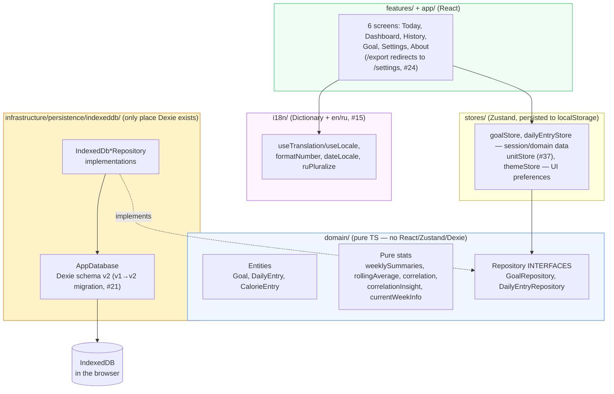
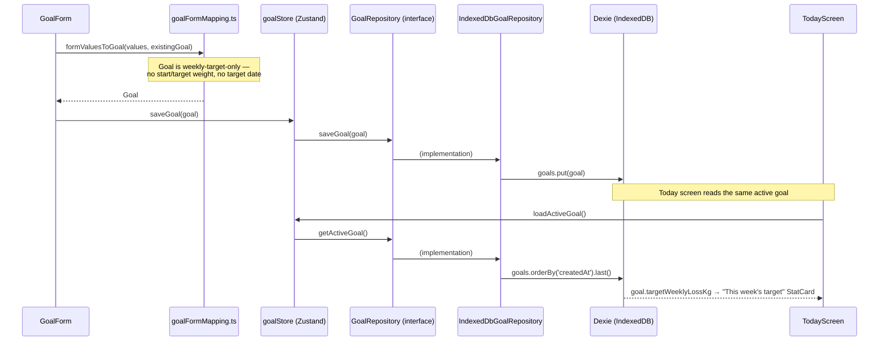

# Turtle Steps to the Goal — Architecture

This document is updated after each issue is completed. It explains what every file does, why it exists, and how the pieces connect.

Product context lives in `PROJECT_BRIEF.md`; the work queue lives in `docs/issues-priority.md`; the public-facing overview (screenshots, live link, dev setup) lives in `README.md` (#58).

---

## System Overview

Turtle Steps to the Goal is a local-first weight-tracking companion built around small, weekly goals rather than one distant number: set a weekly pace, log today's weight and calories, watch the trend. Everything runs in the browser — no backend, no accounts, no telemetry. All data lives in the user's own IndexedDB.

The codebase follows Clean Architecture layering with feature-based folders:

**The one dependency rule that matters:** `domain/` imports nothing from React, Zustand, or Dexie. Features and stores talk to persistence only through the repository interfaces, so a future sync backend would mean writing `Api*Repository` implementations, not a rewrite of stores or components. `i18n/` is a UI-layer concern (it exports React hooks) and sits alongside `stores/`, not inside `domain/`.

**A known simplification vs. sibling projects:** stores and `exportActions.ts` each instantiate `new IndexedDbGoalRepository()` / `new IndexedDbDailyEntryRepository()` directly at module scope, rather than through a swappable factory/DI seam (compare `life-kaleidoscope`'s `getRepositories()`/`setRepositories()`). `Dashboard`'s and `History`'s data hooks (`useDashboardData`, `useHistoryData`) follow the same direct-instantiation pattern rather than routing through `dailyEntryStore`, since neither screen needs single-entry session state — they need "all entries," which the shared stores don't model. Fine while IndexedDB is the only implementation that exists; revisit if a second backend is ever built.

**Three separate preference stores, not one:** display unit (`unitStore`), mood/color-scheme (`themeStore`), and locale (`i18n/localeStore.ts`) are three independent Zustand stores with three independent `localStorage` keys (`turtle-steps-unit`, `turtle-steps-theme`, `turtle-steps-locale`), split across `src/stores/` and `src/i18n/` rather than one unified preferences store. Not a problem in practice, but worth knowing before assuming a single "settings" state object exists anywhere.

---

## Data Flow — setting a goal, then logging today against it

`getActiveGoal()` is "most recently created goal" — there is no explicit active/inactive flag; saving a new goal (or the same goal's id again) always becomes the one Today reads. `DailyEntry` saves follow the identical shape through `dailyEntryStore` → `DailyEntryRepository` → `IndexedDbDailyEntryRepository`, keyed by the entry's `date` (a unique Dexie index — one entry per date, upserted by `put`).

**Display unit is not part of this flow.** `Goal` has no `displayUnit` field (removed in #37) — kg/lb is a UI-only preference read from `unitStore` and applied at render time via a local `toDisplay(kg)` helper in every screen that shows a weight-derived number (`TodayScreen`, `GoalScreen`, `DashboardScreen`'s charts, `HistoryScreen`'s rows/detail). The stored value is always kg, everywhere.

---

## Module Reference

### Domain layer (`src/domain/`)

Pure TypeScript. Unit-testable with no DOM. If a file here ever needs `react`, `zustand`, or `dexie`, the logic belongs in `infrastructure/` or `features/` instead.

#### `src/domain/goal/`

| File | Purpose |
|------|---------|
| `Goal.ts` | The entity: `id`, `targetWeeklyLossKg` (the only target concept — this week's pace, set and renewed week to week), `createdAt`/`updatedAt`. **No `displayUnit`** (moved to `unitStore`, #37) and **no long-term target weight or target date** (removed in #14) — the product's small-steps framing means the app never shows a distant "big goal" number, only the current week's target. |
| `GoalRepository.ts` | Interface: `getActiveGoal()`, `saveGoal(goal)`, `getAll()` (`getAll` added for Epic 8 export). |
| `calorieDeficit.ts` | `estimatedDailyCalorieDeficitKcal(targetWeeklyLossKg)` — the brief's ~7700 kcal-per-kg-of-fat approximation, explicitly labeled non-medical everywhere it's surfaced in the UI. |
| `units.ts` | `lbToKg` / `kgToLb` — pure conversion, `KG_PER_LB = 0.45359237`. Used both by `GoalForm`'s form-mapping and by every screen's `toDisplay()` unit conversion. |
| `index.ts` | Barrel. |

#### `src/domain/dailyEntry/`

| File | Purpose |
|------|---------|
| `DailyEntry.ts` | The entity: one row per `date` (ISO string, unique). `weightKg?`, `note?`, `emotion?: Emotion` (the **day's overall mood**, distinct from any meal's own emotion — #44; `Emotion = 'happy' \| 'unhappy' \| 'neutral'`, unchanged by #54), `calorieEntries?: CalorieEntry[]` — itemized per-meal list (#21), replacing the original single `caloriesConsumed` number. `sleepHours?`/`deepSleepHours?` (#59 — independent optional numbers, no cross-check between them), `steps?` (#60), `onPeriod?: boolean` (#61 — opt-in menstrual cycle tracking, gated by a Settings-only toggle that never travels with backups). **#81 restructured `CalorieEntry` into a group of items**, so multiple dishes eaten together (soup + bread + cheese) can share one meal instead of always becoming separate ones: `CalorieEntry { id, items: CalorieItem[], note?, emotion?: MealEmotion, timeEaten?, createdAt }` — `note`/`emotion`/`timeEaten` stay **group-level** (unchanged meaning from before #81, just relocated), a group always has at least 1 item (its last item removed = the group removed). `CalorieItem` (new, same file): `{ id, name?, amountKcal, proteinG?, fatG?, carbsG? }` — just a dish name + kcal + macros, no note/mood/time of its own. |
| `calorieEntryTotals.ts` | New in #81: `calorieEntryKcal(entry)` (always a real number — sums `entry.items`), `calorieEntryProtein/Fat/Carbs(entry)` (undefined, not 0, when none of the group's items logged that macro — same convention as the day-level totals below, just one level down). The only place that knows how to sum a single group's items; `DailyEntryForm.tsx`/`DayDetail.tsx` use these for each meal's own heading/summary line. |
| `totalCalories.ts` | `totalCalories(entries)` — sums a day's `calorieEntries` (each summed over its own items via `calorieEntryKcal`, #81); returns `undefined` (not `0`) when there are none, so "no data" and "logged zero" stay distinguishable everywhere this is displayed. |
| `totalMacros.ts` | `totalProtein`/`totalFat`/`totalCarbs` (#51) — same "undefined, not 0" convention as `totalCalories`, but per-macro. **#81**: now flattens every entry's `items[]` first (`entries.flatMap(e => e.items)`) before summing, so the skip-granularity is per-*item*, not per-meal — two dishes in the same meal can independently log/omit a macro. |
| `DailyEntryRepository.ts` | Interface: `getByDate(date)`, `getRange(start, end)`, `upsert(entry)`, `delete(id)`, `getAll()`, `getEarliestDate()` (added for #18 — a cheap indexed lookup, not a full-table scan, used by `useCurrentWeekInfo`). |
| `index.ts` | Barrel. |

#### `src/domain/mealItem/` — new in #50

A reusable meal-name library, deliberately **not** a foreign key from `CalorieEntry.note`.

| File | Purpose |
|------|---------|
| `MealItem.ts` | `{ id, name, createdAt, updatedAt, lastAmountKcal?, lastProteinG?, lastFatG?, lastCarbsG? }` — the last four added by #86, purely additive/optional, no IndexedDB version bump. Renaming or deleting one never touches already-logged `CalorieEntry.note` text — those are independent strings, not references. The nutrition fields let the food picker offer a saved item as something reusable ("add it again with the same numbers"), not just a bare name; items touched before #86 simply have them undefined until next saved with a note. |
| `MealItemRepository.ts` | Interface: `getAll()`, `findByName(name)`, `upsert(item)`, `delete(id)`. |
| `index.ts` | Barrel. |

#### `src/domain/foodOverride/` — new in #90

Per-device customization of the curated `data/foods.ts` list — hide an item, or correct its per-100g numbers, without touching the shipped source file.

| File | Purpose |
|------|---------|
| `FoodOverride.ts` | `{ foodId, hidden?, kcal100?, protein100?, fat100?, carbs100?, updatedAt }` — keyed by the food's own stable `id` (from `foods.ts`), not a separate uuid, since there's at most one override per food. Local-only, like `mealItems` — not included in export/import backups (same precedent: `mealItems` doesn't travel with backups either, only `goals`/`dailyEntries` do). |
| `FoodOverrideRepository.ts` | Interface: `getAll()`, `upsert(override)`, `delete(foodId)`. |
| `index.ts` | Barrel. |

#### `src/domain/stats/`

Pure functions with unit tests covering edge cases (missing days, single data point, no variance). Now consumed by both `Dashboard` (#6/#7) and `History` (#8) — no longer library-only.

| File | Purpose |
|------|---------|
| `weeklySummaries.ts` | Groups entries into weeks via `date-fns` `startOfWeek`/`endOfWeek`, given an explicit `weekStartsOn` day parameter (#85, default `1`/Monday — the original hardcoded `startOfISOWeek`/`endOfISOWeek` behavior). Per week: `averageWeightKg`, `averageCalories` (via `totalCalories`, `null` if no entries have calories that week), `averageProteinG`/`averageFatG`/`averageCarbsG` (#53, same per-macro averaging as `totalMacros.ts` — only over days that logged that specific macro), `deltaVsPriorWeekKg` (vs. the previous week's average), and `targetMet` (whether the actual loss met `goal.targetWeeklyLossKg` — `null` without a goal or a prior week to compare). Powers `WeeklySummaryCards`, `MetTargetList`, `CorrelationView`, and `useWeeklyGoalCelebration`; each resolves its own `weekStartsOn` via `useWeekStartsOn`/`resolveWeekStartsOn` (see `shared/` below) rather than this function knowing anything about the preference itself. |
| `rollingAverage.ts` | `rollingAverage(entries, field, windowDays)` — trailing-window average per distinct date present in the data. `field` accepts either a literal `DailyEntry` key or an extractor function, which is what lets `CalorieTrendChart` roll-average the *derived* `totalCalories()` value rather than a raw stored field. A day with no qualifying values in its window gets `average: null` rather than being dropped. |
| `correlation.ts` | Plain Pearson correlation coefficient between weekly average calories and that week's weight change. `null` when there are fewer than two comparable weeks or no variance in either axis. Not directly rendered anywhere — `correlationInsight.ts` is what actually backs the UI. |
| `correlationInsight.ts` | The plain-language companion to `correlation.ts` that `CorrelationView` (#7) actually uses: splits comparable weeks into lower-/higher-calorie halves by median (needs `MIN_COMPARABLE_WEEKS = 4`), reports which half averaged more loss and a rounded `thresholdKcal` — arithmetic, not statistics, on purpose. Takes the same `weekStartsOn` param (#85) as `weeklySummaries`, which it calls internally. |
| `currentWeekInfo.ts` | `currentWeekInfo(today, earliestEntryDate, weekStartsOn = 1)` — computes which week "today" is, numbered from the week containing the *earliest logged entry* (Week 1), not from goal-creation date (goals have no start date and can be renewed freely, per #14). `weekStartsOn` (#85) defaults to Monday. Backs `useCurrentWeekInfo` (#18). |
| `index.ts` | Barrel. |

**History:** `projectedTrajectory.ts` was removed in #14 (it depended on `Goal` fields that no longer exist). #6 later added a new pace-based overlay, `projectedPaceTrajectory`, to `WeightTrendChart` — which #46 then removed outright per live feedback (no projection/prognosis line at all today; `WeightTrendChart` no longer takes a `goal` prop).

---

### Persistence layer (`src/infrastructure/persistence/indexeddb/`)

The only folder allowed to import Dexie.

#### `db.ts`
**Why it exists:** Single definition of the IndexedDB schema, now on its sixth version.

| Version | Change |
|---------|--------|
| 1 | `goals: 'id, createdAt'`, `dailyEntries: 'id, &date'` (`&date` unique — one entry per date at the storage level). |
| 2 (#21) | Same store shape (no index changes) + an `.upgrade()` block: for each `dailyEntries` row, if a legacy `caloriesConsumed` number exists and no `calorieEntries` yet, it's wrapped into a single-item `calorieEntries` array (new `crypto.randomUUID()` id, reuses the row's `createdAt`), then `caloriesConsumed` is deleted. |
| 3 (#50) | Adds `mealItems: 'id, &name'` (`&name` unique). New store only, no `.upgrade()` needed — nothing pre-existing to migrate. |
| 4 (#54) | Same store shape (no index changes) + an `.upgrade()` block: strips `emotion` from every item in each `dailyEntries` row's `calorieEntries[]` (old happy/unhappy/neutral values don't map to the new thumbsUp/thumbsDown/bellissimo set — cleared outright, no auto-mapping). The row's own top-level `emotion` (day mood) is untouched. |
| 5 (#81) | Same store shape (no index changes) + an `.upgrade()` block: folds each flat `calorieEntries[]` meal into a single-item group — the meal's `id` becomes the group's `id`, its `note` becomes the one item's `name` (a fresh `crypto.randomUUID()` item id), `amountKcal`/`proteinG`/`fatG`/`carbsG` move onto that item, and `emotion`/`timeEaten` stay on the group. Rows with no `calorieEntries` at all are left untouched (not coerced to an empty array). |
| 6 (#90) | Adds `foodOverrides: '&foodId'` (`&foodId` unique — one override per curated food, at most). New store only, no `.upgrade()` needed. |

Database name: `turtle-steps-to-the-goal`. `db.migration.test.ts` seeds a raw v1-schema Dexie instance with a legacy `caloriesConsumed` row, an untouched `weightKg`-only row, a pre-#54 row with an old-format meal emotion, and a pre-#81 flat-meal row, then opens the real `db` (which cascades through every pending `.upgrade()` in one open) and asserts each transformation landed correctly.

#### `goalRepository.ts` — `IndexedDbGoalRepository`
`getActiveGoal()` = `db.goals.orderBy('createdAt').last()` (most recently created). `saveGoal()` = `put` (insert or overwrite by id). `getAll()` = full table ordered by `createdAt`, added for Epic 8 export.

#### `dailyEntryRepository.ts` — `IndexedDbDailyEntryRepository`
`getByDate` uses the unique `date` index. `getRange` uses `.between(start, end, true, true)` (inclusive both ends) sorted by date. `upsert` is a `put`. `getAll` is ordered by date, added for Epic 8 export. `getEarliestDate()` (added for #18) is a cheap indexed lookup for the single earliest `date`, not a full scan.

#### `mealItemRepository.ts` — `IndexedDbMealItemRepository` (#50)
`getAll()` = `orderBy('name')`. `findByName()` uses the unique `name` index — the basis for upsert-by-name (`touch`) in `mealItemStore`, since `.put()` on a unique index throws if you try to insert a colliding name under a different primary key.

#### `foodOverrideRepository.ts` — `IndexedDbFoodOverrideRepository` (#90)
`getAll()` = full table (no ordering — the UI sorts/filters via `foods.ts`'s own order). `upsert()`/`delete()` are keyed by `foodId` directly.

#### `index.ts`
Barrel: `db`, `AppDatabase`, `IndexedDbGoalRepository`, `IndexedDbDailyEntryRepository`, `IndexedDbMealItemRepository`, `IndexedDbFoodOverrideRepository`.

---

### State layer (`src/stores/`)

Zustand. `goalStore`/`dailyEntryStore` own session/domain data (always flowing through the repository interfaces, never through Dexie directly); `unitStore`/`themeStore` own persisted UI preferences (`localStorage`, via Zustand's `persist` middleware — no IndexedDB involvement).

| File | Purpose |
|------|---------|
| `goalStore.ts` | `useGoalStore`: `goal`, `status` (`idle/loading/ready/error`), `error`, `loadActiveGoal()`, `saveGoal(goal)`. Instantiates `IndexedDbGoalRepository` once at module scope. |
| `dailyEntryStore.ts` | `useDailyEntryStore`: `date`, `entry`, `status`, `error`, `loadEntry(date)`, `saveEntry(entry)`. Same shape as `goalStore`. |
| `unitStore.ts` | `useUnitStore` (#37): `unit: 'kg' \| 'lb'`, `setUnit`. Persisted to `localStorage` (`turtle-steps-unit`). This is the kg/lb toggle that used to live on the Goal page — now global, read by `TodayScreen`, `GoalScreen`, `DashboardScreen`'s charts, and every `History` weight display. |
| `mealItemStore.ts` | `useMealItemStore` (#50): `items`, `status`, `loadItems()`, `touch(name, nutrition?)` (upsert-by-name — creates on first use, else just bumps `updatedAt`; trims and no-ops on empty), `rename(id, name)` (merges into an existing item if the new name collides, rather than throwing on the unique index), `deleteItem(id)`. Not persisted to `localStorage` — this is domain data in IndexedDB, unlike `unitStore`/`themeStore`. `touch`'s optional `nutrition` (#86: `{ amountKcal?, proteinG?, fatG?, carbsG? }`) records the last-used values on the `MealItem`, falling back to whatever was already recorded when omitted (a bare `touch(name)` never clears previously known nutrition). |
| `goalCelebrationStore.ts` | `useGoalCelebrationStore` (#55): `celebratedWeekStart: string \| null`, `markCelebrated(weekStart)`. Persisted to `localStorage` (`turtle-steps-goal-celebration`). Deliberately stores only the *single most recent* celebrated week, not a growing history — a new week always has a different `weekStart`, so one value is enough to know "has this week already been celebrated." |
| `cycleTrackingStore.ts` | `useCycleTrackingStore` (#61): `enabled: boolean`, `setEnabled`. Persisted to `localStorage` (`turtle-steps-cycle-tracking`). Settings-only on/off switch — gates whether `DailyEntryForm` renders the `onPeriod` toggle at all; the logged `onPeriod` value itself lives on `DailyEntry`, not in this store. |
| `weekStartStore.ts` | `useWeekStartStore` (#85): `weekStart: 'monday' \| 'firstEntryWeekday'`, `setWeekStart`. Persisted to `localStorage` (`turtle-steps-week-start`), default `'monday'`. Settings-only preference — `'firstEntryWeekday'` anchors every week boundary to whichever weekday the earliest logged entry falls on, for people who started tracking mid-week and found "Week 2" two days after their first entry confusing. Resolved into a concrete `Day` by `shared/lib/resolveWeekStartsOn.ts`, not read directly by `currentWeekInfo`/`weeklySummaries` themselves. |
| `themeStore.ts` | `useThemeStore`: `mood` (`'pond' \| 'dusk' \| 'sage' \| 'tortoise' \| 'lagoon'`, #17), `colorScheme` (`'light' \| 'dark'`), `setMood`, `setColorScheme`. Persisted (`turtle-steps-theme`). Exports `detectDefaultColorScheme()` and `applyTheme()` (sets `data-mood` + toggles `.dark` on `<html>`); `applyTheme()` also runs eagerly at module-import time to stay in sync with an inline pre-paint script in `index.html` that avoids a flash of the wrong theme on load. |
| `foodOverrideStore.ts` | `useFoodOverrideStore` (#90): `overrides`, `status`, `loadOverrides()`, `setHidden(foodId, hidden)`, `setNutrition(foodId, {kcal100, protein100, fat100, carbs100})`, `restoreDefault(foodId)` (deletes the override entirely). Not persisted to `localStorage` — domain data in IndexedDB, same category as `mealItemStore`. `setHidden`/`setNutrition` merge into one existing override per food rather than each creating their own record. |
| `index.ts` | Barrel — exports all stores plus their `Mood`/`ColorScheme`/`Unit`/`WeekStart` types. |

Locale is **not** here — see `src/i18n/localeStore.ts` below.

---

### Internationalization (`src/i18n/`) — Epic/issue #15

New layer since the app's first localization pass. English and Russian, with the locale itself persisted like a UI preference (but structurally separate from `src/stores/` — see the "three preference stores" note above).

| File | Purpose |
|------|---------|
| `Dictionary.ts` | The `Dictionary` interface — one section per feature area (`common`, `nav`, `today`, `dailyEntry`, `goal`, `export`, `dashboard`, `history`, `settings`, `about`). Several entries are functions rather than plain strings, for pluralization/interpolation (e.g. `common.weekLabel(weekNumber, start, end)`, `dailyEntry.mealLabel(n)`, `dailyEntry.emotionLabel(emotion)`, `goal.deficitEstimate(kcal, direction)`, `dashboard.correlationSummary(thresholdKcal, direction)`). |
| `en.ts` / `ru.ts` | Full `Dictionary` implementations for each locale. |
| `localeStore.ts` | `Locale = 'en' \| 'ru'`. `useLocaleStore` (Zustand + `persist`, `localStorage` key `turtle-steps-locale`, default from `detectDefaultLocale()` sniffing `navigator.language`). Free functions `getDictionary(locale)`; hooks `useTranslation()` (full `Dictionary` for the current locale) and `useLocale()` (just the `Locale` string). `SettingsScreen` is the only place that calls `setLocale`. |
| `dateLocale.ts` | `getDateFnsLocale(locale)` — maps to `date-fns/locale`'s `enUS`/`ru`, used everywhere `date-fns format()` needs localized month/weekday names. |
| `formatNumber.ts` | `formatNumber(value, locale, fractionDigits = 1)` and `formatSignedNumber(value, locale)` (always shows an explicit +/−) — both via `Intl.NumberFormat` with `ru-RU`/`en-US`, so Russian gets a decimal comma automatically. `formatExactNumber(value, locale)` (#57, `minimumFractionDigits: 0, maximumFractionDigits: 2`) is for values that were directly entered or are a plain subtraction of two entered values (e.g. weight), where the fixed-1-decimal formatters would round away what the user actually typed — a whole number stays unpadded ("60", not "60.0"), and the max-2 cap both covers typical entered precision and rounds away floating-point subtraction noise. Computed/averaged values (weekly summaries, chart axes) intentionally keep using `formatNumber`'s fixed decimal count. |
| `unitLabel.ts` | `unitLabel(unit, dictionary)` → `t.common.kg` / `t.common.lb`. |
| `ruPluralize.ts` | Standalone Russian plural-form selector (1 / 2–4 / 5+, with the 11–14 exception) for count-based Russian copy. |
| `index.ts` | Barrel. |

---

### Features (`src/features/`)

#### `goal-setup/` — Epic 3, issue #4; reworked to weekly-only in #14

| File | Purpose |
|------|---------|
| `goalFormSchema.ts` | Zod schema: `targetWeeklyLoss` (optional at the type level, required via `superRefine` with a custom message — same pattern as `dailyEntryFormSchema`, so Zod's default NaN/required error text never has to be relied on). No unit field in the schema — see below. |
| `goalFormMapping.ts` | `goalToFormValues` (Goal → form, converts to the *display* unit read from `useUnitStore` — the unit itself is a caller-supplied argument, not read from `Goal`), `formValuesToGoal` (form → Goal, converts back to kg), `effectiveWeeklyPaceKg` (live pace preview from possibly-incomplete form state, used for the on-screen calorie-deficit estimate as the user types). |
| `GoalForm.tsx` | RHF + `zodResolver`. A single "This week's target" `NumberInput` — **no unit toggle** (moved to Settings in #37; the form reads the current unit from `useUnitStore` for display/conversion only). Shows the rough daily-calorie-deficit estimate live, captioned non-medical. |
| `GoalScreen.tsx` | Loads the active goal on mount, shows a `StatCard` summary (the weekly target, week-range description via `useCurrentWeekInfo`) when one exists, renders `GoalForm` underneath either way. |
| `index.ts` | Barrel. |

#### `daily-log/` — Epic 4, issue #5; substantially rebuilt across #21/#28/#31/#36/#42/#44

No longer a simple single-submit form. Current shape:

| File | Purpose |
|------|---------|
| `dailyEntryFormSchema.ts` | Zod schema; `weightSchema` (20–400kg), `noteSchema`, per-meal `calorieEntrySchema` (`amountKcal` 0–10000, optional `note`/`emotion`). No longer requires "at least one of weight or calories" — see #31 below. |
| `dailyEntryFormMapping.ts` | `entryToFormValues`, `formValuesToEntry`. |
| `DailyEntryForm.tsx` | The big one. Weight, Sleep, Steps, and Note render **read-only with a pencil-to-edit toggle** once saved (#21, extended to Sleep/Steps by #59/#60), rather than always-editable inputs — except when the `alwaysEditable` prop is set (used by History's inline edit, where "Edit entry" is already the explicit edit gesture). **No single submit button** (#31): Weight, Sleep, Steps, Note, and each meal save independently and immediately via `onSave`, which can fire many times in one session. Sleep (#59, between Weight and Steps) is two independent optional fields — `sleepHours`/`deepSleepHours` — saved together as one unit via a single pencil/Save pair, same UX shape as Weight but for a pair of numbers; the read display renders `t.dailyEntry.sleepSummary()`, `—` per field not logged. Each is **entered as separate hours+minutes integer sub-fields** (#69, 4 inputs total) rather than one decimal field — decimal-hours entry on a mobile numeric keypad read as "hours only" in real use. Storage stays decimal (`sleepHours`/`deepSleepHours` unchanged); `splitHoursMinutes`/`combineHoursMinutes` (module-level helpers in `DailyEntryForm.tsx`) convert only at the UI boundary — the hours/minutes sub-fields are local component state, not react-hook-form fields, combined into the decimal only in `saveSleep()`. Steps is a single optional field, same shape as Weight exactly — a fixed narrow `w-24` input capped at 20,000/day (#68; originally `flex-1`/100,000, both narrowed after real-world feedback that the field was oversized and the ceiling unrealistic). Originally #60 placed it between Sleep and Calories; **#101 moved it down to sit right before the Day note instead** — unlike Weight/Sleep, step count usually isn't known until later in the day, so its old spot among the morning fields was misleading. **No cycle-tracking control here** — #61 originally added an `onPeriod` toggle button between Steps and Calories (back when Steps was still up there), but #71 removed it after live feedback that a control shown every day for something relevant ~5 days/month was unwanted noise; see `history/DayDetail.tsx` below for its new home. `EmotionPicker` is generic over both emotion sets (`<E extends string>`, taking `options`/`labelFor` props) — the day's overall mood (`DailyEntry.emotion`, #44) uses `DAY_EMOTIONS` (`Smile`/`Meh`/`Frown`), a meal's own reaction uses `MEAL_EMOTIONS` (thumbs up/down + "bellissimo" as the 🤌 emoji, #54). Its selected-state style (#84) is `border-2 border-primary bg-primary/15`, not `bg-muted` — `--muted` sits too close to `--background` in dark mode to read as selected, and for the emoji options `text-foreground` has no visual effect at all, so the background/border used to be the *only* indicator; `--primary` is deliberately high-contrast against background in every mood theme. **Meals (#81 — grouped items):** `MealListItem` renders each `CalorieEntry` as a group, not a flat record. **View mode:** heading = `calorieEntryKcal(entry)` + time-eaten + mood icon; below it, the group's own free-text `note` (if any) and its macro summary (`calorieEntryProtein/Fat/Carbs`, via `macrosSummaryText`); below that, an indented item sub-list — each `CalorieItem` as "name — kcal · macros" (`macrosSummaryTextCompact`), name omitted if blank. **Edit mode:** every item gets its own editable row (name via `MealNoteAutocomplete`, kcal/protein/fat/carbs via plain inputs, a per-item delete button) plus a "+ Add item" button that appends a blank `EditItemDraft` row — this is the *only* way to add another item to an *already-existing* group (the flexible-grouping design decided for #81: no fixed Breakfast/Lunch/Dinner slots, just "add this into an existing meal or start a new one"). Below the items, group-level time-eaten and mood, then the group's own note input (plain, no autocomplete — a comment about the meal, not a dish name). Saving with zero items left removes the whole group (`saveEditMeal()`'s `items.length === 0` branch), matching "delete meal" outright. Group-level drag-and-drop reordering is unchanged from #36 (`@dnd-kit/core` + `@dnd-kit/sortable`); reordering items *within* a group is out of scope. **View mode** also carries a Trash2 button next to the Pencil (#97, matching History's `EntryRow.tsx` precedent) — previously delete was only reachable after opening edit mode first. Both buttons call the same `onRequestDelete`/two-step-confirm flow (`isConfirmingDelete`). **Bottom add row:** kcal/protein/fat/carbs + a `MealNoteAutocomplete` for the new item's name, then group-level time/mood/note, then a full-width Add button — always starts a **new** group with one item (appending to an existing group happens only via editing it, not from here). **#93**: `CalorieItem` gains an optional `amountG` (portion weight in grams) and `MealItem` a matching `lastAmountG`, both purely additive/optional (no version bump, same pattern as #86's `lastAmountKcal` etc.) — originally shipped as an inert "Grams" memory-aid field, since superseded by #96 below. **#96**: the kcal/protein/fat/carbs fields on the bottom add row and each item-edit row are **per-100g rates, not the eaten totals** — the same model `FoodPickerDialog` already used for curated foods, now driving manual entry too, replacing "type the total you ate" outright (not a toggle). `scaleFromPer100g(kcal100, protein100, fat100, carbs100, rawQuantity)` (module-level pure helper) computes the stored absolute `amountKcal`/`proteinG`/`fatG`/`carbsG`/`amountG` from the typed rates × the "Grams" quantity field (`quantity/100`, 1-decimal rounding for macros, same as `FoodPickerDialog`); an invalid/blank quantity defaults to 100 rather than blocking Add, so leaving it untouched behaves exactly like the old "type the total directly" flow (typed rate === total at 100g). No domain or export-schema change — `CalorieItem` still stores computed absolute totals, only the *input* changed. The inverse, `ratesFromAbsolute(...)`, back-calculates rates + quantity from stored totals for `itemDraftFrom` (prefilling an item-edit row) and for `selectAddItemMealItem`/`selectEditItemMealItem` (#94, restoring a suggested name's rates instead of its absolute totals). An item with no recorded `amountG` (created before #93/#96) is treated as quantity 100, so its stored totals become the per-100g rate unchanged. `FoodPickerDialog.onAdd` now also passes the `amountG` the totals were scaled from (the picked quantity for a curated food, or the reused item's own `lastAmountG` for a personal one) so a food-picked item can later be edited the same per-100g + quantity way. The kcal field's label (`addCaloriesLabel`, reused verbatim for both the add row and, composed with a `— Meal N` suffix, each item-edit row) reads "kcal/100g" to signal the rate, not the total; Protein/Fat/Carbs/Grams keep their existing bare labels, relying on the kcal field to establish the per-100g context for the row. **#98**: both rows also show a live-updating preview line ("Total: 300 kcal · P 20g · F 5g · C 2g", `formatComputedTotal` + `macrosSummaryTextCompact`) recomputed on every keystroke from the exact same `scaleFromPer100g` result Add/Save will use — makes the multiplication visible before committing, not just after. Hidden entirely until a valid kcal rate is typed (nothing to preview yet). `parseOptionalMacro` moved to module level (was nested in `DailyEntryForm`) so `MealListItem`'s per-item preview can use it too. **#95**: the bottom add row now carries its own `mealLabel(calorieEntries.length + 1)` heading (plus a `border-t` divider once at least one group already exists) — previously it had no heading at all, so it visually read as a continuation of the last meal group above it rather than the start of a new one; the number previews what the new group's own heading will read once saved. **#107**: that heading row is `flex items-center justify-between`, with the group-level Time input moved up onto it (right-aligned) — Time isn't a macro like kcal/protein/fat/carbs, so keeping it in the fields row diluted the macros' proximity to the item-name input right below them; the fields row is now macros-only (kcal/100g, Protein, Fat, Carbs, Grams). Only the bottom add row changed — each item-edit row's own Time field is already a separate, group-level control paired with the mood picker below the item list, not mixed into any per-item macros row, so it was out of scope. Both the bottom row's item-name field and every item-edit row's name field render **`MealNoteAutocomplete.tsx`** (#86, replacing #50's native `<input list>` + `<datalist>`) — iOS Safari has a long-standing WebKit limitation where `<datalist>` popups often don't render for text inputs at all. The replacement is a hand-rolled dropdown: a controlled text input plus an absolutely-positioned suggestion list (filtered client-side, click-outside/Escape to close), populated from `useMealItemStore`. Saving an item with a non-empty name calls `touch(name, { amountKcal, proteinG, fatG, carbsG })` to upsert it into the library (per-*item*, not per-group, since #81 — matches what actually gets reused later via `FoodPickerDialog`). **#94**: `MealNoteAutocomplete` also takes an optional `onSelectItem?: (item: MealItem) => void`, fired alongside `onChange` when a suggestion is clicked — previously picking a suggestion only filled in the name, even though `MealItem.lastAmountKcal`/macros already had exactly the numbers to restore (the same ones `FoodPickerDialog`'s reuse path already used). Both call sites wire it up: the bottom add row's `selectAddItemMealItem` sets `addAmount`/`addProtein`/`addFat`/`addCarbs`; each item-edit row's `selectEditItemMealItem(id, item)` updates that row's `EditItemDraft` the same way. No-op when the matched item has no recorded nutrition yet (`lastAmountKcal === undefined`) — nothing to restore. A native `<input type="time">` (#65) is group-level — starts **empty** in the add flow, resetting to empty after each add (#82 reversed #65's original "defaults to now" behavior); editing an existing group reflects its actual saved value with no forced default. Copy: the item-name field's placeholder (`itemNamePlaceholder`, split off from the group note in #81) reads "Add a dish?"/"Создать блюдо?" — the wording #80 originally gave the (then item-less) meal note; RU reworded again by #108 since "Добавить своё блюдо?" read as a yes/no question rather than an instruction. The group's own `note` field now carries different copy fitting its new group-level meaning: "Anything else about this meal?"/"Было вкусно?" (RU reworded by #105, was "Что-нибудь ещё об этом приёме пищи?" — too formal/official for a casual daily-use app). The separate day-level Note field (#87) reads "Day's note"/"Заметка дня" with its own `noteFieldPlaceholder` ("Want to share anything for the day?"/"Как прошёл день?"), unrelated to either of the above. Add and "+ Food"/"Find food" (#79/#86) render *after* the note/mood row rather than before it, Add full-width `variant="default"`, disabled until `addKcal100Preview` (#98's already-parsed rate) is a valid positive number (#109) rather than silently no-opping on click. "Find food" opens **`FoodPickerDialog.tsx`** (#62) — see below. |
| `FoodPickerDialog.tsx` | Quantity-based entry against the static food list (#62): a Radix Dialog (`shared/ui/dialog.tsx`, #55) with a search input filtering `src/data/foods.ts` by the current locale's name, a result list, and a grams-quantity field that appears once a food is picked. Each list row shows a muted per-100g kcal/macros subtitle (#75, `macrosSummaryTextCompact`) so the numbers can be sanity-checked before picking, not just after. The list has **no independent scroll region** (#74) — it grows to full content height and lets `DialogContent`'s own scroll handle it; see below. On confirm, scales the food's per-100g kcal/protein/fat/carbs by `quantity / 100` and hands the computed numbers plus the food's localized name back to `DailyEntryForm` via an `onAdd` callback — `addFoodEntry()` there adds it as a new single-item meal group (`CalorieEntry { items: [{ name, amountKcal, ... }] }`, #81), same as the manual add row's default behavior. Does **not** call `touchMealItem` — the food list is a separate, curated reference source, not the user's own meal-name history (`useMealItemStore`), so picking a food doesn't pollute that autocomplete library. **Lazily mounted in `DailyEntryForm`** (`{isFoodPickerOpen && <FoodPickerDialog .../>}`, #78) — with the list at 300+ items, rendering it unconditionally (even closed) was measurably slow under full-test-suite parallel load; only mounting it while open keeps the closed case free. **#86**: search now also merges in `mealItems` (a new required prop, passed down from `DailyEntryForm`) — one place to find anything ever added, not just the curated database. Only `MealItem`s with a recorded `lastAmountKcal` are included (nothing to reuse otherwise); a `PickableItem` discriminated union (`{source: 'food', food}` \| `{source: 'mealItem', mealItem}`) drives both the merged result list and `handleAdd()`'s branching — curated foods still scale by quantity, personal items reuse their last-logged absolute kcal/macros as-is (no quantity field shown for them) and are visually distinguished by a "last logged" subtitle instead of "per 100g". **#90**: before searching, `foods.ts` is passed through `applyFoodOverrides()` (reads `useFoodOverrideStore`, loaded on mount) so a hidden item never appears here and a corrected item shows its overridden numbers — the dialog has no idea overrides exist beyond that one call. **#92**: the selected row's highlight is `border-2 border-primary bg-primary/15` (not `bg-muted`) — same dark-mode contrast fix as #84's `EmotionPicker`. **#91**: the quantity field + Add button sit in a `sticky bottom-0` footer (`bg-card`, `border-t`) rather than flowing after the list — with 300+ results and no independent list scroll (#74), the confirm action used to sit below the entire list, off-screen until scrolled all the way past it. **#96**: `onAdd` now also carries the `amountG` the totals were computed from — the picked quantity for a curated food, or the reused item's own `lastAmountG` for a personal one (may be `undefined`) — so `DailyEntryForm`'s `addFoodEntry()` can store it on the created `CalorieItem`, letting that item later be edited the same per-100g + quantity way a manually-entered one can. |
| `data/foods.ts` | `foods: FoodItem[]` (342 items, #62 then expanded #78, #83) — `{ id, en, ru, kcal100, protein100, fat100, carbs100 }`. Combines four public sources: a RIA.ru calorie table (RU-cuisine: meat, fish, dairy, Russian breads/sausages/confectionery, beverages), a FitForFilms macros PDF (UK/international, raw weights — 100g rows only, "average portion" columns dropped), `health-diet.ru`'s prepared-dish tables (#83, RU-cuisine composite dishes: stews, vareniki, cutlets, jams), and USDA FNDDS (#83, "as consumed" prepared/composite dishes: pizza, burgers, pasta, curries, sandwiches). Not a domain entity or repository-backed concern (plain static content, like `releaseNotes.ts`), shipped values not directly user-editable but overridable per-device via `foodOverrides` (#90), not synced with backups. Near-duplicate entries between sources were collapsed to one; dried herbs/spices (2g portions, not meaningfully trackable at 100g) and a niche probiotic-food section were skipped. |
| `TodayScreen.tsx` | A native `<input type="date">` (capped at today via `max`) drives which date's entry is loaded/edited. Shows "This week's target" `StatCard` (via `useCurrentWeekInfo`) or an `EmptyState` pointing at `/goal` when no goal exists. A second `StatCard` shows the day-over-day weight delta (#42, via `usePreviousDayEntry`) with asymmetric emphasis — bold for a loss, muted for a gain/no-change, matching #29's treatment. A quiet end-of-week banner (#38) nudges toward `/goal` on the last day of the ISO week, no dismiss state. Renders `<GoalCelebrationModal />` (#55) at the top, which fires independently of the #38 banner. `key={date}` on `DailyEntryForm` forces a clean remount per date. |
| `GoalCelebrationModal.tsx` | Intentional exception to the app's usual quiet, no-badges treatment of hitting a target (compare #6/#8/#29/#34) — a real `Dialog` (#55), not a StatCard note. Backed entirely by `useWeeklyGoalCelebration`; the CTA links to `/goal` and calls `dismiss()`, same as closing via the `X` button or clicking outside. |
| `index.ts` | Barrel. |

#### `dashboard/` — Epic 5/6, issues #6/#7 (done)

Fully built; no longer a placeholder.

| File | Purpose |
|------|---------|
| `DashboardScreen.tsx` | Loads data via `useDashboardData`; renders `WeightTrendChart`, `CalorieTrendChart`, `CorrelationView`, `WeeklySummaryCards` in order, or an `EmptyState` with zero entries. |
| `useDashboardData.ts` | Direct-repository hook (not routed through `dailyEntryStore` — see the "known simplification" note above): fetches all entries via `IndexedDbDailyEntryRepository.getAll()` plus the active goal via `useGoalStore`. |
| `WeightTrendChart.tsx` | Recharts `LineChart` of weight over time, unit-aware via `unitStore`. Tap/click on a point navigates to `/history?date=...` (#41) via `chartNavigation.ts`; no projection line (#46 removed the pace-projection overlay #6 had originally added). |
| `CalorieTrendChart.tsx` | Recharts `ComposedChart`: daily calorie `Bar` + 7-day rolling-average `Line` overlay (via `rollingAverage()` with an extractor for `totalCalories()`). Same deep-link-on-tap pattern as the weight chart. |
| `MacroTrendChart.tsx` | Recharts `LineChart` (#53), three lines — protein/fat/carbs — on one combined chart rather than three separate ones (same unit, comparable scale, keeps the Dashboard from growing three more full-width charts). Uses new `--chart-protein`/`--chart-fat`/`--chart-carbs` CSS tokens (`src/index.css`) — unlike `--chart-weight` (mood-tinted), these follow `--chart-calories`'s pattern: one consistent hue family with a light/dark pair, constant across all 5 moods, rather than 5 separate mood-specific variants. Same deep-link-on-tap pattern as the other charts; a day only appears if at least one of the three macros was logged that day. |
| `CorrelationView.tsx` | Recharts `ScatterChart` of weekly avg calories vs. that week's weight delta, plus the plain-language summary from `correlationInsight()` and an explicit day-lag caveat. **#89**: the scatter plot itself is collapsed by default (behind a "Show chart" toggle, same chevron pattern as `about/ReleaseNotesSection.tsx`) until `correlationInsight()` returns non-null (needs `MIN_COMPARABLE_WEEKS = 4`) — with fewer weeks it was just a near-empty plot for the first several weeks of use. The caveat/summary text below it is always visible either way; only the chart itself is opt-in before there's a real insight, and renders expanded by default (no toggle) once there is one. |
| `WeeklySummaryCards.tsx` | One `StatCard` per ISO week from `weeklySummaries()`, most-recent-first; asymmetric emphasis (bold loss, muted gain/no-change, #29) and no plus sign on gains (#34); a quiet "target met" note, deliberately not a badge. Description line also includes the week's average macros (#53, via shared `macrosSummaryText`) alongside average calories, when logged. |
| `chartNavigation.ts` | `resolveChartClickDate()` — resolves a Recharts click/hover event into a valid History date or `null` by looking the label up in the chart's own `data` array, rather than trusting Recharts' `activePayload`/`activeDataKey` (documented as unreliable on combo charts). Root-caused and fixed across #41/#45/#49 — tapping now only navigates via an explicit in-tooltip link (`wrapperStyle={{pointerEvents:'auto'}}`), not any tap on the chart area, so the chart stays usable for just viewing. **#33**: that same `pointerEvents:'auto'` tooltip is rendered *inside* Recharts' own move-tracking wrapper, so a finger drifting from the point that opened the tooltip toward the in-tooltip link could still bubble a mousemove/touchmove up and silently retarget the "active" point to a neighboring date the tooltip box visually overlapped — the link would then navigate to a different day than the one last shown in the tooltip text. Fixed with `onMouseMove`/`onTouchMove` + `stopPropagation()` on the tooltip's own container div, in all three charts below that have a navigation link (`WeightTrendChart.tsx`, `CalorieTrendChart.tsx`, `MacroTrendChart.tsx`); `CorrelationView.tsx` has no link, unaffected. |
| `index.ts` | `DashboardScreen` only. |

#### `history/` — Epic 7, issue #8 (done)

Also fully built.

| File | Purpose |
|------|---------|
| `HistoryScreen.tsx` | Owns filter state (From/To date range, #40; `?date=` deep-link prefill from Dashboard, #41) and a List/Calendar `ToggleGroup` view switcher (#48). Renders `MetTargetList`, then either `CalendarView` or the sortable, filterable table of `EntryRow`s. |
| `useHistoryData.ts` | Same direct-repository pattern as `useDashboardData`; exposes `saveEntry`/`deleteEntry` that call the repository then reload. |
| `CalendarView.tsx` | Month-grid calendar (#48, Monday-start), a marker on days with an entry, tap-a-day opens a `DayDetail` panel; an "Edit this day" action hands off to `HistoryScreen`'s List view pre-filtered/expanded to that date. Takes an `onSaved` prop (#71, threaded from `HistoryScreen`'s `saveEntry`) passed straight through to `DayDetail` for its cycle-tracking toggle. Each day cell can show a **second** marker dot (#72) for `onPeriod` days, styled with `bg-destructive` (the mood-constant "danger" token, reused purely for its color) — that second `` is only rendered at all when cycle tracking is on, so the grid doesn't reserve extra vertical space for a marker most users never see. Both dots render inside a `flex flex-row` wrapper `` that's itself a sibling of the day number (#104) — they used to be direct `flex-col` children of the day button and stacked into two rows; now they sit side by side under the number instead. |
| `DayDetail.tsx` | Shared day-detail renderer — meals, notes, emotions, and the day's overall mood (#39, extended for #44, reused by both `EntryRow`'s expand panel and `CalendarView`'s day panel). A `standalone` prop adds a date/weight/calories header for contexts (calendar) that don't already show that summary elsewhere; that header also gets the day's macro total (#52). Each meal shows its own group heading (`calorieEntryKcal`), note, and macro summary (`calorieEntryProtein/Fat/Carbs`, #81) — same per-group helpers `DailyEntryForm.tsx`'s view mode uses — plus an indented item sub-list (name — kcal · macros each), mirroring `MealListItem`'s read-only rendering. Mostly read-only, but **not purely read-only since #71**: an optional `onSaved` prop, when present alongside `useCycleTrackingStore`'s Settings toggle, renders an "On period" toggle button — clicking it calls `onSaved({ ...entry, onPeriod: !entry.onPeriod, ... })`, the same immediate-save-on-click shape #61 originally used directly on Today. This is the toggle's new home after #61's original placement (a button on Today, shown every day) turned out to be unwanted daily noise for something relevant only a few days a month. |
| `EntryRow.tsx` | One table row with `view / edit / confirmDelete` modes. Edit mode swaps in `DailyEntryForm` (`alwaysEditable`); expand/collapse toggles `DayDetail`; supports `defaultExpanded` for the Dashboard deep-link case. The Calories cell also shows the day's macro total as a muted line beneath the kcal number (#52), omitted when nothing was logged — uses the **compact** single-initial form (`macrosSummaryTextCompact`, #67) rather than the full-word one, since the full-word line was wide enough on mobile to push the Actions column (expand/edit/delete) off screen. The Date cell uses a fixed **`dd.MM.yy`** numeric format (#73), not the localized `'PP'` format used elsewhere (`DayDetail`'s standalone header, Dashboard chart tooltips) — `'PP'` ("15 июл. 2026 г.") was still wide enough on its own to push the Actions column's 3rd icon off screen even after #67's fix, and being locale-agnostic this format needs no `dateFnsLocale`. |
| `MetTargetList.tsx` | A plain list of weeks where the target was met — explicitly not gamified, no badges. |
| `index.ts` | `HistoryScreen` only. |

#### `settings/SettingsScreen.tsx` — issues #37/#43 (done)

Fully built, redesigned in #43 around a consistent `Card`-per-section layout with the shared `ToggleGroup` primitive replacing raw radios everywhere:

1. **Units** — `ToggleGroup` bound to `useUnitStore` (kg/lb) — landed here from the Goal page in #37.
2. **Week start** (#85) — `ToggleGroup` bound to `useWeekStartStore.weekStart` ("Monday" / "Day of my first entry"), default Monday.
3. **Language** — `ToggleGroup` bound to `useLocaleStore` (en/ru).
4. **Appearance** — 5 mood swatches bound to `useThemeStore.mood`, plus a light/dark `ToggleGroup` bound to `colorScheme` (#17).
5. **Cycle tracking** (#61) — on/off `ToggleGroup` bound to `useCycleTrackingStore.enabled`, off by default. The only effect of turning it on is that `DayDetail` starts rendering the `onPeriod` toggle (moved off Today by #71); no gender field, no phase/prediction logic.
6. **Meal items** (#50) — `MealItemsSection.tsx`: lists every `MealItem` from `useMealItemStore`, each row an inline-editable name (commits on blur/Enter via `rename()`) + a Pencil + a delete button. Empty state when nothing's been logged yet. **#99**: the Pencil toggles a nutrition editor for that item — kcal/protein/fat/carbs/grams inputs using the same per-100g + quantity model as everywhere else (#96), pre-filled by back-calculating a rate + quantity from the item's stored `lastAmountKcal`/macros/`lastAmountG` via `ratesFromAbsolute` (blank if nothing recorded yet), with a live computed-total preview (#98's `formatComputedTotal`) and Save calling `touch(item.name, scaleFromPer100g(...))` directly — no new store action needed, `touch()` already upserts exactly these fields. A non-editing row also shows a "last logged" subtitle (same wording `FoodPickerDialog` uses for these items) when nutrition exists. `scaleFromPer100g`/`ratesFromAbsolute`/`formatComputedTotal`/`parseOptionalMacro` moved from `DailyEntryForm.tsx` to `shared/lib/macroScaling.ts` so both screens can use them.
7. **Food list** (#90) — description + a "Manage food list" button linking to the new `/settings/foods` route (`FoodListSettingsScreen.tsx`, its own screen rather than an inline card — the curated list has 300+ items, too many to always render inline).
8. **Export** — embeds `<ExportSection />` (from `features/export`) inside a `Card`, folding what used to be a standalone `/export` route into Settings (#24).

Release notes (#63) used to be a card here but moved to the About page in #66 — see `about/AboutScreen.tsx` below.

#### `settings/FoodListSettingsScreen.tsx` — new in #90

A dedicated management screen for the curated `data/foods.ts` list (reached from Settings, not a tab-bar item) — search + one row per food, each showing its *effective* values (`effectiveFoodItem`, shipped numbers or the override if one exists). Per row: a pencil opens inline kcal/protein/fat/carbs inputs (same input-row shape as `DailyEntryForm`'s meal editing) with a Save button calling `setNutrition`; a Hide/Show toggle button calls `setHidden`; a "Restore default" button (shown only when an override exists) calls `restoreDefault`, clearing the override entirely. A hidden food still renders here (with a "(Hidden)" label) rather than disappearing — this screen is where you'd go to un-hide it, so it can't itself apply the hiding filter the way `FoodPickerDialog` does.

#### `export/` — Epic 8, issue #9; folded into Settings in #24, schema bumped in #21

| File | Purpose |
|------|---------|
| `exportBundleSchema.ts` | Current schema is **`version: 5`** (bumped from 4 for #81's meal-grouping restructure — `calorieEntrySchema` now has `items: calorieItemSchema[]` instead of flat `amountKcal`/`proteinG`/`fatG`/`carbsG`). Three parallel legacy schemas are kept alongside it so old backup files stay importable: `exportBundleSchemaV4` (flat per-meal kcal/macros, pre-#81), `exportBundleSchemaV3` (meal `emotion` still using the day's happy/unhappy/neutral set), and `exportBundleSchemaV2` (flat `caloriesConsumed: number`, pre-#21). |
| `exportBundle.ts` | `buildExportBundle(goals, dailyEntries)` — stamps `version: 5` + `exportedAt`. |
| `exportActions.ts` | `exportAllData()` (reads both repositories' `getAll()`), `importAllData(bundle)` (upserts every goal/entry — merge, not destructive replace), `parseExportBundle(raw)` — tries the current v5 schema first, then v4 (folds flat meals into single-item groups via the shared `foldFlatMealsIntoGroups` helper — same transform as the IndexedDB v4→v5 migration), then v3 (clears old-format meal emotions, then also folds into groups), then v2 (wraps `caloriesConsumed`, then folds), otherwise throws `InvalidBackupFileError` with a user-facing message. |
| `ExportSection.tsx` | The export/import UI as a `Card`-content fragment (no `PageHeader` — it's meant to be dropped inside Settings' own `Card`, not rendered as a standalone screen anymore). Export downloads a JSON file via `Blob` + a synthetic anchor click; import is a hidden file input. Reports counts via a hand-written pluralizer, not a naive `+'s'`. |
| `index.ts` | `ExportSection` only — no `ExportScreen` anymore. |

#### `about/AboutScreen.tsx` — issue #23 (new feature area)

Static page: project intro/philosophy/privacy copy from the dictionary, an author credit linking to `github.com/ZhannaM85` (#35). Reachable via the "Heart" nav item, in the tab-bar slot #24 freed by folding Export into Settings. Also hosts **`ReleaseNotesSection.tsx`** (#63, moved here from Settings by #66) — collapsed by default (same chevron-toggle pattern as History's row expand, `#39`), reveals brief bilingual entries from `src/data/releaseNotes.ts` (`{ issue, date, en, ru }[]`, most-recent-first) when opened. That data file is a top-level `src/data/` folder — plain static content, not a domain entity or a repository-backed concern, so it sits outside `domain/`. **Updating it is a required step whenever a GitHub issue closes** (see `CLAUDE.md`), alongside `docs/issues-priority.md` and this file. The #66 move was a straight relocation, not a rename pass: its dictionary strings stayed under `settings.releaseNotesLabel`/`showReleaseNotes`/`hideReleaseNotes` rather than being renamed to an `about.*` namespace.

---

### App shell & routing (`src/app/`, `src/main.tsx`)

| File | Purpose |
|------|---------|
| `router.tsx` | `createBrowserRouter`, all screens nested under `AppShell`: `/` (Today), `/dashboard`, `/history`, `/goal`, `/settings`, `/settings/foods` (`FoodListSettingsScreen`, #90 — the app's first drill-down sub-page, not a tab-bar item; `NavLink`'s default non-`end` matching still highlights the "Settings" tab for it), `/about` (#23), and `/export` → `<Navigate to="/settings" replace />` (#24 — kept as an explicit redirect for anyone with the old route bookmarked, rather than a dead link). `basename: import.meta.env.BASE_URL` so routes resolve correctly under the GitHub Pages subpath. |
| `AppShell.tsx` | One shared `useNavItems(t)` array (Today/Dashboard/History/Goal/Settings/About — no Export entry) drives both a header `<nav aria-label="Main">` (hidden below `sm:`, **sticky** — `sticky top-0 z-10 border-b border-border bg-background`, #25) and a fixed bottom `<nav aria-label="Tabs">` tab bar (visible only below `sm:`, `lucide-react` icon + label per route, `env(safe-area-inset-bottom)` padding). `<main>` gets `pb-28 sm:pb-10` so content clears the fixed bar on mobile. |
| `index.ts` | Barrel. |
| `src/main.tsx` | Entry point: `StrictMode` + `RouterProvider`. |

---

### Design system (`src/shared/ui/`) — Epic 2, issue #3; extended by #12/#16/#43

shadcn-style primitives (Nova preset, `radix-ui` primitives, `cva` variants, aliases at `@/shared/ui`).

| File | Exports | Notes |
|------|---------|-------|
| `button.tsx` | `Button`, `buttonVariants` | Variants: `default/outline/secondary/ghost/destructive/link`; sizes incl. icon variants. |
| `card.tsx` | `Card` + `Header/Title/Description/Content/Footer/Action` | Standard shadcn card family, now the standard section wrapper across Settings/Dashboard/History (#43). |
| `input.tsx` | `Input` | Bare styled `<input>`. |
| `label.tsx` | `Label` | Radix `Label.Root` wrapper. |
| `text-field.tsx` | `TextField` | Labeled input with `hint`/`error`, wires `aria-invalid`/`aria-describedby`, id via `useId`. |
| `number-input.tsx` | `NumberInput` | Same labeled-field pattern as `TextField`, plus a unit suffix slot and an optional `InfoTooltip` (#16). Renders `type="text"` `inputMode="decimal"` (issue #12 — was `type="number"`, which silently rejected the comma decimal separator on some mobile keyboards/locales; pairs with `parseNumberInput()` accepting both `.` and `,`). |
| `info-tooltip.tsx` | `InfoTooltip` | Radix `Popover`-based tap-triggered info icon (#16) — e.g. the Calories field's day-lag-with-weight explanation. |
| `toggle-group.tsx` | `ToggleGroup`, `ToggleGroupItem` | Radix `ToggleGroup` wrapper (#43) — replaces raw radio inputs for unit/language/mood/color-scheme (Settings) and List/Calendar (History) toggles. |
| `dialog.tsx` | `Dialog`, `DialogTrigger`, `DialogContent`, `DialogTitle`, `DialogDescription` | Radix `Dialog` wrapper (#55) — the app's first real modal primitive; every other "detail" surface (History's expand panel, `InfoTooltip`) had used inline/popover patterns instead. `DialogContent` requires a `closeLabel` prop (no visible text on the icon-only close button). Caps at **`max-h-[85dvh] overflow-y-auto`** (#74) so the whole dialog scrolls as one unit on mobile — uses `dvh` (dynamic viewport height) rather than `vh`, since `vh` doesn't shrink when the on-screen keyboard opens, which had let tall content (`FoodPickerDialog`) get pushed partly behind the keyboard with no way to reach the rest. |
| `stat-card.tsx` | `StatCard` | Large numbers-first card: label, big value + unit, optional description — the brief's "numbers should be the largest things" directive as a primitive. |
| `empty-state.tsx` | `EmptyState` | Calm empty screen (icon/title/description/action) — no guilt copy, per brief §2. |
| `page-header.tsx` | `PageHeader` | `h1` + description + right-aligned action slot; every screen opens with one. |

### Shared (`src/shared/`)

| File | Purpose |
|------|---------|
| `lib/utils.ts` | `cn()` — `clsx` + `tailwind-merge`. |
| `lib/emotionIcons.ts` | `DAY_EMOTIONS: { value: Emotion; Icon: LucideIcon }[]` — happy/neutral/unhappy → `Smile`/`Meh`/`Frown`, real lucide icons. `MEAL_EMOTIONS: { value: MealEmotion; Icon?: LucideIcon; emoji?: string }[]` (#54) — **all three are emoji** (👍/👎/🤌), not lucide icons: `ThumbsUp`/`ThumbsDown` were tried first, but two monochrome line icons next to bellissimo's 🤌 (no lucide equivalent exists) looked inconsistent side by side, so all three switched to emoji for visual consistency within this one picker (#64) — at the cost of no longer matching the app's lucide-icon system the way `DAY_EMOTIONS` still does. Both consumed by `DailyEntryForm` and `DayDetail`. |
| `lib/parseNumberInput.ts` | `parseNumberInput(value)` — normalizes both `.` and `,` decimal separators into a number for React Hook Form's `setValueAs`; empty input → `undefined` (not `NaN`), so Zod's `.optional()` behaves correctly. Ties into #12's mobile-decimal fix. |
| `hooks/useCurrentWeekInfo.ts` | Fetches only `getEarliestDate()` (not a full scan) and derives `CurrentWeekInfo` (week number/range) via `domain/stats/currentWeekInfo`. Shared by `TodayScreen` and `GoalScreen` (#18). Reads `weekStartStore` (#85) and resolves it to a concrete `weekStartsOn` via `resolveWeekStartsOn` before calling `currentWeekInfo`. |
| `hooks/usePreviousDayEntry.ts` | Fetches the `DailyEntry` for `date − 1 day`, backing the day-over-day weight-delta stat on `TodayScreen` (#42) — a distinct, unsmoothed number from the week-over-week delta in `weeklySummaries`. |
| `hooks/useWeeklyGoalCelebration.ts` | Backs `GoalCelebrationModal` (#55): fetches all entries (direct repository, same "known simplification" pattern as `useDashboardData`/`useHistoryData`) + the active goal, runs `weeklySummaries()`, and returns `shouldCelebrate` (true when the most recent week's `targetMet` just crossed to `true` and that week hasn't been celebrated yet, per `goalCelebrationStore`) + `dismiss()`. Re-fetches whenever `dailyEntryStore.entry` changes, so a target crossed by a save made *during the current visit* to Today shows up without needing a reload. Resolves its own `weekStartsOn` via `useWeekStartsOn` (#85). |
| `hooks/useWeekStartsOn.ts` | `useWeekStartsOn(entries)` (#85) — resolves the week-start preference (`weekStartStore`) against a set of entries already in hand (finds the earliest date itself), for callers that have `entries` as a prop/local state rather than a dedicated repository fetch the way `useCurrentWeekInfo` does. Used by `WeeklySummaryCards`, `MetTargetList`, `CorrelationView`, `useWeeklyGoalCelebration`. |
| `hooks/index.ts` | Barrel. |
| `lib/resolveWeekStartsOn.ts` | `resolveWeekStartsOn(weekStart, earliestEntryDate)` (#85) — turns the stored preference (`'monday' \| 'firstEntryWeekday'`) into a concrete date-fns `Day` number (0-6). `'firstEntryWeekday'` returns the weekday of `earliestEntryDate` via `getDay()`; both `'monday'` and "no entry yet" fall back to `1`. The one place that knows how to translate the preference into something `currentWeekInfo`/`weeklySummaries` (which only accept a plain `Day`, no knowledge of the preference concept) can use. |
| `lib/macroDisplay.ts` | `formatMacroGrams`/`macrosSummaryText` (#51/#52) — shared macro-formatting, extracted from `DailyEntryForm.tsx` for reuse once `EntryRow`/`DayDetail` also needed to show macro totals. `macrosSummaryText` returns `null` when none of protein/fat/carbs were logged at all, so callers can skip rendering a line entirely rather than showing an all-dashes one. `macrosSummaryTextCompact` (#67) is the same idea with single-initial labels ("P 20g · F 10g · C —" / "Б 20г · Ж 10г · У —") — used only by `EntryRow.tsx`, where the full-word form was overflowing the mobile table width. |
| `lib/applyFoodOverrides.ts` | `applyFoodOverrides(foods, overrides)` (#90) — pure function: drops hidden items, swaps in corrected per-100g numbers where overridden, never mutates `foods.ts`'s own data. Used by `FoodPickerDialog.tsx` (search) and `FoodListSettingsScreen.tsx` (management screen, to compute each row's *effective* displayed values). |
| `lib/macroScaling.ts` | `scaleFromPer100g`/`ratesFromAbsolute`/`formatComputedTotal`/`parseOptionalMacro` (#96/#98, extracted from `DailyEntryForm.tsx` in #99 once `MealItemsSection.tsx` needed the same per-100g + quantity math). `scaleFromPer100g` computes absolute totals from a typed rate × quantity (blank/invalid quantity defaults to 100); `ratesFromAbsolute` is its inverse, back-calculating a rate + quantity from stored absolute totals (missing quantity defaults to 100, same reasoning); `formatComputedTotal` renders a `scaleFromPer100g` result as a compact preview string. |

---

### Tests

Vitest + jsdom + `fake-indexeddb` + React Testing Library + `@testing-library/user-event`. **435 tests across 62 files**, all passing as of issue #90. `FoodPickerDialog.test.tsx` and `FoodListSettingsScreen.test.tsx` both set a 15s file-level `testTimeout` (`vi.setConfig`) — every test in either renders the 300+ item curated list, fast in isolation but flaky under full-suite parallel load at the default 5s.

| Area | Covers |
|------|--------|
| `domain/goal/*.test.ts`, `domain/dailyEntry/*.test.ts` | Pure logic: calorie-deficit arithmetic, unit conversion round-trips, `totalCalories`. |
| `domain/stats/*.test.ts` | Edge cases per function: missing days, a single data point, zero variance (correlation), median-split behavior (`correlationInsight`), week-1 anchoring (`currentWeekInfo`). |
| `infrastructure/persistence/indexeddb/index.test.ts` | Both repositories against `fake-indexeddb`: round-trips, unique-date enforcement, ordering, `getAll()`, `getEarliestDate()`. |
| `infrastructure/persistence/indexeddb/db.migration.test.ts` | The v1→v2 schema upgrade specifically — seeds a raw legacy row, opens the real `db`, asserts the migration transformed only what it should. |
| `stores/*.test.ts` | Store actions against `fake-indexeddb` through the real repository implementations (not mocked), plus `unitStore`/`themeStore` persistence behavior. |
| `shared/ui/*.test.tsx` | Primitives via RTL: labels/errors/ARIA wiring, render smoke tests. |
| `src/theme.contrast.test.ts` | Contrast/accessibility check across the 5 moods × 2 color schemes defined in `src/index.css` — sits at `src/` root as its own category, not under a feature folder. |
| `features/goal-setup/*.test.{ts,tsx}` | Schema validation, form↔domain mapping, full form interaction via RTL. |
| `features/daily-log/*.test.{ts,tsx}` | Itemized calorie entries, drag-and-drop reorder, per-field independent save, date backfill via `fireEvent.change` on the native date input (native date-typing simulation is unreliable in jsdom). |
| `features/dashboard/*.test.{ts,tsx}` | Chart data derivation, `chartNavigation.ts`'s click-resolution logic, correlation summary rendering. |
| `features/history/*.test.{ts,tsx}` | Filtering, calendar/list view parity, edit/delete flows, `DayDetail` rendering across meal/day emotion combinations. |
| `features/export/*.test.{ts,tsx}` | Bundle schema rejection cases (both v2 and v3), export/import round-trip + merge-not-replace semantics, v2→v3 in-memory upgrade on import, `ExportSection` with `URL.createObjectURL`/anchor-click stubbed (absent in jsdom). |
| `app/router.test.tsx` | Routing via `createMemoryRouter`; asserts both nav landmarks (`"Main"`, `"Tabs"`) render on every screen, and that `/export` redirects. |

`test/setup.ts` imports `@testing-library/jest-dom/vitest` and manually wires `afterEach(cleanup)` — RTL's automatic cleanup detection needs `test.globals`, which isn't enabled here.

**Browser verification:** ad-hoc Playwright scripts (not a project dependency — written to a scratchpad and run via `node`) drive the dev server for real end-to-end checks per epic, e.g. two isolated `browser.newContext()`s to verify export-from-device-A / import-to-fresh-device-B, or seeding real IndexedDB state to visually check a screen without a full manual data-entry pass.

---

## Tooling

| Piece | Notes |
|-------|-------|
| Vite 8 + React 19 + TS strict | `moduleResolution: bundler`; `baseUrl` removed (deprecated under TS 6.x), `paths` alone is sufficient. |
| Tailwind CSS v4 (`@tailwindcss/vite`) | CSS-first config. |
| Path alias | `@/ → src/` (`vite.config.ts`, `tsconfig`). |
| ESLint + Prettier | Deliberately not oxlint (create-vite's newer default) — the brief calls for ESLint+Prettier specifically. Flat config; `eslint-plugin-react-hooks` via `reactHooks.configs.flat['recommended-latest']`. `react-refresh/only-export-components` is scoped off for `src/shared/ui/**` only, where shadcn's `cva()` variant exports trip a false positive. |
| Scripts | `dev`, `build` (`tsc -b && vite build`), `preview`, `lint`, `format` / `format:check`, `test` / `test:watch`. |
| Deployment | `.github/workflows/deploy-pages.yml` — builds with `npx tsc -b && npx vite build --base=/turtle-steps-to-the-goal/`, copies `dist/index.html` → `dist/404.html` for SPA routing, deploys via `actions/deploy-pages@v4`. |
| Notable feature dependencies | `recharts` (Dashboard charts, #6/#7), `@dnd-kit/core` + `@dnd-kit/sortable` + `@dnd-kit/utilities` (meal reordering, #36), `radix-ui` (`Popover`/`ToggleGroup`/etc. primitives, #16/#43), `date-fns` (ISO week math + locale-aware formatting throughout), `zustand` `persist` middleware (`unitStore`, `themeStore`, `localeStore`). |

---

## Status

All of Tiers 1–10 in `docs/issues-priority.md` (issues #1–#90) are done — every original epic, the UX/product-model rework, and three full waves of live-feedback polish, with no open issues remaining.

```mermaid
flowchart LR
    subgraph Done1 ["✅ Tiers 1-7 — architecture through QA pass"]
        D1["#1-#5, #9-#10 Foundation,<br/>design system, first vertical slice,<br/>export/import, deployment"]
        D2["#12-#19 UX & product-model rework —<br/>weekly-only goals, mobile-first shell,<br/>localization, mood theming"]
        D3["#6-#8 Core features —<br/>Dashboard, Correlation, History"]
        D4["#11 Accessibility & responsive QA"]
    end
    subgraph Done2 ["✅ Tier 8 — post-launch polish (#20-#49)"]
        D5["30 issues from live use — itemized calories,<br/>emotions, drag-reorder, calendar view,<br/>day-delta stat, chart tap-navigation fixes,<br/>see issues-priority.md for the full list"]
    end
    subgraph Done3 ["✅ Tier 9 — second live-feedback wave (complete, no open issues)"]
        D6["#56 Signed weekly-target display (-0.5 kg)"]
        D7["#57 Weight display: show full entered precision"]
        D8["#58 Add a README with screenshots"]
        D9["#50 Reusable meal items (autocomplete + library)"]
        D10["#54 Meal emotions: thumbs-up/down + bellissimo"]
        D11["#63 Release notes section in Settings"]
        D12["#51 Protein/fat/carbs: capture + Today totals (1/3)"]
        D13["#64 Meal emotions: all-emoji for visual consistency"]
        D14["#52 Protein/fat/carbs: History totals (2/3)"]
        D15["#53 Protein/fat/carbs: Dashboard charts (3/3)<br/>— macros epic complete"]
        D16["#55 Weekly-goal-met celebration modal"]
        D17["#59 Sleep tracking (duration + deep sleep)"]
        D18["#60 Step count tracking"]
        D19["#61 Opt-in menstrual cycle tracker"]
        D20["#67 History: fix macro summary overflow<br/>hiding expand/edit/delete icons"]
        D21["#68 Narrow the Steps input,<br/>lower max to 20,000/day"]
        D22["#69 Sleep entry: hours+minutes<br/>instead of decimal hours"]
        D23["#65 Meal time-eaten field<br/>(intermittent fasting)"]
        D24["#66 Move release notes<br/>Settings to About"]
        D25["#62 Local food/nutrient database<br/>with quantity-based entry"]
        D26["#71 Move cycle-tracking toggle<br/>Today to History day view"]
        D27["#72 Calendar: period marker dots"]
        D28["#73 History: fix trash icon still<br/>hidden after #67 (date format)"]
        D29["#74 Fix food picker dialog scroll<br/>on mobile with keyboard open"]
        D30["#75 Food picker: per-100g<br/>macro preview per row"]
        D31["#76/#77 Copy tweaks: kcal<br/>placeholder, Note label"]
        D32["#78 Expand food list<br/>60 -> 308 items, 2 public sources"]
    end
    subgraph Tier10 ["✅ Tier 10 — third live-feedback wave (complete, no open issues)"]
        D33["✅ #82 Time-eaten field:<br/>stop pre-populating with 'now'"]
        D34["✅ #80 Reword meal-note placeholder"]
        D35["✅ #87 Rename daily note field"]
        D36["✅ #84 Dark-mode selected-emotion contrast"]
        D37["✅ #79 Move Add button below note, full width"]
        D38["✅ #85 Week-start preference"]
        D39["✅ #83 Prepared/composite dishes"]
        D40["✅ #86 Unify meal item search"]
        D41["✅ #81 Group food items under one meal"]
        D42["✅ #88 Dashboard chart tap-to-navigate<br/>goes to the wrong day"]
        D43["✅ #89 Collapse correlation chart<br/>until enough data exists"]
        D44["✅ #90 Let users customize<br/>the curated food list"]
    end
    Done1 --> Done2 --> Done3 --> Tier10
```

See `docs/issues-priority.md` for the full ordered queue and the reasoning behind tier order.
