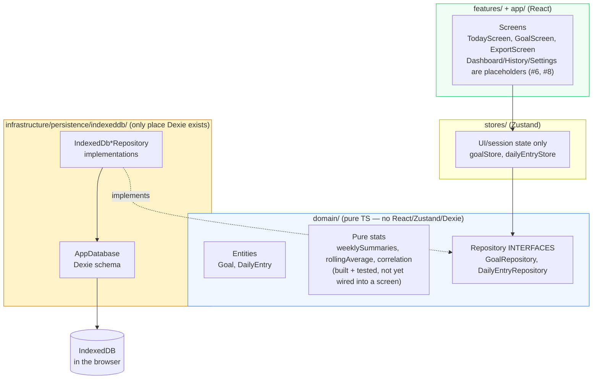
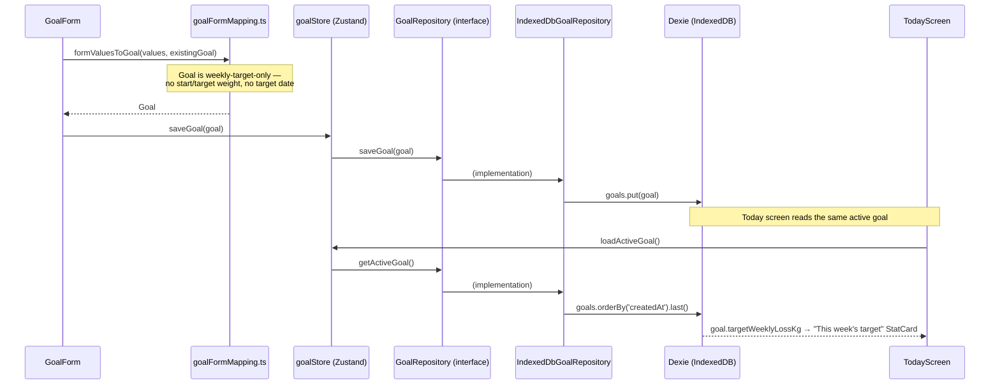

# Turtle Steps to the Goal — Architecture

This document is updated after each issue is completed. It explains what every file does, why it exists, and how the pieces connect.

Product context lives in `PROJECT_BRIEF.md`; the work queue lives in `docs/issues-priority.md`.

---

## System Overview

Turtle Steps to the Goal is a local-first weight-tracking companion built around small, weekly goals rather than one distant number: set a weekly pace, log today's weight and calories, watch the trend. Everything runs in the browser — no backend, no accounts, no telemetry. All data lives in the user's own IndexedDB.

The codebase follows Clean Architecture layering with feature-based folders:

**The one dependency rule that matters:** `domain/` imports nothing from React, Zustand, or Dexie. Features and stores talk to persistence only through the repository interfaces, so a future sync backend would mean writing `Api*Repository` implementations, not a rewrite of stores or components.

**A known simplification vs. sibling projects:** stores and `exportActions.ts` each instantiate `new IndexedDbGoalRepository()` / `new IndexedDbDailyEntryRepository()` directly at module scope, rather than through a swappable factory/DI seam (compare `life-kaleidoscope`'s `getRepositories()`/`setRepositories()`). Fine while IndexedDB is the only implementation that exists; revisit if a second backend is ever built.

---

## Data Flow — setting a goal, then logging today against it

`getActiveGoal()` is "most recently created goal" — there is no explicit active/inactive flag; saving a new goal (or the same goal's id again) always becomes the one Today reads. `DailyEntry` saves follow the identical shape through `dailyEntryStore` → `DailyEntryRepository` → `IndexedDbDailyEntryRepository`, keyed by the entry's `date` (a unique Dexie index — one entry per date, upserted by `put`).

---

## Module Reference

### Domain layer (`src/domain/`)

Pure TypeScript. Unit-testable with no DOM. If a file here ever needs `react`, `zustand`, or `dexie`, the logic belongs in `infrastructure/` or `features/` instead.

#### `src/domain/goal/`

| File | Purpose |
|------|---------|
| `Goal.ts` | The entity: `id`, `targetWeeklyLossKg` (the only target concept — this week's pace, set and renewed week to week), `displayUnit` (`'kg' \| 'lb'` — stored canonically in kg regardless of display preference), `createdAt`/`updatedAt`. **No long-term target weight or target date** — issue #14 removed those deliberately: the product's small-steps framing means the app never shows a distant "big goal" number, only the current week's target. |
| `GoalRepository.ts` | Interface: `getActiveGoal()`, `saveGoal(goal)`, `getAll()` (`getAll` added for Epic 8 export). |
| `calorieDeficit.ts` | `estimatedDailyCalorieDeficitKcal(targetWeeklyLossKg)` — the brief's ~7700 kcal-per-kg-of-fat approximation, explicitly labeled non-medical everywhere it's surfaced in the UI. Derived from the weekly pace alone, so it was unaffected by #14. |
| `units.ts` | `lbToKg` / `kgToLb` — pure conversion, `KG_PER_LB = 0.45359237`. |
| `index.ts` | Barrel. |

#### `src/domain/dailyEntry/`

| File | Purpose |
|------|---------|
| `DailyEntry.ts` | The entity: one row per `date` (ISO string), optional `weightKg`/`caloriesConsumed`/`note` — a day can log just one of weight or calories. |
| `DailyEntryRepository.ts` | Interface: `getByDate(date)`, `getRange(start, end)`, `upsert(entry)`, `delete(id)`, `getAll()`. |
| `index.ts` | Barrel. |

#### `src/domain/stats/` — built in Epic 1, not yet consumed by any screen

Pure functions with unit tests covering edge cases (missing days, single data point, no variance). They exist ahead of the UI that will use them (Dashboard — #6 — and Correlation — #7 — are both still open).

| File | Purpose |
|------|---------|
| `weeklySummaries.ts` | Groups entries into ISO weeks (Monday–Sunday, via `date-fns` `startOfISOWeek`/`endOfISOWeek`). Per week: `averageWeightKg`, `averageCalories` (`null` if no entries have that field that week), `deltaVsPriorWeekKg` (vs. the previous week's average), and `targetMet` (whether the actual loss met `goal.targetWeeklyLossKg` — `null` without a goal or a prior week to compare). |
| `rollingAverage.ts` | `rollingAverage(entries, field, windowDays)` — trailing-window average of `weightKg`/`caloriesConsumed` per distinct date present in the data; a day with no qualifying values in its window gets `average: null` rather than being dropped. |
| `correlation.ts` | Pearson correlation coefficient between weekly average calories and that week's weight change, built on top of `weeklySummaries`. `null` when there are fewer than two comparable weeks or no variance in either axis (avoids a divide-by-zero, not just an edge-case nicety). |
| `index.ts` | Barrel. |

**`projectedTrajectory.ts` was removed in #14.** It computed a straight-line `[start, target]` overlay from `Goal.startWeightKg`/`targetWeightKg`/`targetDate`, all of which no longer exist. #6 (Dashboard charts) will need to design a new, pace-based projection from scratch — e.g. a short forward projection from the latest logged entry at the current weekly pace — rather than reintroducing a fixed line to a fixed target.

---

### Persistence layer (`src/infrastructure/persistence/indexeddb/`)

The only folder allowed to import Dexie.

#### `db.ts`
**Why it exists:** Single definition of the IndexedDB schema.

| Table | Indexes | Notes |
|-------|---------|-------|
| `goals` | `id, createdAt` | `getActiveGoal()` reads via `createdAt` ordering — no separate active/inactive flag. |
| `dailyEntries` | `id, &date` | `&date` is a **unique** index — enforces one entry per date at the storage level. |

Database name: `turtle-steps-to-the-goal`, schema version 1.

#### `goalRepository.ts` — `IndexedDbGoalRepository`
`getActiveGoal()` = `db.goals.orderBy('createdAt').last()` (most recently created). `saveGoal()` = `put` (insert or overwrite by id). `getAll()` = full table ordered by `createdAt`, added for Epic 8 export.

#### `dailyEntryRepository.ts` — `IndexedDbDailyEntryRepository`
`getByDate` uses the unique `date` index. `getRange` uses `.between(start, end, true, true)` (inclusive both ends) sorted by date. `upsert` is a `put`. `getAll` is ordered by date, added for Epic 8 export.

#### `index.ts`
Barrel: `db`, `AppDatabase`, `IndexedDbGoalRepository`, `IndexedDbDailyEntryRepository`.

---

### State layer (`src/stores/`)

Zustand owns UI/session state only; persisted data always flows through the domain repository interfaces, never through Dexie directly.

| File | Purpose |
|------|---------|
| `goalStore.ts` | `useGoalStore`: `goal`, `status` (`idle/loading/ready/error`), `error`, `loadActiveGoal()`, `saveGoal(goal)`. Instantiates `IndexedDbGoalRepository` once at module scope. |
| `dailyEntryStore.ts` | `useDailyEntryStore`: `date`, `entry`, `status`, `error`, `loadEntry(date)`, `saveEntry(entry)`. Same shape as `goalStore`. |
| `index.ts` | Barrel. |

---

### Features (`src/features/`)

#### `goal-setup/` — Epic 3, issue #4 (done); reworked to weekly-only in #14

| File | Purpose |
|------|---------|
| `goalFormSchema.ts` | Zod schema: `displayUnit` + `targetWeeklyLoss` (optional at the type level, required via `superRefine` with a custom "Enter this week's target, greater than 0" message — same pattern as `dailyEntryFormSchema`, chosen so Zod's default NaN/required error text never has to be relied on). |
| `goalFormMapping.ts` | `goalToFormValues` (Goal → form, converts to the goal's display unit), `formValuesToGoal` (form → Goal, converts back to kg), `effectiveWeeklyPaceKg` (live pace preview from possibly-incomplete form state, used for the on-screen calorie-deficit estimate as the user types). Collapsed significantly in #14 — no more pace-mode branching or target-date derivation. |
| `GoalForm.tsx` | RHF + `zodResolver`. Unit toggle (kg/lb radios) and a single "This week's target" `NumberInput` — that's the whole form. Shows the rough daily-calorie-deficit estimate live, captioned non-medical. Numeric field uses `setValueAs` (not `valueAsNumber`) so an empty input becomes `undefined`, not `NaN`. |
| `GoalScreen.tsx` | Loads the active goal on mount, shows a `StatCard` summary (just the weekly target — no `start → target` big-goal line, removed in #14) when one exists, renders `GoalForm` underneath either way (so editing is just resubmitting the same form). |
| `index.ts` | Barrel. |

#### `daily-log/` — Epic 4, issue #5 (done)

| File | Purpose |
|------|---------|
| `dailyEntryFormSchema.ts` | Zod schema with sane ranges (weight 20–400kg, calories 0–10000); `superRefine` requires at least one of weight or calories. |
| `dailyEntryFormMapping.ts` | `entryToFormValues`, `formValuesToEntry`. |
| `DailyEntryForm.tsx` | Weight/calories/note fields, same `setValueAs` pattern as `GoalForm` for the numeric inputs. |
| `TodayScreen.tsx` | A native `<input type="date">` (capped at today via `max`) drives which date's entry is loaded/edited — this is the back-fill mechanism, not a separate screen. Shows "This week's target" (from the active goal, unit-converted) or an `EmptyState` pointing at `/goal` when none exists. `key={date}` on `DailyEntryForm` forces a clean remount per date instead of stale field state leaking across date changes. |
| `index.ts` | Barrel. |

#### `dashboard/DashboardScreen.tsx` — placeholder only
`PageHeader` with a description of the intended content (weight trend, calorie trend, weekly summary cards, correlation view). Epic 5, **issue #6, open** — #14 (done) removed the `Goal` shape the brief's planned goal-line overlay depended on, so #6 now needs to design that overlay fresh as a pace-based projection rather than reusing the deleted `projectedTrajectory`.

#### `history/HistoryScreen.tsx` — placeholder only
`PageHeader` only. Epic 7, **issue #8, open**.

#### `settings/SettingsScreen.tsx` — placeholder only
`PageHeader` only. Routing-table entry from brief §6 (units, misc preferences); no dedicated epic issue yet beyond what #15 (localization) will add here (a locale switcher).

#### `export/` — Epic 8, issue #9 (done)

| File | Purpose |
|------|---------|
| `exportBundleSchema.ts` | Zod mirror of `Goal`/`DailyEntry`, independent of the domain types so a malformed import can't crash on a TS-only guarantee. `version: z.literal(2)` gates future format changes — bumped from `1` in #14 when `Goal` lost its start/target-weight/date fields. |
| `exportBundle.ts` | `buildExportBundle(goals, dailyEntries)` — stamps `exportedAt`. |
| `exportActions.ts` | `exportAllData()` (reads both repositories' `getAll()`), `importAllData(bundle)` (upserts every goal/entry — **merge, not destructive replace**), `parseExportBundle(raw)` (Zod `safeParse`, throws `InvalidBackupFileError` with a message written for the user) . |
| `ExportScreen.tsx` | Export downloads a JSON file via `Blob` + a synthetic anchor click; import is a hidden file input triggered by a button. Reports counts via `summaryText(goals, entries)`, which hand-writes "goal"/"goals" and "entry"/"entries" rather than a naive `+'s'` pluralizer. |
| `index.ts` | Barrel. |

---

### App shell & routing (`src/app/`, `src/main.tsx`)

| File | Purpose |
|------|---------|
| `router.tsx` | `createBrowserRouter` with the six routes from brief §6 (`/`, `/dashboard`, `/history`, `/goal`, `/export`, `/settings`), all nested under `AppShell`. `basename: import.meta.env.BASE_URL` so routes resolve correctly under the GitHub Pages subpath. |
| `AppShell.tsx` | Reworked in **issue #13 (done)** to the `life-kaleidoscope` shell pattern: a slim header nav (app name + horizontal `NavLink`s) at `sm:` and up, and a fixed bottom tab bar (`lucide-react` icon + label per route, `min-h-14` touch targets, `env(safe-area-inset-bottom)` padding) below `sm:`. Both `<nav>`s are always in the DOM (Tailwind `hidden`/`sm:hidden` toggles visibility, not presence) with distinct `aria-label`s — `"Main"` for the header, `"Tabs"` for the bottom bar — so tests and screen readers can disambiguate them. `<main>` gets `pb-28 sm:pb-10` so content clears the fixed bar on mobile. |
| `index.ts` | Barrel. |
| `src/main.tsx` | Entry point: `StrictMode` + `RouterProvider`. |

---

### Design system (`src/shared/ui/`) — Epic 2, issue #3 (done)

shadcn-style primitives (Nova preset, `radix-ui` primitives, `cva` variants, aliases at `@/shared/ui` rather than shadcn's default `@/components`).

| File | Exports | Notes |
|------|---------|-------|
| `button.tsx` | `Button`, `buttonVariants` | Variants: `default/outline/secondary/ghost/destructive/link`; sizes incl. icon variants. |
| `card.tsx` | `Card` + `Header/Title/Description/Content/Footer/Action` | Standard shadcn card family. |
| `input.tsx` | `Input` | Bare styled `<input>`. |
| `label.tsx` | `Label` | Radix `Label.Root` wrapper. |
| `text-field.tsx` | `TextField` | Labeled input with `hint`/`error`, wires `aria-invalid`/`aria-describedby`, id via `useId`. |
| `number-input.tsx` | `NumberInput` | Same labeled-field pattern as `TextField`, plus a unit suffix slot. Renders `type="text"` `inputMode="decimal"` (**issue #12, done** — was `type="number"`, which silently rejected the comma decimal separator on some mobile keyboards/locales; pairs with `parseNumberInput()` accepting both `.` and `,`). |
| `stat-card.tsx` | `StatCard` | Large numbers-first card: label, big value + unit, optional description — the brief's "numbers should be the largest things" directive as a primitive. |
| `empty-state.tsx` | `EmptyState` | Calm empty screen (icon/title/description/action) — no guilt copy, per brief §2. |
| `page-header.tsx` | `PageHeader` | `h1` + description + right-aligned action slot; every screen opens with one. |

### Shared (`src/shared/`)

| File | Purpose |
|------|---------|
| `lib/utils.ts` | `cn()` — `clsx` + `tailwind-merge`. |
| `hooks/index.ts` | Empty barrel — no shared hooks needed yet. |

---

### Tests

Vitest + jsdom + `fake-indexeddb` + React Testing Library + `@testing-library/user-event`. **126 tests across 25 files**, all passing as of issue #14.

| Area | Covers |
|------|--------|
| `domain/goal/*.test.ts`, `domain/dailyEntry` (via infra tests) | Pure logic: calorie-deficit arithmetic, unit conversion round-trips. |
| `domain/stats/*.test.ts` | Edge cases per function: missing days, a single data point, zero variance (correlation). |
| `infrastructure/persistence/indexeddb/index.test.ts` | Both repositories against `fake-indexeddb`: round-trips, unique-date enforcement, ordering, `getAll()`. |
| `stores/*.test.ts` | Store actions against `fake-indexeddb` through the real repository implementations (not mocked). |
| `shared/ui/*.test.tsx` | Primitives via RTL: labels/errors/ARIA wiring, render smoke tests. |
| `features/goal-setup/*.test.{ts,tsx}` | Schema validation, form↔domain mapping, full form interaction via RTL — no longer needs a pinned `startDate` fixture to dodge `Date()` flakiness, since #14 removed the date-dependent pace derivation entirely. |
| `features/daily-log/*.test.{ts,tsx}` | Same pattern; date backfill via `fireEvent.change` on the native date input (native date-typing simulation is unreliable in jsdom). |
| `features/export/*.test.{ts,tsx}` | Bundle schema rejection cases, export/import round-trip + merge-not-replace semantics, `ExportScreen` with `URL.createObjectURL`/anchor-click stubbed (absent in jsdom). |
| `app/router.test.tsx` | Routing via `createMemoryRouter`; asserts both the header nav (`"Main"`) and bottom tab bar (`"Tabs"`) landmarks render on every screen. |

`test/setup.ts` imports `@testing-library/jest-dom/vitest` and manually wires `afterEach(cleanup)` — RTL's automatic cleanup detection needs `test.globals`, which isn't enabled here.

**Browser verification:** ad-hoc Playwright scripts (not a project dependency — written to a scratchpad and run via `node`) drive the dev server for real end-to-end checks per epic, e.g. two isolated `browser.newContext()`s to verify export-from-device-A / import-to-fresh-device-B.

---

## Tooling

| Piece | Notes |
|-------|-------|
| Vite 8 + React 19 + TS strict | `moduleResolution: bundler`; `baseUrl` removed (deprecated under TS 6.x), `paths` alone is sufficient. |
| Tailwind CSS v4 (`@tailwindcss/vite`) | CSS-first config. |
| Path alias | `@/ → src/` (`vite.config.ts`, `tsconfig`). |
| ESLint + Prettier | Deliberately not oxlint (create-vite's newer default) — the brief calls for ESLint+Prettier specifically. Flat config; `eslint-plugin-react-hooks` via `reactHooks.configs.flat['recommended-latest']` (the non-`flat` export is eslintrc-format and breaks flat config). `react-refresh/only-export-components` is scoped off for `src/shared/ui/**` only, where shadcn's `cva()` variant exports trip a false positive. |
| Scripts | `dev`, `build` (`tsc -b && vite build`), `preview`, `lint`, `format` / `format:check`, `test` / `test:watch`. |
| Deployment | `.github/workflows/deploy-pages.yml` — builds with `npx tsc -b && npx vite build --base=/turtle-steps-to-the-goal/`, copies `dist/index.html` → `dist/404.html` for SPA routing, deploys via `actions/deploy-pages@v4`. |

---

## Status

```mermaid
flowchart LR
    subgraph Done ["✅ Done"]
        E0["#1 Epic 0 — Scaffolding & tooling"]
        E1["#2 Epic 1 — Domain model & persistence"]
        E2["#3 Epic 2 — Design system & shell"]
        E3["#4 Epic 3 — Goal setup"]
        E4["#5 Epic 4 — Daily log entry"]
        E8["#9 Epic 8 — Export / Import"]
        E9["#10 Epic 9 — Deployment"]
        B12["#12 Bug — decimal input on mobile"]
        B13["#13 Redesign app shell — bottom tab nav"]
        B14["#14 Rework goal model — weekly-only goals"]
    end
    subgraph Next ["⏭ Tier 5 — UX & product-model rework"]
        B15["#15 Localization — English/Russian"]
        B16["#16 Calories field day-lag tooltip"]
        B17["#17 Appearance settings — mood + light/dark"]
    end
    subgraph Later ["Tier 6-7 — remaining core features + QA"]
        E5["#6 Epic 5 — Dashboard charts (needs a fresh<br/>goal-line design post-#14)"]
        E6["#7 Epic 6 — Correlation & insights"]
        E7["#8 Epic 7 — History"]
        E10["#11 Epic 10 — Accessibility & responsive QA"]
    end
    Done --> Next --> Later
```

See `docs/issues-priority.md` for the full ordered queue and the reasoning behind the current tier order.
