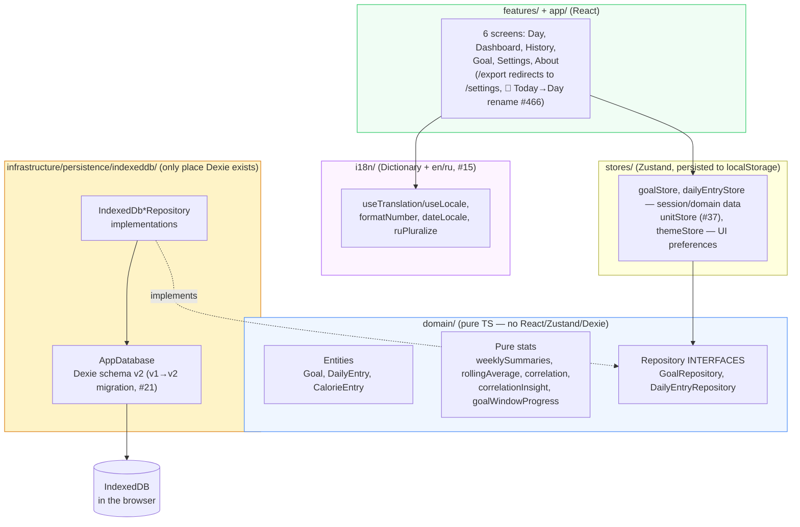
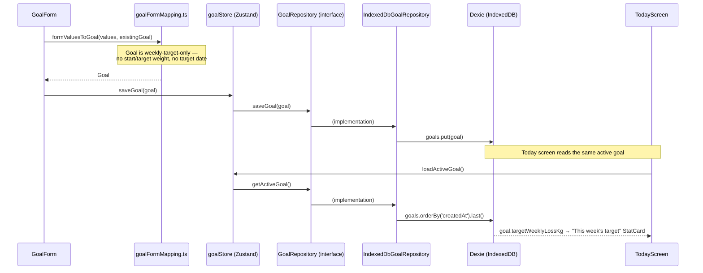

# Turtle Steps to the Goal — Architecture

This document is updated after each issue is completed. It explains what every file does, why it exists, and how the pieces connect.

Product context lives in `PROJECT_BRIEF.md`; the active work queue lives in `docs/issues-priority.md` (closed history: `docs/issues_priority_archived.md`); the public-facing overview (screenshots, live link, dev setup) lives in `README.md` (#58).

---

## System Overview

Turtle Steps to the Goal is a local-first weight and nutrition companion built around small, weekly goals rather than one distant number. It brings meals, macros, hydration, sleep, activity, body measurements, custom metrics, history, and trends together on the user's own device. Everything runs in the browser — no backend, no accounts, no telemetry, and no AI. All data lives in the user's own IndexedDB.

The codebase follows Clean Architecture layering with feature-based folders:

```mermaid
flowchart TD
    subgraph UI ["features/ + app/  (React)"]
        A["6 screens: Day, Dashboard, History,<br/>Goal, Settings, About<br/>(/export redirects to /settings, #24; Today→Day rename #466)"]
    end
    subgraph I18n ["i18n/  (Dictionary + en/ru, #15)"]
        Z["useTranslation/useLocale,<br/>formatNumber, dateLocale, ruPluralize"]
    end
    subgraph State ["stores/  (Zustand, persisted to localStorage)"]
        B["goalStore, dailyEntryStore — session/domain data<br/>unitStore (#37), themeStore — UI preferences"]
    end
    subgraph Domain ["domain/  (pure TS — no React/Zustand/Dexie)"]
        C["Entities<br/>Goal, DailyEntry, CalorieEntry"]
        D["Pure stats<br/>weeklySummaries, rollingAverage, correlation,<br/>correlationInsight, goalWindowProgress"]
        E["Repository INTERFACES<br/>GoalRepository, DailyEntryRepository"]
    end
    subgraph Infra ["infrastructure/persistence/indexeddb/  (only place Dexie exists)"]
        F["AppDatabase<br/>Dexie schema v2 (v1→v2 migration, #21)"]
        G["IndexedDb*Repository<br/>implementations"]
    end

    A --> B
    A --> Z
    B --> E
    G -. implements .-> E
    G --> F
    F --> H[("IndexedDB<br/>in the browser")]

    style Domain fill:#eff6ff,stroke:#3b82f6
    style Infra fill:#fef3c7,stroke:#d97706
    style UI fill:#f0fdf4,stroke:#22c55e
    style I18n fill:#fdf4ff,stroke:#a855f7
```

**The one dependency rule that matters:** `domain/` imports nothing from React, Zustand, or Dexie. Features and stores talk to persistence only through the repository interfaces, so a future sync backend would mean writing `Api*Repository` implementations, not a rewrite of stores or components. `i18n/` is a UI-layer concern (it exports React hooks) and sits alongside `stores/`, not inside `domain/`.

**A known simplification vs. sibling projects:** stores and `exportActions.ts` each instantiate `new IndexedDbGoalRepository()` / `new IndexedDbDailyEntryRepository()` directly at module scope, rather than through a swappable factory/DI seam (compare `life-kaleidoscope`'s `getRepositories()`/`setRepositories()`). `Dashboard`'s and `History`'s data hooks (`useDashboardData`, `useHistoryData`) follow the same direct-instantiation pattern rather than routing through `dailyEntryStore`, since neither screen needs single-entry session state — they need "all entries," which the shared stores don't model. Fine while IndexedDB is the only implementation that exists; revisit if a second backend is ever built.

**Three separate preference stores, not one:** display unit (`unitStore`), mood/color-scheme (`themeStore`), and locale (`i18n/localeStore.ts`) are three independent Zustand stores with three independent `localStorage` keys (`turtle-steps-unit`, `turtle-steps-theme`, `turtle-steps-locale`), split across `src/stores/` and `src/i18n/` rather than one unified preferences store. Not a problem in practice, but worth knowing before assuming a single "settings" state object exists anywhere.

---

## Data Flow — setting a goal, then logging today against it

```mermaid
sequenceDiagram
    participant GF as GoalForm
    participant GM as goalFormMapping.ts
    participant GS as goalStore (Zustand)
    participant GR as GoalRepository (interface)
    participant GI as IndexedDbGoalRepository
    participant DB as Dexie (IndexedDB)
    participant TS as TodayScreen

    GF->>GM: formValuesToGoal(values, existingGoal)
    Note over GM: Goal is weekly-target-only —<br/>no start/target weight, no target date
    GM-->>GF: Goal
    GF->>GS: saveGoal(goal)
    GS->>GR: saveGoal(goal)
    GR->>GI: (implementation)
    GI->>DB: goals.put(goal)

    Note over TS,DB: Today screen reads the same active goal
    TS->>GS: loadActiveGoal()
    GS->>GR: getActiveGoal()
    GR->>GI: (implementation)
    GI->>DB: goals.orderBy('createdAt').last()
    DB-->>TS: goal.targetWeeklyLossKg → "This week's target" StatCard
```

`getActiveGoal()` is "most recently created goal" — there is no explicit active/inactive flag; saving a new goal (or the same goal's id again) always becomes the one Today reads. `DailyEntry` saves follow the identical shape through `dailyEntryStore` → `DailyEntryRepository` → `IndexedDbDailyEntryRepository`, keyed by the entry's `date` (a unique Dexie index — one entry per date, upserted by `put`).

**Display unit is not part of this flow.** `Goal` has no `displayUnit` field (removed in #37) — kg/lb is a UI-only preference read from `unitStore` and applied at render time via a local `toDisplay(kg)` helper in every screen that shows a weight-derived number (`TodayScreen`, `GoalScreen`, `DashboardScreen`'s charts, `HistoryScreen`'s rows/detail). The stored value is always kg, everywhere.

---

## Module Reference

### Domain layer (`src/domain/`)

Pure TypeScript. Unit-testable with no DOM. If a file here ever needs `react`, `zustand`, or `dexie`, the logic belongs in `infrastructure/` or `features/` instead.

#### `src/domain/goal/`

| File | Purpose |
|------|---------|
| `Goal.ts` | The entity: `id`, `targetWeeklyLossKg` (the only *weight* target concept — this week's pace, set and renewed week to week), `createdAt`/`updatedAt`. **No `displayUnit`** (moved to `unitStore`, #37) and **no long-term target weight or target date** (removed in #14) — the product's small-steps framing means the app never shows a distant "big goal" number, only the current week's target. **`weekStart?: string`** (#135) — ISO date the target was last saved, stamped fresh to today by `formValuesToGoal` on every save; anchors a real 7-day window instead of labeling the target against whatever fixed calendar week happened to contain today. Optional so an old goal never re-saved since #135 (or restored from a pre-#135 backup) doesn't crash callers, just reads as "no window info yet." **`dailyCalorieTargetKcal?: number`** (#208) — a second, independent target alongside the weekly weight one, not a long-term one either (doesn't conflict with #14's own reasoning above): a *daily* number re-assessed against each day's own log, same short-horizon spirit as the weekly target. Genuinely optional — no `superRefine` requiring it the way the weekly target has, since not everyone wants to track it. Powers Today's "remaining calories" `StatCard`; nothing else reads it. **`dailyProteinTargetG?: number`** (#220) — same shape/reasoning again, independent of the calories one (someone might want either without the other). Powers Today's "remaining protein" `StatCard`; unlike calories, clamps at 0 rather than reading "over" once met — more protein than planned isn't the same "went over budget" concept a calorie ceiling is. |
| `GoalRepository.ts` | Interface: `getActiveGoal()`, `saveGoal(goal)`, `getAll()` (`getAll` added for Epic 8 export), `deleteGoal(id)` (#174, removes a single past-goal history record; deleting the active goal isn't a supported use case — `PastTargetsList` only ever passes ids from the non-active history list). |
| `calorieDeficit.ts` | `estimatedDailyCalorieDeficitKcal(targetWeeklyLossKg)` — the brief's ~7700 kcal-per-kg-of-fat approximation, explicitly labeled non-medical everywhere it's surfaced in the UI. |
| `units.ts` | `lbToKg` / `kgToLb` — pure conversion, `KG_PER_LB = 0.45359237`. Used both by `GoalForm`'s form-mapping and by every screen's `toDisplay()` unit conversion. |
| `goalWindowProgress.ts` (#135, replaced averaging with #203; #552) | `goalWeekEnd(weekStart)` — `weekStart + 6 days`, the fixed-length window a goal's own `weekStart` anchors. `goalWindowProgress(entries, goal)` — the goal-anchored replacement for reading `weeklySummaries()`'s last calendar-week entry. Returns `null` when `goal.weekStart` is unset; deliberately separate from `weeklySummaries.ts`, which stays calendar-grid-based for Dashboard/History's retrospective week-by-week views — a different concern from "is the currently active target being met." **#203** replaced the original average-vs-prior-week-average model entirely, reported as reading "target met" despite the viewed day's own weight going *up* 350g day over day from the day before — averaging could dip below target from noisy data in a way that didn't match how a user reading their own two numbers thinks about it. New rule: `targetMet`/`metOnDate` compare each day directly against whatever was logged on `weekStart` itself (the day the target was set) — the first day (within `[weekStart, weekEnd]`, `weekStart` included) whose logged weight is at least `targetWeeklyLossKg` below `weekStart`'s own logged weight is `metOnDate`; `targetMet` is `metOnDate !== null`. No averaging on either side, no prior-window baseline. `targetMet`/`metOnDate` are `null` only until `weekStart` itself has a logged weight — there's no substitute baseline the way the old model's prior-week average was. `weekStart` compared against itself is always a 0 delta, so it can never satisfy a positive target on its own — this is what makes #177's old `MIN_WINDOW_DAYS_LOGGED` gate (guarding against "met" firing off a single day's weigh-in) unnecessary; the new math can't produce that result at all, for any positive target, so the gate was removed rather than kept as redundant belt-and-suspenders. `GoalWindowProgress` narrowed to `{ weekStart, weekEnd, targetMet, metOnDate }` — `averageWeightKg`/`priorAverageWeightKg`/`deltaKg` dropped entirely after confirming (full consumer sweep) nothing reads them; `metOnDate` stays set even if a later day's weight rises back above the threshold, matching `useWeeklyGoalCelebration`'s existing "once met, stays met for this window" reasoning. Powers `PastTargetsList`'s "Target met on Mar 12" display. **#339**: gained `baselineWeightKg` (the weight logged on `weekStart` — already computed internally to compare every day against, just never returned) and `currentWeightKg` (the weight on `metOnDate` once met, otherwise the most recently logged weight in the window) — both `undefined` only while `targetMet`/`metOnDate` are still `null`. Lets `PastTargetsList` show *which* two weigh-ins a "met"/"not met" status is actually based on, not just the label. **#552**: `goalCoveringDate(goals, date)` picks the goal whose window contains `date` (newest `createdAt` if several); `useGoalCoveringDate` feeds Day's weekly StatCard so a past selected date doesn't show an unrelated current goal. |
| `goalHistory.ts` (#147) | `pastGoals(goals, entries)` — every goal except the most-recently-created one (the active goal, already shown by `GoalScreen`'s main `StatCard`), newest first, each paired with its own `goalWindowProgress()` result against that goal's own window. A plain read over `GoalRepository.getAll()`, not a separate history log — #147 made every goal save create its own historical record (see `goalFormMapping.ts` below), so nothing else needed to change here to make history available. **#181**: also computes `approximateEndDate` for a legacy goal with no `weekStart` (one saved before #135 shipped, so it never had a real window) — the `createdAt` date of whichever goal superseded it (`newestFirst[i]`, one slot newer in the sorted array), a display-only value derived from an objectively knowable fact rather than fabricated data. `undefined` when the goal already has a real `weekStart` (its formal `weekEnd` covers this instead). |
| `reachedGoalWindows.ts` (#155, #479) | `reachedGoalWindows(goals, entries)` — every goal (past or active) whose `goalWindowProgress().metOnDate` is set, as a `{ start: goal.weekStart, metOnDate }` span. `isGoalMetOnDate` = strong tint. **#479**: light tint is `isHeadingTowardGoalOnDate` — pre-met days (`start ≤ date < metOnDate`) whose weight dropped vs the previous calendar day; skips no weigh-in, missing prior-day weigh-in, gain, or flat. `isDateWithinReachedWindow` kept for raw span checks but History no longer paints from it. |
| `index.ts` | Barrel. |

#### `src/domain/dailyEntry/`

| File | Purpose |
|------|---------|
| `DailyEntry.ts` | The entity: one row per `date` (ISO string, unique). `weightKg?`, `note?`, `emotion?: Emotion` (the **day's overall mood**, distinct from any meal's own reaction — #44; `Emotion = 'happy' \| 'unhappy' \| 'neutral'`, unchanged by #54), `calorieEntries?: CalorieEntry[]` — itemized per-meal list (#21), replacing the original single `caloriesConsumed` number. **`dayTotals?: DayTotals` (#549)** — optional day-level kcal/macros without food names; **additive** with meals (summed in `totalCalories`/`totalProtein`/etc., not an override). `sleepHours?`/`deepSleepHours?` (#59 — independent optional numbers, no cross-check between them), `steps?` (#60), `onPeriod?: boolean` (#61 — opt-in menstrual cycle tracking, gated by a Settings-only toggle that never travels with backups). `hadConstipation?: boolean` — opt-in digestion tracking, same shape/precedent as `onPeriod` (gated by `useDigestionTrackingStore`, a separate Settings-only toggle, off by default). Reframed around the problem rather than the normal day (previously `hadBowelMovement`) so logging is only ever needed on an exception day — a clean-cut rename, not a migration: the old field meant the opposite thing, so no data carried over. `nightEatingOverride?: boolean` (#383) — unlike `onPeriod`/`hadConstipation`, **not** a plain opt-in manual flag: it's a manual override layered on top of a value *derived* from `timeEaten` (any logged meal at/after a fixed 21:00 cutoff), via `domain/dailyEntry/nightEating.ts`'s `hadNightEating()` — `undefined` means "use the derived value," `true`/`false` always wins once explicitly set. Always on, no Settings gate, since anyone already logging meal times needs no extra step (see the correlation-views table below for `NightEatingCorrelationView.tsx`). **#81 restructured `CalorieEntry` into a group of items**, so multiple dishes eaten together (soup + bread + cheese) can share one meal instead of always becoming separate ones: `CalorieEntry { id, items: CalorieItem[], label?, note?, timeEaten?, createdAt }` — `note`/`timeEaten` stay **group-level** (unchanged meaning from before #81, just relocated), a group always has at least 1 item (its last item removed = the group removed). `label?` (#110) is a purely cosmetic custom display name (e.g. "Breakfast") overriding the default meal name when set — unrelated to `CalorieItem.name` (a dish within the meal) or `MealItem` (the reusable dish-name library). That default itself is no longer always "Meal N" (#141): see `shared/lib/mealLabel.ts` below. `CalorieItem` (new, same file): `{ id, name?, amountKcal, proteinG?, fatG?, carbsG?, amountG?, emotion?: MealEmotion }` — a dish name + kcal + macros + its own reaction. **#129 moved `emotion` here from `CalorieEntry`**: a meal's reaction used to be one shared value for the whole group (couldn't tell "loved the pizza, disliked the milk" apart within the same meal); now each dish carries its own, independent of its siblings. **#225**: `waistCm?`/`hipCm?`/`bodyFatPercent?` — three more independent optional numbers, same shape/precedent as sleep/steps. Stored in cm/plain percent only, no inches conversion — the app has no established length-unit preference the way `unitStore` gives it one for kg/lb. **#607**: `hadAlcohol?: boolean` — opt-in alcohol day signal, exact same shape/precedent as `hadConstipation` (gated by new `useAlcoholTrackingStore`, off by default). A plain yes/no day signal, not a drinks count or beverage database, per the issue's own explicit scope. |
| `calorieEntryTotals.ts` | New in #81: `calorieEntryKcal(entry)` (always a real number — sums `entry.items`), `calorieEntryProtein/Fat/Carbs(entry)` (undefined, not 0, when none of the group's items logged that macro — same convention as the day-level totals below, just one level down). The only place that knows how to sum a single group's items; `DailyEntryForm.tsx`/`DayDetail.tsx` use these for each meal's own heading/summary line. |
| `stampSlotDefaultTimes.ts` (#595) | `stampSlotDefaultsOnUntimedMeals(entries, slotTimes)` / `countUntimedSlotMeals(entries)` — stamp `timeEaten` onto meals whose label maps to Breakfast/Lunch/Snack/Dinner via `mealSlotKeyForLabel` but have no clock yet; leave timed meals and unknown labels alone. Settings offers Yes/No after a default-time edit; Yes upserts only changed days. |
| `totalCalories.ts` | `totalCalories(entries, dayTotals?)` — sums a day's `calorieEntries` (each summed over its own items via `calorieEntryKcal`, #81) **plus optional `dayTotals` (#549)**; returns `undefined` (not `0`) when neither meals nor dayTotals contribute, so "no data" and "logged zero" stay distinguishable everywhere this is displayed. |
| `totalMacros.ts` | `totalProtein`/`totalFat`/`totalCarbs` (#51) — same "undefined, not 0" convention as `totalCalories`, but per-macro. **#81**: now flattens every entry's `items[]` first (`entries.flatMap(e => e.items)`) before summing, so the skip-granularity is per-*item*, not per-meal — two dishes in the same meal can independently log/omit a macro. **#341**: `totalFiber` joins the same three as a fourth sibling, same shape. **#530**: `totalSodium`/`totalPotassium`/`totalMagnesium` (mg) join the same helper. |
| `DailyEntryRepository.ts` | Interface: `getByDate(date)`, `getRange(start, end)`, `upsert(entry)`, `delete(id)`, `getAll()`. (`getEarliestDate()`, added for #18's `useCurrentWeekInfo`, was removed in #135 once that hook's only caller went away.) |
| `index.ts` | Barrel. |

#### `src/domain/mealItem/` — new in #50

A reusable meal-name library, deliberately **not** a foreign key from `CalorieEntry.note`.

| File | Purpose |
|------|---------|
| `MealItem.ts` | `{ id, name, createdAt, updatedAt, lastAmountKcal?, lastProteinG?, lastFatG?, lastCarbsG? }` — the last four added by #86, purely additive/optional, no IndexedDB version bump. Renaming or deleting one never touches already-logged `CalorieEntry.note` text — those are independent strings, not references. The nutrition fields let the food picker offer a saved item as something reusable ("add it again with the same numbers"), not just a bare name; items touched before #86 simply have them undefined until next saved with a note. **#541**: optional `MealItem.source` (`history-backfill` / `mfp-import`) + `planMealLibraryBackfill` / Settings “Add foods from meal history” + remove-backfilled; MFP import also seeds the library. Cap 8000 new rows; day history never deleted by undo. **#542**: after Settings library rename/nutrition save, optional confirm rewrites all-time past `CalorieItem`s matched by normalized name (`propagateMealLibraryEdit.ts`); “Library only” skips history. Still no FK/`mealItemId`. |
| `MealItemRepository.ts` | Interface: `getAll()`, `findByName(name)`, `upsert(item)`, `delete(id)`. |
| `index.ts` | Barrel. |

#### `src/domain/foodOverride/` — new in #90

Per-device customization of the curated `data/foods.ts` list — hide an item, or correct its per-100g numbers, without touching the shipped source file.

| File | Purpose |
|------|---------|
| `FoodOverride.ts` | `{ foodId, hidden?, kcal100?, protein100?, fat100?, carbs100?, updatedAt }` — keyed by the food's own stable `id` (from `foods.ts`), not a separate uuid, since there's at most one override per food. **#113**: now included in export/import backups (`exportBundleSchema.ts`'s `foodOverrides`), alongside `mealItems` — previously both were local-only, which meant a "backup" silently left out part of the user's personal data. |
| `FoodOverrideRepository.ts` | Interface: `getAll()`, `upsert(override)`, `delete(foodId)`. |
| `index.ts` | Barrel. |

#### `src/domain/recipe/` — new in #251

Multi-ingredient, servings-based templates — the gap `MealItem` (a single dish with fixed per-100g macros) can't cover: a *combined* dish logged by the serving, not by weight.

| File | Purpose |
|------|---------|
| `Recipe.ts` | `RecipeIngredient { id, name, brand?, amountKcal, proteinG?, fatG?, carbsG?, amountG? }` — structurally like `CalorieItem` minus `emotion` (a reaction belongs to a logged dish, not a raw ingredient in a template). `Recipe { id, name, ingredients, servings, createdAt, updatedAt }` — `servings` is the total yield ("makes 6 servings"). Editing a recipe only affects *future* logging, same "renames never touch past entries" precedent `MealItem.rename()` established — nothing here is a foreign key from an already-logged `CalorieItem`. |
| `RecipeRepository.ts` | Interface: `getAll()`, `upsert(recipe)`, `delete(id)`. No `findByName` — unlike `MealItemRepository`, recipes have no unique-name constraint to reconcile against. |
| `RecipeEditorDialog.tsx` (#303) | Follow-up to #251, reported right after confirming recipes on-device — the ingredient section only had name autocomplete + manual macro entry, no way to pick a food that already exists in the curated/personal list. Added a "Find food" button reusing `FoodPickerDialog` directly (imported from `@/features/daily-log/FoodPickerDialog`, same import-cycle-avoidance reasoning as this file's existing `MealNoteAutocomplete` import) — every checked dish becomes its own `RecipeIngredient` straight from `PickedFoodValues`, same "commits directly, no draft round-trip" shape `MealList.tsx`'s `addFoodToEditItems`/`addFoodEntry` already use for this same dialog elsewhere. Same fallback-tier ordering ("Find food" first, manual entry below it) the daily log's own add row established; no new i18n keys, reusing `addFoodButton`/`orDivider` as-is. |
| `shared/lib/recipeShoppingList.ts` (new), `RecipesSettingsScreen.tsx` (#611) | "Copy ingredients as a shopping list" — a new `Clipboard`-icon button on each recipe row in `RecipesSettingsScreen.tsx` (next to Edit/Delete), calling `navigator.clipboard.writeText()` with plain text from the new pure `buildRecipeShoppingListText(recipe, locale, t)`: the recipe name as a heading line, then one `- ` bulleted line per ingredient with its amount in grams when `RecipeIngredient.amountG` is recorded (omitted for ingredients with no per-100g rate, e.g. "a pinch of salt"). No macros/prices — a shopping list, not a nutrition summary. Clipboard-only, no Markdown-file download (the issue's acceptance bar was "one action copies a readable list"; a separate download mechanism per feature would duplicate what Settings → Export already owns). Brief "Copied" confirmation (icon swaps to a checkmark, aria-label swaps too) reuses `GoalForm.tsx`'s existing `justSaved` shape — 2s auto-clearing `useState`/`useEffect`/`setTimeout`, tracked per-recipe via `copiedRecipeId` since the list can have more than one row. Placed on the Settings list row rather than inside `RecipeEditorDialog.tsx` — this app has no separate read-only recipe detail view, and the list is where a recipe is browsed without needing to enter edit mode first. |
| `recipePerServing.ts` | `recipePerServing(recipe)` — combined ingredient totals ÷ `servings` (undefined, not 0, for a macro none of the ingredients logged — same convention `calorieEntryTotals.ts` uses one level up). `recipeServingsTotal(recipe, servingsEaten)` scales that per-serving result by however many servings were actually eaten — the result of "logging" a recipe. Both take `Pick<Recipe, 'ingredients' \| 'servings'>` rather than a full `Recipe`, so `RecipeEditorDialog.tsx` can compute a live preview from in-progress form state (no id/timestamps assigned yet) without constructing a fake `Recipe`. `RecipeServingTotals`'s macro fields are typed `number \| undefined` (required-but-possibly-undefined keys, not optional properties) specifically so a `RecipePerServing`/`RecipeServingsTotal` result can be passed straight into `shared/lib/macroScaling.ts`'s `formatComputedTotal`, which expects that same shape. |
| `index.ts` | Barrel. |

#### `src/domain/customMetric/` — new in #336

User-defined metrics ("training session," "acne" — things the app has no built-in field for) and user-defined correlations between any two metrics, built-in or custom.

| File | Purpose |
|------|---------|
| `CustomMetric.ts` | `CustomMetricInputKind = 'number' \| 'boolean' \| 'scale5'` — every kind stores a plain `number` underneath (boolean is 1/0, scale5 is 1-5), so all three plug into the same median-split correlation math; only the *input widget* differs. `CustomMetric { id, name, inputKind, unit?, createdAt }` is the definition; `CustomMetricEntry { id, metricId, date, value, updatedAt }` is one day's logged value — at most one per `(metricId, date)` pair, re-logging a day overwrites rather than appends. |
| `CustomMetricRepository.ts` / `CustomMetricEntryRepository.ts` | Interfaces: `getAll()`/`upsert()`/`delete()` for the metric definition; the entry repository adds `getByMetric(metricId)` and `getByMetricAndDate(metricId, date)` (finds the existing row's id before an upsert, same pattern `IndexedDbDailyEntryRepository.getByDate` established) plus `deleteByMetric(metricId)` (cascade when a metric itself is deleted). |
| `CustomCorrelation.ts` | `MetricRef = { kind: 'builtin', key: NumericSeriesKey } \| { kind: 'custom', metricId }` — a discriminated union so a built-in field's key never collides with a custom metric's own uuid. `CustomCorrelation { id, name?, metricA, metricB, createdAt }` pairs any two `MetricRef`s — unlike this app's five existing correlation views (always "metric vs. the *next* day's weight change"), both sides are paired on the *same* calendar day (see `domain/stats/customCorrelationEngine.ts` below) — a genuine fork found while scoping the issue's own "acne vs. carbs" example against the existing shape literally, resolved via a fifth `AskUserQuestion` alongside the four the issue itself flagged. |
| `CustomCorrelationRepository.ts` | Interface: `getAll()`/`upsert()`/`delete()`. |
| `index.ts` | Barrel. |

#### `src/domain/stats/`

Pure functions with unit tests covering edge cases (missing days, single data point, no variance). Now consumed by both `Dashboard` (#6/#7) and `History` (#8) — no longer library-only.

| File | Purpose |
|------|---------|
| `weeklySummaries.ts` | Groups entries into weeks via `date-fns` `startOfWeek`/`endOfWeek`, given an explicit `weekStartsOn` day parameter (#85, default `1`/Monday — the original hardcoded `startOfISOWeek`/`endOfISOWeek` behavior). Per week: `averageWeightKg`, `averageCalories` (via `totalCalories`, `null` if no entries have calories that week), `averageProteinG`/`averageFatG`/`averageCarbsG` (#53, same per-macro averaging as `totalMacros.ts` — only over days that logged that specific macro), `deltaVsPriorWeekKg` (vs. the previous week's average), and `targetMet` (whether the actual loss met `goal.targetWeeklyLossKg` — `null` without a goal, without a prior week to compare, or (#426) when the week starts before an optional `goalTrackingStartDate` parameter). **#426**: that 4th parameter is deliberately *not* `goal.createdAt` — this app creates a fresh `Goal` record roughly every week (Start new goal), so the active goal's own `createdAt` is almost always very recent; gating on it directly wiped out every earlier week's status the moment a new weekly goal started (reopened live with screenshots after the first attempt did exactly this). Callers instead pass `earliestGoalCreatedAt(allGoals)` (`domain/goal/goalHistory.ts`) — the one-time moment goal-tracking itself began, found across *every* goal ever saved. No gating at all when a caller omits the parameter (existing callers/tests unaffected). Powers `WeeklySummaryCards`, `MetTargetList`, and `CorrelationView`'s retrospective calendar-week-by-week views; each resolves its own `weekStartsOn` via `useWeekStartsOn`/`resolveWeekStartsOn` (see `shared/` below) rather than this function knowing anything about the preference itself. **#562**: `excludeIncompleteCurrentWeek` / `isCompletedCalendarWeek` filter Dashboard weekly recap to completed Mon–Sun weeks only (`weekEnd < today`); monthly/recent-average cards are unchanged. **No longer used by `useWeeklyGoalCelebration`** (#135) — "is the currently active target being met" now reads `goalWindowProgress()` instead, anchored to the goal's own `weekStart` rather than a calendar grid. |
| `monthlySummaries.ts` (#226) | Same shape as `weeklySummaries.ts` above, grouped by calendar month (`date-fns` `startOfMonth`/`endOfMonth`) instead of week — no `weekStartsOn`-equivalent parameter, since a month has one unambiguous boundary. Per month: `averageWeightKg`/`averageCalories`/`averageProteinG`/`averageFatG`/`averageCarbsG` (identical per-macro-averaging reasoning as the weekly version), `deltaVsPriorMonthKg`. Deliberately **no** `targetMet` field — a `Goal` here is always a *weekly* target, with no monthly-target concept anywhere else in the app to compare a month's actual change against. A gap month with zero entries contributes no summary row at all (same as a gap week in the weekly version), so a delta is only ever computed between two months that actually both have data, not two calendar-adjacent months. Powers `MonthlySummaryCards`. |
| `rollingAverage.ts` | `rollingAverage(entries, field, windowDays)` — trailing-window average per distinct date present in the data. `field` accepts either a literal `DailyEntry` key or an extractor function, which is what lets `CalorieTrendChart` roll-average the *derived* `totalCalories()` value rather than a raw stored field. A day with no qualifying values in its window gets `average: null` rather than being dropped. **#214**: also now consumed by `WeightTrendChart.tsx` (`field: 'weightKg'`) — the function itself needed no changes, already fully general; this was purely a matter of wiring an existing capability into a second chart, not building a new one. **#175**: rewritten from an O(n²) shape (re-`.filter()`ing, and re-`parseISO()`-ing, the entire entry array for every distinct date) to a single O(n) sliding window over the already-date-sorted entries, each entry entering/leaving a running sum/count exactly once. Profiled as the dominant cost (150+ of ~170 seconds) behind a reported Dashboard slowdown at ~6 years of imported data (Chrome DevTools CPU profile: ~9.6M combined `parseISO`/`differenceInCalendarDays` calls across this function's two call sites at that data size) — `IndexedDbDailyEntryRepository.getAll()` itself, the original filing's other main suspect, confirmed not to be the bottleneck. Re-profiled after the fix against the identical seeded dataset: ~9-11s in Vite dev mode, ~4.3s against an actual production build. |
| `dateRangeSummary.ts` (#222) | `dateRangeSummary(entries, startDate, endDate)` — same per-field averaging as `weeklySummaries.ts`/`monthlySummaries.ts` (macros only averaged over days that logged that specific one, #53 reasoning), but for an arbitrary inclusive `[startDate, endDate]` ISO-string range instead of a calendar week/month. Also returns `loggedDayCount` (how many distinct dates in the range have an entry at all, regardless of which fields), so a caller can show "3 of 7 days logged" rather than silently averaging a sparse range. Powers `CompareRangesView`'s two independently-picked ranges — distinct from `recentAverages.ts` below, which is a rolling window anchored to *today*, not two arbitrary user-chosen ranges compared against each other. |
| `recentAverages.ts` (#215, #506) | `recentAverages(entries, windowDays, today = new Date())` — average calories/protein over the trailing `windowDays` days counting back from `today` (inclusive), skipping days with no calorie entries at all rather than counting them as 0. Deliberately anchored to the *real current date* (injectable for tests), not the most recent logged entry the way `rollingAverage.ts`'s per-point series is — a "last 7 days" stat should shrink its sample when the user hasn't logged recently, not silently reuse whatever the last logged day happened to be. A single-shot summary (one `{ averageCalories, averageProteinG }` result), not a per-date series like `rollingAverage.ts` — powers `RecentAveragesCards`, called once per window (7 and 30). **#506**: also exports `recentAverageWindowRange(windowDays, today)` → `{ startDate, endDate }` ISO calendar bounds for that same inclusive window (`today` back through `windowDays - 1`), so the cards can show from→to without re-deriving the math in the UI. |
| `correlation.ts` | Plain Pearson correlation coefficient between weekly average calories and that week's weight change. `null` when there are fewer than two comparable weeks or no variance in either axis. Not directly rendered anywhere — `correlationInsight.ts` is what actually backs the UI. |
| `correlationInsight.ts` | The plain-language companion to `correlation.ts` that `CorrelationView` (#7) actually uses: splits comparable weeks into lower-/higher-calorie halves by median (needs `MIN_COMPARABLE_WEEKS = 4`), reports which half averaged more loss and a rounded `thresholdKcal` — arithmetic, not statistics, on purpose. Takes the same `weekStartsOn` param (#85) as `weeklySummaries`, which it calls internally. **#522**: `correlationInsightPoints` drops incomplete weeks — a week whose calendar `weekEnd` is still after `min(today, max entry date)` (current / period-truncated week), or whose `weekStart` falls before the earliest entry in the set (leading truncation from a mid-week period start). Fixes the live false alarm where a 2-day current week averaged to 727 kcal and the tooltip's week-start date + "view this day" link made that look like 1 Aug's day total (actually 1244, after-midnight meal included). Sparse finished historical weeks are kept — average-over-logged-days stays intentional there. **#613**: `correlationInsightPoints`'s exclusion happened silently — nothing told the user their current week was left out, unlike the day-pair views below (which have no equivalent "in-progress unit" case to flag). Extracted the shared min/max/`effectiveAsOf`/`weeks` computation into an internal `comparableWeeksContext()` and added a new sibling export, `weeklyCorrelationExcludesCurrentWeek(entries, weekStartsOn?, asOfDate?)`, returning whether the trailing week was dropped specifically for being still in progress (distinct from the leading period-truncation case, which isn't "current" and isn't surprising the same way) — `correlationInsightPoints`'s own filtering/return shape is unchanged. `CorrelationView.tsx` calls it alongside `correlationInsightPoints` and, when true, appends `t.dashboard.correlationCurrentWeekExcludedNote` to the existing week-count/lag-caveat footer line, only alongside a real insight. Audited all 9 correlation views (this one + the 8 day-pair views below + custom) for consistent trust footers per the issue's own ask — every other view's sample-size/lag-caveat/strength-label trio was already consistent; this was the one real gap. |
| `lateMealCorrelation.ts` (#116) | Distinct from `correlationInsight.ts` (weekly average calories vs. that week's change) — pairs each day's *latest logged meal time* with the *next calendar day's* day-over-day weight change, e.g. testing "eating late → more weight the next morning" from water retention. `lateMealPoints(entries)` returns the raw day-pairs (a day only contributes one if it has a logged weight, ≥1 meal with a recorded `timeEaten`, and the very next calendar date also has a logged weight); `lateMealCorrelation(entries)` splits them into earlier-/later-eating halves by median time-of-day (needs `MIN_COMPARABLE_DAYS = 8` — day-pairs are noisier than `correlationInsight`'s week-level averages, so more are required before a split means anything), same "which half averaged worse" shape as `correlationInsight`, threshold rounded to the nearest 15 minutes instead of 50 kcal. **#523**: `LateMealPoint.date` (and the same field on sleep/steps/protein/meal-frequency/night-eating points) is the **predictor day** — the day the x-axis metric was logged — so outlier chips / «Открыть этот день» open a day whose last meal (etc.) matches the plotted value. Previously it was the next (weight) day, which made a ~10:00 outlier labeled 13 Jul open a Day screen whose last meal was 23:28. `FastingWindowPoint.date` stays the day the fast *ends* (also the custom-chart `fastingHours` series key). |
| `loggingConsistency.ts` (#223) | `loggingConsistencyWeeks(entries, weekStartsOn)` — one row per calendar week from the earliest logged entry through today, each with 7 day-cells scored 0-4 by how many of the app's core fields (weight, any meal, sleep, steps — a note or period/constipation flag alone doesn't count) that day logged. Powers `LoggingConsistencyHeatmap.tsx`'s GitHub-contribution-graph-style view. Resolved a genuine scope fork via `AskUserQuestion` before building — the issue itself flagged the visualized metric as undecided ("logging consistency or a chosen metric"); user chose logging consistency, not a numeric-metric heatmap. |
| `customChartSeries.ts` (#132) | `customChartPoints(entries, seriesKeys)` — one point per date (sorted ascending), each carrying both `raw` (the actual logged value, what tooltips/legends should always read) and `normalized` (0-100 within that series' own min/max across the visible range, purely a plotting coordinate for `CustomChartView`'s shared Y-axis). A series with zero variance (one distinct value, or only one data point) normalizes to a flat 50 rather than dividing by zero. `booleanFlagDates(entries, flag)` returns the plain list of dates `onPeriod`/`hadConstipation` was true, for the same view's marker-dot rendering (#137) — kept separate since these aren't plotted as a trend the way the six numeric series are. **#336**: new `numericSeriesValueByDate(entries, key)` — a single series' plain `date -> value` map (the same `SERIES_EXTRACTORS`/`fastingWindowPoints` special-casing as `customChartPoints`, just one series at a time instead of several normalized together) — the built-in-field building block `customCorrelationEngine.ts`'s generic same-day pairing needs. **#502**: new `booleanFlagMarkers(axisDates, flaggedDates, maxMarkers)` turns that flat date list into the dots actually drawn — it walks the chart's sorted x-axis categories in fixed-size windows (`ceil(axisDates.length / maxMarkers)`) and emits one `{ date, dayCount }` marker per window containing any flagged day, anchored on that window's first flagged day and then skipping to the window's end, so consecutive dots are always at least one window apart (a plain bucket-by-index grouping would let a run straddling a boundary produce two touching dots). Window size 1 — i.e. a range short enough for every flagged day to fit — returns one `dayCount: 1` marker per flagged day, the pre-#502 behavior. Takes the axis *categories*, not calendar distance, because it's on-screen overlap that's being avoided. |
| `customCorrelationEngine.ts` (#336) | The generic engine behind user-defined correlations — same median-split *shape* every other file in this table already uses, generalized to any two same-day value series instead of one fixed metric vs. weight delta. `resolveMetricValueMap(ref, entries, customMetricEntries)` reads either a built-in `NumericSeriesKey` (via `numericSeriesValueByDate`) or a specific `CustomMetric`'s own logged entries into a plain `date -> value` map; `pointsFromValueMaps` intersects two such maps into same-day `MetricValuePoint`s (only days where *both* sides have a value); `customCorrelationFromPoints` is the median-split itself (`MIN_COMPARABLE_DAYS = 8`, same minimum as `lateMealCorrelation`/`mealFrequencyCorrelation` etc.), using `classifyRelativeCorrelationStrength` (below) instead of the fixed-kg classifier, since B could be any unit. `customCorrelationInsight` composes the full pipeline for a `CustomCorrelation`. |
| `foodReactions.ts` (#128) | `foodReactionTallies(entries)` flattens every logged `CalorieItem` across every meal and tallies `bellissimoCount`/`thumbsUpCount`/`thumbsDownCount` per dish *name* (trimmed; unnamed or unreacted-to items skipped) — the same name logged on separate occasions accumulates into one tally, not one per occurrence. `mostLikedFoods(entries)` filters to dishes with any positive reaction, ranked by a bellissimo-weighted score (bellissimo counts double a plain thumbsUp — #54's own framing of it as a stronger "amazing" tier), capped at the top 5; `mostDislikedFoods(entries)` mirrors that for `thumbsDownCount`. A dish with a mixed history (loved once, disliked another time) can appear in both — that's real signal, not deduplicated away. Only possible as a precise per-dish tally since #129 moved `emotion` off the meal group onto each item. |
| `index.ts` | Barrel. |

**History:** `projectedTrajectory.ts` was removed in #14 (it depended on `Goal` fields that no longer exist). #6 later added a new pace-based overlay, `projectedPaceTrajectory`, to `WeightTrendChart` — which #46 then removed outright per live feedback (no projection/prognosis line at all today; `WeightTrendChart` no longer takes a `goal` prop). `currentWeekInfo.ts` (#18's calendar-week-numbered "Week N · range" label) and its `useCurrentWeekInfo` hook were removed in #135 — their only consumers (`TodayScreen`/`GoalScreen`'s target `StatCard`) switched to a goal-anchored range via `goalWindowProgress.ts`, at which point a running calendar-week count no longer corresponded to anything meaningful on that card and nothing else read the hook.

---

### Persistence layer (`src/infrastructure/persistence/indexeddb/`)

The only folder allowed to import Dexie.

#### `db.ts`
**Why it exists:** Single definition of the IndexedDB schema, now on its twelfth version.

| Version | Change |
|---------|--------|
| 1 | `goals: 'id, createdAt'`, `dailyEntries: 'id, &date'` (`&date` unique — one entry per date at the storage level). |
| 2 (#21) | Same store shape (no index changes) + an `.upgrade()` block: for each `dailyEntries` row, if a legacy `caloriesConsumed` number exists and no `calorieEntries` yet, it's wrapped into a single-item `calorieEntries` array (new `crypto.randomUUID()` id, reuses the row's `createdAt`), then `caloriesConsumed` is deleted. |
| 3 (#50) | Adds `mealItems: 'id, &name'` (`&name` unique). New store only, no `.upgrade()` needed — nothing pre-existing to migrate. |
| 4 (#54) | Same store shape (no index changes) + an `.upgrade()` block: strips `emotion` from every item in each `dailyEntries` row's `calorieEntries[]` (old happy/unhappy/neutral values don't map to the new thumbsUp/thumbsDown/bellissimo set — cleared outright, no auto-mapping). The row's own top-level `emotion` (day mood) is untouched. |
| 5 (#81) | Same store shape (no index changes) + an `.upgrade()` block: folds each flat `calorieEntries[]` meal into a single-item group — the meal's `id` becomes the group's `id`, its `note` becomes the one item's `name` (a fresh `crypto.randomUUID()` item id), `amountKcal`/`proteinG`/`fatG`/`carbsG` move onto that item, and `emotion`/`timeEaten` stay on the group. Rows with no `calorieEntries` at all are left untouched (not coerced to an empty array). |
| 6 (#90) | Adds `foodOverrides: '&foodId'` (`&foodId` unique — one override per curated food, at most). New store only, no `.upgrade()` needed. |
| 7 (#129) | Same store shape (no index changes) + an `.upgrade()` block: a meal's reaction moves from the group (`calorieEntries[].emotion`, no longer part of the type) onto each item. Only unambiguous for a single-item meal, where the old group reaction clearly belonged to that one dish — for a multi-item meal it's simply dropped (deleted, not guessed at), same reasoning v4's clear used for the older emotion set. |
| 8 (#271) | Same store shape (no index changes) + an `.upgrade()` block: a `dailyEntries` row's single `waterMl` running total becomes a one-item `waterEntries` list (same "scalar becomes a single-item list" shape v2's `caloriesConsumed` upgrade used), then `waterMl` is deleted. |
| 9 (#256) | Adds a sparse unique secondary index on `mealItems.barcode` (`mealItems: 'id, &name, &barcode'`). Optional field — records with no barcode simply never enter the index (IndexedDB excludes missing keys from a unique index entirely), so no collision between items that don't have one. No `.upgrade()` needed, nothing to backfill for a field that never existed before. |
| 10 (#251) | Adds `recipes: 'id'`. New store only, no `.upgrade()` needed. No unique-name index (unlike `mealItems`) — recipes are always addressed by id (picked from a list), never looked up or deduplicated by name. |
| 11 (#336) | Adds `customMetrics: 'id'`, `customMetricEntries: 'id, metricId, &[metricId+date]'`, `customCorrelations: 'id'`. New stores only, no `.upgrade()` needed. `customMetricEntries`' unique compound index enforces "one logged value per metric per day" at the DB level, backing up the app-level find-existing-id-first upsert convention every unique-indexed store here already relies on. |
| 12 (#357) | Same store shape (no index changes) + an `.upgrade()` block: backfills any `calorieEntries[]` group missing a `timeEaten` using that group's own `createdAt` (local hours/minutes, same `HH:MM` shape `timeEaten` already uses). A group that already has a `timeEaten` is left untouched. Backfill mechanism (auto-fill from `createdAt` vs. leave old data alone) was a genuine design fork resolved via `AskUserQuestion` — the user chose auto-backfill, aware `createdAt` is only an approximation for someone who logs several meals in one sitting. |
| 13 (#557) | Adds `weeklyNotes: '&weekStart'`. New store only, no `.upgrade()` needed. Freeform notes keyed by Monday ISO week start (Dashboard weekly recap calendar weeks, #556). |

Database name: `turtle-steps-to-the-goal`. `db.migration.test.ts` seeds a raw v1-schema Dexie instance with a legacy `caloriesConsumed` row, an untouched `weightKg`-only row, a pre-#54 row with an old-format meal emotion, a pre-#81 flat-meal row, and an already-grouped row with no `timeEaten` at all, then opens the real `db` (which cascades through every pending `.upgrade()` in one open) and asserts each transformation landed correctly. Because that cascade touches every row unconditionally, v12's own backfill also lands on the v1→v2 test's row (it never had a `timeEaten` either) — that test's expectation includes the now-backfilled time, computed the same timezone-agnostic way (local hours/minutes off the row's own `createdAt`) rather than hardcoded, so the test doesn't depend on which timezone it runs in. **v7's own fold has no dedicated test in this file** — every seed here cascades from v1, and v4's unconditional clear wipes any meal-level emotion before it could ever reach v7 (no real pre-v4 data could have had a modern thumbsUp/thumbsDown/bellissimo value in the first place, so this harness has no way to represent "reaches v7 with a legacy value still on it"; real users upgrading from an already-v6 install never run v4's `.upgrade()` at all, since Dexie only runs each version's upgrade once per physical database). The fold logic itself is covered directly in `exportActions.test.ts`'s v5→v6 bundle-upgrade test instead, which seeds already-v5-shaped data with no such contamination.

#### `goalRepository.ts` — `IndexedDbGoalRepository`
`getActiveGoal()` = `db.goals.orderBy('createdAt').last()` (most recently created). `saveGoal()` = `put` (insert or overwrite by id). `getAll()` = full table ordered by `createdAt`, added for Epic 8 export.

#### `dailyEntryRepository.ts` — `IndexedDbDailyEntryRepository`
`getByDate` uses the unique `date` index. `getRange` uses `.between(start, end, true, true)` (inclusive both ends) sorted by date. `upsert` is a `put`. `getAll` is ordered by date, added for Epic 8 export.

#### `mealItemRepository.ts` — `IndexedDbMealItemRepository` (#50)
`getAll()` = `orderBy('name')`. `findByName()` uses the unique `name` index — the basis for upsert-by-name (`touch`) in `mealItemStore`, since `.put()` on a unique index throws if you try to insert a colliding name under a different primary key.

#### `foodOverrideRepository.ts` — `IndexedDbFoodOverrideRepository` (#90)
`getAll()` = full table (no ordering — the UI sorts/filters via `foods.ts`'s own order). `upsert()`/`delete()` are keyed by `foodId` directly.

#### `recipeRepository.ts` — `IndexedDbRecipeRepository` (#251)
`getAll()` = full table, sorted by name in JS (`localeCompare`) rather than a Dexie index — there's no unique-name index to sort by, unlike `mealItems`. `upsert()`/`delete()` are keyed by `id` directly.

#### `customMetricRepository.ts`, `customMetricEntryRepository.ts`, `customCorrelationRepository.ts` — new in #336
`IndexedDbCustomMetricRepository`/`IndexedDbCustomCorrelationRepository` mirror `IndexedDbRecipeRepository` exactly (full-table `getAll()`, `id`-keyed `upsert()`/`delete()`, the metric one sorted by name). `IndexedDbCustomMetricEntryRepository` additionally has `getByMetric(metricId)` (`.where('metricId').equals(...)`) and `getByMetricAndDate(metricId, date)` (`.where('[metricId+date]').equals([metricId, date])`, using the unique compound index from `db.ts` v11) — the latter is how `useCustomMetricStore.setEntryValue` finds an existing day's row before upserting, and how `exportActions.ts`'s import path avoids the same `ConstraintError` #207 already fixed for `dailyEntries`/`mealItems`.

#### `weeklyNoteRepository.ts` — new in #557
`IndexedDbWeeklyNoteRepository`: `weeklyNotes` keyed by `&weekStart` (Monday ISO). `getAll` newest-week-first; empty/whitespace saves delete the row. Included in JSON backup as `exportBundleSchema` v8+ `weeklyNotes` (v7 backups upgrade with an empty list; **#578** bumped the live schema to v9 for appearance/locale).

#### `index.ts`
Barrel: `db`, `AppDatabase`, `IndexedDbGoalRepository`, `IndexedDbDailyEntryRepository`, `IndexedDbMealItemRepository`, `IndexedDbFoodOverrideRepository`, `IndexedDbRecipeRepository`, `IndexedDbCustomMetricRepository`, `IndexedDbCustomMetricEntryRepository`, `IndexedDbCustomCorrelationRepository`, `IndexedDbWeeklyNoteRepository`.

---

### State layer (`src/stores/`)

Zustand. `goalStore`/`dailyEntryStore` own session/domain data (always flowing through the repository interfaces, never through Dexie directly); `unitStore`/`themeStore` own persisted UI preferences (`localStorage`, via Zustand's `persist` middleware — no IndexedDB involvement).

| File | Purpose |
|------|---------|
| `goalStore.ts` | `useGoalStore`: `goal`, `status` (`idle/loading/ready/error`), `error`, `loadActiveGoal()`, `saveGoal(goal)`. Instantiates `IndexedDbGoalRepository` once at module scope. |
| `dailyEntryStore.ts` | `useDailyEntryStore`: `date`, `entry`, `status`, `error`, `loadEntry(date)`, `saveEntry(entry)`. Same shape as `goalStore`. |
| `unitStore.ts` | `useUnitStore` (#37): `unit: 'kg' \| 'lb'`, `setUnit`. Persisted to `localStorage` (`turtle-steps-unit`). This is the kg/lb toggle that used to live on the Goal page — now global, read by `TodayScreen`, `GoalScreen`, `DashboardScreen`'s charts, and every `History` weight display. |
| `mealSlotDefaultTimesStore.ts` (#588) | `useMealSlotDefaultTimesStore`: remembered `HH:mm` clocks for Breakfast/Lunch/Snack/Dinner (defaults match #580's built-ins). Persisted (`turtle-steps-meal-slot-default-times`). Prefills MFP import dialog and Settings Default meal times card; **#595** may also stamp those clocks onto existing untimed slot-labeled meals when the user confirms after editing. |
| `mealItemStore.ts` | `useMealItemStore` (#50): `items`, `status`, `loadItems()`, `touch(name, nutrition?)` (upsert-by-name — creates on first use, else just bumps `updatedAt`; trims and no-ops on empty), `rename(id, name)` (merges into an existing item if the new name collides, rather than throwing on the unique index), `deleteItem(id)`. Not persisted to `localStorage` — this is domain data in IndexedDB, unlike `unitStore`/`themeStore`. `touch`'s optional `nutrition` (#86: `{ amountKcal?, proteinG?, fatG?, carbsG? }`) records the last-used values on the `MealItem`, falling back to whatever was already recorded when omitted (a bare `touch(name)` never clears previously known nutrition). |
| `goalCelebrationStore.ts` | `useGoalCelebrationStore` (#55): `celebratedWeekStart: string \| null`, `markCelebrated(weekStart)`. Persisted to `localStorage` (`turtle-steps-goal-celebration`). Deliberately stores only the *single most recent* celebrated window, not a growing history — a new goal-anchored window (#135) always has a different `weekStart` once renewed, so one value is enough to know "has this window already been celebrated." |
| `cycleTrackingStore.ts` | `useCycleTrackingStore` (#61): `enabled: boolean`, `setEnabled`. Persisted to `localStorage` (`turtle-steps-cycle-tracking`). Settings-only on/off switch — gates whether `DailyEntryForm` renders the `onPeriod` toggle at all; the logged `onPeriod` value itself lives on `DailyEntry`, not in this store. |
| `dailyReminderStore.ts` | `useDailyReminderStore` (#171): `enabled: boolean`, `setEnabled`. Persisted to `localStorage` (`turtle-steps-daily-reminder`), off by default — same shape as `cycleTrackingStore`/`digestionTrackingStore`. Gates `TodayScreen.tsx`'s quiet "No entry yet today" banner; not part of the export bundle (a local UI preference, not logged data). |
| `weekStartStore.ts` | `useWeekStartStore` (#85): `weekStart: 'monday' \| 'firstEntryWeekday'`, `setWeekStart`. Persisted to `localStorage` (`turtle-steps-week-start`), default `'monday'`. Settings-only preference — `'firstEntryWeekday'` anchors every week boundary to whichever weekday the earliest logged entry falls on, for people who started tracking mid-week and found "Week 2" two days after their first entry confusing. Resolved into a concrete `Day` by `shared/lib/resolveWeekStartsOn.ts`, not read directly by `currentWeekInfo`/`weeklySummaries` themselves. |
| `themeStore.ts` | `useThemeStore`: `mood` (`'pond' \| 'dusk' \| 'sage' \| 'tortoise' \| 'lagoon'`, #17), `colorScheme` (`'light' \| 'dark' \| 'system'`), `setMood`, `setColorScheme`. Persisted (`turtle-steps-theme`). Exports `detectDefaultColorScheme()`, `resolveColorScheme()` (resolves `'system'` to the live OS preference, passes `'light'`/`'dark'` through), and `applyTheme()` (sets `data-mood` + toggles `.dark` on `<html>`, via `resolveColorScheme`); `applyTheme()` also runs eagerly at module-import time to stay in sync with an inline pre-paint script in `index.html` that avoids a flash of the wrong theme on load. **#402**: #17's toggle only ever read `prefers-color-scheme` once, as a one-time default for a manual light/dark pick — it never tracked the OS setting afterward. Widened `colorScheme` to include `'system'` (now the default for anyone with nothing yet in `localStorage` — an existing explicit `'light'`/`'dark'` pick from before this shipped is untouched, since `persist` only ever falls back to the in-memory initial state before hydration overrides it) and added a module-level `matchMedia('(prefers-color-scheme: dark)')` `change` listener that re-applies the theme whenever the OS setting changes *while* `colorScheme === 'system'` — a manual `'light'`/`'dark'` pick ignores the listener entirely (gated by the same check). `index.html`'s pre-paint script needed **no change**: it already defaults to a live `matchMedia` read and only overrides that with the persisted value when it's explicitly `'light'` or `'dark'`, so a persisted `'system'` value already falls through to the correct live-OS behavior for free. Settings' light/dark `ToggleGroup` gained a third "System" option (new `t.settings.systemColorScheme`); `colorSchemeLabel` copy updated to "Light / dark / system" to match. |
| `foodOverrideStore.ts` | `useFoodOverrideStore` (#90): `overrides`, `status`, `loadOverrides()`, `setHidden(foodId, hidden)`, `setNutrition(foodId, {kcal100, protein100, fat100, carbs100})`, `restoreDefault(foodId)` (deletes the override entirely). Not persisted to `localStorage` — domain data in IndexedDB, same category as `mealItemStore`. `setHidden`/`setNutrition` merge into one existing override per food rather than each creating their own record. |
| `index.ts` | Barrel — exports all stores plus their `Mood`/`ColorScheme`/`Unit`/`WeekStart` types. |

Locale is **not** here — see `src/i18n/localeStore.ts` below.

---

### Internationalization (`src/i18n/`) — Epic/issue #15

New layer since the app's first localization pass. English and Russian, with the locale itself persisted like a UI preference (but structurally separate from `src/stores/` — see the "three preference stores" note above).

| File | Purpose |
|------|---------|
| `Dictionary.ts` | The `Dictionary` interface — one section per feature area (`common`, `nav`, `today`, `dailyEntry`, `goal`, `export`, `dashboard`, `history`, `settings`, `about`). Several entries are functions rather than plain strings, for pluralization/interpolation (e.g. `common.weekRangeLabel(start, end)`, `dailyEntry.mealLabel(n)`, `dailyEntry.emotionLabel(emotion)`, `goal.deficitEstimate(kcal, direction)`, `dashboard.correlationSummary(thresholdKcal, direction)`). |
| `en.ts` / `ru.ts` | Full `Dictionary` implementations for each locale. |
| `localeStore.ts` | `Locale = 'en' \| 'ru'`. `useLocaleStore` (Zustand + `persist`, `localStorage` key `turtle-steps-locale`, default from `detectDefaultLocale()` sniffing `navigator.language`). Free functions `getDictionary(locale)`; hooks `useTranslation()` (full `Dictionary` for the current locale) and `useLocale()` (just the `Locale` string). `SettingsScreen` is the only place that calls `setLocale`. |
| `dateLocale.ts` | `getDateFnsLocale(locale)` — maps to `date-fns/locale`'s `enUS`/`ru`, used everywhere `date-fns format()` needs localized month/weekday names. |
| `formatNumber.ts` | `formatNumber(value, locale, fractionDigits = 1)` and `formatSignedNumber(value, locale)` (always shows an explicit +/−) — both via `Intl.NumberFormat` with `ru-RU`/`en-US`, so Russian gets a decimal comma automatically. `formatExactNumber(value, locale)` (#57, `minimumFractionDigits: 0, maximumFractionDigits: 2`) is for values that were directly entered or are a plain subtraction of two entered values (e.g. weight), where the fixed-1-decimal formatters would round away what the user actually typed — a whole number stays unpadded ("60", not "60.0"), and the max-2 cap both covers typical entered precision and rounds away floating-point subtraction noise. **#586**: weekly goal pace (`targetWeeklyLossKg`) on Goal/Day StatCards, GoalForm's read-only summary, and Past targets also uses `formatExactNumber` — `formatNumber`'s default 1 decimal was rounding 0.28 → 0.3. Computed/averaged values (weekly summaries, chart axes) intentionally keep using `formatNumber`'s fixed decimal count. |
| `unitLabel.ts` | `unitLabel(unit, dictionary)` → `t.common.kg` / `t.common.lb`. |
| `ruPluralize.ts` | Standalone Russian plural-form selector (1 / 2–4 / 5+, with the 11–14 exception) for count-based Russian copy. |
| `index.ts` | Barrel. |

---

### Features (`src/features/`)

#### `goal-setup/` — Epic 3, issue #4; reworked to weekly-only in #14

| File | Purpose |
|------|---------|
| `goalFormSchema.ts` | Zod schema: `targetWeeklyLoss` (optional at the type level, required via `superRefine` with a custom message — same pattern as `dailyEntryFormSchema`, so Zod's default NaN/required error text never has to be relied on). **#534**: optional number fields preprocess RHF’s post-`reset` empty strings (`''`) to `undefined` so they validate after #241-style clears; `GoalFormValues` is an explicit type (not `z.infer`) so `zodResolver` stays assignable. No unit field in the schema — see below. **#208**: `dailyCalorieTarget` — `z.number().positive().max(10000).optional()`, genuinely optional (no `superRefine` requirement, unlike `targetWeeklyLoss`) since not everyone wants a daily calories target. **#220**: `dailyProteinTarget` — `z.number().positive().max(1000).optional()`, same reasoning, independent field. |
| `goalFormMapping.ts` | `goalToFormValues` (Goal → form, converts to the *display* unit read from `useUnitStore` — the unit itself is a caller-supplied argument, not read from `Goal`), `formValuesToGoal` (form → Goal, converts back to kg), `effectiveWeeklyPaceKg` (live pace preview from possibly-incomplete form state, used for the on-screen calorie-deficit estimate as the user types). **#147**: `formValuesToGoal` no longer takes an `existingGoal` param — every save now gets a fresh `id`/`createdAt` unconditionally, turning each save into its own historical `Goal` record instead of overwriting the previous one (Dexie `put` upserts by id, so a fresh id is an insert). **#174** added `isDuplicateGoalSave(newGoal, existingGoal)` (no-op'd an exact same-day, same-target re-submission) — **superseded by #181** below, which replaces the whole "always fresh record" model. **#181**: `formValuesToGoal` takes `existingGoal` back as an optional third param. `isEditingLiveWindow(existingGoal)` — true when today is still within `existingGoal`'s own `[weekStart, goalWeekEnd(weekStart)]` window — decides the branch: if live, the same `id`/`createdAt`/`weekStart` are reused (only `targetWeeklyLossKg`/`updatedAt` change; Dexie's `put()` upserts by id, so this overwrites in place rather than inserting), correcting a same-week target no longer spawns a second `Past targets` row. If not live (window ended, or no existing goal, or a legacy goal with no `weekStart`), a fresh `id`/`createdAt`/`weekStart` are generated exactly as #147 did — the goal it replaces is now genuinely finished and stays frozen in history. `GoalRepository.getActiveGoal()`/`getAll()` still needed no changes either way. `isUnchangedGoalEdit(targetWeeklyLossKg, existingGoal)` briefly replaced `isDuplicateGoalSave` here to gate a live-disabled Update button — **removed again by #182** (below) minutes after shipping, since re-saving an unchanged value is completely harmless under this model (an idempotent update to the same record) and disabling the button on ordinary page load — which happens by default, since the form always pre-fills from the live goal's current value — read as broken. There is now no dedicated "is this a duplicate/unchanged" check in this file at all; `formValuesToGoal`'s own live-window branch already handles a same-value resubmit correctly with zero extra logic needed. **#155**: `isEditingLiveWindow`/`formValuesToGoal` take a 4th param, `activeGoalReached` (default `false`) — when `true`, the window is treated as not-live even if today is still within `[weekStart, weekEnd]`, so the save starts a fresh record instead of overwriting the goal that already succeeded. The caller (`GoalScreen`, via `GoalForm`) supplies it from `useActiveGoalProgress().metOnDate !== null`; this file stays entries-agnostic. **#208**: `goalToFormValues`/`formValuesToGoal` also map `dailyCalorieTargetKcal` straight through (no unit conversion needed, calories aren't a weight unit) in both branches — live-edit-in-place and fresh-record. **#220**: `dailyProteinTargetG` mapped the same way, independent of the calories field. |
| `GoalForm.tsx` | RHF + `zodResolver`. A single "This week's target" `NumberInput` — **no unit toggle** (moved to Settings in #37; the form reads the current unit from `useUnitStore` for display/conversion only). **#529**: ± buttons step `WEEKLY_PACE_STEP_KG` (0.1 kg / ~100 g; ~0.22 lb in lb mode); free typing kept; soft warning (`WEEKLY_PACE_SOFT_WARN_KG` = 1 kg/week) when the implied deficit is steep — does not block save. Shows the rough daily-calorie-deficit estimate live, captioned non-medical. `onSubmit(formValuesToGoal(formValues, unit, existingGoal, activeGoalReached))` passes `existingGoal` through (#181) so an in-window edit updates in place rather than always forking history. **#174** and **#181** each added, and **#182** then removed, a live-disabled-button/notice for an "unchanged" resubmit — see `goalFormMapping.ts`'s own note above for why. The submit button is unconditionally enabled whenever the form itself is valid; there is no other gating. **#155**: new optional `activeGoalReached` prop (default `false`), passed straight through to `formValuesToGoal`'s 4th param — see that file's note above. **#208**: a second `NumberInput` below the deficit estimate, for the optional daily calories target — `hint` prop (not an error) clarifies it's fine to leave blank, distinguishing it visually from the required weekly-target field above. **#220**: a third `NumberInput`, same shape, for the optional daily protein target — independent of the calories one. **#241**: a successful save gave no visible confirmation — the button click looked like it did nothing. `onSubmit` prop widened to `void | Promise<void>`, `submit()` now `await`s it before setting a `justSaved` boolean (auto-clears via a 2s `setTimeout`, cleaned up on unmount/re-trigger); a `role="status"` checkmark + "Saved" reads next to the button while true. First attempt left the fields showing their entered values (matching how Weight/Sleep on `DailyEntryForm.tsx` behave) — the user explicitly corrected this afterward: the fields must actually clear, not just show a confirmation alongside them. `submit()` now also calls `reset()` after a successful save. Root-caused via an isolated repro (bare native `<input>` + `useForm`, no custom components): react-hook-form's `reset()` treats a field value of `undefined` as "leave this uncontrolled field's DOM value alone," not "clear it" — its own internal state updates to `undefined` correctly, but the visible input never follows. An explicit empty string (`'' as unknown as number | undefined`, since the schema's real type is `number | undefined`) is what actually clears the rendered value. Along the way, also fixed a real but separate latent bug found while debugging: `shared/ui/input.tsx`'s `Input` was a plain (non-`forwardRef`) component, so any `ref` passed to it (e.g. `NumberInput`'s own forwarded ref, ultimately `register()`'s ref) never reached the real DOM node — converted to `React.forwardRef`, fixing ref-dependent behavior (like this reset) for every `NumberInput`/`Input` consumer app-wide, not just this form. **#244**: #241's own field-clearing surfaced a new gap — reported live, no longer any way to see the *current* daily calories/protein targets once the form stopped staying pre-filled. Added `isEditing` state (`useState(existingGoal === null)` — starts editable only for brand-new setup) that switches the whole component between two mutually-exclusive renders: a read-only `<table>` summary (weekly target via `t.goal.targetPerWeek`, same format `PastTargetsList.tsx` uses; daily calories/protein each showing `t.goal.notSetLabel` when unset) with a `variant="ghost" size="icon-xl"` edit pencil (`aria-label={t.goal.editGoalLabel}`, same shape `DailyEntryForm.tsx`'s Weight/Note pencils use), or the existing form. `submit()` now also calls `setIsEditing(false)` after a successful save, collapsing back to the (freshly updated) summary. **#534**: Cancel next to Set/Update restores the last saved goal (or clears a brand-new / “Start a new goal” draft). Dirty Cancel or leaving the Goal route (`useBlocker` when `isEditing && isDirty`) shows an inline Yes/No confirm (reuses meal-discard Yes/No copy); clean Cancel does not prompt. Schema preprocesses RHF’s post-`reset` empty strings to `undefined` so optional number fields still validate. |
| `GoalScreen.tsx` | Loads the active goal on mount, shows a `StatCard` summary (the weekly target, week-range description via `goal.weekStart`/`goalWeekEnd()`, #135) when one exists, renders `GoalForm` underneath either way. **#147**: also renders `PastTargetsList` below the form, fed by `usePastGoals(goal)` (re-fetches whenever the active goal changes, e.g. right after a save). **#155**: reads `useActiveGoalProgress()` for the active goal's own live progress; when `metOnDate` is set, the StatCard's description appends `t.goal.targetMetOnLabel(date)` (same badge copy `PastTargetsList` uses) after the week range, a quiet nudge banner (`activeGoalReachedNudge`, #38's tone/style) renders below the StatCard, and `GoalForm` gets `activeGoalReached={true}` so the next save starts a fresh record rather than editing the succeeded one in place. **#610**: new `domain/goal/paceCheck.ts` — `paceCheckInsight(pastRecords, targetWeeklyLossKg)` returns non-null only when the most recent `PACE_CHECK_MIN_CONSECUTIVE_MISSES` (3) entries in `usePastGoals`'s newest-first `records` all have a real, assessed `targetMet: false` with no gaps (a hit or an unassessed window anywhere in that span returns null), reporting the average `baselineWeightKg − currentWeightKg` across them (same "loss positive" sign convention `goalWindowProgress.ts` uses — negative means net gain, not just under-target loss). Deliberately not a projection or finish-date estimate — #228 rejected that outright as conflicting with this app's small-steps framing; this only compares recent actual pace to the *current* target. Rendered as a new "Pace check" nudge card, identical shape to `goalReachedNudge` right above it (own `goalPaceCheckNudge` `SectionKey`, hideable/dismissible without blocking logging, no link to Goal needed since the card already lives there) — `t.goal.paceCheckMessage(actual, target)` composes the sentence from two pre-formatted `t.goal.paceCheckPerWeekLabel(value, unit)` strings, `actual` via `formatSignedNumber` (explicit +/-, since a negative average here is a real reportable gain) and `target` via the existing `formatExactNumber`. |
| `WeeklyReviewScreen.tsx` (new), `domain/goal/weeklyReviewAverages.ts` (new) (#602) | A calm, single-screen end-of-week glance at `/goal/weekly-review`, reached via a "Weekly review" button GoalScreen renders right below its own `PageHeader` (visible regardless of loading/goal state). Three plain `role`-less `<section>` cards, each reusing an already-shipped domain stat rather than any new scoring system: **progress** — `goalWindowProgress(entries, goal)` (the same call `useActiveGoalProgress` makes), showing `t.weeklyReview.progressMetLabel(date)` once `targetMet && metOnDate`, `progressNoBaselineYetMessage` when `weekStart` itself has no logged weight yet, otherwise the calm `progressNotYetLabel` ("no rush," never red/shame copy); **averages** — new `goalWindowAverages(entries, goal, today?)` wraps `domain/stats`'s existing `recentAverages` by translating the goal's `[weekStart, min(today, weekEnd)]` range into that function's own "N days back from a reference date" shape (no new averaging math), rendered via `t.weeklyReview.averagesSummary(kcal, protein)` or `noAveragesYetMessage` when nothing's logged in the window yet; **insight** — `correlationInsight(entries, weekStartsOn)` (the flagship weekly calories-vs-weight-change correlation, same one `CorrelationView.tsx` uses), reusing `t.dashboard.correlationSummary`/`correlationEmptyDescription` verbatim rather than duplicating that copy for a second surface. A closing "Adjust next week's pace" button links back to `/goal`. No active goal at all renders a single calm `noActiveGoalMessage` instead of the three sections. Lazy-loaded via `app/lazyRoutes.ts`, routed at `/goal/weekly-review` in `app/router.tsx`. |
| `PastTargetsList.tsx` (#147) | A plain history list of every past (non-active) `Goal`, newest first — same "record, not a badge" visual language `history/MetTargetList.tsx` already established (a bordered `<li>` row per entry, no icons/checkmarks). Each row shows the goal's own week range (`weekStart`/`goalWeekEnd()`), its `targetWeeklyLossKg`, and a plain-text status ("Target met"/"Target not met"/"Not enough data to tell") from `domain/goal/goalHistory.ts`'s `pastGoals()`. Renders nothing until a second goal has ever been saved. **#178**: the per-row target number rendered `targetWeeklyLossKg` as-is (positive) — negated it to match `GoalScreen.tsx`'s/`TodayScreen.tsx`'s own StatCards, which already show it as a loss ("-0.6 kg"). **#527**: those StatCards (and this list / GoalForm's current-goal summary) **stopped** leading with a minus — on-device feedback clarified the bug was the signed number itself (esp. "−1 кг похудения" reading as a gain), not only the unit suffix. Display is again the positive magnitude with `t.today.toLose` ("kg to lose" / «кг похудения»). `GoalForm`'s `targetLabel` still says "to lose" because that input takes a positive magnitude. **#177**: the "met" status now reads "Target met on Mar 12" (`t.goal.targetMetOnLabel`, formatted from `progress.metOnDate`) instead of a bare "Target met" — falls back to the plain label only in the defensive case where `targetMet` is true without a `metOnDate` (shouldn't happen given `goalWindowProgress`'s own invariant). **#174**: each row is now its own `PastTargetRow` component (previously inlined in the `.map()`) so it can own its own two-step delete-confirm state — same `isConfirming` shape as `history/EntryRow.tsx`'s own per-row delete, own dictionary copy (`deletePastTargetLabel`/`confirmDeletePastTargetLabel`/`Yes`/`No`) rather than cross-feature reuse since the wording differs ("target" vs "entry"). `onDelete` is now a required prop, wired to `usePastGoals`'s `deleteGoal`. **#181**: for a legacy goal with no `weekStart`, the row now reads `goal.createdAt` – `record.approximateEndDate` (e.g. "Jul 11 – Jul 18") instead of a bare single date, when `approximateEndDate` is available (see `goalHistory.ts` above); falls back to the bare date only in the — in practice unreachable, since every row here was by definition superseded by something — case where it isn't. **#244 follow-up**: restyled from the bordered-`<li>` list into a real `<table>` (`Week`/`Target`/`Status` columns + a slim actions column, `overflow-x-auto` wrapper matching `HistoryScreen.tsx`'s own table pattern) to match the new "Current goal" summary table's look — user asked for the two to be visually consistent. `PastTargetRow` now renders a `<tr>` with the delete-confirm UI living in the last `<td>`, same two-step state as before, just re-laid-out into cells instead of a stacked card. **#339**: the status `<td>` now stacks a second, muted line beneath the status label — `t.goal.previousToCurrentWeightLabel(baseline, current, unit)` (e.g. "80.0 → 78.5 kg") — reading `progress.baselineWeightKg`/`currentWeightKg` (see `goalWindowProgress.ts` above), so a reader can see *which* two weigh-ins the status is actually based on instead of just the label. Shown on both "met" and "not met" rows (any row with a known baseline weight), not only reached ones; omitted for a row whose `weekStart` never got a logged weight. **#392**: same missing-year gap as `MetTargetList.tsx` above, confirmed here too (a full historical list across every past goal, not a single-week display) — all four `'MMM d'` format calls (week range, legacy-goal derived range, "Target met on" date) changed to `'MMM d, yyyy'`. |
| `Goal.ts`, `goalFormSchema.ts`, `goalFormMapping.ts`, `GoalForm.tsx`, `TodayScreen.tsx`, `stores/sectionVisibilityStore.ts`, `features/export/exportBundleSchema.ts` (#252) | `dailyFatTargetG?`/`dailyCarbTargetG?` — exact siblings of #208/#220's `dailyCalorieTargetKcal?`/`dailyProteinTargetG?`, same shape end to end: purely additive (no version bump), `z.number().positive().max(1000).optional()` in `goalFormSchema.ts` (same bounds as the protein field), two more `NumberInput`s on `GoalForm.tsx` with the same "leave blank to skip" hint, two more rows on the #244 read-only summary table (`t.goal.notSetLabel` when unset), and two more Today `StatCard`s ("Remaining fat"/"Remaining carbs" — `totalFat`/`totalCarbs` from `domain/dailyEntry`; originally clamped at 0 like protein was pre-#266, since reworked by #321, see below). `sectionVisibilityStore` gained `todayRemainingFat`/`todayRemainingCarbs` so each is individually hideable via #232's mechanism, same as `todayRemainingProtein`. **#266**: all four remaining-nutrient `StatCard`s gained a `description` — `t.today.targetDenominatorText(target)` ("of 120g"/"of 2,000 kcal", built from `formatMacroGrams`/`kcalUnit`) — so the value also says what it's out of. Protein specifically reverses its own clamped-at-0 behavior: `remainingProteinG` became a signed `proteinDeltaG`, and once it goes negative (`isOverProteinTarget`) the card shows `Math.abs(proteinDeltaG)` with a new `gOverUnit` ("g over") and a positive `proteinOverTargetLabel` description ("of 100g — great job!") instead of a flat "0g remaining" — a deliberate, protein-only exception (exceeding a protein target is good, unlike a calorie ceiling); fat/carb kept their clamped-at-0 shape at the time, denominator only. **#321**: reported live (via the water card, same clamping shape) that clamping at 0 silently drops how far over a target the day actually went. Fat/carb (here) and water (#258's entry below) all gained the exact same signed-delta/`isOverXTarget` treatment protein already had, renamed `gOverProteinUnit` to the now-shared `gOverUnit` (protein/fat/carbs all reuse it) plus a new `mlOverUnit` for water — but deliberately keep the neutral `targetDenominatorText` description throughout rather than protein's positive "great job!" copy, since going over isn't uniformly a good outcome for these three. **#328**: reported live that a bare "of 120g" denominator still left the actual consumed amount for the reader to work out by subtraction. `targetDenominatorText` renamed to `targetMinusConsumedText`, gaining a second `consumed` parameter — every card's description is now `"<target> − <consumed>"` (e.g. "120g − 90g") instead of just "of <target>"; `proteinOverTargetLabel` gained the same second parameter, keeping its "— great job!" suffix. New named `consumedProteinG`/`consumedFatG`/`consumedCarbG` consts in `TodayScreen.tsx` (previously computed twice inline, once per delta calc and once per percent calc) feed both the existing calcs and this new description. Water (#258's entry below) gets this same breakdown for the first time — it never had a denominator description at all before — via a new `formatMl` helper in `shared/lib/macroDisplay.ts`, mirroring `formatMacroGrams`. **#331**: reported live right after validating #328 — the calories card's own breakdown had no "kcal"/"ккал" unit at all (built from bare `formatNumber`, unlike the macro cards' unit-suffixed `formatMacroGrams`). Fixed with a new `formatKcal` helper alongside `formatMacroGrams`/`formatMl` in the same file (space before the unit word, matching every other `kcalUnit` call site app-wide, unlike the no-space gram/ml suffixes). **#341**: `dailyFiberTargetG?` joins as a fifth sibling, same shape exactly (`z.number().positive().max(1000).optional()`, a `NumberInput`, a read-only summary row, `sectionVisibilityStore.todayRemainingFiber`) — a new "Remaining fiber" `StatCard` uses the same neutral signed-delta/`isOverFiberTarget` treatment fat/carb/water already have (not protein's positive "great job!" framing), reading `totalFiber()` and a new `--stat-fiber` token (a mustard/olive-gold, distinct from every other `--stat-*` hue). Unlike fat/carb/protein/water, fiber's own per-food source data is thin — see `data/foods.ts`'s entry below for why the 300+ curated foods all leave `fiber100` unset rather than guessing at real values. **#343**: two more plain `StatCard`s, Steps and Sleep (`entry.steps`/`entry.sleepHours`, no target/remaining concept — same shape as the existing BMI card), reusing `DailyEntryForm`'s own `t.dailyEntry.stepsLabel`/`sleepLabel` copy rather than a second "today.*" set of the same words. `sectionVisibilityStore` gained `todaySteps`/`todaySleep`, same per-card show/hide toggle every other card here already has. Scope resolved via `AskUserQuestion` before building — the mockup showed these landing in a new compact 6-tile grid replacing Today's whole top area, but that's a bigger visual redesign that jumps ahead of the "one screen at a time" rollout agreed to start with Add Dish (#344); user chose the smaller option, these two cards in the existing vertical-stack layout instead. Also made this whole "remaining X" card group **user-reorderable** — new `stores/todayCardOrderStore.ts` (mirrors `dashboardSectionOrderStore.ts`'s #297 shape and stale-key reconciliation exactly), scoped to just these 8 keys (the six remaining-X cards plus Steps/Sleep) — the weekly-target card, vs-yesterday/vs-max-weight deltas, BMI, and every banner keep their fixed positions, deliberately outside this group. The six inline remaining-nutrient blocks were refactored into a `cardsByKey` map + `cardOrder.map()` render inside a `DndContext`/`SortableContext`, wrapped in a local `SortableTodayCard` — duplicated from `DashboardScreen.tsx`'s `SortableDashboardSection` rather than extracted into a shared component (the two screens' surrounding page structure differs enough that a shared abstraction would need its own generic key type for ~25 overlapping lines). A new "Reorder"/"Save" toggle button sits in `PageHeader`'s `action` slot, same on-demand mode #319 gave Dashboard, hidden entirely when the reorderable group would be empty. **#353**: reported live right after validating #343 — the Sleep card only ever showed the total (`entry.sleepHours`), even though deep sleep (`entry.deepSleepHours`) is logged right below it on this same form. Fixed by passing it as the card's own `description` prop ("2.7h deep sleep", new `t.today.deepSleepDescription(hours)`), omitted entirely (not a dash) when unset. **#388**: reported live via screenshot — `SortableTodayCard`'s grip handle rendered on its own line above each card rather than to its left, since these cards have no title row for the handle to slot into via a render-prop the way Dashboard's own #355 fix used. Fixed by changing the wrapper from a stacked `flex flex-col` to `flex items-center`, with the handle as a `shrink-0` first child and `children` wrapped in a `min-w-0 flex-1` sibling. No visual/behavioral change outside reorder mode. Confirmed on-device. |
| `daily-log/CaloriesBreakdownCard.tsx` (new, #326) | Replaces the "Remaining calories" `StatCard` specifically — after live feedback that seeing only "300 kcal remaining" still left the user hunting for the day's total/consumed elsewhere on the page, this card shows all 3 numbers as one equation: `1,500 total − 1,200 consumed = 300 kcal remaining`, remaining still emphasized largest (`text-4xl`, matching every other card's headline size) with total/consumed smaller (`text-2xl`) alongside decorative `aria-hidden` `−`/`=` glyphs. An `sr-only` `equationSummary` prop (a plain sentence, e.g. "1,500 total, 1,200 consumed, 300 remaining") gives screen readers one coherent statement instead of walking disconnected visual fragments. Scope resolved via `AskUserQuestion` before building: a smaller caption-text-only change (reusing `StatCard` as-is) vs. this fuller 3-number redesign — user chose the redesign. Deliberately its own component rather than a new `StatCard` variant, since this equation layout has exactly one consumer so far; reuses `SegmentedProgressBar` directly (see `shared/ui/segmented-progress-bar.tsx` above) so the bar itself stays pixel-identical to every other remaining-nutrient card. `TodayScreen.tsx`'s own `remainingKcal`/`isOverCalorieBudget` computation is unchanged; a new `consumedKcal` was named out of what used to be an inline expression, since the breakdown card now needs it as its own number, not just an intermediate. **#328: this component was removed entirely.** Reported live alongside the redesign of the other four remaining-nutrient cards (`targetMinusConsumedText`, see #252/#266's entry above) — once "Remaining calories" switched to the same single-big-number + small `"<target> − <consumed>"` description pattern as those four, the 3-number equation layout this component existed for had no remaining reason to differ, and no other consumer had ever used it. `TodayScreen.tsx`'s calories card is now a plain `StatCard` again (its `description` is `t.today.targetMinusConsumedText(...)`, same as protein/fat/carb/water); `CaloriesBreakdownCard.tsx` and its test were deleted, along with the now-dead `totalCaloriesLabel`/`consumedCaloriesLabel`/`caloriesEquationSummary` dictionary keys. `consumedKcal` itself is unchanged and still feeds the card. |
| `domain/stats/targetCalculator.ts` (new), `stores/profileStore.ts`, `features/settings/ProfileSection.tsx`, `shared/hooks/useLatestWeight.ts` (new), `GoalForm.tsx`, `GoalScreen.tsx` (#259) | "Suggest a target" — deterministic, non-medical-advice helper that prefills (never auto-saves) the four #208/#220/#252 target fields. `calculateTdee(bmr, activityLevel)` (standard Mifflin-St Jeor-style multipliers, sedentary 1.2 through very-active 1.9) and `suggestDailyTargets(weightKg, heightCm, age, sex, activityLevel, dailyDeficitKcal)` — TDEE minus the caller-supplied deficit (`GoalForm` passes its own already-computed `dailyDeficit`, 0 if no weekly pace typed in yet) gives the calorie target; protein/fat use fixed g/kg-bodyweight ratios (1.6/0.8, common weight-loss defaults), carbs fill whatever's left of the calorie budget, clamped at 0. Reuses #233's `useProfileStore` (height/age/sex) rather than introducing a second profile concept — gained one new field, `activityLevel` (5 levels), with a matching `ToggleGroup` on Settings' Profile card, own row since 5 options don't fit inline with height/age/sex on mobile. New `useLatestWeight` hook (`shared/hooks/`, same direct-repository pattern as `useMaxRecordedWeight`) — `GoalScreen.tsx` reads it and passes the result down as `GoalForm`'s new `latestWeightKg` prop (`goal` as the refresh key — not a perfect signal for "weight changed," but stale-by-one-render is harmless since the helper is a button click, not something that applies silently). The button is disabled with an explanatory hint (not just hidden) until every input it needs exists; a click calls RHF's `setValue` on all four target fields with `shouldValidate: true`, leaving them fully editable/reviewable exactly like manual entry — no different code path from typing the numbers in by hand. **#558**: reverse opt-in — `estimateWeeklyLossKgFromCalorieTarget` / `suggestMacrosForCalorieTarget` plus `estimatedWeeklyLossKgFromDailyDeficitKcal` (inverse of the ~7700 kcal/kg helper). Explicit GoalForm button fills weekly pace + macros from the typed calorie target vs TDEE; pace stays primary, no silent two-way sync. **#569**: replaced the standalone bottom button with contextual «Recalculate from …» outline buttons beside whichever of pace/calories/protein/fat/carbs the user last edited; macro anchors use `suggestTargetsFromMacroAnchor` + pace from resulting calories. **#573**: on-device — drop protein/fat/carbs anchors (and `suggestTargetsFromMacroAnchor`); keep contextual recalculate for weekly pace + calories only. **#574**: when daily calories and weekly pace disagree in direction (loss vs maintenance/gain), replace the pace-based ~7700-kcal deficit estimate with a quiet mismatch hint (nudge Recalculate; no silent sync). **#577**: that hint is a light amber/orange `role="status"` card (`border-amber-600/35 bg-amber-500/15`) — same card chrome as the #529 aggressive-pace soft warning, so the disagreement isn't easy to miss as muted body text. Full-width «Suggest a target» (#259) unchanged. **#582**: Suggest/Recalculate also fill `dailyFiberTargetG` via `suggestedFiberTargetG(sex)` (25 g female / 38 g male, common adult ballpark — same non-medical framing as water); soft «Use suggested fiber» when sex is set and fiber is blank. Fiber was already editable (#341) but stayed «Not set» after suggest because only kcal/P/F/C were written. |
| `domain/dailyEntry/DailyEntry.ts`, `stores/waterTrackingStore.ts` (new), `DailyEntryForm.tsx`, `SettingsScreen.tsx`, `Goal.ts`, `GoalForm.tsx`, `TodayScreen.tsx`, `features/export/*` (#258) | Opt-in water/hydration tracking — same shape as cycle (#61)/digestion tracking: new `DailyEntry.waterMl?` (a running daily total, purely additive) gated by a new `useWaterTrackingStore` (off by default), wired into the unified "What to track" `ToggleGroup` on Settings the same way cycle/constipation already are (a `'water'` case added to `SettingsScreen.tsx`'s `isFieldTracked`/`setFieldTracked` indirection). `DailyEntryForm.tsx`'s water field is always-editable (no display/edit toggle, unlike Weight/Steps — logged multiple times a day, not set-once) — a number input + Save button (validated via `waterMlSchema`, `0-10000` ml) plus two quick-add buttons ("+1 glass" 250ml, "+1 bottle" 500ml) that bump the current total and `persist()` immediately, no separate confirm step. **Goal target**: `dailyWaterTargetMl?` — exact sibling of #252's fat/carb targets (`NumberInput` on `GoalForm.tsx`, a read-only summary row, a "Remaining water" Today `StatCard`, individually hideable via `sectionVisibilityStore.todayRemainingWater`; originally clamped at 0, reworked by #321 — see #252's entry above). **Export**: `waterMl` added to `exportBundleSchema.ts` (no version bump) and as a trailing column in `exportCsv.ts`/`exportXlsx.ts`/`exportMarkdown.ts`, matching the existing onPeriod/hadConstipation column pattern in each. **#271**: reported as giving no visible feedback per add (a quick-add tap just quietly changed a number) — `waterMl` (a single running total) replaced entirely with `waterEntries?: WaterEntry[]` (`{ id, amountMl }`), the same "add it, see it appear, remove it if wrong" list shape `CalorieEntry` items already use. New `totalWaterMl(entries)` (mirrors `totalCalories`) sums the list wherever the old scalar used to be read directly (`TodayScreen.tsx`'s remaining-water card, all three export formats). A real migration, unlike most purely-additive fields in this table: IndexedDB `db.ts` v8 upgrade and `exportBundleSchema.ts` v6→v7 (`upgradeV6ToV7` in `exportActions.ts`) both bucket any existing `waterMl` total into one legacy entry — same "scalar becomes a single-item list" shape the v1→v2 `caloriesConsumed`→`calorieEntries` migration already used, so no historical data is dropped. Each logged entry renders as a small pill (icon + amount + remove button) — amounts over 300ml use `CupSoda` (no literal "bottle" icon exists in lucide-react, the closest distinct large-container icon available), 300ml and under use `GlassWater`. **#282**: the manual "type any amount" input + confirm button (added transiently by #271 as local `waterInput` state, never an RHF field) was removed again after the user validated #271 on-device and asked for it — only the two fixed 250/500ml quick-add buttons remain as ways to log water, both calling the same `addWaterEntry(amountMl)`. `waterMlSchema` (the bare-number per-add validator) was removed entirely along with it — with only two trusted literal call sites left, there was no more untrusted input reaching it. Already-logged non-250/500ml entries (from before this change, or from the v6→v7 legacy-total migration) are unaffected — they still render and remain individually removable; this only removed the *input path*, not support for arbitrary stored amounts. **#548**: `domain/stats/waterRecommendation.ts` (30–40 ml/kg band); Goal can fill the mid value into `dailyWaterTargetMl` — soft suggest beside the manual target, no weather API. **#561**: Day/Today water section no longer shows the range or hot/workout day flags (`waterDayFlagsStore` removed); recommendation UI stays on Goal only. |
| `domain/stats/dayStart.ts` (new), `stores/dayStartStore.ts` (new), `TodayScreen.tsx`, `SettingsScreen.tsx` (#298) | Lets the user configure when "today" starts on the Today screen, instead of it always being midnight — for anyone up past midnight who doesn't want that logged against the next calendar day. Filed with an explicitly-flagged design fork (touches every place "today" is derived from the real calendar date); resolved via `AskUserQuestion` before starting rather than guessed: (1) the gap between midnight and the configured start time still counts as the *previous* day, (2) **first-pass scope is the Today screen only** — streaks, weekly/monthly summaries, correlation day-pairing, and the fasting-window toast all still use the real calendar date, deliberately deferred to a follow-up issue rather than reworked all at once, (3) a Settings toggle, forward-only — no retroactive re-bucketing of already-logged history. `effectiveDateFor(now, dayStartTime)`: before the configured `'HH:MM'` time, resolves to `now` minus one day; at or after it, resolves to `now` unchanged. `useDayStartStore` (`localStorage`, single `dayStartTime` field, default `'00:00'`) — the default is deliberately exactly midnight, so a user who never opens the new Settings field sees zero behavior change. `TodayScreen.tsx`'s own `todayIso()` (previously a module-level `format(new Date(), 'yyyy-MM-dd')`) is now a component-local function reading through `effectiveDateFor` — used for the default landing date (`?date=` search param fallback), the date picker's `max`, the next-day arrow's `disabled` state, the goal-renewal-reminder comparison, and the daily-reminder visibility gate, i.e. every place this screen itself currently resolves "today" from the clock. New Settings card (a plain `<Input type="time">`, mirroring the existing Week start card's layout) placed right after Week start. **#345**: reported live — the boundary this issue added has no answer for someone who wants to start logging *today* early on a given morning, only for staying up late. `TodayScreen.tsx` gained a sibling `realTodayIso` (plain `format(new Date(), 'yyyy-MM-dd')`, bypassing `effectiveDateFor` entirely) alongside `todayIso()`; whenever they diverge and the user is viewing the effective today, a bordered banner ("It's already a new day.") with a "Start today's log now" button calls `startTodayEarly(realTodayIso)` + `setDate(realTodayIso)`. **#539**: #345 originally only wrote `?date=` into the URL, so Сегодня still resolved via day-start-bound `todayIso()` and jumped back to the previous day. `useDayStartStore` now persists `startedEarlyForDate` (real calendar ISO); while it equals `realTodayIso`, `todayIso()` returns that calendar day. Stale dates are ignored once midnight rolls. `dayStartTime` itself is still untouched, and the banner disappears once the real clock reaches it (the two values converge with no user action). **#403**: a small "Today" button now sits after the next-day arrow, shown only while `date !== todayIso()` — a one-tap way back after paging/picking far away, calling the same `setDate(todayIso())` the rest of this screen already uses (not a separate `realTodayIso` path — after #539, early-start makes them the same for that occasion). No new URL mechanism; the existing search-param handling still applies. **#405**: reported live alongside #403 — no way to tell whether a day being browsed to already has data, without scrolling down into the form. A small checkmark badge (`Check` icon in a filled circle) now sits next to the "Дата" label, shown whenever `entry !== null` (the already-loaded `DailyEntry` for the viewed `date`, from `useDailyEntryStore`) — no new data-fetching, this screen already loads exactly that record for exactly this purpose (`loadEntry(date)` in the existing effect). Confirmed via `AskUserQuestion`: lives on the date navigator itself rather than deferred to a future per-group indicator (see #404's own grouping issue), so it's visible immediately while stepping through history with `< >`, before any scrolling. |
| `index.ts` | Barrel — now also re-exports `pastGoals`/`PastGoalRecord` from `domain/goal`. |

#### `daily-log/` — Epic 4, issue #5; substantially rebuilt across #21/#28/#31/#36/#42/#44

No longer a simple single-submit form. Current shape:

> **Convention (#131):** `DailyEntryForm.tsx`'s row below used to be one 19.5KB line — every issue's note appended to the same physical line — which broke word-diff rendering in some viewers even though git itself handled it fine. It's now split across multiple consecutive rows (same file, same table) so no single row grows past ~3.5KB. When adding a new note to a component whose row is already near that size, add a **new row** for the same file rather than appending to an existing one.

| File | Purpose |
|------|---------|
| `dailyEntryFormSchema.ts` | Zod schema; `weightSchema` (20–400kg), `noteSchema`, per-meal `calorieEntrySchema` (`amountKcal` 0–10000, optional `note`/`emotion`). No longer requires "at least one of weight or calories" — see #31 below. **#218**: these remain the *hard* bounds (reject outright) — see `unusualEntryThresholds.ts` below for the separate, narrower *soft*-warning bands added inside them. |
| `unusualEntryThresholds.ts` (#218) | `isUnusualWeightKg(kg)` (outside 35–250kg) / `isUnusualDailyCalories(totalKcal)` (over 6000) — pure functions, deliberately static thresholds rather than comparing against the user's own logging history (confirmed via `AskUserQuestion` before building: a genuine scope fork between a static-ceiling-only version and a history-comparison version that could also catch an in-range typo like "95kg" entered for "59kg," at the cost of new data-fetching plumbed into every place the daily-log form renders — the static version was chosen). Distinct from `dailyEntryFormSchema.ts`'s existing hard bounds (which reject a value outright as physically impossible) — these sit entirely inside those hard bounds, catching a value that's *technically valid* but unusual enough to likely be a digit-transposition typo, without blocking the save. |
| `dailyEntryFormMapping.ts` | `entryToFormValues`, `formValuesToEntry`. **#225**: also maps `waistCm`/`hipCm`/`bodyFatPercent`, same pass-through shape as sleep/steps. |
| `dailyEntryFormSchema.ts` (#225) | `waistCmSchema`/`hipCmSchema` (30-300cm), `bodyFatPercentSchema` (0-80%) — generous human-range hard bounds, not medical limits, same style as `weightSchema`'s 20-400kg. |
| `DailyEntryForm.tsx` | The big one. Weight, Sleep, Steps, and Note render **read-only with a pencil-to-edit toggle** once saved (#21, extended to Sleep/Steps by #59/#60), rather than always-editable inputs — except when the `alwaysEditable` prop is set (used by History's inline edit, where "Edit entry" is already the explicit edit gesture). **No single submit button** (#31): Weight, Sleep, Steps, Note, and each meal save independently and immediately via `onSave`, which can fire many times in one session. Sleep (#59, between Weight and Steps) is two independent optional fields — `sleepHours`/`deepSleepHours` — saved together as one unit via a single pencil/Save pair, same UX shape as Weight but for a pair of numbers; the read display renders `t.dailyEntry.sleepSummary()`, `—` per field not logged. Each is **entered as separate hours+minutes integer sub-fields** (#69, 4 inputs total) rather than one decimal field — decimal-hours entry on a mobile numeric keypad read as "hours only" in real use. Storage stays decimal (`sleepHours`/`deepSleepHours` unchanged); `splitHoursMinutes`/`combineHoursMinutes` convert only at the UI boundary — the hours/minutes sub-fields are local component state, not react-hook-form fields, combined into the decimal only in `saveSleep()`. **#358**: `splitHoursMinutes` moved out of this file into new `shared/lib/sleepDuration.ts` (alongside a new `formatSleepDuration(value, hoursUnit, minutesUnit)`), since `TodayScreen.tsx`'s Sleep `StatCard` needed the identical conversion for its own read-only display (previously plain decimal, e.g. "9.4h" — reported live as unnatural, sleep is thought of in hours+minutes, not decimal) — `combineHoursMinutes` (input-parsing only, never needed outside this file) stayed local. This file's own `sleepSummary` read display already used the conversion before the move and is unaffected. Steps is a single optional field, same shape as Weight exactly — a fixed narrow `w-24` input capped at 20,000/day (#68; originally `flex-1`/100,000, both narrowed after real-world feedback that the field was oversized and the ceiling unrealistic). Originally #60 placed it between Sleep and Calories; **#101 moved it down to sit right before the Day note instead** — unlike Weight/Sleep, step count usually isn't known until later in the day, so its old spot among the morning fields was misleading. **No cycle-tracking control here** — #61 originally added an `onPeriod` toggle button between Steps and Calories (back when Steps was still up there), but #71 removed it after live feedback that a control shown every day for something relevant ~5 days/month was unwanted noise; see `history/DayDetail.tsx` below for its new home. `EmotionPicker` is generic over both emotion sets (`<E extends string>`, taking `options`/`labelFor` props) — the day's overall mood (`DailyEntry.emotion`, #44) uses `DAY_EMOTIONS` (`Smile`/`Meh`/`Frown`), a meal's own reaction uses `MEAL_EMOTIONS` (thumbs up/down + "bellissimo" as the 🤌 emoji, #54). Its selected-state style (#84) is `border-2 border-primary bg-primary/15`, not `bg-muted` — `--muted` sits too close to `--background` in dark mode to read as selected, and for the emoji options `text-foreground` has no visual effect at all, so the background/border used to be the *only* indicator; `--primary` is deliberately high-contrast against background in every mood theme. **Meals (#81 — grouped items):** `MealListItem` renders each `CalorieEntry` as a group, not a flat record. **View mode:** heading = `calorieEntryKcal(entry)` + time-eaten + mood icon; below it, the group's own free-text `note` (if any) and its macro summary (`calorieEntryProtein/Fat/Carbs`, via `macrosSummaryText`); below that, an indented item sub-list — each `CalorieItem` as "name — kcal · macros" (`macrosSummaryTextCompact`), name omitted if blank. **#404**: the flat top-to-bottom field sequence this file always rendered is now two always-expanded (not collapsible, confirmed via `AskUserQuestion`) groups, matching a reference mockup the user provided: a bordered "Morning entries" block (sun icon + subtitle, `t.dailyEntry.morningEntriesTitle/Subtitle`) wrapping Weight, Sleep, Body measurements, and Body composition — the latter two moved up from after Steps, since both are physical measurements typically taken in the morning like Weight (confirmed via a follow-up `AskUserQuestion` specifically about where Body measurements should go, since neither the mockup nor the original scoping discussion mentioned it) — and a second bordered "Evening entries" block (moon icon) wrapping Steps, Note, Mood, Constipation, and Night eating. Meals (`MealList`) and Water stay ungrouped between the two blocks, exactly as the mockup shows — they're ongoing logs, not single daily-value fields. No new component: each group is a plain `rounded-lg border border-border p-3` wrapper (the same classes Dashboard's own section cards already use) with a small header, directly in `DailyEntryForm.tsx`'s existing return JSX — nothing here needed a shared `SectionTitleWithToggle`-style primitive since there's no toggle. Purely a reorder/rewrap: no field's own save handler, validation, or edit/display toggle logic changed, so the entire existing test suite (103 tests) needed zero updates to keep passing. |
| `DailyEntryForm.tsx` | **Edit mode:** every item gets its own editable row (name via `MealNoteAutocomplete`, kcal/protein/fat/carbs via plain inputs, a per-item delete button) plus a "+ Add item" button that appends a blank `EditItemDraft` row — this is the *only* way to add another item to an *already-existing* group (the flexible-grouping design decided for #81: no fixed Breakfast/Lunch/Dinner slots, just "add this into an existing meal or start a new one"). Below the items, group-level time-eaten and mood, then the group's own note input (plain, no autocomplete — a comment about the meal, not a dish name). Saving with zero items left removes the whole group (`saveEditMeal()`'s `items.length === 0` branch), matching "delete meal" outright. Group-level drag-and-drop reordering is unchanged from #36 (`@dnd-kit/core` + `@dnd-kit/sortable`); reordering items *within* a group is out of scope. **View mode** also carries a Trash2 button next to the Pencil (#97, matching History's `EntryRow.tsx` precedent) — previously delete was only reachable after opening edit mode first. Both buttons call the same `onRequestDelete`/two-step-confirm flow (`isConfirmingDelete`). **#110**: edit mode's heading row replaces the static "Meal N" text with an `Input` bound to `entry.label` (placeholder falls back to `mealLabel(position)`), plus a row of quick-pick chips below it sourced from `useMealLabelPresetStore.presets` (managed in Settings, see below) — clicking one just fills the input, free text still always works. View mode's heading renders `entry.label ?? mealLabel(position)`. Saving with the field cleared stores `label: undefined`, reverting to the default numbering. **Bottom add row:** kcal/protein/fat/carbs + a `MealNoteAutocomplete` for the new item's name, then group-level time/mood/note, then a full-width Add button — always starts a **new** group with one item (appending to an existing group happens only via editing it, not from here). **#93**: `CalorieItem` gains an optional `amountG` (portion weight in grams) and `MealItem` a matching `lastAmountG`, both purely additive/optional (no version bump, same pattern as #86's `lastAmountKcal` etc.) — originally shipped as an inert "Grams" memory-aid field, since superseded by #96 below. |
| `DailyEntryForm.tsx` | **#96**: the kcal/protein/fat/carbs fields on the bottom add row and each item-edit row are **per-100g rates, not the eaten totals** — the same model `FoodPickerDialog` already used for curated foods, now driving manual entry too, replacing "type the total you ate" outright (not a toggle). `scaleFromPer100g(kcal100, protein100, fat100, carbs100, rawQuantity)` (module-level pure helper) computes the stored absolute `amountKcal`/`proteinG`/`fatG`/`carbsG`/`amountG` from the typed rates × the "Grams" quantity field (`quantity/100`, 1-decimal rounding for macros, same as `FoodPickerDialog`); an invalid/blank quantity defaults to 100 rather than blocking Add, so leaving it untouched behaves exactly like the old "type the total directly" flow (typed rate === total at 100g). No domain or export-schema change — `CalorieItem` still stores computed absolute totals, only the *input* changed. The inverse, `ratesFromAbsolute(...)`, back-calculates rates + quantity from stored totals for `itemDraftFrom` (prefilling an item-edit row) and for `selectAddItemMealItem`/`selectEditItemMealItem` (#94, restoring a suggested name's rates instead of its absolute totals). An item with no recorded `amountG` (created before #93/#96) is treated as quantity 100, so its stored totals become the per-100g rate unchanged. `FoodPickerDialog.onAdd` now also passes the `amountG` the totals were scaled from (the picked quantity for a curated food, or the reused item's own `lastAmountG` for a personal one) so a food-picked item can later be edited the same per-100g + quantity way. The kcal field's label (`addCaloriesLabel`, reused verbatim for both the add row and, composed with a `— Meal N` suffix, each item-edit row) reads "kcal/100g" to signal the rate, not the total; Protein/Fat/Carbs/Grams keep their existing bare labels, relying on the kcal field to establish the per-100g context for the row. **#98**: both rows also show a live-updating preview line ("Total: 300 kcal · P 20g · F 5g · C 2g", `formatComputedTotal` + `macrosSummaryTextCompact`) recomputed on every keystroke from the exact same `scaleFromPer100g` result Add/Save will use — makes the multiplication visible before committing, not just after. |
| `DailyEntryForm.tsx` | **#111**: a `ToggleGroup` ("100g" / "Portion") lets someone who knows a meal's actual total (e.g. "this sandwich is 450 kcal") but not its per-100g rate skip the conversion — "Per 100g" stays the default. In "Portion" mode the typed kcal/protein/fat/carbs are the total directly (`totalFromPortion`, new in `macroScaling.ts`, no multiplication; `amountG` reverts to a pure optional memory aid, #93's original behavior). Switching modes mid-entry *converts* the currently-typed numbers (`handleAddMacroModeChange` for the add row) rather than silently reinterpreting them — a per-100g rate of 300 at a 50g quantity becomes a portion total of 150, not a total of 300. Resets to "per 100g" after a successful Add, same as the other add-row fields. Each item-edit row carries its own independent toggle too (`EditItemDraft.macroMode`, `updateEditItemMode` — same conversion-on-switch logic, scoped to that one draft), so different items within the same meal can use different modes; opening an existing item for edit always starts in "per 100g" mode regardless of how it was originally entered (mathematically equivalent when no portion weight was recorded, and the mode itself isn't persisted on `CalorieItem`). Restoring a suggested name via `MealNoteAutocomplete` (#94) always forces the row back to "per 100g" too, since `MealItem.lastAmountKcal` etc. don't carry a mode of their own. **Remaining scope**: `MealItemsSection`'s nutrition editor (Settings) still only supports per-100g entry. **#121**: in "Portion" mode, the Grams field (a pure memory aid there, not a multiplier) is replaced with a static, non-interactive "Portion" badge in the same fields-row slot — an editable-looking "100" next to a portion total read as confusing clutter. The underlying `amountG` value is preserved even while hidden (whatever it was set to last in "per 100g" mode), so switching back still back-calculates correctly; it just isn't user-editable while the badge is showing. Hidden entirely until a valid kcal rate is typed (nothing to preview yet). `parseOptionalMacro` moved to module level (was nested in `DailyEntryForm`) so `MealListItem`'s per-item preview can use it too. **#95**: the bottom add row now carries its own `mealLabel(calorieEntries.length + 1)` heading (plus a `border-t` divider once at least one group already exists) — previously it had no heading at all, so it visually read as a continuation of the last meal group above it rather than the start of a new one; the number previews what the new group's own heading will read once saved. **#107**: that heading row is `flex items-center justify-between`, with the group-level Time input moved up onto it (right-aligned) — Time isn't a macro like kcal/protein/fat/carbs, so keeping it in the fields row diluted the macros' proximity to the item-name input right below them; the fields row is now macros-only (kcal/100g, Protein, Fat, Carbs, Grams). Only the bottom add row changed — each item-edit row's own Time field is already a separate, group-level control paired with the mood picker below the item list, not mixed into any per-item macros row, so it was out of scope. |
| `DailyEntryForm.tsx` | **#114**: that same add-row Time input gained a small `Clock` icon (`lucide-react`) immediately before it — native `<input type="time">` doesn't reliably show a `placeholder` across browsers, and unlike the item-edit row's Time field (which already has a visible "Time"/"Время" text label above it), the heading-row placement had no visible affordance at all, only an `aria-label`. **#117**: both Time fields (add row and item-edit row) also gained an app-level clear (`X`) button, shown only once the field has a value — iOS Safari's native time-picker Reset doesn't reliably clear the underlying value back to empty once tapped (it defaults to "now" on first interaction), so this bypasses the native picker's own reset semantics entirely by setting the React state straight to `''`. Both the bottom row's item-name field and every item-edit row's name field render **`MealNoteAutocomplete.tsx`** (#86, replacing #50's native `<input list>` + `<datalist>`) — iOS Safari has a long-standing WebKit limitation where `<datalist>` popups often don't render for text inputs at all. The replacement is a hand-rolled dropdown: a controlled text input plus an absolutely-positioned suggestion list (filtered client-side, click-outside/Escape to close), populated from `useMealItemStore`. Saving an item with a non-empty name calls `touch(name, { amountKcal, proteinG, fatG, carbsG })` to upsert it into the library (per-*item*, not per-group, since #81 — matches what actually gets reused later via `FoodPickerDialog`). **#184**: the suggestions dropdown used to also open on `onFocus`, which meant it appeared immediately (showing every suggestion, since the query is empty) as soon as the Dish name field autofocused when `MealItemEditorSheet` opened, before the user had typed anything. Removed the `onFocus` handler — only `onChange` (typing) opens the dropdown now, matching normal autocomplete behavior. |
| `DailyEntryForm.tsx` | **#94**: `MealNoteAutocomplete` also takes an optional `onSelectItem?: (item: MealItem) => void`, fired alongside `onChange` when a suggestion is clicked — previously picking a suggestion only filled in the name, even though `MealItem.lastAmountKcal`/macros already had exactly the numbers to restore (the same ones `FoodPickerDialog`'s reuse path already used). Both call sites wire it up: the bottom add row's `selectAddItemMealItem` sets `addAmount`/`addProtein`/`addFat`/`addCarbs`; each item-edit row's `selectEditItemMealItem(id, item)` updates that row's `EditItemDraft` the same way. No-op when the matched item has no recorded nutrition yet (`lastAmountKcal === undefined`) — nothing to restore. A native `<input type="time">` (#65) is group-level — starts **empty** in the add flow, resetting to empty after each add (#82 reversed #65's original "defaults to now" behavior); editing an existing group reflects its actual saved value with no forced default. Copy: the item-name field's placeholder (`itemNamePlaceholder`, split off from the group note in #81) reads "Add a dish?"/"Создать блюдо?" — the wording #80 originally gave the (then item-less) meal note; RU reworded again by #108 since "Добавить своё блюдо?" read as a yes/no question rather than an instruction. The group's own `note` field now carries different copy fitting its new group-level meaning: "Anything else about this meal?"/"Было вкусно?" (RU reworded by #105, was "Что-нибудь ещё об этом приёме пищи?" — too formal/official for a casual daily-use app). The separate day-level Note field (#87) reads "Day's note"/"Заметка дня" with its own `noteFieldPlaceholder` ("Want to share anything for the day?"/"Как прошёл день?"), unrelated to either of the above. Add and "+ Food"/"Find food" (#79/#86) render *after* the note/mood row rather than before it, Add full-width `variant="default"`, disabled until `addKcal100Preview` (#98's already-parsed rate) is a valid positive number (#109) rather than silently no-opping on click. **#106**: "Find food" now renders *above* Add rather than below it, with a small "or"/"или" text divider (`orDivider`) between the note/mood row and it — framing the two as alternatives (fill in macros and Add, or find an existing dish) rather than a primary action with an afterthought below it. "Find food" opens **`FoodPickerDialog.tsx`** (#62) — see below. |
| `DailyEntryForm.tsx` | **#122**: the cramped `flex flex-wrap` row of `h-7 w-16` inputs (both the bottom add row's macros and every item-edit row's) was replaced with **`MealItemEditorSheet.tsx`** — a full-screen `Dialog` (new `size="fullscreen"` variant on `shared/ui/dialog.tsx`'s `DialogContent`, alongside the existing centered-card default) with generously-sized (`h-11`, `text-base`) fields: `Dish name` (still `MealNoteAutocomplete`), the 100g/Portion `ToggleGroup`, a 2-column grid (kcal/100g + Grams, then Protein + Fat), Carbs full-width, the live total preview, and a sticky bottom Save button (mirrors `FoodPickerDialog`'s #91 sticky-footer pattern) — disabled until a valid amount is typed, same guard `addMeal()`/`saveEditMeal()` always had. `MealItemEditorSheet` is purely presentational/controlled (name/amount/protein/fat/carbs/amountG/macroMode props + onChange callbacks, `onSave`) — it doesn't know or care whether it's serving the add flow or an edit-item flow, so **no state-model changes**: the add row's existing `add*` fields and each item's existing `EditItemDraft` still hold the data exactly as before, just now edited through the sheet instead of inline. Three call sites: (1) the bottom add row's fields collapsed into a single "+ Add item" trigger (group-level Time/Note/Emotion stay inline, unchanged — never part of the complaint) that opens the sheet wired to the `add*` state, `onSave` calls `addMeal()` then closes the sheet; (2) each existing item in an editing meal now renders as a **compact one-line summary** ("name — kcal · macros", mirroring the read-only view's own item-sub-list style) with a Pencil (opens the sheet for that draft) and Trash2 (unchanged direct delete, no sheet needed) instead of always-expanded fields; (3) "+ Add item" within an editing meal (`addEditItem()`, now returns the new draft's id) immediately opens that blank draft's sheet rather than leaving an empty expanded row to fill in. The item-edit row's own "+ Add item" button needed a composed `aria-label` (`— Meal N` suffix) to disambiguate from the add row's identically-labeled trigger once both are simultaneously visible (editing a meal while the add row sits below it) — same disambiguation pattern `deleteMealLabel(n)` etc. already use elsewhere in this file. **#124**: `FoodPickerDialog` ("Find food") had only ever been wired to the bottom add row, leaving editing an existing meal with manual entry as the only option — a pre-existing gap, not introduced by #122, but more noticeable once manual entry became a dedicated sheet. Each `MealListItem` now owns its own local `isFoodPickerOpen` state (not lifted to `DailyEntryForm` — independent of every other meal's picker and of the add row's own) and renders an "or"/"Find food" pair right after its "+ Add item" button, same framing as #106's original add-row pattern, with the same composed-`aria-label` disambiguation #122 introduced. The new `addFoodToEditItems()` handler converts a picked food's absolute totals to a per-100g rate + quantity via `ratesFromAbsolute` and pushes it into that meal's shared `editItems` staging array — same "always lands in per-100g mode" convention `selectEditItemMealItem`'s restore-a-suggestion path already uses, not a new pattern. **#341**: a Fiber field joins Protein/Fat/Carbs, threaded through every one of this sheet's callers the same way — `EditItemDraft`/`AddRowDraft` gained a `fiber: string`, `draftsToItems()`/`stageAddItem()`/`currentAddDraft()`/`addFoodToEditItems()`/`selectAddItemMealItem()`/`selectEditItemMealItem()`/both mode-switch converters (`handleAddMacroModeChange`/`updateEditItemMode`) all pass it through `scaleFromPer100g`/`ratesFromAbsolute`/`totalFromPortion`'s new optional 6th parameter the exact same way they already did for carbs. `touchMealItem`'s nutrition object gained `fiberG` at all four call sites. Deliberately not folded into this sheet's own live-total preview (`formatComputedTotal`/`macrosSummaryTextCompact`, shared with meal-item-row/History-table displays elsewhere) — a separate small fiber-only preview line renders instead, so fiber doesn't ripple into every other place that shared summary format is used. **#344**: restructured from one flat field stack into bordered card sections matching a shared design mockup — Name (favorite star moved beside the input instead of above it), Brand, Quantity (⚖️/🍜-prefixed 100g/Portion toggle + the kcal/portions row, relocated here out of the old shared macros grid), Nutrition (🌿 Protein/💧 Fat/🟤 Carbs/🌿 Fiber in a 2×2 icon grid), Reaction (`EmotionPicker`, unchanged — it already rendered as plain emoji buttons matching the mockup), and a new Note section — a local `FormSection` wrapper (heading + bordered rounded container) used for all six, not a new pattern per section. The mockup showed calories twice (once in Quantity, again as a 5th icon field in Nutrition); kept as the single existing Quantity-section kcal input rather than adding a second one needing to stay in sync with it. New `CalorieItem.noteText?` (per-dish free-text note, distinct from the meal group's own `note`) — `EditItemDraft.note`/`AddRowDraft.itemNote`, threaded through `itemDraftFrom`/`blankItemDraft`/`draftsToItems`/`currentAddDraft`/`resetItemDraft`/`addFoodToEditItems`/the add-row's localStorage persistence effect/both `MealItemEditorSheet` call sites, same shape fiber was threaded through above. A 200-char textarea with a live counter; deliberately not restored from a picked `MealItem` suggestion (same "situational to this logging, not a stable fact about the dish" reasoning `emotion`/`favorite` already have). `MealList.tsx`'s read-only item `<li>` also gained a line showing a saved note underneath the dish, so it isn't write-only once saved — an improvement beyond the mockup, which only showed the input form. |
| `DailyEntryForm.tsx` | **#127**: several tightly-packed interactive-element clusters — meal-name Save/Delete buttons, item-row Pencil/Delete, the reaction picker's emoji buttons, the time field's clear button, the label-preset chip row, view-mode's Pencil/Delete, the day-mood picker, and `MealItemEditorSheet`'s 100g/Portion `ToggleGroup` — had their horizontal gap bumped from `gap-1`/`gap-1.5`/`gap-2` (4–8px) up to `gap-3` (12px), a general minimum for interactive-element spacing on mobile rather than a fix tied to one specific row. Deliberately left alone: icon-prefix-to-text pairings (drag handle, Clock, InfoTooltip) and value-to-unit-label pairings (sleep hours/minutes sub-fields, the calories total) — those read as one visual unit, not a cluster of separate controls crowding each other. **#126**: Weight/Sleep/Steps/Note's read-only display rows (previously plain padding-sized `
`s) and their edit-mode `Input`s (previously `h-8`) are now all `h-11` (44px) — matching `MealItemEditorSheet`'s already-established field height and the Date input above — and their adjacent pencil/Save buttons use the new `icon-xl` (`size-11`) `Button` size instead of `icon-sm`, so a field and its button line up. Sleep's four hour/minute sub-fields (`w-12`) got the same `h-11` even though they stay narrow. Deliberately unchanged: the dense inline list-row controls inside meal editing (item Pencil/Delete, the reaction picker, etc.) — those are intentionally smaller for density and out of this issue's scope. **#130**: vertical spacing between stacked elements got a similar pass — the meal-groups `<ul>` (separating "Обед"/"Перекус"/etc. blocks) went from `gap-1` to `gap-3` (the biggest jump, since separate meals reading as running into each other was the actual complaint), the item-drafts list in edit mode from `gap-1` to `gap-2`, the view-mode row's own header/note/macros/item-sublist stack from `gap-0.5` to `gap-1.5`, and the item sub-list from `gap-0.5` to `gap-1` — deliberately smaller bumps than the top-level meal separator, since those are more tightly-related nested content within one meal, not independent blocks. |
| `DailyEntryForm.tsx` | **#129**: a meal's reaction (👍/👎/🤌) moved from one shared value per meal group to one per dish — a lunch of pizza + milk can now be "bellissimo" and "thumbs down" independently, where before the whole meal only had a single reaction. `EmotionPicker` (generic over both `Emotion`/day-mood and `MealEmotion`/reaction) moved out of this file into its own `EmotionPicker.tsx` — it's now needed in `MealItemEditorSheet.tsx` too, and that file already gets imported *by* this one, so keeping the component here would have created a circular import. The add row's `add*` state gained `addItemEmotion` (grouped with the other per-item draft fields, not the group-level `add*` fields); `EditItemDraft` gained `emotion`, threaded through `itemDraftFrom`/`blankItemDraft`/`addFoodToEditItems`. `updateEditItemEmotion(id, emotion)` is a separate setter from `updateEditItemField` since emotion isn't a text field like the others. Removed entirely: the group-level `editGroupEmotion`/`onEditEmotionChange` state and the `EmotionPicker` that used to sit in the meal edit row's "Время" line and the add row's note line — both replaced by the picker now living inside `MealItemEditorSheet.tsx` itself (see below). View mode shows each item's own reaction emoji next to its "name — kcal · macros" line (item sub-list) instead of one emoji on the meal heading; the compact item-summary row in edit mode shows it too, so a reaction is visible without opening the item's sheet. `domain/dailyEntry/DailyEntry.ts`'s `CalorieEntry.emotion` is removed from the type entirely — no migration shim kept in the read path (`dailyEntryFormMapping.ts` was considered for a read-time backfill but reverted: it would only have covered the `DailyEntryForm` read path, not `DayDetail.tsx`/Dashboard which read the repository directly, so the *only* migration is the IndexedDB `db.ts` v7 upgrade below, one source of truth for every read path). **#133**: the add row's and existing-meal edit row's Time input, Time-clear button, "+ Add item" trigger, and meal-note input all moved from `h-7`/`icon-sm` to `h-11`/`icon-xl` — the same standalone-field tier #126 established, since these sit at the same "used every day" level as Weight/Sleep/Steps, not the dense per-item list rows #126 left alone. `EmotionPicker` gained an optional `size` prop (defaults to `icon-sm`, unchanged for the day-mood picker) so the per-item reaction picker inside `MealItemEditorSheet.tsx` could pass `icon-xl` too, matching that sheet's own `h-11` fields — the reaction picker used to be circled in this same complaint back when it still lived inline in this row, before #129 moved it into the item sheet; #133 follows it to its new home rather than leaving it behind at the old size. |
| `DailyEntryForm.tsx`, `TodayScreen.tsx`, `MealItemEditorSheet.tsx`, `shared/ui/button.tsx` (#139) | Every standalone-field height established by #126/#133 (`h-11`/`icon-xl`) bumped to `h-12`/`size-12` — user-reported mismatch: mobile Safari doesn't fully respect an explicit `height` on native `<input type="date">`/`<input type="time">` the way it does a text input, so `TodayScreen.tsx`'s Date field (and the meal "time eaten" fields) rendered visibly taller than the `h-11` Weight/Sleep/Steps/note rows next to them despite the same declared class. Rather than fighting the native control's own intrinsic sizing (e.g. `appearance-none`, untried), the decision was to treat the native control's rendered size as the reference and grow every other standalone field to match it instead. |
| `DailyEntryForm.tsx` (digestion tracking reframe, no public issue — privacy) | `DailyEntry.hadBowelMovement` renamed `hadConstipation` and reframed around the problem instead of the normal day, so logging is only ever needed on an exception day — a clean cut, not a migration (old data silently dropped, not converted; there's no correct mapping from "had one" to "had a problem"). Wired into `entryToFormValues`/`formValuesToEntry` (`dailyEntryFormMapping.ts`) and `dailyEntryFormSchema.ts` the same way `onPeriod` already was. Previously only reachable via History's `DayDetail` — users couldn't find it there — so it now also renders directly on this form (gated by `useDigestionTrackingStore.enabled`, same as `DayDetail`'s copy): a `ToggleGroup type="single"` with both "No"/"Yes" options always visible rather than one unlabeled toggle, so the current state reads unambiguously without depending on a highlight color alone. Saves immediately on click (`setHadConstipation`, mirrors `persist()`'s shape) — no separate confirm step. `onPeriod` deliberately stays History-only for now, not part of this change. |
| `DailyEntryForm.tsx`, `SettingsScreen.tsx`, `stores/trackedFieldsStore.ts` (#237) | Sleep/Steps/Body measurements/Note/Mood previously had no opt-out at all — new `useTrackedFieldsStore` (persisted, 5 keys, all default `true`) gates each field's whole ternary block (`{trackedFields.x && (showXAsDisplay ? (...) : (...))}`), same "wrap the existing display/edit ternary" shape used for every field here already. Cycle/Constipation tracking (`useCycleTrackingStore`/`useDigestionTrackingStore`) keep their own separate stores/localStorage keys unchanged — folding real production-persisted opt-in state into a new store would need a migration for no real benefit — but `SettingsScreen.tsx` now renders all 7 as one `ToggleGroup type="multiple"` card ("What to track") instead of Cycle/Constipation each having their own separate card. Confirmed via `AskUserQuestion` before building: turning a field off only hides it on Today going forward; already-logged data is untouched and stays visible in History/Dashboard/Export. **Mood promoted to its own standalone field**: previously a sub-row rendered only inside Note's *edit-mode* block, saved only via Note's Save button (`persist()`) — meaning it couldn't be independently toggleable (no way to see/set it if Note were off, and no save path of its own). Extracted into an always-interactive row (no edit/display toggle needed — `EmotionPicker` is already a single-tap control, same UX as `MealList`'s per-item reaction picker) with its own `saveMood()` calling `persist()` directly on pick. The redundant small mood icon previously shown inline in Note's read-only display box was dropped now that Mood has its own always-visible row. **#528**: Morning/Evening Day subtitles drop the imperative “Fill in…” / «Заполните…» tone and point at Settings → What to track; that Settings card splits into Morning / Evening / Other `ToggleGroup`s (same keys, clearer grouping — no whole-section hide); `bodyComposition` default flips to `false` for new users (existing persisted prefs unchanged). **#532**: `nightEating` joins What to track (Evening group, default on); `DailyEntryFormBottom` returns null when no evening fields remain visible. **#530**: new `useMicronutrientTrackingStore` (Na/K/Mg, all default off) + Electrolytes What-to-track group; Goal `dailySodiumTargetMg`/`dailyPotassiumTargetMg`/`dailyMagnesiumTargetMg`; Today Remaining cards + meal mg fields gated by those toggles; Dashboard `ElectrolyteTrendChart` (normalized multi-series like body composition) when any electrolyte is enabled. |
| `DailyEntryForm.tsx` (#189) | The day's-note read-only display card was a fixed `h-12` — for a note long enough to wrap to multiple lines, the box didn't grow to fit, so the mood icon/edit button (positioned via `items-center` against that too-short fixed height) visually overlapped the wrapped text. Changed `h-12` → `min-h-12` — a short single-line note still renders at 48px (driven by the `icon-xl` edit button's own 44px height plus centering, same as before), but a long one now grows the card to fit, with the button/icon still centered against the full wrapped height instead of clipped against the old fixed one. |
| `DailyEntryForm.tsx` (#146) | The meal-name edit row's Save button (a barely-visible `variant="ghost"` icon-only `Check`, next to an equally-quiet `Trash2` Delete) read as unclear — users didn't realize a typed name needed a separate confirm step to actually save. Changed to `variant="outline"` so it has a visible border/button shape instead of blending in; Delete deliberately stays `ghost` (secondary/destructive, appropriately quieter). Also added the missing Enter-to-save `onKeyDown` on the name `Input` itself — every other field in this file already had it, this one just didn't. |
| `DailyEntryForm.tsx` (#143) | Every `MealListItem` state (view, editing, confirm-delete) and the bottom add-row's own container now use the same card look as the app's `StatCard` — `rounded-xl bg-card p-3 ring-1 ring-foreground/10` — instead of a plain list row (view mode) or a flat `bg-muted/40` tint (editing mode). The add-row's old `border-t border-border` divider (#95, there to keep it from reading as a continuation of the meal above it) was dropped — the card's own boundary now does that job. Verified visually via a seeded Playwright screenshot, not just the class names. |
| `DailyEntryForm.tsx` (#144) | Reported as "meal edit-name state breaks the layout." Investigated via a seeded Playwright screenshot of the actual `isEditing` state (clicked a real meal's pencil icon, screenshotted the result) rather than just reading the JSX: #143's card treatment already wraps the *entire* edit state — name input, preset chips, item list, "+ Add item"/"Find food", Time, Note — inside one `rounded-xl bg-card p-3 ring-1 ring-foreground/10` `<li>` boundary (lines ~300-581), not just the name row the original report focused on. No code change; closed as already-fixed by #143. |
| `DailyEntryForm.tsx`, `MealList.tsx` (new, #145) | Root cause of "no focused single-meal editor": the entire meal-group list + add row (everything #81/#96/#98/#106/#107/#111/#114/#117/#122/#124/#127/#129/#133/#143/#144 built, above) lived directly inside `DailyEntryForm.tsx`, so the *only* way to reach it was mounting the whole day's form — `EntryRow.tsx`'s "Edit" button (`alwaysEditable`) pulled in Weight/Sleep/Steps/Note too, just to fix one meal. Extracted verbatim (no behavior change — `MealListItem`, `EditItemDraft`, `itemDraftFrom`/`blankItemDraft`, every add/edit/delete/reorder handler, the add-row JSX) into a new standalone `MealList.tsx`: `{ calorieEntries: CalorieEntry[], onChange: (next) => void }`. `DailyEntryForm.tsx` mounts it exactly where the old inline JSX sat, wiring `onChange` to the same `setValue` + `persist()` pair `setCalorieEntries` used to do directly — Today's UX is pixel-identical. Additive part of #145: `DayDetail.tsx` (History's read-only expand-row, shared by `EntryRow.tsx` and `CalendarView.tsx`'s day panel) now *also* mounts `MealList` whenever its `onSaved` prop is present, wiring `onChange` to `onSaved({ ...entry, calorieEntries: next, updatedAt: ... })` — meals become directly editable from History without ever touching `EntryRow`'s full-form edit mode. `DayDetail` without `onSaved` keeps its original plain-text read-only rendering (a purely-additive branch, not a replacement) for any future read-only caller. **#597**: meal cards render via `sortCalorieEntriesByLoggedTime` (earliest `effectiveTimeEaten` first; untimed last); storage order unchanged; positional default names / Edit meal N stay on storage index so sort does not rename meals. **#621**: reported live with a screenshot — a 01:00 meal sorted *first* on its day, ahead of that same day's 14:09/15:23 meals, when it was actually the tail of a late-night session, not the start of a new one. `sortCalorieEntriesByLoggedTime` (`shared/lib/mealLabel.ts`) gained an optional trailing `dayStartTime` param (default `'00:00'`, purely additive — every pre-#621 caller keeps its exact prior behavior), comparing day-start-adjusted minutes instead of raw `HH:MM` strings: a local `adjustForDayStart(minutes, dayStartMinutes)` — a straight duplicate of `domain/stats/fastingWindow.ts`'s own unexported same-named one-liner, since neither is exported there and `shared/lib/` doesn't otherwise depend on `domain/stats/` — adds a full day to any clock time before the day-start cutoff, so it sorts after the evening it actually followed. `MealList.tsx` already read `dayStartTime` from `useDayStartStore` for the fasting-window toast (#387) further down the file; that single read moved earlier and now also feeds this sort call, replacing the separate later declaration rather than reading the store twice. |
| `shared/lib/macroScaling.ts`, `DailyEntryForm.tsx`, `MealItemEditorSheet.tsx`, `MealItemsSection.tsx` (#140) | The per-100g quantity field is now typed as **a count of 100g portions** ("2" = 200g, "1.5" = 150g), not the raw gram total — matching how nutrition labels are usually printed as "per 100g." `scaleFromPer100g`'s `scale` is now the portions value directly (was `quantity/100`), defaulting an invalid/blank count to `1` (was defaulting raw grams to `100`) — same "untouched input behaves like typing the total" guarantee, just reframed. `amountG` in its return value is still real grams (`portions × 100`); nothing downstream (`CalorieItem.amountG`, export, `MealItem.lastAmountG`) changed meaning. `ratesFromAbsolute`'s return field was renamed `quantity` → `portions` to match (`grams / 100`, defaulting missing/zero grams to 100g/1 portion) — every call site that did `amountG: String(rates.quantity)` to prefill the UI field now reads `rates.portions`. The two mode-switch conversions (`handleAddMacroModeChange`, `updateEditItemMode`) that need to feed the field's *current* value into `ratesFromAbsolute` (which still expects true grams, since it's also fed directly from domain data elsewhere) go through a new `portionsToGrams()` helper (× 100) rather than passing the raw portions count straight through. The field's label (`itemPortionsLabel`, renamed from `itemAmountGLabel`) reads "× 100g"/"× 100 г". All `'100'`-as-grams UI-state defaults (`blankItemDraft`, the add row's `addAmountG`, `MealItemsSection`'s `amountG`) became `'1'`-as-portions. `FoodPickerDialog`'s own separate "Quantity (g)" field (curated-food scaling, real grams already) is unrelated and untouched — the issue was scoped to the per-100g manual-entry model only. |
| `MealList.tsx` (#150) | `saveEditMeal()`'s per-item `touchMealItem()` loop unconditionally wrote every item's name into the personal dictionary on any meal-group save, including items originally picked from the curated `src/data/foods.ts` catalog via `FoodPickerDialog`/`addFoodToEditItems()` — `addFoodEntry()` (the *initial* add-a-new-meal path) already correctly skips touching the dictionary for a catalog pick, but that guard didn't extend to editing/resaving a meal that already contained one. New module-level `curatedFoodNames` (`Set` of every `foods.ts` entry's `en`+`ru` name, computed once) now gates the loop: a name matching a curated food is skipped, only a genuinely user-typed name gets upserted. Food overrides (#90) never rename an item, only its macros/hidden flag, so matching against the raw `foods.ts` names (not the per-device-adjusted list) is sufficient. |
| `DailyEntryForm.tsx` (#152) | The day's total macros (`dayMacrosSummary`, from `macrosSummaryText()`) used to render as a bare `text-xs text-muted-foreground` caption line directly under the Calories card — easy to miss next to the big kcal number. Promoted to its own labeled field with the same `text-sm font-medium` label + `rounded-lg bg-muted` box treatment Calories/Weight/Sleep already use, just without a giant number since it's three values (protein/fat/carbs) rendered as one line, not one. Still renders nothing at all when nothing's been logged (`dayMacrosSummary` stays `null`), same as before. **Follow-up (#156)**: unlike Calories/Weight/Sleep, this box has no reason to span the card's full width (no big number, no right-aligned pencil button) — as a plain flex-col child it stretched full-width by default anyway, leaving a visibly empty stretch of `bg-muted` background past the short text, confirmed live on Safari via the reporter's own screenshot (not reproducible from a desktop-viewport measurement alone). Added `self-start` so the box sizes to its own content instead. |
| `MealList.tsx`, `DayDetail.tsx`, `index.html` (#156, three real root causes) | The "empty space on the right of meal cards" report took five investigation rounds (two premature closes, `docs/issues-priority.md`'s #156 row has the full history) before landing on live-device debug instrumentation (a temporary bright-outline + `getBoundingClientRect()` badge, `TEMP DEBUG` commits, since reverted) to get hard numbers instead of interpreting compressed screenshots. Three distinct, real bugs, all found this way: **(1)** the edit-mode item sub-list's name `` (`MealList.tsx`) had no `min-w-0` — a flex item's default `min-width: auto` refuses to shrink below its content's natural width, so `truncate` silently never engaged for a long dish name, pushing the row wider instead of ellipsizing (reporter's own correlation with name length found this one). **(2)** the reaction-emoji `` in three places (`MealList.tsx`'s edit-mode and view-mode item rows, `DayDetail.tsx`'s read-only fallback) forced `line-height: 1` on a glyph one size class larger than its `text-xs` surroundings — an inconsistent line-box inside wrapping/truncating text that WebKit could render as visible overlap with the line above (reporter's own correlation with the emoji specifically found this one); fixed by dropping `leading-none` so it inherits the paragraph's normal line-height. **(3)** the actual remaining "empty page canvas" symptom, only visible with a focused text input (keyboard open) and only in standalone PWA mode, not a plain Safari tab: `window.innerWidth`/`document.documentElement.scrollWidth` would balloon (e.g. 393 → 483 on a real device) while every actual DOM element (`<main>` down to the card) correctly stayed at the true screen width — a known WebKit quirk where the layout viewport gets misreported once the on-screen keyboard opens in standalone mode. Fixed by adding `interactive-widget=resizes-content` to `index.html`'s viewport meta (iOS 17.4+), which tells the browser to resize the viewport for the keyboard instead of its own default (buggy, in standalone mode) behavior. Verified live on the reporter's device via the debug badge before and after: `vw` matched every element's own width in both the resting and keyboard-open states after this landed. |
| `DailyEntryForm.tsx` (#218) | Two new soft warnings, both reading from `unusualEntryThresholds.ts` (above): **weight** — `saveWeight()` gained a `pendingUnusualWeight: number \| null` state; a value that passes `weightSchema`'s hard bounds but is flagged `isUnusualWeightKg` doesn't save on the first Save tap, instead showing an inline warning with "Save anyway"/"Fix it" (same two-step-confirm shape `EntryRow.tsx`/`MealList.tsx`'s own delete-confirms already use). Storing the specific *value* that was flagged (not just a boolean) means editing the field after seeing the warning re-checks fresh on the next Save tap rather than silently reusing a stale confirmation for a different number. **Daily calories** — a new `dayTotalCalories` (`totalCalories(calorieEntries) ?? 0`) computed alongside the existing `dayMacrosSummary`; when `isUnusualDailyCalories` flags it, a quiet inline note renders under the Calories total, non-blocking (no confirm buttons) since a day's running total isn't a single "save" action the way one weight field is — it just clears on its own once an item's edited or removed and the total drops back under the threshold. **#255**: a third check, one level down — `isInconsistentMacros(kcal, proteinG, fatG, carbsG)` (`unusualEntryThresholds.ts`) compares a single item's own entered kcal against the standard 4/9/4-per-gram estimate from its own macros, tolerance the larger of a flat 30kcal floor or 20% of the entered kcal. Only runs once all three macros are entered (most items only carry a subset, and treating a missing one as 0 would flag nearly every normal partial entry). Wired into `MealItemEditorSheet.tsx` next to its existing `totalPreview`/`todayTotalPreview` (#98/#260) lines — deliberately `text-muted-foreground`, not `text-destructive` like #218's own warnings, since this one was scoped as "no red state." **#401**: a fourth check, orthogonal to the three above — a *relative* jump vs. the previous calendar day's own logged value, for Weight and all 5 Body composition fields (muscle mass, visceral fat, body water %, bone mass, body fat %), none of which had any check at all before this for the body-comp fields. New `isUnusualDelta(current, previous, minAbsoluteDelta, percentOfPrevious)` in `unusualEntryThresholds.ts` (same "larger of a flat floor or a percentage" tolerance shape #255's `isInconsistentMacros` already established) backs 6 named per-field functions (`isUnusualWeightDeltaKg`/`isUnusualMuscleMassDeltaKg`/`isUnusualBoneMassDeltaKg`/`isUnusualVisceralFatDelta`/`isUnusualBodyFatPercentDelta`/`isUnusualBodyWaterPercentDelta`) — static, pragmatic thresholds (e.g. weight: 3kg or 5%, muscle mass: 2kg or 10%), not adjusted for how many real days actually passed since the previous entry. `DailyEntryForm.tsx` now calls `usePreviousDayEntry(date)` directly (the same hook `TodayScreen.tsx`'s own delta-vs-yesterday stat card already uses) rather than needing a new prop threaded in from either `TodayScreen.tsx` or `DayDetail.tsx` — both already render this shared component, so both get the check for free. `saveWeight()`'s existing `pendingUnusualWeight` two-step "Save anyway"/"Fix it" confirm (#218) now also flags on `isUnusualWeightDeltaKg` in addition to the absolute band, reusing the identical warning copy for both reasons (no new text needed — "that's unusual, double-check it" reads fine either way). `saveBodyComposition()` gained an analogous `pendingUnusualBodyComposition` (an object snapshot of all 5 parsed values, not just a boolean) so a second Save tap only commits straight through when *none* of the 5 changed since the warning appeared — new `unusualBodyCompositionWarning`/`saveUnusualBodyCompositionAnywayLabel`/`fixBodyCompositionLabel` Dictionary entries, same two-button shape as weight's own warning. New tests cover both the 6 pure delta functions and the two save-flow integrations (weight and body composition), seeding a previous day's `DailyEntry` via `db.dailyEntries.put()` the same way `TodayScreen.test.tsx`'s own delta-vs-yesterday tests already do. **#326**: the big "X kcal today" number readout that used to sit above the meal list (`dayTotalCalories` rendered as its own `bg-muted` box) was removed — pure duplicate information, always the same number as `TodayScreen.tsx`'s "Remaining calories" breakdown card's own "consumed" figure (see `daily-log/CaloriesBreakdownCard.tsx`'s entry below). The "Calories" label + its info tooltip (unique day-lag-with-weight explanation) and the unusual-daily-calories warning above both stay — only the number box itself was cut, not the label/tooltip/warning around it. `dayTotalCalories` itself is unchanged, still feeding the warning check. **#327**: reported live right after #326 — with the number box gone, that "Calories" label + tooltip now labeled nothing (it sat alone above the macros/meal list with no readout beside it). Resolved via `AskUserQuestion` (options: move the tooltip onto Weight's label, move it onto TodayScreen's "Remaining calories" card, or delete both outright) — user chose delete. The label + `InfoTooltip` block is now gone entirely; the unusual-daily-calories warning and macros/`MealList` below it are untouched. The now-fully-dead `caloriesLabel`/`caloriesTooltip`/`caloriesTooltipLabel` dictionary keys were deleted too (no remaining consumer). **#401 reopened**: reported live again with a screenshot — no warning of any kind for clearly-impossible body-composition values (muscle mass 7888kg, water 478%, bone mass 233kg, body fat 329%). Root cause: `saveBodyComposition()` never actually called `.safeParse()` against `dailyEntryFormSchema.ts`'s existing per-field bounds before persisting — unlike `saveWeight()`/`saveBodyMeasurements()`, which always had, these 5 fields' hard bounds were defined but silently unenforced. Fixed by adding the missing `safeParse` step (`setError`/`return` on failure, same shape as the other two save handlers) plus 5 new absolute-plausibility soft-warning functions (`isUnusualMuscleMassKg`/`isUnusualVisceralFat`/`isUnusualBodyWaterPercent`/`isUnusualBoneMassKg`/`isUnusualBodyFatPercent` in `unusualEntryThresholds.ts`, analogous to `isUnusualWeightKg`'s 35-250kg band above), OR'd into the existing per-field delta checks so `pendingUnusualBodyComposition` fires on either condition. **Follow-up**: `dailyEntryFormSchema.ts`'s hard `.max()` bounds for these same 5 fields were then aligned to match the new plausible-max constants exactly (muscle 150→100kg, visceral 60→20, water 80→100%, bone 20→30kg, body fat 80→100%) — deliberately, since none of these 5 have a known legitimate real-world value above their plausible max (unlike weight's own rare-but-real outliers up to 400kg), so exceeding it is now always a hard block with no "Save anyway" override, rather than leaving a gap for the softer warning to occupy. **#435**: this whole hard-bounds check only ever ran at Save time, so an absurd value sat looking accepted in the input until Save was actually clicked — surfaced directly while confirming #401 live. New `validateBodyCompositionFieldOnBlur()` reuses the identical schema, triggered on blur (resolved via `AskUserQuestion`: not on every keystroke, which would flash an error on a half-typed number) in addition to, not instead of, the existing Save-time check. `DailyEntryFormMorning.tsx`'s new `bodyCompositionFieldProps()` helper composes it with `register()`'s own `onBlur` rather than duplicating the wiring per field. Deliberately scoped to just these 5 fields — weight/waist/hip/sleep/steps stay Save-time-only for now. |
| `DailyEntryForm.tsx` (#225) | New "Body measurements" section, right after Steps — waist/hip bundled under **one** edit-toggle (one label, one Save button, two sub-inputs), the same "combine related optional numbers into one section" shape Sleep already uses for hours+deep-hours, rather than separate top-level fields like Weight/Steps: a user updating one of these is likely updating the other too. Display mode renders `t.dailyEntry.bodyMeasurementsSummary()` ("Waist 80cm · Hip 95cm", `—` per field not logged) via `formatExactNumber` (no trailing `.0` the way the default `formatNumber` would show) — same formatter Weight's own display already uses. `saveBodyMeasurements()` validates both against their own schemas before saving either, mirroring `saveSleep()`'s all-or-nothing shape. **#263**: this section originally also carried `bodyFatPercent` as a third sub-input — moved into #233's "Body composition" section below, since for a bioimpedance scale it's read in the same sync as muscle/water/visceral fat/bone, not from a tape measure like waist/hip. |
| `domain/dailyEntry/DailyEntry.ts`, `domain/stats/bodyComposition.ts` (new), `dailyEntryFormSchema.ts`, `dailyEntryFormMapping.ts`, `DailyEntryForm.tsx`, `stores/trackedFieldsStore.ts`, `stores/profileStore.ts` (new), `SettingsScreen.tsx`, `TodayScreen.tsx`, `stores/sectionVisibilityStore.ts` (#233) | User explicitly requested "all the data from Mi Fit," overriding an initial narrower recommendation, plus "make these elements also adjustable on settings page." Four new optional manual-entry `DailyEntry` fields — `muscleMassKg`/`visceralFatRating`/`bodyWaterPercent`/`boneMassKg` (purely additive to `exportBundleSchema.ts`, no version bump) — bundled under a new "Body composition" section on `DailyEntryForm.tsx`, right after Body measurements, **identical shape** to #225's block (one edit-toggle, one Save button, `saveBodyComposition()` all-or-nothing validation, `bodyCompositionSummary()` display text) since these are "the same kind of thing" (an occasional smart-scale reading) just from a different device than a tape measure. Gated by a new `bodyComposition` key in `useTrackedFieldsStore` (toggleable from Settings' "What to track" card, same as every other optional field there). Separately, **computed** (not stored) BMI/BMR: new `domain/stats/bodyComposition.ts` (`calculateBmi` — standard `kg/m²`; `calculateBmr` — Mifflin-St Jeor, `10×kg + 6.25×cm − 5×age + 5` male / `−161` female) driven by a new `Sex` type defined there and a new local-only, persisted `useProfileStore` (height/age/sex — see Settings' new "Profile" card, above) — deliberately **not** part of the export bundle, same "local device preference" category as unit/theme. `TodayScreen.tsx` gained two new `StatCard`s — BMI once `heightCm` + the viewed day's logged weight both exist (age/sex not required); BMR additionally needs age + sex — each individually hideable via #232's `sectionVisibilityStore` (`todayBmi`/`todayBmr` keys). Explicitly **excluded** per the user's own "skip these" answer: Body score/Body type composite indices (Mi Fit's own derived summary metrics) — only the raw inputs and the two standard formulas were built. **Found and filed separately while verifying this live**: #262, a pre-existing `AppShell.tsx` bug (fixed bottom tab bar reappearing on text-input blur can swallow the very next tap near the bottom of the viewport) reproducible on the new Profile card's Age→Sex flow — root-caused via Playwright, not fixed as part of this issue. **#263**: `bodyFatPercent` (originally #225's third "Body measurements" sub-input) moved into this section as a fifth sub-input — same bioimpedance-scale sync as the other four for this user's actual device, gated by `bodyComposition` rather than `bodyMeasurements`; same field/schema/export column throughout, UI section only. **#324**: `TodayScreen.tsx`'s BMR `StatCard` moved from sitting next to BMI to sitting directly after "Remaining calories" instead — reported live as confusing, since 3 separate kcal-labeled numbers (this, "Remaining calories", and the raw logged-calories total on `DailyEntryForm.tsx` further down) were scattered across the page with no visible relationship. Scoped via `AskUserQuestion`: the raw log lives in a different, shared component (`DailyEntryForm.tsx`, also used for Weight/Sleep), so fully relocating it was judged materially riskier than regrouping the two stat cards already in this same file — BMI/BMR's relative order to each other is otherwise unchanged, only BMR itself moved. BMR stays a separate card (a baseline estimate, not a target or a log), just placed where its relationship to "Remaining calories" is visible instead of a coincidental-looking repeat found much later on the page. **#329**: reported live that this still read as one card too many right next to the actual calorie target. The standalone BMR `StatCard` is now removed entirely, along with its `todayBmr` `sectionVisibilityStore` key (a tooltip has no independent show/hide state of its own) — BMR's value instead surfaces via a new `InfoTooltip` (`shared/ui/info-tooltip.tsx`) slotted into the "Remaining calories" card's own `action` row, next to its existing visibility-toggle eye icon. The tooltip body reuses the existing `bmrLabel`/`bmrUnit` strings verbatim, composed together in `TodayScreen.tsx` itself; one new dictionary key, `bmrTooltipLabel`, is the trigger button's aria-label. BMI is unaffected — still its own card, unchanged. **#415**: reported live — BMI's own `StatCard` used to render last in this section (after the vs-yesterday/vs-max-weight deltas and the whole reorderable card group), so with most of those hidden via Settings, BMI ended up the only visible card in the section while still sitting at the very bottom of it. Moved to render right after the Goal target card instead (before the deltas and the reorderable group) — a pure JSX reorder, no change to its own hideability (`sectionVisible.todayBmi`) or to the unrelated reorderable-group system. |
| `DailyEntryForm.tsx`, `DayDetail.tsx` (#210, #243) | The day-mood icon next to the note, three rounds: #210 bumped `size-3.5`→`size-5`; #243 first tried `size-5`→`size-6`, still reported too small live. Reopened and root-caused for real by measuring the live DOM (temporary `getBoundingClientRect` debug readout, see [[feedback_playwright_measure_dont_guess]] in memory): the mood icon and the adjacent Edit pencil were already rendering at the *identical* 16×16px, so raw size was never the actual gap. Two real causes, both fixed on `DailyEntryForm.tsx`'s copy: (1) the icon had an explicit `text-muted-foreground` while the pencil/note text inherit full `text-foreground` — dropped the override; (2) `Smile`/`Meh`/`Frown` are thin-outline glyphs (mostly empty space in their bounding box) next to `Pencil`'s solid angular fill, so equal pixel dimensions still read as very unequal visual weight — needs to render noticeably larger to look equally prominent. Landed on `size-10` (40px, 2.5× the pencil's own 16px) via a live side-by-side `size-4`..`size-10` comparison strip the user picked from directly, not a guessed number. `DayDetail.tsx`'s copy stayed at `size-5`/`text-muted-foreground` (unchanged) — that context has no adjacent pencil to compare against and the whole row there is deliberately muted by design, not just the icon. |
| `DailyEntryForm.tsx` (#168) | The Macros field (#152) briefly had `self-start` (added during #156's investigation, to stop it showing empty `bg-muted` background past short text) — but that made it visibly inconsistent in size with every sibling field, since Calories/Weight/Sleep all use a full-width box regardless of how much of it the text fills. Reverted to full-width, and given the same `h-12 items-center` treatment Weight's box uses, instead of being the one field sized differently from its neighbors. |
| `useDailyEntryFormState.ts` (new), `DailyEntryFormTop.tsx` (new), `DailyEntryFormBottom.tsx` (new), `DailyEntryForm.tsx`, `TodayScreen.tsx` (#416) | Reported live: move the Evening entries group (#404) to render after Water and after Custom Metrics (`CustomMetricLogSection`, #336) on Today — but `CustomMetricLogSection` only ever mounts on `TodayScreen.tsx`, never inside `DailyEntryForm.tsx` itself, so a plain JSX reorder inside this file couldn't reach past it. Confirmed via `AskUserQuestion` that this really was the intended larger cross-component move, not just a reorder-in-place. Fix: this file's entire body — the single `useForm` instance, every local `useState`/watched field, every `save*`/`discard*` handler — was extracted verbatim into a new hook, `useDailyEntryFormState({date, existingEntry, onSave, alwaysEditable})`, returning one large state object (`DailyEntryFormState`). The JSX split into two sibling components, each taking `{ state }`: `DailyEntryFormTop` (Morning group + Meals + Water, unchanged content/order) and `DailyEntryFormBottom` (the Evening group alone). `DailyEntryForm.tsx` is now a thin wrapper calling the hook once and rendering `Top` then `Bottom` back to back — used unchanged by History's `EntryRow.tsx`, where both halves still render as one contiguous block. `TodayScreen.tsx` instead calls `useDailyEntryFormState` itself (via a new local `TodayDailyEntrySections` component) and renders `Top` → `CustomMetricLogSection` → `Bottom` directly, so Evening now sits after both Water and Custom Metrics there, while both call sites still share one live form-state instance per render (e.g. the Evening group's night-eating toggle sees the same `calorieEntries` the Top half's Meals section edits). Purely a structural split — no field's save handler, validation, or edit/display toggle logic changed; the full suite (143 files, 1505 tests) needed no changes beyond what the mechanical extraction itself required. |
| `domain/plannedMeal/` (new: `PlannedMeal.ts`, `PlannedMealRepository.ts`), `infrastructure/persistence/indexeddb/plannedMealRepository.ts` (new), `db.ts` (v14), `stores/plannedMealStore.ts` (new), `daily-log/PlannedMealsSection.tsx` (new), `DailyEntryFormTop.tsx`, `todaySectionsCollapseStore.ts`, `exportBundleSchema.ts`/`exportBundle.ts`/`exportActions.ts` (#614) | Lightweight "stage a meal for a future day" drafts — resolved a design fork via `AskUserQuestion` before coding (drafts as a separate store vs. real `DailyEntry` rows flagged `isPlanned`); chose the separate store specifically so a draft can never be summed into any day's totals/analytics/export by accident, unlike a flagged `DailyEntry` row which would need every consumer (correlations, exports, dashboards) to remember to filter it out. New `PlannedMeal` (`{ id, date, name, amountKcal?, createdAt }`) is deliberately much smaller than a real `CalorieEntry` — no items/macros/brand — "lightweight" is the whole point; `usePlannedMealStore` follows the same IndexedDB-backed shape `useCustomMetricStore`/`useWeeklyNoteStore` already use (not the `persist`-to-localStorage shape reserved for UI preferences), backed by a new `plannedMeals` Dexie table (`id, date`, `db.ts` v14, no `.upgrade()` — new store only). `PlannedMealsSection.tsx` mounts on `DailyEntryFormTop.tsx` right after Meals (own bordered `Collapsible`, new `plannedMeals` key in `todaySectionsCollapseStore.ts`, same accordion shape as Water/Custom Metrics): any drafts already staged *for* the currently-open date show with "Add to log"/discard, and a "+ Plan a meal for tomorrow" trigger always stages a new one dated the day *after* whatever date is open — so opening today's log is enough to plan tomorrow ("materializes into the day when opened", per the issue's own framing, on the promote side). Promoting a draft calls the exact same `onChange`-then-`persist()` closure `MealList.tsx` already uses for a normally-added meal (not a separate direct-IndexedDB write) — avoids the #285 class of bug where a write bypassing the live loaded form state could get silently overwritten by a later autosave. Purely additive to the export bundle (`plannedMeals?: PlannedMeal[]`, `exportBundleSchema.ts`) — no version bump, no unique secondary index beyond `id` so import has no `ConstraintError` risk to guard against (same reasoning `recipes`/`customMetrics`/`customCorrelations` already established). **`loadAll()` guard**: since `PlannedMealsSection` mounts unconditionally on the Day screen's most-frequently-remounted path (unlike `CustomMetricLogSection`, which is at least still mounted the same way but only actually renders content once metrics exist), an unguarded per-mount `loadAll()` reproducibly caused non-deterministic `TodayScreen.test.tsx` failures — a different, seemingly-unrelated test failing each run once the file's ~97 tests were all mounting/unmounting it in quick succession (confirmed via bisection: disabling just the effect's `set()` call after the Dexie read fixed it, disabling the whole component didn't reproduce it, and the same file passed cleanly twice on the pre-#614 baseline). `loadAll` now short-circuits when `status` is already `'loading'`/`'ready'`, collapsing what used to be dozens of concurrent redundant Dexie reads across a single test run down to effectively one — also just a legitimate efficiency fix on its own, independent of the test flakiness it happened to eliminate. |
| `shared/ui/textarea.tsx` (new), `DailyEntryFormBottom.tsx` (#417) | Reported live: a longer day note stayed on one horizontally-scrolling row in the plain `Input` it used, hard to edit. New `Textarea` component (`shared/ui/`, same `forwardRef` shape/Tailwind classes as `Input`) auto-grows via a plain `onInput` height recalculation (`el.style.height = 'auto'`, then set to `scrollHeight`) rather than the newer CSS `field-sizing: content` property — this app is used on iOS Safari in practice, where that property isn't reliably supported yet, so a JS-based resize is the one approach guaranteed to work everywhere. Wired into the Note field's edit-mode JSX in place of `Input`; the field's old Enter-submits `onKeyDown` handler was removed entirely — Enter now inserts a newline (the textarea default) instead of saving, since fighting normal multi-line text editing with an Enter-to-save shortcut would be surprising once the field actually supports multiple lines. Saving still only happens via the existing checkmark Save button. Display-mode rendering (already `min-h-12`-wrapping since #189) is unchanged. **#449**: reported live — a previous day's already-long note stayed collapsed at the 1-row minimum height until the user typed something, instead of showing fully grown from the start. Root cause: the component's own `ref` callback called `resize(el)` (reading `scrollHeight`) *before* forwarding to the caller's `ref` — for an uncontrolled field, react-hook-form's `register()`-returned `ref` is what actually writes the field's initial value onto the DOM element (no React `value` prop does it), so the very first resize always measured an empty textarea regardless of the real loaded content. Fixed by forwarding the ref first, then resizing. |
| `DailyEntryFormMorning.tsx` (new), `DailyEntryFormStateContext.tsx` (new), `dailyEntryFormStateContextValue.ts` (new), `useDailyEntryFormStateContext.ts` (new), `DailyEntryFormTop.tsx`, `DailyEntryFormBottom.tsx`, `DailyEntryForm.tsx`, `TodayScreen.tsx` (#419) | User directly corrected #415 — the actual ask was moving the Morning entries group (Weight/Sleep/Body measurements/Body composition), not the BMI card, to sit right after the Goal target card; confirmed scope via `AskUserQuestion` (just Morning entries move; #415's BMI move stays as its own small unrelated improvement). This needed a further split beyond #416/#418's `DailyEntryFormTop`/`DailyEntryFormBottom`: the Morning group now renders in a completely different part of `TodayScreen.tsx`'s tree (right after the Goal card, *before* BMI/the deltas/the whole reorderable stat-card group/the banners) from the rest of the form (Meals/Water/Custom Metrics/Evening, further down, unchanged in position) — two non-adjacent render spots that still need to read/write the *same* live `useDailyEntryFormState` instance, which plain prop-passing can't do across intervening unrelated JSX. New `DailyEntryFormMorning.tsx` holds the extracted Morning group JSX (identical content, just no longer bundled with Meals/Water); `DailyEntryFormTop.tsx` narrowed to Meals + Water only. A small `DailyEntryFormStateContext` (split across 3 files — provider component, the plain context object, and the consumer hook — since `react-refresh/only-export-components` flags a file exporting both a component and a plain function, same reasoning `app/lazyRoutes.ts` already documents for its own split) replaces the `{ state }` prop every sub-component used to take; `DailyEntryFormMorning`/`DailyEntryFormTop`/`DailyEntryFormBottom` all read state via `useDailyEntryFormStateContext()` instead. `DailyEntryForm.tsx` (the combined default, History's `EntryRow.tsx`) wraps all three in one `DailyEntryFormStateProvider` and renders them back to back, unchanged in behavior. `TodayScreen.tsx` gates its *entire* Goal-card-onward block (Morning group, BMI, deltas, the reorderable group, banners, and the rest of the form) on `entryStatus` having resolved, not just the Morning slot — caught by 2 failing `TodayScreen.test.tsx` tests (`findByText('80 kg')` timing out) before the fix: `useDailyEntryFormState`'s `initialValues`/`entryIdentity` are memoized once on mount (`[]` deps), so the provider must not mount until `existingEntry` is the real loaded value, the same guarantee a single bottom-of-page loading gate used to give it before the form was split across non-adjacent locations. The `key={date}` that used to sit on the whole form now sits on the provider specifically, remounting everything nested inside it (including BMI/deltas/the reorderable group/banners, which don't themselves need a reset) on every date change — confirmed harmless, since none of that content holds meaningful state of its own beyond what's already derived fresh from props/stores each render. `tsc -b`/lint/daily-log suite (380 tests)/history suite (90 tests)/full suite (143 files, 1505 tests) green. **#427**: reported live with a screenshot — Body composition's edit mode has 5 sub-fields (unlike Sleep's 2/Body measurements' 2), which don't fit one `flex flex-wrap` row alongside the Save button; the wrap lands unevenly (2 then 3), stranding the button on its own third line. Direction resolved via `AskUserQuestion` (consistent grid over an icon-only-labels redesign): the 5 fields render in a fixed grid instead of `flex flex-wrap`. Landing on the Save button's exact position took 5 live-screenshot iterations — plain `grid-cols-2` left each column far wider than its narrow (`w-16`) field, stranding the button in the leftover space; `w-fit` fixed that but the button then sat on its own row below the grid; making it the grid's 6th cell aligned it with only the last field's row, not the whole block; centering it against all 3 rows landed near row 2 by coincidence (the geometric center of 3 equal rows) but wasn't explicitly *aligned to* row 2. Final layout: `grid-cols-[auto_auto_auto]` with each field explicitly placed via `col-start-*`/`row-start-*` (not relying on auto-flow, which would've placed the button right after field 5 instead of at row 2), Save button explicitly at `col-start-3 row-start-2 self-end` — bottom-aligning it within row 2's cell lands its top border flush with that row's own input top border (confirmed via a Playwright `boundingBox()` measurement, exact 0px difference), since the button (`size-12`) and each input (`h-12`) are both exactly 48px tall. Sleep/Body measurements' own `flex flex-wrap` layout is untouched, since neither has this problem. Confirmed on-device; a regression test was added afterward asserting the Save button carries the exact `col-start-3`/`row-start-2`/`self-end` classes the placement depends on (jsdom can't verify real rendered position, but this guards against a future refactor silently reverting to grid auto-flow, the original bug). **#424**: Save/Delete-only exits were also missing on the daily-log fields themselves (Weight/Sleep/Body measurements/Steps/Body composition — reported live from Body composition, scope widened to all 5 via a comment), same gap `MealList.tsx`'s #169 `cancelEditMeal()` already solved for meals. Each field gained its own `cancelEditX()` in `useDailyEntryFormState.ts` — reverts to `initialValues` (memoized once on mount), clears errors, and (Body composition only) dismisses the pending #401 unusual-value warning too — wired to a new ghost `X` button (`icon-xl`, matching each field's own 48px row height rather than `MealList`'s shorter `icon-sm`). Gated on a new `canCancelXEdit` flag (true whenever that field/group already has a saved value, or the form is `alwaysEditable`) — a field with nothing saved yet auto-opens in edit mode with no display-mode render to safely fall back to, so Cancel stays hidden there rather than flipping to a broken display render. Body composition's grid (#427, above) gained a 4th column at Save's own row for Cancel, rather than restructuring the already-hard-won layout — verified via Playwright `boundingBox()` that Save's position is pixel-identical to before and Cancel sits directly beside it (same row, 24px gap). **#437**: two more fields had the identical gap — the day note (its own `DailyEntryFormBottom.tsx`/`Textarea` edit-mode, #417, not part of the 5-field group above) and the custom-metric per-day note (`MetricValueRow`, #364, a completely separate component with local `useState`, not react-hook-form). Day note: new `cancelEditNote()`/`canCancelNoteEdit` in `useDailyEntryFormState.ts`, same `initialValues`-revert shape the other 5 fields use. Custom-metric note: its own local `cancelEditNote()` (reverts the local `noteDraft` state back to the `note` prop, since this component has no `initialValues`/react-hook-form concept at all) in `CustomMetricLogSection.tsx`. Both reuse the identical ghost-`X`-button visual treatment, gated on there already being a saved note to revert to. Two separate Dictionary keys (`dailyEntry.cancelEditNoteLabel`/`customMetrics.cancelEditNoteLabel`) rather than one shared one, since the two features don't otherwise share Dictionary sections. **#619**: the custom-metric note's Cancel button was still hidden for a brand-new note with nothing saved yet — the one case #437 deliberately left ungated in `CustomMetricLogSection.tsx`, since back then there was no display-mode render to fall back to. Removed the `Boolean(note)` guard; `cancelEditNote()` already reverted `noteDraft` to `note ?? ''`. Scoped to custom-metric notes only, matching the issue as filed — the day note's equivalent gap (`canCancelNoteEdit` in `useDailyEntryFormState.ts`) is untouched. **#620**: reported live right after confirming #619 on-device — canceling a fresh note fell through to the *existing* read-mode branch (empty `` + "Edit note" pencil), which looked like a blank note had actually been saved, since that branch was written assuming it only ever shows real saved content. `MetricValueRow`'s non-editing render is now three-way instead of two: editing, a real saved note (`note` truthy — unchanged read-mode box), or a new idle "+ Add note" ghost button (`t.customMetrics.addNoteLabel`) when nothing was ever saved — a genuine "nothing logged yet" state instead of reusing read-mode's empty-string rendering. Initial auto-open-when-empty behavior (#364 reopened) is unchanged; the new idle state is only reachable via Cancel. **#436**: every field validator in this hook (`saveWeight`/`saveNote`/`saveSleep`/`saveSteps`/`saveBodyMeasurements`/`saveBodyComposition`/`validateBodyCompositionFieldOnBlur`, #435) set its error `message` straight from zod's own `safeParse` issue text — always raw, untranslated English, unlike every other user-facing string in the app. Fixed by replacing all 13 call sites with one new shared `t.dailyEntry.invalidValueMessage` ("Invalid value."/"Неверное значение."), resolved directly as the simplest of 3 options put to the user (plain translated wording, over per-field bounds copy mentioning each field's exact numeric limits, or a shared generic non-field-specific message) — fewer strings to write/maintain than field-specific bounds copy, at the cost of the message not stating the actual allowed range. **#446**: reported live — Body composition's grid (#427) misaligned when editing a previous day, first suspected as related to #424's new 4th Cancel column. Initial investigation (English locale) couldn't reproduce it at all. User pushed back with 2 more live screenshots proving it reproduces with perfectly ordinary values, and — critically — even on a brand-new empty entry with *no* Cancel button rendered at all, ruling out #424 as the actual cause. **Real root cause**: none of the 5 field labels (Muscle mass/Visceral fat/Body water/Bone mass/Body fat) have any height constraint of their own — each label+input pair is an independent `flex-col`, so whenever one row's Russian label text wraps to 2 lines while its sibling in the same row doesn't (their English equivalents are short enough to never wrap, which is exactly why the first English-locale test missed this), that column's input gets pushed down relative to its neighbor, since nothing keeps sibling flex-cols aligned to each other. Fixed by giving all 5 label ``s a shared `min-h-8` (32px, the height 2 wrapped lines take at this `text-xs` size) — reserves the same vertical space regardless of whether a given label actually wraps, so every row's inputs now start at the same Y. Confirmed live via a Russian-locale Playwright script measuring each input's own Y coordinate before/after (previously mismatched whenever exactly one label in a row wrapped; now identical). **#447**: reported live with 2 screenshots — all 5 Body composition fields filled with wildly out-of-range values, Save visibly disabled-looking, yet the invalid values showed as saved after a refresh. The Save button was never actually programmatically `disabled` (just muted-looking via its `outline` variant), and #435's on-blur handler doesn't call `persist()` either — the real bug: *every* save handler in this hook calls `persist(getValues())`, and a bare `getValues()` returns every registered field at once, not just the one actually being saved. Typing garbage into Body composition, then saving a *different* field (Weight/Sleep/Steps/Note/etc.), silently smuggled the still-invalid Body composition draft through, since its own validation only ever runs inside `saveBodyComposition()`. Fixed with one shared `sanitizeForPersist()` step inside `persist()` itself — the single choke point every handler already goes through — falling back to `initialValues` for any schema-backed field that currently fails its own zod schema, leaving the field actually being saved untouched (already validated by its own handler). New regression test confirmed to genuinely fail without the fix (reverted it temporarily to check) and pass with it. **#622**: reported live right after #620 shipped — canceling a brand-new custom-metric note worked in the moment, but the editor "kept re-appearing." Root cause: `MetricValueRow`'s initial `isEditingNote` state was computed purely from `!note`, and a canceled draft leaves `note` at exactly the same `undefined` a never-touched entry has — so any remount (date navigation away and back re-creates the row since the parent's `key` includes `date`; the section's own Radix `Collapsible` unmounts its content by default when closed) recomputed `isEditingNote` as `true` again, with no way to tell "never touched" apart from "explicitly dismissed." Fixed with a new tiny store, `stores/customMetricNoteDismissalStore.ts` (persisted `Record<'${metricId}:${date}', true>`, same `persist`/`localStorage` shape as `todaySectionsCollapseStore.ts`) — `cancelEditNote()` (and `saveNote()`, when the draft trims to empty, since the store's own `setEntryNote` already normalizes a blank string to `undefined`, the identical end state as Cancel) marks the pair dismissed before the editor closes; the initial-state check became `!note && !noteDismissed`. Living outside the per-row component state means it survives exactly the remounts that broke it, without needing to write a placeholder value into the actual note data. |
| `MealList.tsx` (#169) | Save/Delete were the only ways out of a meal's edit mode — an accidentally-opened edit state, or a changed mind mid-edit, had no way back without committing or destroying something. New `cancelEditMeal()` (just clears `editingMealId`/`openEditItemId`; `editItems`/`editGroup*` are local staging state already overwritten fresh by `startEditMeal` next time, so nothing else needs resetting) wired to a new ghost `X` button in the edit header, next to Delete. |
| `MealList.tsx` (#153) | Both places "Find food" and "+ Add item" sit side by side (the bottom add row, and an existing meal's edit-mode row, #124) had manual entry first and "Find food" as a same-weight afterthought below it (#106). Reversed on both: "Find food" is now a full-width `size="lg"` primary button (`h-12 w-full text-base`, same treatment as #158's Save) rendered first, then the "or" divider, then "+ Add item" shrunk to a plain `ghost`/`sm` link-style trigger (the add row's own was previously `outline`/`h-12 flex-1` — now unstyled down to match the edit-row's own "+ Add item", which didn't change size, just position) — reasoning: search first reduces free-typed names ending up inconsistent with the curated catalog (see #150), and matches which action most users take first. The add row's own group-note input ("Anything else about this meal?") moved to *after* both CTAs — it used to sit between "+ Add item" and "Find food", interrupting the scan path between the two ways to add a dish. The `addAmountPreview` clear button (#151) shrunk from `icon-xl` to `icon-sm` to match the now-smaller trigger it sits next to. |
| `MealList.tsx` (#158, revisits #146) | #146's fix only changed the meal-group edit header's Save button from `variant="ghost"` to `variant="outline"` — still a small `icon-sm` checkmark-only button next to the name input, which the reporter clarified still didn't read as "the button that saves everything in this card." Replaced with a full-width, text-labeled `size="lg"` Save button (`h-12 w-full text-base`, default/filled variant) at the *bottom* of the edit card, after every field — same size/prominence `MealItemEditorSheet` already uses for its own Save. The header row now only has the name input + Delete; the `Check` icon import (now unused) was removed. |
| `MealList.tsx` (#151) | The collapsed "+ Add item" trigger (the compact button that opens `MealItemEditorSheet`, #122) gained a clear (`X`) button next to it, shown only once a staged draft has a valid amount (`addAmountPreview > 0`, the same condition that already made the trigger show a name/macros preview instead of the placeholder). Before this, discarding an in-progress item draft required reopening the full sheet and erasing every field by hand. New `resetItemDraft()` factors out the per-item field reset (name, amount, macros, mode, emotion) that `addMeal()`'s post-save reset already did — the clear button and the post-add reset now share it; `addMeal()` still separately resets the group-level note/time fields, unrelated to this button. |
| `MealList.tsx` (#600) | Short-lived undo toast on top of (not instead of) the existing two-step confirm before a meal delete commits. New `deleteMealById(id)` — both delete entry points (the list row's own confirm, `confirmDeleteMeal`, and Add meal dialog's own Delete button, `deleteEditingMeal`) now funnel through it — snapshots the removed `CalorieEntry` plus its original array index into `undoDeletedMeal` state before calling `onChange`. A `role="status"` bar (same visual weight as the existing `fastingWindowToastHours` note above it) shows `t.dailyEntry.mealDeletedToastMessage` + an Undo button; `undoDeleteMeal()` re-splices the snapshot back at its original index. Auto-clears after `MEAL_DELETE_UNDO_WINDOW_MS` (9s, inside the issue's 8-10s ask) via a `useEffect`/`setTimeout` keyed on the snapshot object, same transient-confirmation shape `GoalForm.tsx`'s `justSaved` established — deleting a second meal while the toast is still up replaces the snapshot (and restarts the timer) rather than stacking two undos. Settings' Clear-all-data stays out of scope, unrelated destructive-action category with its own permanent two-step confirm. |
| `mealDraftStorage.ts` (#221) | `loadMealDraft<T>(date)`/`saveMealDraft<T>(date, draft)`/`clearMealDraft(date)` — thin, best-effort localStorage wrapper (try/catch around every call; quota errors or private-browsing restrictions just mean draft recovery silently doesn't happen, not a thrown error) keyed by `` `turtle-steps-meal-draft:${date}` ``. Generic over the stored shape so it stays decoupled from `MealList.tsx`'s own `AddRowDraft`/`EditItemDraft` types. Resolved a genuine scope fork via `AskUserQuestion` first — the issue itself flagged "which fields, when a draft becomes real" as undecided; user chose recovering the add-row's in-progress dish specifically (the riskiest single spot: most typing, easiest to back out of accidentally), not a wholesale removal of the explicit-Save-button pattern used everywhere else on this form (#31), and not a broader multi-field draft mechanism. |
| `MealList.tsx` (#221) | New `AddRowDraft` interface bundles everything the add-row holds pre-save: `itemName`/`amount`/`protein`/`fat`/`carbs`/`amountG`/`macroMode`/`itemEmotion` (the current in-progress item) plus `stagedItems`/`groupNote`/`time` (the rest of the not-yet-saved meal group). A lazy `useState(() => loadMealDraft<AddRowDraft>(date))` reads once on mount (this component remounts on date change via its parent's `key={date}`, so there's no need to react to `date` changing afterward) and seeds every add-`*` field's own initial value from it instead of a blank default. A single `useEffect` (deps: every add-`*` piece of state) persists the current values on every change, and calls `clearMealDraft` instead once every draftable field is back to blank — `addMeal()`'s own existing post-save reset (`resetItemDraft()`, `setAddStagedItems([])`, etc.) already drives that same effect to the blank branch, so no separate explicit clear call was needed at the save site itself. `addAmountG`/`addMacroMode` are deliberately excluded from the "is this blank" check since they always carry a non-empty default (`'1'`/`'per100g'`) even with nothing actually typed. **Test-suite fallout**: several existing test files (`DailyEntryForm.test.tsx`, `MealEditScreen.test.tsx`, `history/DayDetail.test.tsx`) reuse the same fixture date (`2026-03-01`) across many tests without ever clearing `localStorage` between them — harmless before this, but a persisted-by-default add-row draft meant one test's half-typed, never-saved item could leak into the next test's fresh render for the same date. Fixed by adding `localStorage.clear()` to each file's own `beforeEach`/`afterEach`, same pattern already used there for IndexedDB. |
| `MealList.tsx`, `MealEditScreen.tsx` (new), `router.tsx`, `lazyRoutes.ts` (#157; **#461 removed the route**) | Reversed #145's "keep editing inline" decision — a meal's pencil navigated to a dedicated route (`/entry/:date/meal/:mealId`, `MealEditScreen.tsx`) instead of expanding inline. `MealList` gained `date`/`focusMealId`/`focusMealPosition`/`onFocusedMealDone` props to drive that focused mount; `MealEditScreen` fetched the day via `IndexedDbDailyEntryRepository.getByDate`, passed a single-element `calorieEntries` array, and `navigate(-1)` on done. **#461** deleted the route, `MealEditScreen`, and those focus props: after #459 the screen only ever rendered a portalled `AddMealDialog`, leaving `<main>` empty and depending on standalone-iOS-PWA history to remount Today (blank until tap). Pencil now opens `AddMealDialog` as a state-controlled overlay inside `MealList` (`editingMealId`), same as add-new-meal — Today/History never unmount. |
| `FoodPickerDialog.tsx` | Quantity-based entry against the static food list (#62): a Radix Dialog (`shared/ui/dialog.tsx`, #55) with a search input filtering `src/data/foods.ts` by the current locale's name, a result list, and a grams-quantity field that appears once a food is picked. Each list row shows a muted per-100g kcal/macros subtitle (#75, `macrosSummaryTextCompact`) so the numbers can be sanity-checked before picking, not just after. The list originally had **no independent scroll region** (#74) — it grew to full content height and let `DialogContent`'s own scroll handle it — but #275 reintroduced a bounded one specifically here; see below. On confirm, scales the food's per-100g kcal/protein/fat/carbs by `quantity / 100` and hands the computed numbers plus the food's localized name back to `DailyEntryForm` via an `onAdd` callback — `addFoodEntry()` there adds it as a new single-item meal group (`CalorieEntry { items: [{ name, amountKcal, ... }] }`, #81), same as the manual add row's default behavior. Does **not** call `touchMealItem` — the food list is a separate, curated reference source, not the user's own meal-name history (`useMealItemStore`), so picking a food doesn't pollute that autocomplete library. **Lazily mounted in `DailyEntryForm`** (`{isFoodPickerOpen && <FoodPickerDialog .../>}`, #78) — with the list at 300+ items, rendering it unconditionally (even closed) was measurably slow under full-test-suite parallel load; only mounting it while open keeps the closed case free. **#86**: search now also merges in `mealItems` (a new required prop, passed down from `DailyEntryForm`) — one place to find anything ever added, not just the curated database. Only `MealItem`s with a recorded `lastAmountKcal` are included (nothing to reuse otherwise); a `PickableItem` discriminated union (`{source: 'food', food}` \| `{source: 'mealItem', mealItem}`) drives both the merged result list and `handleAdd()`'s branching — curated foods still scale by quantity, personal items reuse their last-logged absolute kcal/macros as-is (no quantity field shown for them) and are visually distinguished by a "last logged" subtitle instead of "per 100g". **#90**: before searching, `foods.ts` is passed through `applyFoodOverrides()` (reads `useFoodOverrideStore`, loaded on mount) so a hidden item never appears here and a corrected item shows its overridden numbers — the dialog has no idea overrides exist beyond that one call. **#92**: the selected row's highlight is `border-2 border-primary bg-primary/15` (not `bg-muted`) — same dark-mode contrast fix as #84's `EmotionPicker`. **#91**: the quantity field + Add button originally sat in a `sticky bottom-0` footer (`bg-card`, `border-t`) rather than flowing after the list — with 300+ results and no independent list scroll (#74), the confirm action used to sit below the entire list, off-screen until scrolled all the way past it. **#275**: that `position: sticky` footer had a real, confirmed rendering bug — reproduced live via Playwright (full-page *and* element-scoped screenshots, ruling out a screenshot artifact), isolated to `position: sticky` specifically interacting with `DialogContent`'s `fixed` + `overflow-y-auto` (list rows past the sticky element's own clipped bounds stayed visible underneath it). Several standard mitigations were tried and *failed* to fix it while keeping the footer sticky: `isolation: isolate` + z-index, `transform: translateZ(0)`, `contain: paint` on the scroll container, and matching `MealItemEditorSheet`'s own edge-to-edge negative-margin footer treatment. The fix instead removes `position: sticky` entirely: the list (`<ul>`) reverses #74 and gets its own bounded `max-h-72 overflow-y-auto` region (≈6 rows, matching #74's own "first ~6 visible rows" sizing) — this footer is now a plain flex child, unconditionally visible below that bounded list with no positioning trickery at all. A JS-computed `position: fixed` footer (recalculated via a resize/scroll listener) also fixed it in testing but was rejected as a fragile, more complex alternative — confirmed via `AskUserQuestion`. **#276**: either source can now be favorited via a star toggle per row (`FoodOverride.favorite?`/`MealItem.favorite?`, both purely additive) — `useFoodOverrideStore.setFavorite`/`useMealItemStore.toggleFavorite`, mirroring the existing hide/delete action shapes. `sortFavoritesFirst` (a stable sort applied *after* `rankBySearchMatch`) puts favorites first while preserving the existing exact/whole-word/substring ranking within each favorite/non-favorite group — so a favorite still surfaces first specifically among a query's own matches, not just first overall. **#96**: `onAdd` now also carries the `amountG` the totals were computed from — the picked quantity for a curated food, or the reused item's own `lastAmountG` for a personal one (may be `undefined`) — so `DailyEntryForm`'s `addFoodEntry()` can store it on the created `CalorieItem`, letting that item later be edited the same per-100g + quantity way a manually-entered one can. **#340**: reported live — a personal item just logged minutes earlier was buried mid-list under its own alphabetical position. `allMealItems` now sorts by `MealItem.updatedAt` descending (most recently touched first) before merging with curated foods, instead of inheriting `mealItemRepository.getAll()`'s alphabetical order — that repository call itself is unchanged (Settings' own management list still wants alphabetical). Curated foods have no per-user recency signal (`touchMealItem` deliberately never fires for one, see `MealList.tsx`'s `curatedFoodNames` note above) so they're unaffected; `sortFavoritesFirst` still applies on top, unchanged. **#341**: `PickedFoodValues` gained an optional `fiberG` — a curated food's own `food.fiber100` (currently always `undefined`, see `data/foods.ts`'s own note) or a personal item's `mealItem.lastFiberG` via `ratesFromAbsolute`'s now-optional 6th parameter, scaled by quantity the same way protein/fat/carbs already are in `scaledValuesFor`. |
| `mealItemStore.ts`, `MealItemsSection.tsx`, `MealItemEditorSheet.tsx`, `MealList.tsx` (#279) | Follow-up to #276 — favoriting was only reachable from `FoodPickerDialog`'s own star. `useMealItemStore.touch` gained an optional third `favorite?: boolean` argument (omitted preserves whatever the item already had, so every pre-#279 call site is unaffected); `MealItemsSection.tsx`'s `MealItemRow` (the Settings saved-dishes list from the user's own screenshot) gained the identical star `Button` #276 already used in `FoodPickerDialog`, wired straight to the existing `toggleFavorite(id)` action, and its `AddMealItemForm` (create-a-new-dish-in-Settings) gained its own star checkbox feeding `touch`'s new argument. `MealItemEditorSheet.tsx` (the manual "Add dish" sheet reached via "+ Add item" during daily logging) gained a `favorite`/`onFavoriteChange` prop pair and a star button next to the Dish name label, shown unconditionally for both the add-row and existing-item-edit contexts — threaded through `EditItemDraft.favorite`/`AddRowDraft.itemFavorite` in `MealList.tsx` the same way #129's `emotion` field was. **Safety detail**: since favorite isn't a `CalorieItem` field (it belongs to the reusable `MealItem`/`FoodOverride`, not one day's logged instance) and `itemDraftFrom` always seeds an *existing* item's draft with `favorite: false` regardless of its real stored status, every `touchMealItem(...)` call site passes `draft.favorite || undefined` rather than the raw boolean — this can only ever force favorite *on*, never silently force it back *off* on an edit save where the star was simply never touched. |
| `MealList.tsx` (#288) | Follow-up to #256 — the barcode scanner was only wired into the bottom add-row, not an existing meal's own edit mode. New parent-owned `scanBarcodeIntoEditItems(barcode)`: same `lookupBarcode` local-first/Open-Food-Facts flow as the add-row's `handleBarcodeScanned`, but since editing an existing meal has no single "current draft" the way the add row's own fields do, a scan always creates a brand new `blankItemDraft()`-based `EditItemDraft` (prefilled on a match, barcode-only on a miss) and appends it to `editItems`, then hands back its id so the caller can open that draft's editor sheet — mirroring "+ Add item"'s own `onOpenEditItem(onAddEditItem())` shape exactly, just async. New `MealListItemProps.onScanBarcode` prop; the scanner dialog's own open/not-found state (`isBarcodeScannerOpen`/`barcodeNotFoundMessage`) stays local to `MealListItem`, same "not lifted higher" precedent `isFoodPickerOpen` already established there for #124. A new "Scan barcode — Meal N" ghost button sits after "+ Add item", same fallback-tier ordering as the add row's own scan button. **#300**: `scanBarcodeIntoEditItems` appending straight to `editItems` the instant a lookup resolves meant closing that item's own editor sheet via its X (rather than clicking Save) still left the draft staged — the meal's own overall Save then committed it anyway, even though X was meant to cancel it. Fixed in the sheet's `onOpenChange` (the X/Escape/backdrop path, distinct from the separate `onSave`/`onSaveAndAddAnother` click handlers): if the closing draft is both new (`isOpenDraftNew`) and scan-populated (`barcode !== undefined`), `onRemoveEditItem` runs instead of just closing. "+ Add item"'s own blank draft is unaffected (no `barcode`, so it keeps the original close-only behavior — harmless either way, since a blank draft already silently drops out of `draftsToItems` at save time). |
| `MealList.tsx`, `DayDetail.tsx`, `DailyEntryFormTop.tsx`, `normalizeTextSpaces.ts`, `myFitnessPalParser.ts` (#302, #545, #555, #559) | A logged item's view-mode row (name — kcal · amount · macros · reaction emoji) was one continuous inline text run inside a single element, in two near-identical places: `MealList.tsx`'s own item `<li>` and `DayDetail.tsx`'s duplicated copy (History/calendar-day panel). Reported live as macros wrapping unpredictably depending on content length, not scanned-item-specific. Split into two `
` elements per item in both files: name/kcal/amount on the first, macros + emotion on a second, always-own-row paragraph — the same "own `
`" pattern the meal-group-level macros summary one level up already used. No existing test asserted the old combined-string shape, so nothing else needed changing. **#545**: long dish names (e.g. imported Level Kitchen titles) overflowed the meal card instead of wrapping — flex items default `min-width: auto` (same class #156 fixed for truncate). View-mode dish name/`ul`/`li` and the meal card gained `min-w-0` + `break-words` on the name; `DayDetail` matched. **#555**: `break-words` mid-broke ordinary Russian words on WebKit (e.g. картофе\|лем, д\|жемом) — dropped it, kept `min-w-0` so names wrap at spaces. **#559**: dish `ul` still had `pl-4` (stair-step indent) — removed. Live DevTools then showed the real wrap bug: MyFitnessPal / pasted Level Kitchen titles store **NBSP (`U+00A0`)** between words, so under `break-normal` the whole Russian phrase is one unbreakable run (overflow / clip / mid-word break if `break-words` is forced). Fix: shared `normalizeTextSpaces` on MFP import (`cellToString` + Foods `description`/`brand_name`), Day/History display, and save paths (`AddMealDialog`, `mealItemStore`); meal card/dish list also use CSS `grid grid-cols-1` (`minmax(0,1fr)`); dropped `overflow-hidden`/`w-0` band-aids. |
| `BarcodeScannerDialog.tsx` (#291, #292, #294, #564) | Live-reported gaps in the same component, fixed together as they arrived. **#294**: most of a scan's perceived wait is actually the camera-decode phase itself (before a barcode is even found), which had no feedback of its own. `BrowserMultiFormatReader` is now constructed with a `DecodeHintType.POSSIBLE_FORMATS` hint restricting it to UPC-A/UPC-E/EAN-13/EAN-8 (Open Food Facts' actual barcode formats) rather than the ~18 symbologies (including 2D formats like QR/Aztec/PDF417) it checks by default — less decode work per frame. A framing-box overlay (`aspect-[5/2]`) now sits over the live camera feed as a purely visual scan-target guide (decoding still scans the full frame, unrestricted by region). A "still scanning" tip appears after a fixed 4-second delay if nothing's decoded yet. **#564**: framing box is tappable — `focusVideoTrackAtPoint.ts` applies `pointsOfInterest`/`focusMode` when supported (mainly Android Chrome), continuous AF on start, reticle + copy; quiet no-op where unsupported. **#292**: the dialog previously called `onOpenChange(false)` the instant `@zxing/browser` decoded a barcode, without waiting for the caller's async `onScanned` (the `lookupBarcode` call, #256) — the entire gap between "decoded" and "lookup resolved" had zero visible feedback, reading as "nothing happened." `onScanned`'s type widened to `(barcode) => void \| Promise<void>`; the dialog now `await`s it (showing a "Searching for this product…" message meanwhile) before closing, and stops the camera's decode loop immediately on a first successful decode (`controlsRef.current?.stop()`) so a stray second callback can't fire mid-lookup. Any throw from `onScanned` is caught and `console.error`'d rather than becoming an unhandled rejection. **#291**: reported as "fails on a different iPhone, not reproducible on my own" — rather than guessing at a camera-specific root cause, shipped the two requested mitigations. A manual barcode-number entry (text input + Search button) is now always visible alongside the camera view (and still shown if the camera errors) — same `onScanned` path either way, so it doubles as a diagnostic (manual entry working isolates a future report to camera/decoding, not `lookupBarcode`). The camera-open `catch` block previously discarded the real error; `scanBarcodeCameraErrorMessage` is now `(detail?: string) => string`, appending the caught error's `.name` (e.g. "NotAllowedError") to the existing on-screen message — already user-facing copy a report can quote directly, no new logging infrastructure. |
| `MealItemsSection.tsx` (#290) | Follow-up to #289 (built minutes into using it) — clicking "Add food" revealed `AddMealItemForm` inline at the bottom of the saved-foods list, below however many items were already there, reading as if nothing happened until scrolled all the way down. Resolved a genuine shape fork via `AskUserQuestion` (full-screen dialog vs. a dedicated route) — dialog won, reusing the same `size="fullscreen"` `Dialog`/`DialogContent`/`DialogTitle` pattern `MealItemEditorSheet.tsx`/`BarcodeScannerDialog.tsx` already established, rather than a new route for what's a fairly small form. `AddMealItemForm`'s own state/logic (macro scaling, favorite, barcode scan) is completely unchanged — only its JSX shell moved from an inline `<li>` to the dialog wrapper, and its field sizing grew from the cramped `h-7`/`h-8` inline-row treatment to the same `h-12`/2-column-grid layout `MealItemEditorSheet` uses. The "Add custom food" trigger button and the saved-items list stay mounted underneath (unlike the old inline reveal, hiding them made no sense once the form is a modal overlay). |
| `MealItemsSection.tsx` (#289) | Follow-up to #256 — the barcode scanner was only wired into the daily-log add-row, not Settings' own "Add custom food" form. `AddMealItemForm` gained an icon-only "Scan barcode" `Button` next to the favorite star, a `handleBarcodeScanned` handler mirroring `MealList.tsx`'s own (local match via `lookupBarcode` prefills name/rate via `ratesFromAbsolute`, an Open Food Facts match prefills directly, no match shows a quiet muted message), and a lazily-mounted `BarcodeScannerDialog`. `onAdd`'s signature grew a 4th `barcode: string \| undefined` parameter, passed straight through to `touch`'s existing 4th argument (#256). `BarcodeScannerDialog`/`lookupBarcode`/`BarcodeLookupResult` moved from being `daily-log`-internal to also being exported from that feature's barrel (`daily-log/index.ts`) for this cross-feature reuse — same precedent `EmotionPicker` already established there for #172's History reuse — rather than reaching in via a relative import path. |
| `FoodPickerDialog.tsx` | **#134**: `onAdd` also carries an optional `emotion`, settable via an `EmotionPicker` (`icon-xl`, #133) shown in the sticky footer once a food is selected, for either source (`food` or `mealItem`) — before this, only a manually-entered item (via `MealItemEditorSheet.tsx`, #129) could be rated; a food found through this dialog had no way to set a reaction until editing it afterward. Both `DailyEntryForm.tsx` call sites (`addFoodEntry()` for the add row, `addFoodToEditItems()` for an existing meal) set it straight onto the created item/draft. |
| `FoodPickerDialog.tsx`, `MealItemEditorSheet.tsx`, `MealList.tsx` (#183) | Multi-add: checking off several dishes in one Find-food session, or entering several manual dishes in one "+ Add item" session, lands them all in the same meal group instead of requiring the full add-cycle once per dish. `FoodPickerDialog`'s single `selected: PickableItem \| null` became `selectedKeys: Set<string>` — checked state deliberately survives a search-text change (the whole point of checking off several dishes), so `selectedItems`/`canAdd` are derived from an unfiltered `allItems` list, not the search-filtered `matches` list used only for rendering. Quantity/reaction fields only render while exactly one dish is checked (`singleSelected`) — matches the pre-#183 single-pick UX exactly, no regression there; a multi-pick defaults to 100g/no reaction, fine-tunable afterward via that item's own pencil. `onAdd`'s signature changed from a single `PickedFoodValues` object to `PickedFoodValues[]` (new exported type, was inlined before) — called once per confirm with the whole batch, not once per item. `MealItemEditorSheet` gained an optional `onSaveAndAddAnother?: () => void` — when passed, a second outline "Save and add one more" button renders below Save (both `disabled={!hasValidAmount}`). `MealListItem` only passes it while the open draft is genuinely new (`!entry.items.some(i => i.id === openDraft.id)`, i.e. added via "+ Add item" this session) — editing an already-existing dish has no "add one more" to offer, so `onSaveAndAddAnother` stays `undefined` there and the button doesn't render. For an existing meal's own edit mode, wiring the button was simple (`() => onOpenEditItem(onAddEditItem())`, reusing the exact expression the "+ Add item" trigger itself already used) since `editItems` was already a real staging array. The bottom "add a new meal" row had no such concept before #183 — every manual item became its own brand-new meal record the instant Save was tapped, so picking several dishes there previously created several separate meal cards, not one grouped meal. Added `addStagedItems: EditItemDraft[]` (same shape/semantics as `editItems`) plus `currentAddDraft()` (the add row's live fields as one draft) and `stageAddItem()` ("Save and add one more" — stages the current draft, resets item fields, keeps group-level note/time and the sheet itself untouched). A new module-level `draftsToItems(drafts): CalorieItem[]` (factored out of `saveEditMeal`'s inline `flatMap`, which now just calls it) is shared by both `saveEditMeal` and the rewritten `addMeal()` — `addMeal()` now folds `[...addStagedItems, currentAddDraft()]` into one new `CalorieEntry`, dropping invalid/blank rows silently same as `saveEditMeal` always has. `addFoodEntry()` (the add row's own Find-food handler) similarly builds one new meal group with one item per checked dish, as a self-contained action — it still commits immediately with no extra confirm step (unchanged from pre-#183), so it doesn't fold into `addStagedItems`; combining a Find-food pick with a manually-typed dish in one group still works the same way it always has, by editing the meal afterward. Confirmed via `AskUserQuestion` before implementing (checkbox-then-single-confirm vs. add-per-check; what "Save and add one more" resets; whether this applies to `MealEditScreen` too — it does, for free, since that screen reuses `MealList` unchanged). |
| `FoodPickerDialog.tsx` (#209) | A personal item's row (`item.source === 'mealItem'` only — the curated database isn't user-editable) now has its own `Trash2` delete button, wired to `useMealItemStore.deleteItem` — same immediate, no-confirm-step delete `settings/MealItemsSection.tsx` already used, reached from Settings only until now. `handleDeletePersonalItem` also drops the item from `selectedKeys` if it happened to be checked, same as anything else that stops existing mid-session. The dialog's own `mealItems` prop is a plain array passed down from `MealList.tsx`'s own `useMealItemStore` subscription, not read from the store directly inside the dialog — so the row itself only actually disappears once the parent re-renders with a fresh prop (the normal, already-existing flow whenever the store's `items` changes), not synchronously within the dialog. |
| `domain/mealItem/MealItem.ts`, `mealItemRepository.ts` (Dexie v9), `lookupBarcode.ts`, `BarcodeScannerDialog.tsx`, `MealList.tsx` (#256) | Barcode scanning — local-first lookup with an Open Food Facts fallback, confirmed with the user as a deliberate, explicit extension past `PROJECT_BRIEF.md` §2's "no live third-party sync" line (same precedent as #62/#78/#83 already extending "no food database"). `MealItem.barcode?: string` (purely additive) gets a sparse unique secondary index (`mealItems: 'id, &name, &barcode'`) — like the existing `&name` index, records with no barcode simply never enter it, so no collision between items that don't have one. `MealItemRepository.findByBarcode`/`useMealItemStore.touch`'s new 4th `barcode?` argument (same "omit to preserve, only #256 callers pass it" shape as #279's `favorite` argument) round out the write path. `lookupBarcode.ts` (pure, fully unit-tested): checks `findByBarcode` first (instant, fully offline — the only thing that matters for a *repeat* scan of the same barcode), then — only while online (`useOnlineStatus()`, skipped entirely rather than waiting out a doomed request) — a plain client-side fetch to Open Food Facts' public product-by-barcode endpoint, parsed defensively (any missing product name or kcal figure, the two things this app can't do without, falls through to "no match" same as a genuine miss). `BarcodeScannerDialog.tsx` lazy-loads `@zxing/browser` (Safari has no native `BarcodeDetector`, and this app prioritizes iOS) only once opened, same on-demand pattern `exceljs` already uses — and is itself lazily *mounted* by the caller (`{open && <BarcodeScannerDialog .../>}`) rather than always-rendered-with-`open`-toggling, so a fresh camera session and cleared error state come from the natural remount instead of an effect resetting state synchronously (which trips the React Compiler's `react-hooks/set-state-in-effect` gate, #159). Wired into `MealList.tsx`'s bottom add-row only (not the existing-meal-edit "Find food", a deliberate v1 scope trim) — a decoded barcode prefills the add-row's fields (local match, OFF match, or a quiet "no food found" note + blank form for a genuine miss, via a new optional `MealItemEditorSheet` `infoMessage` prop) and opens the item sheet for the user to review before saving; nothing is ever auto-saved. `EditItemDraft.barcode` threads through the same "not a CalorieItem field, read at save time via a draft-id lookup map" shape #279's `favorite` already established. The issue's own explicitly-flagged open question (attach a scan to an *existing* item instead of always creating new) was resolved by its own checklist marking that "follow-up scope, not required for v1" — not implemented here. **#531**: name search via legacy `/cgi/search.pl` behind an explicit Add-meal **Search online** button (never per-keystroke — OFF rate-limits search at 10/min); shared `openFoodFactsParse.ts`; `searchOpenFoodFacts.ts` caps 12 hits / 5s timeout / abort on query change; optional Na/K/Mg fields on `FoodItem`/`CalorieItem`/`MealItem` for #530. **#535**: `searchOnlineFoods` orchestrates bundled RU staples (`ruFoodGenerics.ts`) + OFF (now returns `ok`/`empty`/`unavailable`/`aborted` so 503 ≠ “no calories”) + USDA FoodData Central fallback (`searchUsdaFoods.ts`, Foundation/SR Legacy/FNDDS, `VITE_FDC_API_KEY` or `DEMO_KEY`). Offline Search online still runs the bundled list; UI shows a distinct unavailable message. |
| `exportBundleSchema.ts` (#284) | Found while implementing #256: #276 added `MealItem.favorite?`/`FoodOverride.favorite?` to the domain models but never added `favorite` to this schema's `mealItemSchema`/`foodOverrideSchema` — so a favorited item's status was silently dropped on every export/import round-trip. Fixed alongside adding `MealItem.barcode` to the same schema (#256) — both purely additive, no version bump. |
| `data/foods.ts`, `FoodPickerDialog.tsx` (#254) | Optional named serving sizes for a food where "how many grams" isn't obvious — new `FoodServing { en, ru, grams }` on `FoodItem.servings?`, seeded for 8 foods (egg: small/medium/large; bread white/whole-wheat: 1 slice; apple/banana/orange/potato: 1 medium; rice/pasta cooked: 1 cup), using standard USDA/FDA reference weights where one exists. Not attempted for the rest of the 342-item list; no descriptor support on personal `MealItem`s at the time (deferred, per the issue's own scoping — see #603 below). Surfaced only in `FoodPickerDialog.tsx`'s single-select footer, not the unrelated per-100g/per-portion toggle in `MealItemEditorSheet.tsx` the issue's own text pointed at — that toggle drives freeform manual entry with no link to a specific curated food, whereas a specific food (and its servings) is already selected right where this actually needed to go. A new `ToggleGroup` ("Grams" + each of that food's own descriptor labels) replaces the quantity field with a "how many" count once a descriptor is picked; `gramsFor(item)`/`activeServingFor(item)` resolve grams = `serving.grams * count` there, falling back to the plain quantity field otherwise (a food with no servings seeded, or more than one dish checked — a shared descriptor wouldn't mean the same thing across different foods). **#603**: extended to personal `MealItem`s — new `MealItemServing { en, ru, grams }` (`domain/mealItem/MealItem.ts`, deliberately a separate type from `FoodServing` rather than importing it, same "own type per owner" precedent `RecipeIngredient`/`CalorieItem` already established) on `MealItem.servings?`, editable via a new "Named servings" list + add-row in `MealItemsSection.tsx`'s `MealItemRow` nutrition editor — commits immediately through a new `useMealItemStore.setServings(id, servings)` action, independent of the row's own nutrition Save/Cancel, same "doesn't wait for Save" shape favoriting already has there. The editor stores one user-typed label in both `en`/`ru` (no bilingual-authoring UX asked for). `FoodPickerDialog.tsx`'s `activeServingFor`/the serving `ToggleGroup`'s gating dropped their `item.source === 'food'` restriction in favor of a new `servingsFor(item)` helper reading either source's `servings` — `scaledValuesFor`'s existing personal-item branch (`ratesFromAbsolute` → scale by `grams/100`) needed no change, since it was already agnostic to how `gramsFor(item)` arrived at its number. `exportBundleSchema.ts`'s `mealItemSchema` gained an optional `servings` array, no version bump — same purely-additive precedent as every other optional `MealItem` field; `exportActions.ts` needed no change since meal items are already upserted as whole objects. |
| `FoodPickerDialog.tsx` (#264) | Quantity is now adjustable for *every* pick, not just a single checked curated food. Single shared `quantity` state replaced with a per-item `quantities: Record<string, string>` map (keyed same as `selectedKeys`), with `quantityFor`/`setQuantityFor` helpers and a `defaultQuantityFor` (100g for a curated food — its own per-100g reference amount; a personal item's own `lastAmountG` when it has one, else 100g too). A personal item (`source: 'mealItem'`) has no per-100g rate of its own to scale from, so `scaledValuesFor` first derives one via `ratesFromAbsolute` (the same helper the add row's own autocomplete-prefill already uses) before scaling by the new quantity — confirmed unchanged output when the quantity is left at its default (the rate round-trips back to the original logged numbers exactly). `canAdd` unified to "every selected item has its own valid positive quantity," replacing the old asymmetric single-vs-multi/food-vs-mealItem logic. UI: exactly one checked dish still gets one shared field in the sticky footer (now for either source); two or more each grow their own inline per-row field instead (`aria-label` includes the dish name to stay unique), since a single shared field can't say which dish it applies to once there's more than one. `PickedFoodValues.amountG` is now always populated (previously `undefined` for a personal item with no recorded quantity) — a deliberate side effect, not just this issue's own scope: any personal item picked through this dialog going forward carries a real quantity, making it fully quantity-editable later the same way a manually-entered item already is. |
| `MealItemEditorSheet.tsx`, `shared/lib/macroScaling.ts`, `AddMealDialog.tsx`, `MealList.tsx` (#457) | #121 replaced the per-100g/portion toggle's shared weight field with a non-interactive "Portion" badge while in Portion mode (an editable multiplier there would have been wrong — Portion mode's typed total isn't scaled by it). Restored as a real, optional field there instead (`itemWeightLabel`, "Weight (g)", vs. per-100g mode's own `itemPortionsLabel`, "× 100g") — the domain math never needed to change: `CalorieItem` only ever stores absolute totals + `amountG`, and `ratesFromAbsolute()` already back-calculates a per-100g rate from those on demand (re-opening an item for edit, an autocomplete restore), so a recorded Portion-mode weight already flows into that same reconstruction for free. **Real bug found while wiring this up**: the field holds a genuinely different unit per mode (a portions *count* in per-100g mode vs. real grams in Portion mode) that the mode-switch handlers (`changeManualDraftMode` in `AddMealDialog.tsx`, `updateEditItemMode` in `MealList.tsx`) never converted between — harmless before #457 since the field was never editable in Portion mode, but switching Portion→per-100g ran the value through `portionsToGrams()` regardless, multiplying an already-real-grams number by 100 again (150g misread as "150 portions" → 15,000g → a wrong 3 kcal/100g instead of the correct 300). Fixed with a new `gramsToPortions()` (the inverse of the existing `portionsToGrams()`) and moving the conversion outside the "nothing typed yet" early-return guard in both handlers, so setting the weight *before* the amount (a normal order) still converts correctly. Deliberately scoped to just this one entry point — `RecipeEditorDialog.tsx` and `MealItemsSection.tsx` (Settings' food database editor) have their own independent copies of the identical toggle UI/gap, left untouched. |
| `domain/dailyEntry/DailyEntry.ts`, `MealItemEditorSheet.tsx`, `MealList.tsx`, `exportXlsx.ts` (#248) | New `CalorieItem.brand?: string` — purely cosmetic, independent of the reusable `MealItem` name library (still keyed on `name` alone; picking a suggestion or a food from `FoodPickerDialog` never pre-fills a brand). `MealItemEditorSheet.tsx` gained a plain `Input` field right after Dish name. Threaded through every existing `name`-shaped path in `MealList.tsx` the same way #129's `emotion` field was: `EditItemDraft`/`AddRowDraft`/`blankItemDraft`/`itemDraftFrom`/`draftsToItems`/`currentAddDraft`/`resetItemDraft`/`updateEditItemField`'s field union, plus the #221 add-row draft-recovery persistence. Displayed as `Name (Brand)` everywhere a dish name already renders (the edit-mode compact row, the read-only view-mode item list). Also added as its own column in the Excel export's "Meals" sheet, between Item and Calories — the CSV/Markdown exports don't break individual meal items out at all (day-level totals only), so nothing to change there; the JSON backup carries it automatically as a plain `CalorieItem` field, no schema-version bump needed (same "purely additive/optional" precedent as `amountG`/`emotion`). |
| `MealList.tsx`, `MealItemEditorSheet.tsx` (#260) | New optional `MealItemEditorSheet` prop `todayTotalPreview?: string` — a second preview line ("Today would be: 1,850 kcal (was 1,550)") shown next to the existing per-item `totalPreview` (#98), only while a valid draft amount exists. Only wired up for the bottom "add a new meal" flow (`totalCalories(calorieEntries) + draft's amountKcal`, safe since nothing about a not-yet-saved meal is reflected in `calorieEntries` yet) — deliberately **not** passed for `MealListItem`'s existing-meal edit sheet, where the correct number is a whole-meal delta (`calorieEntries` still carries that meal's *old* total until the outer Save commits the replacement) rather than a simple sum; left as a harder follow-up rather than shown wrong. **#273** extends the same preview to `FoodPickerDialog.tsx` (new optional `todayTotalKcal?: number` prop, same add-row-only scope boundary) — summed over every currently-checked item's own `scaledValuesFor(item).amountKcal` (#264) rather than a single draft's, covering the multi-select case in the same calculation. **#278** extends both call sites' preview strings from kcal-only to also include protein/fat/carbs: `FoodPickerDialog`'s `todayTotalKcal?: number` prop was replaced with a bundled `todayTotals?: { kcal, proteinG, fatG, carbsG }` object, and its `selectedTotals` reduction now sums all four fields (via `scaledValuesFor`) instead of just kcal; `MealList.tsx`'s own `todayTotalPreview` (feeding `MealItemEditorSheet`) similarly folds in `totalProtein`/`totalFat`/`totalCarbs`. Both now append `macrosSummaryTextCompact(...)` (#75's existing compact "P/F/C" formatter) to each half of the existing `todayWouldBeLabel(new, previous)` string, rather than introducing a new Dictionary key or sentence shape — missing macro data is treated as 0 in the projection (a projection is always a real number, unlike a display value that would show "—"). **#280**: the sheet's footer (Save/"Save and add one more", #91) was `position: sticky` — reproduced live via Playwright measurements and confirmed it overlapped the last ~20px of the scrollable fields region above it (rather than sitting flush below), clipping the bottom of the Reaction row (`EmotionPicker`, the last field before the footer) right where it met the footer. Same root cause #275 already found for `FoodPickerDialog`'s own sticky footer — `position: sticky` doesn't behave correctly inside `DialogContent`'s `fixed` + `overflow-y-auto` wrapper. Fixed the same way: removed `sticky`/`bottom-0`, relying on the scroll region's own bounded height (`flex-1 overflow-y-auto`) to keep the footer flush below it with no overlap. **#399**: reported live — user wanted to see remaining calories (against the daily target) while adding food via barcode scan, Find food, or manual entry, not just after saving. Investigation found two of the three already partway there: `todayTotalPreview`/`todayTotals` (#260/#273/#278 above) already showed a running-total preview in both `MealItemEditorSheet` (covers manual entry *and* barcode scan, which prefills this same sheet's fields — #256's own scan path) and `FoodPickerDialog` — just an absolute total, not remaining-against-target. New sibling `todayRemainingWouldBeLabel` Dictionary entry, computed the identical way as the existing preview (`dailyCalorieTargetKcal - projectedTotal`, no clamping/positive-only treatment — deliberately simpler than `TodayScreen.tsx`'s own signed-delta/"over target" StatCard, appropriate for this smaller secondary preview surface) and rendered as its own sibling `
` line, shown only when a goal's `dailyCalorieTargetKcal` is set. New `MealList.tsx`/`MealItemEditorSheet.tsx`/`FoodPickerDialog.tsx` prop (`dailyCalorieTargetKcal?`/`todayRemainingPreview?`), read via `useGoalStore` inside `DailyEntryForm.tsx`/`DayDetail.tsx` (both already have the goal loaded by an ancestor — `TodayScreen.tsx`'s own load, or `HistoryScreen.tsx`'s `useHistoryData()` — so no new load call needed) and threaded down through `MealList`. `MealEditScreen.tsx` (the dedicated single-meal edit route) deliberately not wired — its `focusMealId` mode hides the add-row entirely, so the feature has nothing to attach to there. New tests cover the preview appearing/absent on both surfaces; verified live via Playwright against a real seeded goal + entry. |
| `data/foods.ts` | `foods: FoodItem[]` (342 items, #62 then expanded #78, #83) — `{ id, en, ru, kcal100, protein100, fat100, carbs100 }`. Combines four public sources: a RIA.ru calorie table (RU-cuisine: meat, fish, dairy, Russian breads/sausages/confectionery, beverages), a FitForFilms macros PDF (UK/international, raw weights — 100g rows only, "average portion" columns dropped), `health-diet.ru`'s prepared-dish tables (#83, RU-cuisine composite dishes: stews, vareniki, cutlets, jams), and USDA FNDDS (#83, "as consumed" prepared/composite dishes: pizza, burgers, pasta, curries, sandwiches). Not a domain entity or repository-backed concern (plain static content, like `releaseNotes.ts`), shipped values not directly user-editable but overridable per-device via `foodOverrides` (#90), not synced with backups. Near-duplicate entries between sources were collapsed to one; dried herbs/spices (2g portions, not meaningfully trackable at 100g) and a niche probiotic-food section were skipped. |
| `TodayScreen.tsx` | A native `<input type="date">` (capped at today via `max`) drives which date's entry is loaded/edited. Shows "This week's target" `StatCard` (via `useCurrentWeekInfo`) or an `EmptyState` pointing at `/goal` when no goal exists. A second `StatCard` shows the day-over-day weight delta (#42, via `usePreviousDayEntry`) with asymmetric emphasis — bold for a loss, muted for a gain/no-change, matching #29's treatment. **#100**: a third `StatCard` shows progress vs. the highest weight ever recorded (`entry.weightKg - maxWeightKg`, via the new `useMaxRecordedWeight(refreshKey)` hook in `shared/hooks/` — scans `IndexedDbDailyEntryRepository.getAll()` for the max `weightKg` on every `refreshKey` change, `entry` is passed as the key so a freshly-saved all-time high is picked up immediately), same asymmetric emphasis (bold below the max, muted when exactly at it — the delta can never be positive since the viewed day's own weight is included in the max scan). A quiet end-of-week banner (#38) nudges toward `/goal` on the last day of the ISO week, no dismiss state. Renders `<GoalCelebrationModal />` (#55) at the top, which fires independently of the #38 banner. **#171**: a second, independent quiet banner — gated by `useDailyReminderStore.enabled` (off by default), shown only while `date === todayIso()` and `entry === null` (loading settled, nothing logged yet) — reads "No entry yet today — whenever you're ready," no action link, no dismiss state, same tone as the #38 banner. Deliberately an in-app-only note, not a real push notification: the app has no backend to schedule a push from, and a notification-style alert would cut against the app's existing no-pressure design ethos (no streaks/badges, #14/#20/#29). `key={date}` on `DailyEntryForm` forces a clean remount per date. **#126**: the Date input is `h-12` (bumped from `h-11` by #139), matching the standalone-field height established below. **#138**: `ChevronLeft`/`ChevronRight` `icon-xl` buttons flank the Date input — `shiftDate(date, ±1)` (`date-fns` `addDays`, negative for "previous") steps `date` state by one day, quicker than opening the native picker to check yesterday/tomorrow. The right arrow is `disabled` once `date >= todayIso()`, mirroring the date input's own `max` — logging a future day isn't supported anywhere in the app today, deliberately out of scope here. No lower bound on the left arrow (same as the date input itself has none) — arrowing back into an empty far-past day just shows an empty form, same as picking one manually already does. **#208**: a fourth `StatCard`, "Remaining calories," only rendered once the active goal has `dailyCalorieTargetKcal` set — `goal.dailyCalorieTargetKcal - (totalCalories(entry?.calorieEntries) ?? 0)`, unlogged calories reading as 0 consumed (not "unknown") so it fills in as the day goes rather than needing a full day's log to show anything. The card's own `value` is always the absolute difference; `unit` supplies "kcal remaining" or "kcal over" depending on sign, deliberately not a signed number (`+`/`-`) the way the weight-delta cards use, since "remaining" reading negative would be confusing on its own. **#418**: reported live with 2 screenshots — BMI, the vs-yesterday/vs-max-weight deltas, and the entire reorderable card group (#343) formed one long uninterrupted wall of stat cards between the Goal target card/Morning entries (#419) above and Meals/Water/Custom Metrics/Evening entries below. Scope confirmed via `AskUserQuestion` (all of them belong in one collapsible block; the Goal target card and Morning entries stay outside it as fixed content; the collapsed/expanded choice persists across visits). Wrapped in a new `Collapsible`/`CollapsibleTrigger`/`CollapsibleContent` (`shared/ui/collapsible.tsx`, a thin `radix-ui` `Collapsible` re-export, same style as `toggle-group.tsx`/`dialog.tsx`'s own primitive wrappers) driven by a new persisted `useTodayStatsCollapseStore` (`collapsed: boolean`, default `false`/expanded — a first-time user sees the same layout as before this existed). The trigger is a single full-width row (`t.today.statsSectionLabel`, "Stats") with a `ChevronDown` that rotates via `group-data-[state=open]:rotate-180` (Radix sets `data-state` on the trigger itself; the icon reads its *parent's* state through Tailwind's `group-data-*` variant, same mechanism `label.tsx`'s own `group-data-[disabled=true]` already uses) — `aria-label` swaps between `expandStatsLabel`/`collapseStatsLabel` based on the current state. Banners (target-met/goal-renewal/daily-reminder) stay outside the collapsible too, unaffected — they're prompts, not "stat cards." No change to `sectionVisible`'s existing per-card hide/show toggles or to `todayCardOrderStore`'s drag order — a card already hidden via Settings still doesn't render at all; the accordion only affects whether the still-visible ones are collapsed as a group. **#420**: reported live — the date-navigator row's Previous/Next arrows (`icon-xl`, 48px) and Date `Input` (explicit `h-12`) sit next to the jump-to-today button (#403), which used `size="sm"` (`button.tsx`, 28px) with nothing overriding it — a visibly shorter button in an otherwise-48px row. Fixed with an explicit `h-12` on that button's own `className` (`sm`'s `h-7` loses the conflict via `cn()`'s `twMerge`, same override mechanism the Date `Input` itself already relies on). The user also asked for "same row → same height" to become a standing convention rather than a one-off fix — documented as a comment directly above `button.tsx`'s `size` variants (see `shared/ui/button.tsx` below) rather than in this file, since it needs to be visible at the exact point a future size gets chosen, not filed away in an architecture doc nobody reads mid-edit. **#421**: reported live right after validating #418 — the trigger button had its own `rounded-lg border border-border` box, while the `StatCard`s inside `CollapsibleContent` had their own independent card styling with nothing wrapping the two together, reading as two detached floating pieces rather than one cohesive expand/collapse block. Fixed by moving the border to a new outer `
` wrapping the whole `Collapsible` (trigger and content both), removing the border classes the trigger `<button>` used to carry on its own — same grouped-section treatment `DailyEntryFormMorning`/`DailyEntryFormBottom` already use. **#420 reopened**: reported live again — the Date `Input` itself now renders taller than the (correctly 48px) arrows/jump-to-today button. A second attempt (`max-h-12` + inline `line-height`) measured at exactly 48px for all 4 elements via Playwright `boundingBox()` in both Chromium and WebKit — but the user confirmed on their actual iPhone it was still broken, a real WebKit-on-Windows-vs-real-iOS-Safari false negative, not a fixed bug. Third attempt: dropped the `h-12 max-h-12` Tailwind classes for an explicit inline `style={{ height: '3rem', maxHeight: '3rem' }}` plus `overflow-hidden` on the `Input` — `overflow-hidden` is the actual new lever, forcibly clipping the rendered box to 48px regardless of what the native `<input type="date">` control's own internal chrome wants to render at, rather than only requesting 48px via `height`/`max-height` and hoping the browser honors it exactly (apparently not reliable on real iOS Safari). Not re-verified via Playwright given this exact bug's own history of false negatives there — pending on-device confirmation before considered fixed. Fourth attempt moved the fixed height + `overflow-hidden` off the `<input>` itself onto a plain wrapping `
` — confirmed live that the clip *did* take effect this time (unlike attempt 3), but what it clipped was the input's own real rendered right/bottom border, not invisible overflow: the native control genuinely paints larger than 48px in both dimensions, so no box that size can hold it without cutting into its own chrome. Fifth attempt, per the user's own suggestion: stopped constraining the input's height entirely — it now renders at its true natural size (measured on-device, uncapped, at 42px — actually *shorter* than the row's 48px, not taller) — and instead shrunk the arrows/jump-to-today button to match it (`size-[2.625rem]`/`h-[2.625rem]`, 42px, scoped to just this row's `Button` overrides, not the shared `icon-xl`/48px class other Today rows like Weight/Sleep still use). Same "match the native control instead of fighting it" principle #139 established, just in the direction this control's own size actually needed. Confirmed fixed on-device. **#465** (#420 follow-up): reported live — the Date input's *width*, not height, grew once the "Сегодня" button was gone (viewing today's own date), since the input was the row's only non-`shrink-0` element, absorbing whatever flex space a missing sibling freed up. On-device measurement: 179px with the button present, 214px without — 214 exceeds `max-w-48`'s own 192px cap, meaning that constraint wasn't actually binding on the native control at all. First fix attempt (a fixed-width wrapping `
` + `overflow-hidden`, mirroring #420's own wrapper-div height fix) hit the identical failure mode live — the native control paints wider than whatever box it's given, so the clip cut into its own real right border again. Fixed at the actual source instead: the "Сегодня" `Button` is now always rendered (previously conditionally mounted via `date !== todayIso()`), hidden via `invisible`/`aria-hidden`/`disabled`/`tabIndex={-1}` rather than unmounted when viewing today — keeps the row's layout footprint, and therefore the Date input's available flex space, constant regardless of the viewed date, so the input's natural width never changes and needs no explicit constraint at all. `aria-hidden` keeps the always-rendered-but-hidden button correctly excluded from testing-library role queries. Confirmed fixed on-device. |
| `TodayScreen.tsx` (#220) | A fifth `StatCard`, "Remaining protein," same shape as #208's calories card and only rendered once `dailyProteinTargetG` is set — `totalProtein(entry?.calorieEntries) ?? 0` subtracted from the target. Unlike calories, `Math.max(0, ...)` clamps the value at 0 rather than reading "over" once met — more protein than planned isn't the same "went over budget" concept a calorie ceiling is, so once the target's hit it just reads "0g remaining," no second unit string needed for a surplus state. |
| `TodayScreen.tsx` (#235) | Reported live: "no notification when logging today's weight, only visible on the Goal page." Investigated by writing a real RTL test replicating the exact flow (goal active, baseline day already logged, then a live weight save crossing the target) — `GoalCelebrationModal` (#55) fired correctly, so the reactive chain (`useActiveGoalProgress` re-fetching on every `useDailyEntryStore` save) wasn't actually broken. Root issue instead: the modal is one-time and dismissible (outside-tap, Escape) with no second chance to notice it — exactly the gap a live report like this would produce even with working code. Added a persistent complement: `useActiveGoalProgress()` now also drives a `showTargetMetBanner`, same quiet always-visible shape as the existing #38 renewal-reminder banner just below it, with a "Review goal" link — stays visible for the rest of the goal window regardless of whether the modal moment was seen. |
| `TodayScreen.tsx` (#200) | The viewed `date` moved from local `useState(todayIso)` to a `?date=` URL search param (`useSearchParams`, `setSearchParams(..., { replace: true })` so browsing days via the arrows doesn't spam the history stack with one entry per click). Originally needed because a meal's pencil navigated away to `MealEditScreen` (#157) and `navigate(-1)` remounted Today from scratch — local state didn't survive. **#461** removed that route (edit is now an in-place overlay), but the `?date=` param stays: History deep-links and reloads still benefit. The param is omitted entirely when the viewed date is today, keeping the common-case URL plain `/`. |
| `TodayScreen.tsx` (#239) | The Date row (arrows + native date input) moved from below all the `StatCard`s to right under `PageHeader`, first thing on the page after the title. Reported as "jumping" — the `PageHeader` title is a fixed "Today" string that never changes, but the actual selected date further down the page did as you paged between days, several stat cards apart from the title. Considered replacing the title itself with the date instead (the issue's own alternate phrasing) but didn't: every other screen's header is a fixed screen name via the same `PageHeader`, and making this one page's title dynamic would be a bigger, more disruptive departure from that pattern than moving an existing block up — fixing the position solves the reported "jumping" either way. |
| `TodayScreen.tsx` (#499, #503) | Date navigator block (label + arrows / date input / jump-to-today, plus the rare #345 start-today-early banner) is `sticky` under AppShell's #25 header so day context and day-switching stay reachable while scrolling meals/stats. `top-[calc(2.75rem+1px)] sm:top-[calc(3.5rem+1px)]` matches the header's mobile (app-name only) vs sm+ (desktop nav) heights + border; `z-10 bg-background border-b` with `-mx-4 px-4` so scrolling content doesn't show through and the opaque strip bleeds to the main column edges. #465's always-rendered (sometimes `invisible`) Today button layout unchanged. **#503**: changing day via prev/next/picker/Today used to scroll to the top — `loadEntry` flips status to `'loading'`, and the form gate replaced the whole block with a short "Loading…" line, collapsing page height so the browser clamped scroll. Fix: `setDate` captures `window.scrollY` and a `useLayoutEffect` restores it once the new day is ready; the loading placeholder also keeps the previous form area's `minHeight` so the clamp doesn't fire mid-switch. Navigator-driven only (`pendingScrollYRef` stays null for History `?date=` deep-links / first paint). |
| `TodayScreen.tsx`, `AppShell.tsx`, `i18n/en.ts`/`ru.ts` (#466) | User-facing rename of the screen from "Today"/"Сегодня" to "Day"/"День" (nav tab + `PageHeader` title + date-neutralized subtitle). #239 had already kept the title fixed rather than date-tracking; once date-navigation (#138/#403) made browsing past days common, the fixed "Today" copy read as wrong on those days. Routes, `TodayScreen` file/component names, and jump-to-today button copy (`jumpToTodayButton`) stay unchanged — copy-only. Bottom-nav `Home` icon left as-is (open question in the issue). |
| `TodayScreen.tsx` (#233) | Two new `StatCard`s, right after "Remaining protein": **BMI** (`calculateBmi`, `domain/stats`) once `useProfileStore`'s `heightCm` and the viewed day's `entry.weightKg` both exist — age/sex not needed for this one. **BMR** (`calculateBmr`) additionally needs `age` and `sex` set too; renders `t.today.bmrUnit` ("kcal/day") next to the number, unlike BMI which is unitless. Neither is stored — both recomputed on every render straight from `profileStore` + the currently-viewed entry, same "derived, not persisted" approach as the day-over-day/vs-highest-weight cards above. Each independently hideable via #232's `sectionVisibilityStore` (`todayBmi`/`todayBmr`, same `action`-slot/`sectionTitle` collapse pattern as every other card here). |
| `MealList.tsx` (#190, previewed #202) | "Repeat yesterday's [meal]" quick action on the add row — a new `Button` (`variant="outline"`, above "Find food") only rendered when `previousMeal` is found: own `IndexedDbDailyEntryRepository` instance (same no-shared-store pattern as `MealEditScreen`/`useHistoryData`) fetches the day before `date` in a `useEffect`, and `previousMeal = previousDayEntry?.calorieEntries?.[calorieEntries.length]` — the meal at the *same 0-indexed position* the about-to-be-added meal will occupy, matching #141's existing positional-identity convention (Breakfast = 1st meal) rather than fuzzy label matching. Confirmed via `AskUserQuestion` before building (a genuine 3-way design fork — this quick action vs. saved meal templates vs. copy-from-History, flagged in #190 itself): the quick action won over the other two as the smallest, lowest-risk option that still solves the reported "eats the same breakfast daily" case directly. Touches `useMealItemStore` for each named item exactly like `addMeal()`/`saveEditMeal()` already do, skipping curated food names (#150). "Yesterday" is relative to `date` (whichever day this `MealList` instance represents), not literally today — so History's past-day editing gets a correctly-relative "day before" too, not today's real yesterday. The new direct-repository fetch needed a `.catch()` (best-effort, same pattern as `usePastGoals`/`useMaxRecordedWeight`) — without it, `EntryRow.test.tsx`/`DayDetail.test.tsx` (no `fake-indexeddb` loaded, since they never needed real IndexedDB before this) threw unhandled promise rejections even though every assertion still passed. **#202**: the button no longer commits immediately (`repeatPreviousMeal()`, the original all-or-nothing clone) — it opens `RepeatMealDialog` (below) instead; the actual clone-with-fresh-ids logic moved to `repeatSelectedItems(selected: CalorieItem[])`, called with only the dialog's checked subset once confirmed. Confirmed via `AskUserQuestion` before building (modal dialog vs. an inline checklist expansion) — the modal won for reusing #183's existing checkbox-then-confirm pattern (`FoodPickerDialog` already established it) rather than introducing a second, inline variant of the same idea. |
| `RepeatMealDialog.tsx` (#202) | Preview + selective picking for "Repeat yesterday's [meal]" — #190 shipped that as the only add-path in the app with no confirmation step. Same checkbox-list-then-confirm shape as `FoodPickerDialog`'s multi-select (#183): every dish in `previousMeal.items` starts checked (`uncheckedIds: Set<string>`, empty by default — matches the old all-or-nothing behavior unless something is deliberately unchecked), each row shows the dish's name + kcal/macros preview (`macrosSummaryTextCompact`), and the confirm button reuses `addSelectedFoodsButton(n)`'s existing copy ("Add selected" / "Add selected (N)"). Deliberately no search or quantity/emotion editing here — those already exist during the actual edit-after-add flow, this dialog's only job is picking *which* of yesterday's already-fixed dishes to bring over. `onConfirm` hands back the checked subset of the *original* `CalorieItem[]`; `MealList.tsx` still owns the fresh-id/drop-emotion cloning (`repeatSelectedItems`), same separation of concerns as `FoodPickerDialog`'s `onAdd`. |
| `CopyDayMealsDialog.tsx` (new), `MealList.tsx` (#253) | Whole-day sibling of `RepeatMealDialog` above — "Copy yesterday's meals" (`copyYesterdayMealsLabel`), shown whenever the source day has any meal with at least one item (`previousDayMealGroups`), independent of the single-position matching `previousMeal`/the per-meal "Repeat" button use and available regardless of how many meals today already has. Same checkbox-then-confirm shape, extended over every meal group instead of one: each group renders its own `effectiveMealLabel` header above its own item checklist, `uncheckedIds: Set<string>` tracked globally across all groups (ids are unique), and `onConfirm` hands back `{label, items}[]` with any group left with nothing checked dropped entirely. `MealList.tsx`'s `copyDaySelectedGroups` mirrors `repeatSelectedItems` over several groups at once — fresh ids, dropped emotion, one `setCalorieEntries` call appending all new groups together, same food-item-library `touchMealItem` calls. Only meal/food data is copied (name, macros, `amountG`) — weight, sleep, steps, note, mood, time-eaten, and per-item reactions are not, same reasoning #190 used for a single meal. Deliberately hardcoded to "the day immediately before" (matching #190's own `previousDayEntry`), not an explicit day-picker — a scope note left on the issue flagged that as a possible future refinement, not required now, since opening the action from any day in History already covers picking a different source day. |
| `MealList.tsx` (#199, redesigned #201) | The trailing "add a new meal" row (already hidden entirely when `focusMealId` is set, #157) can be collapsed behind a small "+ Add another meal" link — a "Collapse" ghost button at the bottom of the add-row card sets `isAddRowCollapsed`. #199 shipped this as plain component state that reset on any remount, not just a new day — live use showed that included ones that aren't a new day at all (a `MealEditScreen` round trip, switching tabs and back), reading as broken rather than intentional. #201 splits the default by whether `date` is in the past (`isPastDay = date < format(new Date(), 'yyyy-MM-dd')`): a past day always starts collapsed (no persistence — a manual expansion there is local to that viewing session, `isPastDayExpanded` plain `useState`, same simplicity #199 originally wanted); *today* starts expanded, but a manual collapse now persists across navigation via a new `useAddMealRowCollapseStore` (`stores/addMealRowCollapseStore.ts`, localStorage, `{ collapsedDate: string \| null }` — a single date rather than a per-date map, since it only ever applies to today; a stale stored date simply reads as "not collapsed," which is exactly the "a new day starts fresh" reset the feature wants, no separate expiry logic needed). `collapseAddMealLabel`'s copy changed from "Done adding for today"/"Готово на сегодня" to the day-agnostic "Collapse"/"Свернуть", since the same button/label now also appears on a manually-expanded past day, where "for today" no longer applies. |
| `GoalCelebrationModal.tsx` | Intentional exception to the app's usual quiet, no-badges treatment of hitting a target (compare #6/#8/#29/#34) — a real `Dialog` (#55), not a StatCard note. Backed entirely by `useWeeklyGoalCelebration`; the CTA links to `/goal` and calls `dismiss()`, same as closing via the `X` button or clicking outside. |
| `MealList.tsx` (#357) | Reported live: the add row's group-level `timeEaten` was blank by default (reverses #82's own original "blank by default" decision), so most logged meals ended up with no time at all unless manually filled in. `addTime`'s initial `useState` (and both post-save resets in `addMeal()`/`addFoodEntry()`) now default to the current `HH:MM` instead of `''` — the manual clear (`X`) button is untouched, still resets to blank on request. `addTime` also needed to join the #221 add-row draft-recovery's `isBlank` exclusion list (alongside `addAmountG`/`addMacroMode`) — otherwise a populated-by-default time made the draft never read as "blank," so a fresh, nothing-yet-typed add row always persisted (and restored) a stale draft instead of starting clean. Already-logged meals with no time at all are backfilled separately — see `db.ts`'s v12 `.upgrade()` above. |
| `index.ts` | Barrel. |

#### `dashboard/` — Epic 5/6, issues #6/#7 (done)

Fully built; no longer a placeholder.

| File | Purpose |
|------|---------|
| `DashboardScreen.tsx`, `stores/dashboardSectionOrderStore.ts` (new) | Loads data via `useDashboardData`; renders `WeightTrendChart`, `CalorieTrendChart`, `MacroTrendChart`, `BodyCompositionTrendChart` (#267), `CustomChartView`, `CorrelationView`, `LateMealCorrelationView`, `SleepCorrelationView`, `StepsCorrelationView`, `ProteinCorrelationView`, `FoodReactionsView`, `LoggingConsistencyHeatmap`, `RecentAveragesCards`, `WeeklySummaryCards`, `MonthlySummaryCards`, `CompareRangesView`, or an `EmptyState` with zero entries. **#297**: order is now drag-and-drop reorderable and persisted, not fixed — `dashboardSectionOrderStore.ts` holds an ordered `DashboardChartKey[]` (reusing the same key type `dashboardChartVisibilityStore.ts` already defined, rather than a second parallel list), with a `merge` function that reconciles a persisted order against the current section list on load (drops removed keys, appends new ones at the end, so a future new section can't silently fail to render). `DashboardScreen.tsx` builds a `Record<DashboardChartKey, ReactNode>` of every section's JSX, then renders `order.map(...)`, each wrapped in a new local `SortableDashboardSection` (`useSortable` + a small grip-icon drag handle rendered *above* the section) — same `DndContext`/`SortableContext`/`arrayMove` shape `MealList.tsx` already established for meal reordering, reused verbatim rather than re-invented. The drag handle lives at this wrapper level, not inside any individual chart/card component, specifically to avoid touching 15+ files each with their own already-established title layout from #232/#245/#247's show/hide toggle work. **#319**: the grip handle was always visible above every section, reported live as visual clutter. Reordering is now an on-demand mode instead of always-on: `DashboardScreen` holds a local `isReordering` `useState(false)`, surfaced via `PageHeader`'s new `action?: ReactNode` slot (previously unused anywhere) as a "✎ Reorder"/"Save" toggle button. `SortableDashboardSection` only renders its grip-handle button, and only passes `disabled: false` to `useSortable` (`disabled: !isReordering` otherwise), while the mode is active — outside it sections aren't draggable at all, not just visually tidy. #297's autosave-per-drop persistence is otherwise untouched; the toggle purely gates visibility/drag-ability, nothing is staged or deferred pending the "Save" click. **#356**: reported live — no way back to the original order short of manually re-dragging every section. `dashboardSectionOrderStore.ts` gained a `resetOrder()` action (`set({ order: DEFAULT_DASHBOARD_SECTION_ORDER })`); a ghost "Reset order" button sits next to the Save button, shown only while `isReordering` is true. `TodayScreen.tsx`'s own `todayCardOrderStore.ts` (#343) got the identical `resetOrder()` action and button, same reasoning. No confirm step on either — a low-stakes, instantly re-draggable preference, not a destructive action. **#355**: reported live — the grip handle rendered on its own line above the whole section (title included), since `SortableDashboardSection` rendered it itself, stacked above whatever `children` happened to render first. Investigated whether this genuinely needed a per-file fix in all ~18 different section components, or one shared fix — found that every one of them already funnels its own title through the single shared `ChartTitleWithToggle`/`SectionTitleWithToggle` pair (#245/#247, see the Features section below), so the fix landed there instead: `SortableDashboardSection`'s `children` became a render-prop (`(dragHandle: ReactNode) => ReactNode` instead of a plain element — `sectionsByKey` became a map of functions accordingly), and `SectionTitleWithToggle` gained a new `dragHandle` slot rendered immediately before its own `<h2>`, inside the same flex row. Every one of the 18 view components picked up the identical one-line addition: a new optional `dragHandle?: ReactNode` prop, forwarded straight into that section's own existing `ChartTitleWithToggle` call — no per-file custom layout work needed. **#538**: initial Dashboard open still felt ~4–5s after #537 because every reorderable section (and custom correlations) mounted its Recharts tree at once. New `useNearViewport` + `DeferredMount` — first two sections eager, the rest mount when near the viewport (sticky; reorder mode forces all on). jsdom without IntersectionObserver still mounts everything so existing tests are unchanged. |
| `domain/stats/bodyCompositionTrend.ts`, `BodyCompositionTrendChart.tsx` (#267) | Surfaces #233's muscle mass/visceral fat/water/bone mass (plus body fat % once #263 moved it in) on the dashboard — previously captured on the daily entry form and never shown anywhere else. Scope resolved via `AskUserQuestion`: a dedicated always-there chart (matching `WeightTrendChart`'s pattern, gated by `trackedFields.bodyComposition`), not just registering them in the existing generic `customChartSeries.ts` picker (`bodyFatPercent` alone had gone that route already, as `NumericSeriesKey`'s `bodyFat`) — the dedicated chart directly solves "data disappears after entry" without requiring the user to go find and select these fields manually in "Compare your data". `bodyCompositionPoints()` reuses `customChartSeries.ts`'s exact per-series 0-100 normalization idea (kept as its own standalone function, not sharing that module's public `NumericSeriesKey` union, since this chart always plots a fixed 5-field set rather than a user-picked one) — necessary because the five span kg (muscle/bone), % (water/body fat), and an unscaled 1-59 rating (visceral fat), which would otherwise flatten the smaller-scale lines to invisible next to the larger ones on one raw-value Y-axis. Reuses the app's existing 5 chart-color CSS tokens (`--chart-protein/fat/weight/carbs/calories`) rather than defining new ones. New `dashboardChartVisibilityStore` key (`bodyComposition`) for the standard per-chart show/hide toggle. **#277**: a `ToggleGroup` series picker (same pattern as `CustomChartView`'s own picker) lets the user narrow the fixed 5-key set down, persisted via new `bodyCompositionSelectionStore` (`selected: BodyCompositionSeriesKey[]`, defaults to all 5 — unchanged behavior for anyone who's never touched the picker). With exactly 2 series selected, the chart switches from the shared normalized-0-100 axis to two real-value Y-axes (Recharts `yAxisId="left"`/`"right"`, plotting `${key}_raw` instead of `${key}_norm`) — no scale-clash risk with only two series on screen, and real numbers read better than an index. 1/3/4/5 selected keeps the existing normalized single-axis approach, just filtered to the chosen subset; 0 selected shows a "pick at least one" message instead of an empty chart. **#332**: those two real `YAxis` elements had no `domain` set, so Recharts' actual default (`[0, 'auto']`) forced both to start at 0 regardless of the series' real range — same root-cause bug as `CustomChartView.tsx`'s #330 dual axis, found and fixed in the same pass even though only the "Compare your data" chart was reported. Fixed identically: `domain={['auto', 'auto']}` on both axes. **#348**: reported live — exactly 1 series selected showed no y-axis at all, unlike the exactly-2 case above. The "no scale-clash risk" reasoning behind `dualAxis` applies just as well to a single series (nothing else on screen to confuse it with), so a new `singleAxis` case gets the identical real-axis treatment for one series instead of two — a single visible `YAxis` (`yAxisId="single"`, `domain={['auto', 'auto']}`, tick colored to that one series), plotting `${key}_raw`. 0/3/4/5 selected still falls through to the shared hidden normalized axis, unchanged. **#376**: reported live — a series with real values concentrated in only a narrow recent window (e.g. muscle mass) still stretched the x-axis across the full app-wide date range, since `bodyCompositionPoints()` returns one row per date with *any* of the 5 fields logged, and the chart's `data` used that full unfiltered set regardless of which series were actually selected. Fixed by narrowing `data` to `visiblePoints` (dates where at least one *currently-selected* series has a value), computed after the series picker's selection — deliberately left the existing `MIN_TREND_DATA_POINTS`/"not enough data" gate (based on the *full* dataset) untouched, since a selection choice narrowing the visible range isn't the same as too little data existing at all (an earlier attempt that conflated the two broke the existing "deselect one at a time" test, reverted). Confirmed on-device. |
| `useDashboardData.ts` | Direct-repository hook (not routed through `dailyEntryStore` — see the "known simplification" note above): fetches all entries via `IndexedDbDailyEntryRepository.getAll()` plus the active goal via `useGoalStore`. |
| `WeightTrendChart.tsx` | Recharts `LineChart` of weight over time, unit-aware via `unitStore`. Tap/click on a point navigates to `/?date=...` (#41, retargeted from `/history?date=...` by #442 below) via `chartNavigation.ts`; no projection line (#46 removed the pace-projection overlay #6 had originally added). **#214**: a second `Line` overlays `domain/stats/rollingAverage.ts`'s 7-day rolling average (same fixed window `CalorieTrendChart.tsx` already uses for its own overlay, no window-size picker) — `var(--muted-foreground)`, dashed (`strokeDasharray="4 3"`), deliberately *not* a second solid `--chart-weight` line the way the calorie chart's average overlay is: that chart's average sits over a differently-colored Bar series with no clash, but here both series are literally the same metric, so two same-color solid lines would be hard to tell apart — the dash reads as "smoothed variant of the line next to it" instead. The special "current value" dot on the raw weight line now anchors to the last date that actually has a *logged weight* (`weightPoints`), not just the last row of the merged chart data — `rollingAverage()` returns a point for every entry date regardless of whether that day logged a weight, so the merged array can trail past the last real weight point with average-only rows. **#217**: below a local `MIN_TREND_DATA_POINTS = 3`, returns a plain "not enough data" message (`t.dashboard.notEnoughTrendDataMessage`) instead of the chart — a straight line connecting just 1-2 far-apart points can visually read as a confident trend that isn't real (verified by screenshot: 2 points 19 days apart drew a full-width line before this change). Zero points still renders nothing at all, unchanged. `CalorieTrendChart.tsx`/`MacroTrendChart.tsx` below have the identical constant/gate, same threshold and reasoning. **#378**: reported live across three screenshots — the x-axis `tickFormatter` used `'MMM d'` with no year, unreadable once ticks span multiple years (confirmed the tick sequences themselves were correctly chronological, just missing the year that would disambiguate them). All 5 charts share the identical pattern (this one, `CalorieTrendChart.tsx`, `MacroTrendChart.tsx`, `BodyCompositionTrendChart.tsx` above, `CustomChartView.tsx` below) — the tooltip already used year-inclusive `'PP'`, only each `XAxis`'s own `tickFormatter` needed the change, to `'MMM d, yyyy'` (matching #373's chosen format for Weekly Summary's own date range). Confirmed on-device. **#397**: reported live — the literal `'MMM d, yyyy'` token order reads backwards in Russian ("мая 7, 2021" instead of day-first), since a hand-picked format string's token order is fixed regardless of locale, only the month *name* translates. All 5 charts (plus `CustomChartView.tsx`, and every week-range call site touched by #373/#392/`WeeklySummaryCards.tsx`/`PastTargetsList.tsx`/`GoalScreen.tsx`/`TodayScreen.tsx`) switched from the literal string to date-fns' own locale-aware `'PP'` preset — confirmed to produce byte-identical English output ("Jul 24, 2026") while correctly reordering for Russian ("24 июл. 2026 г.", already the exact tokens `WeightTrendChart.tsx`'s own tooltip has used since before this fix). `LoggingConsistencyHeatmap.tsx`'s per-row week label (`'MMM d'`, no year) has the identical order bug but was deliberately left unfixed here — it's a compact `text-[10px] whitespace-nowrap` label with no room for `'PP'`'s year suffix, needs its own locale-conditional short token rather than a blind swap; not reported live, noted here as a known follow-up. **#442**: reported live — this chart's own "Open this day" tooltip link still targeted `/history?date=X`, landing on History's read-only-by-default view, same gap #389 already fixed for `OutlierPointsList.tsx`'s equivalent link. Confirmed via grep that all 4 main trend charts (this one, `CalorieTrendChart.tsx`, `MacroTrendChart.tsx`, `BodyCompositionTrendChart.tsx`) duplicate the identical `to={\`/history?date=${date}\`}` line separately, not through a shared component — retargeted all 4 to `/?date=X` (Today's full editable `DailyEntryForm`). `viewDayLink`'s copy ("View this day"/"Открыть этот день") didn't explicitly reference "History" the way #389's old copy did, so it needed no rewording. **#441**: reported live with a screenshot — an obvious single-point data-entry-error spike rendered identically to every real point, no visual flag at all. Reuses `domain/stats/outlierDetection.ts`'s existing Tukey's-fences rule (#224) directly against the raw weight values (`outlierBounds`/`isOutlier` — a single dimension, unlike the X/Y-pair shape `flagOutliers` needs for the 6 correlation views that already use this module) — scoped to Weight only per the issue's own filed scope, not extended to the other 3 trend charts. The existing custom `dot` renderer (already special-cased for the current-value marker) gained a check ahead of that logic: any outlier point always renders as a `var(--destructive)` circle regardless of whether it's also the last-logged-value index. Verified live via a seeded Playwright script (9 IndexedDB-seeded days with one deliberate 74kg spike against a ~58-59kg baseline) rather than a unit test, since Recharts renders no SVG internals under jsdom — confirmed exactly one flagged circle at the spike's position. **#448**: confirmed live right after #441 that the statistical version worked, but the user wanted a deterministic, simpler rule instead — resolved via `AskUserQuestion`: flag a point if it's more than 2kg away from its own *immediately preceding calendar day's* logged weight (not the 7-day rolling average or the visible range's median), same "previous day" concept #401's `isUnusualWeightDeltaKg` warning already uses elsewhere. `outlierBounds`/`isOutlier` replaced with a `Map<date, weightKg>` (canonical kg, not the display-unit-converted `weight` array, so the 2kg threshold means the same thing regardless of kg/lb setting) — a date is flagged only when `date-fns` `subDays` lands on another date that's also in the map and the absolute delta exceeds 2kg; a day right after a logging gap has no adjacent-day entry to compare against and is never flagged, even if wildly different from the last real point before the gap. Verified live via a seeded Playwright script (a small day-to-day change correctly unflagged, a +2.5kg jump flagged, the following -2.4kg drop flagged, then a 2-day gap into a 90kg value correctly *not* flagged). |
| `CalorieTrendChart.tsx` | Recharts `ComposedChart`: daily calorie `Bar` + 7-day rolling-average `Line` overlay (via `rollingAverage()` with an extractor for `totalCalories()`). Same deep-link-on-tap pattern as the weight chart. **#217**: same `MIN_TREND_DATA_POINTS = 3` gate as `WeightTrendChart.tsx` above, checked against `calorieBars.length`. |
| `WeightTrendChart.tsx`, `CalorieTrendChart.tsx`, `stores/trendChartSeriesStore.ts` (#238) | Both charts' legends were purely decorative — no way to hide either series. New `useTrendChartSeriesStore` (persisted, same shape as `useCustomChartSelectionStore` but scoped to just these two fixed built-in charts rather than arbitrary series) tracks `visible.{weight,calories}.{raw,average}`, independent per chart. Each legend `<i>` became a `<button aria-pressed>` toggling its own series (dimmed via `opacity-50` when off); the `Line`/`Bar` elements render conditionally on the same flags. Turning both off on either chart shows `t.dashboard.trendChartEmptyDescription` ("Pick at least one series to show"), same pattern `CustomChartView.tsx` already uses for zero-selected-series. **Regression, caught live minutes after shipping**: the legend (with its toggle buttons) was originally inside the same early-return as the chart itself, so turning both series off made the *only way to turn them back on* disappear along with the chart — a self-locking dead end with no recovery path in the UI at all. Fixed by restructuring both components so the legend always renders regardless of a new local `bothHidden` flag; only the chart-vs-message swap is conditional now. Also added a matching `SettingsScreen.tsx` card ("Dashboard trend charts") duplicating these same four toggles as an always-reachable safety net independent of whatever state either chart's own legend is in — explicitly requested after the lockout. |
| `ChartTitleWithToggle.tsx`, `stores/dashboardChartVisibilityStore.ts` (#245) | Follow-up correction to #238 — that was series-*within*-a-chart visibility; this is hiding the *entire chart*, explicitly requested as its own issue after #238 didn't cover it. New `useDashboardChartVisibilityStore` (persisted, `visible.{weight,calories,macros}`) plus a small shared `ChartTitleWithToggle` component (title + `Eye`/`EyeOff` icon button, `aria-pressed`) used by `WeightTrendChart.tsx`, `CalorieTrendChart.tsx`, and `MacroTrendChart.tsx` — the latter already had its own `<h2>` title, the former two didn't (`t.dashboard.weightTrendTitle`/`calorieTrendTitle` added). Scoped to just these three recharts-based trend charts, not all 15 Dashboard sections — the general "dismiss any section" idea across Today/Dashboard/Goal is #232's separate, broader territory. Applying the #238 lockout lesson directly: the title+toggle always renders regardless of the chart's own visibility state (including the "not enough data" and zero-visible branches), so the control that brings a chart back can never itself be hidden. |
| `ChartTitleWithToggle.tsx`, `CustomChartView.tsx`, `CorrelationView.tsx`, `LateMealCorrelationView.tsx`, `SleepCorrelationView.tsx`, `StepsCorrelationView.tsx`, `ProteinCorrelationView.tsx`, `stores/dashboardChartVisibilityStore.ts` (#247) | Extends #245's per-chart hide/show toggle to the 6 remaining Dashboard sections that didn't have it — the custom-chart series picker and each of the 5 correlation cards. `DashboardChartKey`/`DEFAULT_VISIBLE` grew 6 new keys (`customChart`, `calorieWeightCorrelation`, `lateMealCorrelation`, `sleepCorrelation`, `stepsCorrelation`, `proteinCorrelation`) — one toggle per card, not one for the whole correlation group, confirmed via `AskUserQuestion` (the screenshot that prompted this issue circled all 5 as one block, but that would have been a less granular, harder-to-undo choice than matching #245's existing per-chart precedent). Each correlation card already had its own internal "Show chart"/chevron toggle (#89/#116/#167/#216, gating just the scatter plot until there's a real insight) — a genuinely different concept from this whole-*card* visibility, same distinction #238 (within-chart series) vs. #245 (whole-chart) already established. `ChartTitleWithToggle` gained an optional `extraAction?: ReactNode` slot (rendered next to the eye button) so a correlation card's existing chevron button could sit alongside the new eye toggle in the same header row, without duplicating the eye-button/`aria-pressed` logic six more times. Applies the #238 lockout lesson everywhere: hiding a card collapses it down to just its title + toggle, same as #245. |
| `shared/ui/section-title-with-toggle.tsx`, `shared/ui/visibility-toggle-button.tsx`, `stores/dashboardChartVisibilityStore.ts`, `stores/sectionVisibilityStore.ts`, `FoodReactionsView.tsx`, `LoggingConsistencyHeatmap.tsx`, `RecentAveragesCards.tsx`, `WeeklySummaryCards.tsx`, `MonthlySummaryCards.tsx`, `CompareRangesView.tsx`, `TodayScreen.tsx`, `GoalScreen.tsx`, `PastTargetsList.tsx` (#232) | Extends #245/#247's per-section hide/show toggle to every remaining section across all three pages, resolved via `AskUserQuestion`: reuse the eye-icon pattern (not the issue's originally-described corner ×), applied broadly (not just the 3 examples the reporting screenshot circled). **Dashboard**: `dashboardChartVisibilityStore` grew 6 more keys (`foodReactions`, `loggingConsistency`, `recentAverages`, `weeklySummary`, `monthlySummary`, `compareRanges`) — every Dashboard section now has the toggle, same wrap-the-existing-`<h2>` pattern as #247. **Refactor**: `ChartTitleWithToggle.tsx` is now a thin wrapper around a new store-agnostic `SectionTitleWithToggle` (`shared/ui/`, takes `visible`/`onToggle` as props instead of reading a specific store) — Today/Goal's own `sectionVisibilityStore` (separate store: different pages, different key set, same underlying idea) reuses that same component directly. **Today**: 8 sections (This week's target, vs. yesterday, vs. highest weight, remaining calories/protein, and the target-met/goal-renewal/daily-reminder banners) — deliberately excludes the raw input fields #237 already made toggleable (computed insight vs. raw input is the same line #237 already drew). A `StatCard`-based section (unlike a chart with its own `<h2>`) already shows its own label — wrapping it in a *second* title row would show the label twice, which the first implementation attempt actually did and broke `getByText` uniqueness throughout the existing test suite. Fixed by extracting `VisibilityToggleButton` (just the eye icon, no title) and giving `StatCard` a new optional `action?: ReactNode` slot next to its existing label — a visible section renders `<StatCard action={<VisibilityToggleButton/>}>`, a hidden one renders `SectionTitleWithToggle` alone (no `StatCard` at all) as the label-only placeholder. Three banners (`targetMetBanner`/`goalRenewalReminder`/`dailyReminderText`) are full sentences, not short labels — reusing them as the toggle's title text would duplicate a whole sentence, so each gained a short parallel `*SectionTitle` string instead (`targetMetSectionTitle` etc.) purely for the toggle row. **Goal**: 3 sections — the weekly-target `StatCard` (same `action`-slot pattern as Today's), the #155 target-reached nudge (own short `activeGoalReachedSectionTitle`, same reasoning as Today's banners), and `PastTargetsList.tsx`'s table (wrap pattern, like a Dashboard section). GoalForm.tsx's own #244 read-only summary table is deliberately **not** covered — it's the goal-setting control's own display state, not a supplementary insight, same category as Today's Weight/Sleep/Steps fields that #237 also left alone. **#361**: #355's `dragHandle` slot (below) added a `truncate` class to this title `<h2>` so a long title wouldn't push the eye-toggle/drag-handle row off-screen — reported live as titles now clipping with an ellipsis (worst on the longer Russian correlation titles). Removed `truncate` entirely: the parent's `min-w-0` flex container still shrinks the title to whatever width is available, so it now wraps onto a second line instead of being clipped, and the pre-#355 push-off-screen bug doesn't return since wrapping (not overflow) is what bounds the row. Verified live via a real Playwright screenshot against seeded IndexedDB data at very narrow viewports (180px/260px) — no ellipsis, eye-toggle stays put. |
| `MacroTrendChart.tsx` | Recharts `LineChart` (#53), three lines — protein/fat/carbs — on one combined chart rather than three separate ones (same unit, comparable scale, keeps the Dashboard from growing three more full-width charts). Uses new `--chart-protein`/`--chart-fat`/`--chart-carbs` CSS tokens (`src/index.css`) — unlike `--chart-weight` (mood-tinted), these follow `--chart-calories`'s pattern: one consistent hue family with a light/dark pair, constant across all 5 moods, rather than 5 separate mood-specific variants. Same deep-link-on-tap pattern as the other charts; a day only appears if at least one of the three macros was logged that day. **#217**: same gate as the other two trend charts, checked against the merged `data.length` (a day counts if it logged *any* of the three macros) — unlike the other two, the title (`t.dashboard.macrosTitle`) stays visible above the "not enough data" message rather than the whole section disappearing, matching `CorrelationView`'s existing collapsed-title-stays-visible precedent. **#501**: now a `ComposedChart` with a `stores/macroChartSelectionStore.ts`-backed picker (see below) instead of three fixed lines under a decorative legend. |
| `MacroTrendChart.tsx`, `stores/macroChartSelectionStore.ts` (new) (#501) | Reported live: the chart's legend was static dots while `BodyCompositionTrendChart` right below it already had toggle chips. Rebuilt on the two existing precedents rather than new mechanics — a `ToggleGroup` chip row per series (#277) and per-series line/bar/dots icon `radiogroup`s in the legend (#137's `CustomChartView` treatment) — and switched from `LineChart` to `ComposedChart` so a series can actually render as a `Bar`. Calories joined protein/fat/carbs as a fourth series, which is why the plotted values now come from `customChartSeries.ts`' `customChartPoints(entries, MACRO_SERIES_KEYS)` (raw + per-series-normalized 0-100, already keyed by these exact four `NumericSeriesKey`s) rather than the three inline `totalProtein`/`totalFat`/`totalCarbs` calls it used before: kcal in the thousands next to grams in the tens would flatten the macros on a shared raw axis. Axis behavior therefore follows the same count-based rule #330/#348/#393 settled on elsewhere — exactly 1 selected gets one real axis, exactly 2 get a real left/right pair with each side's ticks in that series' own color, 3+ fall back to the shared normalized axis with `tick={false}` and `customChartNormalizedCaveat` displayed (shown *only* in that case, since it would contradict real axis numbers otherwise). Series unit lives on the chip (`Protein (g)`, `Calories (kcal)`) per #451, not on every tick; the tooltip always reads the raw logged value. `macroChartSelectionStore` persists both the selection (all four by default — a deliberate product choice, so the default view is the normalized 3+ mode rather than the pre-#501 raw-grams axis) and the per-series chart types under its own `turtle-steps-macro-chart-selection` key; kept separate from `customChartSelectionStore` so this chart and "Compare your data" don't share one picker state. Plotted dates narrow to those where a *selected* series has a value (#376/#384), while the `MIN_TREND_DATA_POINTS` gate stays on the full four-series dataset — which now means a day with calories but no macros counts toward it. No new i18n keys: the calories label, chart-type labels, and normalized caveat all already existed for `CustomChartView`. |
| `CorrelationView.tsx` | Recharts `ScatterChart` of weekly avg calories vs. that week's weight delta, plus the plain-language summary from `correlationInsight()` and an explicit day-lag caveat. **#89**: the scatter plot itself is collapsed by default (behind a "Show chart" toggle, same chevron pattern as `about/ReleaseNotesSection.tsx`) until `correlationInsight()` returns non-null (needs `MIN_COMPARABLE_WEEKS = 4`) — with fewer weeks it was just a near-empty plot for the first several weeks of use. The caveat/summary text below it is always visible either way; only the chart itself is opt-in before there's a real insight, and renders expanded by default (no toggle) once there is one. **#581 / #587 / #592 / #593**: all correlation scatters (this view + the day-pair / night-eating / custom ones) wrap through `ZoomableScatterSurface.tsx` + `useScatterGestureZoom.ts` + `domain/stats/scatterGestureZoom.ts` for pinch/pan zoom. Domain tuples are value-memoized so Recharts does not see a fresh `[min,max]` identity every render (#587 crash). Unzoomed charts always publish the padded full domain (or `fullDomainOverride` — LateMeal 0..1440, Steps Tukey X, NightEating categorical −0.5..1.5): omitting `domain` after #587 with `allowDataOverflow` floored Y at 0 (#593 missing weight loss) and produced garbage ticks when zooming (#592). **#596**: numeric X/Y ticks go through `correlationScatterAxis.ts` (`formatCorrelationScatterTick` = one locale decimal; Y width 52) so padded-domain edges no longer dump raw floats; time-of-day / Yes-No X formatters unchanged. |
| `LateMealCorrelationView.tsx` (#116) | Recharts `ScatterChart` of each day's latest meal time (X, minutes-since-midnight formatted as HH:MM) vs. the *next* calendar day's weight delta (Y), plus the plain-language summary from `lateMealCorrelation()`. Same collapsed-until-there's-real-data pattern as `CorrelationView`'s #89 treatment (gated on `MIN_COMPARABLE_DAYS = 8` in `lateMealCorrelation.ts` rather than `MIN_COMPARABLE_WEEKS = 4`), and its own explicit not-a-proven-cause-and-effect caveat, separate copy from `CorrelationView`'s day-lag caveat since these are different metrics. Renders nothing at all when `lateMealPoints()` is empty (no day has ever had both a meal time and a usable next-day weight pair), same as `CorrelationView` returning null with zero comparable weeks. |
| `domain/stats/mealFrequencyCorrelation.ts`, `MealFrequencyCorrelationView.tsx` (#338) | A fourth day-pair correlation, close structural mirror of `LateMealCorrelationView`/#116 above — but keyed on meal *count* (`entry.calorieEntries.length`, counting meal groups, not items within a meal) rather than meal *timing*. `mealFrequencyPoints(entries)` pairs each day's meal count with the *next* calendar day's weight delta (same two-endpoints requirement); `mealFrequencyCorrelationFromPoints`/`mealFrequencyCorrelation` median-split into a fewer/larger-meals half and a more/smaller-meals half, `MIN_COMPARABLE_DAYS = 8`, same `classifyCorrelationStrength` banding every other day-pair view uses. Answers the user's own framing directly: "3 larger meals a day vs. 5 smaller ones — does the count itself relate to next-day weight?" Distinct from #257 (meal *timing*, elapsed fasting window) and #322 (meal *composition*, protein share) — a genuinely different dimension from either, not a duplicate. Fits the existing hardcoded-correlation pattern directly rather than needing #336's not-yet-built generic custom-metric infra, since meal count is already fully derivable from data already logged, no new manual entry. Mounted on `DashboardScreen.tsx` right after `LateMealCorrelationView`, own `dashboardChartVisibilityStore` key (`mealFrequencyCorrelation`) and own `useOutlierExclusion` storage key (`'mealFrequency'`). |
| `domain/stats/fastingWindow.ts`, `FastingWindowCorrelationView.tsx` (#257) | Answers "does when I stop eating affect next-day weight" via the actual elapsed duration between the previous day's *last* meal and the current day's *first* meal (correctly spanning midnight), median-split same shape as `lateMealCorrelation`/`sleepCorrelation` — two days with the same "last ate at 9pm" can have very different real fasting windows depending on when the next meal starts, which #116's raw-clock-time view can't distinguish. Gated on a stricter `MIN_COMPARABLE_DAYS = 10` (vs. #116's 8) since a point here needs *two* consecutive days to each have a logged meal time, not just one. `FastingWindowCorrelationView.tsx` is a near-identical `ScatterChart` to `LateMealCorrelationView`, X-axis in hours instead of a clock time. `fastingHours` also added as a toggleable series in the "Compare your data" custom chart (`customChartSeries.ts`) — the one series that isn't a plain per-entry property (it depends on the previous day's own last meal too), so it's precomputed once via `fastingWindowPoints` and looked up by date rather than fitting the shared per-entry `SERIES_EXTRACTORS` shape the other series use. **#286**: #257 originally also shipped a second view, `fastingCutoffComparison(entries, cutoffTime)` — a fixed, user-adjustable eating-cutoff time (`useFastingCutoffStore`, Settings `<Input type="time">`) testing the popular "stop eating by 6pm" claim directly via a `FastingCutoffComparisonView.tsx` bar chart. Reported live as confusing (an extra Settings input with no clear payoff once the window-correlation view above already answers "how long was my fast" with no configuration needed) — removed entirely: `fastingCutoffStore.ts`, `FastingCutoffComparisonView.tsx`, `fastingCutoffComparison`/`FastingCutoffComparison` all deleted, along with the Settings card and the `dashboardChartVisibilityStore` toggle key. **#287**: `lastMealTimeMinutes`/`earliestMealTimeMinutes` (both previously `fastingWindowPoints`-only internals) now back a new exported `fastingHoursBetween(previousDayEntry, currentDayEntry)` — the same elapsed-hours midnight-spanning math, minus `fastingWindowPoints`' own "both days need a logged weight" requirement, which doesn't apply to a plain duration calculation. `fastingWindowPoints` itself now just calls this new function rather than duplicating its body. Both parameters are typed `Pick<DailyEntry, 'calorieEntries'>` rather than the full `DailyEntry`, so a caller that only has a bare `{ calorieEntries }` (not a real persisted entry) can still use it. |
| `MealList.tsx` (#287) | A quiet, dismissible in-app note — "Your fasting window was 12.0h." — shown right after a save makes the day's *first* meal with a recorded time, as long as the previous day also had one. Not a background/push notification (#261, closed as infeasible without a server/native app) — this only ever fires from `addMeal()`/`saveEditMeal()`'s own save flow while the app is open. `announceFastingWindowIfFirstMeal(nextEntries)` compares the day's timed-meal count immediately before vs. after the save (`some(entry => entry.timeEaten !== undefined)`) so a resave of an already-first timed meal doesn't retrigger it, then calls `fastingHoursBetween` (above) with `{ calorieEntries: nextEntries }` (no full `DailyEntry` exists yet for the day being edited). Rendered as the first child of `MealList`'s own top-level wrapper, so it's visible regardless of which parent mounts `MealList` (Today, History, `MealEditScreen`). **Real bug found and fixed on-device**: the previous-day lookup originally read `previousDayEntry`, component state fetched asynchronously on mount for #190's "repeat yesterday's meal" — logging the day's first meal quickly after opening the app could beat that fetch, silently skipping the toast even though yesterday's data was genuinely there, just not loaded into state in time. `announceFastingWindowIfFirstMeal` is now `async` and fetches fresh via `dailyEntryRepository.getByDate(previousDate)` at save time instead, eliminating the race; both call sites now invoke it as `void announceFastingWindowIfFirstMeal(nextEntries)` (fire-and-forget — the toast is supplementary feedback, not part of the save's own correctness). **#295**: the add-row's button cluster (`+ Add item`, its clear button, `Scan barcode`, `Log recipe` from #251) packed all 4 triggers into one non-wrapping `flex items-center gap-2` row — reported live as a horizontal-overflow regression, worst in Russian (longer button labels). Changed to `flex flex-wrap items-center gap-2` plus `min-w-0` on the `+ Add item` button (its `truncate`-able inner span otherwise can't shrink below content width, a flex child's default `min-width: auto`). Verified via a real headless-browser check at 390×844/RU locale: no `scrollWidth` overflow, row wraps onto two lines. **Reopened, second root cause**: still reported as not firing — `addFoodEntry()` (the "Find food" quick-commit path, a separate save flow from `addMeal()`/`saveEditMeal()`) sets its own `timeEaten` but never called `announceFastingWindowIfFirstMeal` at all, so the day's first meal going through "Find food" (the add row's primary button) never showed the toast regardless of the earlier race fix. `copyDaySelectedGroups`/`repeatSelectedItems` ("Copy yesterday's meals"/"Repeat yesterday's meal") were checked too but don't need the same fix — they never set `timeEaten` (only food data is cloned), so the toast correctly stays silent there until a later `saveEditMeal()` adds a time. Fixed by wiring the same call into `addFoodEntry()`; live-verified via Playwright with a previous day seeded directly into IndexedDB. **#301**: the toast was only ever set by `announceFastingWindowIfFirstMeal`, never reset — reported live as still showing after deleting the meal that triggered it. `confirmDeleteMeal()` now dismisses it whenever the day has no timed meal left at all post-delete, covering the reported "deleted the only meal" case without tracking exactly which meal produced the currently-shown value. **#287 reopened again**: adding a time to an *already-logged* meal via the dedicated single-meal edit route never showed the toast — `saveEditMeal()` clears `editingMealId` right after firing the toast logic, which `MealEditScreen`'s own effect reads as "done" and immediately navigates back (`onFocusedMealDone`), unmounting the component before the toast's async lookup could ever set what was, until now, local `useState`. Fixed by lifting the toast into a new `stores/fastingWindowToastStore.ts` (`hours`/`date`, in-memory only — see its own comment) instead of local state, scoped by date so a value set while editing one day doesn't leak into an unrelated one after navigating elsewhere; `confirmDeleteMeal`'s #301 fix now calls the store's `dismiss()` rather than a local setter. **#300 follow-up**: the *add-row's own* scan path had the same "closing via X still leaves it visible" shape as the edit-mode fix above, just manifesting differently — `handleBarcodeScanned` (add-row) doesn't stage into an array, so nothing was ever added to the meal itself (0 kcal, confirmed), but the prefilled draft stayed in the add-row's own fields, and #151/#153's "preview the current draft in place of + Add item" behavior then rendered it as a chip that read like an already-added item. Fixed the same way: the add-item sheet's `onOpenChange` now resets the draft (`resetItemDraft()`) when closed via X/Escape/backdrop *and* the draft came from a scan (`addItemBarcode !== undefined`) — manually-typed drafts keep #221's original "survive an accidental close" behavior untouched. Also fixed in the same pass: the preview chip and its clear-✕ were separate flex children of the wrapping trigger row, so a long preview (a scanned product's name, especially in Russian) could push just the ✕ onto its own second line — grouped them into one `min-w-0` flex container so the wrap now treats the pair as a single unit. **#450**: reported live with exact repro steps — an already-shown toast (correctly computed from the previous day's own last meal at the time it fired) never updates again afterward, even when the user navigates back to that previous day and logs one more, later meal there, which should genuinely change the fasting-window number. Root cause: `announceFastingWindowIfFirstMeal` only ever fires from *this* day's own first-timed-meal save — editing a *different*, earlier day never calls it at all, since it's scoped entirely to whichever `MealList` instance is currently mounted. New `reconcileFastingWindowToastForPreviousDayEdit(nextEntries)`, called alongside `announceFastingWindowIfFirstMeal` at the same 3 save sites (`addMeal`/`addFoodEntry`/`saveEditMeal`): checks whether the currently-shown toast's own `date` is exactly this day's next calendar day (`addDays(parseISO(date), 1)`) — if so, re-fetches that day's entry fresh via `dailyEntryRepository.getByDate` (same "don't trust possibly-stale local state" reasoning the original race-condition fix above already established for `previousDayEntry`) and recomputes `fastingHoursBetween` using this save's own `nextEntries` as the new previous-day side, updating (or, if no longer valid, dismissing) the store. Deliberately not extended to the meal-deletion path (`items.length === 0` branch in `saveEditMeal`) — that's a distinct pre-existing gap (deleting a whole meal group on a previous day never called `announceFastingWindowIfFirstMeal` either, so there's no established call site to add this alongside), out of this issue's own reported scope. New test seeds both days directly, pre-sets the toast store to simulate an already-shown stale value, edits the previous day's `MealList` instance, and confirms the store updates to the new correct hours — then remounts *today's* own `MealList` (matching the real navigate-back flow) and confirms the updated toast text actually renders, since the toast is scoped to whichever date's own component instance is currently mounted. Verified this test genuinely fails without the fix (temporarily reverted to check, stuck at the stale value) and passes with it. `tsc -b`/lint/`MealList.test.tsx` (61 tests) green. |
| `AddMealDialog.tsx` (new, #454) | Replaces `MealList.tsx`'s old inline accordion add-row with a dedicated full-screen flyout, per a reference mockup the user shared. `MealList.tsx` renders one trigger button (`+ Add another meal`) and tracks the in-progress meal's own `CalorieEntry.id` locally (`inProgressMealId`, reset each time the flyout opens): the *first* call to `appendItemsToNewMeal(newItems)` creates a fresh entry, every subsequent call (from a search pick, barcode scan, Repeat, recipe log, or manual entry — all routed through the same callback) appends to that same entry's `items`, so the flyout can stay open across several single-dish adds instead of closing after each one (confirmed via `AskUserQuestion`: persistent multi-add, not #183's old check-many-then-confirm-once model). Closing the flyout (Done) just ends that session; reopening starts a new one. Inside: a header (meal label + time chip + the restored #117 Clear-time button + a meal-level note input), "Repeat yesterday's [meal]" (reuses `RepeatMealDialog.tsx` unchanged) when a same-position previous-day meal exists, one search input with the barcode scanner folded into its own icon button (`BarcodeScannerDialog.tsx`, re-wired: a scan now resolves straight to the same tap-to-confirm-quantity step a search pick uses, rather than #256's old behavior of prefilling the manual-entry sheet), a "Recent" list (top 5 most-recently-touched personal `mealItems`, shown only while the search box is empty), "Can't find it? Add manually" (the *only* remaining manual-entry route, opening `MealItemEditorSheet.tsx` unchanged) and "Log recipe" (`LogRecipeDialog.tsx` unchanged), the live "meal so far" items list with per-item delete, and the new meal-level `CalorieEntry.reaction?: Emotion` picker (`DAY_EMOTIONS`, shown once the meal has at least one item) — confirmed via `AskUserQuestion` to build now rather than defer; deliberately typed `Emotion` (smiley/neutral/frown), not `MealEmotion` (thumbs/🤌) — #129 already established that a *shared* per-meal reaction is the wrong shape for "did I like this specific dish" (that's what moved `CalorieItem.emotion` to per-item in the first place), but "was this meal, as a whole, satisfying" is a different question with no per-dish ambiguity. `FoodPickerDialog.tsx` is **kept, not deleted** — it's still the "Find food" flow for adding to an *already-existing, already-saved* meal from `MealListItem`'s own edit mode, a flow this issue never touched; `AddMealDialog.tsx` duplicates its search-ranking/quantity-scaling helpers (`rankBySearchMatch`, `defaultQuantityFor`/`gramsFor`/`scaledValuesFor`, etc.) rather than extracting them into a shared module, a deliberate tradeoff to avoid risking a regression in that still-heavily-tested flow for the sake of removing a small amount of duplication. `#221`'s old add-row localStorage draft-persistence and `useAddMealRowCollapseStore` (the accordion's collapsed/expanded state) are both deleted outright, not ported — the new flyout has no equivalent collapsed state, and a manual-entry draft not surviving an accidental close is an accepted, documented scope trim. |
| `MealList.tsx` (#454) | Two real regressions were found (and fixed) only once `DailyEntryForm.test.tsx`'s much older, more exhaustive add-row test coverage (predating the `MealList.tsx` extraction, #145) was ported against the new flyout — its own initial implementation pass had only been checked against `MealList.test.tsx`'s lighter coverage. (1) `AddMealDialog.tsx`'s manual-entry per-100g/per-portion mode toggle silently stopped converting already-typed values when switched — `MealList.tsx`'s own edit-mode equivalent, `updateEditItemMode()`, does real conversion math (`scaleFromPer100g`/`ratesFromAbsolute`) on switch; the flyout's first-pass `onMacroModeChange` was a bare setter with no conversion at all. Ported the same math in as `changeManualDraftMode()`. (2) The FoodPickerDialog-era "today would be" live preview (kcal *and* macros, #278) that used to show the moment a catalog food was checked (before confirming) was missing entirely from the flyout's own tap-to-confirm-quantity step — restored as `activeTodayTotalPreview`/`activeTodayRemainingPreview`, computed from the active item's own prospective scaled values on top of whatever's already confirmed. Two more gaps were found the same way and confirmed via `AskUserQuestion` (restore, rather than match the mockup's simpler look, since both still work fine when *editing* an already-saved meal — confirming they were rewrite gaps, not deliberate scope trims): the shared per-meal note field (`CalorieEntry.note`, a plain `Input` in the flyout's header now threading through `MealList.tsx`'s own `newMealNote`/`updateNewMealNote`, which also writes through to the already-created in-progress entry, not just a pre-entry seed value — same dual behavior `updateNewMealTime` needed once `timeEaten` could also be edited after the first item already landed), and the #117 app-level Clear-time button (native time-picker Reset is unreliable, restored in the flyout's own header next to the Time input). |
| `AddMealDialog.tsx`, `MealList.tsx` (#459, #454 follow-up; edit host moved fully into MealList by #461) | Reported live comparing 3 fresh screenshots of the shipped #454 flyout against the original mockup — several concrete divergences, plus editing an already-saved meal still opening the old flat-list editor entirely (a deliberate #454 scope boundary, now explicitly requested to close). Visual fixes: the "Recent" list now caps at `RECENT_COUNT` (3) with a "Show all"/"Show less" toggle instead of always showing up to 5; the quick-action row is now 3 bordered `QuickActionCard`s (Add food/Scan barcode/Log recipe) with icon + label instead of small text links — resolved via `AskUserQuestion` to add a dedicated Scan-barcode card *back* even though the search bar already has its own scan icon, reversing #454's original "one entry point" decision, to match the mockup exactly (the barcode card needed a disambiguating `aria-label`, `scanBarcodeButton — mealLabel`, since its visible text duplicates the search icon button's own name); the "Was it tasty?" picker got a new `EmotionPicker` `layout="spread"` variant (large `icon-xl` buttons, `justify-between`, a visible text label under each via a new `mealReactionValueLabel` translation, distinct from the day-mood `emotionLabel`); spacing bumped modestly throughout to read less tight. `MealEditScreen.tsx` rewritten to render `AddMealDialog` directly (`open` always true, `onOpenChange(false)` → `navigate(-1)`) instead of `MealList` in single-meal-focus mode, wiring its own repository-backed handlers to three (partly new) `AddMealDialog` props: `onAppendItems` (unchanged), a new `onUpdateItem` for per-item edit-in-place (tapping a "meal so far" row or its new pencil icon opens the same manual-entry sheet pre-filled via a new `startEditItem()`, using `perPortion` mode as a direct passthrough since `totalFromPortion` already passes typed values straight through; `saveManualDraft()` branches on a new `editingItemId` state to call `onUpdateItem` instead of `onAppendItems`), and a new `onDeleteMeal`/`mealPosition` pair gating a header trash icon (same 2-step `t.history.confirmDelete*` confirm pattern used elsewhere) for whole-meal delete — removing the last item still deletes the whole meal too, the same invariant `MealList.tsx`'s own `removeItemFromNewMeal` already had. Two scope decisions made explicitly via `AskUserQuestion` given the migration's size: (1) the old `MealEditScreen` UI supported simultaneous multi-item inline editing and meal-label renaming, neither of which `AddMealDialog` has (one-item-at-a-time via a sheet, no label field) — chose to replace the old 787-line test suite with a lean new one for the new model rather than extend `AddMealDialog` to preserve every old capability; (2) the #287/#456 fasting-window toast lives inside `MealList.tsx` itself, so it no longer shows on this dedicated edit screen (still fully works via Today/History/the normal add-meal flow) — chose to skip restoring it here rather than add a second repository fetch + thread it into `AddMealDialog` as a new prop, deferred to **#460**. `tsc -b`/lint/`AddMealDialog.test.tsx`+`MealList.test.tsx`+`DailyEntryForm.test.tsx`+new `MealEditScreen.test.tsx` green. Confirmed on-device. |
| `MealList.tsx` (#456) | The fasting-window toast (#287) first lost its manual close button (deliberately persistent, not user-dismissible) — then, per direct follow-up ("I still don't see the notification... I want it to display constantly"), was rebuilt entirely as a plain derived value instead of the old action-triggered store. Root issue with the old design: `announceFastingWindowIfFirstMeal`/`showFastingWindowToast` only ever *set* something at the moment a save made a day's first-timed-meal condition newly true — reopening the app later (with nothing new to save) never re-showed it, independent of dismiss state. Replaced the whole mechanism — `stores/fastingWindowToastStore.ts` (deleted), `announceFastingWindowIfFirstMeal`, `reconcileFastingWindowToastForPreviousDayEdit` (#450's own retroactive-recalc patch), and #301's explicit dismiss-on-delete call — with one `useMemo(() => previousDayEntry ? fastingHoursBetween(previousDayEntry, { calorieEntries }, dayStartTime) : null, [previousDayEntry, calorieEntries, dayStartTime])`. This is correct on page load (shows immediately if the condition already holds, no action needed), correct on every save (a real dependency change), correct on navigating between days (`previousDayEntry` naturally refetches), correct on delete (a day with no timed meal left naturally derives `null`) — all for free, no store, no explicit reconcile/dismiss calls anywhere. `useMemo` specifically (over a plain inline computation) per an explicit ask to not recompute on unrelated re-renders (opening a dialog, typing in search) — only when one of the 3 real inputs actually changes. Orphaned `dismissFastingWindowToastLabel` (Dictionary/en/ru) removed. |
| `SleepCorrelationView.tsx`, `StepsCorrelationView.tsx` (#167) | Extends `LateMealCorrelationView`'s exact day-pairing shape to two more daily metrics — each day's logged `sleepHours`/`steps` vs. the *next* calendar day's weight delta — via two new parallel (not shared/genericized, matching this codebase's existing precedent of one file per metric rather than one generic correlation engine) domain modules, `domain/stats/sleepCorrelation.ts` and `stepsCorrelation.ts`: `sleepPoints`/`stepsPoints` (raw pairs) and `sleepCorrelation`/`stepsCorrelation` (median-split summary, `MIN_COMPARABLE_DAYS = 8`, same gate as #116). Same collapsed-until-there's-real-data pattern, same not-a-proven-cause-and-effect caveat wording pattern (metric-specific copy). Sleep's threshold rounds to the nearest half-hour; steps' threshold rounds to the nearest 100. Both mounted on `DashboardScreen.tsx` right after `LateMealCorrelationView`. **#375**: reported live — a handful of extreme step-count days (a multi-year Apple Health import, #366) stretched the scatter chart's x-axis so far that the vast majority of normal (<15,000-step) points crushed into an unreadable cluster near the left edge. Fixed by reusing `outlierBounds()` (Tukey's-fences, #224 — the same bounds already deciding which points render red/get listed below) for the x-axis `domain` (`[0, stepsBounds.upper]` + `allowDataOverflow`) instead of Recharts' raw min/max `'auto'` domain, falling back to `[0, 'auto']` exactly as before when there's too little data (<4 points) for bounds to mean anything. Also confirmed the suspected data-quality root cause behind the extreme values themselves and fixed separately in #385 (Apple Health's `StepCount` import summed every record for a date with no dedup by `sourceName`, double-counting a walk both an iPhone and Apple Watch logged). Confirmed on-device. |
| `ProteinCorrelationView.tsx` (#216) | Third parallel day-pairing view, same shape as Sleep/Steps above: `domain/stats/proteinCorrelation.ts`'s `proteinPoints`/`proteinCorrelation` pair each day's protein metric with the *next* calendar day's weight delta, `MIN_COMPARABLE_DAYS = 8`. **Resolved a genuine scope fork via `AskUserQuestion` before building**: the issue's own notes pointed at extending this day-pair family to *both* calories and protein, but the Dashboard already has a calories-vs-weight correlation (`CorrelationView.tsx`, above) via a completely different mechanism — weekly averages, not day-pairs. Building a second, day-pair "calories vs weight" view alongside the existing weekly one would have been redundant/confusing on the same Dashboard. User chose protein-only, leaving `CorrelationView`'s calories mechanism untouched. Mounted on `DashboardScreen.tsx` right after `StepsCorrelationView`. **#322**: originally split on raw protein grams (threshold rounded to the nearest 5g) — reported live as confounded by total calorie intake, since a high-protein day is usually just a high-*everything* day, so the graph mostly read "ate a lot" rather than anything protein-specific. `ProteinPoint.proteinG`/`ProteinCorrelation.thresholdProteinG` became `proteinPercent`/`thresholdProteinPercent` (protein's share of that day's total calories via `totalCalories`, `(proteinG * 4) / kcal * 100`; a day with no/zero logged calories is skipped rather than dividing by zero), threshold now rounds to the nearest 5%. This isolates "carnivore-style, protein-heavy" days from "ate a lot of everything" days without introducing real multivariate statistics — deliberately kept to the same plain deterministic median-split every other correlation view here already uses, rather than the more rigorous (and more complex, smaller-sample) "only compare days with similar total calories" alternative that was discussed and deferred. Chart X-axis/tooltip switched from a gram amount to a new `%`-labeled metric; summary copy reworded from "ate less/more than Xg of protein" to "protein was less/more than X% of your calories". |
| `domain/stats/correlationStrength.ts` (new), `CorrelationStrengthLabel.tsx` (new), `CorrelationView.tsx`, `LateMealCorrelationView.tsx`, `SleepCorrelationView.tsx`, `StepsCorrelationView.tsx`, `ProteinCorrelationView.tsx` (#224, piece 2 of 3) | A small plain-language strength label ("Weak/Moderate/Strong pattern") under every correlation view's existing day/week-count line — deterministic, not a real statistical measure: these views compare two median-split groups' average weight change, not a Pearson `r`, so `classifyCorrelationStrength()` bands the absolute gap between those two group averages against fixed kg thresholds instead (`WEEKLY_STRENGTH_THRESHOLDS_KG` 0.15/0.35kg for `correlationInsight`'s weekly deltas, `DAILY_STRENGTH_THRESHOLDS_KG` 0.05/0.15kg for the four day-pair views — weekly deltas are naturally larger in magnitude, so one threshold set for both would misclassify one or the other). Each of the (now 6) correlation result types gained a `strength: CorrelationStrength` field; the label itself is one small shared component (`CorrelationStrengthLabel.tsx`) reused identically by all 6 views rather than duplicated. **#336**: the fixed-kg thresholds only make sense because these 6 views' dependent axis is always weight — a user-defined correlation's B side could be any unit at all. New `classifyRelativeCorrelationStrength(groupAvgDifference, allBValues)` bands the group difference against B's own standard deviation instead (Cohen's-d convention: medium=0.5/large=0.8 reused as this app's moderate/strong cutoffs, small folded into weak) — self-scaling regardless of whether B is kg, steps, or a 1-5 severity scale. Used only by `customCorrelationEngine.ts`; the 6 existing views' own fixed-kg classification is untouched. |
| `domain/dailyEntry/nightEating.ts`, `domain/stats/nightEatingCorrelation.ts`, `NightEatingCorrelationView.tsx` (#383) | Design fully resolved via `AskUserQuestion` (multiple rounds) rather than reusing #336's generic custom-metric engine, despite #116's `LateMealCorrelationView` already correlating last-meal-time with next-day weight via median split — a fixed yes/no night-eating cutoff is a different, more concrete question, kept as its own view. Since the predictor (`hadNightEating()`, above) is already boolean rather than continuous, `nightEatingCorrelation.ts` does a plain two-group comparison (night-eating days vs. not) instead of every other correlation view's median split; its scatter chart plots two fixed columns (x=0/"No", x=1/"Yes") rather than a continuous scale. Same `classifyCorrelationStrength`/`MIN_COMPARABLE_DAYS`-gated collapse-until-real-data pattern as the other day-pair views above. Wired everywhere `onPeriod`/`hadConstipation` already appear: a `Moon`-icon toggle on both `DailyEntryForm.tsx` (Today) and `DayDetail.tsx` (History), a 4th always-on calendar dot (`bg-indigo-500`, `CalendarView.tsx`) — always-on rather than tracking-store-gated like the other two, matching the field's own no-Settings-gate choice above — and a 3rd `BOOLEAN_SERIES` entry in `CustomChartView.tsx`'s Compare Data chart. Registered in `dashboardChartVisibilityStore.ts`/`dashboardSectionOrderStore.ts` like every other Dashboard section. Also added a `nightEatingColumn` to the CSV/XLSX/Markdown exports (`exportCsv.ts`/`exportXlsx.ts`/`exportMarkdown.ts`) — unlike `onPeriod`/`hadConstipation`'s raw optional field, this column exports the *effective* `hadNightEating()` value. **This "no untracked state" claim turned out wrong, and is exactly what #394 fixed** (see below) — night eating always had an untracked state, it was just silently defaulting to `false` instead of leaving the column blank like every other optional field here already does. Found and fixed one pre-existing gap while building: `dailyEntryFormSchema.ts`/`dailyEntryFormMapping.ts` needed the new field added explicitly, since react-hook-form doesn't persist a watched-but-unregistered field through `getValues()` — caught by a failing test before it shipped broken. Confirmed on-device. **#398**: reported live — the Russian label `'Ел(а) поздно вечером'` reads awkwardly; the user's real gender is already known via `useProfileStore().sex` (#233). `Dictionary.nightEatingLabel` changed from a plain string to `(sex?: Sex) => string` (same function-entry pattern `mealLabel(n)` already established) — `ru.ts` picks "Ела"/"Ел"/the neutral "Ел(а)" placeholder by `sex`, `en.ts` ignores the param (no gendered verb in English). `DailyEntryForm.tsx`/`DayDetail.tsx` (the two real toggle renderings) pass the real profile `sex`; `CustomChartView.tsx`'s legend and `NightEatingCorrelationView.tsx`'s axis/tooltip both call it with no argument, staying a generic label regardless of who's viewing. **#394**: reported live, directly — a user who'd tracked night eating for one day saw a correlation view claim "2229 days of data" and a "moderate pattern." Root cause confirmed: `hadNightEating()` returned a plain `boolean`, so any day with **zero meals carrying a `timeEaten`** (an override-less day with no meals logged, or with meals logged but none timestamped — the overwhelming majority of a real historical/imported dataset, since none of #365/#366/#367's importers set meal-level `timeEaten`) silently resolved to `false`, indistinguishable from "confirmed no late meal." Return type widened to `boolean | undefined` — `undefined` specifically when there's no override *and* no meal that day has any `timeEaten` at all (a meal with a missing time doesn't prevent a *different* timed meal that day from still giving a real answer). `nightEatingPoints()` now skips a day entirely when `hadNightEating()` is `undefined`, rather than folding it into the "No" group — the same two-endpoints-requirement pattern every other day-pair correlation here already uses, just extended by one more requirement. Every other consumer already degrades gracefully with no code change needed, confirmed via `tsc -b`: `DayDetail.tsx`'s `aria-pressed`/class-name ternaries, `CalendarView.tsx`'s dot, and `customChartSeries.ts`'s marker-date filter all already treat a falsy value as "don't show," and the CSV/Markdown/XLSX exporters already render `undefined` as a blank cell for `onPeriod`/`hadConstipation` — the fix's return-type change flows through to a blank `nightEatingColumn` for these days for free. The one real UI change: `DailyEntryForm.tsx`'s two-option `ToggleGroup` now shows *neither* Yes/No pressed when the value is `undefined`, instead of defaulting to "No" pressed — every test asserting the old default-to-No/false behavior as correct (`nightEating.test.ts`, `DailyEntryForm.test.tsx`, `DayDetail.test.tsx`, all three export test files) was itself testing the reported bug, updated to assert the fixed behavior; a new `nightEatingCorrelation.test.ts` case directly reproduces the report's shape (8 real tracked day-pairs plus 8 more untracked ones that must NOT inflate `dayCount`). **#410**: `NIGHT_EATING_CUTOFF_HHMM` moved from `'21:00'` to `'23:00'` — live feedback questioned a stretch of ordinary evenings all flagging as night eating, and 9pm read as too early/strict for what should count as "late." Every existing test fixture using the cutoff boundary happened to already use `'23:00'` exactly (still `>=` the new cutoff, unaffected); only `nightEating.test.ts`'s own boundary-specific cases needed updating (moved its true-case from `'21:00'` to `'23:00'`, added a new just-before-cutoff false case at `'22:59'`). **#406**: reported live — once the Today toggle (`DailyEntryForm.tsx`) was tapped to Yes or No, there was no way back to the unselected/derived state. Root cause: Radix's `ToggleGroup type="single"` already fires `onValueChange('')` when the currently-pressed item is tapped again (its own built-in deselect behavior), but the handler's `value && setNightEatingOverride(...)` guard silently discarded that empty-string call. `setNightEatingOverride`'s param widened from `boolean` to `boolean | undefined`; the handler now reads `value === '' ? undefined : value === 'yes'` instead of guarding on truthiness. Deliberately **not** extended to `hadConstipation`'s identical-looking `value &&` guard a few lines above — that toggle has no visually-distinct unset state to begin with (`value={hadConstipation ? 'yes' : 'no'}` always shows one of the two pressed, unlike night eating's post-#394 "neither pressed" rendering for `undefined`), so there's nothing for the user to visibly get stuck in. Also **not** extended to `DayDetail.tsx`'s (History) own night-eating control — a single toggle `Button` that flips the effective value on each click (`nightEatingOverride: !hadNightEating(entry)`), a genuinely different widget shape with no natural third click state; has the same underlying gap but needs its own design decision for what "deselect" means there, left as a follow-up rather than bolted on here (#413). **#413**: built, keeping the single-button widget shape consistent with `onPeriod`/`hadConstipation` right next to it (rather than swapping in a two-option `ToggleGroup`, which would look visually inconsistent among three same-shaped pill buttons in one row) — a small separate "×" `Button` (`variant="ghost" size="icon-xs"`) appears next to the toggle only when `entry.nightEatingOverride !== undefined`, resetting it to `undefined` on click. Same idiom `DailyEntryForm.tsx`'s own water-entry pills already use for removing one entry, applied here as a conditional "clear this override" affordance instead. New `t.dailyEntry.clearNightEatingOverrideLabel` (en/ru). New tests: no Clear button with no override yet, Clear button appears and resets once one exists. **#407**: reversed #398's own deliberate scope limit — reported live that `CustomChartView.tsx`'s legend/chip and `NightEatingCorrelationView.tsx`'s axis/tooltip still showed the neutral "Ел(а)" placeholder. Both call `t.dailyEntry.nightEatingLabel()` with no argument; both now read `sex` via `useProfileStore` (already imported in `CustomChartView.tsx`, newly imported in `NightEatingCorrelationView.tsx`) and pass it through — `BooleanSeriesConfig.label`'s signature widened from `(t: Dictionary) => string` to `(t: Dictionary, sex?: Sex) => string` to carry it into `CustomChartView.tsx`'s per-series config. Audited the rest of the app for other gendered-verb placeholders (grepped for the `(а)`/`(a)` pattern): `nightEatingLabel` is the only gendered Dictionary *function* — everything else that matched was either this same string's own neutral fallback or an unrelated `Array.sort((a, b) => ...)` comparator. One more genuine spot found — the CSV/XLSX/Markdown export column header (`nightEatingColumn`) is a plain (non-function) string using the same placeholder — deliberately **not** folded into this fix since it needs a `sex` parameter threaded through 3 export builder functions and all their call sites, a meaningfully bigger change; filed as its own follow-up (#414). New test in `CustomChartView.test.tsx` (switches to `ru` locale + sets profile `sex`, confirms the gendered form renders instead of the placeholder) — `NightEatingCorrelationView.tsx`'s own fix isn't independently testable the same way: its `name={...}` props feed Recharts' `XAxis`/`Tooltip`, and (per #330's own note above) Recharts renders no SVG internals under jsdom, so nothing there is asserted on anywhere in this file already. **#414**: the deferred export-column follow-up, now built — `Dictionary.exportXlsx.nightEatingColumn` widened from a plain `string` to `(sex?: Sex) => string`, same shape `dailyEntry.nightEatingLabel` already established. `buildDailyLogCsv`/`buildDailyLogMarkdown`/`buildExportWorkbook` (`exportCsv.ts`/`exportMarkdown.ts`/`exportXlsx.ts`) each gained an optional trailing `sex?: Sex` parameter, threaded through to the one call site in each that builds this column's header. `ExportSection.tsx` (the sole caller of all three) reads the real profile `sex` via `useProfileStore` once and passes it to each. New test in `exportCsv.test.ts` (ru dictionary + `'female'`) confirms the gendered header renders instead of the neutral placeholder — the other two builders share the identical one-line call-site change, not independently retested. **#423**: reported live — deselecting on Today still didn't work, "the selection defaults to Yes" after trying to clear it. First attempt assumed the same coincidence gap #413 solved for History (derived value masking a cleared override) and added a matching explicit "×" Clear button — reported live as *still* broken, reproducing even in a plain desktop browser on a day with zero meals logged, which ruled out any device- or data-specific explanation. Root-caused via live Playwright against the real dev server rather than another guess (jsdom's own render of the identical interaction passed cleanly the whole time — a real false-negative, not caught by `DailyEntryForm.test.tsx`'s existing coverage): Radix's `ToggleGroup`'s `useControllableState` treats a controlled `value` of `undefined` as "stop controlling me, keep whatever you last held internally," not "explicitly show nothing selected." The ternary computing this `ToggleGroup`'s `value` used `undefined` for the "nothing selected"/`nightEatingEffective === undefined` case — so clicking to deselect (#406's own mechanism, or the Clear button attempt) correctly cleared `nightEatingOverride` in the actually-saved data every time, but the rendered `aria-checked` never updated, silently keeping whatever option was last clicked. Fixed by using `''` instead — a real, defined value Radix accepts as "no item currently matches," which keeps it in controlled mode and correctly clears the visible selection. With the real bug fixed, #406's own built-in tap-to-deselect works reliably on its own, so the Clear button (and the `nightEatingOverride` hook-return addition that only existed to gate it) was removed again as unnecessary. **#423 reopened a second time** — still reported broken live on real Safari and the installed PWA, both on a day with a real late meal logged and (once that theory was refuted) on a completely blank day with zero food logged. Built a live cross-engine Playwright harness (Chromium + WebKit, seeded real IndexedDB directly via `indexedDB.open` inside `page.evaluate`, reading the actual persisted record after each click) covering both scenarios — the ToggleGroup's tap-to-deselect worked correctly every time, on both engines, with no console errors. Read through the full Radix chain (`@radix-ui/react-toggle-group` → `@radix-ui/react-toggle` → `@radix-ui/react-roving-focus`) directly from `node_modules` looking for an engine-dependent hazard in the click-to-deselect path; found none — it's a synchronous, purely controlled-value-driven `onClick`, with no focus- or timing-dependent branches. Since the real Safari mechanism couldn't be confirmed from this environment (Playwright's WebKit build, especially run from Windows, is a known imperfect stand-in for Apple's actual shipped Safari), restored the explicit "×" Clear button next to the ToggleGroup — `nightEatingOverride` re-exposed from `useDailyEntryFormState` to gate it — as a second, independent path to "no override" that doesn't depend on the ToggleGroup's own tap-the-active-item deselect behavior at all, same small-icon-button pattern `DayDetail.tsx`'s #413 treatment already uses. New tests: no Clear button with no override, Clear button resets the override and updates the toggle's visible selection independently of the ToggleGroup's own click handling. **#423 reopened a third time**, this time with screenshots that pinned down the actual mechanism: on a day with a real dinner logged at 19:0x (well before the 23:00 cutoff), tapping Clear switched the toggle to show "No" pressed instead of nothing selected. The toggle's `value` was still computed from `nightEatingEffective` (override, or else the meal-derived fallback) — clearing an override on any day with real logged meals just revealed the derived answer, which rendered identically to a real explicit pick. This was pure app logic with no browser dependency at all; the earlier "Safari/PWA-only" framing (this file's own text above) was wrong — a mismatch between the blank test data used while investigating and the user's real logged data, not an engine difference. Fixed per an explicit 3-state spec from the user (toggle only ever shows Yes/No/nothing — Clear always produces nothing, full stop, regardless of any meal data): the `ToggleGroup`'s `value` now reads `nightEatingOverride` directly rather than `nightEatingEffective`; the derived value moved out to a new small caption line (`t.dailyEntry.nightEatingAutoDetectedLabel(option)`, en/ru) rendered only when `nightEatingOverride === undefined && nightEatingEffective !== undefined`, so it's still visible without being conflated with the toggle's own pressed state anymore. New tests: the derived value renders as caption text with neither toggle option pressed; Clear resets to nothing selected even on a day with a real logged meal that derives a definite answer (the exact reported shape). Verified live via Playwright screenshots (real seeded IndexedDB, before/after clicking Clear) rather than relying on the test suite alone, given this exact class of bug had already once slipped past jsdom. **#428/#429**: with the real `value={''}` root cause fixed, both remaining workarounds from #423's own reopenings were removed as no-longer-needed — the "×" Clear button (Radix's own tap-the-active-item-again deselect already works reliably) and the auto-detected caption line (`nightEatingAutoDetectedLabel`, Dictionary/en/ru, now unused). Confirmed on-device; regression tests added asserting neither element renders even in the states that used to show them (an explicit override present, a derived value from a logged meal) — the original PR only re-tested the no-override/no-derived-value case. |
| `domain/stats/outlierDetection.ts` (new), `stores/outlierExclusionStore.ts` (new), `shared/hooks/useOutlierExclusion.ts` (new), `OutlierPointsList.tsx` (new), `outlierScatterShape.tsx` (new), all 6 correlation domain modules + all 6 correlation views (#224, piece 3 of 3) | Outlier detection + tap-to-exclude, the issue's own last deferred piece. Scope (all 6 views; exclusion is per-view via tapping a flagged point, not a global toggle) resolved via `AskUserQuestion`. `outlierDetection.ts`: deterministic Tukey's-fences rule (1.5×IQR beyond Q1/Q3) — no distributional assumptions, same fixed-threshold philosophy `correlationStrength.ts` already established; `flagOutliers(points, getX, getY)` flags a point if *either* axis is an outlier (a vacation/illness week might show up as an unusual eating time, an unusual weight swing, or both), needs ≥4 points for quartiles to mean anything. Each of `correlationInsight.ts`/`lateMealCorrelation.ts`/`fastingWindow.ts`/`sleepCorrelation.ts`/`stepsCorrelation.ts`/`proteinCorrelation.ts` gained a `*FromPoints(points)` sibling — the existing median-split math extracted so a view can filter out excluded points *before* computing the summary, without the domain layer knowing "exclusion" exists at all; the original `xCorrelation(entries)` is now a thin `xCorrelationFromPoints(xPoints(entries))` wrapper, fully behavior-preserving (no existing test needed updating). 4 of the 6 point interfaces (`LateMealPoint`/`SleepPoint`/`StepsPoint`/`ProteinPoint`) gained a `date` field they didn't have before (purely additive) — a stable per-point key for exclusion, same "date the point ends on" convention `FastingWindowPoint.date` already used; `correlationInsight.ts` newly exports `CorrelationInsightPoint { weekStart, calories, delta }` the same way (its own points were previously function-internal, never exposed). `useOutlierExclusion(viewKey, points, getX, getY, getKey)` (`shared/hooks/`) is the one piece of logic actually shared across all 6 views (same precedent `CorrelationStrengthLabel.tsx` already set for shared *support* infrastructure, even though each view keeps its own chart/JSX per this codebase's "one file per metric" convention) — returns per-point outlier flags, an `isExcluded`/`toggle` pair, and the already-filtered `includedPoints` a view feeds straight into its `*FromPoints` call. `OutlierPointsList.tsx`: real tappable `Button`s below the chart for each flagged point (not a tiny SVG scatter dot — an unreliable touch target, and consistent with #275's own "explicit interactive element beats tap-anywhere-on-the-chart" reasoning), `aria-pressed` for excluded state, `line-through` styling once excluded. `outlierScatterShape.tsx`: a flagged point still renders in `var(--destructive)` on the chart itself for visual context; an excluded one renders dimmed (`opacity: 0.3`) rather than disappearing, so "why does this pattern look different now" stays answerable at a glance. **Real bug caught and fixed while building this**: the exclusion store's selector used a `state.excluded[viewKey] ?? {}` fallback — a fresh `{}` on every call changes reference identity every render, which zustand's `useSyncExternalStore`-based subscription reads as "state changed," causing "Maximum update depth exceeded" the instant any correlation view mounted. Fixed with a module-level stable `EMPTY_EXCLUDED` constant instead of an inline literal. **#354**: reported live — with several of these views rendering back to back, and a mid-list one sometimes showing little more than its own title (the "not enough data" empty state), it was hard to tell where one view's own chart/summary ended and the next began. All 7 (the 6 here plus `CorrelationView`) share the identical `flex flex-col gap-1.5` root wrapper — a mechanical one-line addition (`rounded-lg border border-border p-3`) per file, same treatment `CustomCorrelationView.tsx` (#336) already established for its own new cards. Deliberately scoped to just these 7, matching the issue's own filed scope — every other Dashboard section (trend charts, `CustomChartView`, summary cards) is unchanged. **#360**: reported live right after confirming #354 — the inconsistency was now visible instead of invisible, since the 7 correlation views had a border and every other Dashboard section didn't. Extended the identical one-line treatment to all 11 remaining `sectionsByKey` components (`WeightTrendChart`, `CalorieTrendChart`, `MacroTrendChart`, `BodyCompositionTrendChart`, `CustomChartView`, `FoodReactionsView`, `LoggingConsistencyHeatmap`, `RecentAveragesCards`, `WeeklySummaryCards`, `MonthlySummaryCards`, `CompareRangesView`) — each shares the same root-wrapper-per-branch shape (`flex flex-col gap-1.5` or `gap-3` depending on the file), applied to every early-return branch, not just the fully-rendered one, so the border shows even in a collapsed/no-data state. Two of these files (`FoodReactionsView.tsx`, `CompareRangesView.tsx`, `WeeklySummaryCards.tsx`, `MonthlySummaryCards.tsx`) also have their own *inner* sub-wrappers using the identical class string at a smaller gap size — only the outer root wrapper (the one immediately below the section's own `ChartTitleWithToggle` call) got the border, not any nested child. Every Dashboard section is now visually consistent; `CustomCorrelationView.tsx` (#336, user-defined correlations) and the fixed `sectionsByKey` list both use the same bordered-card look now, though the former still isn't part of the reorderable list (unchanged, out of scope here). **#374**: reported live — a multi-year dataset flags 60+ outliers on one view with day+month-only labels, no scroll cap. `OutlierPointsList.tsx`'s chip container gained `max-h-40 overflow-y-auto`; all 8 call sites' shared `formatLabel` pattern changed from `'d MMM'` to `'d MMM yyyy'`. Confirmed on-device. **#389** (follow-up to #372): reported live twice — first "cannot reproduce" from two Playwright tests confirming `/history?date=X` correctly filters+auto-expands `DayDetail`, but the user then clarified directly: they want **Today**, not History — "You have to navigate to Today tab with selected date." `TodayScreen.tsx` already has its own full `?date=` deep-link mechanism (the same one its own Previous/Next day arrows use, `searchParams.get('date') ?? todayIso()`), rendering the complete editable `DailyEntryForm` for any date, not just a read-only summary. Retargeted the link from `/history?date=X` to `/?date=X`; `viewOutlierDayLabel` reworded from "View X in History" to "Edit X" (en)/"Редактировать X" (ru), matching the now-actually-editable destination. Deliberately scoped to just this link — #41's own older chart-tap-to-navigate mechanism (`WeightTrendChart.tsx` etc.) still targets History unchanged, not part of this report. Verified live via Playwright: clicking a real flagged outlier now lands on `/?date=X` with the full `DailyEntryForm` (weight, meals, night-eating toggle, all directly editable). **#524**: chips/tooltips now say *why* a point was flagged — `classifyOutlierAxes` returns per-axis Tukey hits; `outlierReasonLabel.ts` maps that to "unusual weight change" / "unusual {metric}" / both (custom corrs pass both axis labels). `useOutlierExclusion` exposes `axes` alongside `flags`; Weight trend (#455) stays unlabeled (single-axis ±2kg rule, not 2D Tukey). |
| `stores/alcoholTrackingStore.ts` (new), `domain/stats/alcoholCorrelation.ts` (new), `AlcoholCorrelationView.tsx` (new) (#607) | Opt-in alcohol day signal + correlation view, deliberately built as a close mirror of digestion tracking (the field) and `nightEatingCorrelation.ts`/`NightEatingCorrelationView.tsx` (the correlation) rather than anything new — same shape/precedent throughout, per the issue's own explicit ask. `useAlcoholTrackingStore` — exact copy of `useDigestionTrackingStore`'s shape (off by default, local-only, not in the export bundle). `alcoholCorrelation.ts` — `alcoholPoints(entries)` pairs each day's logged `DailyEntry.hadAlcohol` (a plain stored boolean, no derivation needed — simpler than `hadNightEating()`, which derives from meal times) with the *next* calendar day's weight change, skipping a day with no logged value at all rather than folding it into "No" (same two-endpoints + "no silent default" shape every other day-pair correlation here uses since #394); `alcoholCorrelationFromPoints`/`alcoholCorrelation` do the identical plain two-group comparison `nightEatingCorrelationFromPoints` does (boolean predictor, no median split), `MIN_COMPARABLE_DAYS = 8`, `DAILY_STRENGTH_THRESHOLDS_KG`. `AlcoholCorrelationView.tsx` — near-verbatim copy of `NightEatingCorrelationView.tsx` (two fixed scatter columns, `useOutlierExclusion`, `ZoomableScatterSurface`, `OutlierPointsList`, `CorrelationStrengthLabel`), with one addition every other correlation view in this app doesn't need: an early `if (!alcoholTrackingEnabled \|\| rawPoints.length === 0) return null` — the *only* Settings-gated correlation view here, so toggling tracking off in Settings hides it completely regardless of already-logged historical data, not just "no data yet." Registered in `dashboardChartVisibilityStore.ts`/`dashboardPeriodStore.ts`/`dashboardSectionOrderStore.ts` like every other Dashboard section. Day-input UI mirrors `hadConstipation` exactly: a Yes/No `ToggleGroup` in `DailyEntryFormBottom.tsx`'s Evening group (gated by `state.alcoholTrackingEnabled`, also added to that group's `showEveningSection` visibility check) and a toggle `Button` in `DayDetail.tsx` (History), both behind the new Settings "Alcohol tracking" toggle (`SettingsScreen.tsx`'s unified "What to track" section, `UnifiedTrackedKey`'s `'alcohol'` case). `dailyEntryFormSchema.ts`/`dailyEntryFormMapping.ts`/`useDailyEntryFormState.ts` each gained the matching `hadAlcohol` plumbing (schema, entry↔form mapping, `alcoholTrackingEnabled`/`hadAlcohol`/`setHadAlcohol`). Exported three ways: `exportBundleSchema.ts`'s current `dailyEntrySchema` gained `hadAlcohol: z.boolean().optional()` (purely additive, no version bump — the legacy `dailyEntrySchemaV6` stays frozen, predates this field entirely by definition); `exportCsv.ts`/`exportXlsx.ts`/`exportMarkdown.ts` each gained a `hadAlcoholColumn` between Constipation and the night-eating column, same raw-optional-field shape `onPeriod`/`hadConstipation` already have there (unlike night eating's derived-value column). No new UI in `CalendarView.tsx` or `CustomChartView.tsx` — out of scope per the issue's own acceptance bullets (Settings toggle, Day logging, correlation view, export/import only). |
| `CustomCorrelationView.tsx`, `CustomMetricsScreen.tsx` (new, `features/custom-metrics/`), `domain/customMetric/`, `domain/stats/customCorrelationEngine.ts` (#336) | One card per user-defined `CustomCorrelation`, rendered on `DashboardScreen.tsx` after every fixed reorderable section above (not part of `sectionsByKey`/`dashboardSectionOrderStore` — those are keyed by a fixed, known `DashboardChartKey` set, and retrofitting them for an unbounded user-defined list was judged bigger than this issue's core ask; deleting a correlation is this version's only "hide" mechanism). Otherwise reuses the exact same pattern every fixed correlation view already established: collapsed-until-there's-an-insight, `useOutlierExclusion`/`OutlierPointsList`/`CorrelationStrengthLabel` (all already generic enough to take straight, keyed `` `custom:${correlation.id}` ``), a `ScatterChart`. **Five design forks resolved via `AskUserQuestion`** (see `domain/customMetric/`'s own entry above for the value-type/cap/data-entry-location/pairing-shape decisions) — the concrete result of fork #5 (same-day, not next-day-delta pairing) is `customCorrelationEngine.ts`. `CustomMetricsScreen.tsx` (reached from a Settings card, same "description + link button" shape `recipes`/food-list use) is where metrics/correlations are actually defined and logged — three sections: metric definitions (`AddMetricDialog.tsx`), per-date value entry (own date-nav header mirroring `TodayScreen.tsx`'s prev/next-day arrows, per design fork #3 — a `number` field commits on blur, `boolean`/`scale5` `ToggleGroup`s commit immediately on tap, same as this app's other single-tap pickers), and correlation definitions (`AddCorrelationDialog.tsx` — a plain native `<select>` per side spanning built-in + custom metrics; this app has no dedicated Select component and defining a correlation is rare enough not to warrant building one). `shared/lib/metricRefLabel.ts` resolves a `MetricRef` to its display label (a built-in field's translated name via `builtinMetricLabel`, reusing the exact same `t.*` keys `CustomChartView.tsx`'s own `useNumericSeriesConfig` already uses per key, or a custom metric's own name) — lives in `shared/lib` rather than either feature since both need it and this codebase doesn't otherwise let one feature import from another. **#363**: reported live — a logged value (e.g. "Acne = 3") had no way to attach context for why. New optional `CustomMetricEntry.note?: string` (purely additive, no Dexie version bump, added to `exportBundleSchema.ts`'s `customMetricEntrySchema` too). `customMetricStore.ts` gained `setEntryNote(metricId, date, note)` — amends an *existing* entry only (a no-op with nothing to attach a note to, since `value` stays required); `setEntryValue` now spreads `existing?.note` into the record it writes rather than constructing a bare new object, so changing just the value no longer silently drops a previously-saved note. `MetricValueRow`'s note `Input` renders below the value widget, gated on `value !== undefined` (same reasoning `value` being required already established). **#364** (reported live moments after confirming #363): the note's blur-only commit gave no visible sign it had actually saved. First pass replaced blur with an explicit always-editable Save button — reopened live as still not what was asked for ("implement it similar to the note of the day... there is read mode and edit mode"). The actual fix mirrors `DailyEntryForm.tsx`'s day note's own read/edit-mode toggle exactly: `MetricValueRow` gained `isEditingNote` (lazy-initialized `useState(!note)`, same `!initialValues.note` logic the day note uses — nothing saved yet starts directly in edit mode, an already-saved note starts read-only). Edit mode is the `Input` + checkmark-`Button` pair (`size="icon-lg"`, matching the note field's own `h-9` height, the same "button lines up with its field" reasoning `button.tsx`'s own `icon-xl` comment documents for the full-height day-note case), committed on click or Enter, which also flips `isEditingNote` back to `false`. Read mode is plain text in a muted `rounded-lg` box plus a ghost pencil `Button` (`t.customMetrics.editNoteLabel`) reopening edit mode — same visual shape as the day note's own read-mode box, just without that one's `min-h-12`/wrap handling since a custom-metric note is expected to stay short. **#362**: reported live — the dedicated screen for logging a value read as "too complex" to remember to visit regularly, reversing this issue's own original "own dedicated screen" design fork (resolved via `AskUserQuestion` before building — direct evidence a resolved fork can still need revisiting once real usage surfaces a problem the abstract question didn't). `MetricValueRow` and the per-date value-entry list moved out of `CustomMetricsScreen.tsx` into a new `CustomMetricLogSection.tsx` (same feature folder, exported from its barrel), mounted at the bottom of `TodayScreen.tsx` (after `DailyEntryForm`) using that screen's own currently-viewed `date` — so paging to a past day via Today's existing prev/next arrows logs values for *that* day, not literally "today." Renders nothing at all when no metrics are defined (`metrics.length === 0`), matching the "invisible until used" treatment other optional Today sections (BMI/BMR, sleep) already get. `CustomMetricsScreen.tsx` kept its own date-nav-free two sections (metric definitions, correlation definitions — administrative tasks, not daily ones) plus a short note pointing to Today once at least one metric exists. **Real bug caught by the test suite, not anticipated while writing the change**: `<CustomMetricLogSection key={date} date={date} />` sat as a sibling of `<DailyEntryForm key={date} .../>` in `TodayScreen.tsx` — an identical `key` value on two sibling elements (regardless of their different types) is a duplicate key from React's reconciliation's point of view, corrupting rendering (`TodayScreen.test.tsx` failures: duplicate "Edit weight" buttons, a "two children with the same key" console warning). Fixed by dropping the unnecessary key from the new component entirely — it has no state of its own that needs remounting on a date change (only `MetricValueRow`, nested inside, does, via its own already-distinct `` `${metric.id}:${date}` `` key). |
| `LoggingConsistencyHeatmap.tsx` (#223) | GitHub-contribution-graph-style heatmap from `domain/stats/loggingConsistency.ts`'s `loggingConsistencyWeeks()` — one square per day, shaded by how many core fields were logged (0-4), `opacity: intensity / MAX_LOGGING_SIGNALS` against `var(--chart-weight)` (0 renders `var(--muted)` at full opacity instead, the "empty" cell). Rendered as a **vertical** stack of week-rows (most-recent-first, capped at the last 12 weeks), not GitHub's horizontal year-view — 7 columns × N rows fits a narrow phone screen without horizontal scrolling, which a year-wide calendar grid would need. A weekday-initial header row (`date-fns` `'EEEEE'` token, locale-aware) sits above the grid; each cell's native `title` attribute carries the exact date and score for hover/long-press detail rather than a custom tooltip component. A "Less → More" legend below mirrors the same 5-step opacity scale. Renders nothing with zero entries — nothing to anchor a week range to. **#268**: new `domain/stats/loggingConsistencySummary.ts` (`loggingConsistencySummary(entries, weeks, today?)`) computes three plain totals shown below the legend — days-logged count and total calories over the exact window of weeks already rendered (no separate range to reconcile with what's on screen), plus a separate total over a fixed trailing 7 days. Deliberately totals, not averages (distinct from `recentAverages`), and deliberately neutral/informational copy — a curiosity stat, not a guilt/streak metric. |
| `RecentAveragesCards.tsx` (#215, #506) | New `domain/stats/recentAverages.ts` powers this — a "Last 7 days" and "Last 30 days" `StatCard`, each average calories (kcal) anchored to the *real current date* (`new Date()`, overridable in tests/domain calls) counting back, not the most recent logged entry — a multi-day logging gap shrinks the sample rather than silently reusing stale data from whenever the user last logged. This is deliberately distinct from `WeeklySummaryCards`/`MonthlySummaryCards` below, which group by calendar week/month rather than a trailing window from today. Average protein appears as the description line (reusing `formatMacroGrams`); a window with zero qualifying days is simply omitted rather than rendered with a dash. **#506**: each card keeps its relative title and prepends the inclusive from→to calendar range on the description line (`recentAverageWindowRange` + `t.dashboard.weekRange` with `'PP'`, same formatting as weekly summary) so "last 7/30 days" maps to concrete dates; empty days remain in that shown range but are still skipped in the average denominator. Mounted on `DashboardScreen.tsx` right after `FoodReactionsView`, before the weekly/monthly cards. |
| `WeeklySummaryCards.tsx` | One `StatCard` per ISO week from `weeklySummaries()`, most-recent-first; asymmetric emphasis (bold loss, muted gain/no-change, #29) and no plus sign on gains (#34); a quiet "target met" note, deliberately not a badge. Description line also includes the week's average macros (#53, via shared `macrosSummaryText`) alongside average calories, when logged. **#556**: always buckets Monday–Sunday (`weekStartsOn: 1`), ignoring Settings' first-entry week-start preference (that still drives heatmaps/correlations/`MetTargetList`). **#562**: filters via `excludeIncompleteCurrentWeek` so the in-progress current Mon–Sun week is hidden until the next Monday (months / last-30-days unchanged). **#557**: each week card gains `WeeklyNoteEditor` (edit → textarea); notes in Dexie `weeklyNotes` keyed by Monday `weekStart`, JSON backup v8. **#565**: `WeeklyNoteEditor` is a `StatCard` child (inside the beige card, add control bottom-right) rather than a sibling below on the section white background — `StatCard` gained an optional `children` slot for this. **#571**: long notes use a collapsed 80-char preview with Show full note / Show less (Edit still available). **#373**: reported live — the week-range label (`'MMM d'` for both bounds) omitted the year, unreadable across the multi-year import. Added `, yyyy` to both the week-start and week-end `format()` calls here specifically, deliberately not touching the shared `t.dashboard.weekRange`/`t.common.weekRangeLabel` template functions or their other call sites (`MetTargetList`/`PastTargetsList`/`GoalScreen`/`TodayScreen`), which each only ever show a single current/recent week, not a multi-year list. **#379**: reported live right after #373 — across ~6 years of imported data this renders 300+ cards in one unbroken vertical list. Gained the same `max-h-96 overflow-y-auto` scroll-container treatment #374 already gave the outlier chip lists, chosen over pagination for the same reason (smaller change, no new interactive state). Both #373 and #379 confirmed on-device. **#395**: reported live — every card renders only its date label, the value/description missing entirely. First theory (a WebKit-only compositing bug, `will-change-transform` mitigation) was confirmed on-device **not fixed** — a second live investigation (this time reproduced directly in a real Chromium instance against a real seeded dataset, ruling out the Safari-only theory entirely) found the real cause via live DevTools: it's a well-known CSS flexbox spec behavior, not a browser-specific compositing quirk. `Card`'s own base styles include `overflow-hidden` (needed elsewhere to clip a leading/trailing image's square corners to the card's rounded ones) — per spec, a flex item's *automatic minimum size* resolves to content-based (`auto`) only when its own `overflow` is `visible`; any other value (here, `hidden`) makes it resolve to `0` instead. Inside the `max-h-96 overflow-y-auto` scrollable flex-column list of many `StatCard`s (#379), that let a card's box shrink below its actual content height under real layout pressure — `overflow-hidden` then silently clipped the value/description text that no longer fit, with the date label (the first line, needing the least height) surviving. Confirmed interactively via DevTools on the user's own real broken case: toggling off `overflow-hidden` on the spot made the clipped value reappear immediately. Fixed at the `StatCard` level itself (`shared/ui/stat-card.tsx`), not per-caller: `<Card className={cn('overflow-visible', className)}>` overrides the inherited `overflow-hidden` for every current/future `StatCard` usage — safe everywhere, since `StatCard` never renders an image and so never needed the corner-clipping behavior to begin with. The now-confirmed-ineffective `will-change-transform` mitigation was removed from both `WeeklySummaryCards.tsx`/`MonthlySummaryCards.tsx` (dead weight — the user directly confirmed toggling it off changed nothing). Root cause and fix mechanism confirmed live via interactive DevTools testing against the user's own real broken case (not yet a full validated pass on the deployed build). **#483**: description also leads with the prior→current period averages that define the delta (`t.goal.previousToCurrentWeightLabel`, same shape MetTargetList/#408 already uses), omitted when delta is null. |
| `MonthlySummaryCards.tsx` (#226) | Same shape/component structure as `WeeklySummaryCards.tsx` above, reading from the new `domain/stats/monthlySummaries.ts` instead — one `StatCard` per calendar month, most-recent-first, same asymmetric bold/muted emphasis and average-macros description line. Deliberately **no** "target met" note, unlike the weekly card: a `Goal` in this app is always a *weekly* target (`targetWeeklyLossKg`), and there's no existing monthly-target concept to compare against — summing several weeks' worth of targets into a rough monthly figure would be inventing a comparison rather than reusing one that already exists elsewhere. No `weekStartsOn`-style preference either, since a calendar month has one unambiguous boundary a week doesn't. Rendered on `DashboardScreen.tsx` directly below `WeeklySummaryCards`. **#373**: its own `'MMMM yyyy'` month format already included the year, unlike `WeeklySummaryCards`' — no change needed here. **#379**: confirmed the same unbounded-list gap as `WeeklySummaryCards` (just ~12x fewer rows per year in practice) — given the identical `max-h-96 overflow-y-auto` treatment anyway, for consistency. Confirmed on-device. **#395**: same real fix as `WeeklySummaryCards.tsx` above (`overflow-visible` at the `StatCard` level, `will-change-transform` removed) — see that entry for the full root-cause explanation. **#483**: same prior→current averages line as the weekly cards. |
| `WeightTrendChart.tsx`, `CalorieTrendChart.tsx`, `MacroTrendChart.tsx`, `BodyCompositionTrendChart.tsx`, `ElectrolyteTrendChart.tsx`, `domain/stats/trendChartPeriod.ts`, `stores/dashboardPeriodStore.ts`, `DashboardPeriodPicker.tsx`, `useChartPeriodPager.ts` (new), `ChartPeriodPagerControls.tsx` (new) (#380) | Resolved via `AskUserQuestion`: one global control, mirroring #240's export-period shape, rather than a per-chart picker. New `trendChartPeriod.ts` (`resolveTrendChartPeriodRange`/`filterEntriesByTrendChartPeriod`) computes **rolling** windows anchored to today, not calendar-aligned — "last 7/30/365 days," not "this calendar week/month/year." New persisted `useDashboardPeriodStore` (`'all'` default, matching every chart's pre-#380 behavior exactly for anyone who never touches the picker). New `DashboardPeriodPicker.tsx` — a 5-option single-select (All time/Week/Month/Year/Custom), date inputs only shown for Custom. **Originally scoped to just the 4 main trend charts** (Weight/Calorie/Macro/Body composition) — deliberately excluded the 6 correlation views (their day/week-count caveats describe a full-history sample; narrowing the input would silently change what the statistic means) and `CustomChartView`. `DashboardScreen.tsx` computed one filtered `trendChartEntries` array reused by all 4 chart props; every other section kept reading the original unfiltered `entries`. Confirmed on-device. **#396** reversed that scope decision — reported live ("Setting graph range didn't affect this graph and other graphs") right after confirming #380, then resolved via `AskUserQuestion`: apply the picker everywhere, accepting the smaller-sample trade-off for correlations too, same shape #370 already chose over #240's original always-complete-backup decision. `trendChartEntries` renamed to `periodFilteredEntries` (no longer trend-chart-specific) and wired into `CustomChartView` plus all 8 correlation views (`CorrelationView`, `LateMealCorrelationView`, `MealFrequencyCorrelationView`, `FastingWindowCorrelationView`, `SleepCorrelationView`, `StepsCorrelationView`, `ProteinCorrelationView`, `NightEatingCorrelationView`) — every Dashboard section that reads `entries` at all, except `FoodReactionsView`/`LoggingConsistencyHeatmap`/`RecentAveragesCards`/`WeeklySummaryCards`/`MonthlySummaryCards`/`CompareRangesView`, which stayed outside this issue's own filed scope. New test confirms a correlation view (calorie-vs-weight) disappears under a narrowed period the same way the trend charts already did, while `WeeklySummaryCards` stays unaffected. **#443**: requested live — no way to page to the previous/next week/month/year, only this fixed picker. Resolved via `AskUserQuestion`: the period *type* stays this one shared control, but *which window* of that type each of the 4 main trend charts shows is each chart's own independent local state (paging Weight back a week leaves Calorie/Macro/Body composition on the current week) — arrows render in each chart's own footer, not as a 5th shared control next to the picker. New `useChartPeriodPager(period, customStart, customEnd, entries, today?)` hook (local `periodsBack` state, reset to 0 during render when `period` itself changes — compared against a stored previous value rather than a `useEffect`, avoiding React's anti-cascading-render lint rule for synchronous `setState` in an effect) shifts the anchor date back by one window's worth of days (7/30/365) via `resolveTrendChartPeriodRange`'s existing injectable `today` param; 'all'/'custom' (`isPageableTrendChartPeriod`) reduce to exactly the old passthrough, so a caller that never passes `period` (every pre-#443 test) is unaffected. New shared `ChartPeriodPagerControls.tsx` (prev/next `ChevronLeft`/`ChevronRight` icon buttons + a `dd.MM.yy` range label, matching #444's own fixed-format fix for the identical narrow-space class of bug) renders in all 4 charts' footers, `showPager`-gated so it's invisible for 'all'/'custom'. `DashboardScreen.tsx` now passes the *full* `entries` (not `periodFilteredEntries`) plus `period`/`customStart`/`customEnd` to just these 4 — every other section is unaffected. Each chart's own "zero points" early return was narrowed to only skip rendering entirely when paging is inactive; when genuinely paged into an empty window, it now still renders the title + pager so the user isn't stranded with no way back — a real dead-end this feature would otherwise have introduced. Verified live via Playwright (3 distinct seeded weeks): paging Weight's own arrow back a week left the other 3 charts on the current week, confirming true per-chart independence. **#536**: reversed #380's "one global picker" decision — removed the page-level `DashboardPeriodPicker`; each period-scoped section (trends + correlations + custom chart) now owns its own All/Week/Month/Year/Custom under `ChartTitleWithToggle`, persisted in `dashboardPeriodStore.byChart` (legacy global shape migrates once onto every key). No dual global+individual mode; summaries/heatmaps/compare still ignore period. **#537**: after #536, switching one chart's period felt ~10s slow — root cause was `DashboardScreen` subscribing to the whole `byChart` map, so one `setPeriod` re-rendered every Dashboard section (weekly cards, heatmaps, every other Recharts chart) over multi-year data. Fix: `useDashboardChartPeriod` / `usePeriodFilteredEntries` so each chart/correlation reads only its own store key; `DashboardScreen` no longer touches the period store. Optional `period`/`customStart`/`customEnd` props remain as test overrides only. **#560**: #543's pinch-zoom / horizontal pan / double-tap-reset (`useChartGestureZoom` + `sliceByZoomWindow`) extended from Compare Data alone to all five Dashboard time-series trend charts — `WeightTrendChart.tsx`, `CalorieTrendChart.tsx`, `MacroTrendChart.tsx`, `BodyCompositionTrendChart.tsx`, `ElectrolyteTrendChart.tsx` — same `touch-pan-y` surface wrapper, `data-point-count`, zoom hint, and Reset zoom button (`customChartZoomHint` / `customChartResetZoomButton` i18n keys reused). Correlation scatter charts deliberately unchanged in #560. **#581**: scatters get their own domain-based zoom (`scatterGestureZoom.ts` + `useScatterGestureZoom` + shared `ZoomableScatterSurface`) — pinch / 2D pan / double-tap + Reset zoom on all nine correlation views — because index `sliceByZoomWindow` doesn't fit x/y clouds. Steps/late-meal keep capped/fixed full x domains via `fullDomainOverride`. **#572**: tooltip suppressed while `isGesturing`; wrapper stays `pointer-events: none` (day link re-enabled) so pinch can pass through the floating tooltip. |
| `WeightTrendChart.tsx`, `OutlierPointsList.tsx`, `stores/outlierExclusionStore.ts` (#455) | Lets the user dismiss a red-flagged point (the day-over-day ±2kg rule #441/#448 established) from that flag, the same tap-to-exclude idea the 6 correlation views already offer via `useOutlierExclusion`/`OutlierPointsList.tsx`. Reuses the *store* (`useOutlierExclusionStore` — a plain `excluded[viewKey][pointKey] = true` map, persisted to localStorage) and `OutlierPointsList.tsx` (the chip-list UI) directly rather than the `useOutlierExclusion` hook itself — that hook's own flagging is `flagOutliers`, 2D Tukey's-fences over an (X, Y) pair, but this chart's #448 flagging is a flat single-axis day-over-day delta, a different shape the hook doesn't fit; only the store and the list component generalize. One stable view key (`'weightTrend'`, since there's only ever one Weight trend chart). An excluded point's dot renders dimmed (`opacity: 0.3`, `outlierScatterShape.tsx`'s exact treatment for an excluded correlation point) rather than disappearing from the chart. Deliberately doesn't cascade: excluding a point doesn't touch the rolling-average line, and doesn't stop a *neighboring* day's own delta from being flagged (that neighbor still compares against the excluded point's real logged value as "yesterday") — kept to the literal ask ("similar to how it is already implemented on the correlation charts") rather than inventing new cross-point semantics nothing requested. The dot's own dimmed rendering isn't unit-testable (Recharts renders no SVG internals under jsdom) — verified live via a seeded Playwright script instead (3 real days logged through the actual UI, one flagged circle confirmed at `opacity: 1`, dropped to `opacity: 0.3` after clicking Exclude, chip flipped to "Restore"). New tests cover the Exclude chip's presence/absence and the Exclude/Restore toggle round-trip. `tsc -b`/lint/`WeightTrendChart.test.tsx` (16 tests) green. **#615**: one-line factual note (`t.dashboard.cyclePeriodWeightNote`) below the chart-navigation hint, gated on `useCycleTrackingStore().enabled` only — a template fact ("weight often fluctuates around your period"), not a computed prediction, no ovulation/fertile-window logic, cycle-off users see nothing new. Audited History's `CalendarView.tsx` legend (#482/#485) for the issue's other ask ("legend only for types in use") — already correctly gated per-tracking-type, no change needed there. |
| `CorrelationChartTooltip.tsx` (new), `dayNotePreview.ts` (new), all 9 correlation scatter views (#489, #540) | Reported live with screenshots: tapping a correlation scatter point showed its values and nothing else, so a point that wasn't flagged as an outlier had no route to its day at all — navigation only existed on `OutlierPointsList`'s chips (#372/#389). Every view's plain `<Tooltip formatter={...} contentStyle={...} />` became `<Tooltip content={<CorrelationChartTooltip formatValue={...} />} wrapperStyle={{ pointerEvents: 'auto' }} />`: one shared tooltip component rendering a date header, each axis's value through that view's own existing formatting, and a `t.dashboard.viewDayLink` → `/?date=X` control, matching what `WeightTrendChart` etc. already do (#442). Shared rather than nine copies of the markup — but only the *chrome* is shared; `formatValue` stays per-view, since the units differ wildly (steps, hours, kcal, a Yes/No label). The target date comes from a new `date` field on each view's `Scatter` data objects (Recharts hands the whole data object back on every tooltip payload entry); `CorrelationView`'s weekly points use `weekStart`, and a point with no resolvable date renders no control. Carries over both non-obvious bits from #442/#33 — the `wrapperStyle` pointer-events override at each call site, and `onMouseMove`/`onTouchMove` `stopPropagation()` inside the tooltip. **On-device follow-up:** a plain `<Link>` only dismissed the tooltip (Recharts clears `active` on the touch before click can navigate). The open-day control is now a button that `navigate()`s on `pointerdown` (with stopPropagation on the tooltip box), so the route change wins against tooltip teardown. **#540**: truncated Day-note preview (`dayNotePreview` / `dayNotesByDate`) on tooltips and `OutlierPointsList` chips when that date has a note (option 1; no dedicated oddity field). |
| `CompareRangesView.tsx` (#222) | Two independent date-range pickers (native `<input type="date">` start/end pairs, plain `useState`, no persisted selection) plus a side-by-side `StatCard` pair from `domain/stats/dateRangeSummary.ts`'s two summaries — average weight/calories/macros and a "N days logged" count per range, same description-line shape `WeeklySummaryCards`/`MonthlySummaryCards` already use (`macrosSummaryText`). Defaults to this month vs. last month (`isoMonthRange()`, `date-fns` `startOfMonth`/`endOfMonth`/`subMonths`), matching the issue's own "this month vs. last month" example, so the view shows something meaningful before either picker is touched. A signed weight-delta line (`formatSignedNumber`, "Range B averaged +X kg vs. Range A") below the cards — deliberately plain `+`/`-`, not the asymmetric bold-loss/muted-gain treatment `WeeklySummaryCards` uses, since that framing assumes a chronological week-over-week weight-loss goal; two arbitrary user-picked ranges have no inherent "good direction" to color-code. Renders nothing with zero entries. Mounted on `DashboardScreen.tsx` as the last item, after `MonthlySummaryCards`. |
| `CustomChartView.tsx` (#132, #137) | Checkboxes (Radix `ToggleGroup type="multiple"`, `shared/ui/toggle-group.tsx`) toggle which logged series overlay on one chart — weight, calories, protein, fat, carbs, steps, plus "On period"/"Constipation" when those opt-in trackers are enabled (`useCycleTrackingStore`/`useDigestionTrackingStore`). Weight/calories/macros/steps don't share a Y-axis (kg vs. kcal vs. g vs. step count), so each is normalized to 0-100 within its own min/max range via `domain/stats/customChartSeries.ts`'s `customChartPoints()` rather than given a separate axis (unreadable past two or three on mobile) — the tooltip and legend always read the real number from each point's `raw` values, never the normalized one. An explicit caveat sentence below the chart says so too, since a normalized chart can otherwise misread as showing absolute values. The chart is a `ComposedChart` (#137) so each selected numeric series can independently be a `Line`, `Bar`, or "dots" — a small per-series line/bar/dots `ToggleGroup type="single"` (icon buttons, `role="radiogroup"`) sits next to that series' swatch in the legend, defaulting to line. "Dots" isn't a `Scatter` — it's a `Line` with `stroke="transparent"` and a visible `dot`, so it shares the existing category x-axis with zero extra axis wiring. Period/constipation are on/off flags, not trends, so they always render as a dot pinned to the top of the chart (`BOOLEAN_MARKER_Y = 100`, same transparent-line trick) on each flagged day — colors are `var(--destructive)` / the literal `#f59e0b` matching `CalendarView`'s `bg-amber-500` dot (no CSS token exists for that one) — replacing an earlier full-height `ReferenceLine` per flagged day that read as noisier. Steps has no dedicated `--chart-*` token the way weight/calories/protein/fat/carbs do, so it reuses one of the design system's otherwise-unused generic `--chart-1` slots. No deep-link-to-History-on-tap here, unlike the other charts — deliberately kept out of scope for the first pass. Renders nothing with zero entries; with entries but zero series selected, shows a "pick at least one" message instead of an empty chart. **#195**: the toggled series (`selectedNumeric`/`selectedBoolean`) and each series' chart-type mode (`chartTypes`) moved from local `useState` to a new `useCustomChartSelectionStore` (`stores/customChartSelectionStore.ts`, localStorage-persisted via `zustand/persist`, same shape as `weekStartStore`/`useUnitStore`) — previously the whole selection silently reset to weight+calories/all-lines every time Dashboard was left and revisited. `ChartSeriesType` and its `DEFAULT_CHART_TYPES` moved into the store file too, since the store now owns that default state; `CustomChartView.tsx` imports the type from `@/stores` instead of declaring it locally. **#198**: not a data bug — whichever day happens to be the visible range's *lowest* value for a series normalizes to exactly 0 (min-max normalization is per-series, per-window), so its bar rendered at zero height and read as "nothing logged" even with a real, just relatively low, number behind it. `<Bar>` gained `minPointSize={3}` (recharts' own documented fix for this) so every bar stays at least a few px tall; `raw`/the tooltip still always show the real value, unaffected. **#330**: a deliberate, narrow exception to the "no per-series axis" rule above — confirmed via `AskUserQuestion` before building, since the ask directly touched that documented tradeoff. When exactly `selectedNumeric.length === 2` (`isDualAxis`), those two series switch their plotted `dataKey` from `${key}_norm` to the already-carried `${key}_raw` and get real `yAxisId="left"`/`"right"` axes (Recharts default `'auto'` domain, `width="auto"`, tick/axis-line color matching that series' own color, `tickFormatter` reusing `formatRaw`) instead of the shared hidden one. Any other count (0, 1, or 3+) is unchanged — the shared hidden `yAxisId="normalized"` axis still carries boolean markers always, and the numeric series too whenever `isDualAxis` is false, exactly as before. The `customChartNormalizedCaveat` sentence is now factually wrong for the 2-series case (real axes *are* absolute), so it's hidden specifically when `isDualAxis` is true. Recharts renders zero SVG internals under jsdom's 0×0 `ResponsiveContainer` (confirmed empirically — existing tests never assert on chart internals for this reason), so the actual dual-axis rendering was live-verified via a seeded Playwright script rather than a unit test; the caveat-visibility branch (a plain `
`, not inside the SVG) does have real `CustomChartView.test.tsx` coverage. **#332**: #330's "Recharts default `'auto'` domain" note above was wrong — Recharts' actual default `domain` is `[0, 'auto']`, so both real axes were silently forced to start at 0 regardless of the series' real minimum (reported live: a 68-72kg weight range still drew its axis down to 0.0 kg). Fixed by setting `domain={['auto', 'auto']}` on both `left`/`right` `YAxis` elements — same domain `WeightTrendChart.tsx` already uses for its own real weight axis — so each now scales from its own data's min to max. `BodyCompositionTrendChart.tsx`'s independent dual-axis implementation (#277, below) had the identical unset-domain bug and got the identical fix in the same pass, since it's the same root cause in a second component. **#347**: reported live — fastingHours (switched to bar mode) rendered in solid black. Not a missing color: `--chart-5`, the last of the five generic achromatic `--chart-1..5` slots (see #325's entry above), is fine as a thin *line* but its own lightness (oklch L=0.269) reads as literal black once `<Bar fill={...}>` fills it solid. Fixed by giving fastingHours its own dedicated `--chart-fasting` token (a muted indigo) instead of lightening the shared grayscale ramp in place, which would only push the same "looks black as a bar" risk onto whichever of steps/waist/hip/bodyFat gets switched to bar mode next — `--chart-1..4` are untouched. **#350**: reported live right after validating #347 — bodyFat, also switched to bar mode, rendered black too. Same root cause: `--chart-4` (`oklch(0.371 0 0)`) is the second-darkest of the same five slots. Same fix — a new dedicated `--chart-bodyfat` token (teal-forest green). Checked waist/hip (`--chart-2`/`--chart-3`) as the issue suggested; left alone — their lightness (0.556/0.439) sits meaningfully closer to `--chart-1`'s already-fine gray than to `--chart-4`/`--chart-5`'s confirmed-too-dark end, and neither was actually reported. **#351**: reported live — waist/hip stayed offered in the checkbox picker even with "Body measurements" tracking disabled in Settings, unlike the boolean period/constipation series above, which already gate on their own opt-in trackers. New `availableNumericKeys` filter (`NUMERIC_SERIES_KEYS.filter(...)`, mirroring `availableBooleanSeries`'s existing shape) — waist/hip gate on `trackedFields.bodyMeasurements`, bodyFat gates on `trackedFields.bodyComposition` instead: `DailyEntryForm.tsx` moved `bodyFatPercent`'s own form field into the "Body composition" section back in #263, even though it's stored on the same `DailyEntry` as waist/hip, so the two fields now have genuinely different gates despite sharing a domain-model comment block. Matches the user's exact report (Body measurements off, Body composition on — only waist/hip should vanish, not body fat). An already-selected key stays selected if tracking is turned off afterward; the filter only changes what's offered going forward, same as the boolean series. **#384**: same root cause as #376 — `allDates` spanned every logged entry's date (via `customChartPoints()`, itself unfiltered by selection) plus every custom metric date, regardless of which series were actually selected, so a sparse/recently-added series rendered mostly as blank space across whatever range the rest of the app's data spans. Fixed with a new `relevantDates` set — union of (dates where at least one *selected* numeric series has a value) ∪ (selected boolean markers' own flagged dates) ∪ (selected custom metrics' own logged dates) — so the x-axis only spans where the current selection actually has something to draw. Confirmed on-device. **#371**: user-defined custom metrics (#336) are now selectable series here too, reusing #336's own `resolveMetricValueMap()` lookup — new `selectedCustomMetricIds` in `customChartSelectionStore.ts`, own chips cycling through the 5 generic `--chart-1..5` tokens by selection order. Always plots as a plain line on the shared normalized axis — deliberately never participates in #330's dual-real-axis exactly-2 case (a real, known v1 limitation, not yet extended). Confirmed on-device. **#391**: the "never participates in the per-series bar/dots toggle" half of that v1 trim, specifically, got lifted — chart type turned out to be purely a rendering choice, independent of axis assignment, so it extends cleanly to an unbounded id set the same dual-axis participation genuinely can't. `customChartSelectionStore.ts`'s `chartTypes` widened from `Record<NumericSeriesKey, ChartSeriesType>` to `Record<string, ChartSeriesType>` (`setChartType`'s key param widened the same way); a metric id with no entry yet defaults to `'line'` at the read site (`chartTypes[metricId] ?? 'line'`), same default every `NumericSeriesKey` already gets via `DEFAULT_CHART_TYPES`. Each selected custom metric's legend row gained the identical line/bar/dots `ToggleGroup` built-in series already have; Bar/dots-Line/line-Line render the same three-way branch as the built-in series' own, still always on `yAxisId="normalized"` — only the visual style changes, never the axis. New test covers the toggle appearing, defaulting to line, and switching to bar. **#393**: reported live — exactly 1 series selected showed no y-axis at all, same gap #348 already fixed for `BodyCompositionTrendChart.tsx`. New `isSingleAxis` (`selectedNumeric.length === 1`), symmetric to `isDualAxis` and independent of boolean-marker/custom-metric selection the same way — those keep using the always-present `yAxisId="normalized"` regardless. The sole selected series gets a real `YAxis` (`yAxisId="single"`, `domain={['auto', 'auto']}`, tick/axis-line colored to that series, `tickFormatter` reusing `formatRaw`) and its `dataKey`/`yAxisId` switch to `_raw`/`'single'` the same way the dual-axis pair's do — `Bar`/`Line`/dots-`Line` all read the same computed `dataKey`/`yAxisId`, so no per-chart-type branching needed. Caveat-visibility condition extended from `!isDualAxis` to `!isDualAxis && !isSingleAxis` (still shown whenever a custom metric is selected, same #371 reasoning). Existing test asserting the caveat stayed visible with 1 series selected was itself testing the reported bug's behavior — inverted to assert it's now hidden, plus a new test confirming it reappears once a custom metric joins a lone series (mirroring the existing dual-axis+custom-metric test). **Confirmed still broken on-device after that fix** — the caveat-visibility logic was right, but the axis itself still didn't render. Root-caused via a real seeded Playwright run against the dev server (jsdom renders zero SVG internals for Recharts, so this class of bug is invisible to the unit-test suite entirely): the "single" axis was rendering with negative x-coordinates, off-canvas to the left of the SVG. Cause: the always-present hidden `yAxisId="normalized"` axis (used for the shared 0-100 range and boolean markers) defaults to `orientation="left"`, same as the new "single" axis — two same-side y-axes, even though one is invisible, confuses Recharts' `width="auto"` margin-auto-expansion measurement. The dual-axis "left"/"right" pair never hit this, since neither shares a side with the hidden one. Fixed by explicitly giving the hidden `normalized` axis `orientation="right"` instead, so it no longer competes with "single" for left-side margin space — verified live afterward (positive coordinates, axis visible) and confirmed the dual-axis pair + boolean-marker dots (sharing the same `yAxisId="normalized"`) are unaffected, since orientation only changes which side an axis's *own labels* draw on, not the underlying data-to-pixel mapping. No unit test added for the coordinate fix itself (same jsdom limitation as above); existing 197-test dashboard suite confirmed no regression. **#444**: reported live with 2 screenshots — Weight+Carbs selected showed no right Y-axis at all, while Weight+Calories showed one (barely). Root cause: the always-present hidden `normalized` axis is `orientation="right"`, and the dual-axis pair's own "right" key is *also* `orientation="right"` — two same-side axes confuse Recharts' `width="auto"` margin-auto-expansion measurement, the identical bug class #393 already diagnosed for the single-axis case (there, fixed by flipping the hidden axis's orientation — not repeatable here, since that orientation is already load-bearing for #393's own fix). Instead, all three real axes (`left`/`right`/`single`) switched from `width="auto"` to a fixed `width={40}`, sidestepping the auto-measurement conflict entirely — the same fix `BodyCompositionTrendChart.tsx`'s own dual axis already uses. Confirmed live via Playwright DOM measurement: before the fix, the right axis's position depended on which series was selected (Calories barely on-canvas, Carbs 16px past the edge); after, both measure identically regardless of series. **This "fix" turned out incomplete** — reopened live again (Weight+Sleep, no right-axis values at all), and the user directly reproduced it in Chrome's own device emulator with an up-to-date checkout, then provided the actual missing piece via a DevTools screenshot: the right axis's tick-label group had a real, non-zero bounding box (text genuinely rendering) but positioned entirely outside the visible container — not a text-generation failure as the "consistent x=373 regardless of series" measurement above had wrongly been read as "fixed." **Real root cause**: the hidden `normalized` axis (`orientation="right"`, `hide`) had no `width` set, defaulting to Recharts' own ~60px default — even invisible, this still counted as a *third* right-side `YAxis` in Recharts' own layout stacking, pushing the real visible "right" axis outward by that phantom width. The earlier `width={40}` change only fixed the two *visible* axes' own reported width; it never accounted for this hidden third one silently claiming space too. Fixed by giving the hidden `normalized` axis `width={0}`. Re-verified live via Playwright, this time checking the real axis line + tick text position against the SVG's actual bounding box (not just cross-combo consistency, the earlier mistake): right axis line and tick text now comfortably within the container, zero overflow. **Follow-up in the same pass**: with both axes now actually rendering, the X-axis date labels (`'PP'`, e.g. "8 июл. 2026 г.") overlapped in the now-narrower plot area — switched to a fixed `dd.MM.yy` format ("16.07.26"), short enough to fit, with no locale-dependent month name needing `date-fns`'s locale option. **#445**: reported live — the fastingHours series' toggle-button label read lowercase "часов голодания" (correct as a sentence-tail phrase, e.g. after a number) instead of a proper standalone label, because its `label` reused `t.dashboard.fastingHoursLegend` directly — a key also used as-is by `FastingWindowCorrelationView.tsx`'s chart legend and `metricRefLabel.ts`, correct in those two contexts only. Fixed with its own dedicated `customChartFastingHoursLabel` (en "Fasting hours"/ru "Часы голодания"), same naming convention `customChartWeightLabel`/`customChartCaloriesLabel` already use — `fastingHoursLegend` itself is unchanged. **#440**: Sleep added as a new toggleable series — `sleep` (`entry.sleepHours`), a plain `SERIES_EXTRACTORS` entry same shape as steps/waist/hip/bodyFat, reusing `t.dailyEntry.sleepLabel` directly (already Title-case, same convention as Protein/Fat/Carbs/Steps). Given its own dedicated `--chart-sleep` token instead of a freed-up generic `--chart-4`/`--chart-5` slot (those two are the confirmed-renders-black-in-bar-mode slots #347/#350 already moved fastingHours/bodyFat off of) — sleep gets the identical per-series bar/dots toggle, so reusing either would risk the same bug a third time. **#451**: reported live with a screenshot — every Y-axis tick repeats its series' unit (e.g. "60,6 кг" on every single tick), cluttering the axis. Resolved via `AskUserQuestion`: moved consistently for every series that has one (not just Weight/Water, which the screenshot happened to point at) — `useNumericSeriesConfig` gained a new `formatAxisTick` (bare number only) used by all 3 `YAxis` `tickFormatter` call sites, plus an optional `unit` field appended to that series' own selection `ToggleGroupItem` label as `` `${label} (${unit})` ``. `formatRaw` itself is untouched, still unit-suffixed — it's the tooltip/legend's per-point value text, a different, non-repeating context the report never flagged. Steps/Sleep have no `unit` (never had a suffix), so their toggle buttons and axis ticks are both unchanged. Verified live via Playwright: axis ticks render as bare numbers ("79.2"–"80.0") while the toggle buttons read "Weight (kg)"/"Calories (kcal)"/etc. **#453**: follow-up filed right after confirming #443 on-device — the 4 main trend charts page independently now, but this chart had no arrows at all, deliberately out of #443's own scope (no "Tap a point" footer hint to anchor them next to). Extended the same generic `useChartPeriodPager`/`ChartPeriodPagerControls` (#443) here: gained `period`/`customStart`/`customEnd` props (all defaulting so every pre-#453 caller/test is unaffected), calls the hook and aliases its `pagedEntries` to what was the raw `entries` prop, renders the pager controls as this card's own last child (no hint text to sit next to, so it's simply appended). `DashboardScreen.tsx` passes the full `entries` + period info here too now, same as the 4 trend charts. Same "don't strand the user in an empty paged window" fix applied to the `entries.length === 0` branch. Verified live via Playwright: paging only this chart's own arrow back a week left the other 4 charts' pagers on the current week, confirming the same per-chart independence #443 established. **#502**: reported live — Weight + "On period" over a multi-year range drew a thick continuous red band along the top, reading as non-stop menstruation for years. Three of the four directions the issue itself proposed were already the shipped behavior (dots-only, `connectNulls={false}` with a transparent stroke, and no chart-type picker for boolean series); the real cause was dot *density*, since each flagged day's 8px-wide `r: 4` dot vastly overhangs the sub-pixel width of a day on that axis, so neighbours merged. Resolved with the user (`AskQuestion`) as "keep dots, group several days into one," not thin per-day ticks or hiding markers when zoomed out, and staying at the top of the chart. `${key}_marker` rows are now populated from `booleanFlagMarkers(sortedDates, flaggedDates, MAX_BOOLEAN_MARKERS)` (see `customChartSeries.ts` above) instead of from the raw flagged-date set — `MAX_BOOLEAN_MARKERS = 24` is derived from the ~330px phone plot area and the 8px dot size, so neighbouring dots keep visible background between them. `relevantDates` still unions *all* flagged dates (not just marker dates), so grouping changes only which dates draw a dot, never the x-axis span. Two supporting additions: boolean flags gained a tooltip row at all — they never had one, and a grouped dot is unreadable without the `N days` count (`customChartMarkerDaysText`, reusing ru.ts's existing `dayCount()`/`ruPluralize`) — and a `customChartGroupedMarkersCaveat` line renders below the chart *only* while some dot is actually covering more than one day, so a short range says nothing about grouping. Coverage is the caveat's visibility branch (a plain `
`, testable under jsdom) plus direct unit tests of `booleanFlagMarkers`; the dot rendering itself is subject to the same jsdom-renders-no-Recharts-internals limitation as everything else in this row. **#543**: pinch-zoom / horizontal pan / double-tap-reset on Compare Data (`chartGestureZoom.ts` + `useChartGestureZoom`, non-passive touchmove; vertical page scroll kept; Reset zoom button + hint while zoomed). **#560** extended the same gesture stack to all five Dashboard time-series trend charts (see the Weight/Calorie/Macro/Body-comp row above); correlation scatters unchanged. |
| `CustomChartView.tsx`, `domain/stats/customChartSeries.ts`, `stores/customChartSelectionStore.ts` (#225) | Three new toggleable series — waist, hip, body fat — wired the same way steps was: a new `SERIES_EXTRACTORS` entry each in `customChartSeries.ts` (reading `DailyEntry.waistCm`/`hipCm`/`bodyFatPercent`), a `useNumericSeriesConfig()` entry each in `CustomChartView.tsx`, and a `DEFAULT_CHART_TYPES` entry each (`'line'`) in `customChartSelectionStore.ts` — the `Record<NumericSeriesKey, ChartSeriesType>` type means omitting any of the three there would be a compile error, not a silent gap. Colors reuse the next three otherwise-unused generic `--chart-2`/`--chart-3`/`--chart-4` slots, same reasoning as steps' `--chart-1`. |
| `CustomChartView.tsx` (#236) | The per-series line/bar/dots `ToggleGroupItem`s were `h-auto px-1 py-0.5` around a `size-3` icon (~16px total). A first attempt (`h-7`/`size-3.5`, reasoned from `button.tsx`'s `icon-sm` "dense inline row control" precedent) was reported still too small live. Reopened, then fixed for real by removing the custom size override entirely — the `ToggleGroupItem`s now use the exact same unstyled defaults (`px-3 py-1.5 text-sm`, ~32px) as the "Compare your data" series-picker buttons directly above them, guaranteeing pixel-identical sizing to the control the user pointed at rather than another guessed value. Confirmed by the user directly in the browser before closing. |
| `CustomChartView.tsx`, `domain/stats/customChartSeries.ts`, `stores/customChartSelectionStore.ts` (#325) | A fourth toggleable series, water — wired the same way waist/hip/body fat were in #225: a `SERIES_EXTRACTORS` entry reading `totalWaterMl(entry.waterEntries)` (#258/#271's existing helper), a `useNumericSeriesConfig()` entry, and a `DEFAULT_CHART_TYPES` entry (`'line'`). Color is the one departure from that #225 precedent: all five generic `--chart-1..5` slots were already claimed (steps/waist/hip/bodyFat/fastingHours), so there was no unused one left to hand water. Reuses `--stat-water` directly instead — water's existing mood-independent identity color from #320's Today progress bar — same reasoning #323 used to give the calories progress bar `--chart-calories` directly rather than mint an unaudited new token. |
| `FoodReactionsView.tsx` (#128) | Two ranked lists side by side (stacked on mobile via `grid-cols-1 sm:grid-cols-2`) — "Most liked" from `mostLikedFoods()`, "Most disliked" from `mostDislikedFoods()` (both `domain/stats/foodReactions.ts`). Each row shows the dish name and its reaction-type counts (emoji + number, `aria-hidden`, with an `sr-only` "Bellissimo × 2" pairing reusing `dailyEntry.mealEmotionLabel` rather than adding new translation surface just for this). Built directly on #129's per-item `emotion` — before that, one shared reaction per meal group couldn't tell a multi-item meal's dishes apart. Renders nothing when no item has ever been logged with a reaction (same empty treatment as `LateMealCorrelationView`); a food with a mixed history can legitimately appear in both lists at once, not deduplicated. |
| `chartNavigation.ts` | `resolveChartClickDate()` — resolves a Recharts click/hover event into a valid History date or `null` by looking the label up in the chart's own `data` array, rather than trusting Recharts' `activePayload`/`activeDataKey` (documented as unreliable on combo charts). Root-caused and fixed across #41/#45/#49 — tapping now only navigates via an explicit in-tooltip link (`wrapperStyle={{pointerEvents:'auto'}}`), not any tap on the chart area, so the chart stays usable for just viewing. **#33**: that same `pointerEvents:'auto'` tooltip is rendered *inside* Recharts' own move-tracking wrapper, so a finger drifting from the point that opened the tooltip toward the in-tooltip link could still bubble a mousemove/touchmove up and silently retarget the "active" point to a neighboring date the tooltip box visually overlapped — the link would then navigate to a different day than the one last shown in the tooltip text. Fixed with `onMouseMove`/`onTouchMove` + `stopPropagation()` on the tooltip's own container div, in all three charts below that have a navigation link (`WeightTrendChart.tsx`, `CalorieTrendChart.tsx`, `MacroTrendChart.tsx`); `CorrelationView.tsx` had no link at the time, unaffected — **#489** later gave every correlation scatter view the same in-tooltip link via `CorrelationChartTooltip.tsx`, including both of these guards. |
| `index.ts` | `DashboardScreen` only. |

#### `history/` — Epic 7, issue #8 (done)

Also fully built.

| File | Purpose |
|------|---------|
| `HistoryScreen.tsx` | Owns filter state (From/To date range, #40; `?date=` deep-link prefill from Dashboard, #41) and a List/Calendar `ToggleGroup` view switcher (#48). Renders `MetTargetList`, then either `CalendarView` or the sortable, filterable table of `EntryRow`s. **#172**: List view (only — same scope as the existing date filter, not extended to Calendar) also gained a note-text search (`searchText`, case-insensitive substring match against `entry.note`) and a mood filter (`moodFilter: Emotion \| undefined`, reusing `daily-log`'s `EmotionPicker` — now exported from that feature's barrel — for its existing click-again-to-clear toggle semantics rather than building new filter-chip UI). Both combine with the existing date-range filter and are cleared together by the existing "Clear filter" button. **#162**: List view's table also paginates now (`PAGE_SIZE = 20`) — `useHistoryData` still returns every entry (`getAll()`, unchanged), but only the current page's slice of `sorted` renders into the `<table>`. `currentPage` is computed as `Math.min(page, pageCount - 1)` at render time rather than reset via a `useEffect` keyed to the filter fields — self-corrects into range whether the result set shrank because a filter narrowed it or because an entry was deleted, with no dependency list to keep in sync. Previous/Next controls + a "Page X of Y" indicator render only when `pageCount > 1`. **#196**: the From/To date filters and the note-search input all gained `h-12` — `shared/ui/input.tsx`'s base `Input` is `h-8`, and these three never overrode it, unlike every standalone field on Today (`h-12` since #139). **#479**: toggleable `ReachedGoalLegend` sits next to the List table / Calendar grid (not under the view toggle). Strong tint = met day; light tint = `isHeadingTowardGoalOnDate` (day-over-day drop before met). **#490**: chips filter List to those dates (not hide tints); `rounded-full` chip look; tints always paint. |
| `useHistoryData.ts` | Same direct-repository pattern as `useDashboardData`; exposes `saveEntry`/`deleteEntry` that call the repository then reload. **#155**: also loads *every* `Goal` (own `IndexedDbGoalRepository` instance, not just the active goal `useGoalStore` already exposes) and returns `reachedWindows` (`domain/goal/reachedGoalWindows.ts`'s result over all goals + entries) alongside `entries`/`goal` — recomputed on every `reload()` too, so an edit that pushes a window's average past its target updates the highlighting without a page refresh. |
| `CalendarView.tsx` | Month-grid calendar (#48, Monday-start), a marker on days with an entry, tap-a-day opens a `DayDetail` panel; an "Edit this day" action hands off to `HistoryScreen`'s List view pre-filtered/expanded to that date. Takes an `onSaved` prop (#71, threaded from `HistoryScreen`'s `saveEntry`) passed straight through to `DayDetail` for its cycle-tracking toggle. Each day cell can show a **second** marker dot (#72) for `onPeriod` days, styled with `bg-destructive` (the mood-constant "danger" token, reused purely for its color) — that second `` is only rendered at all when cycle tracking is on, so the grid doesn't reserve extra vertical space for a marker most users never see. A **third** dot, same gate/transparent-placeholder pattern, shows `bg-amber-500` for `hadConstipation` days when digestion tracking is on — a distinct color from the period dot so both opt-in trackers stay visually distinguishable when both are enabled for the same day. All dots render inside a `flex flex-row` wrapper `` that's itself a sibling of the day number (#104) — they used to be direct `flex-col` children of the day button and stacked into rows; now they sit side by side under the number instead. **#155** / **#479**: strong `bg-primary/20` for `isGoalMetOnDate()`; light `bg-primary/10` only for `isHeadingTowardGoalOnDate()` (pre-met day-over-day weight drop — not whole-window membership). `showMetDayTint` / `showHeadingTowardTint` props honor the legend toggles. Aria suffixes use the updated `reachedGoalDayLabel` / `reachedGoalWindowDayLabel` copy. **#482**: legend under the grid for currently painted marker types; Markers popover checklist near the month pager toggles which dots paint via new persisted `calendarMarkerVisibilityStore` (independent of Settings track toggles). Visibility off omits the slot entirely (no transparent gap), including night eating. **#485**: legend items are themselves `aria-pressed` toggles (all trackable types stay listed, dimmed/struck when off); horizontal `flex-row flex-wrap` at every breakpoint; Markers popover removed. **#492**: same chip chrome as #490's goal legend (`rounded-full` + border/bg). |
| `DayDetail.tsx` | Shared day-detail renderer — meals, notes, and the day's overall mood (#39, extended for #44, reused by both `EntryRow`'s expand panel and `CalendarView`'s day panel). A `standalone` prop adds a date/weight/calories header for contexts (calendar) that don't already show that summary elsewhere; that header also gets the day's macro total (#52). **#145**: meals are no longer purely read-only here — whenever `onSaved` is provided, the meals section mounts `daily-log/MealList.tsx` directly (full add/edit/delete/reorder, identical to Today's), wired to call `onSaved({ ...entry, calorieEntries: next, updatedAt: ... })` on any change. Both real callers (`EntryRow.tsx`, `CalendarView.tsx`) always pass `onSaved`, so meals are editable from both History's List expand-row and the calendar day panel — reaching a focused meal editor no longer requires `EntryRow`'s full-form "Edit" mode. Without `onSaved`, the original plain-text rendering (group heading via `calorieEntryKcal`/macro summary via `calorieEntryProtein/Fat/Carbs`, an indented item sub-list with each item's own reaction emoji, #129) is kept as a fallback branch for any future purely-read-only caller. Separately, an optional `onSaved` also drives the cycle/digestion toggles (#71): when present alongside `useCycleTrackingStore`'s Settings toggle, an "On period" button calls `onSaved({ ...entry, onPeriod: !entry.onPeriod, ... })`, the same immediate-save-on-click shape #61 originally used directly on Today — its new home after #61's original placement (a button on Today, shown every day) turned out to be unwanted daily noise for something relevant only a few days a month. A second, independent toggle follows the identical pattern for digestion tracking (`useDigestionTrackingStore`, a "Constipation" button); both can show together in a shared `flex flex-wrap` row. Digestion tracking's toggle *also* now renders directly on `DailyEntryForm.tsx`/Today — unlike `onPeriod`, which stays History-only. |
| `EntryRow.tsx` | One table row with `view / edit / confirmDelete` modes. Edit mode swaps in `DailyEntryForm` (`alwaysEditable`) for Weight/Sleep/Steps/Note/meals all at once; expand/collapse toggles `DayDetail`, which since #145 offers its own focused meal editing without needing this full-form mode at all — "Edit" here is now really for the day-level fields, meals can be reached either way. Supports `defaultExpanded` for the Dashboard deep-link case. The Calories cell also shows the day's macro total as a muted line beneath the kcal number (#52), omitted when nothing was logged — uses the **compact** single-initial form (`macrosSummaryTextCompact`, #67) rather than the full-word one, since the full-word line was wide enough on mobile to push the Actions column (expand/edit/delete) off screen. The Date cell uses a fixed **`dd.MM.yy`** numeric format (#73), not the localized `'PP'` format used elsewhere (`DayDetail`'s standalone header, Dashboard chart tooltips) — `'PP'` ("15 июл. 2026 г.") was still wide enough on its own to push the Actions column's 3rd icon off screen even after #67's fix, and being locale-agnostic this format needs no `dateFnsLocale`. **#136**: edit mode's `<td colSpan={5}>` (wrapping the full-width `DailyEntryForm`) gained `block` — a `table-layout: auto` `<td>` sizes to its content's intrinsic width regardless of `max-w-full`/`min-w-0`, so `DailyEntryForm` (built for a normal page section, not a table cell) was forcing the whole table — already `overflow-x-auto` (`HistoryScreen.tsx`) — wider than the viewport on mobile, cutting content off until scrolled. `display: block` escapes the table layout algorithm for just that cell, so it behaves like an ordinary block box instead. **#155** / **#479**: Date cell strong tint for met day (`isGoalReachedDay`); light tint for `isHeadingTowardGoal` (day-over-day drop before met), not whole-window membership. |
| `MetTargetList.tsx` | A plain list of weeks where the target was met — explicitly not gamified, no badges. **#392**: reported live — week ranges showed no year (`'MMM d'`), ambiguous across the multi-year imported dataset. #373's own reasoning for excluding this file ("only ever shows one recent week") didn't actually hold — this renders a full historical list, same shape as `WeeklySummaryCards`. Changed to `'MMM d, yyyy'`, same format #373/#378 chose. **#408**: reported live — the user wanted the resulting weight itself, not just the delta, matching what `PastTargetsList.tsx` (Goal page's own past-targets table) already shows via `previousToCurrentWeightLabel`. Reused that same `t.goal.previousToCurrentWeightLabel(previous, current, unit)` Dictionary entry here (generic "X → Y unit" copy, not goal-specific wording, so cross-feature reuse is fine) rather than duplicating it under `t.history`. `WeeklySummary` already carries everything needed with no schema change: `week.averageWeightKg` is this week's average (the "current" value), and the "previous" value is derived as `week.averageWeightKg - week.deltaVsPriorWeekKg` — both are guaranteed non-null wherever `deltaVsPriorWeekKg` itself is set, since `weeklySummaries()` only ever computes the delta when both weeks' averages exist. Second line added below the existing delta, right-aligned, same stacked-value layout `PastTargetsList.tsx`'s own status column already uses. **#425**: reported live — this list used to render at the very top of `HistoryScreen.tsx`, before the List/Calendar view toggle, pushing the actual History content down the page once enough weeks qualified, with no scroll bound of its own. Moved to render *after* the Calendar/List view section instead (`HistoryScreen.tsx`); this component's own `<ul>` gained `max-h-96 overflow-y-auto`, the same bounded-scroll treatment `WeeklySummaryCards`/`MonthlySummaryCards`/the outlier chip lists already use, chosen over pagination as the smaller change (no new interactive state). |
| `index.ts` | `HistoryScreen` only. |

#### `settings/SettingsScreen.tsx` — issues #37/#43 (done)

Fully built, redesigned in #43 around a consistent `Card`-per-section layout with the shared `ToggleGroup` primitive replacing raw radios everywhere. **#283**: `PageHeader`'s existing `action` slot now carries a compact clickable version badge (`releaseNotes[0].version`, same derivation `AboutScreen.tsx` already uses) linking to `/about`. **#498**: About and Features ("Capabilities") discovery cards sit at the **top** of the page (right after the header), so trust/capabilities aren't buried under recipes/metrics. **#504**: Export stays in its prior lower placement — after preference/list-management cards and above the end-of-page destructive clear/delete group (#164) — not promoted with About/Features (that was a #498 side effect). The About card itself still uses the same "description + link button" shape #234 introduced when About left the bottom nav — just relocated. New `settings.featuresLabel`/`featuresDescription`/`viewFeaturesButton` keys (en/ru) for the Features card → `/features`. **#194**: every `ToggleGroupItem` on this page (all 8 groups below — units, week start, language, theme, light/dark, cycle/digestion/reminder toggles, 20 items total) gained `h-12` — the shared `toggle-group.tsx` primitive has no explicit height on its own (sizes purely from `py-1.5` + text, ~32-36px), well under the `h-12` standard #126/#133/#139 established for Today's controls, reported as "action items on this page don't match Today." Scoped to just this page's own instances via `className="h-12"` per item, not the shared component globally — bumping `ToggleGroupItem` itself would also affect deliberately-compact controls elsewhere (e.g. the per-100g/portion toggle inside meal editing, out of scope per #126's own density precedent).

**#599**: a dismissible backup-reminder banner (plain `role="status"` div, not a `Card` — sits above every numbered card below) renders only once `backupReminderStatus()` (`shared/lib/lastBackupReminder.ts`) says so: `BACKUP_REMINDER_THRESHOLD_DAYS` (14) days since the last successful JSON backup, or since `useLastBackupStore.firstSeenAt` if one has never happened. Its "Go to Export" link is a plain same-page `<a href="#export-section">` — the Export `Card` (10b, below) gained that `id` — rather than a scroll ref, and Dismiss snoozes via `dismissedUntil` (`BACKUP_REMINDER_SNOOZE_DAYS`, 7 days) instead of disabling the reminder permanently.

0. **About** (#234, promoted #498) — description + "View About" → `/about`.
0b. **Features** (#498) — description + "View Features" → `/features`.
1. **Units** — `ToggleGroup` bound to `useUnitStore` (kg/lb) — landed here from the Goal page in #37.
2. **Week start** (#85) — `ToggleGroup` bound to `useWeekStartStore.weekStart` ("Monday" / "Day of my first entry"), default Monday.
2b. **Start of day** (#298) — `type="time"` bound to `useDayStartStore.dayStartTime` (Today-screen effective date only).
2c. **Default meal times** (#588, apply-to-existing #595) — stacked `h-12 w-32` clocks for Breakfast/Lunch/Snack/Dinner (`useMealSlotDefaultTimesStore`). On blur after a real change, if any untimed slot-labeled meals exist, an alertdialog offers Yes (stamp `timeEaten` via `stampSlotDefaultsOnUntimedMeals` + upsert) or No (prefs only).
3. **Language** — `ToggleGroup` bound to `useLocaleStore` (en/ru).
4. **Appearance** — 5 mood swatches bound to `useThemeStore.mood`, plus a light/dark `ToggleGroup` bound to `colorScheme` (#17). **#193**: the mood-picker's section label reads "Theme"/"Тема" now, not "Mood"/"Настроение" — confused users with the unrelated day/meal emotion pickers. Copy-only (`settings.moodLabel`'s display string); the `Mood` type, `useThemeStore.mood`, and the 5 palette names are unchanged.
4b. **Layout preset** (#604) — new card, right above "What to track": Simple/Full buttons call `stores/trackingPreset.ts`'s `applyTrackingPreset(preset)`. Simple sets `trackedFieldsStore.tracked` to `{ sleep, steps, bodyMeasurements, note, mood, bodyComposition, nightEating, dayTotals, fiber }` all `false` (weight/meals/calories/weekly-target aren't gated by that store, so they're unaffected either way), turns off water tracking and all three micronutrients, and hides the correspondingly Day-scoped `sectionVisibilityStore` keys (`todayVsYesterday`/`todayVsMaxWeight`/`todayRemaining*`/`todaySteps`/`todaySleep`/`todayBmi`) so Simple doesn't leave an empty card where a hidden field used to render — `goal*` keys are untouched, scoped to Day per the issue's own title. Full restores every one of those to this app's own shipped defaults (a literal copy of `trackedFieldsStore.ts`'s `DEFAULT_TRACKED`, not a re-import — "Full" means the documented layout, not whatever the store's live default happens to be). Neither preset touches cycle/digestion tracking — a real personal-data opt-in, not a UI-density preference, so a preset click silently disabling one would be a surprising way to lose a deliberate choice. `useTodayCardOrderStore.resetOrder()` runs either way, satisfying the issue's "preset sets initial visibility/order" — every field/card stays individually editable in the cards below afterward, same "starting point, not a lock-in" framing the issue asked for. Brief "Applied" confirmation, same `justSaved`-style 2s auto-clear `GoalForm.tsx` established.
5. **Cycle tracking** (#61) — on/off `ToggleGroup` bound to `useCycleTrackingStore.enabled`, off by default. The only effect of turning it on is that `DayDetail` starts rendering the `onPeriod` toggle (moved off Today by #71); no gender field, no phase/prediction logic.
6. **Digestion tracking** — on/off `ToggleGroup` bound to `useDigestionTrackingStore.enabled`, off by default, deliberately identical shape to Cycle tracking above: turning it on makes both `DayDetail` and `DailyEntryForm.tsx`/Today render a "Constipation" toggle (`DailyEntry.hadConstipation`). Filed and built without a public GitHub issue at the user's explicit request (privacy — this repo is public); still documented normally here per the project's usual close-out process. Reframed from an earlier "Bowel movement" field (also built without a public issue, same reason) around the problem instead of the normal day, and surfaced on Today directly — users couldn't find the History-only toggle; see `DailyEntryForm.tsx`'s own row above.
7. **Daily reminder** (#171) — on/off `ToggleGroup` bound to `useDailyReminderStore.enabled`, off by default, same shape as Cycle/Digestion tracking above. Gates `TodayScreen.tsx`'s quiet "No entry yet today" banner — see that file's own entry above for why it's an in-app note rather than a real push notification.
8. **Meal items** (#50) — `MealItemsSection.tsx`: lists every `MealItem` from `useMealItemStore`, each row an inline-editable name (commits on blur/Enter via `rename()`) + a Pencil + a delete button. Empty state when nothing's been logged yet. **#570**: shows `mealItemsCount` (total) above the search field, or `mealItemsFilteredCount` while a search query is active. **#99**: the Pencil toggles a nutrition editor for that item — kcal/protein/fat/carbs/grams inputs using the same per-100g + quantity model as everywhere else (#96), pre-filled by back-calculating a rate + quantity from the item's stored `lastAmountKcal`/macros/`lastAmountG` via `ratesFromAbsolute` (blank if nothing recorded yet), with a live computed-total preview (#98's `formatComputedTotal`) and Save calling `touch(item.name, scaleFromPer100g(...))` directly — no new store action needed, `touch()` already upserts exactly these fields. A non-editing row also shows a "last logged" subtitle (same wording `FoodPickerDialog` uses for these items) when nutrition exists. `scaleFromPer100g`/`ratesFromAbsolute`/`formatComputedTotal`/`parseOptionalMacro` moved from `DailyEntryForm.tsx` to `shared/lib/macroScaling.ts` so both screens can use them. **#149**: a new "Add custom food" button + `AddMealItemForm` (same name + per-100g nutrition fields as `MealItemRow`'s own editor, blank instead of pre-filled) lets a dictionary entry be created directly here — before this, the only way a `MealItem` came into existence was as a side effect of logging a real meal somewhere else. Save calls the same `touch(name, nutrition)` upsert every other write path already uses; no schema or repository change needed since `MealItem` already has no foreign key to any day's log. **#170**: both `MealItemRow`'s editor and `AddMealItemForm` gained the same Per-100g/Per-portion `ToggleGroup` #111 added to manual meal entry — previously this screen was per-100g-only even after #149 extended the same limitation to the new create form. Mode-switch conversion (`handleMacroModeChange` in each component, not shared — mirrors `MealList.tsx`'s own `handleAddMacroModeChange`, same "convert the typed numbers, don't reinterpret them" behavior) and the Portion-mode static "Portion" badge replacing the editable grams field (#121) are duplicated per-component rather than extracted, consistent with this file's existing per-screen duplication of this exact form shape. **#179**: a filter-as-you-type `Input` above the list (same case-insensitive `.filter(name.includes(query))` shape as `FoodListSettingsScreen`'s search, no shared helper — small enough not to be worth extracting) narrows `visibleItems`; a "no matches" message shows when the query yields nothing. The `<ul>` itself gained `max-h-96 overflow-y-auto` — unlike `FoodListSettingsScreen` (its own full page, free to grow), this list lives inside a Settings `Card`, so an uncapped list would keep growing the whole Settings screen instead of scrolling independently. **#192**: also gained `overscroll-y-contain` — a touch-scroll gesture reaching the list's top/bottom edge was inconsistently "chaining" up to scroll the whole Settings page instead of stopping there. Different root cause from #74's nested-scroll fix elsewhere in the app (that one was a `vh`-vs-`dvh` viewport-height issue specific to a fixed-position dialog with the on-screen keyboard open) — this is a plain page section, not a dialog, so the standard `overscroll-behavior: contain` fix applied directly instead. **#583**: protein/fat/carbs labels now mirror kcal's mode-aware `/100g` cue (`proteinPer100gLabel` etc.; portion mode keeps plain names), plus a reused `itemNutritionSectionLabel` heading; nutrition editor panel and add-food dialog fields use a visible `border-border` frame and `bg-background` inputs so borders aren't lost on the muted panel. **#584**: dish titles are plain text by default; the same pencil that opens nutrition edit also reveals the name `Input` (closing via pencil or Save collapses back to plain text). **#589**: Cancel beside Save discards draft name/nutrition; rename commits on Save or pencil-close, not mid-edit blur. **#583 rework**: while editing, one `border border-border bg-muted/40` panel wraps the name `Input` (plus favorite/pencil/delete) together with the nutrition fields — the name no longer sits outside that border.
9. **Meal name presets** (#110, **#594**) — `MealLabelPresetsSection.tsx`: manages `useMealLabelPresetStore.presets` (a plain `string[]`, persisted like `weekStartStore` — local preference, not IndexedDB; **#594** includes them in the JSON backup `settings` blob). Lists current presets each with a delete button, a free-text add row, and one-click "+ Breakfast" etc. buttons for any of `dailyEntry.defaultMealNamePresets` (translated) not yet added — defaults are offered, not auto-seeded into the store, so a later language switch doesn't strand stale-language presets for someone who never touched the list. **#563**: the add/edit meal flyout (`AddMealDialog`) again exposes rename in-flow — free-text Meal name plus chips for the four positional defaults always, then any extra Settings presets — so a skipped-breakfast day can be labeled Lunch without opening Settings. Empty or matching the positional default clears `CalorieEntry.label` so #141 still re-translates unlabeled meals. **#567**: chips use `mealLabelSuggestionsForLocale` so Settings presets that are built-in defaults in *another* locale (e.g. leftover `Breakfast` after switching to RU) are hidden — only active-locale defaults + truly custom presets. **#568**: dialog uses `editableMealLabel` (empty string stays empty while typing); Done still stores blank as unset for #141. **#142**: "not yet added" is checked against *every* locale's translation of each default, not just the active one — `getDictionary(locale).dailyEntry.defaultMealNamePresets[index]` for each `Locale`, since the four defaults are positionally aligned across `en.ts`/`ru.ts` (same index = same concept). Previously only checked the active locale's array, so someone who'd already added the English defaults still saw all four Russian translations offered as if missing.
10. **Food list** (#90) — description + a "Manage food list" button linking to the new `/settings/foods` route (`FoodListSettingsScreen.tsx`, its own screen rather than an inline card — the curated list has 300+ items, too many to always render inline).
10a. **Using two devices** (#612) — copy-only help card directly above Export: intro line + a 3-step numbered list (`settings.twoDevicesHelpSteps`, `string[]`) explaining that this device holds the live data, Export makes a portable backup, and Import merges a backup into whatever's already on the target device. No sync backend exists or is implied — filed from the 2026-08-04 product-owner audit specifically to give phone/laptop users a correct mental model instead of them guessing at one from the Export/Import button labels alone.
10b. **Export** (#24; placement restored #504) — embeds `<ExportSection />` inside a `Card`, after preference/list-management cards and above the destructive clear/delete group (#164). Briefly sat under About/Features at the top via #498; #504 moved it back down.
11. **Delete a date range** (#377) — new `DeleteRangeSection.tsx`, sits directly before **Clear all data** below in the same end-of-page destructive-actions group. Scope resolved via `AskUserQuestion`: "daily entries + everything tied to those dates" over "just daily entries" — `CustomMetricEntry` is the one other collection with its own `date` field, so it's the only other one in scope; every definition/reference collection (goals, `mealItems`, `foodOverrides`, recipes, `customMetrics`, `customCorrelations`) stays untouched, same reasoning #370/#240 already established for what a date range does and doesn't touch. A from/to date-range picker (both dates required, unlike the export period's "blank means everything") plus a two-step confirm showing the *actual row count* about to be deleted (computed before confirming, not guessed), and a distinct "nothing to delete" message instead of a pointless zero-count confirm prompt. Reuses `IndexedDbDailyEntryRepository.getRange()` (already existed) and a plain JS filter for `CustomMetricEntry` (no range index there, same approach #370's ranged export already uses). Confirmed on-device.
12. **Clear all data** (#164) — `ClearAllDataSection.tsx`, deliberately the last card on the page (a destructive, irreversible action shouldn't sit among routine preference toggles). Two-step confirm, same pattern `EntryRow.tsx`/`MealList.tsx` already use for deleting a single entry/meal, wording scaled up since this wipes everything rather than one row. Clears all four IndexedDB tables directly (`db.goals`/`db.dailyEntries`/`db.mealItems`/`db.foodOverrides.clear()`) — the same four `exportActions.ts` reads for a backup — then `window.location.reload()`s rather than resetting every Zustand store individually, since several screens hold their own already-loaded copies of now-wiped data in memory. Deliberately distinct from just uninstalling the app or clearing site data via the browser, which most users don't know how to find and which also wipes localStorage preferences (theme, locale, tracking-toggle state) this leaves untouched.
13. **Profile** (#233, #550, **#594**) — new `ProfileSection.tsx`, sits right after the "What to track" card (which itself gained a `bodyComposition` toggle key, see `DailyEntryForm.tsx`'s own row below). Height (cm) / Age / Sex, plain local component state (not React Hook Form — a single always-editable card, not a display/edit toggle over saved history) validated on Save via `profileFormSchema.ts`'s `heightCmSchema`/`ageSchema` (generous human ranges, same style as the daily-entry body schemas) and a new persisted `useProfileStore` (`stores/profileStore.ts` — `heightCm`/`age`/`sex`, `Sex` type defined in `domain/stats/bodyComposition.ts` and re-exported from both, keeping the domain→store import direction correct). Same category as unit/theme/week-start — **#594** includes it in the JSON backup `settings` blob (copy updated; previously said device-only). Powers the two new StatCards on `TodayScreen.tsx` — see that file's own row below. **#550**: read-only view is a 2×2 labeled grid (body-composition #515 pattern) instead of one mid-dot summary line; optional BMI/BMR line when latest weight exists.

Release notes (#63) used to be a card here but moved to the About page in #66 — see `about/AboutScreen.tsx` below.

#### `settings/FoodListSettingsScreen.tsx` — new in #90

A dedicated management screen for the curated `data/foods.ts` list (reached from Settings, not a tab-bar item) — search + one row per food, each showing its *effective* values (`effectiveFoodItem`, shipped numbers or the override if one exists). Per row: a pencil opens inline kcal/protein/fat/carbs inputs (same input-row shape as `DailyEntryForm`'s meal editing) with a Save button calling `setNutrition`; a Hide/Show toggle button calls `setHidden`; a "Restore default" button (shown only when an override exists) calls `restoreDefault`, clearing the override entirely. A hidden food still renders here (with a "(Hidden)" label) rather than disappearing — this screen is where you'd go to un-hide it, so it can't itself apply the hiding filter the way `FoodPickerDialog` does.

#### `export/` — Epic 8, issue #9; folded into Settings in #24, schema bumped in #21; external-source imports (#365 Zepp Life, #366 Apple Health)

| File | Purpose |
|------|---------|
| `exportBundleSchema.ts` | Current schema is **`version: 10`** (bumped from 9 for #594's Settings prefs blob). Legacy schemas kept so old backup files stay importable: `exportBundleSchemaV9` (#578 appearance/locale only), `exportBundleSchemaV8` (weekly notes, no UI prefs), `exportBundleSchemaV7`…`V2` as before. **#113**: `mealItems`/`foodOverrides` (previously local-only, not exported — see `mealItem`/`foodOverride` domain files) added as purely optional top-level fields, no version bump — an older bundle without them still parses fine, `importAllData` just has nothing to import for those. **#135**: `goalSchema.weekStart` added the same way — purely optional, no version bump, older bundle's goal just ends up with `weekStart: undefined` on import (same as a goal never re-saved since #135). **#208**: `goalSchema.dailyCalorieTargetKcal` added the same way again — purely optional, no version bump. **#220**: `goalSchema.dailyProteinTargetG` added the same way once more. **#225**: `dailyEntrySchema.waistCm`/`hipCm`/`bodyFatPercent` added the same purely-additive/optional way — no version bump, only on the current `dailyEntrySchema`, not backported to the frozen V2-V6 legacy schemas. **#251**: `recipes` (a whole new top-level array, `recipeSchema`/`recipeIngredientSchema`) added the same purely-additive/optional way — proof that even a brand-new *collection*, not just a new field on an existing one, doesn't need a version bump as long as it's `.optional()`. **#233/#341/#252/#258/etc.**: `dailyEntrySchema`/`goalSchema`/`calorieItemSchema` each picked up further optional fields over time (body composition, fiber, water/fat/carb targets) the identical way — none are individually called out here, same reasoning. **#336**: `customMetrics`/`customMetricEntries`/`customCorrelations` (`customMetricSchema`/`customMetricEntrySchema`/`metricRefSchema`/`customCorrelationSchema`) added the same way as recipes — three new optional top-level arrays, no version bump. **#557**: live schema bumped to **v8** for top-level `weeklyNotes`. **#578**: bumped to **v9** for optional `appearance` (`mood` + `colorScheme`) and `locale` (`en`/`ru`) — UI prefs that lived only in localStorage (`themeStore`/`localeStore`); `exportBundleSchemaV8` kept so v8 files upgrade cleanly with those fields unset. **#579**: `mealLabelSchema` coerces numeric `CalorieEntry.label` values to strings on parse — some historical rows (and thus re-exported backups) stored meal-slot ids as numbers; Zod's strict `z.string()` rejected the whole ~MB backup as invalid after a few seconds of validation, which looked like a silent stop if the muted error line was easy to miss. ExportSection import errors now use a bordered `role="alert"` card. **#594**: bumped to **v10** for optional `settings` (unit, weekStart, dayStartTime, mealSlotDefaultTimes, cycle/digestion/water tracking, micronutrients, trackedFields, dailyReminder, trendChartVisible, profile, mealLabelPresets) — `settingsPreferences.ts` collects/applies; older backups omit `settings` and leave device prefs alone. Dashboard-only prefs (chart order, outliers, etc.) stay out of scope. |
| `exportBundle.ts` | `buildExportBundle(goals, dailyEntries, mealItems, foodOverrides, recipes, customMetrics, customMetricEntries, customCorrelations, weeklyNotes, appearance?, locale?, settings?)` — stamps `version: 10` + `exportedAt`. Plain positional params; **#578** added optional trailing `appearance`/`locale`; **#594** added optional `settings`. |
| `exportActions.ts` | `exportAllData()` (reads all eight repositories' `getAll()`, plus current `themeStore`/`localeStore` for #578 and `collectSettingsPreferences()` for #594), `importAllData(bundle)` (upserts every goal/entry/meal-item/food-override/recipe/custom-metric/custom-metric-entry/custom-correlation/weekly-note — merge, not destructive replace; every collection newer than the base bundle defaults to `[]` via `?? []` for older backups that predate it; **#578** also applies `appearance`/`locale` when present; **#594** applies `settings` via `applySettingsPreferences`), `parseExportBundle(raw)` — tries the current v10 schema first, then **v9** (#594: settings unset), then **v8** (#578: appearance/locale unset), then **v7** (#557: empty `weeklyNotes`), then **v6** (#271: `upgradeV6ToV7` buckets a single `waterMl` total into one legacy `WaterEntry`), then v5 (#129: `upgradeV5ToV6` folds a single-item meal's group reaction onto its item, drops it for a multi-item meal — same "unambiguous only when there's exactly one dish" reasoning as the IndexedDB v6→v7 migration), then v4 (folds flat meals into single-item groups via the shared `foldFlatMealsIntoGroups` helper — same transform as the IndexedDB v4→v5 migration, then also passed through the v5/v6/v7 upgrades), then v3 (clears old-format meal emotions, then folds into groups, then upgrades onward), then v2 (wraps `caloriesConsumed`, then folds, then upgrades onward), otherwise throws `InvalidBackupFileError` with a user-facing message. **#207**: `importAllData` looks up existing entries/meal-items by `date`/`name` first (`dailyEntryRepository.getAll()`/`mealItemRepository.getAll()`, once, before the upsert loop) and carries the existing id over onto the imported record before upserting — `dailyEntries`/`mealItems` each have a *unique* secondary index on `date`/`name` (`db.ts`) that their own `upsert()` deliberately enforces as a hard guarantee (see `index.test.ts`'s "enforces one entry per date"/"enforces unique names"), and a re-imported backup's own ids essentially never match what the importing device generated for the same date/name since the backup was taken — so almost any real re-import onto a device that's kept being used since hit a Dexie `ConstraintError`, surfacing as a generic "Import failed" with nothing logged (the error was genuinely caught, not silently swallowed). Fixed at the import layer, not the repository — every other caller (`mealItemStore.touch()`/`rename()`, Today/History's own save flows) already resolves to the existing id first, so the repository's own enforcement and its tests stay untouched. **#336**: `customMetricEntries` has the same unique-index situation (`&[metricId+date]`, `db.ts` v11) — import resolves the existing `(metricId, date)` row's id first the identical way, since a re-imported entry's own id essentially never matches. Recipes/custom metrics/custom correlations themselves have no unique index beyond `id` (which the export already carries stably from creation), so they're plain unconditional upserts with no lookup needed. |
| `ExportSection.tsx` | The export/import UI as a `Card`-content fragment (no `PageHeader` — it's meant to be dropped inside Settings' own `Card`, not rendered as a standalone screen anymore). Export downloads a JSON file via `Blob` + a synthetic anchor click; import is a hidden file input. Reports counts via a hand-written pluralizer, not a naive `+'s'`. **#123**: a second "Export as Excel" button calls `buildExportWorkbook()` (below) and downloads the result the same `Blob` + synthetic-anchor way, distinct filename (`turtle-steps-export-<date>.xlsx` vs. the JSON backup's `turtle-steps-backup-<date>.json`) so it doesn't read as re-importable — the file input's `accept="application/json"` and `parseExportBundle` both still only understand JSON. **#125**: a third "Export as CSV" button calls `buildDailyLogCsv()` (below), with an `InfoTooltip` (same primitive as the Calories field's, #16) noting CSV is the best format to paste into an LLM for analysis. Its own filename (`turtle-steps-daily-log-<date>.csv`) and its own entries-only summary (`exportedCsvSummary`, no goals count — CSV doesn't cover goals) rather than reusing the JSON/Excel exports' `summary()`. **#219**: a fourth "Export as Markdown" button, same `Blob` + synthetic-anchor pattern, calling `buildDailyLogMarkdown()` (below) — `turtle-steps-daily-log-<date>.md`, its own `exportedMarkdownSummary` (entries-only, same reasoning as CSV's). **#176**: below the card description, a small muted line shows `navigator.storage.estimate()`'s `usage`, formatted by a local `formatBytes()` helper (B/KB/MB/GB). Fetched in a `useEffect` on mount; best-effort — `navigator.storage`/`estimate()` can be absent or reject on some browsers, in which case the line simply doesn't render rather than showing an error for a purely informational number. **#191**: also reads `quota` now — originally omitted (reasoning: it's usually a large, semi-arbitrary browser-computed ceiling, not a small meaningful number, so "X of Y" would read as noise) — but real usage showed people specifically wanted to know how much room is left and whether iOS even enforces a limit, better answered by showing the real number than by the app deciding on their behalf it's not worth surfacing. `storageUsedOfQuotaLabel(used, quota)` renders whenever both are known; the original usage-only `storageUsedLabel` stays as a fallback for the rare browser that returns `usage` without `quota`. **#240**: a new "Export period" block (two `type="date"` `Input`s, same pattern `CompareRangesView.tsx` uses) sits between the JSON backup button and the Excel/CSV/Markdown ones — deliberately scoped to *only* those three, not the JSON backup, since a backup should stay complete regardless of whatever range happens to be set. **#370** (reverses this decision): re-raised once ~6 years of data made the always-complete JSON backup unwieldy — new "Export ranged backup" button added below the period picker, existing "Export backup" button untouched (still the one guaranteed-complete restore source). Confirmed on-device. Local `filterByExportPeriod(entries, start, end)` — blank start/end means no bound on that side, blank-blank means unfiltered (matches pre-#240 behavior exactly) — is applied to `bundle.dailyEntries` right before each of those three builders; `bundle.goals` is never filtered (Excel's own goals sheet always stays complete, same "period is about which days of logged data" reasoning). **#285**: `handleImportFile` now also calls `useMealItemStore.getState().loadItems()`/`useFoodOverrideStore.getState().loadOverrides()` right after a successful `importAllData` — that function writes straight to IndexedDB via its own module-scope repository instances (see `exportActions.ts` below), entirely bypassing both stores, so an already-mounted UI reading from either one (e.g. `MealItemsSection`'s Settings list, on the same page as this very Import button) kept showing pre-import data until something unrelated happened to remount and reload it. **#365/#366**: two further hidden-file-input buttons, "Import from Zepp Life" and "Import from Apple Health" — each delegates entirely to its own feature-folder module (`zeppLife/`, `appleHealth/`, below) rather than adding a third parsing path inline here; `ExportSection.tsx` itself only owns the file-picker plumbing, status/progress state, and rendering each importer's summary. Confirmed on-device. **#381**: filed asking for in-app instructions on how to actually obtain each source's export file — **correction to this issue's own filing**: the menu-path steps already existed, folded into each `importBlurb` as one dense sentence (verified against real menu paths via WebSearch — Apple's official support doc for Health, community/forum sources for Zepp Life's GDPR-style "Exercising user rights" export). The actual gap was discoverability, not missing content. Split each blurb into a short "what this does" sentence + a new collapsible `
`/`
` "How do I get this file?" disclosure holding the existing steps verbatim — no new instructions invented. New Dictionary keys `howToExportLabel`/`howToExportSteps` on both `zeppLifeImport`/`appleHealthImport` (en/ru). Confirmed on-device. **#439**: reported live — MyFitnessPal's own `howToExportSteps` (added alongside #367's importer, same disclosure pattern as above) described the self-service Data Access Request path only, with no mention that it requires a MyFitnessPal Premium subscription; a free-tier user has to email MyFitnessPal support directly instead. Kept the self-service steps as the primary instruction, added a plain fallback sentence about emailing support directly if "Manage My Data" isn't available — deliberately not framed in formal/legal ("GDPR") language. **#526**: each import source block (JSON backup, Zepp Life, Apple Health, MyFitnessPal) gained `rounded-lg border border-border p-3` so identical chip/conflict labels no longer read as one continuous wall. **#617**: status rendering moved out of one shared card footer into the corresponding block itself — JSON backup, ranged backup, Excel, CSV, Markdown, JSON import, Zepp, Apple Health, and MyFitnessPal each render their own success/error line so feedback appears directly under the action that produced it. **#599**: `handleExport` (only — not the ranged/Excel/CSV/Markdown exports) now also calls `useLastBackupStore.recordExport()` on success; a new `role="status"` line right above the "Export backup" button always shows `t.export.lastBackupNeverLabel`/`lastBackupAgoLabel(days)`, reused by `SettingsScreen.tsx`'s dismissible reminder banner (below). **#608**: a third JSON export option, "Encrypted backup", sitting right after the ranged backup — new `encryptedBackup.ts` wraps Web Crypto (`PBKDF2`, 250k iterations, → `AES-GCM`) behind `encryptBackupJson(json, password)`/`decryptBackupJson(envelope, password)`, `EncryptedBackupEnvelope` (`{ encrypted: true, version: 1, salt, iv, ciphertext }`, all base64, `isEncryptedBackupEnvelope()` type guard) and a `WrongBackupPasswordError` thrown when `decrypt` fails. `handleExportEncrypted(password)` mirrors `handleExport` (same `exportAllData()` → download shape, same `recordBackupExport()` call — the plain and encrypted exports are two equally-valid "a backup exists" signals for #599's reminder) but writes the encrypted envelope instead of the plain bundle, filename suffixed `.encrypted.json`, via a new password+confirm `EncryptedBackupExportDialog.tsx` (mirrors `MyFitnessPalPasswordDialog.tsx`'s shape) that warns up front a forgotten password makes the file unrecoverable — there's no reset path by design. `handleImportFile` now `JSON.parse`s first and checks `isEncryptedBackupEnvelope()` before `parseExportBundle` — an encrypted file parses as JSON fine but isn't a bundle, so without this check it would've hit the generic "not a valid backup" error instead of the password prompt. A detected envelope opens `EncryptedBackupImportDialog.tsx` (single password field, near-identical to `MyFitnessPalPasswordDialog.tsx`); `handleEncryptedImportSubmit(password)` decrypts, `JSON.parse`s the plaintext, then reuses the exact same `parseExportBundle`/`importAllData`/store-reload sequence as the plain import (factored into a new shared `applyImportedBundle()` helper) — `WrongBackupPasswordError` shows inline in the still-open dialog rather than the shared status area, letting the user retry without re-picking the file. Both dialogs' passwords live only in their own local component state. **#609**: a fifth "Export PDF summary" option — a one-page, non-editable PDF for sharing outside the app (e.g. with a clinician), entirely client-side. New `exportPdf.ts`: `buildPdfSummaryData(allEntries, rangeDays, asOfDate, weekStartsOn)` is the pure, deterministically-testable data shaping (anchored to an explicit `asOfDate` string, not a live clock) — filters to the last 30/90 days (own fixed `ToggleGroup` picker, not the free-form period picker Excel/CSV/Markdown/ranged-backup share above, since the issue calls for exactly those two options), reuses `weeklySummaries()` (`domain/stats`, unmodified) for the weekly-averages table, and picks the most-recently-logged value for waist/hip/body fat % (`latestNumberField`, a small local helper — a "current snapshot," not an average, since that's what's clinically relevant). `buildSummaryPdf(data, t, locale, unit)` renders it: `jspdf`/`jspdf-autotable` (both new dependencies) are dynamically imported inside the function, same reasoning `exceljs` already documents in `exportXlsx.ts` — only pulled into a chunk when this actually runs. The weight trend is a hand-drawn line (plain jsPDF `line()`/`text()` primitives, scaled to the data's own min/max) rather than a rasterized Recharts SVG — the issue itself allows "image or simple chart," and avoids pulling in a canvas-conversion dependency for a single chart. The weekly table uses `jspdf-autotable`'s functional `autoTable(doc, options)` API (not the `doc.autoTable()` plugin-attached form). A "not medical advice" disclaimer (`t.pdfSummary.disclaimer`) is drawn on every page's footer, satisfying the issue's acceptance criterion that it be visible on the document regardless of how many pages the content spans. New Dictionary section `pdfSummary` holds the document's own baked-in content strings (title, section headers, disclaimer), kept separate from `export.exportPdf*` (the Settings-page trigger button/blurb/status strings) — same "mechanism vs. content" split as `zeppLifeImport`/`appleHealthImport`'s own `howToExportSteps` vs. their trigger copy. `weekStartsOn` is resolved via `resolveWeekStartsOn(weekStart, earliestEntryDate)` (the same pure function `useWeekStartsOn` calls internally) rather than that hook itself, since `ExportSection.tsx` only has `dailyEntries` inside the async handler, not as component-level state the hook could read. **#623**: reported live right after confirming #609 — a Russian-locale PDF rendered every string as mojibake. Root cause: jsPDF's default standard-14 fonts (Helvetica etc.) only cover WinAnsi/Latin-1-style glyphs, no Cyrillic at all — not an error, just silent garbage output, so nothing in the export flow caught it. Fixed by embedding a real Cyrillic-capable font: new `ptSansRegularFont.ts` exports a base64 TTF (PT Sans Regular, designed for Latin+Cyrillic, sourced one-time from `@expo-google-fonts/pt-sans`'s `PTSans_400Regular.ttf` — not a runtime dependency, only a font-asset source), dynamically imported inside `buildSummaryPdf` (same "only pulled into a chunk when this function actually runs" reasoning as `jspdf`/`jspdf-autotable` themselves) and registered via `doc.addFileToVFS`/`doc.addFont`/`doc.setFont('PTSans')` right after the document is created, plus `font: 'PTSans'` in the `jspdf-autotable` `styles`. Regular weight only — the disclaimer's italic styling was dropped (would have needed a second embedded weight) rather than falling back to `helvetica` mid-document, which would have silently reintroduced the same mojibake for that one line. **#624**: reported live right alongside #623 — the fixed "Last 30 days"/"Last 90 days" toggle from #609 couldn't cover an arbitrary date range. `buildPdfSummaryData`'s signature changed from `(allEntries, rangeDays, asOfDate, weekStartsOn)` to `(allEntries, rangeStart, rangeEnd, weekStartsOn)` — plain explicit ISO date strings, no more "N days back from today" concept baked into the data layer at all. `ExportSection.tsx` gained its own `pdfPeriodStart`/`pdfPeriodEnd` state — deliberately separate from the shared `periodStart`/`periodEnd` above (which Excel/CSV/Markdown/ranged-backup already use) rather than reusing it, since that shared picker's "blank means everything" convention would be wrong here: an unbounded weight-trend chart/weekly table would defeat the "one-page summary" point. Prefilled to the last 90 days (matching the old toggle's own upper option) rather than blank; two small "Last 30 days"/"Last 90 days" ghost buttons next to the two `type="date"` `Input`s just overwrite both fields as a shortcut, reusing the same `exportPdfRange30Label`/`exportPdfRange90Label` Dictionary strings the old `ToggleGroup` used (no copy changes needed — they read the same either way). Export button disabled whenever either field is cleared. **Found and fixed along the way**: `ExportSection.test.tsx`'s own `beforeEach` had `vi.stubGlobal('URL', { ...URL, createObjectURL: ..., revokeObjectURL: ... })` — the object-spread replaces the global `URL` with a plain object, silently losing its constructor behavior. `exportPdf.ts`'s dynamic `import('./ptSansRegularFont')` (added by #623, a *local* module — unlike `jspdf`/`jspdf-autotable`'s own bare-specifier dynamic imports, which resolve through a different, unaffected path) needs Vite's own module-resolution machinery to construct a real `new URL(...)` internally; with the stub in place this threw "URL is not a constructor" the moment any test actually clicked through a PDF export, intermittently masked locally by Vite's persistent dep-cache from earlier runs but reliably reproducing in a clean CI checkout — confirmed as the exact cause of a real, reported GitHub Actions failure on #623's own push. Fixed by assigning the two missing static methods directly onto the real `URL` (`URL.createObjectURL = vi.fn(...)`) instead of replacing the global. |
| `exportXlsx.ts` | `buildExportWorkbook(goals, dailyEntries, t)` (#123) — a separate, human-readable view of the same data the JSON backup covers, not meant to be re-imported (no schema/versioning concept here). Three sheets via `exceljs`: **Daily Log** (one row/day — weight, day-level calorie/macro totals via the existing `totalCalories`/`totalProtein`/`totalFat`/`totalCarbs` helpers, sleep, steps, mood, note, period/constipation flags), **Meals** (one row per logged `CalorieItem` flattened across every day/meal — date, meal label or positional `mealLabel(n)` fallback, item name, kcal/macros/grams, time eaten, that item's own reaction (#129, moved from the meal group — each row in a multi-item meal can show a different reaction now), meal note), **Goals** (one row per goal — created date, weekly target). Numeric columns hold raw `number`s (not locale-formatted strings) so Excel can sum/chart directly; date columns are real `Date` cells with a fixed `yyyy-mm-dd` format rather than locale-dependent. Column headers/sheet names come from a new dedicated `exportXlsx` Dictionary section — deliberately **not** reusing `dailyEntry.*`'s own field labels, so wording changes to one don't silently affect the other. `exceljs` itself is dynamically `import()`ed inside the function (not a static top-level import), so `ExportSection.tsx` can import this module normally without pulling the ~930KB (256KB gzipped) library into the Settings route chunk — it only loads when "Export as Excel" is actually clicked. Chosen over the more common `xlsx`/SheetJS npm package, which has unpatched high-severity CVEs (prototype pollution, ReDoS) with no fix available on the npm registry (SheetJS only publishes patches via their own CDN now) — `exceljs` has no equivalent open advisories. |
| `exportCsv.ts` | `buildDailyLogCsv(dailyEntries, t)` (#125) — same "Daily Log" shape as `exportXlsx.ts`'s first sheet, as flat CSV text, hand-written (no library — RFC 4180 quoting/escaping is simple enough that a dependency wasn't worth it, unlike the Excel export). Purpose is distinct from both other exports: pasting into an LLM conversation for analysis — CSV is far more token-efficient than JSON (no repeated key names per row) and parses more reliably than a binary `.xlsx`. Exports `CSV_BOM` (`''`, named/exported rather than an inline literal since the byte-order-mark character is otherwise invisible in a diff) — prepended to the downloaded `Blob` so Excel correctly detects UTF-8 if the file is opened there instead of pasted into an LLM, or Cyrillic notes/mood labels would mangle. **#219**: gained `waistCm`/`hipCm`/`bodyFatPercent` columns (between Steps and Mood) — a gap left by #225 minutes earlier in the same session, caught and fixed while building the Markdown export below, which needed the same complete column set from the start. `exportXlsx.ts`'s Daily Log sheet (above) got the identical three columns added the same way. |
| `exportMarkdown.ts` (#219) | `buildDailyLogMarkdown(dailyEntries, t)` — same "Daily Log" table shape and column set as `exportCsv.ts` (including the `waistCm`/`hipCm`/`bodyFatPercent` columns), rendered as a GitHub-flavored Markdown table instead: a header row, a `\| --- \|` separator row, then one row per entry. A literal `\|` in a field is escaped (`\\\|`) and an embedded newline collapsed to a space, rather than RFC 4180's quote-the-whole-field approach — Markdown tables have no quoting mechanism, so a raw pipe/newline would otherwise silently break the table structure. Purpose distinct from the CSV export: reads well pasted into a notes app or a Markdown-rendering chat tool, not meant for a spreadsheet or LLM token-efficiency the way CSV is. `ExportSection.tsx` downloads it as `turtle-steps-daily-log-<date>.md`, its own `exportedMarkdownSummary` (entries-only, no goals — same reasoning as the CSV export's `exportedCsvSummary`). |
| `mergeDailyEntryPatches.ts` (#365, generalized further in #366; **#496**) | Shared merge logic every external-source importer calls: `mergeDailyEntryPatches(patches, existingEntries, mode?)` looks up each patched date's existing `DailyEntry` (if any), spreads just the patch's fields onto it, and returns `{ daysImported, daysUpdated, entriesToUpsert }` for the calling importer's summary UI. `DailyEntryPatch` (`Partial<Omit<DailyEntry, 'id'\|'date'\|'createdAt'\|'updatedAt'>>`) is deliberately source-agnostic — originally lived in `zeppLife/` as a Zepp-specific type, pulled up here once `appleHealth/` needed the identical shape. **#367**: gained its first list-field merge — `calorieEntries` always *appends* onto whatever's already logged for that date (same in both conflict modes), accepting duplicate meals when the same meal was logged by hand and present in the import. **#496**: `DailyEntryImportMode = 'fillGaps' \| 'overwrite'` — default `fillGaps` keeps any local field that already has a value (so a manual weight correction survives a later Zepp/Apple Health/MFP re-import) and only fills blanks; `overwrite` is the pre-#496 "imported value wins" policy for when the wearable should replace local. Days where every patched field is already filled are skipped (not upserted / not counted). JSON backup restore stays its own path and is unaffected. UI: `ImportConflictModePicker.tsx` (single-select ToggleGroup chips) on each wearable/MFP import block in `ExportSection.tsx`, defaulting to Fill gaps only. |
| `myFitnessPal/` (#367, #500) | `myFitnessPalParser.ts` — pure mapping from the export's row shape (confirmed live from the user's real Data Access Request sample, including the exact 40-column header) to `DailyEntryPatch`. Unlike Zepp Life/Apple Health's one-file-per-category exports, this is a single flat sheet with an `item_type` discriminator column — `buildMyFitnessPalPatches(rows)` only maps `Foods` (→ `CalorieEntry`/`CalorieItem`, grouped by `(date, details_json.meal)` — this import's actual payoff, since #365/#366 never touch meals at all) and `Measurement` rows where `description === 'weight'`/`unit === 'kilograms'` (→ `weightKg`, the same simple scalar shape #365/#366 already established); every other real `item_type` (`Daily Nutrition Totals`/`Steps`/`User Food`/`Exercise`/`Water`/`User Recipe`/`User Preferences`) is out of scope per the user's own stated priority (meals first — steps/exercise already come from Apple Health) and is skipped, not an error. `details_json` is a per-row JSON string (`meal`, `brand_name` — the latter maps straight to `CalorieItem.brand`, #248) parsed defensively so one malformed row can't take the whole import down. No `timeEaten` — `created_at`/`updated_at` were blank on every sampled row, a confirmed real gap rather than an oversight; no `amountG` either — the export's `value`/`unit` pair mixes a quantity with a serving-size unit (grams sometimes, but also whole-item units like "pizza") that isn't reliably derivable without per-unit judgment calls, so it's skipped rather than guessed. `importMyFitnessPal.ts` — reads the file via `exceljs` (`workbook.xlsx.load`, dynamically imported the same way `exportXlsx.ts` already imports it for the write direction) rather than position-based column reads, resilient to the export's own column order (only the names were confirmed, not the order); row 1 (title) is skipped, row 2 builds a column-name-to-index map, data starts at row 3. **#500**: the live Data Access Request export is often an MS-OFFCRYPTO-encrypted OLE compound document (magic `D0 CF 11 E0…`, still named `.xlsx`) whose password arrives in the same email — #367's mid-implementation note that the sample was a plain unencrypted workbook was true for that sample, but not for the user's later file. `isMyFitnessPalEncrypted` detects OLE; when encrypted, `ExportSection` opens `MyFitnessPalPasswordDialog` (same shape as Zepp's) and `officecrypto-tool` decrypts client-side before exceljs loads; plain ZIP `.xlsx` still imports with no dialog. Wrong password keeps the dialog open (`MyFitnessPalWrongPasswordError`). `vite-plugin-node-polyfills` supplies Node `crypto`/`buffer`/`process` for that library in the browser — all three globals are genuinely required (without the `process` shim the decrypt chunk throws `ReferenceError: process is not defined`, which surfaced as the same generic "not an MFP export" error and caused #500's first on-device validation to fail). The plugin is skipped when `mode === 'test'`: Vitest already runs in real Node, and the shim's `process.cwd()` returns '/', which breaks node-side test code like `theme.contrast.test.ts`'s CSS read. Because only a production build reproduces it, verifying this path means `vite preview` + a real browser, not Vitest. Wired into `ExportSection.tsx` alongside the other two importers, same field-picker/how-to-export-disclosure/summary pattern. **#580/#588**: Foods rows still have no clock time — `#580` stamped built-in slot defaults; `#588` opens `MyFitnessPalSlotTimesDialog` before import (prefilled from `useMealSlotDefaultTimesStore`, also editable in Settings), remembers the chosen clocks, and passes them into `buildMyFitnessPalPatches` / `importMyFitnessPalExport`; encrypted exports still go through the password dialog after the times step. |
| `parseHealthTimestamp.ts` (#365, generalized further in #366) | Shared `parseHealthTimestamp(raw): { localDate, epochMs }` — parses the `YYYY-MM-DD HH:mm:ss±ZZZZ` timestamp format both Zepp Life's CSV (`...12:00:00+0000`, no space before the offset) and Apple Health's XML (`...12:00:00 +0300`, confirmed from a real export to have a space before the offset — a real gap this shared parser had to be fixed for once Apple Health needed it too) use; neither is strict ISO 8601, so both need normalizing before `new Date()`. Returns `epochMs` alongside the local date specifically so same-day tiebreaks (`buildZeppLifePatches`, `AppleHealthPatchBuilder.setIfLatest`) compare real chronological instants rather than the raw strings — safe for Zepp's always-`+0000` export, but Apple Health's offset varies per record (device timezone at the time), where naive string comparison gets the ordering wrong. |
| `zeppLife/` (#365) | `zeppLifeParser.ts` (`parseZeppBodyCsv`/`parseZeppActivityCsv` — hand-written CSV parsing, no library, same "simple enough not to need one" reasoning as `exportCsv.ts`; `buildZeppLifePatches` folds `BODY`/`ACTIVITY` rows into one `DailyEntryPatch` per date, last-`time`-wins on a same-day conflict via `parseHealthTimestamp`'s `epochMs`, maps Zepp's `muscleRate` column straight onto `DailyEntry.muscleMassKg` — the column name says "rate" but the value is already kg, matching the in-app "Muscle X kg" reading; **#458** fixed a pre-#458 bug that wrongly treated it as a % of body weight via `weight * rate / 100`, which produced ~22kg values that looked confusingly like BMI for this user's scale range; **#616** parses BODY `height`, `summarizeZeppBodyProfiles` / `filterZeppBodyRowsByHeight`, and optional `USER/USER_*.csv` nickName for labeling), `importZeppLife.ts` (zip.js orchestration: `getEntries()` → find `BODY/BODY_*.csv`/`ACTIVITY/ACTIVITY_*.csv`/`USER/USER_*.csv` by filename regex → `entry.getData(new TextWriter(), { password })`, small files so no streaming needed here unlike Apple Health below → `mergeDailyEntryPatches` → repository upserts; throws `ZeppLifeWrongPasswordError`/`ZeppLifeInvalidFileError`/`ZeppLifeMultipleProfilesError` for the UI to distinguish — multi-height BODY exports require a `selectedHeightCm` before writing; ACTIVITY is not height-keyed and imports as-is), `ZeppLifePasswordDialog.tsx` (the export is always AES-encrypted — password entered fresh each import, held only in this dialog's own state, never persisted), `ZeppLifeProfileDialog.tsx` (#616 — radio picker when more than one height cluster is present, e.g. a shared household scale syncing into one Zepp account). `SLEEP` deliberately out of scope — its column units were unconfirmed from the real sample this was built against, same "don't guess, ship what's confirmed" reasoning that also kept it out of #366. |
| `appleHealth/` (#366) | `appleHealthParser.ts` — `AppleHealthRecordScanner` incrementally extracts `<Record/>` elements from streamed XML chunks (self-closing tags only; per the export's own DTD, every record — including ones nested inside a `Correlation` — also appears flat at the top level, so this is a complete view without needing nesting-awareness). **Found and fixed live against the user's real ~1.35GB export.xml**: an early version let its internal buffer grow unbounded through a long `Record`-free stretch (e.g. inside a `Workout` block), and regex-matching an ever-larger accumulated string forced V8 to repeatedly re-flatten it — a genuine O(n²) blowup (10+ minutes and still climbing on the real file) even though the *scan position* was already being tracked correctly; fixed by actively keeping the buffer bounded to a `TAG_SAFETY_MARGIN` (4096 bytes, comfortably longer than any real tag) instead, confirmed after the fix: 14.6s in plain Node (1.89M total records, 142K tracked), 57s through the real browser UI. `AppleHealthPatchBuilder.addRecord` maps `HKQuantityTypeIdentifierBodyMass`→`weightKg`, `BodyFatPercentage`→`bodyFatPercent` (HealthKit stores this as a 0–1 fraction despite a declared `unit="%"` — confirmed from a real record, non-obvious), `WaistCircumference`→`waistCm` (only accepted when that record's own `unit` attribute says `cm` — HealthKit records self-describe their unit per-record, unlike Zepp's bare CSV numbers, so there's no need to assume), `StepCount`→`steps` (summed per day — records are intraday chunks, not one per day; **#385**: multi-source double-counting fix below), `DietaryWater`→one `WaterEntry` per record. `importAppleHealth.ts` — picks the primary Apple Health XML entry out of the zip (locale-agnostic as of **#618**: largest non-`export_cda.xml` `.xml` entry, so localized names like `экспорт.xml` still import; `workout-routes/*.gpx` and the CDA export are ignored, no password needed since this export is never encrypted), streams it via a `TransformStream` (zip.js writes to the `writable` side, this reads from `readable` chunk by chunk — chosen over handing zip.js a raw `WritableStream` sink directly, which hit a `WritableStream is closed` runtime error mid-development for reasons not fully root-caused), decoding with `TextDecoder({ stream: true })` so a multi-byte UTF-8 character split across chunks decodes correctly. `SLEEP` originally deliberately out of scope, same reasoning as `zeppLife/`'s — HealthKit represents it as overlapping start/end intervals across multiple possible stage vocabularies, not one row per night; see **#368** below for the actual implementation once that reasoning was worked through. **#385**: `StepCount` records used to sum across every `sourceName` for a date, double-counting a walk both an iPhone and Apple Watch logged. `AppleHealthRecord` now captures `sourceName`; `AppleHealthPatchBuilder` sums same-source intraday records keyed per `(date, sourceName)`, then `build()` keeps only the single highest-total source per date and discards the rest — resolved via `AskUserQuestion` as a best-effort dominant-source pick rather than true interval-overlap merging, since no real multi-source sample existed to validate the latter against. A record with no `sourceName` falls into its own "unknown" bucket rather than merging into whichever named source is seen first. Confirmed on-device: re-exporting after the fix showed matching step counts between the Health app and this app's import. **#368**: `HKCategoryTypeIdentifierSleepAnalysis` — a Category-type record, unlike every other type here: `value` is a stage identifier string (`AsleepCore`/`AsleepDeep`/`AsleepREM`/`AsleepUnspecified`/the older unqualified `Asleep`/`InBed`/`Awake`), not a numeric measurement, and the actual "amount" is the record's own `startDate`–`endDate` interval — handled as its own branch in `addRecord()` before the generic numeric-`value` check would otherwise reject it. Bucketed by the **wake** date (the calendar day a night's final interval *ends* on), matching how a person actually describes "how did I sleep" the following morning, not the day they fell asleep. `Awake` intervals contribute to neither total. `InBed` is used as a fallback total only when a source recorded no real `Asleep*` interval at all that night (the only signal pre-stage-tracking sources ever wrote) — never summed alongside real sleep stages from the same source. `AsleepDeep` intervals are tracked separately as `deepSleepHours`, additive with (not separate from) the `sleepHours` total. Same dominant-source-per-night pick as `StepCount`/#385 above and for the identical reason — a phone, watch, and third-party sleep app can each log their own overlapping interval for the same real night; summing across sources would double the total. HealthKit's exact category-value set (`AsleepUnspecified` replacing the older unqualified `Asleep` in iOS 16, though either can appear depending on OS version at recording time) is implemented from stable public Apple documentation, not confirmed against a real multi-source sleep export the way #366's other field mappings originally were — flagged for on-device confirmation. `ImportFieldPicker`'s Apple Health field list (`ExportSection.tsx`'s `APPLE_HEALTH_FIELDS`) grew from 5 to 7 entries (`sleepHours`/`deepSleepHours` added), and the import blurb copy now mentions sleep. **#411**: `HKCategoryTypeIdentifierMenstrualFlow` — another Category-type record, same shape as sleep (no numeric `value`, just a flow-level identifier string), handled as its own branch in `addRecord()` alongside sleep's. Maps directly onto the existing `onPeriod` boolean (#61): any record whose value isn't `HKCategoryValueMenstrualFlowNone` marks that date as a period day; a date with no flow record at all (or only a "None" one) is simply left unset — same "no confirmed-false state modeled" shape `onPeriod`/`hadConstipation` already have elsewhere, not a tri-state like night eating's derived value. Bucketed by the record's own `startDate` (no interval math needed, unlike sleep). `APPLE_HEALTH_FIELDS` grew to 8 entries (`onPeriod` added) — offered unconditionally like every other field here, not gated behind `useCycleTrackingStore`'s Settings opt-in; this picker has no precedent for gating any field behind a tracking-enabled store (`waterEntries` isn't gated behind water tracking either). Also researched during #411: `LeanBodyMass`→`muscleMassKg` is a possible future candidate but needs validation against a real export first (HealthKit's "lean body mass" is total fat-free mass, not isolated muscle tissue), and body water %/bone mass/visceral fat/mood/meal data were all considered and ruled out — no clean HealthKit mapping exists for any of them. **#412**: reported live — deep sleep missing for one specific night despite that night's *total* sleep importing correctly, confirmed by the user to be a single-source export (ruling out the multi-source dominant-source-pick as the cause). Real root cause: each sleep record is bucketed by its own `end.localDate`, but the class-level intent ("keyed by the wake date... a night's final interval ends on") assumes every segment of one continuous night ends after midnight — untrue when the night's *first* segment itself both starts and ends before midnight, which deep sleep is disproportionately likely to do since it concentrates in the first sleep cycle. That segment's seconds silently landed in the *previous* calendar day's bucket instead of the actual wake date. Fixed with a `mergeSleepSessionsAcrossMidnight()` pass in `build()`, run once before the existing per-date dominant-source pick: `SleepTotals` gained `firstStartMs`/`lastEndMs` (min/max real timestamp folded into that bucket so far); for each source, if a date's bucket's `lastEndMs` and the very next calendar date's bucket's `firstStartMs` are within `SLEEP_SESSION_MERGE_GAP_MS` (4h), the earlier bucket is folded forward into the later one and removed — a real two-nights-apart gap is always many hours (a full waking day), so this cleanly distinguishes "one session split by a technicality" from "two real, separate nights." New tests cover both the exact reported shape (pre-midnight deep segment merges forward, total 8.5h/deep 0.75h on the wake date) and that two genuinely separate nights a full day apart don't get merged. `tsc -b`/lint/`appleHealthParser.test.ts`+`importAppleHealth.test.ts`+`ExportSection.test.tsx` (45 tests) green. **#412 reopened (still broken on-device for Jul 2, 2026)**: the midnight-merge fix was real for its own shape, but the Jul 2 example was a different bug. Inspecting the user's real `export.zip` showed two sources for that wake date — AutoSleep with `AsleepUnspecified` totaling exactly 7h19m and **zero** `AsleepDeep` records (its own UI "Deep 1:15" never lands in HealthKit as staged deep), and the Apple Watch with real `AsleepDeep` stages (~50m) but a shorter asleep total (~5h55m). Dominant-source pick for total sleep correctly chose AutoSleep, then took deep **only from that same source** → deepHours unset → UI `—`. Fixed by keeping the dominant-source pick for `sleepHours`, but taking `deepSleepHours` as the **max** `deepSeconds` across sources for that night (never a sum — two staged devices would otherwise double-count). New tests cover the AutoSleep+Watch Jul 2 shape and the no-sum guard. Confirmed on-device after re-import: deep sleep displays (Watch stages; AutoSleep’s higher UI deep figure remains unavailable from HealthKit and is accepted as by-design). **#411 reopened**: reported live — real period days visible in the user's own Apple Health Cycle Tracking showed no marker at all on any of those dates after import. Real root cause, found by inspecting the scanner's own regex rather than the `MenstrualFlow`-specific mapping logic (which tested correctly in isolation all along): `RECORD_TAG_RE` only ever matched the self-closing `<Record .../>` shape — but Apple Health writes the *paired* `<Record ...>...</Record>` shape whenever a record carries `<MetadataEntry>` children, which is routine for manually-logged `MenstrualFlow` records (`HKMetadataKeyMenstrualCycleStart`) and for any `HKWasUserEntered`-flagged record generally. Every metadata-bearing record was silently dropped by the scanner itself, before ever reaching `AppleHealthPatchBuilder` at all — not a period-specific bug, a general parser gap that happened to surface there first, since manually-tracked period data routinely carries metadata while sensor-logged quantity samples (weight, steps) often don't. Fixed by widening `RECORD_TAG_RE` to match both shapes in one pattern (self-closing, or a lazy match up to the first `</Record>` — `Record` elements don't nest, so this stays a complete, correct view). New tests cover the metadata-child shape (single/multiple entries, split across a chunk boundary, no false nesting past one record into the next) plus a perf-regression guard confirming the new lazy alternative doesn't reintroduce the buffer's already-once-fixed O(n²) trap, and an end-to-end scanner+builder test reproducing the exact reported scenario. **#525**: reported live — sleep correlation axis stretched to ~100h; backup had 20 days >24h (e.g. 2025-09-05 = 95.98h). Root causes: (1) within one source, Asleep* intervals were **summed with no overlap handling**, so duplicate/reprocessed HealthKit samples inflated totals and then won the max-hours dominant-source pick; (2) #412's ≤4h midnight merge **chained multi-day short-gap naps** into one wake date. Fix: store raw intervals per bucket, derive covered time via `unionIntervalSeconds`, only midnight-merge when the previous day is a **small fragment** (≤4h covered, `SLEEP_MIDNIGHT_FRAGMENT_MAX_SECONDS`), and cap imported `sleepHours`/`deepSleepHours` at 24 (same as the form schema). User re-imports after the fix. |
| `index.ts` | `ExportSection` only — no `ExportScreen` anymore. |

#### `about/AboutScreen.tsx`, `about/PrivacyScreen.tsx`, `about/FeaturesScreen.tsx` — issue #23 (new feature area), #312 (privacy policy page), #346 (features overview page)

Static page: project intro/philosophy/privacy copy from the dictionary, an author credit linking to `github.com/ZhannaM85` (#35). **#213**: full copy rewrite, user-supplied verbatim (sent twice with two different drafts within minutes — the later one was used). Grew from three paragraphs (`intro`/`philosophy`/`privacy`) to five: `intro` (now opens on "many factors, not just calories" rather than the app's own name), a new `tracking` paragraph (names every field the app logs — calories, protein, carbs, fat, sleep, activity, cycle, meals, notes — and why: seeing patterns, not just recording numbers), `philosophy` (steady weekly progress, not perfect days), a new short `privacyHeading` ("Private by design.", rendered `font-medium text-foreground` as a small heading rather than folded into the `privacy` paragraph's own sentence, matching how it reads standalone in the source copy), then `privacy` itself (unchanged in spirit, reworded to "No accounts. No cloud. No tracking."). Translated to Russian following the same en/ru pattern every other dictionary entry uses — not machine-translated key-for-key, since "Turtle Steps" needed to become the app's own established Russian name «Черепашка идёт к цели» (already used elsewhere, e.g. the original `intro`) for the copy to read naturally rather than as a literal translation. Reachable via the "Heart" nav item, in the tab-bar slot #24 freed by folding Export into Settings. Also hosts **`ReleaseNotesSection.tsx`** (#63, moved here from Settings by #66) — collapsed by default (same chevron-toggle pattern as History's row expand, `#39`), reveals brief bilingual entries from `src/data/releaseNotes.ts` (`{ version, issue, date, en, ru }[]`, most-recent-first) when opened. That data file is a top-level `src/data/` folder — plain static content, not a domain entity or a repository-backed concern, so it sits outside `domain/`. **Updating it is a required step whenever a GitHub issue closes** (see `CLAUDE.md`), alongside `docs/issues-priority.md` and this file. The #66 move was a straight relocation, not a rename pass: its dictionary strings stayed under `settings.releaseNotesLabel`/`showReleaseNotes`/`hideReleaseNotes` rather than being renamed to an `about.*` namespace. **`version`** (added live per direct instruction, 2026-07-19): a simple incrementing counter, oldest entry = 1, backfilled across all 158 then-existing entries via a scripted transform with a round-trip verification (same approach #131 used for `ARCHITECTURE.md`'s own long rows) rather than 158 manual edits. `AboutScreen.tsx` shows the current version (`releaseNotes[0].version`) prominently near the top of the page, not just inside the collapsed list — so a bug report can be pinned to a specific version at a glance, which a date alone can't do once multiple versions ship the same day (routine here). **#312**: a new sibling `PrivacyScreen.tsx`, routed at its own stable `/privacy` (`router.tsx`/`lazyRoutes.ts`, same lazy-chunk pattern as every other non-Today screen) — the full privacy policy both the App Store and Play Store submission flows (#313/#316) need a fixed URL for. `AboutScreen.tsx`'s existing one-line `privacy` blurb stays as-is and now links to this page (`readPrivacyPolicyLabel`) instead of being replaced by it — the blurb is the at-a-glance summary, `/privacy` is the complete policy. New `privacyPolicy` Dictionary block (en+ru): what's collected (nothing automatic), where it lives (device-only, no account/server/cloud), third-party sharing (none), how data can leave the device (only the user's own Settings export), children, policy changes, and contact sections. Doesn't cover the stores' own separate Data Safety/privacy-nutrition-label questionnaires — those are filled out per-store in #317/#315, this issue is only the hosted page itself. **#346**: a third sibling, `FeaturesScreen.tsx`, at `/features` — a scannable "what can this app do" summary, distinct from this file's own intro/philosophy copy and from `ReleaseNotesSection.tsx`'s chronological changelog (a log of changes over time, not a current snapshot). Content is a new `featuresOverview.categories` Dictionary array (`{ id, heading, items: string[] }[]`, en+ru), 8 categories covering everything shipped as of this session, each rendered as its own `Card` with a bulleted `<ul>`. Deliberately a plain hand-maintained array, not generated from any manifest/route registry (none exists) — will drift out of sync with reality unless updated by hand whenever a materially new capability ships, same tradeoff `about.tracking`'s own feature list already accepts; called out in a code comment on the component itself rather than solved with new tooling. `AboutScreen.tsx` gained a `viewFeaturesLabel` link to it (placed after the `philosophy` paragraph, before the privacy section), and the features page links back to `/about` the same way `PrivacyScreen.tsx` does. **#495** refreshes the About summary and both language versions of the Features overview to reflect the current nutrition, body-composition, custom-metric, History, and external-import capabilities rather than the early weight-and-calories scope. The public README now uses the same current framing and four deterministic, Tortoise-theme screenshots generated by `scripts/screenshot-seed.mjs` and `scripts/capture-screenshots.mjs`; the capture script imports a real v7 backup through the UI and verifies all demo entries reached IndexedDB before taking images. **#497**: each Features category card also shows a matching screenshot from `public/screenshots/` (same folder the README uses — capture output moved there from `docs/screenshots/` so assets don't drift). Stable category `id`s map to eight PNGs (the four README shots plus new goal/correlations/export/appearance captures); `screenshotAlt(heading)` supplies accessible alt text. Images are excluded from the Workbox precache (`screenshots/**` in `vite.config.ts`) and load lazily only when `/features` is opened. **#498**: Features / Privacy / Version are no longer quiet inline text links under the prose — they lead the page as the same "description + outline button" `Card`s Settings uses, with narrative intro/tracking/philosophy/privacy copy below and release notes last.

---

### App shell & routing (`src/app/`, `src/main.tsx`)

| File | Purpose |
|------|---------|
| `router.tsx` | `createBrowserRouter`, all screens nested under `AppShell`: `/` (Today), `/dashboard`, `/history`, `/goal`, `/settings`, `/settings/foods` (`FoodListSettingsScreen`, #90 — the app's first drill-down sub-page, not a tab-bar item; `NavLink`'s default non-`end` matching still highlights the "Settings" tab for it), `/about` (#23), and `/export` → `<Navigate to="/settings" replace />` (#24 — kept as an explicit redirect for anyone with the old route bookmarked, rather than a dead link). **#461** removed `/entry/:date/meal/:mealId` (`MealEditScreen`, #157) — meal editing is now an in-place `AddMealDialog` overlay inside `MealList`, so Today/History never unmount for it. `basename: import.meta.env.BASE_URL` so routes resolve correctly under the GitHub Pages subpath. **#102**: the top-level route object also sets `errorElement: <RouteErrorFallback />` — React Router wraps the whole subtree it's attached to in an error boundary, so any uncaught render error anywhere below `AppShell` shows a friendly fallback instead of silently unmounting to a blank screen (there was previously no error boundary anywhere in the app). **#102 (code splitting)**: every route except `/` (`TodayScreen`, imported eagerly since it's the default route) is now `React.lazy()`-loaded from `lazyRoutes.ts` rather than imported directly — the production bundle was previously a single ~1.3MB (380KB gzipped) file blocking first paint on every route; splitting brought the main chunk down to ~480KB (~147KB gzipped), with Dashboard/History/Settings/About/Goal each fetched on first visit instead. |
| `lazyRoutes.ts` | The `React.lazy()` definitions consumed by `router.tsx`, split into their own file because `react-refresh/only-export-components` flags a file that exports both components and non-component values (`router.tsx` also exports `routes`/`router`). Each `lazy()` call unwraps a named export into the default-export shape `lazy()` requires (e.g. `import('@/features/dashboard').then(m => ({ default: m.DashboardScreen }))`). **#461** dropped the `MealEditScreen` lazy export along with its route. |
| `RouteErrorFallback.tsx` | The `errorElement` above — title/description/Reload button (`window.location.reload()`), reads from a new top-level `t.error` Dictionary section. Deliberately generic (doesn't render the actual error/stack to the user) since the audience is a non-technical end user, not a developer. |
| `RouteLoadingFallback.tsx` | The `Suspense` fallback for the lazy routes above (rendered by `AppShell.tsx`, wrapping `<Outlet />`) — a small centered spinner, same visual language as `PullToRefreshIndicator`. Only ever visible for the brief window while a route's own chunk is downloading. |
| `AppShell.tsx` (#234) | `useNavItems(t)` dropped its `/about` entry — 6 tabs read as too crowded on mobile. Still a real route (`router.tsx`), just reached via a new "About" card in `SettingsScreen.tsx` (same "description + link button" shape as that screen's existing Food-list card) instead of a nav slot — the mobile header has no icon row of its own to move it to, unlike the alternative the report floated. |
| `AppShell.tsx` | One shared `useNavItems(t)` array (now Today/Dashboard/History/Goal/Settings — no About, no Export entry) drives both a header `<nav aria-label="Main">` (hidden below `sm:`, **sticky** — `sticky top-0 z-10 border-b border-border bg-background`, #25) and a fixed bottom `<nav aria-label="Tabs">` tab bar (visible only below `sm:`, `lucide-react` icon + label per route). **#112**: tabs grown from `min-h-14`/56px for bigger tap targets, and the nav accounts for all three horizontal/vertical safe-area insets (`env(safe-area-inset-left/right/bottom)`, previously only bottom), plus a `px-2` on the tab `<ul>` so the edge tabs aren't flush against the viewport edge even without a safe-area inset. **#119**: #112's `min-h-[106px]` (+50px) read as an oversized empty gap above the icons once seen live — tuned down to `min-h-20` (80px, +24px), still a meaningfully bigger target than the original 56px without the excess gap; `<main>`'s bottom padding correspondingly reduced from `pb-44` to `pb-32 sm:pb-10`. **#115**: renders `<AppUpdateBanner />` above the header (see below). **#120**: the fixed bottom `<nav aria-label="Tabs">` is hidden entirely (`!isTextInputFocused &&`) while a text-entry control anywhere in the app has focus, via the new `useIsTextInputFocused()` hook (`shared/hooks/`, `focusin`/`focusout` on `document`, checking `document.activeElement` directly). Mitigation, not a root-cause fix: iOS Safari is known to render `position: fixed` elements at an unpredictable spot relative to the shrunk visual viewport once the on-screen keyboard opens, which isn't practically fixable/verifiable without a device — the keyboard already covers most of the screen during typing, so hiding the bar sidesteps the bug rather than fighting WebKit's viewport math directly. **#188**: reproduced again live (two users, in the web app specifically) with the same symptom — didn't reproduce in Chromium, so widened the mitigation by reasoning rather than confirming on-device. `hideTabBar` is now `isTextInputFocused || isViewportShrunk`, the latter from the new `useVisualViewportShrunk()` hook — the keyboard's open/close is an *animated* viewport resize on iOS Safari that can lag a focus/blur event by a couple hundred ms, a gap plain focus-tracking alone can't cover. Same "not verifiable without a device" caveat as before. **#185**: React Router doesn't reset scroll position on a client-side navigation the way a traditional multi-page site does — landing on a new, shorter route (e.g. `MealEditScreen`, #157) while still scrolled down from the previous page left the new content starting mid-page. Fixed with `useEffect(() => window.scrollTo(0, 0), [pathname])`, keyed on `pathname` from `useLocation()` rather than the full `location` object so a search-param-only change (e.g. History's own filters) doesn't also jump the page back to the top. **#484** / **#493**: mobile active tab uses `bg-muted text-primary` on an **inner** `rounded-2xl` pill around icon+label only — #484's first readable tint painted the whole `min-h-20` flex cell as a tall slab; #493 keeps that tall tap target on the `NavLink` but moves the visible highlight onto the pill. Tab `<ul>` padding is `px-4` (was `px-2`) so edge tabs align with `<main>`'s content padding. Inactive tabs stay `text-muted-foreground`. |
| `shared/hooks/useIsTextInputFocused.ts` (#262) | Root-caused via a live Playwright event trace (every `pointerdown`/`mousedown`/`focusout`/`focusin`/`pointerup`/`mouseup`/`click`, with real target), found while verifying #233's new Settings Profile card: tapping the Sex `ToggleGroupItem` right after typing in the Age field above it could silently fail to register on the first tap. Old code updated state **synchronously** on both `focusin` and `focusout` — fine for `focusin` landing on a real text input (hiding the bar can't steal a click), but `focusin` landing on a *non*-text control (e.g. the very button just clicked) also fired synchronously, flipping `isFocused` back to `false` and re-inserting the fixed bottom tab bar into the DOM *before* that same click's `pointerup`/`mouseup` had been dispatched — the reappeared bar then received those events instead of the tapped control (confirmed in the trace: `pointerup`/`mouseup`/`click` all landed on a tab-bar nav link, not the button). Fix: only the transition *into* a keyboard-opening element applies immediately; any transition *out* of one — via `focusout` or via `focusin` on a non-keyboard element — now waits for that same gesture's own `pointerup` (100ms fallback for a focus change with no pointer at all, e.g. Tab key) before applying, so the bar can't reappear mid-gesture regardless of which event reports the change first or how long the gesture actually takes. A fixed delay alone (tried first, 150ms) wasn't sufficient — event dispatch timing isn't a constant, so waiting for the real up-event rather than guessing a duration is what actually closes the race. |
| `AppUpdateBanner.tsx` (#115, Reload fixed #205, still unreliable on-device #211) | Renders nothing until `useAppUpdateAvailable()` (`shared/hooks/`) reports a newer deploy, then a dismissal-free bar with a Reload button, calling the shared `shared/lib/reloadForUpdate.ts` (see below). Split from #102's investigation — the "how do I even refresh this" question doesn't have a good answer without some form of update detection, and this is that mechanism. **#211**: #205's fix still needed up to 6 presses on a real device. User asked whether to remove the button in favor of pull-to-refresh — #118 already added a real pull gesture that also works in the standalone PWA context (this banner's own doc comment claiming pull-to-refresh "does nothing" there was stale, predating #118), so the recommendation was to keep both rather than remove one: the banner is the visible, no-gesture-required affordance, the pull gesture has no discoverable call-to-action of its own. The real remaining gap traced to `registration.update()`'s own fetch of `sw.js` being subject to whatever caching GitHub Pages' CDN applies to that file — outside this app's control from client code, and not reproducible against a local `vite preview` server (no CDN in front of it), so not independently confirmed, only inferred from every other explanation for the reported symptom being ruled out. Mitigated (not fully fixable client-side) two ways: `reloadForUpdate()`'s own click-time check moved to `shared/lib/` so `usePullToRefresh` can share it too, not just this banner; and `useAppUpdateAvailable` now also proactively calls `registration.update()` on its own 5-minute poll once it knows an update exists, rather than only ever checking once at click-time — spreading independent checks out over time gives a much better chance one lands after the CDN cache naturally clears, rather than depending entirely on how many times a button gets pressed. **#242**: `reloadForUpdate()`'s bounded wait (up to `CONTROLLER_CHANGE_TIMEOUT_MS`, 5s) had no visible feedback in between, reported as looking broken and prompting repeated clicks — exactly the symptom #211 already independently traced to real devices sometimes needing several presses. New local `reloading` boolean, set the moment Reload is clicked; while true the button is replaced entirely (not just disabled) by a `RefreshCw`+`animate-spin` indicator (same icon/animation `PullToRefreshIndicator.tsx` already uses) with a "Reloading…" label — nothing resets it back to the button, since every code path through `reloadForUpdate()` ends in a real `window.location.reload()`. |
| `PullToRefreshIndicator.tsx` + `hooks/usePullToRefresh.ts` (#118, reload logic shared #211) | A real drag-down-to-refresh gesture, since dragging down previously did nothing at all in the iOS home-screen standalone context (no Safari chrome to catch the native gesture) — the user explicitly asked for the real gesture over a simpler explicit-button alternative. `usePullToRefresh` attaches raw `touchstart`/`touchmove`/`touchend`/`touchcancel` listeners on `document` (gesture-tracking state lives in refs so the effect only attaches once, not on every pull-distance update) — only activates when the drag starts at `window.scrollY === 0`, so it doesn't interfere with normal scrolling or in-page drag gestures elsewhere on the page (e.g. meal reordering, `@dnd-kit`). Crossing a 70px pull threshold on release calls `reloadForUpdate()` (**#211**, was a plain `window.location.reload()` — the same staleness risk `AppUpdateBanner`'s Reload button had before #205 fixed it there specifically, now shared instead of only living in that one component) so "drag down" gets the same update-aware reload as every other refresh affordance in the app, not just the same underlying action. `PullToRefreshIndicator` renders nothing at rest; while pulling, a small floating badge (`RefreshCw` icon) rotates in proportion to pull progress, then spins continuously (`animate-spin`) once the threshold is crossed and reload is imminent. |
| `index.ts` | Barrel. |
| `src/main.tsx` | Entry point: `StrictMode` + `RouterProvider`. |
| `index.html` (#102) | A CSS-only `#root:empty::before` spinner shows while `#root` is literally empty — i.e. before React has mounted anything into it — and disappears automatically the instant it does, no JS coordination needed. Approximates the pond-mood light/dark colors directly in a plain `<style>` block since `index.css` hasn't loaded yet at that point. Addresses the ~60s-blank-with-nothing-visible symptom from #102's original report; doesn't address *why* that window is so long specifically in the iOS home-screen-shortcut context, which remains open. |

---

### Design system (`src/shared/ui/`) — Epic 2, issue #3; extended by #12/#16/#43

shadcn-style primitives (Nova preset, `radix-ui` primitives, `cva` variants, aliases at `@/shared/ui`).

| File | Exports | Notes |
|------|---------|-------|
| `button.tsx` | `Button`, `buttonVariants` | Variants: `default/outline/secondary/ghost/destructive/link`; sizes incl. icon variants. **#420 convention**: no named size is guaranteed to match a sibling row element's height on its own — when a button shares a row with another button/input of a different size (e.g. a text-content button next to an `icon-xl`/`h-12` field), override the mismatched one with an explicit height (`className="h-12 ..."`) rather than leaving visibly uneven heights in one row. **#474 convention**: a **primary footer action** — the full-width CTA at the bottom of a sheet/dialog/edit card (Save, Done, Find food, Repeat meal, Copy yesterday…) — uses the named `size="xl"` (48px, `h-12 … text-base`) with `className="w-full"`. This replaced a hand-written `size="lg" className="h-12 w-full text-base"` string repeated across 5 call sites, which is exactly how `AddMealDialog`'s Done drifted back to the default `h-8` with only `w-full` and rendered visibly smaller than the Save button beside it. `xl` reuses `lg`'s geometry (`gap-1.5 px-2.5`) so that migration was pixel-identical; the old string no longer exists in the codebase to be copied. Right-aligned dialog footers that pair a CTA with a ghost Cancel (`RecipeEditorDialog`, `LogRecipeDialog`) are a *different* pattern and deliberately stay `size="lg"`. |
| `card.tsx` | `Card` + `Header/Title/Description/Content/Footer/Action` | Standard shadcn card family, now the standard section wrapper across Settings/Dashboard/History (#43). |
| `input.tsx` | `Input` | Bare styled `<input>`. **#241**: converted to `React.forwardRef` — was a plain function component, so a `ref` passed in from a consumer (`NumberInput`, ultimately react-hook-form's `register()`) never reached the real DOM node, silently breaking any ref-dependent behavior (found via `GoalForm.tsx`'s `reset()` not clearing its fields). |
| `label.tsx` | `Label` | Radix `Label.Root` wrapper. |
| `text-field.tsx` | `TextField` | Labeled input with `hint`/`error`, wires `aria-invalid`/`aria-describedby`, id via `useId`. |
| `number-input.tsx` | `NumberInput` | Same labeled-field pattern as `TextField`, plus a unit suffix slot and an optional `InfoTooltip` (#16). Renders `type="text"` `inputMode="decimal"` (issue #12 — was `type="number"`, which silently rejected the comma decimal separator on some mobile keyboards/locales; pairs with `parseNumberInput()` accepting both `.` and `,`). |
| `info-tooltip.tsx` | `InfoTooltip` | Radix `Popover`-based tap-triggered info icon (#16) — e.g. the Calories field's day-lag-with-weight explanation. **#422**: new optional `icon?: ReactNode` prop overrides the default `Info` glyph, defaulting to `undefined` (existing callers unaffected) — for a caller whose trigger already carries its own meaningful icon (Today's date-navigator checkmark badge, #405) that shouldn't be replaced by a generic "i" just to become tappable. |
| `toggle-group.tsx` | `ToggleGroup`, `ToggleGroupItem` | Radix `ToggleGroup` wrapper (#43) — replaces raw radio inputs for unit/language/mood/color-scheme (Settings) and List/Calendar (History) toggles. |
| `dialog.tsx` | `Dialog`, `DialogTrigger`, `DialogContent`, `DialogTitle`, `DialogDescription` | Radix `Dialog` wrapper (#55) — the app's first real modal primitive; every other "detail" surface (History's expand panel, `InfoTooltip`) had used inline/popover patterns instead. `DialogContent` requires a `closeLabel` prop (no visible text on the icon-only close button). Caps at **`max-h-[85dvh] overflow-y-auto`** (#74) so the whole dialog scrolls as one unit on mobile — uses `dvh` (dynamic viewport height) rather than `vh`, since `vh` doesn't shrink when the on-screen keyboard opens, which had let tall content (`FoodPickerDialog`) get pushed partly behind the keyboard with no way to reach the rest. **#122**: `DialogContent` takes an optional `size?: 'default' \| 'fullscreen'` prop (defaults `'default'`, so every existing call site is unaffected) — `'fullscreen'` covers the whole viewport (`inset-0 h-dvh w-full`, safe-area-aware **inner** padding + close-button offset) instead of the centered `max-w-sm` card, for content dense enough that even the 85dvh centered treatment feels cramped. First consumer: `daily-log/MealItemEditorSheet.tsx`; grown since (by #461 below) to 6 total — also `AddMealDialog`, `BarcodeScannerDialog`, `RecipeEditorDialog`, `LogRecipeDialog`, and `MealItemsSection`'s food editor. **#197**: every modal `Dialog` (any `DialogContent` instance — `FoodPickerDialog`, `MealItemEditorSheet`, `GoalCelebrationModal`) uses Radix's default `modal={true}` behavior, which locks page scroll via `react-remove-scroll`/`react-remove-scroll-bar` while open (`body[data-scroll-locked]`) — that library also computes a scrollbar-width "gap" as `window.innerWidth - document.documentElement.clientWidth` and applies it as `margin-right`/`padding-right` on `<body>`, to keep the page from shifting when the real scrollbar disappears. On iOS Safari, `window.innerWidth` is the exact value #156 already proved misreports under real keyboard-open conditions, so that gap can come out as a large phantom number, rendering as real visible blank space on the right — the "MealEditScreen/meal-edit blank space" bug family (#173/#180/#186/#197). Fixed with a new `html body[data-scroll-locked]` rule in `src/index.css` — higher specificity than the library's own `body[data-scroll-locked]` rule, so it reliably zeroes just the margin/padding compensation regardless of stylesheet injection order, leaving the real scroll lock (`overflow: hidden`) and the dialog's separate focus-trap mechanism untouched. Verified with a controlled Playwright script against the real running app (faked `window.innerWidth` to reproduce #156's own measured +90px delta, confirmed `margin-right` is really `90px` without the override and `0px` with it) — this proves the CSS mechanism is sound under a faithful simulation, not that the real device symptom is gone, since the actual WebKit misreport itself still can't be triggered outside a real device. **#461**: blank-after-close in the installed iOS PWA was initially misattributed to edge-to-edge fullscreen geometry; an interim +16px top/bottom inset + `rounded-xl` was added. Real cause was the dedicated meal-edit route leaving `<main>` empty and relying on standalone-PWA `navigate(-1)` — fixed by in-place `AddMealDialog` overlay. **#481**: removes that leftover inset/`rounded-xl`, restoring true `inset-0`/`h-dvh` fullscreen with safe-area via inner padding (and safe-area-aware close-button offsets). Callers that zero bottom padding for sticky footers (`AddMealDialog`'s `pb-0`, `MealItemEditorSheet`'s negative bottom margin) re-apply safe-area on the footer itself. **#513**: optional `closeClassName` merges onto the absolute Close control so a caller can retune position/hit-area/icon size without a global change — Add meal uses it to share the `h-9` time row's vertical band and upsize the ✕ vs in-field clear. |
| `stat-card.tsx` | `StatCard` | Large numbers-first card: label, big value + unit, optional description — the brief's "numbers should be the largest things" directive as a primitive. **#320**: two new optional props, `progressPercent`/`progressColor` — renders a `role="progressbar"` (`aria-label` reuses the card's own `label`) under the value/description when `progressPercent` is given. First pass was one continuous fill, switching to solid `var(--foreground)` at/over 100%; **reopened same-day on live feedback** ("boring", and the over-goal `--foreground` fill on the water card read as unexplained black) and reworked into a fixed `PROGRESS_SEGMENT_COUNT = 10`-segment bar instead — each segment represents one equal 10%-fraction of the goal, solid `progressColor` once its own fraction is fully reached (`Math.floor`, so a segment only lights up once truly earned, not merely half-crossed) or a light `color-mix(in oklch, progressColor, var(--card) 70%)` tint otherwise. At/over goal simply fills all 10 segments — no special "over" color needed anymore, a fully-lit bar already reads as done regardless of whether the metric being over is good (protein) or neutral (fat/carbs/water). First consumers: `TodayScreen.tsx`'s 4 remaining-nutrient cards (protein/fat/carbs/water) — see #220/#252/#258's entries above in `goal-setup/`, each computes `consumed/target*100` (a falsy target skips the bar rather than dividing by zero). Colors were also remapped per explicit request (protein=purple, fat=orange, carbs=green, water=blue) via 4 new dedicated CSS tokens in `index.css` — `--stat-protein`/`--stat-fat`/`--stat-carbs`/`--stat-water`, defined once in `:root`+`.dark` only (not per-mood, same "constant across every mood" precedent `--destructive` already established), since none of the 4 requested colors match what `--chart-protein/fat/carbs` already mean on the Dashboard's macro-trend chart — repainting those shared tokens instead would have silently recolored that chart's legend too. Each new token reuses an already-contrast-checked hue already present elsewhere in this exact palette rather than an unaudited new color: protein's purple ← old `--chart-fat`, fat's orange ← `--chart-calories`, carbs' green ← the Sage mood's `--primary`/`--chart-weight`, water's blue ← old `--chart-carbs`. **#323**: the "Remaining calories" card gets the same bar, computing `caloriesPercent` identically to the other four. No new dedicated token this time — reuses `--chart-calories` directly, since (unlike protein/fat/carbs/water) no different color was requested and `--chart-calories` is already the established, contrast-audited "calories" identity color the Calorie trend chart itself uses; a second calories-specific token would only add inconsistency, not solve a real conflict the way the other four's remap did. **Found on-device once both bars were visible together**: `--stat-fat` had itself borrowed `--chart-calories`'s value (the only orange-ish audited tone available at the time #320 shipped) — with calories now also on `--chart-calories` directly, fat and calories became visually identical. Fixed as part of closing out #323: `--stat-fat` is now its own distinct value (`#a8672f` light / `#d9a06b` dark), not derived from any existing token, chosen at a similar lightness/saturation to its `--stat-*` siblings rather than independently contrast-re-audited against every mood's `--card`. **#326**: the segment-rendering logic (`PROGRESS_SEGMENT_COUNT`, the achieved-segment math, the segment `
` row) was extracted out of this file entirely into a new standalone `segmented-progress-bar.tsx` (below) once `daily-log/CaloriesBreakdownCard.tsx` needed the identical bar under a differently-shaped card — `StatCard` now just renders `<SegmentedProgressBar percent={...} color={...} label={...} />` when `progressPercent` is given, a pure refactor with no behavior change (its own tests needed no updates). **#430**: optional `onClick` prop (+ `cursor-pointer` when set) makes the whole card tappable — first consumer is `TodayScreen.tsx`'s water `StatCard`, scrolling to `DailyEntryFormTop`'s `#water-entry-section` so the add/remove controls are reachable without manual scrolling. Found and fixed a real bug while testing this: `action`'s `VisibilityToggleButton` (the eye-icon show/hide toggle, #232) renders inside the same clickable `Card`, and clicking it bubbled up into the new `onClick` too — hiding a section also triggered the scroll. Fixed with `event.stopPropagation()` in `visibility-toggle-button.tsx` itself, so every `StatCard` with both an `action` and an `onClick` is protected, not just the water card. |
| `segmented-progress-bar.tsx` | `SegmentedProgressBar` | Extracted from `StatCard` (#326, see above) — the shared 10-segment progress-bar primitive. Briefly also used directly by `daily-log/CaloriesBreakdownCard.tsx`; that component was removed by #328 (see its entry above), so `StatCard` is this primitive's only consumer again. |
| `empty-state.tsx` | `EmptyState` | Calm empty screen (icon/title/description/action) — no guilt copy, per brief §2. |
| `page-header.tsx` | `PageHeader` | `h1` + description + right-aligned action slot; every screen opens with one. |

### Shared (`src/shared/`)

| File | Purpose |
|------|---------|
| `lib/utils.ts` | `cn()` — `clsx` + `tailwind-merge`. |
| `lib/emotionIcons.ts` | `DAY_EMOTIONS: { value: Emotion; Icon: LucideIcon }[]` — happy/neutral/unhappy → `Smile`/`Meh`/`Frown`, real lucide icons. `MEAL_EMOTIONS: { value: MealEmotion; Icon?: LucideIcon; emoji?: string }[]` (#54) — **all three are emoji** (👍/👎/🤌), not lucide icons: `ThumbsUp`/`ThumbsDown` were tried first, but two monochrome line icons next to bellissimo's 🤌 (no lucide equivalent exists) looked inconsistent side by side, so all three switched to emoji for visual consistency within this one picker (#64) — at the cost of no longer matching the app's lucide-icon system the way `DAY_EMOTIONS` still does. Both consumed by `DailyEntryForm` and `DayDetail`. |
| `lib/parseNumberInput.ts` | `parseNumberInput(value)` — normalizes both `.` and `,` decimal separators into a number for React Hook Form's `setValueAs`; empty input → `undefined` (not `NaN`), so Zod's `.optional()` behaves correctly. Ties into #12's mobile-decimal fix. |
| `hooks/usePreviousDayEntry.ts` | Fetches the `DailyEntry` for `date − 1 day`, backing the day-over-day weight-delta stat on `TodayScreen` (#42) — a distinct, unsmoothed number from the week-over-week delta in `weeklySummaries`. |
| `hooks/useMaxRecordedWeight.ts` | Scans `IndexedDbDailyEntryRepository.getAll()` for the highest `weightKg` ever logged, backing `TodayScreen`'s progress-vs-peak-weight stat (#100). Takes a `refreshKey` param (any value) to re-scan when it changes, rather than only on mount. |
| `hooks/usePastGoals.ts` (#147) | Fetches every `Goal` + `DailyEntry` and returns `domain/goal/goalHistory.ts`'s `pastGoals()` result, backing `GoalScreen`'s `PastTargetsList`. Same `refreshKey` re-fetch convention as `useMaxRecordedWeight` — `GoalScreen` passes the active `goal`, so a freshly-saved historical record shows up right after saving. **#174**: now returns `{ records, deleteGoal }` instead of a bare array — `deleteGoal(id)` calls `GoalRepository.deleteGoal()` then re-fetches directly (a delete doesn't change the active `goal`, so `refreshKey` wouldn't otherwise re-trigger the effect), keeping the repository instance owned by the hook rather than `GoalScreen` needing its own. |
| `hooks/useAppUpdateAvailable.ts` (#115, #211, #553) | Polls `${BASE_URL}version.json` every 5 minutes (`cache: 'no-store'`) and compares its `version` field against `__APP_VERSION__` (baked into the bundle at build time via `vite.config.ts`'s `define`, same git SHA `deploy-pages.yml` writes into `public/version.json` before building). Fails silently on any fetch error — no `version.json` exists in local dev, and a failed check just means no prompt shows, not a crash. **#211**: once an update is detected, also calls `registration.update()` on this same 5-minute cadence — see `AppUpdateBanner.tsx`'s doc entry for why (GitHub Pages CDN caching of `sw.js`, outside this app's control, made a single click-time check unreliable on a real device). **#553**: skips fetch/SW nudge while `document.hidden`; re-checks on `visibilitychange` when visible again (reduces background wakeups on iOS). |
| `hooks/useActiveGoalProgress.ts` (#155) | `goalWindowProgress()` for the currently active goal — fetches all entries (direct repository, same "known simplification" pattern as `useDashboardData`/`useHistoryData`) + the active goal, re-fetching entries whenever `dailyEntryStore.entry` changes so a target crossed by a save made *during the current visit* to Today/History shows up without a reload. Extracted out of `useWeeklyGoalCelebration` (below), which now consumes this instead of loading entries itself, so `GoalScreen`'s own "Target met on [date]" badge/nudge banner can share the exact same live-refreshing progress data rather than duplicating the fetch. Returns `null` while the goal/entries haven't loaded yet, or there's no active goal at all. |
| `hooks/useWeeklyGoalCelebration.ts` | Backs `GoalCelebrationModal` (#55): reads `useActiveGoalProgress()` (#155, above) and returns `shouldCelebrate` (true when the goal-anchored window's `targetMet` just crossed to `true` and that window hasn't been celebrated yet, per `goalCelebrationStore`) + `dismiss()`. No longer resolves a `weekStartsOn` preference — the window it reads is anchored to `goal.weekStart`, not a calendar grid. |
| `hooks/useWeekStartsOn.ts` | `useWeekStartsOn(entries)` (#85) — resolves the week-start preference (`weekStartStore`) against a set of entries already in hand (finds the earliest date itself), for callers that have `entries` as a prop/local state rather than a dedicated repository fetch. Used by `MetTargetList`, `CorrelationView`, heatmaps. **#556**: `WeeklySummaryCards` no longer uses this — fixed Monday–Sunday for the Dashboard weekly recap. |
| `hooks/usePullToRefresh.ts` (#118, #211) | Raw `touchstart`/`touchmove`/`touchend`/`touchcancel` listeners on `document` (see the app-shell section above for the full behavior); documented here for discoverability alongside the other shared hooks. |
| `hooks/useIsTextInputFocused.ts` (#120, #546) | Returns `true` while `document.activeElement` is a text-entry-capable `<input>` (excludes button/submit/checkbox/radio/range/file/color/reset/image types) or `<textarea>` — i.e. the on-screen keyboard is likely open. Tracks via `focusin`/`focusout` on `document`, re-checking `activeElement` directly rather than trusting the event's own target; the `focusout` check is deferred one tick (`setTimeout(fn, 0)`) since `activeElement` hasn't necessarily settled onto the next element yet at the instant `focusout` fires, which would otherwise flicker "nothing focused" when focus moves directly between two inputs. **#546**: also excludes `date`/`time`/`datetime-local`/`month`/`week` (native pickers, not soft keyboard). Exports `opensKeyboard` for the viewport-shrink failsafe. |
| `hooks/useVisualViewportShrunk.ts` (#188, #546) | Returns `true` while `window.visualViewport.height` reads more than 1px shorter than `window.innerHeight` — a direct, continuously-updating signal (`resize`/`scroll` on `window.visualViewport`) that the on-screen keyboard (or similar interactive widget) is open or still mid-animation, independent of DOM focus state. Pairs with `useIsTextInputFocused` above in `AppShell.tsx` to widen the #120 bottom-tab-bar mitigation. No-ops (`false`) wherever `window.visualViewport` doesn't exist (older browsers, and jsdom in tests unless stubbed). **#546**: also listens to focus/pageshow/visibilitychange; if the viewport stays shrunk with no keyboard-focused field for 700ms, clears so the tab bar cannot stick hidden after iOS keyboard/date-picker dismiss. |
| `hooks/index.ts` | Barrel. |
| `lib/reloadForUpdate.ts` (#205, extracted #211) | `reloadForUpdate()` — the update-aware reload both `app/AppUpdateBanner.tsx` and `hooks/usePullToRefresh.ts` call, extracted from the former (#211) so the latter didn't have to duplicate it, or keep its own less-reliable plain `window.location.reload()`. See `app/AppUpdateBanner.tsx`'s doc entry for the full history/reasoning — this file is just where the logic now physically lives. **#270**: traced the reported ~15s Reload delay to client-side SW mechanics only (no backend exists for server-side caching like Redis to apply to at all) — `registration.update()`'s own fetch, the bounded `controllerchange` wait, a genuine update's ~2MB precache re-download, then the actual page reload/rehydrate. Two of the discussed directions were picked (not the spinner-phases or CDN-header options): (1) the `controllerchange` wait is now skipped entirely when `registration.installing`/`.waiting` are both unset right after `update()` resolves — neither being set means nothing new was found, so nothing will ever fire that event, and the previous code waited out the full 5s regardless; (2) `vite.config.ts`'s workbox `globIgnores` now also excludes the `exceljs` chunk (`**/exceljs*.js`) — already lazy-imported at the JS level in `exportXlsx.ts` (`await import('exceljs')`, only fetched when a user actually exports to Excel) but still being eagerly precached by Workbox's default globPatterns regardless of how it's loaded at runtime; excluding it shrank the generated precache from 26 entries/2431.85 KiB to 25 entries/1523.74 KiB (confirmed via a real `npm run build`), a ~37% cut to what a genuine update has to re-download. **On-device result: ~15s → ~11s → confirmed further down to ~6s**, which the user considers acceptable — closed without further changes. |
| `lib/resolveWeekStartsOn.ts` | `resolveWeekStartsOn(weekStart, earliestEntryDate)` (#85) — turns the stored preference (`'monday' \| 'firstEntryWeekday'`) into a concrete date-fns `Day` number (0-6). `'firstEntryWeekday'` returns the weekday of `earliestEntryDate` via `getDay()`; both `'monday'` and "no entry yet" fall back to `1`. The one place that knows how to translate the preference into something `currentWeekInfo`/`weeklySummaries` (which only accept a plain `Day`, no knowledge of the preference concept) can use. |
| `lib/macroDisplay.ts` | `formatMacroGrams`/`macrosSummaryText` (#51/#52) — shared macro-formatting, extracted from `DailyEntryForm.tsx` for reuse once `EntryRow`/`DayDetail` also needed to show macro totals. `macrosSummaryText` returns `null` when none of protein/fat/carbs were logged at all, so callers can skip rendering a line entirely rather than showing an all-dashes one. `macrosSummaryTextCompact` (#67) is the same idea with single-initial labels ("P 20g · F 10g · C —" / "Б 20г · Ж 10г · У —") — used only by `EntryRow.tsx`, where the full-word form was overflowing the mobile table width. **#206**: `formatMacroGrams` reused a second way — a saved item's own `amountG` (its quantity) was never shown anywhere once logged, only visible transiently in the add/edit form's own quantity input. Both `MealList.tsx`'s view-mode item row and `DayDetail.tsx`'s read-only fallback item row (the two places that duplicate this exact "name — kcal · macros" line) now insert `formatMacroGrams(item.amountG, locale, t)` between the kcal and the macros, omitted entirely (not shown as "—") when `amountG` is unset — deliberately scoped to just these saved-item summaries, not the live add/edit previews (`formatComputedTotal` in `macroScaling.ts`), which already show the quantity via their own visible input field right next to the preview. |
| `lib/applyFoodOverrides.ts` | `applyFoodOverrides(foods, overrides)` (#90) — pure function: drops hidden items, swaps in corrected per-100g numbers where overridden, never mutates `foods.ts`'s own data. Used by `FoodPickerDialog.tsx` (search) and `FoodListSettingsScreen.tsx` (management screen, to compute each row's *effective* displayed values). |
| `lib/macroScaling.ts` | `scaleFromPer100g`/`ratesFromAbsolute`/`formatComputedTotal`/`parseOptionalMacro` (#96/#98, extracted from `DailyEntryForm.tsx` in #99 once `MealItemsSection.tsx` needed the same per-100g + quantity math). `scaleFromPer100g` computes absolute totals from a typed rate × quantity (blank/invalid quantity defaults to 100); `ratesFromAbsolute` is its inverse, back-calculating a rate + quantity from stored absolute totals (missing quantity defaults to 100, same reasoning); `formatComputedTotal` renders a `scaleFromPer100g`/`totalFromPortion` result as a compact preview string. **#111**: `totalFromPortion` — the "per portion" mode's math, a no-op pass-through (the typed numbers already are the total) except for treating `amountG` as an optional memory aid rather than a required multiplier. |
| `lib/searchRank.ts` (#204) | `rankBySearchMatch(items, query, getText)` — reorders an already-substring-filtered result set so exact/whole-word matches surface above ones where the query only occurs mid-word (reported case: "сыр"/cheese substring-matching inside "сырой"/raw, an unrelated word sharing the root, buried genuine "сыр" results below it). Matching itself is unchanged — nothing is excluded, a deliberate partial search still finds results, just ranked lower when a closer match is also present. Word-boundary detection splits on `/[^\p{L}\p{N}]+/u` rather than regex `\b`, which is `\w`-based (`[A-Za-z0-9_]` only) and doesn't recognize Cyrillic letters. Wired into all four search boxes that did a plain `.filter(name.includes(query))`: `FoodPickerDialog.tsx`, `MealNoteAutocomplete.tsx`, `MealItemsSection.tsx`, `FoodListSettingsScreen.tsx` — one shared helper, not a per-screen reimplementation. |
| `useDailyEntryFormState.ts`, `DailyEntryFormTop.tsx` (#462) | Today's day-level macros row showed only protein/fat/carbs, no calories, and had no "remaining" counterpart. New `macrosSummaryTextWithCalories()` (`lib/macroDisplay.ts`) backs both a renamed `dayMacrosSummary` (kcal + 3 macros) and a new `dayRemainingMacrosSummary` (same shape, each value a daily goal target minus consumed so far, via 3 new `useGoalStore` selectors alongside the existing `dailyCalorieTargetKcal` one) — unclamped, same overage-as-negative-number shape TodayScreen's own remaining-nutrient cards already use (#266/#321). Both rows render on the actual `Card`/`CardContent` components instead of a plain `bg-muted` box, per live follow-up feedback ("make it bigger, like the StatCard"). **#467**: reported live with a screenshot — those two `Card`/`CardContent` rows still read as visually inconsistent next to the real `StatCard`s in the Stats accordion just above them (smaller label, no large bold number). Rebuilt both on the actual `StatCard` component instead — kcal as the big `value`/`unit`, the protein/fat/carbs breakdown as the `description` underneath, same shape TodayScreen's own remaining-nutrient cards use — and wrapped both in the same bordered `Collapsible` accordion `TodayScreen.tsx`'s Stats section already established (#418/#421), via a local (unpersisted) `useState`, not the shared `useTodayStatsCollapseStore`. `useDailyEntryFormState.ts` now also exports `remainingKcal` and two new macros-only description strings (`dayMacrosDescription`/`dayRemainingMacrosDescription`) for `StatCard`'s `description` slot — built directly off `t.dailyEntry.macrosSummary(...)` rather than reusing `macrosSummaryText()`, since that helper returns `null` once all 3 macros are unset (correct for its other callers, wrong here: the card can still be showing kcal alone, which would've silently dropped the description). **#521**: reported live — Remaining's big leftover kcal still didn't answer "left from how many?" when the separate Stats remaining-calories card wasn't in view. `dayRemainingMacrosDescription` now leads with the same `target − consumed` line (`t.today.targetMinusConsumedText` + `formatKcal`) those Stats cards already use, then the remaining P/F/C line on a second row; `StatCard` description gained `whitespace-pre-line` so the newline renders. Target line omitted when no `dailyCalorieTargetKcal` is set. |
| `DailyEntryFormMorning.tsx`, `DailyEntryFormBottom.tsx` (#472) | Morning and Evening bordered sections already matched Stats/Macros/Meals visually (`rounded-lg border border-border p-3`) but lacked collapse. Both wrapped in the same `Collapsible`/`CollapsibleTrigger`/`CollapsibleContent` pattern (#418/#467/#468), each with its own local (unpersisted) `useState`. The existing two-line title block (icon+title, then subtitle) is the trigger — chevron on the first line next to the icon+title. 4 new i18n keys for expand/collapse labels (both locales). |
| `TodayScreen.tsx` (#470, #477) | Reorder/Save/Reset for the Stats accordion's sortable cards lived in `PageHeader`'s `action` slot, reading as page-wide reorder. Moved into the Stats `Collapsible` header next to the expand/collapse control; entering reorder mode force-expands the section. Live follow-up: chevron trails at the end of the row; label and chevron are two sibling `CollapsibleTrigger`s so Reorder controls can sit between them (a button can't nest inside another button). **#477**: idle Reorder is icon-only (`GripVertical`, same grip used on the card drag handles) with `aria-label={t.today.reorderCardsButton}`; Save/Reset stay text while reordering. |
| `TodayScreen.tsx` (#469), `GoalScreen.tsx` (#551) | "This week's target" StatCard showed only the pace (`-0.1 kg`) with no reference weight — ambiguous even though the figure is a flat weekly pace, not computed from a specific weigh-in. Description line now appends `· from X kg` via `t.today.weeklyTargetFromWeight()`, using `activeGoalProgress.baselineWeightKg` (weight logged on `goal.weekStart`, same baseline #339's past-target "X → Y kg" line uses) — not today's weight or latest weight (both tried and rejected live). Omitted when no weekStart weight exists. **#551**: Goal screen's matching weekly StatCard had the date range but not the baseline — same `from X kg` line wired there. |
| `DailyEntryFormTop.tsx`, `MealList.tsx` (#468) | Same accordion ask as #467 for macros, extended to meal cards. Meal card containers already matched `Card`/`StatCard` visually — wrapped `MealList` in the bordered `Collapsible` pattern (`rounded-lg border border-border p-3` + trigger/chevron) in `DailyEntryFormTop.tsx`. Always-on drag-handle meal reorder was broken on-device and removed entirely (#471 filed to reimplement on-demand like Stats reorder — later closed as not planned; labels + time-eaten cover day reading without array reorder). Live follow-up: meal note / meal-level macros / per-item detail brought down to `text-sm` to match `StatCard` description size (#464 had bumped them larger). |
| `DailyEntryFormTop.tsx` (#476, #488, #549, #575, #582) | Water quick-add + chips were still a plain unbordered block (`#water-entry-section`) after Meals gained the accordion in #468 — last odd one out between macros/meals and Evening (#472). Wrapped in the same bordered `Collapsible` pattern (local unpersisted `useState`), with `expandWaterLabel`/`collapseWaterLabel` i18n keys. `#water-entry-section` id kept on the outer bordered wrapper so TodayScreen's scroll-to-water jump (#258 follow-ups) still finds it. **#488**: logged water chips use `grid grid-cols-3` (three per phone row) instead of `flex-wrap` (~two per row). **#549**: collapsible **Day totals** section for optional `DailyEntry.dayTotals` (kcal required, macros optional), additive with meals for Remaining cards. **#598**: Water freeform ml input + checkmark removed — glass/bottle quick-add + chips only (reverses the #549 water-input restore; Day totals unchanged). **#575**: Day totals gated by `useTrackedFieldsStore.dayTotals` (default on) in Settings What to track → Other — hide section when off; saved `dayTotals` kept. **#582**: `TrackedField` `fiber` (default on) in the same Other group; gates meal fiber inputs, Day totals `fiberG`, and Today's Remaining fiber card; Goal Suggest/Recalculate still fill fiber when tracking is on. **#590**: `GoalForm` display + edit also gate daily fiber target on `trackedFields.fiber`. |
| `CustomMetricLogSection.tsx` (#478, #486) | Placement confirmed: stay a **separate** section after Water / before Evening (not folded into Morning or Evening). Wrapped in the same bordered `Collapsible` as #476 (default open); collapsed header shows `logValuesCollapsedSummary(logged, total)`. **#486**: section title `logValuesSectionLabel` renamed from action-style "Log a value"/"Записать значение" to "Custom metrics"/"Свои метрики", matching expand/collapse wording. |
| `TodayScreen.tsx`, `DailyEntryFormTop.tsx`, `DailyEntryForm.tsx` (#510) | Collapsed Day section shells sat flush once everything was shut — page column already used `gap-6` (Goal→Morning), but `#503`'s `formAreaRef` wrapper had no gap class, and Top kept macros+meals in `gap-1.5` with water as a fragment sibling. Fix: `formAreaRef` is `flex flex-col gap-6`; Top's macros/meals/water share one `gap-6` column; History's combined form bumped `gap-4`→`gap-6` so the same shells match. Inner expanded content spacing unchanged. |
| `stores/todaySectionsCollapseStore.ts` (new), `DaySectionsCollapseControl.tsx` (new), `TodayScreen.tsx`, `DailyEntryFormMorning.tsx`, `DailyEntryFormTop.tsx`, `DailyEntryFormBottom.tsx`, `CustomMetricLogSection.tsx` (#511) | One Collapse all / Expand all control for every top-level Day accordion shell. Quiet text button sits tight above Morning (not a full `gap-6` peer). New persisted store (`turtle-steps-today-sections-collapse`) holds `sections.{morning,stats,macros,meals,water,customMetrics,evening}` — replaces Stats-only `todayStatsCollapseStore` (copies legacy `collapsed` into `stats` on first load, then drops that key). Label flips from whether any *currently rendered* section is open (macros/water/custom metrics only count when on screen). Overview/History accordions out of scope; History's combined form still shares the same store for Morning/Top/Bottom. |
| `MealList.tsx` (#464) | Read-only meal card reported too condensed on a phone — user confirmed the fix directly via Chrome DevTools (`text-xs`→`text-xl` on a dish row). Generalized to every `text-xs` spot in the card (note/meal-total/each dish), card padding `p-3`→`p-4`, header `text-sm`→`text-lg font-medium`. Each dish's kcal/amount and its macros now render as two separate lines (the combined one wrapped mid-sentence at the bigger size on a phone width), and `divide-y divide-foreground/15` was added between dishes so it's clear which macro line belongs to which dish — a first pass with `divide-border` was reported "barely visible" (that token sits nearly the same tone as the card background in every theme; switched to the same `foreground`-opacity family the card's own outer `ring-foreground/10` already uses). |
| `MealList.tsx` (#473) | Meal-card header `{label} — {kcal} · {time}` broke when it wrapped (flex title left dangling time against the edit icons). Redesigned: header is meal name only with time right-aligned before the icons; kcal moved onto a compact totals line (`macrosSummaryTextCompactWithCalories` — `ккал · Б/Ж/У` / `kcal · P/F/C`); dish rows follow a muted StatCard hierarchy (name → bold kcal → muted macros) with more vertical spacing so the card reads less condensed. |
| `AddMealDialog.tsx`, `MealItemEditorSheet.tsx` (#505) | Flyouts still read flatter than Day meal cards after #473 (`text-sm` everywhere, mixed `mt-*`, cramped Recent/composition shells). Aligned **type and spacing tokens** only (modal stays a workspace — no Day tan `bg-card` meal-card fill): titles `font-medium` on `text-lg`; composition + quantity/editor kcal heroes `text-xl font-semibold tabular-nums`; dish names `text-base font-medium`; day totals `text-base` muted; macros/secondary `text-sm`; Recent/composition lists use `rounded-xl`/`p-4`/`divide-y`/`py-3`; body uses one `gap-3`/`gap-4` scale; quick-action tiles stay `text-xs` muted. Optional shared dish-row primitive left for a follow-up. |
| `AddMealDialog.tsx`, `stores/addMealRecentVisibilityStore.ts` (#507) | Live ask: Recent suggestions take too much space under the quick-action tiles. Eye toggle (same `SectionTitleWithToggle` / `VisibilityToggleButton` pattern as #245/#232) hides the whole list; title + eye stay so it can be restored (`EyeOff`). Preference persists in `useAddMealRecentVisibilityStore` under `turtle-steps-add-meal-recent-visibility` (default visible). "Show all" only renders while the list is visible. Does not delete personal recent foods — UI only. |
| `AddMealDialog.tsx` (#517) | Quantity-confirm step (search/Recent/barcode → `activeItem`) used to show a read-only scaled kcal line; wrong catalog macros forced add-then-edit. Now seeds editable kcal/protein/fat/carbs/fiber from the item's per-100g rates (`confirmRates`); editing an absolute field back-calculates the rate, and changing quantity/serving rescales the absolute fields from those rates. Commit is WYSIWYG from the absolute fields. Meal-line override only — curated catalog / foodOverrides are never rewritten; personal `touchIfPersonal` still records last-used amounts for non-curated names. |
| `AddMealDialog.tsx` (#518) | Not-found barcode → manual create (and OFF confirm → touch) omitted `barcode` on `touch`, so the next scan missed the personal library. New `pendingBarcode` state is set on not-found / OFF scan, passed into `touchMealItem` / `touchIfPersonal`, and cleared on cancel, non-scan manual open, or after save. **On-device follow-up:** Save still allowed with only kcal/macros and an empty dish name — `touch` requires a name, so nothing was written to Custom foods and every rescan looked like a first-time miss. `MealItemEditorSheet` gained `requireName` (enabled while `pendingBarcode` is set); barcode-sourced saves bypass the curated-name skip (#150); `saveManualDraft` awaits `touch` before closing so a fast rescan cannot race the IndexedDB write. |
| `MealItemEditorSheet.tsx`, `AddMealDialog.tsx`, `MealItemsSection.tsx` (#519) | Optional `barcode` prop on the editor sheet shows a quiet `itemBarcodeLabel` line when set (pending scan or library name match). Settings add-food dialog and saved-foods list rows show the same when a code is held/stored. Omitted entirely when there is no barcode — no empty state. |
| `shared/lib/formatBarcode.ts` (#520) | Display-only grouping for barcode labels: EAN-13 → `1 123456 654321`, UPC-A / EAN-8 also grouped; raw digit string unchanged in IndexedDB / `findByBarcode`. Used at every `itemBarcodeLabel` call site from #519. |
| `MealItemEditorSheet.tsx`, `AddMealDialog.tsx` (#475) | Opening "Edit item" focused the dish-name field and select-all'd its contents (Radix Dialog FocusScope's default open auto-focus + `.select()` on text inputs), so a stray keystroke could wipe the name. New optional `autoFocusName` prop (default `true`) — `AddMealDialog` passes `autoFocusName={!editingItemId}` so add still focuses the empty name field, while edit calls `event.preventDefault()` on `DialogContent`'s `onOpenAutoFocus` and leaves nothing focused. |
| `AddMealDialog.tsx` (#487) | Opening Add/Edit meal focused the header `type="time"` input (same Radix FocusScope default), which presents the native time picker on iOS/Safari before any tap. `DialogContent` now always `onOpenAutoFocus` → `preventDefault()`; time UI only after an explicit tap on the clock field. |
| `AddMealDialog.tsx` (#480) | Meal-note `Input` lives with the "Was it tasty?" reaction picker above Done (not under the three quick-action cards). Placeholder is meal-aware (`mealNotePlaceholder(mealLabel)` → e.g. "Note about breakfast" / "Заметка о завтраке"), not the reaction wording. The field is an extracted `mealNoteField` rendered in **two** mutually exclusive spots — inside that reaction block once the meal has an item, standalone at the end of the browse body while it's empty. Gating it on items alone broke #129's flow (note typed before the first item): `MealList` keeps a new meal's note in its own state until the first appended item creates the `CalorieEntry`, so the field has to exist before any food is added. |
| `AddMealDialog.tsx`, `MealList.tsx` (#491, #494, #514) | Closing Add meal via X (or escape/overlay) discarded nothing — each food add already wrote into `calorieEntries`. New optional `onDone` on the dialog; Done sets a keep flag, any other close removes `inProgressMealId` from the day. Edit-existing overlay unchanged. **#494:** when that close would discard an in-progress meal, keep the flyout open and show a two-step confirm (same shape as meal delete); confirming runs the discard. Empty flyout (no `inProgressMealId` yet) still closes with no prompt. **#514:** button labels are Yes/No (Да/Нет) so they match the leave-without-saving question; shared with #509's edit discard. |
| `AddMealDialog.tsx` (#508) | Header top-right had four competing CTAs (time field, #117 clear-time ghost ✕, #459 meal-delete trash, `DialogContent`'s own Close ✕) — the two bare ✕ icons were easy to confuse and destructive sat next to dismiss. Now: **Close alone** in that corner; **time is one widget** (a bordered wrapper owns the border + `focus-within` ring, the `type="time"` input inside goes `border-transparent`/`pr-0`, and the clear ✕ — `icon-xs` — sits inside that same border, so it reads as part of the field); **whole-meal delete moved to the body's end**, a quiet ghost button in destructive colour labelled `deleteWholeMealButton` ("Delete meal"), with #459's two-step confirm rendered in the same slot. It keeps `deleteMealLabel(n)` as its aria-label — visible text is a prefix of it, so label-in-name still holds while the Day-row and dialog deletes stay distinguishable. Like #480's `mealNoteField` it renders in **two** mutually exclusive spots: inside the reaction/note block when the meal has items, and in the browse body when a saved meal has none (no items → no "this meal so far" block → no sticky Done footer to sit near). It must be *inside* that block's `pb-20` clearance, not between the block and the footer: with content short enough not to scroll, the sticky Done bar covers that final strip and the button was invisible (caught in live Playwright checking, not by tests). |
| `AddMealDialog.tsx`, `FoodPickerDialog.tsx` (#533) | Food search had no clear affordance (barcode alone trailed the Add-meal field). When search is non-empty, a quieter `icon-xs` ✕ clears the query (and online hits on Add meal); barcode stays at the far right with extra `pr-*` so text doesn't collide. FoodPicker gets the same clear without a barcode sibling. |
| `AddMealDialog.tsx`, `MealList.tsx` (#509, #544) | Edit-existing write-through left deletes/edits saved when Close was tapped (#491/#494 only covered new meals). Edit now buffers in `editingMealDraft` (+ baseline snapshot); Done flushes (empty draft deletes the meal); dirty Close prompts with `confirmDiscardEditedMealLabel`. Composition-row trash asks `confirmDeleteItem*` before `onRemoveItem` (new + edit). Edit overlay passes `showDoneWhenEmpty` so Done stays reachable after the last food is removed. Whole-meal delete (#459) still commits immediately after its own confirm. **#544:** the remove-dish confirm is a centered `alertdialog` with `fixed inset-0` inside the fullscreen Add-meal `DialogContent` (not an inline top-of-scroll banner), so it stays visible when deleting from meal composition further down. |
| `AddMealDialog.tsx`, `MealList.tsx` (#563) | After #454/#461 the flyout header showed a static meal title (Breakfast/Lunch/… from #141) with no way to rename except Settings presets (#110) — skipped-breakfast days still looked like Breakfast. Header is now an editable Meal name field plus chips (always the four `defaultMealNamePresets`, then any extra `useMealLabelPresetStore` presets). `onMealLabelChange` writes through `newMealLabel` / `editingMealDraft.label`; empty or equal to `defaultMealLabel` clears custom `CalorieEntry.label` so unlabeled meals still re-translate on language switch. **#568**: mid-typing keeps an explicit empty string via `editableMealLabel` / `customMealLabelOrUndefined` (no reseed). **#576**: that helper no longer `.trim()`s on every keystroke (trailing spaces were dropped, so “Lunch 1” couldn’t be typed); `persistedMealLabel` trims + collapses blank/default only on Done. **#566**: remaining / "Today would be" previews double-counted after the first dish was saved into `calorieEntries` (same items also passed as dialog `items`). `MealList` now passes `dayTotalsExcludingMeal(inProgressMealId|editingMealId)` so todayTotals is other meals only. |
| `DailyEntryFormMorning.tsx` (#515) | The collapsed Body composition display no longer forces five readings into one fixed-height `·`-separated line, which wrapped like accidental overflow beside Weight's and Sleep's clean single lines. Same muted shell and pencil, but the values now sit in a `grid-cols-3` label/value grid (two rows, five cells) where every metric keeps identical visual weight. **A first pass gave body fat % a `text-2xl` hero treatment with the other four as a muted description line; the user rejected it** — these are five peers from one smart-scale sync, and singling one out misrepresents them, so no metric is a headline value. The grid needs short labels the old summary string had baked in, so `bodyCompositionSummary()` is replaced by `muscleMassShortLabel`/`visceralFatShortLabel`/`bodyWaterShortLabel`/`boneMassShortLabel`/`bodyFatShortLabel` (same words the summary already used, so no new translations); the full `*Label` keys still label the edit inputs. |
| `DailyEntryFormMorning.tsx` (#516) | Weight display (not Sleep / body composition) gets the enlarged primary treatment: `text-2xl font-semibold tabular-nums` value with muted `kg` on the baseline, same muted shell + pencil. After #515 made clear that body-comp peers must stay equal-weight, Weight remains the one Morning figure that *should* read as the Day screen's primary reading. Fixed `h-12` replaced with padded `min-h-12` so the larger type fits without clipping. |
| `lib/mealLabel.ts` (#141) | `defaultMealLabel(t, position)` — the positional default for an unlabeled meal group: `dailyEntry.defaultMealNamePresets[position - 1]` (Breakfast/Lunch/Dinner/Snack for the first 4 meals — the same translated names Settings' `MealLabelPresetsSection.tsx` offers as quick-pick presets), falling back to the original positional `mealLabel(position)` ("Meal N") from the 5th meal on, where a default name stops being a safe assumption. `effectiveMealLabel(t, position, label)` layers a custom label (#110) on top: `label ?? defaultMealLabel(t, position)`. Used by `DailyEntryForm.tsx`'s visible meal heading and add-row preview, `DayDetail.tsx`'s meal heading (previously never read `meal.label` at all — a pre-existing gap fixed as part of this, not just the new default), and `exportXlsx.ts`'s Meals sheet. Aria-label disambiguation suffixes (e.g. "Add item — Meal 1") deliberately still use the plain positional `mealLabel(position)`, not this — they're an internal a11y anchor for telling same-named controls on different meals apart, not user-facing text. **#580/#588**: `defaultTimeEatenForMealLabel` / `effectiveTimeEaten` — when a meal has a known slot label but no `timeEaten` (typical MyFitnessPal import), supply a Breakfast/Lunch/Dinner/Snack(s) clock (EN + RU + MFP's plural "Snacks"). Built-in fallbacks remain 08:00/13:00/19:00/16:00; `#588` passes remembered prefs from `useMealSlotDefaultTimesStore` (import dialog + Settings). MFP import stamps the chosen clocks into stored `timeEaten`; Day/History display reads the same prefs for untimed labeled meals. Domain night/late/fasting readers still use the built-in default argument (stamped imports already have `timeEaten`). **#587**: `coerceMealLabel` before every `.trim()` — historical IndexedDB/backup rows can still hold numeric meal-slot ids (#579 only coerced on JSON import), and scrolling Dashboard into `LateMealCorrelationView` was crashing with `label.trim is not a function`. **#591**: Settings + MFP slot-time UIs use stacked `h-12 w-32` inputs (same width as day-start), not a 2-column grid that overlapped on mobile. |

---

### Tests

Vitest + jsdom + `fake-indexeddb` + React Testing Library + `@testing-library/user-event`. **435 tests across 62 files**, all passing as of issue #90. `FoodPickerDialog.test.tsx` and `FoodListSettingsScreen.test.tsx` both set a 15s file-level `testTimeout` (`vi.setConfig`) — every test in either renders the 300+ item curated list, fast in isolation but flaky under full-suite parallel load at the default 5s. **#512** adds a second, distinct flake pattern worth recognizing: when the text being awaited can render in *either* of two mutually exclusive branches (e.g. `AddMealDialog`'s `activeItem ? <quantity-confirm> : <search + Recent>`), `findByText` can resolve against the branch that is about to unmount, and the assertion then fails on a detached node — reported as `toBeInTheDocument()` "element could not be found in the document" a few hundred ms in, *not* as a timeout. Await something that only exists in the branch under test (there, the `+ Add item` button) instead of raising timeouts.

| Area | Covers |
|------|--------|
| `domain/goal/*.test.ts`, `domain/dailyEntry/*.test.ts` | Pure logic: calorie-deficit arithmetic, unit conversion round-trips, `totalCalories`. |
| `domain/stats/*.test.ts` | Edge cases per function: missing days, a single data point, zero variance (correlation), median-split behavior (`correlationInsight`). |
| `domain/goal/goalWindowProgress.test.ts` (#135, rewritten #203) | `goalWeekEnd`'s date math; `goalWindowProgress`'s day-over-day comparison against `weekStart`'s own logged weight, `null` without a `weekStart`, `targetMet: false` (not `null`) once `weekStart` has a weight but nothing's crossed the target yet, `null` `targetMet`/`metOnDate` before `weekStart` itself has a logged weight, `metOnDate` reports the first day crossed and `targetMet` stays true even after a later day rises back up, entries outside `[weekStart, weekEnd]` excluded, days with no logged weight skipped when scanning. Includes the exact reported #203 regression case as its own test: a day-over-day weight *increase* from `weekStart` never reads as met. |
| `domain/goal/goalHistory.test.ts` (#147) | `pastGoals`: empty with only one goal ever saved, excludes the most-recently-created (active) one, newest-first ordering, per-goal `goalWindowProgress` pairing, `null` progress for a pre-#135 goal with no `weekStart`. |
| `infrastructure/persistence/indexeddb/index.test.ts` | Both repositories against `fake-indexeddb`: round-trips, unique-date enforcement, ordering, `getAll()`. |
| `infrastructure/persistence/indexeddb/db.migration.test.ts` | The v1→v2 schema upgrade specifically — seeds a raw legacy row, opens the real `db`, asserts the migration transformed only what it should. |
| `stores/*.test.ts` | Store actions against `fake-indexeddb` through the real repository implementations (not mocked), plus `unitStore`/`themeStore` persistence behavior. |
| `shared/ui/*.test.tsx` | Primitives via RTL: labels/errors/ARIA wiring, render smoke tests. |
| `src/theme.contrast.test.ts` | Contrast/accessibility check across the 5 moods × 2 color schemes defined in `src/index.css` — sits at `src/` root as its own category, not under a feature folder. Originally hex-token-only (foreground/muted-foreground/card/primary/input); **#165** added a proper OKLCH→linear-sRGB conversion (Björn Ottosson's reference matrices) so `--destructive` and `--chart-1` (both `oklch()`, previously skipped entirely) are checked too, plus new WCAG 1.4.11 non-text (3:1) checks for the 5 named chart series colors against `--background`. `--destructive`/`--chart-1` are intentionally mood-invariant (declared once in the base `:root`/`.dark` blocks, inherited by every `:root[data-mood='X']` block via real CSS cascade) — the test resolves this explicitly (finds the base blocks, checks the inherited constant against each mood's *own* card/background) rather than only checking the 2 base blocks against Pond's own card/background, which is what naively keying off `props.destructive` presence would have silently done. Also fixed a real pre-existing parser bug: the block-matching regex wasn't anchored to line-start, so `index.css`'s own `@custom-variant dark (&:is(.dark *));` line (a `.dark` substring mid-line, unrelated to any real theme block) got greedily matched and swallowed the real bare `:root {}` rule into one garbled block — the original hex-only version never noticed because it iterated every parsed block without caring what its selector string was. **Found and fixed 3 real contrast failures**: `--chart-calories` (~2.1-2.2:1 in every light mood, needed 3.0 — light mode had never been given the same `chart-calories == sand-foreground` treatment every dark-mode block already had), `--chart-1` (Steps' only series, `oklch(0.87 0 0)` tuned for dark backgrounds, ~1.43:1 in light — split into a light-specific override reusing the otherwise-unused `--chart-2` value), and `--destructive` (cleared Pond's own `--card` by only a hair, failed outright against Tortoise's `--card` and Tortoise's/Lagoon's `--background` — darkened L from 0.577 to 0.52, same hue/chroma). |
| `features/goal-setup/*.test.{ts,tsx}` | Schema validation, form↔domain mapping, full form interaction via RTL. |
| `features/daily-log/*.test.{ts,tsx}` | Itemized calorie entries, per-field independent save, date backfill via `fireEvent.change` on the native date input (native date-typing simulation is unreliable in jsdom). **#461**: existing-meal editing is covered by lean overlay wiring in `MealList.test.tsx` plus exhaustive `AddMealDialog.test.tsx` — `MealEditScreen.test.tsx` was deleted with the route. `DailyEntryForm.test.tsx` keeps view-display and add-a-new-meal tests. |
| `features/dashboard/*.test.{ts,tsx}` | Chart data derivation, `chartNavigation.ts`'s click-resolution logic, correlation summary rendering. |
| `features/history/*.test.{ts,tsx}` | Filtering, calendar/list view parity, edit/delete flows, `DayDetail` rendering across meal/day emotion combinations. |
| `features/export/*.test.{ts,tsx}` | Bundle schema rejection cases (both v2 and v3), export/import round-trip + merge-not-replace semantics, v2→v3 in-memory upgrade on import, `ExportSection` with `URL.createObjectURL`/anchor-click stubbed (absent in jsdom). |
| `app/router.test.tsx` | Routing via `createMemoryRouter`; asserts both nav landmarks (`"Main"`, `"Tabs"`) render on every screen, and that `/export` redirects. |

`test/setup.ts` imports `@testing-library/jest-dom/vitest` and manually wires `afterEach(cleanup)` — RTL's automatic cleanup detection needs `test.globals`, which isn't enabled here.

**Browser verification:** ad-hoc Playwright scripts (not a project dependency — written to a scratchpad and run via `node`) drive the dev server for real end-to-end checks per epic, e.g. two isolated `browser.newContext()`s to verify export-from-device-A / import-to-fresh-device-B, or seeding real IndexedDB state to visually check a screen without a full manual data-entry pass.

---

## Tooling

| Piece | Notes |
|-------|-------|
| Vite 8 + React 19 + TS strict | `moduleResolution: bundler`; `baseUrl` removed (deprecated under TS 6.x), `paths` alone is sufficient. |
| Tailwind CSS v4 (`@tailwindcss/vite`) | CSS-first config. |
| Path alias | `@/ → src/` (`vite.config.ts`, `tsconfig`). |
| ESLint + Prettier | Deliberately not oxlint (create-vite's newer default) — the brief calls for ESLint+Prettier specifically. Flat config; `eslint-plugin-react-hooks` via `reactHooks.configs.flat['recommended-latest']`. `react-refresh/only-export-components` is scoped off for `src/shared/ui/**` only, where shadcn's `cva()` variant exports trip a false positive. |
| Scripts | `dev`, `build` (`tsc -b && vite build`), `preview`, `lint`, `format` / `format:check`, `test` / `test:watch`, `e2e` (#161, Playwright — see the E2E row below). |
| Deployment | `.github/workflows/deploy-pages.yml` — builds with `npx tsc -b && npx vite build --base=/turtle-steps-to-the-goal/`, copies `dist/index.html` → `dist/404.html` for SPA routing, deploys via `actions/deploy-pages@v4`. **#115**: also writes `public/version.json` (`{"version": "<github.sha>"}`) right before the build step, so it's included when Vite copies `public/` into `dist/` — `useAppUpdateAvailable` polls this to detect new deploys. `public/version.json` is gitignored (regenerated fresh every deploy, never committed). **#159**: `npm run lint` and `npx vitest run` now run right after the existing type-check step, before the build — previously only `tsc -b` gated a deploy, so a broken test or a lint error would still ship. **#161**: `npx playwright install --with-deps chromium` + `npm run e2e` run right after the vitest step, also gating the build. Typecheck/lint/vitest/E2E must all pass before `vite build` even runs. **#160**: `.github/workflows/ci.yml` — a separate `on: pull_request` workflow running the same typecheck/lint/test/**E2E** steps, no build/deploy — future-proofing for if this repo ever takes PRs (today every commit ships as a direct push to main, so it currently never triggers). Deliberately not folded into `deploy-pages.yml` itself, since that workflow's `on: push: branches: [main]` trigger and Pages deploy permissions have no meaning for a PR that hasn't merged yet. |
| E2E suite (#161) | `playwright.config.ts` (repo root) + specs in `e2e/` — `@playwright/test`, a deliberately small **starter** suite (the issue's own framing: decide if E2E is worth the maintenance cost at all before scoping broadly), covering the two flows judged most worth it: `e2e/daily-log.spec.ts` (log a meal via the manual add flow, edit its calories via the pencil → in-place `AddMealDialog` overlay, #461 — previously `MealEditScreen` under #157) and `e2e/export-import.spec.ts` (export a backup, wipe all data via #164's "Clear all data", re-import the same file, confirm the data reappears — exercises the real merge-not-overwrite import behavior, not a no-op). Pure black-box UI interaction throughout — no direct IndexedDB seeding via `page.evaluate`, unlike the ad hoc scratchpad scripts used for one-off live investigation in past sessions (those remain a separate, complementary tool, not superseded by this). `webServer` in the config builds (`vite build`, default `/` base — separate from the real deploy's `--base=/turtle-steps-to-the-goal/` build, since this is only ever run against a local preview server) and serves (`vite preview --port 4173`) the app itself before tests run, so the suite is self-contained (`npm run e2e` alone reproduces it locally, no separate build step needed first). Gates both `deploy-pages.yml` and `ci.yml` (after the existing typecheck/lint/vitest steps) — confirmed via `AskUserQuestion` before wiring it in, since gating adds real CI time (Playwright browser install) and a small flakiness-risk surface to every deploy, weighed against a starter suite otherwise having no way to actually catch a regression unless someone remembers to run it manually. |
| PWA/home-screen assets (#103, #554) | `index.html` links `apple-touch-icon.png` (180×180), `manifest.json`, and sets `apple-mobile-web-app-capable`/`apple-mobile-web-app-title`/`theme-color` — previously missing entirely, so "Add to Home Screen" fell back to iOS's generic gray-tile icon and a raw, unspaced `<title>` as the name. `public/manifest.json` adds `icon-192.png`/`icon-512.png` for broader PWA support beyond iOS. Root-relative asset paths written directly in `index.html` (`/apple-touch-icon.png` etc.) are correctly rewritten by Vite to include the `--base=/turtle-steps-to-the-goal/` deploy prefix at build time — **but `manifest.json`'s own JSON *content* is not**, since it's a static `public/` file copied verbatim, never parsed as HTML/JS by Vite's asset pipeline. **#554**: explicit `sizes="180x180"` on the apple-touch link; manifest icons declare `purpose` any + maskable. iOS **Battery** listing as generic «Web» is treated as an OS limitation for PWAs (home screen remains the controllable icon surface). **Icon artwork**: #103 originally shipped a simple hand-rolled geometric turtle mark (procedurally drawn PNG via a zero-dependency Node script using only `zlib`), later swapped for a proper illustrated turtle graphic the user provided (a walking-turtle-toward-a-flag scene on a circular badge). Regenerated with `jimp` (installed temporarily via `npm install jimp --no-save`, used once for the resize then removed — never added to `package.json`/`package-lock.json`) resizing the user's square 1254×1254 source into `apple-touch-icon.png`/`icon-192.png`/`icon-512.png`/`favicon-64.png`. `favicon.svg` (the old placeholder-turned-geometric-mark) was removed in favor of a plain PNG favicon (`<link rel="icon" type="image/png" href="/favicon-64.png">`), since the new artwork is a raster illustration, not something worth hand-vectoring. **Root cause of #102, found live**: `manifest.json`'s `start_url`/icon `src` were absolute-root paths (`"/"`, `"/icon-192.png"`) — since manifest URLs never get Vite's `--base` rewrite, iOS resolved `start_url: "/"` against the bare origin `https://zhannam85.github.io/` instead of the actual `/turtle-steps-to-the-goal/` project-site subpath, confirmed directly in a reporter's "Add to Home Screen" dialog showing the wrong URL. This is almost certainly the real explanation for #102's original "blank screen on home-screen shortcut, works fine in Safari" report — Safari uses `index.html`'s (correctly-based) links directly, while the manifest-driven standalone launch didn't. Fixed by switching to spec-relative paths (`"start_url": "./"`, `"scope": "./"`, icon `src: "icon-192.png"` with no leading slash) — manifest URLs resolve relative to the manifest's own location per spec, so this works under any base path (local dev at `/`, prod at `/turtle-steps-to-the-goal/`) without hardcoding the repo name. |
| Notable feature dependencies | `recharts` (Dashboard charts, #6/#7), `@dnd-kit/core` + `@dnd-kit/sortable` + `@dnd-kit/utilities` (meal reordering, #36), `radix-ui` (`Popover`/`ToggleGroup`/etc. primitives, #16/#43), `date-fns` (ISO week math + locale-aware formatting throughout), `zustand` `persist` middleware (`unitStore`, `themeStore`, `localeStore`), `exceljs` (Excel export, #123 — dynamically imported, not in the main bundle), `@zip.js/zip.js` (#365/#366 — dynamically imported inside each importer, not in the main bundle; the only zip library in use, reused for both Zepp Life's AES-encrypted export and Apple Health's unencrypted one rather than adding a second, lighter library for the latter). |
| Service worker / offline support (#163) | `vite-plugin-pwa` in `vite.config.ts` — Workbox `generateSW` strategy (the default; no hand-rolled service worker), `registerType: 'autoUpdate'` (new deploys install and activate silently in the background via Workbox's own `skipWaiting`/`clientsClaim`, no user-facing "update available" prompt of its own — #115's existing `AppUpdateBanner` still owns that, see below), `manifest: false` since `public/manifest.json` already exists (#103) and `index.html` already links it directly — this plugin only adds the service worker, not a second manifest. Precaches the entire built app shell (JS/CSS/HTML/fonts/icons, ~23 entries/~2.3MB including the lazily-loaded `exceljs` chunk) so a cold load works with zero live network fetches once the app has been opened online at least once — verified live by building + serving the production bundle, loading it once online, then reloading with the browser context set fully offline. `workbox.globIgnores: ['version.json']` keeps that one file out of the precache manifest entirely — with no runtime-caching rule matching it either, the SW's fetch handler never intercepts it, so `useAppUpdateAvailable`'s `cache: 'no-store'` poll always reaches the real network exactly as before. New `shared/hooks/useOnlineStatus.ts` (`navigator.onLine`, kept live via the `online`/`offline` window events) backs a new `OfflineBanner.tsx` — a quiet, purely informational indicator (mounted in `AppShell` next to `AppUpdateBanner`), not a blocker, since the app was already fully IndexedDB-local and now the app shell itself loads offline too; mainly explains why the update-check banner never appears while offline. #102 (home-screen shortcut slow/blank load) was floated as a possible overlapping cause when this issue was filed, but turned out to already be fully resolved by its own root-cause fix (manifest path resolution, see the PWA/home-screen assets row above) — no overlap to reconcile. |

---

## Status

See `docs/issues-priority.md` (active) and `docs/issues_priority_archived.md` (closed) for per-issue detail and the reasoning behind tier order. One row per tier below; a new tier just needs a new row appended.

| Tier | Theme | Issues | Status |
|---|---|---|---|
| 1 | Architecture foundation | [#1](https://github.com/ZhannaM85/turtle-steps-to-the-goal/issues/1)–[#2](https://github.com/ZhannaM85/turtle-steps-to-the-goal/issues/2) | ✅ Done |
| 2 | Design system & app shell | [#3](https://github.com/ZhannaM85/turtle-steps-to-the-goal/issues/3) | ✅ Done |
| 3 | First vertical slice | [#4](https://github.com/ZhannaM85/turtle-steps-to-the-goal/issues/4)–[#5](https://github.com/ZhannaM85/turtle-steps-to-the-goal/issues/5) | ✅ Done |
| 4 | Data safety & deployment (pulled forward) | [#9](https://github.com/ZhannaM85/turtle-steps-to-the-goal/issues/9)–[#10](https://github.com/ZhannaM85/turtle-steps-to-the-goal/issues/10) | ✅ Done |
| 5 | UX & product-model rework (pulled forward) | [#12](https://github.com/ZhannaM85/turtle-steps-to-the-goal/issues/12)–[#17](https://github.com/ZhannaM85/turtle-steps-to-the-goal/issues/17) | ✅ Done |
| 6 | Core features (Dashboard, Correlation, History) | [#6](https://github.com/ZhannaM85/turtle-steps-to-the-goal/issues/6)–[#8](https://github.com/ZhannaM85/turtle-steps-to-the-goal/issues/8), [#18](https://github.com/ZhannaM85/turtle-steps-to-the-goal/issues/18)–[#19](https://github.com/ZhannaM85/turtle-steps-to-the-goal/issues/19) | ✅ Done |
| 7 | Quality pass — accessibility & responsive QA | [#11](https://github.com/ZhannaM85/turtle-steps-to-the-goal/issues/11) | ✅ Done |
| 8 | Post-launch polish (live-feedback fixes) | [#20](https://github.com/ZhannaM85/turtle-steps-to-the-goal/issues/20)–[#49](https://github.com/ZhannaM85/turtle-steps-to-the-goal/issues/49) | ✅ Done |
| 9 | Second live-feedback wave (2026-07-15) | [#50](https://github.com/ZhannaM85/turtle-steps-to-the-goal/issues/50)–[#78](https://github.com/ZhannaM85/turtle-steps-to-the-goal/issues/78) | ✅ Done |
| 10 | Third live-feedback wave (2026-07-16) | [#79](https://github.com/ZhannaM85/turtle-steps-to-the-goal/issues/79)–[#90](https://github.com/ZhannaM85/turtle-steps-to-the-goal/issues/90) | ✅ Done |
| 11 | Fourth live-feedback wave (2026-07-16) | [#91](https://github.com/ZhannaM85/turtle-steps-to-the-goal/issues/91)–[#95](https://github.com/ZhannaM85/turtle-steps-to-the-goal/issues/95) | ✅ Done |
| 12 | Fifth live-feedback wave (2026-07-16) | [#96](https://github.com/ZhannaM85/turtle-steps-to-the-goal/issues/96)–[#99](https://github.com/ZhannaM85/turtle-steps-to-the-goal/issues/99) | ✅ Done |
| 13 | Sixth live-feedback wave (2026-07-17) | [#100](https://github.com/ZhannaM85/turtle-steps-to-the-goal/issues/100)–[#117](https://github.com/ZhannaM85/turtle-steps-to-the-goal/issues/117) | ✅ Done |
| 14 | Seventh live-feedback wave (2026-07-17) | [#111](https://github.com/ZhannaM85/turtle-steps-to-the-goal/issues/111)–[#114](https://github.com/ZhannaM85/turtle-steps-to-the-goal/issues/114) | ✅ Done |
| 15 | Eighth live-feedback wave (2026-07-17) | [#118](https://github.com/ZhannaM85/turtle-steps-to-the-goal/issues/118)–[#121](https://github.com/ZhannaM85/turtle-steps-to-the-goal/issues/121) | ✅ Done |
| 16 | Meal-item editor redesign (2026-07-17) | [#122](https://github.com/ZhannaM85/turtle-steps-to-the-goal/issues/122)–[#125](https://github.com/ZhannaM85/turtle-steps-to-the-goal/issues/125) | ✅ Done |
| 17 | Spacing & sizing consistency, meal reactions (2026-07-17) | [#126](https://github.com/ZhannaM85/turtle-steps-to-the-goal/issues/126)–[#147](https://github.com/ZhannaM85/turtle-steps-to-the-goal/issues/147) | ✅ Done |
| 18 | Ninth live-feedback wave (2026-07-19) | [#149](https://github.com/ZhannaM85/turtle-steps-to-the-goal/issues/149)–[#155](https://github.com/ZhannaM85/turtle-steps-to-the-goal/issues/155) | ✅ Done |
| 19 | Tenth live-feedback wave (2026-07-19) | [#156](https://github.com/ZhannaM85/turtle-steps-to-the-goal/issues/156)–[#158](https://github.com/ZhannaM85/turtle-steps-to-the-goal/issues/158) | ✅ Done |
| 20 | Codebase-survey batch + two live-found issues (2026-07-19) | [#159](https://github.com/ZhannaM85/turtle-steps-to-the-goal/issues/159)–[#187](https://github.com/ZhannaM85/turtle-steps-to-the-goal/issues/187) | ✅ Done |
| 21 | Eleventh live-feedback wave (2026-07-20) | [#188](https://github.com/ZhannaM85/turtle-steps-to-the-goal/issues/188)–[#200](https://github.com/ZhannaM85/turtle-steps-to-the-goal/issues/200) | ✅ Done |
| 22 | Follow-ups on #199/#190 (2026-07-20) | [#201](https://github.com/ZhannaM85/turtle-steps-to-the-goal/issues/201)–[#204](https://github.com/ZhannaM85/turtle-steps-to-the-goal/issues/204) | ✅ Done |
| 23 | New reports (2026-07-20) | [#205](https://github.com/ZhannaM85/turtle-steps-to-the-goal/issues/205) | ✅ Done |
| 24 | New reports (2026-07-20) | [#206](https://github.com/ZhannaM85/turtle-steps-to-the-goal/issues/206) | ✅ Done |
| 25 | New reports (2026-07-20) | [#207](https://github.com/ZhannaM85/turtle-steps-to-the-goal/issues/207)–[#213](https://github.com/ZhannaM85/turtle-steps-to-the-goal/issues/213) | ✅ Done |
| 26 | Analysis of `docs/weight-tracker-github-issues.md` and `docs/improvement_suggestions.md` (2026-07-20) | [#214](https://github.com/ZhannaM85/turtle-steps-to-the-goal/issues/214)–[#231](https://github.com/ZhannaM85/turtle-steps-to-the-goal/issues/231) | 🔍 Pending validation — [#224](https://github.com/ZhannaM85/turtle-steps-to-the-goal/issues/224) |
| 27 | Twelfth live-feedback wave (2026-07-21) | [#232](https://github.com/ZhannaM85/turtle-steps-to-the-goal/issues/232)–[#249](https://github.com/ZhannaM85/turtle-steps-to-the-goal/issues/249) | 🔍 1 open — [#233](https://github.com/ZhannaM85/turtle-steps-to-the-goal/issues/233) |
| 28 | Feature ideas from cross-project research (2026-07-21) | [#251](https://github.com/ZhannaM85/turtle-steps-to-the-goal/issues/251)–[#256](https://github.com/ZhannaM85/turtle-steps-to-the-goal/issues/256) | 🔍 1 open — [#251](https://github.com/ZhannaM85/turtle-steps-to-the-goal/issues/251) |
| 29 | Fasting-window tracking (2026-07-21) | [#257](https://github.com/ZhannaM85/turtle-steps-to-the-goal/issues/257), [#286](https://github.com/ZhannaM85/turtle-steps-to-the-goal/issues/286) | ✅ Done |
| 30 | Feature ideas from a second cross-project review (2026-07-21) | [#258](https://github.com/ZhannaM85/turtle-steps-to-the-goal/issues/258)–[#261](https://github.com/ZhannaM85/turtle-steps-to-the-goal/issues/261) | ✅ Done (#261 closed as not planned — not achievable without a backend on iOS) |
| 31 | Found while implementing #233 (2026-07-22) | [#262](https://github.com/ZhannaM85/turtle-steps-to-the-goal/issues/262) | ✅ Done |
| 32 | Thirteenth live-feedback wave (2026-07-22) | [#263](https://github.com/ZhannaM85/turtle-steps-to-the-goal/issues/263)–[#284](https://github.com/ZhannaM85/turtle-steps-to-the-goal/issues/284) | ✅ Done (#274 closed as cannot-reproduce, reopen if it recurs) |
| 33 | Barcode-scanning follow-ups and fasting-window feedback (2026-07-22) | [#285](https://github.com/ZhannaM85/turtle-steps-to-the-goal/issues/285)–[#294](https://github.com/ZhannaM85/turtle-steps-to-the-goal/issues/294) | ✅ Done (#293 closed as cannot-reproduce) |
| 34 | Live feedback after recipes/barcode follow-ups shipped (2026-07-23) | [#295](https://github.com/ZhannaM85/turtle-steps-to-the-goal/issues/295)–[#299](https://github.com/ZhannaM85/turtle-steps-to-the-goal/issues/299) | ✅ Done |
| 35 | Live feedback while working Tier 34 (2026-07-23) | [#300](https://github.com/ZhannaM85/turtle-steps-to-the-goal/issues/300)–[#303](https://github.com/ZhannaM85/turtle-steps-to-the-goal/issues/303), #287 reopened | ✅ Done |
| 36 | iOS/Android native app store release (2026-07-23) | [#304](https://github.com/ZhannaM85/turtle-steps-to-the-goal/issues/304)–[#318](https://github.com/ZhannaM85/turtle-steps-to-the-goal/issues/318) | 🔲 Not started — planning/sequencing only so far |
